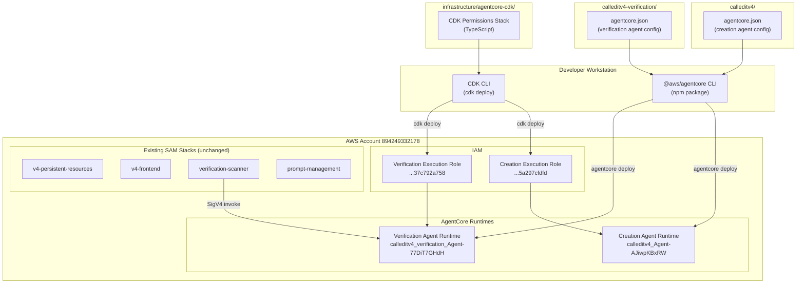

# Design Document: AgentCore CDK Migration

## Overview

This design migrates two AgentCore agent deployments from the deprecated `.bedrock_agentcore.yaml` Python toolkit to the new `@aws/agentcore` npm CLI (`agentcore.json`) with a CDK stack for IAM permissions. The migration touches three concerns:

1. **Agent deployment config** — Replace two `.bedrock_agentcore.yaml` files with two `agentcore.json` files (one per agent directory)
2. **IAM permissions** — Replace the manual `setup_agentcore_permissions.sh` shell script with a CDK stack in `infrastructure/agentcore-cdk/`
3. **Cleanup** — Deprecate/remove old config files and directories

Agent Python source code, `pyproject.toml` files, and all four SAM stacks remain untouched. Agent IDs and ARNs are preserved so the Scanner Lambda and other integrations continue working without modification.

### Key Design Decisions

- **`agentcore.json` per agent directory** rather than a monorepo `agentcore/agentcore.json` — each agent is independently deployable with `agentcore deploy` from its own directory
- **CDK (TypeScript) for IAM** — matches the `@aws/agentcore` CLI's own CDK-based deployment model and provides CloudFormation rollback safety
- **Environment variable substitution** for `BRAVE_API_KEY` — the `agentcore deploy` CLI supports `--env KEY=VALUE` flags; the `agentcore.json` declares the env vars needed, and the deploy script reads them from the shell environment
- **Import existing roles by ARN** — CDK uses `iam.Role.fromRoleArn()` to attach inline policies to the auto-created AgentCore execution roles without recreating them

## Architecture



### Deployment Flow

1. **One-time setup**: `npm install -g @aws/agentcore` and `npm install` in `infrastructure/agentcore-cdk/`
2. **IAM permissions**: `cd infrastructure/agentcore-cdk && cdk deploy` — attaches inline policies to both execution roles
3. **Deploy creation agent**: `cd calleditv4 && agentcore deploy` — updates the existing runtime using the agent ID in `agentcore.json`
4. **Deploy verification agent**: `cd calleditv4-verification && BRAVE_API_KEY=$BRAVE_API_KEY agentcore deploy` — updates the existing runtime with env vars

## Components and Interfaces

### Component 1: Creation Agent `agentcore.json`

**Location**: `calleditv4/agentcore.json`

This file replaces `calleditv4/.bedrock_agentcore.yaml`. The `@aws/agentcore` CLI reads this file when running `agentcore deploy` from the `calleditv4/` directory.

```json
{
  "agents": [
    {
      "name": "calleditv4_Agent",
      "language": "Python",
      "framework": "Strands",
      "type": "existing",
      "codeLocation": ".",
      "entrypoint": "src/main.py",
      "build": "CodeZip",
      "modelProvider": "Bedrock",
      "protocol": "HTTP",
      "networkMode": "PUBLIC",
      "memory": "shortTerm",
      "runtimeType": "PYTHON_3_12",
      "platform": "linux/arm64",
      "agentId": "calleditv4_Agent-AJiwpKBxRW",
      "aws": {
        "region": "us-west-2",
        "account": "894249332178",
        "executionRoleArn": "arn:aws:iam::894249332178:role/AmazonBedrockAgentCoreSDKRuntime-us-west-2-5a297cfdfd",
        "s3Path": "s3://bedrock-agentcore-codebuild-sources-894249332178-us-west-2"
      },
      "memoryConfig": {
        "memoryId": "calleditv4_Agent_mem-JVB6D78I1x"
      },
      "authorizerConfiguration": {
        "customJWTAuthorizer": {
          "discoveryUrl": "https://cognito-idp.us-west-2.amazonaws.com/us-west-2_GOEwUjJtv/.well-known/openid-configuration",
          "allowedClients": ["753gn25jle081ajqabpd4lbin9"]
        }
      },
      "requestHeaderConfiguration": {
        "requestHeaderAllowlist": ["Authorization"]
      },
      "observability": {
        "enabled": true
      }
    }
  ]
}
```

**Key mappings from `.bedrock_agentcore.yaml`**:
- `deployment_type: direct_code_deploy` → `build: "CodeZip"`
- `runtime_type: PYTHON_3_12` → `runtimeType: "PYTHON_3_12"`
- `memory.mode: STM_ONLY` → `memory: "shortTerm"` + `memoryConfig.memoryId`
- `bedrock_agentcore.agent_id` → `agentId` (preserves existing runtime)
- `authorizer_configuration` → `authorizerConfiguration` (same structure, camelCase)

### Component 2: Verification Agent `agentcore.json`

**Location**: `calleditv4-verification/agentcore.json`

```json
{
  "agents": [
    {
      "name": "calleditv4_verification_Agent",
      "language": "Python",
      "framework": "Strands",
      "type": "existing",
      "codeLocation": ".",
      "entrypoint": "src/main.py",
      "build": "CodeZip",
      "modelProvider": "Bedrock",
      "protocol": "HTTP",
      "networkMode": "PUBLIC",
      "memory": "none",
      "runtimeType": "PYTHON_3_10",
      "platform": "linux/amd64",
      "agentId": "calleditv4_verification_Agent-77DiT7GHdH",
      "aws": {
        "region": "us-west-2",
        "account": "894249332178",
        "executionRoleArn": "arn:aws:iam::894249332178:role/AmazonBedrockAgentCoreSDKRuntime-us-west-2-37c792a758",
        "s3Path": "s3://bedrock-agentcore-codebuild-sources-894249332178-us-west-2"
      },
      "observability": {
        "enabled": true
      }
    }
  ]
}
```

**Environment variable handling**: The verification agent requires `BRAVE_API_KEY` and `VERIFICATION_TOOLS` at runtime. These are passed via the `agentcore deploy` command:

```bash
agentcore deploy --env BRAVE_API_KEY=$BRAVE_API_KEY --env VERIFICATION_TOOLS=brave
```

A deploy helper script (`calleditv4-verification/deploy.sh`) wraps this:

```bash
#!/bin/bash
set -euo pipefail

if [ -z "${BRAVE_API_KEY:-}" ]; then
  echo "ERROR: BRAVE_API_KEY must be set in your shell environment"
  exit 1
fi

agentcore deploy \
  --env BRAVE_API_KEY="$BRAVE_API_KEY" \
  --env VERIFICATION_TOOLS="${VERIFICATION_TOOLS:-brave}"
```

### Component 3: CDK Permissions Stack

**Location**: `infrastructure/agentcore-cdk/`

**Structure**:
```
infrastructure/agentcore-cdk/
├── bin/
│   └── agentcore-cdk.ts          # CDK app entry point
├── lib/
│   └── agentcore-permissions-stack.ts  # Stack definition
├── package.json
├── tsconfig.json
├── cdk.json
└── README.md
```

**Stack design**: The stack imports both existing execution roles by ARN and attaches inline policies that exactly replicate the permissions from `setup_agentcore_permissions.sh`.

```typescript
import * as cdk from 'aws-cdk-lib';
import * as iam from 'aws-cdk-lib/aws-iam';
import { Construct } from 'constructs';

export class AgentcorePermissionsStack extends cdk.Stack {
  constructor(scope: Construct, id: string, props?: cdk.StackProps) {
    super(scope, id, props);

    const accountId = '894249332178';
    const region = 'us-west-2';

    // Import existing execution roles (not creating new ones)
    const verificationRole = iam.Role.fromRoleArn(
      this, 'VerificationRole',
      `arn:aws:iam::${accountId}:role/AmazonBedrockAgentCoreSDKRuntime-${region}-37c792a758`,
      { mutable: true }
    );

    const creationRole = iam.Role.fromRoleArn(
      this, 'CreationRole',
      `arn:aws:iam::${accountId}:role/AmazonBedrockAgentCoreSDKRuntime-${region}-5a297cfdfd`,
      { mutable: true }
    );

    // 1. Verification role: DynamoDB calledit-v4 (production)
    verificationRole.addToPrincipalPolicy(new iam.PolicyStatement({
      sid: 'CalleditV4DynamoDB',
      actions: ['dynamodb:GetItem', 'dynamodb:PutItem', 'dynamodb:UpdateItem', 'dynamodb:Query'],
      resources: [
        `arn:aws:dynamodb:${region}:${accountId}:table/calledit-v4`,
        `arn:aws:dynamodb:${region}:${accountId}:table/calledit-v4/index/*`,
      ],
    }));

    // 2. Both roles: DynamoDB calledit-v4-eval (eval isolation)
    const evalDdbPolicy = new iam.PolicyStatement({
      sid: 'CalleditV4EvalDynamoDB',
      actions: ['dynamodb:GetItem', 'dynamodb:PutItem', 'dynamodb:UpdateItem', 'dynamodb:DeleteItem'],
      resources: [`arn:aws:dynamodb:${region}:${accountId}:table/calledit-v4-eval`],
    });
    verificationRole.addToPrincipalPolicy(evalDdbPolicy);
    creationRole.addToPrincipalPolicy(evalDdbPolicy);

    // 3. Verification role: Bedrock GetPrompt
    verificationRole.addToPrincipalPolicy(new iam.PolicyStatement({
      sid: 'CalleditBedrockPrompts',
      actions: ['bedrock:GetPrompt'],
      resources: [`arn:aws:bedrock:${region}:${accountId}:prompt/*`],
    }));

    // 4. Both roles: AgentCore Browser (account-scoped + system-owned)
    const browserActions = [
      'bedrock-agentcore:CreateBrowser',
      'bedrock-agentcore:GetBrowser',
      'bedrock-agentcore:DeleteBrowser',
      'bedrock-agentcore:ListBrowsers',
      'bedrock-agentcore:StartBrowserSession',
      'bedrock-agentcore:GetBrowserSession',
      'bedrock-agentcore:StopBrowserSession',
      'bedrock-agentcore:ListBrowserSessions',
      'bedrock-agentcore:UpdateBrowserStream',
      'bedrock-agentcore:ConnectBrowserAutomationStream',
      'bedrock-agentcore:ConnectBrowserLiveViewStream',
    ];

    const browserAccountScoped = new iam.PolicyStatement({
      sid: 'BedrockAgentCoreBrowserAccountScoped',
      actions: browserActions,
      resources: [`arn:aws:bedrock-agentcore:${region}:${accountId}:browser/*`],
    });

    // System-owned browser (aws.browser.v1) uses "aws" instead of account ID
    const browserSystemOwned = new iam.PolicyStatement({
      sid: 'BedrockAgentCoreBrowserSystemOwned',
      actions: browserActions.filter(a => !a.includes('Create') && !a.includes('Delete') && !a.includes('ListBrowsers')),
      resources: [`arn:aws:bedrock-agentcore:${region}:aws:browser/*`],
    });

    verificationRole.addToPrincipalPolicy(browserAccountScoped);
    verificationRole.addToPrincipalPolicy(browserSystemOwned);
    creationRole.addToPrincipalPolicy(browserAccountScoped);
    creationRole.addToPrincipalPolicy(browserSystemOwned);
  }
}
```

**Policy mapping from shell script to CDK**:

| Shell Script Policy Name | CDK Policy Statement SID | Target Role(s) |
|---|---|---|
| `calledit-v4-dynamodb` | `CalleditV4DynamoDB` | Verification |
| `calledit-v4-eval-dynamodb` | `CalleditV4EvalDynamoDB` | Both |
| `calledit-bedrock-prompts` | `CalleditBedrockPrompts` | Verification |
| `calledit-agentcore-browser` (account) | `BedrockAgentCoreBrowserAccountScoped` | Both |
| `calledit-agentcore-browser` (system) | `BedrockAgentCoreBrowserSystemOwned` | Both |

### Component 4: Deploy Helper Scripts

**`calleditv4/deploy.sh`** — Simple wrapper:
```bash
#!/bin/bash
set -euo pipefail
agentcore deploy
```

**`calleditv4-verification/deploy.sh`** — Validates BRAVE_API_KEY before deploying:
```bash
#!/bin/bash
set -euo pipefail
if [ -z "${BRAVE_API_KEY:-}" ]; then
  echo "ERROR: BRAVE_API_KEY must be set" >&2; exit 1
fi
agentcore deploy \
  --env BRAVE_API_KEY="$BRAVE_API_KEY" \
  --env VERIFICATION_TOOLS="${VERIFICATION_TOOLS:-brave}"
```

### Component 5: Cleanup

Files to deprecate/remove after successful migration:
- `calleditv4/.bedrock_agentcore.yaml` → rename to `.bedrock_agentcore.yaml.deprecated`
- `calleditv4-verification/.bedrock_agentcore.yaml` → rename to `.bedrock_agentcore.yaml.deprecated`
- `infrastructure/agentcore-permissions/setup_agentcore_permissions.sh` → rename to `setup_agentcore_permissions.sh.deprecated`
- `calleditv4/.bedrock_agentcore/` → add to `.gitignore`
- `calleditv4-verification/.bedrock_agentcore/` → add to `.gitignore`

## Data Models

### `agentcore.json` Schema (per agent)

The `agentcore.json` file follows the `@aws/agentcore` CLI schema. Key fields:

| Field | Type | Description |
|---|---|---|
| `agents` | Array | List of agent configurations (typically one per file) |
| `agents[].name` | string | Agent name (must match existing agent name) |
| `agents[].language` | string | `"Python"` |
| `agents[].framework` | string | `"Strands"` |
| `agents[].type` | string | `"existing"` for migration (vs `"create"` for new) |
| `agents[].codeLocation` | string | Relative path to agent source root |
| `agents[].entrypoint` | string | Relative path to main.py from codeLocation |
| `agents[].build` | string | `"CodeZip"` (direct code deploy) or `"Container"` |
| `agents[].runtimeType` | string | `"PYTHON_3_12"` or `"PYTHON_3_10"` |
| `agents[].platform` | string | `"linux/arm64"` or `"linux/amd64"` |
| `agents[].protocol` | string | `"HTTP"` |
| `agents[].networkMode` | string | `"PUBLIC"` |
| `agents[].memory` | string | `"none"`, `"shortTerm"`, or `"longAndShortTerm"` |
| `agents[].agentId` | string | Existing agent ID to update (preserves identity) |
| `agents[].aws.executionRoleArn` | string | IAM execution role ARN |
| `agents[].aws.region` | string | AWS region |
| `agents[].authorizerConfiguration` | object | JWT authorizer config (creation agent only) |
| `agents[].requestHeaderConfiguration` | object | Header allowlist (creation agent only) |
| `agents[].observability.enabled` | boolean | Enable CloudWatch/X-Ray |

### CDK Stack Configuration

| Parameter | Value | Source |
|---|---|---|
| Stack name | `agentcore-permissions` | CDK app |
| Region | `us-west-2` | Hardcoded (matches agents) |
| Account | `894249332178` | Hardcoded (matches agents) |
| Verification role name | `AmazonBedrockAgentCoreSDKRuntime-us-west-2-37c792a758` | From `.bedrock_agentcore.yaml` |
| Creation role name | `AmazonBedrockAgentCoreSDKRuntime-us-west-2-5a297cfdfd` | From `.bedrock_agentcore.yaml` |

### Migration Order of Operations

To avoid downtime, the migration must follow this order:

1. **Deploy CDK permissions stack first** — This adds inline policies via CloudFormation. The existing `put-role-policy` inline policies from the shell script remain in place. CDK-managed policies use different policy names, so there's no conflict.
2. **Deploy agents via `agentcore deploy`** — Updates the existing runtimes in-place (same agent IDs). The agents continue running on the previous version until the new version is ready.
3. **Verify both agents work** — Invoke creation agent via WebSocket, invoke verification agent via SigV4.
4. **Clean up old shell-script policies** — Remove the old inline policies that were created by `setup_agentcore_permissions.sh` (they're now duplicated by CDK). This is optional — duplicate Allow policies are harmless.
5. **Deprecate old files** — Rename `.bedrock_agentcore.yaml` files and the shell script.


## Error Handling

### CDK Deployment Failures

- **CloudFormation rollback**: If `cdk deploy` fails mid-way, CloudFormation automatically rolls back all changes. No inline policies are partially applied.
- **Role not found**: If the execution role ARN is wrong, `iam.Role.fromRoleArn()` will fail at deploy time with a clear error. The CDK stack uses `{ mutable: true }` to allow policy attachment to imported roles.
- **Duplicate policy names**: The CDK-managed inline policies use CloudFormation logical IDs as policy names, which differ from the shell script's policy names (`calledit-v4-dynamodb`, etc.). During the transition period, both sets of policies coexist harmlessly (duplicate Allow statements are merged by IAM's evaluation logic).

### Agent Deployment Failures

- **`agentcore deploy` failure**: The CLI creates a new immutable version. If the new version fails to start, the DEFAULT endpoint continues serving the previous version. No downtime.
- **Missing BRAVE_API_KEY**: The `deploy.sh` script validates that `BRAVE_API_KEY` is set before calling `agentcore deploy`. If unset, the script exits with an error message before any AWS calls are made.
- **Agent ID mismatch**: If the `agentId` in `agentcore.json` doesn't match an existing runtime, the CLI will fail with a "runtime not found" error rather than silently creating a new runtime.

### Rollback Strategy

If the migration causes issues:
1. **Agent rollback**: The previous runtime version is still available. Use `agentcore` CLI or the AWS console to point the DEFAULT endpoint back to the previous version.
2. **IAM rollback**: Run `cdk destroy` to remove CDK-managed policies, then re-run `setup_agentcore_permissions.sh` to restore the original inline policies.
3. **Config rollback**: Rename `.bedrock_agentcore.yaml.deprecated` back to `.bedrock_agentcore.yaml` and use the old Python toolkit to deploy.

## Testing Strategy

### Why Property-Based Testing Does Not Apply

This feature is primarily Infrastructure as Code (CDK stack), declarative configuration files (`agentcore.json`), and deployment scripts. Per the PBT guidelines:

- **IaC (CDK)**: Use CDK assertions and snapshot tests, not PBT
- **Configuration validation**: Use schema validation and example-based tests, not PBT
- **Deployment scripts**: Use integration tests with 1-3 representative examples, not PBT

There are no pure functions with meaningful input variation, no parsers/serializers, and no business logic that would benefit from random input generation. The "inputs" are fixed configuration values that must match specific expected values.

### Unit Tests (CDK Assertions)

CDK assertions verify the synthesized CloudFormation template contains the expected resources and policies:

1. **No new IAM roles created** — Assert the template does not contain `AWS::IAM::Role` resources (roles are imported, not created)
2. **Verification role has DynamoDB calledit-v4 policy** — Assert the template contains an inline policy with GetItem, PutItem, UpdateItem, Query on the calledit-v4 table and indexes
3. **Both roles have DynamoDB calledit-v4-eval policy** — Assert eval table policy is attached to both roles
4. **Verification role has Bedrock GetPrompt policy** — Assert bedrock:GetPrompt on prompt/* resources
5. **Both roles have Browser permissions (account-scoped)** — Assert all 11 browser actions on account-scoped resources
6. **Both roles have Browser permissions (system-owned)** — Assert 7 browser session actions on `aws:browser/*` resources
7. **Permission equivalence** — Parse the shell script's policy documents and compare action+resource sets against the CDK synthesized template to ensure identical effective permissions

### Configuration Validation Tests

1. **Creation agent agentcore.json** — Validate all required fields match expected values (agent ID, role ARN, runtime type, platform, memory, authorizer, headers)
2. **Verification agent agentcore.json** — Validate all required fields match expected values (agent ID, role ARN, runtime type, platform, no memory, no authorizer)
3. **No hardcoded secrets** — Verify neither agentcore.json file contains the string pattern of an API key
4. **Deploy script validates BRAVE_API_KEY** — Verify the verification deploy script exits non-zero when BRAVE_API_KEY is unset

### Integration Tests (Manual)

1. **Deploy CDK stack** — `cd infrastructure/agentcore-cdk && cdk deploy` succeeds
2. **Deploy creation agent** — `cd calleditv4 && agentcore deploy` succeeds, agent ID preserved
3. **Deploy verification agent** — `cd calleditv4-verification && ./deploy.sh` succeeds, agent ID preserved
4. **Creation agent functional** — WebSocket connection + prediction creation works
5. **Verification agent functional** — Scanner Lambda successfully invokes verification agent
6. **Source code unchanged** — `git diff` shows no changes in `calleditv4/src/`, `calleditv4-verification/src/`, or SAM stack directories

### File Integrity Checks

Verify the migration does not modify protected files:
- All Python files in `calleditv4/src/` and `calleditv4-verification/src/`
- Both `pyproject.toml` files
- All files in the four SAM stack directories (`infrastructure/v4-persistent-resources/`, `infrastructure/v4-frontend/`, `infrastructure/verification-scanner/`, `infrastructure/prompt-management/`)
