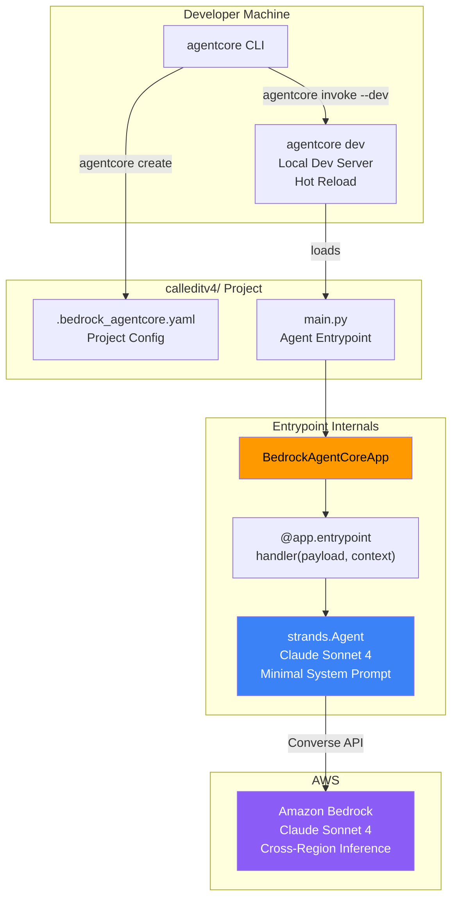
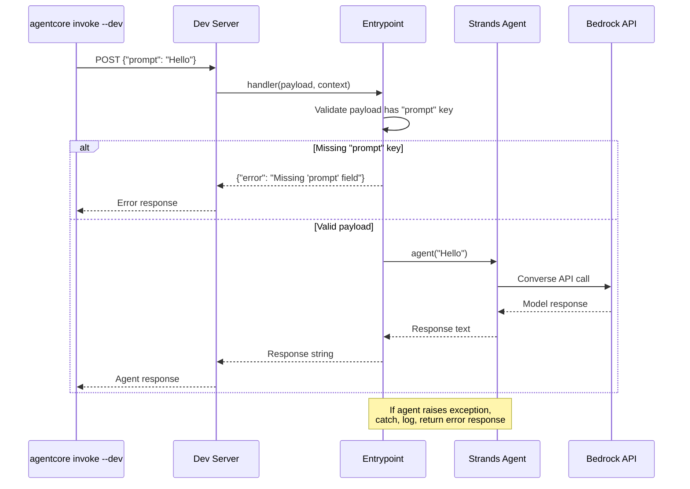

# Design Document — Spec V4-1: AgentCore Foundation

## Overview

This spec sets up the AgentCore project scaffolding for CalledIt v4 — a clean rebuild using Amazon Bedrock AgentCore as the runtime. The goal is narrow: prove that a Strands agent can run on AgentCore locally, respond to invocations, and handle errors gracefully.

The deliverable is a working `calleditv4/` project directory at `/home/wsluser/projects/calledit/calleditv4/` that:
1. Was scaffolded by `agentcore create` with the standard project structure
2. Has an entrypoint using `BedrockAgentCoreApp` + `@app.entrypoint` + `strands.Agent`
3. Uses Claude Sonnet 4 (`us.anthropic.claude-sonnet-4-20250514-v1:0`) with a minimal hardcoded system prompt
4. Starts a local dev server via `agentcore dev` with hot reload
5. Responds to `agentcore invoke --dev` with valid text responses
6. Returns structured error responses for bad payloads and agent failures

No tools, no memory, no Prompt Management wiring, no DynamoDB — those are later specs. This is pure infrastructure validation.

## Architecture

### Component Diagram



### Request Flow



## Components and Interfaces

### 1. Project Config (`.bedrock_agentcore.yaml`)

Generated by `agentcore create`. Contains:

```yaml
project_name: calleditv4
template: basic
agent_framework: Strands
model_provider: Bedrock
```

This file is read by the AgentCore CLI to configure the dev server and deployment. We don't modify it after generation.

### 2. Agent Entrypoint (`main.py`)

The single Python file that defines the agent. Follows the mandatory `BedrockAgentCoreApp` pattern from the architecture steering doc.

```python
import logging
from bedrock_agentcore.runtime import BedrockAgentCoreApp
from strands import Agent
from strands.models.bedrock import BedrockModel

logger = logging.getLogger(__name__)

app = BedrockAgentCoreApp()

SYSTEM_PROMPT = (
    "You are the CalledIt v4 foundation agent. "
    "This is a placeholder prompt for infrastructure validation. "
    "Respond helpfully to any message."
)

MODEL_ID = "us.anthropic.claude-sonnet-4-20250514-v1:0"


@app.entrypoint
def handler(payload: dict, context: dict) -> str:
    """Agent entrypoint — receives payload, returns response string."""
    # Validate payload
    if "prompt" not in payload:
        return '{"error": "Missing \'prompt\' field in payload"}'

    prompt = payload["prompt"]

    try:
        model = BedrockModel(model_id=MODEL_ID)
        agent = Agent(model=model, system_prompt=SYSTEM_PROMPT)
        response = agent(prompt)
        return str(response)
    except Exception as e:
        logger.error(f"Agent invocation failed: {e}", exc_info=True)
        return f'{{"error": "Agent invocation failed: {str(e)}"}}'


app.run()
```

**Key design decisions:**

- **Model as module-level constant**: `MODEL_ID` is a constant, not configurable via env var. This is intentional for V4-1 — env-based config comes with V4-3a when Prompt Management is wired.
- **Hardcoded system prompt**: The steering doc says "No Prompt Management wiring yet" — so we use a minimal hardcoded string. V4-3a replaces this with Prompt Management.
- **Agent created per-invocation**: Each call creates a fresh `Agent` instance. No shared state between invocations. This is correct for AgentCore — each invocation is independent.
- **Error response as JSON string**: On failure, we return a JSON-formatted error string rather than raising. This ensures the CLI always gets a parseable response.
- **Payload validation before agent creation**: We check for the `prompt` key before constructing the agent, avoiding unnecessary Bedrock API calls on bad input.

### 3. AgentCore CLI Commands

| Command | Purpose | When Used |
|---------|---------|-----------|
| `pip install bedrock-agentcore-starter-toolkit` | Install CLI + runtime | Once, during setup |
| `agentcore create --non-interactive --project-name calleditv4 --template basic --agent-framework Strands --model-provider Bedrock` | Scaffold project | Once, during setup |
| `agentcore dev` | Start local dev server with hot reload | During development |
| `agentcore invoke --dev '{"prompt": "..."}'` | Invoke agent locally | Testing |

### 4. Virtual Environment

All commands use the existing venv at `/home/wsluser/projects/calledit/venv`:

```bash
/home/wsluser/projects/calledit/venv/bin/pip install bedrock-agentcore-starter-toolkit
```

The `agentcore` CLI is installed into this venv and invoked from there.

## Data Models

### Invocation Payload (Input)

```json
{
    "prompt": "string — the user message to send to the agent"
}
```

Single field. The `prompt` key is required. Any other keys in the payload are ignored.

### Success Response (Output)

Plain text string — the agent's response. Not wrapped in JSON. Example:

```
"Hello! I'm the CalledIt v4 foundation agent. I'm working and ready to help."
```

### Error Response (Output)

JSON-formatted string with an `error` key:

```json
{
    "error": "Missing 'prompt' field in payload"
}
```

Or for agent failures:

```json
{
    "error": "Agent invocation failed: <exception message>"
}
```


## Correctness Properties

*A property is a characteristic or behavior that should hold true across all valid executions of a system — essentially, a formal statement about what the system should do. Properties serve as the bridge between human-readable specifications and machine-verifiable correctness guarantees.*

### Property 1: Valid prompt passthrough

*For any* non-empty string used as a prompt value in a payload dict, calling the entrypoint handler should pass that exact string to the Strands Agent for processing (i.e., the agent receives the same prompt the caller sent).

**Validates: Requirements 2.2**

### Property 2: Response is always a string

*For any* successful agent invocation (where the agent does not raise an exception), the entrypoint handler should return a value of type `str`.

**Validates: Requirements 2.3**

### Property 3: Agent exceptions produce structured error responses

*For any* exception raised by the Strands Agent during invocation, the entrypoint handler should catch it and return a JSON-formatted string containing an `"error"` key whose value includes the exception message.

**Validates: Requirements 2.5**

### Property 4: Missing prompt key produces structured error response

*For any* payload dict that does not contain a `"prompt"` key, the entrypoint handler should return a JSON-formatted string containing an `"error"` key indicating the missing field, without invoking the Strands Agent.

**Validates: Requirements 4.3**

## Error Handling

### Entrypoint Error Handling Strategy

The entrypoint has two error paths:

1. **Payload validation error** — The payload is missing the `prompt` key. Detected before agent creation. Returns immediately with a structured error string. No Bedrock API call is made.

2. **Agent invocation error** — The Strands Agent raises an exception (e.g., Bedrock API timeout, model throttling, invalid credentials). Caught by a `try/except Exception` block. The exception is logged with `logger.error(..., exc_info=True)` for full traceback, and a structured error string is returned.

Both error paths return a JSON-formatted string with an `"error"` key. This ensures the CLI always receives a parseable response rather than an unhandled exception.

### What We Don't Handle (Out of Scope)

- **Retry logic**: No retries on Bedrock API failures. This is V4-1 — we want to see failures clearly, not mask them.
- **Rate limiting**: No throttle handling. If Bedrock throttles, the exception surfaces in the error response.
- **Timeout configuration**: Using Strands/Bedrock defaults. Custom timeouts are a later concern.

## Testing Strategy

### Dual Testing Approach

This spec uses both unit tests and property-based tests:

- **Unit tests**: Verify specific examples (config file content, model ID, system prompt text, CLI integration)
- **Property-based tests**: Verify universal properties across generated inputs (prompt passthrough, error handling for arbitrary exceptions and payloads)

### Property-Based Testing Configuration

- **Library**: [Hypothesis](https://hypothesis.readthedocs.io/) (Python)
- **Minimum iterations**: 100 per property test
- **Tag format**: `Feature: agentcore-foundation, Property {number}: {property_text}`

Each correctness property above maps to exactly one property-based test. The tests mock the Strands Agent to avoid real Bedrock API calls — we're testing the entrypoint logic, not the model.

### Unit Tests (Examples and Edge Cases)

| Test | What It Validates | Requirement |
|------|-------------------|-------------|
| Config file has correct project name, template, framework, provider | Project scaffolding | 1.3 |
| Entrypoint file contains `BedrockAgentCoreApp`, `@app.entrypoint`, `app.run()` | Code structure | 1.4 |
| Model ID constant equals `us.anthropic.claude-sonnet-4-20250514-v1:0` | Model configuration | 2.1 |
| System prompt contains "CalledIt v4" | Prompt content | 2.4 |
| Empty payload `{}` returns error mentioning "prompt" | Edge case: empty input | 4.3 |
| Payload with wrong key `{"message": "hi"}` returns error | Edge case: wrong key | 4.3 |

### Integration Tests (Manual, Dev Server Required)

These require `agentcore dev` running and real Bedrock API access. Run manually:

```bash
# Start dev server
cd /home/wsluser/projects/calledit/calleditv4
agentcore dev

# In another terminal:
agentcore invoke --dev '{"prompt": "Hello, are you working?"}'
# Expected: Non-empty text response (Req 4.1)

agentcore invoke --dev '{"prompt": "What model are you running on?"}'
# Expected: Non-empty text response (Req 4.2)

agentcore invoke --dev '{"not_prompt": "test"}'
# Expected: Error response about missing prompt field (Req 4.3)
```

### Property Test Implementation Notes

Each property test must:
1. Reference its design property in a comment tag
2. Run at least 100 iterations
3. Mock the Strands Agent (no real API calls)
4. Use Hypothesis strategies for input generation

Example structure:

```python
from hypothesis import given, settings, strategies as st
from unittest.mock import patch, MagicMock

# Feature: agentcore-foundation, Property 1: Valid prompt passthrough
@settings(max_examples=100)
@given(prompt=st.text(min_size=1))
def test_prompt_passthrough(prompt):
    """For any non-empty prompt string, the handler passes it to the agent."""
    payload = {"prompt": prompt}
    with patch("main.Agent") as MockAgent:
        mock_agent_instance = MagicMock()
        mock_agent_instance.return_value = "response"
        MockAgent.return_value = mock_agent_instance
        handler(payload, {})
        mock_agent_instance.assert_called_once_with(prompt)
```
