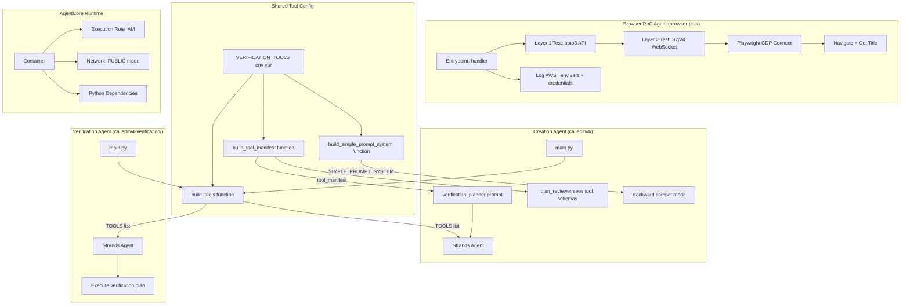
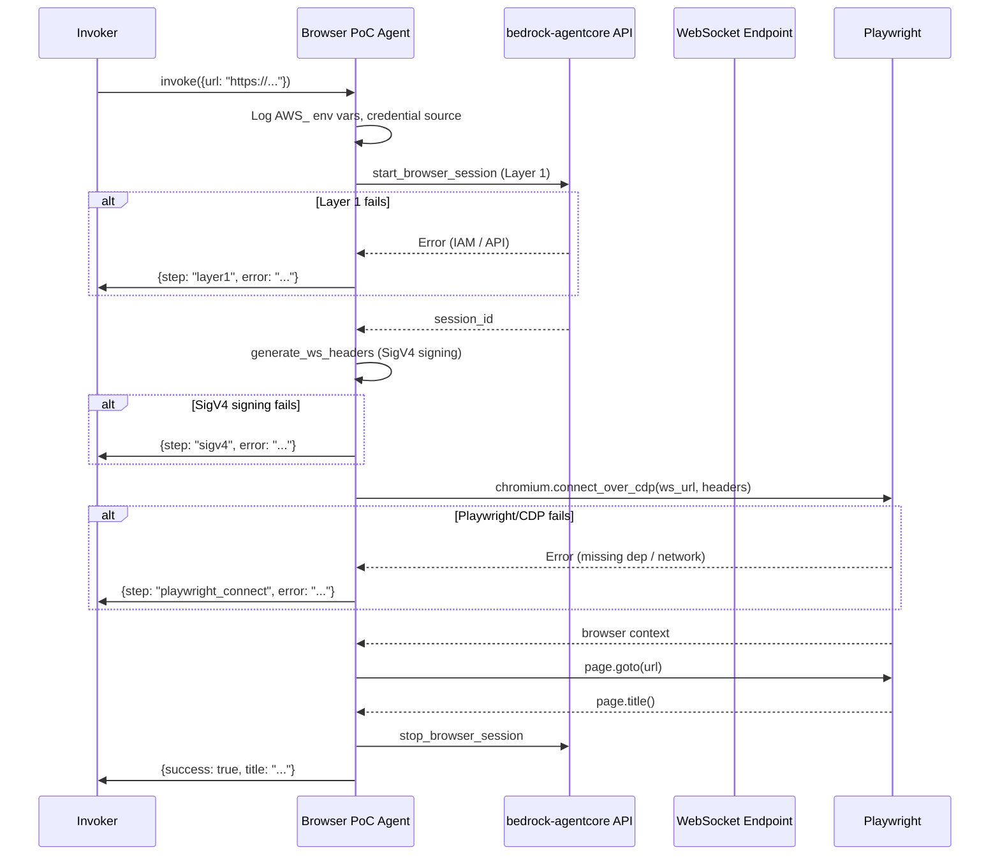

# Design Document: Browser Tool Fix

## Overview

This design addresses the silent failure of the AgentCore Browser tool inside the deployed AgentCore Runtime. The Browser tool has a two-layer architecture: Layer 1 (boto3 API calls) and Layer 2 (SigV4-signed WebSocket + Playwright CDP). Code Interpreter, which only uses Layer 1, works fine in the same runtime — pointing to Layer 2 as the failure point.

The approach is:
1. Build a minimal PoC agent that exercises each Browser layer independently with full logging
2. Use the PoC to diagnose the exact failure point (IAM, dependency, network, or runtime limitation)
3. Apply the fix (or document the limitation)
4. Make verification tools configurable via `VERIFICATION_TOOLS` env var
5. Wire Browser back into the verification agent and validate with eval runs

## Architecture



### Diagnosis Flow

The PoC agent tests each layer in sequence, logging success/failure at each step:



## Components and Interfaces

### 1. Browser PoC Agent (`browser-poc/src/main.py`)

A standalone AgentCore agent with no LLM, no DDB, no Brave Search. Its sole purpose is to exercise the Browser tool lifecycle with full logging.

**Interface:**

```python
# Entrypoint payload
{"url": str}  # URL to navigate to

# Response payload
{
    "success": bool,
    "title": str | None,          # Page title if successful
    "steps_completed": list[str], # e.g. ["env_log", "layer1", "sigv4", "cdp_connect", "navigate"]
    "failed_step": str | None,    # Step that failed, if any
    "error": str | None,          # Error message
    "error_detail": str | None,   # Full stack trace
    "env_info": {                 # Credential/env diagnostics
        "aws_region": str,
        "credential_source": str,
        "aws_env_vars": dict[str, str]  # AWS_ prefixed vars (secrets masked)
    }
}
```

**Key functions:**

| Function | Purpose |
|---|---|
| `log_environment()` | Log AWS_ env vars (mask secrets), detect credential source |
| `test_layer1(region)` | Call `BrowserClient.start_browser_session()` via boto3, return session_id |
| `test_layer2(session_id)` | Call `generate_ws_headers()`, attempt Playwright CDP connect |
| `test_navigation(page, url)` | Navigate to URL, return page title |
| `cleanup(session_id)` | Call `stop_browser_session()` |
| `handler(payload, context)` | Orchestrate all steps, catch each independently |

### 2. Shared Tool Configuration (`build_tools` / `build_tool_manifest` / `build_simple_prompt_system`)

Both the Creation Agent and Verification Agent read the same `VERIFICATION_TOOLS` env var. To guarantee they stay in sync, the tool-building logic is factored into shared functions that both agents call at startup.

These functions can live in a shared module (e.g., `shared/tool_config.py`) or be duplicated in each agent's `main.py` — the key invariant is that the same `VERIFICATION_TOOLS` value produces the same tool set in both agents.

#### `build_tools(verification_tools_env: str | None) -> list`

Builds the Strands tool callable list. Used by both agents.

```python
def build_tools(verification_tools_env: str | None) -> list:
    """Build the tool list based on VERIFICATION_TOOLS env var.
    
    Args:
        verification_tools_env: Value of VERIFICATION_TOOLS env var.
            "browser" | "brave" | "both" | None
    
    Returns:
        List of Strands tool callables.
    """
```

| `VERIFICATION_TOOLS` value | Tools included |
|---|---|
| `"brave"` (or unset/empty/unrecognized) | `brave_web_search`, `code_interpreter`, `current_time` |
| `"browser"` | `browser.browser`, `code_interpreter`, `current_time` |
| `"both"` | `brave_web_search`, `browser.browser`, `code_interpreter`, `current_time` |

#### `build_tool_manifest(verification_tools_env: str | None) -> str`

Builds the human-readable tool manifest string injected into the `verification_planner` prompt via `{{tool_manifest}}`. Used by the Creation Agent only (the Verification Agent doesn't plan — it executes).

```python
def build_tool_manifest(verification_tools_env: str | None) -> str:
    """Build a human-readable tool manifest matching the configured tools.
    
    Args:
        verification_tools_env: Value of VERIFICATION_TOOLS env var.
    
    Returns:
        Multi-line string describing available tools by name and capability.
    """
```

| `VERIFICATION_TOOLS` value | Manifest content |
|---|---|
| `"brave"` (or unset/empty/unrecognized) | Brave Search, Code Interpreter, current_time |
| `"browser"` | Browser, Code Interpreter, current_time |
| `"both"` | Browser, Brave Search, Code Interpreter, current_time |

#### `build_simple_prompt_system(verification_tools_env: str | None) -> str`

Builds the `SIMPLE_PROMPT_SYSTEM` string for backward-compat mode. Currently hardcoded to mention "Browser" — must be dynamic to match the configured tools.

```python
def build_simple_prompt_system(verification_tools_env: str | None) -> str:
    """Build the simple-mode system prompt with correct tool descriptions.
    
    Args:
        verification_tools_env: Value of VERIFICATION_TOOLS env var.
    
    Returns:
        System prompt string listing the configured tools.
    """
```

### 3. Tool Configuration in Verification Agent (`calleditv4-verification/src/main.py`)

Replaces the hardcoded `TOOLS` list with a call to `build_tools()`.

**Interface (unchanged from original design):**

```python
def build_tools(verification_tools_env: str | None) -> list:
    """Build the tool list based on VERIFICATION_TOOLS env var.
    
    Args:
        verification_tools_env: Value of VERIFICATION_TOOLS env var.
            "browser" | "brave" | "both" | None
    
    Returns:
        List of Strands tool callables.
    """
```

**Logic:**

| `VERIFICATION_TOOLS` value | Tools included |
|---|---|
| `"brave"` (or unset/empty/unrecognized) | `brave_web_search`, `code_interpreter`, `current_time` |
| `"browser"` | `browser.browser`, `code_interpreter`, `current_time` |
| `"both"` | `brave_web_search`, `browser.browser`, `code_interpreter`, `current_time` |

### 4. Creation Agent Tool Synchronization (`calleditv4/src/main.py`)

The Creation Agent currently has hardcoded `TOOLS`, `_get_tool_manifest()`, and `SIMPLE_PROMPT_SYSTEM`. All three must become dynamic, driven by `VERIFICATION_TOOLS`.

**Changes required:**

| Current (hardcoded) | New (dynamic) |
|---|---|
| `TOOLS = [browser_tool.browser, code_interpreter_tool.code_interpreter, current_time]` | `TOOLS = build_tools(os.environ.get("VERIFICATION_TOOLS"))` |
| `_get_tool_manifest()` returns static string mentioning Browser + Code Interpreter | `_get_tool_manifest()` calls `build_tool_manifest(os.environ.get("VERIFICATION_TOOLS"))` |
| `SIMPLE_PROMPT_SYSTEM` hardcoded with "Browser" and "Code Interpreter" | `SIMPLE_PROMPT_SYSTEM = build_simple_prompt_system(os.environ.get("VERIFICATION_TOOLS"))` |

**Why the Creation Agent needs tool callables (not just the manifest):**
The Strands Agent constructor receives `tools=TOOLS`. Even though the Creation Agent doesn't *execute* web searches, the LLM sees the tool schemas in its context. The plan reviewer (Turn 3) uses these schemas to assess whether the verification plan is achievable. If the schemas show Browser but the verification agent only has Brave Search, the reviewer's verifiability score is based on wrong assumptions.

**Startup logging:**
The Creation Agent SHALL log which tools are active at startup (matching Requirement 4.6 pattern), e.g.:
```
INFO: Creation agent tools configured: brave_web_search, code_interpreter, current_time (VERIFICATION_TOOLS=brave)
```

### 5. IAM Permissions (`infrastructure/agentcore-permissions/setup_agentcore_permissions.sh`)

Already has Browser permissions (Decision 144). May need updates if diagnosis reveals missing actions.

### 6. Eval Pipeline (`eval/unified_eval.py`)

No changes needed — the pipeline invokes the verification agent via `agentcore invoke`. Tool selection is controlled by the `VERIFICATION_TOOLS` env var passed at `agentcore launch` time.

## Data Models

### Browser PoC Response

```python
from pydantic import BaseModel, Field
from typing import Optional, Dict, List

class EnvInfo(BaseModel):
    """Environment diagnostic information."""
    aws_region: str = Field(description="AWS region used for API calls")
    credential_source: str = Field(description="How credentials were obtained (env, instance-profile, assumed-role)")
    aws_env_vars: Dict[str, str] = Field(description="AWS_ prefixed env vars with secrets masked")

class BrowserPocResult(BaseModel):
    """Result of the Browser PoC diagnostic run."""
    success: bool = Field(description="Whether the full Browser lifecycle succeeded")
    title: Optional[str] = Field(default=None, description="Page title if navigation succeeded")
    steps_completed: List[str] = Field(default_factory=list, description="Steps that completed successfully")
    failed_step: Optional[str] = Field(default=None, description="Step that failed, if any")
    error: Optional[str] = Field(default=None, description="Error message if failed")
    error_detail: Optional[str] = Field(default=None, description="Full stack trace if failed")
    env_info: Optional[EnvInfo] = Field(default=None, description="Environment diagnostics")
```

### Tool Configuration

No new data model needed. The `build_tools()` function reads a string env var and returns a list of callables. The existing `TOOLS` module-level variable is replaced by a call to `build_tools()`.

### Existing Models (Unchanged)

- `VerificationResult` — verdict, confidence, evidence, reasoning (in `calleditv4-verification/src/models.py`)
- `EvidenceItem` — source, finding, relevant_to_criteria
- Brave Search response — JSON with `results` array (in `calleditv4-verification/src/brave_search.py`)


## Correctness Properties

*A property is a characteristic or behavior that should hold true across all valid executions of a system — essentially, a formal statement about what the system should do. Properties serve as the bridge between human-readable specifications and machine-verifiable correctness guarantees.*

Most requirements in this feature are integration/deployment concerns (PoC agent behavior against live services, eval pipeline runs, documentation updates) that cannot be meaningfully property-tested. The three testable areas are the environment variable filtering logic, the tool configuration logic, and the creation agent tool synchronization logic.

### Property 1: AWS environment variable filtering masks secrets

*For any* dictionary of environment variables, the `filter_aws_env_vars` function should return only keys starting with `AWS_`, and any key containing `SECRET`, `TOKEN`, or `SESSION` (case-insensitive) should have its value replaced with `***MASKED***`.

**Validates: Requirements 2.3**

### Property 2: Tool configuration correctness

*For any* string value of `VERIFICATION_TOOLS`, the `build_tools` function should return a tool list that:
- Contains `code_interpreter` and `current_time` always
- Contains `browser` (and not `brave_web_search`) when the value is `"browser"`
- Contains `brave_web_search` (and not `browser`) when the value is `"brave"`
- Contains both `browser` and `brave_web_search` when the value is `"both"`
- Defaults to the `"brave"` tool set for any other value, including `None`, empty string, or unrecognized strings

**Validates: Requirements 4.1, 4.2, 4.3, 4.4, 4.5, 4.7, 5.1, 5.2**

### Property 3: Creation agent tool set equivalence

*For any* string value of `VERIFICATION_TOOLS`, the set of web tool names present in the Creation Agent's `build_tools()` output, `build_tool_manifest()` output, and `build_simple_prompt_system()` output SHALL be identical to the set of web tool names present in the Verification Agent's `build_tools()` output. Specifically:
- The tool callables returned by `build_tools(value)` are the same regardless of which agent calls it (same function, same input → same output)
- The tool names mentioned in `build_tool_manifest(value)` match exactly the web tools in `build_tools(value)` (no phantom tools, no missing tools)
- The tool names described in `build_simple_prompt_system(value)` match exactly the web tools in `build_tools(value)`

This property ensures that the planner never references a tool the verification agent doesn't have, and the reviewer never scores verifiability based on a tool that won't be available at execution time.

**Validates: Requirements 9.1, 9.2, 9.3, 9.4, 9.6, 9.7, 9.10**

## Error Handling

### Browser PoC Agent

Each step of the Browser lifecycle is wrapped in its own try/except. Failures at any step:
- Log the full exception with `exc_info=True`
- Record the failed step name and error message in the response
- Skip remaining steps (no point testing Layer 2 if Layer 1 failed)
- Always attempt session cleanup in a `finally` block
- Never raise unhandled exceptions — always return a structured `BrowserPocResult`

### Tool Configuration (`build_tools`)

- Unrecognized `VERIFICATION_TOOLS` values: log a warning, fall back to `"brave"`
- `None` or empty string: silently default to `"brave"` (no warning, this is expected)
- If `AgentCoreBrowser` initialization fails (e.g., missing playwright): log error with stack trace, exclude browser from tool list, continue with remaining tools
- If `brave_web_search` import fails: log error, exclude from tool list

### Verification Agent (existing patterns, unchanged)

- `_run_verification` never raises — returns `_make_inconclusive` on any error
- DDB load failures return a JSON error response
- DDB update failures are logged but don't affect the returned verdict
- Prompt fetch failures return inconclusive with the error message

## Testing Strategy

### Property-Based Tests

Use `hypothesis` (already in the project's dev dependencies) for property-based testing. Each property test runs a minimum of 100 iterations.

**Property 1 test** (`browser-poc/tests/test_env_filter.py`):
- Generate random dictionaries with string keys and values
- Include keys with and without `AWS_` prefix
- Include keys containing SECRET/TOKEN/SESSION variants
- Assert: only `AWS_`-prefixed keys in output, sensitive values masked

```
# Feature: browser-tool-fix, Property 1: AWS environment variable filtering masks secrets
```

**Property 2 test** (`calleditv4-verification/tests/test_tool_config.py`):
- Generate random strings for `VERIFICATION_TOOLS` values
- For the three valid values (`"browser"`, `"brave"`, `"both"`), assert the correct tool composition
- For all other generated strings, assert the output matches the `"brave"` configuration
- Assert `code_interpreter` and `current_time` are always present

```
# Feature: browser-tool-fix, Property 2: Tool configuration correctness
```

**Property 3 test** (`calleditv4/tests/test_tool_sync.py`):
- Generate random strings for `VERIFICATION_TOOLS` values
- For each value, call `build_tools(value)`, `build_tool_manifest(value)`, and `build_simple_prompt_system(value)`
- Extract web tool names from each output (tool callable names from `build_tools`, tool names mentioned in manifest text, tool names described in simple prompt)
- Assert all three sets of web tool names are identical
- Assert the web tool names match what `build_tools(value)` would produce for the Verification Agent (same function, so this is trivially true if both agents use the same `build_tools`)

```
# Feature: browser-tool-fix, Property 3: Creation agent tool set equivalence
```

### Unit Tests

Unit tests cover specific examples and edge cases that complement the property tests:

**`build_tools` examples** (`calleditv4-verification/tests/test_tool_config.py`):
- `VERIFICATION_TOOLS="browser"` → tool list contains browser, not brave
- `VERIFICATION_TOOLS="brave"` → tool list contains brave, not browser
- `VERIFICATION_TOOLS="both"` → tool list contains both
- `VERIFICATION_TOOLS=None` → defaults to brave
- `VERIFICATION_TOOLS=""` → defaults to brave
- `VERIFICATION_TOOLS="BROWSER"` → case handling (falls back to brave or is case-insensitive — design decision)
- `VERIFICATION_TOOLS="invalid"` → falls back to brave with warning logged

**`build_tool_manifest` / `build_simple_prompt_system` examples** (`calleditv4/tests/test_tool_sync.py`):
- `VERIFICATION_TOOLS="browser"` → manifest mentions "Browser", not "Brave Search"; simple prompt mentions "Browser"
- `VERIFICATION_TOOLS="brave"` → manifest mentions "Brave Search", not "Browser"; simple prompt mentions "Brave Search"
- `VERIFICATION_TOOLS="both"` → manifest mentions both; simple prompt mentions both
- `VERIFICATION_TOOLS=None` → defaults to brave in all three outputs
- `VERIFICATION_TOOLS="invalid"` → defaults to brave in all three outputs

**`filter_aws_env_vars` examples** (`browser-poc/tests/test_env_filter.py`):
- Empty dict → empty dict
- Dict with no AWS_ keys → empty dict
- `AWS_REGION` → included, value visible
- `AWS_SECRET_ACCESS_KEY` → included, value masked
- `AWS_SESSION_TOKEN` → included, value masked
- `HOME`, `PATH` → excluded

**Browser PoC response structure** (`browser-poc/tests/test_poc_models.py`):
- Valid `BrowserPocResult` with all fields
- Failed result with `failed_step` and `error` populated
- `EnvInfo` model validation

### Integration Tests (Manual)

These are run manually by the developer, not in CI:

1. `agentcore dev` → invoke PoC with `{"url": "https://en.wikipedia.org/wiki/Main_Page"}` → verify success locally
2. `agentcore launch` → invoke PoC → compare logs between local and deployed
3. `agentcore launch --env VERIFICATION_TOOLS=browser` → invoke verification agent with smoke test cases
4. Full eval run via `eval/unified_eval.py --dynamic-dataset`
