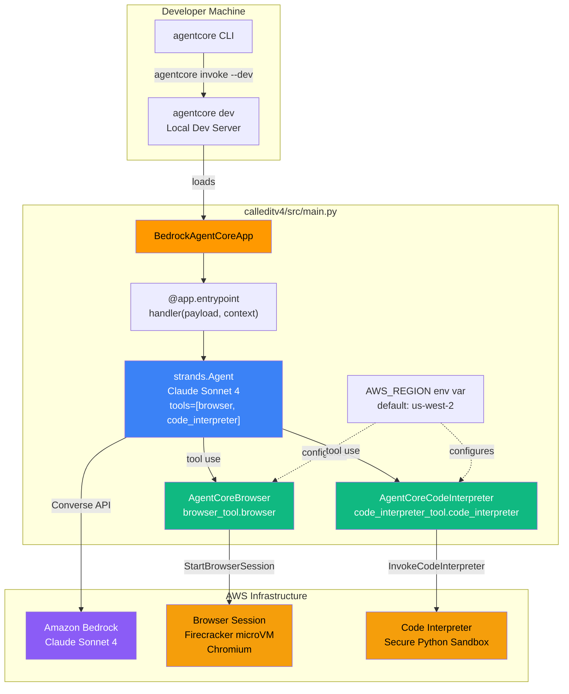
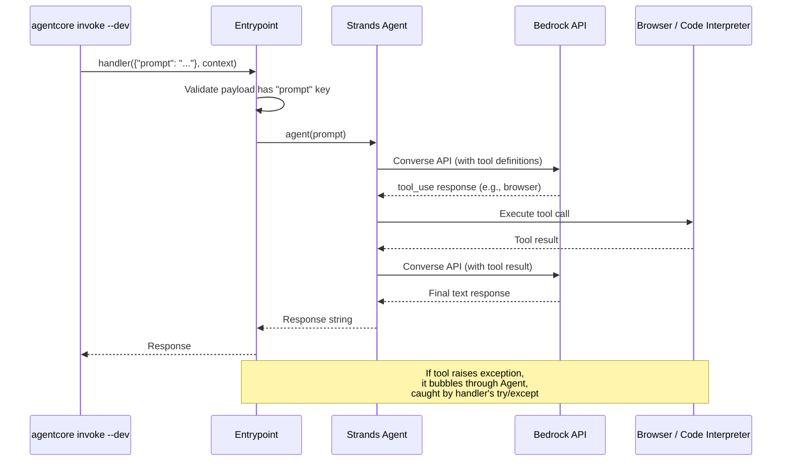

# Design Document — Spec V4-2: Built-in Tools

## Overview

This spec wires AgentCore Browser and AgentCore Code Interpreter into the CalledIt v4 agent entrypoint (`calleditv4/src/main.py`). The agent gains two capabilities: browsing the web (URL navigation, search, content extraction) and executing Python code (calculations, date math, data analysis).

Both tools run in AWS infrastructure — Firecracker microVMs for Browser, secure sandboxes for Code Interpreter. They require only IAM permissions, zero external API keys, zero Gateway setup (Decision 93). This replaces the local MCP subprocesses from v3 (Decision 91), eliminating the 30-second cold start.

The change is surgical: we add ~10 lines to `main.py` (imports, tool instantiation, tools parameter, updated system prompt) and two packages to `pyproject.toml`. The existing error handling in `handler()` already catches tool exceptions since they bubble up through the Strands Agent.

Out of scope: Gateway with domain-specific APIs (Phase 2), Prompt Management (V4-3a), DynamoDB (V4-3a), Memory (V4-6), Verification agent (V4-5), production deployment (V4-8).

## Architecture

### Component Diagram



### Request Flow (Tool Invocation)



## Components and Interfaces

### 1. Updated Entrypoint (`calleditv4/src/main.py`)

The updated entrypoint adds tool imports, module-level tool instantiation, and passes the tools list to the Agent constructor.

```python
import json
import logging
import os

from bedrock_agentcore.runtime import BedrockAgentCoreApp
from strands import Agent
from strands.models.bedrock import BedrockModel
from strands_tools.browser import AgentCoreBrowser
from strands_tools.code_interpreter import AgentCoreCodeInterpreter

logger = logging.getLogger(__name__)

app = BedrockAgentCoreApp()

AWS_REGION = os.environ.get("AWS_REGION", "us-west-2")

SYSTEM_PROMPT = (
    "You are the CalledIt v4 agent. "
    "You have access to two tools:\n"
    "1. Browser — navigate URLs, search the web, extract content from web pages. "
    "Use this when you need to look up current information, verify facts, or read web content.\n"
    "2. Code Interpreter — execute Python code in a secure sandbox. "
    "Use this for calculations, date math, data analysis, or any task that benefits from running code.\n"
    "Use the appropriate tool when the user's request would benefit from it. "
    "Respond helpfully to any message."
)

MODEL_ID = "us.anthropic.claude-sonnet-4-20250514-v1:0"

# Tool instances — lightweight config objects, no connections until agent uses them
browser_tool = AgentCoreBrowser(region=AWS_REGION)
code_interpreter_tool = AgentCoreCodeInterpreter(region=AWS_REGION)

TOOLS = [browser_tool.browser, code_interpreter_tool.code_interpreter]


@app.entrypoint
def handler(payload: dict, context: dict) -> str:
    """Agent entrypoint — receives payload, returns response string."""
    if "prompt" not in payload:
        return json.dumps({"error": "Missing 'prompt' field in payload"})

    prompt = payload["prompt"]

    try:
        model = BedrockModel(model_id=MODEL_ID)
        agent = Agent(model=model, system_prompt=SYSTEM_PROMPT, tools=TOOLS)
        response = agent(prompt)
        return str(response)
    except Exception as e:
        logger.error(f"Agent invocation failed: {e}", exc_info=True)
        return json.dumps({"error": f"Agent invocation failed: {str(e)}"})


if __name__ == "__main__":
    app.run()
```

**Key design decisions:**

- **Tools instantiated at module level**: `AgentCoreBrowser` and `AgentCoreCodeInterpreter` are lightweight config objects — they hold a region string and don't open connections until the agent actually invokes them. Module-level instantiation avoids re-creating them on every request.
- **TOOLS as a module-level list**: The tools list is a constant. This makes it importable for testing (verify tool count, types) without invoking the agent.
- **Region from env var**: `AWS_REGION` env var with `us-west-2` default. This matches the AgentCore convention and allows override in different environments.
- **System prompt updated**: Describes both tools so the model knows when to use them. Kept concise — the model is smart enough without verbose instructions.
- **No new error handling**: Tool exceptions bubble up through the Strands Agent and are caught by the existing `try/except Exception` in `handler()`. No tool-specific error handling needed.
- **No mocks in tests (Decision 96)**: Tests verify pure logic (constants, config, tool list composition). Integration testing via `agentcore invoke --dev`.

### 2. Dependencies

No additional pip packages needed beyond what V4-1 already installed. `strands-agents-tools` (already present) provides both `AgentCoreBrowser` and `AgentCoreCodeInterpreter`. The `playwright` and `nest-asyncio` packages listed in the AgentCore quickstart docs are for an alternative Playwright-based integration path — `AgentCoreBrowser` communicates with the AWS-hosted Chromium via the AgentCore SDK directly.

### 3. IAM Permissions (Dev Identity)

The developer's AWS identity needs these permissions for local dev (`agentcore dev` / `agentcore invoke --dev`):

**Browser tool:**
- `bedrock-agentcore:StartBrowserSession`
- `bedrock-agentcore:StopBrowserSession`
- `bedrock-agentcore:ConnectBrowserAutomationStream`

**Code Interpreter tool:**
- `bedrock-agentcore:StartCodeInterpreterSession`
- `bedrock-agentcore:InvokeCodeInterpreter`
- `bedrock-agentcore:StopCodeInterpreterSession`

These are added to the dev IAM policy. Not managed by this spec — the developer configures their own IAM.

## Data Models

### Invocation Payload (Input)

Unchanged from V4-1:

```json
{
    "prompt": "string — the user message to send to the agent"
}
```

The agent decides whether to use tools based on the prompt content. No explicit tool selection in the payload.

### Success Response (Output)

Plain text string — the agent's response. May include results from tool invocations (web content, code output). Example:

```
"The current price of AAPL is $198.50 according to the latest data I found."
```

### Error Response (Output)

Unchanged from V4-1. JSON-formatted string with an `error` key:

```json
{
    "error": "Agent invocation failed: <exception message>"
}
```

Tool exceptions surface through this same path — they bubble up through the Agent and are caught by the handler's `try/except`.

### Module-Level Exports (Testable Constants)

| Export | Type | Purpose |
|--------|------|---------|
| `AWS_REGION` | `str` | Region for tool sessions |
| `SYSTEM_PROMPT` | `str` | Agent system prompt |
| `MODEL_ID` | `str` | Bedrock model identifier |
| `browser_tool` | `AgentCoreBrowser` | Browser tool instance |
| `code_interpreter_tool` | `AgentCoreCodeInterpreter` | Code interpreter tool instance |
| `TOOLS` | `list` | Tool callables passed to Agent |
| `handler` | `function` | Entrypoint function |


## Correctness Properties

*A property is a characteristic or behavior that should hold true across all valid executions of a system — essentially, a formal statement about what the system should do. Properties serve as the bridge between human-readable specifications and machine-verifiable correctness guarantees.*

Most acceptance criteria in this spec fall into two categories: (1) structural/configuration checks best tested as specific examples, and (2) LLM tool-selection behavior that's non-deterministic and only testable via manual integration. One property emerges from the error handling requirements.

### Property 1: Tool exceptions produce structured error responses

*For any* exception raised during agent invocation (including exceptions from the Browser tool or Code Interpreter tool), the entrypoint handler should catch it and return a JSON-formatted string containing an `"error"` key whose value includes the exception message.

**Validates: Requirements 2.5, 3.5**

This consolidates the browser exception handling (2.5) and code interpreter exception handling (3.5) into a single property. Both tool types raise exceptions that bubble through the Strands Agent and are caught by the same `try/except Exception` block in `handler()`. The handler doesn't distinguish between tool types — all exceptions follow the same path.

### Property 2: TOOLS list contains exactly two callable tools

*For any* import of the entrypoint module, the `TOOLS` list should contain exactly 2 elements, and each element should be callable.

**Validates: Requirements 1.5**

This verifies the structural invariant that both tools are wired into the tools list. While this could be tested as a simple example, the "for any import" framing ensures the module-level initialization is deterministic and always produces the correct tool list.

## Error Handling

### Tool Exception Handling

Tool exceptions follow the same path as any other agent exception — they bubble up through the Strands Agent and are caught by the handler's existing `try/except Exception` block.

```
Tool raises exception
  → Strands Agent propagates it
    → handler() catches via try/except Exception
      → Logs with logger.error(..., exc_info=True)
        → Returns json.dumps({"error": f"Agent invocation failed: {str(e)}"})
```

No tool-specific error handling is needed. The existing V4-1 error handling covers all tool failure modes:

- **Browser session failures**: Connection timeouts, session limits, page load errors
- **Code interpreter failures**: Syntax errors in generated code, execution timeouts, sandbox limits
- **Region misconfiguration**: Invalid region → tool instantiation or session creation fails
- **IAM permission errors**: Missing `bedrock-agentcore:Start*Session` permissions → access denied

All of these surface as exceptions with descriptive messages that end up in the error response.

### What We Don't Handle (Out of Scope)

- **Tool-specific retry logic**: No retries on tool failures. If a browser session times out, the error surfaces. Retry logic is a later concern.
- **Tool fallback**: If one tool fails, we don't fall back to the other. The agent decides tool selection, not the entrypoint.
- **Session cleanup**: AgentCore manages browser/code interpreter session lifecycle. We don't explicitly close sessions.

## Testing Strategy

### Dual Testing Approach

This spec uses unit tests and manual integration tests. Property-based tests are used where universal properties exist.

- **Unit tests**: Verify structural correctness (tool list composition, system prompt content, region config, dependency presence)
- **Property-based tests**: Verify the error handling property across generated exception types
- **Manual integration tests**: Verify actual tool invocation via `agentcore invoke --dev` (requires real Bedrock + AgentCore access)

No mocks (Decision 96). Tests either exercise pure logic (importable constants, list structure) or require real services (manual integration).

### Property-Based Testing Configuration

- **Library**: [Hypothesis](https://hypothesis.readthedocs.io/) (Python)
- **Minimum iterations**: 100 per property test
- **Tag format**: `Feature: builtin-tools, Property {number}: {property_text}`
- Each correctness property is implemented by a single property-based test

### Unit Tests (Examples and Edge Cases)

| Test | What It Validates | Requirement |
|------|-------------------|-------------|
| `TOOLS` list has exactly 2 elements | Both tools wired in | 1.5 |
| Each element in `TOOLS` is callable | Tools are valid callables | 1.5 |
| `SYSTEM_PROMPT` contains "Browser" | Browser described in prompt | 2.4 |
| `SYSTEM_PROMPT` contains "Code Interpreter" | Code interpreter described in prompt | 3.4 |
| `AWS_REGION` defaults to `"us-west-2"` | Default region config | 1.4 |
| `browser_tool` is an `AgentCoreBrowser` instance | Correct tool type | 1.2 |
| `code_interpreter_tool` is an `AgentCoreCodeInterpreter` instance | Correct tool type | 1.3 |
| `pyproject.toml` contains `playwright` | Dependency tracked | 1.6 |
| `pyproject.toml` contains `nest-asyncio` | Dependency tracked | 1.6 |
| Missing prompt key still returns error (unchanged from V4-1) | Payload validation preserved | 1.5 |

### Property-Based Tests

| Property | Test Description | Iterations |
|----------|-----------------|------------|
| Property 1: Tool exceptions → structured error | Generate random exception types and messages, verify handler returns JSON with "error" key containing the message | 100 |
| Property 2: TOOLS list invariant | Verify TOOLS always has 2 callable elements (deterministic, but validates the structural invariant) | N/A (unit test) |

Note: Property 2 is deterministic (module-level constant), so it's implemented as a unit test rather than a Hypothesis property test. The "for any import" framing is validated by the test running at all.

### Integration Tests (Manual, Dev Server Required)

These require `agentcore dev` running and real AWS access with the correct IAM permissions.

```bash
# Start dev server
cd /home/wsluser/projects/calledit/calleditv4
agentcore dev

# In another terminal:

# Test browser tool — web search (Req 2.2)
agentcore invoke --dev '{"prompt": "Search the web for the current weather in Seattle"}'

# Test browser tool — URL navigation (Req 2.1)
agentcore invoke --dev '{"prompt": "Go to https://example.com and tell me what the page says"}'

# Test code interpreter — calculation (Req 3.1)
agentcore invoke --dev '{"prompt": "Calculate the compound interest on $10000 at 5% for 10 years"}'

# Test code interpreter — date math (Req 3.2)
agentcore invoke --dev '{"prompt": "How many days between January 15, 2024 and March 30, 2025?"}'

# Test both tools in one prompt
agentcore invoke --dev '{"prompt": "Look up the current population of Tokyo and calculate what percentage it is of Japan total population of 125 million"}'

# Test payload validation still works (Req 1.5 — unchanged from V4-1)
agentcore invoke --dev '{"not_prompt": "test"}'
```

### Test File Location

Tests go in `calleditv4/tests/test_builtin_tools.py`, alongside the existing `test_entrypoint.py`.
