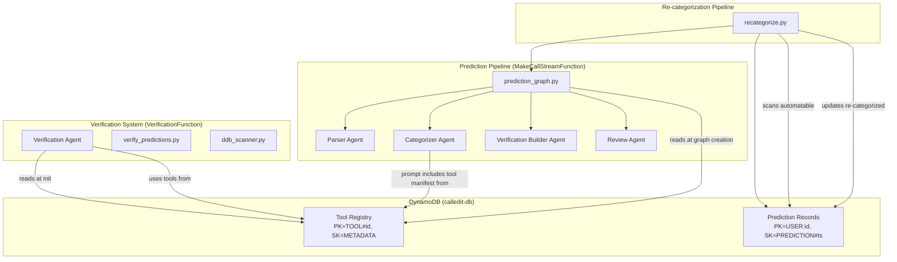
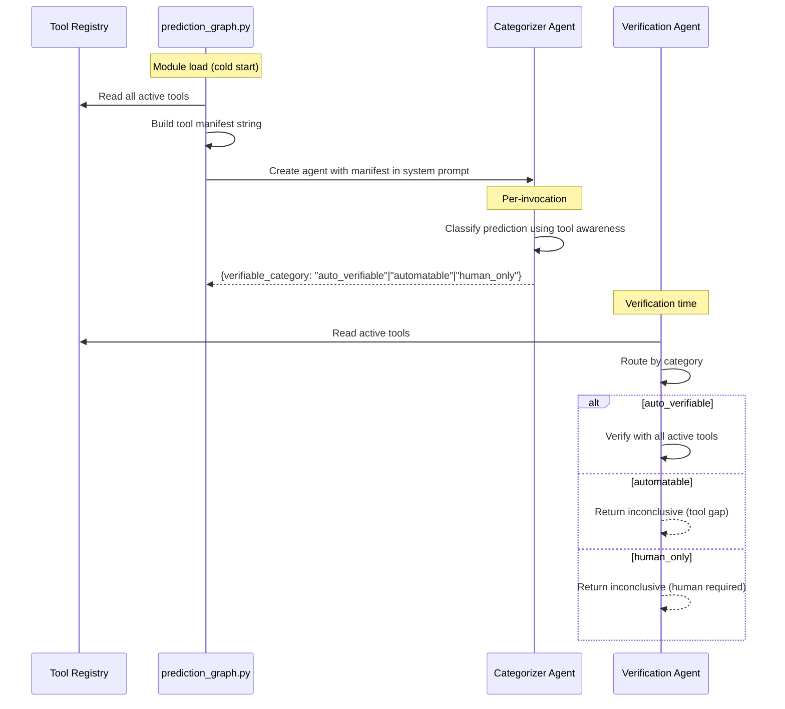

# Design Document: Category Simplification & Tool Registry

## Overview

This design simplifies the CalledIt prediction verifiability system from 5 categories to 3 (`auto_verifiable`, `automatable`, `human_only`), introduces a DynamoDB-backed tool registry, adds a web search tool, builds a re-categorization pipeline, upgrades the verification agent to Sonnet 4, and cleans up legacy data.

The core architectural insight: the old 5-category system encoded *which tool* (current_time, strands, API) rather than *whether a tool exists*. The new 3-category system encodes verifiability intent — `auto_verifiable` is a growing bucket that expands every time a tool is registered.

### Key Changes

1. **Category taxonomy**: 5 → 3 categories across categorizer agent, verification agent, and pipeline fallbacks
2. **Tool registry**: DynamoDB records (`TOOL#{id}`, `METADATA`) describing available tools
3. **Dynamic categorizer prompt**: Tool manifest injected at graph creation time (cached by SnapStart)
4. **Web search tool**: First registered `@tool` using Python `requests`, wired into verification agent
5. **Re-categorization pipeline**: Scan `automatable` predictions, re-run full graph, update DDB
6. **Verification agent upgrade**: `claude-3-sonnet-20241022` → `us.anthropic.claude-sonnet-4-20250514-v1:0`
7. **Data cleanup**: Delete all prediction records, keep tool registry and connection records

## Architecture

### System Context



### Data Flow for Category Decision



### Impact on Existing Singleton Pattern

The categorizer agent is currently a module-level singleton with a static system prompt. This design changes it to a **dynamic prompt built at graph creation time** — the tool manifest is appended to the base prompt. Since `create_prediction_graph()` runs at module level and SnapStart caches the result, this is still effectively a singleton. The prompt only changes on cold start or new deployment (when the tool registry may have changed).

## Components and Interfaces

### Component 1: Category Constants & Categorizer Agent Update

**File**: `categorizer_agent.py`

**Changes**:
- Replace `VALID_CATEGORIES` set: `{"auto_verifiable", "automatable", "human_only"}`
- Rewrite `CATEGORIZER_SYSTEM_PROMPT` with 3-category descriptions and examples
- Add `tool_manifest` parameter to `create_categorizer_agent(tool_manifest: str = "") -> Agent`
- Append tool manifest to system prompt when non-empty

**New System Prompt Structure**:
```
You are a verifiability categorizer. Classify predictions into exactly one category:

1. auto_verifiable - Can be verified NOW using reasoning plus currently available tools.
   The agent has the tools and knowledge needed to determine truth.
   Examples: "Sun will rise tomorrow" (reasoning), "Current weather in Seattle" (web search tool)

2. automatable - Cannot be verified today, but an agent could plausibly find or build
   a tool to verify it. This is the work queue for future tool development.
   Examples: "Bitcoin hits $100k by December" (needs price API not yet registered)

3. human_only - Requires subjective judgment or personal information that no tool
   or stored context can provide.
   Examples: "I will feel happy tomorrow", "The movie will be good"

AVAILABLE TOOLS:
{tool_manifest or "No tools currently registered. Rely on pure reasoning for auto_verifiable."}

IMPORTANT: If an available tool's capabilities match the prediction's verification needs,
classify as auto_verifiable. If no tool matches but one could plausibly exist, classify
as automatable.

Return ONLY the raw JSON object...
{json format}

REFINEMENT MODE...
```

**Interface**:
```python
def create_categorizer_agent(tool_manifest: str = "") -> Agent:
    """Create categorizer with optional tool manifest injected into prompt."""
```

### Component 2: Tool Registry Reader

**File**: `tool_registry.py` (new file in `handlers/strands_make_call/`)

**Purpose**: Read tool records from DynamoDB and build a tool manifest string for prompt injection.

**Interface**:
```python
def read_active_tools(table_name: str = "calledit-db") -> list[dict]:
    """
    Read all active tool records from DynamoDB.
    Returns list of tool dicts with: name, description, capabilities, input_schema, output_schema.
    Filters on status='active'.
    """

def build_tool_manifest(tools: list[dict]) -> str:
    """
    Build a human-readable tool manifest string from tool records.
    Format:
      - web_search: Performs web searches to verify factual claims.
        Capabilities: weather, sports scores, stock prices, news, factual claims
    Returns empty string if no tools.
    """
```

**DynamoDB Access Pattern**:
- Scan with `FilterExpression: begins_with(PK, 'TOOL#') AND status = 'active'`
- Called once at module level in `prediction_graph.py` (cached by SnapStart)
- No GSI needed — tool count is small (< 50 expected)

### Component 3: Prediction Graph Update

**File**: `prediction_graph.py`

**Changes to `create_prediction_graph()`**:
1. Import and call `read_active_tools()` + `build_tool_manifest()`
2. Pass `tool_manifest` to `create_categorizer_agent(tool_manifest)`
3. Update fallback category in `parse_pipeline_results()`: `"human_verifiable_only"` → `"human_only"`

**Updated flow**:
```python
def create_prediction_graph():
    # NEW: Read tool registry and build manifest
    tools = read_active_tools()
    tool_manifest = build_tool_manifest(tools)

    parser = create_parser_agent()
    categorizer = create_categorizer_agent(tool_manifest)  # NEW: pass manifest
    vb = create_verification_builder_agent()
    review = create_review_agent()
    # ... rest unchanged
```

### Component 4: Verification Agent Overhaul

**File**: `verification_agent.py`

**Changes**:
- Upgrade model: `claude-3-sonnet-20241022` → `us.anthropic.claude-sonnet-4-20250514-v1:0`
- Replace old `strands_agents` import with `strands` (current SDK)
- Simplify routing from 5 categories + unknown to 3 categories + unknown
- Load active tools from registry for `auto_verifiable` verification
- Remove `error_handling` import (module was deleted)
- Remove `mock_strands` import (use proper SDK)

**New routing**:
```python
def verify_prediction(self, prediction):
    category = prediction.get('verifiable_category', 'unknown')
    if category == 'auto_verifiable':
        return self._verify_with_tools(...)      # All active registry tools
    elif category == 'automatable':
        return self._mark_tool_gap(...)           # Inconclusive, tool gap
    elif category == 'human_only':
        return self._mark_human_required(...)     # Inconclusive, human needed
    else:
        return self._handle_unknown_category(...) # Fallback
```

### Component 5: Web Search Tool

**File**: `web_search_tool.py` (new file in `handlers/verification/`)

**Purpose**: Strands `@tool` that performs HTTP requests to search the web for factual verification.

**Interface**:
```python
@tool
def web_search(query: str) -> str:
    """
    Search the web for information to verify factual claims.
    
    Args:
        query: Search query string
        
    Returns:
        JSON string with search results or structured error
    """
```

**Implementation approach**:
- Uses Python `requests` library with a search API (e.g., DuckDuckGo instant answer API or similar free endpoint)
- Timeout: 10 seconds
- Returns structured JSON: `{"results": [...], "query": "...", "status": "success"}`
- On error: `{"error": "...", "query": "...", "status": "error"}` — never raises

**Tool Registry Record** (seeded manually or via script):
```json
{
    "PK": "TOOL#web_search",
    "SK": "METADATA",
    "name": "web_search",
    "description": "Performs web searches to verify factual claims about current events, weather, sports, stocks, and other web-accessible data.",
    "capabilities": ["weather", "sports scores", "stock prices", "news", "factual claims"],
    "input_schema": {"type": "object", "properties": {"query": {"type": "string"}}},
    "output_schema": {"type": "object", "properties": {"results": {"type": "array"}, "status": {"type": "string"}}},
    "status": "active",
    "added_date": "2026-03-13T00:00:00Z"
}
```

### Component 6: Re-categorization Pipeline

**File**: `recategorize.py` (new file in `handlers/verification/` or a scripts directory)

**Purpose**: Scan `automatable` predictions, re-run each through the full prediction graph, update DDB if category changed.

**Interface**:
```python
def scan_automatable_predictions(table_name: str = "calledit-db") -> list[dict]:
    """Scan all predictions with verifiable_category = 'automatable' (or old categories for migration)."""

def recategorize_prediction(prediction: dict) -> dict:
    """Re-run a single prediction through the full prediction graph. Returns new pipeline output."""

def run_recategorization(table_name: str = "calledit-db", dry_run: bool = False) -> dict:
    """
    Main entry point. Scans, re-runs, updates.
    Returns: {"scanned": N, "recategorized": N, "unchanged": N, "errors": N}
    """
```

**Execution**: Invocable via direct Lambda invocation or local script. Not triggered automatically.

### Component 7: Pipeline Fallback & Write Path Updates

**Files**: `prediction_graph.py`, `strands_make_call_graph.py`

**Changes**:
- `parse_pipeline_results()`: Change fallback category from `"human_verifiable_only"` to `"human_only"`
- `build_prediction_ready()`: Change fallback category from `"human_verifiable_only"` to `"human_only"`
- `execute_prediction_graph()` sync wrapper: Change error fallback category to `"human_only"`
- `write_to_db.py`: No changes needed — prediction dict is spread into DDB item via `**prediction`

### Component 8: Data Cleanup Script

**File**: `cleanup_predictions.py` (new script)

**Purpose**: One-time manual deletion of all prediction records from `calledit-db`.

**Logic**:
```python
def cleanup_predictions(table_name="calledit-db", dry_run=True):
    """
    Scan for items where PK starts with 'USER:' and SK starts with 'PREDICTION#'.
    Delete each matching item. Dry run by default for safety.
    """
```

### Component 9: SAM Template Verification

**File**: `template.yaml`

**Assessment**: Both `MakeCallStreamFunction` and `VerificationFunction` already have `DynamoDBCrudPolicy` for `calledit-db`. This covers reads from the tool registry (same table). **No SAM template changes needed.**

## Data Models

### Tool Registry Record (DynamoDB)

| Field | Type | Description |
|-------|------|-------------|
| PK | String | `TOOL#{tool_id}` (e.g., `TOOL#web_search`) |
| SK | String | `METADATA` (constant) |
| name | String | Tool function name (matches `@tool` decorated function name) |
| description | String | Human-readable description for prompt injection |
| capabilities | List[String] | What the tool can verify (e.g., `["weather", "sports scores"]`) |
| input_schema | Map | JSON Schema for tool input |
| output_schema | Map | JSON Schema for tool output |
| status | String | `active` or `inactive` |
| added_date | String | ISO 8601 timestamp |

### Category Mapping (Old → New)

| Old Category | New Category | Rationale |
|---|---|---|
| `agent_verifiable` | `auto_verifiable` | Pure reasoning = auto-verifiable with no tools |
| `current_tool_verifiable` | `auto_verifiable` | current_time tool is always available |
| `strands_tool_verifiable` | `auto_verifiable` or `automatable` | Depends on whether tool is registered |
| `api_tool_verifiable` | `auto_verifiable` or `automatable` | Depends on whether matching tool exists |
| `human_verifiable_only` | `human_only` | Direct rename |

### Prediction Record (unchanged schema, new category values)

The `verifiable_category` field in prediction records will now contain one of: `auto_verifiable`, `automatable`, `human_only`. No schema change needed — the field is a string and `write_to_db.py` spreads the prediction dict into the DDB item.


## Correctness Properties

*A property is a characteristic or behavior that should hold true across all valid executions of a system — essentially, a formal statement about what the system should do. Properties serve as the bridge between human-readable specifications and machine-verifiable correctness guarantees.*

### Property 1: Category output is always valid

*For any* prediction text processed by the categorizer parsing logic, the resulting `verifiable_category` field must be one of exactly three values: `auto_verifiable`, `automatable`, or `human_only`.

**Validates: Requirements 1.1, 1.5**

### Property 2: Verification agent routes correctly by category

*For any* prediction dict with a `verifiable_category` field, the verification agent's routing logic must:
- Return a tool-based verification attempt when category is `auto_verifiable`
- Return an inconclusive result with tool gap indication when category is `automatable`
- Return an inconclusive result indicating human assessment when category is `human_only`
- Return an inconclusive fallback result for any other category string

**Validates: Requirements 2.1, 2.2, 2.3, 2.4**

### Property 3: Active tool filtering excludes inactive tools

*For any* set of tool records with mixed `status` values (`active` and `inactive`), `read_active_tools()` must return only records where `status == "active"`, and must never include a record where `status == "inactive"`.

**Validates: Requirements 4.4, 4.5**

### Property 4: Tool record schema completeness

*For any* tool record returned by `read_active_tools()`, the record must contain all required fields: `name`, `description`, `capabilities`, `input_schema`, `output_schema`, `status`, and `added_date`.

**Validates: Requirements 4.3**

### Property 5: Tool manifest contains all active tool information

*For any* list of active tool records, `build_tool_manifest()` must produce a string that contains each tool's `name` and `description`. If the tool list is empty, the manifest must be an empty string.

**Validates: Requirements 5.2**

### Property 6: Web search tool returns structured output without raising

*For any* query string input (including empty strings and unicode), the `web_search` tool must return a string that is valid JSON containing a `status` field (either `"success"` or `"error"`) and a `query` field. The tool must never raise an exception.

**Validates: Requirements 7.2, 7.5**

### Property 7: Pipeline fallback always produces a valid category

*For any* raw categorizer output string (including invalid JSON, empty strings, and malformed data), `parse_pipeline_results()` must produce a `verifiable_category` value that is one of: `auto_verifiable`, `automatable`, or `human_only`. The fallback default must be `human_only`.

**Validates: Requirements 8.1, 8.3**

### Property 8: Re-categorization scan returns only automatable predictions

*For any* set of prediction records with mixed `verifiable_category` values, `scan_automatable_predictions()` must return only records where `verifiable_category == "automatable"`.

**Validates: Requirements 9.1**

### Property 9: Re-categorization updates if and only if category changed

*For any* prediction that is re-run through the pipeline, the DynamoDB record must be updated if and only if the new `verifiable_category` differs from the original. If the category remains `automatable`, the record must not be modified.

**Validates: Requirements 9.3, 9.4**

### Property 10: Re-categorization counts are consistent

*For any* execution of the re-categorization pipeline, the returned counts must satisfy: `scanned == recategorized + unchanged + errors`.

**Validates: Requirements 9.6**

### Property 11: Cleanup deletes only prediction records

*For any* set of DynamoDB items, the cleanup function must delete only items where PK starts with `USER:` and SK starts with `PREDICTION#`. Items with PK starting with `TOOL#`, or any other PK pattern, must not be deleted.

**Validates: Requirements 11.2**

## Error Handling

### Categorizer Agent
- **Invalid tool registry read**: If DynamoDB read fails at graph creation time, log error and create categorizer with empty tool manifest (pure reasoning mode). The graph still functions — predictions default to reasoning-based categorization.
- **Invalid categorizer output**: If JSON parsing fails, fallback to `human_only` (safest category). Logged at ERROR level.

### Verification Agent
- **Tool execution failure**: If a registered tool (e.g., web_search) raises during verification, catch the exception, log at ERROR level, and fall back to reasoning-based verification. Return result with reduced confidence.
- **Unknown category**: Return inconclusive with explanatory message. Never crash.
- **Model invocation failure**: Return VerificationResult with ERROR status and error_message.

### Web Search Tool
- **HTTP timeout**: Return `{"status": "error", "error": "Request timed out", "query": "..."}`. Never raise.
- **HTTP error status**: Return `{"status": "error", "error": "HTTP {status_code}", "query": "..."}`. Never raise.
- **Network error**: Return `{"status": "error", "error": "Connection failed: {details}", "query": "..."}`. Never raise.

### Re-categorization Pipeline
- **Individual prediction failure**: Log error, increment error count, continue to next prediction. Never abort the batch.
- **DynamoDB write failure**: Log error, increment error count, continue. The prediction retains its original category.

### Data Cleanup
- **Dry run by default**: The cleanup script defaults to `dry_run=True` to prevent accidental deletion.
- **Batch delete failures**: Log failed deletes, continue with remaining items. Report count of failures.

## Testing Strategy

### Property-Based Testing

Use **Hypothesis** (Python) for property-based testing. Each property test runs a minimum of 100 iterations.

Property tests target the pure functions and deterministic logic:
- `build_tool_manifest()` — Property 5
- `read_active_tools()` filtering — Properties 3, 4
- `parse_pipeline_results()` fallback behavior — Properties 1, 7
- `web_search()` error handling — Property 6
- Verification agent routing logic — Property 2
- Re-categorization scan/update logic — Properties 8, 9, 10
- Cleanup filter logic — Property 11

Each property test must be tagged with a comment referencing the design property:
```python
# Feature: category-simplification, Property 1: Category output is always valid
@given(st.text(min_size=1))
def test_category_output_valid(prediction_text):
    ...
```

### Unit Testing

Unit tests complement property tests for specific examples and edge cases:
- VALID_CATEGORIES set contains exactly 3 values (Req 1.5)
- Categorizer system prompt contains all 3 category names (Req 1.6)
- Verification agent model string matches pipeline agents (Req 3.1, 3.2)
- Tool registry record for web_search has all required fields (Req 7.3)
- `build_tool_manifest()` with empty list returns empty string (Req 5.5)
- `write_to_db` uses `**prediction` spread pattern (Req 8.2)

### Integration Testing

Integration tests verify end-to-end flows with mocked DynamoDB:
- Full prediction graph with tool registry populated → categorizer sees tool manifest
- Verification agent with web_search tool registered → tool available for auto_verifiable
- Re-categorization pipeline with mixed predictions → correct scan/update behavior

### Test Configuration

- Property-based tests: minimum 100 iterations per property
- Mocking: Use `moto` for DynamoDB, `responses` or `unittest.mock` for HTTP
- Test location: `testing/active/` directory (project convention)
- Runner: `pytest` via venv (`/home/wsluser/projects/calledit/venv/bin/python -m pytest`)
