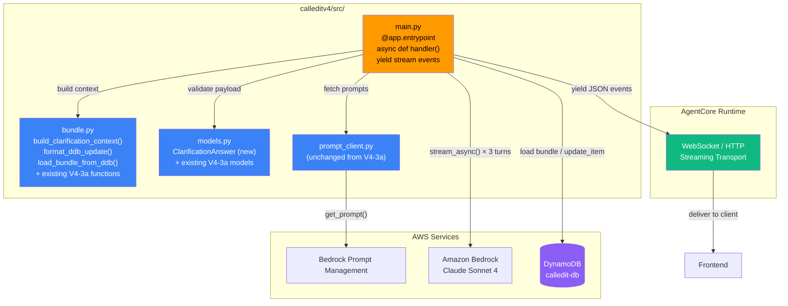
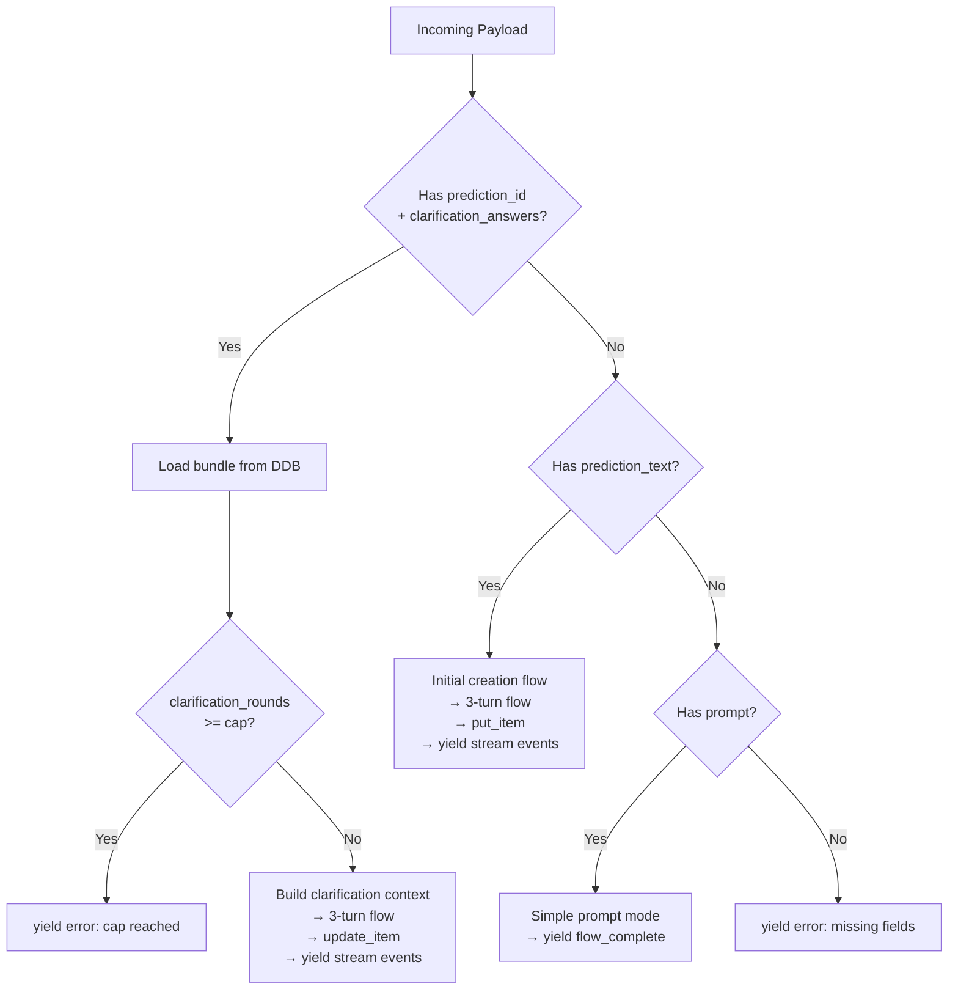
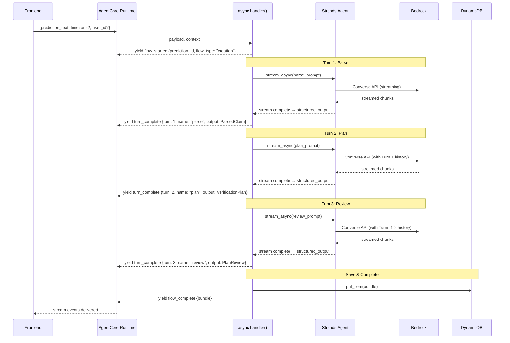
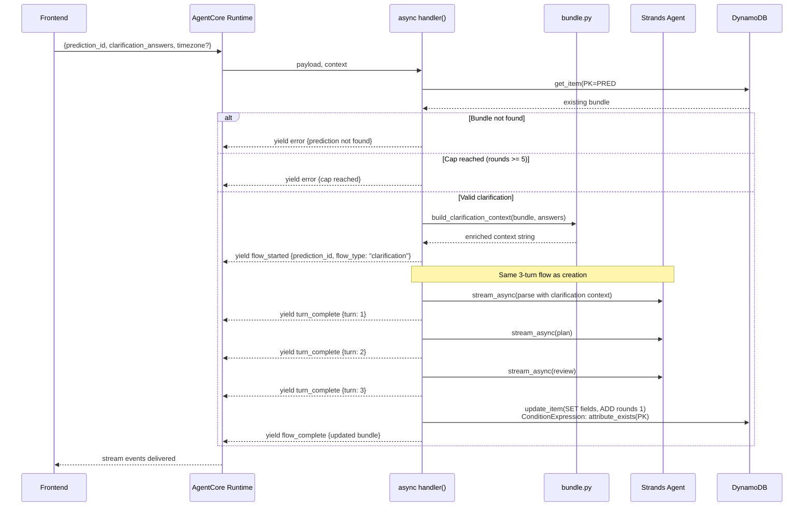

# Design Document — Spec V4-3b: Clarification & Streaming

## Overview

V4-3b evolves the V4-3a creation entrypoint from a synchronous function returning a single JSON string into an async generator that yields turn-by-turn stream events and supports multi-round clarification. Two problems are solved:

1. **Streaming**: The 15-30 second creation flow now emits `flow_started`, `turn_complete` (×3), and `flow_complete` events as each turn finishes, giving the frontend incremental progress instead of silence.
2. **Clarification**: When the user answers the reviewer's clarification questions, the agent re-runs the 3-turn flow with the original prediction plus the user's answers as enriched context. The existing DDB item is updated in place via `update_item`. A cap of 5 rounds prevents infinite loops.

The entrypoint signature changes from `def handler(...) -> str` to `async def handler(...) -> AsyncGenerator[str]` using `yield`. The AgentCore runtime handles WebSocket/HTTP transport — the agent code only yields JSON strings. Each turn uses `agent.stream_async(prompt)` instead of the synchronous `agent(prompt)`, collecting the stream to extract `structured_output` after completion.

Three files change:
- `calleditv4/src/main.py` — async entrypoint, clarification routing, streaming yields, timezone from payload
- `calleditv4/src/bundle.py` — new `build_clarification_context()`, `format_ddb_update()`, `load_bundle_from_ddb()`
- `calleditv4/src/models.py` — new `ClarificationAnswer` model for payload validation

No changes to CloudFormation prompts, prompt client, or the 3 existing Pydantic turn models (ParsedClaim, VerificationPlan, PlanReview).

### Key Design Decisions

| Decision | Rationale |
|----------|-----------|
| `stream_async` + collect for structured output | AgentCore streaming pattern requires `yield`; structured_output is available after stream completes |
| `update_item` with ConditionExpression | Prevents phantom updates; atomic increment of `clarification_rounds` |
| `prediction_id` as sole state key (not session_id) | Eliminates stale state risk from frontend-as-session pattern; session_id is observability-only |
| User timezone from payload (Decision 101) | Frontend already detects timezone; stronger signal than server timezone for "tonight"/"tomorrow" |
| Clarification cap via env var | Defaults to 5; configurable without code change |

## Architecture

### Component Diagram



### Entrypoint Routing (Updated from V4-3a)



### Streaming Creation Flow (New)



### Clarification Round Flow



### AgentCore Guardrail Compliance (V4-3b)

| Guardrail | Status | Notes |
|-----------|--------|-------|
| BedrockAgentCoreApp + @app.entrypoint + app.run() | ✅ | Same app instance, async entrypoint |
| Async streaming via yield | ✅ | Follows AgentCore streaming pattern from docs |
| No hardcoded prompts | ✅ | Same Prompt Management prompts as V4-3a |
| No local MCP subprocesses | ✅ | Same AgentCore built-in tools |
| No custom OTEL | ✅ | AgentCore Observability via session_id |
| Agent created per-request | ✅ | Fresh Agent instance per handler call |
| DDB for structured data, not Memory | ✅ | update_item for bundle, session_id for observability |

## Components and Interfaces

### 1. Updated Entrypoint (`calleditv4/src/main.py`)

The entrypoint changes from synchronous to async, adds clarification routing, and yields stream events.

```python
"""
CalledIt v4 — Prediction Creation Agent on AgentCore

V4-3b: Async streaming entrypoint with clarification round support.

Changes from V4-3a:
- handler() is now async def, yields JSON stream events
- New clarification routing: prediction_id + clarification_answers
- stream_async() replaces synchronous agent() calls
- User timezone from payload (Decision 101)
- Session ID logged for observability (Req 8)

Decisions:
  94  — Single agent, multi-turn prompts
  98  — No fallbacks in dev, graceful fallback in production
  99  — 3 turns not 4
  100 — LLM-native date resolution
  101 — User timezone from payload takes priority
"""

import json
import logging
import os
import sys
from datetime import datetime, timezone

from bedrock_agentcore import RequestContext
from bedrock_agentcore.runtime import BedrockAgentCoreApp
from strands import Agent
from strands.models.bedrock import BedrockModel
from strands_tools.browser import AgentCoreBrowser
from strands_tools.code_interpreter import AgentCoreCodeInterpreter
from strands_tools.current_time import current_time

import boto3

sys.path.insert(0, os.path.dirname(__file__))

from models import ParsedClaim, PlanReview, VerificationPlan, ClarificationAnswer
from prompt_client import fetch_prompt, get_prompt_version_manifest
from bundle import (
    build_bundle,
    build_clarification_context,
    format_ddb_item,
    format_ddb_update,
    generate_prediction_id,
    load_bundle_from_ddb,
    serialize_bundle,
    _convert_floats_to_decimal,
)

logger = logging.getLogger(__name__)

app = BedrockAgentCoreApp()

MODEL_ID = "us.anthropic.claude-sonnet-4-20250514-v1:0"
DYNAMODB_TABLE_NAME = os.environ.get("DYNAMODB_TABLE_NAME", "calledit-db")
MAX_CLARIFICATION_ROUNDS = int(
    os.environ.get("MAX_CLARIFICATION_ROUNDS", "5")
)

# ... (SIMPLE_PROMPT_SYSTEM, tools setup unchanged from V4-3a) ...


def _make_event(event_type: str, prediction_id: str, data: dict) -> str:
    """Build a stream event JSON string. (Req 5.1-5.8)"""
    return json.dumps({
        "type": event_type,
        "prediction_id": prediction_id,
        "data": data,
    })


async def _run_streaming_turn(agent, prompt, model_cls, turn_number,
                               turn_name, prediction_id):
    """Run one turn via stream_async, yield turn_complete event.

    Collects the stream to completion, extracts structured_output,
    then returns (structured_output, event_json).
    """
    result = None
    async for event in agent.stream_async(
        prompt, structured_output_model=model_cls
    ):
        result = event  # last event has the final result

    structured = result.structured_output
    event_json = _make_event("turn_complete", prediction_id, {
        "turn_number": turn_number,
        "turn_name": turn_name,
        "output": structured.model_dump(),
    })
    return structured, event_json


@app.entrypoint
async def handler(payload: dict, context: RequestContext):
    """Async streaming entrypoint — routes to creation, clarification, or simple mode."""

    # Extract session_id for observability (Req 8)
    session_id = getattr(context, "session_id", None)
    user_timezone = payload.get("timezone")  # Decision 101

    # --- Clarification route ---
    if "prediction_id" in payload and "clarification_answers" in payload:
        prediction_id = payload["prediction_id"]
        if session_id:
            logger.info(f"Clarification request: prediction_id={prediction_id}, session_id={session_id}")

        # Validate payload (Req 1.4-1.6)
        answers_raw = payload["clarification_answers"]
        if not prediction_id or not isinstance(prediction_id, str):
            yield _make_event("error", prediction_id or "", {
                "message": "prediction_id must be a non-empty string"
            })
            return
        if not answers_raw or not isinstance(answers_raw, list) or len(answers_raw) == 0:
            yield _make_event("error", prediction_id, {
                "message": "clarification_answers must be a non-empty list"
            })
            return
        # Validate each answer has question + answer as non-empty strings
        for item in answers_raw:
            if (not isinstance(item, dict)
                or not item.get("question") or not item.get("answer")):
                yield _make_event("error", prediction_id, {
                    "message": "Each clarification answer must have non-empty 'question' and 'answer' strings"
                })
                return

        # Load existing bundle (Req 1.2-1.3)
        ddb = boto3.resource("dynamodb")
        table = ddb.Table(DYNAMODB_TABLE_NAME)
        existing_bundle = load_bundle_from_ddb(table, prediction_id)
        if existing_bundle is None:
            yield _make_event("error", prediction_id, {
                "message": f"Prediction {prediction_id} not found"
            })
            return

        # Check cap (Req 3.1-3.3)
        current_rounds = existing_bundle.get("clarification_rounds", 0)
        if current_rounds >= MAX_CLARIFICATION_ROUNDS:
            yield _make_event("error", prediction_id, {
                "message": f"Maximum clarification rounds ({MAX_CLARIFICATION_ROUNDS}) reached"
            })
            return

        # Build clarification context (Req 2.1-2.2)
        clarification_context = build_clarification_context(
            existing_bundle, answers_raw
        )

        # yield flow_started (Req 4.2)
        flow_started_data = {
            "flow_type": "clarification",
            "clarification_round": current_rounds + 1,
        }
        if session_id:
            flow_started_data["session_id"] = session_id
        yield _make_event("flow_started", prediction_id, flow_started_data)

        try:
            # Run 3-turn flow with clarification context (Req 2.3)
            # ... (same pattern as creation, using clarification_context
            #      as the prediction input to Turn 1)
            # After all 3 turns complete:

            # Update DDB (Req 7.1-7.6)
            update_params = format_ddb_update(
                prediction_id=prediction_id,
                parsed_claim=parsed_claim.model_dump(),
                verification_plan=verification_plan.model_dump(),
                verifiability_score=plan_review.verifiability_score,
                verifiability_reasoning=plan_review.verifiability_reasoning,
                reviewable_sections=[s.model_dump() for s in plan_review.reviewable_sections],
                prompt_versions=get_prompt_version_manifest(),
                clarification_answers=answers_raw,
                user_timezone=user_timezone,
            )
            table.update_item(**update_params)

            # yield flow_complete with updated bundle
            # ...
        except Exception as e:
            yield _make_event("error", prediction_id, {
                "message": str(e),
                "turn": getattr(e, "turn", "unknown"),
            })
            return

    # --- Creation route ---
    elif "prediction_text" in payload:
        prediction_id = generate_prediction_id()
        user_id = payload.get("user_id", "anonymous")
        if session_id:
            logger.info(f"Creation request: prediction_id={prediction_id}, session_id={session_id}")

        # yield flow_started
        flow_started_data = {
            "flow_type": "creation",
            "clarification_round": 0,
        }
        if session_id:
            flow_started_data["session_id"] = session_id
        yield _make_event("flow_started", prediction_id, flow_started_data)

        try:
            # ... 3-turn streaming flow ...
            # ... put_item to DDB ...
            # ... yield flow_complete ...
            pass
        except Exception as e:
            yield _make_event("error", prediction_id, {
                "message": str(e),
                "turn": getattr(e, "turn", "unknown"),
            })
            return

    # --- Simple prompt mode (backward compat) ---
    elif "prompt" in payload:
        # ... yield single flow_complete with agent response ...
        pass

    # --- Missing fields ---
    else:
        yield _make_event("error", "", {
            "message": "Missing 'prediction_text', 'prediction_id', or 'prompt' field"
        })
```

**Key changes from V4-3a:**
- `async def handler()` with `yield` instead of `return`
- Three routing branches: clarification (prediction_id + answers), creation (prediction_text), simple (prompt)
- `_make_event()` helper enforces the `{type, prediction_id, data}` format (Req 5.1)
- `_run_streaming_turn()` wraps `stream_async()` + structured output extraction
- `session_id` extracted from context for logging and flow_started events (Req 8)
- `timezone` extracted from payload for Decision 101 (Req 9)
- Clarification validates payload, loads bundle, checks cap, builds context, runs flow, updates DDB

### 2. Bundle Module Updates (`calleditv4/src/bundle.py`)

Three new functions added alongside the existing V4-3a functions.

```python
# --- New functions for V4-3b ---

def load_bundle_from_ddb(table, prediction_id: str) -> Optional[Dict[str, Any]]:
    """Load an existing prediction bundle from DynamoDB.

    Args:
        table: boto3 DynamoDB Table resource
        prediction_id: The prediction ID (e.g., "pred-abc123...")

    Returns:
        The bundle dict if found, None otherwise.
    """
    response = table.get_item(
        Key={"PK": f"PRED#{prediction_id}", "SK": "BUNDLE"}
    )
    item = response.get("Item")
    if item is None:
        return None
    # Remove DDB keys, return clean bundle
    item.pop("PK", None)
    item.pop("SK", None)
    return item


def build_clarification_context(
    existing_bundle: Dict[str, Any],
    clarification_answers: List[Dict[str, str]],
) -> str:
    """Build the enriched context string for a clarification round.

    Combines the original prediction, the previous round's reviewable
    sections (the questions), and the user's answers into a single
    text block that replaces prediction_text in Turn 1.

    Args:
        existing_bundle: The loaded bundle from DDB
        clarification_answers: List of {question, answer} dicts

    Returns:
        A formatted string for the parser prompt input.
    """
    raw_prediction = existing_bundle["raw_prediction"]
    reviewable_sections = existing_bundle.get("reviewable_sections", [])

    parts = [f"Original prediction: {raw_prediction}"]

    if reviewable_sections:
        parts.append("\nPrevious review identified these areas for improvement:")
        for section in reviewable_sections:
            if section.get("improvable"):
                parts.append(f"- {section['section']}: {section.get('reasoning', '')}")
                for q in section.get("questions", []):
                    parts.append(f"  Question: {q}")

    parts.append("\nUser's clarification answers:")
    for qa in clarification_answers:
        parts.append(f"Q: {qa['question']}")
        parts.append(f"A: {qa['answer']}")

    parts.append(
        "\nPlease re-analyze this prediction incorporating the "
        "clarification answers above."
    )
    return "\n".join(parts)


def format_ddb_update(
    prediction_id: str,
    parsed_claim: Dict[str, Any],
    verification_plan: Dict[str, Any],
    verifiability_score: float,
    verifiability_reasoning: str,
    reviewable_sections: list,
    prompt_versions: Dict[str, str],
    clarification_answers: List[Dict[str, str]],
    user_timezone: Optional[str] = None,
) -> Dict[str, Any]:
    """Build the kwargs for a DynamoDB update_item call.

    Returns a dict suitable for table.update_item(**result).
    Uses ConditionExpression to prevent phantom updates (Req 7.3).
    Uses ADD for atomic clarification_rounds increment (Req 7.2).
    Converts floats to Decimal (Req 7.6).
    """
    now = datetime.now(timezone.utc).isoformat()

    update_parts = [
        "SET parsed_claim = :pc",
        "verification_plan = :vp",
        "verifiability_score = :vs",
        "verifiability_reasoning = :vr",
        "reviewable_sections = :rs",
        "prompt_versions = :pv",
        "updated_at = :ua",
        "clarification_history = list_append("
        "if_not_exists(clarification_history, :empty_list), :ch)",
    ]
    if user_timezone:
        update_parts.append("user_timezone = :tz")

    update_expr = ", ".join(update_parts) + " ADD clarification_rounds :one"

    attr_values = {
        ":pc": _convert_floats_to_decimal(parsed_claim),
        ":vp": _convert_floats_to_decimal(verification_plan),
        ":vs": _convert_floats_to_decimal(verifiability_score),
        ":vr": verifiability_reasoning,
        ":rs": _convert_floats_to_decimal(reviewable_sections),
        ":pv": prompt_versions,
        ":ua": now,
        ":ch": [{"answers": clarification_answers, "timestamp": now}],
        ":empty_list": [],
        ":one": 1,
    }
    if user_timezone:
        attr_values[":tz"] = user_timezone

    return {
        "Key": {"PK": f"PRED#{prediction_id}", "SK": "BUNDLE"},
        "UpdateExpression": update_expr,
        "ExpressionAttributeValues": attr_values,
        "ConditionExpression": "attribute_exists(PK)",
    }
```

**Design rationale:**
- `load_bundle_from_ddb()` strips PK/SK before returning — callers work with clean bundle dicts
- `build_clarification_context()` is a pure function (no I/O) — easy to test with property-based testing
- `format_ddb_update()` is a pure function that returns kwargs — the caller does `table.update_item(**result)`. This keeps DDB interaction in main.py and formatting logic testable without mocks
- `list_append` with `if_not_exists` handles the first clarification round where `clarification_history` doesn't exist yet
- `ADD clarification_rounds :one` is atomic — no read-modify-write race condition

### 3. New Pydantic Model (`calleditv4/src/models.py`)

One new model for payload validation. The existing V4-3a models (ParsedClaim, VerificationPlan, ReviewableSection, PlanReview) are unchanged.

```python
class ClarificationAnswer(BaseModel):
    """A single question-answer pair from a clarification round."""
    question: str = Field(
        description="The clarification question from the reviewer"
    )
    answer: str = Field(
        description="The user's answer to the clarification question"
    )
```

This model is used for documentation and potential future Pydantic validation of the payload. The entrypoint validates `clarification_answers` manually (checking non-empty strings) rather than using Pydantic validation on the incoming payload, because the payload is a raw dict from AgentCore — not a Pydantic model boundary.

### 4. Stream Event Format (Req 5)

Every event yielded by the entrypoint follows this exact structure:

```json
{
    "type": "flow_started | turn_complete | flow_complete | error",
    "prediction_id": "pred-{uuid4}",
    "data": { ... }
}
```

Event type details:

| Type | `data` fields | When emitted |
|------|--------------|--------------|
| `flow_started` | `flow_type` ("creation" \| "clarification"), `clarification_round` (int), `session_id`? | Start of any flow |
| `turn_complete` | `turn_number` (1-3), `turn_name` ("parse" \| "plan" \| "review"), `output` (dict) | After each turn's structured output is extracted |
| `flow_complete` | Complete PredictionBundle dict | After DDB save |
| `error` | `message` (str), `turn`? (str) | On any failure |

The `prediction_id` is present in every event so the client can correlate events to a prediction without parsing `data`. This aligns with the v3 frontend's `messageHandlers.get(messageType)` routing pattern.

### 5. Timezone Handling (Decision 101, Req 9)

The parser prompt gains a new optional variable `{{user_timezone}}`:

```
TIMEZONE PRIORITY (updated for V4-3b):
1. {{user_timezone}} from payload (strongest — the user's actual timezone)
2. Explicit location in prediction (e.g., "Lakers" → Pacific)
3. current_time tool's server timezone
4. UTC as last resort
```

When `timezone` is present in the payload:
- It's passed to `fetch_prompt("prediction_parser", variables={"current_date": ..., "user_timezone": tz})`
- It's stored in the bundle as `user_timezone` so the verification agent knows when to verify
- The parser prompt template uses `{{user_timezone}}` if present, otherwise the variable is simply absent and the agent falls back to the existing priority chain

When `timezone` is absent:
- The `user_timezone` variable is omitted from the prompt variables dict
- The `{{user_timezone}}` placeholder in the prompt template remains as literal text, which the agent interprets as "no user timezone provided"
- This preserves exact V4-3a behavior

The `build_bundle()` function gains an optional `user_timezone` parameter. The `format_ddb_update()` function conditionally includes `user_timezone` in the SET expression.

## Data Models

### Prediction Bundle (Updated for V4-3b)

New fields added by V4-3b are marked with ★.

```python
{
    # --- V4-3a fields (unchanged) ---
    "prediction_id": "pred-{uuid4}",
    "user_id": "user123",
    "raw_prediction": "Lakers win tonight",
    "parsed_claim": {
        "statement": "The Los Angeles Lakers will win their game tonight",
        "verification_date": "2025-03-24T07:00:00Z",
        "date_reasoning": "..."
    },
    "verification_plan": {
        "sources": ["ESPN", "NBA.com"],
        "criteria": ["Final score shows Lakers with more points"],
        "steps": ["Check NBA.com box score after game"]
    },
    "verifiability_score": 0.92,
    "verifiability_reasoning": "...",
    "reviewable_sections": [
        {
            "section": "criteria",
            "improvable": True,
            "questions": ["Does 'win' include overtime?"],
            "reasoning": "Overtime assumption not addressed"
        }
    ],
    "clarification_rounds": 0,  # incremented by ADD :one on each round
    "created_at": "2025-03-23T22:00:00+00:00",
    "status": "pending",
    "prompt_versions": {"prediction_parser": "1", ...},

    # --- V4-3b new fields ---
    "user_timezone": "America/New_York",        # ★ Decision 101
    "updated_at": "2025-03-23T22:05:00+00:00",  # ★ Set on clarification
    "clarification_history": [                   # ★ Appended each round
        {
            "answers": [
                {"question": "Does 'win' include overtime?", "answer": "Yes, any win counts"},
            ],
            "timestamp": "2025-03-23T22:05:00+00:00"
        }
    ],
}
```

### DynamoDB Key Schema (Unchanged)

| Field | Value | Purpose |
|-------|-------|---------|
| PK | `PRED#{prediction_id}` | Partition key |
| SK | `BUNDLE` | Sort key (single item per prediction) |

### DynamoDB Operations

| Operation | When | Function |
|-----------|------|----------|
| `put_item` | Initial creation (V4-3a) | `format_ddb_item()` |
| `get_item` | Load bundle for clarification | `load_bundle_from_ddb()` |
| `update_item` | After clarification round | `format_ddb_update()` |

### Clarification Payload Schema

```json
{
    "prediction_id": "pred-abc123...",
    "clarification_answers": [
        {"question": "Does 'win' include overtime?", "answer": "Yes"},
        {"question": "Regular season or playoffs?", "answer": "Regular season"}
    ],
    "timezone": "America/New_York",
    "session_id": "sess-xyz789"
}
```

### Creation Payload Schema (Updated)

```json
{
    "prediction_text": "Lakers win tonight",
    "user_id": "user123",
    "timezone": "America/New_York",
    "session_id": "sess-xyz789"
}
```

### Stream Event Schema

```typescript
// TypeScript type for frontend consumption
interface StreamEvent {
    type: "flow_started" | "turn_complete" | "flow_complete" | "error";
    prediction_id: string;
    data: FlowStartedData | TurnCompleteData | FlowCompleteData | ErrorData;
}

interface FlowStartedData {
    flow_type: "creation" | "clarification";
    clarification_round: number;
    session_id?: string;
}

interface TurnCompleteData {
    turn_number: 1 | 2 | 3;
    turn_name: "parse" | "plan" | "review";
    output: Record<string, unknown>;
}

interface FlowCompleteData extends PredictionBundle {}

interface ErrorData {
    message: string;
    turn?: string;
}
```

## Correctness Properties

*A property is a characteristic or behavior that should hold true across all valid executions of a system — essentially, a formal statement about what the system should do. Properties serve as the bridge between human-readable specifications and machine-verifiable correctness guarantees.*

### Property 1: Clarification payload validation rejects invalid inputs

*For any* payload where `prediction_id` is empty/non-string, or `clarification_answers` is empty, or any answer item is missing `question`/`answer` fields, or any `question`/`answer` value is an empty string, the validation logic SHALL reject the payload. Conversely, *for any* payload where `prediction_id` is a non-empty string and every item in `clarification_answers` has non-empty `question` and `answer` strings, the validation logic SHALL accept the payload.

**Validates: Requirements 1.4, 1.5, 1.6**

### Property 2: Clarification context contains all components

*For any* existing bundle (with `raw_prediction` and `reviewable_sections`) and *any* non-empty list of `clarification_answers`, the string returned by `build_clarification_context()` SHALL contain: (a) the original `raw_prediction` text, (b) every `question` string from the answers, and (c) every `answer` string from the answers. Additionally, for each improvable reviewable section, the context SHALL contain the section name and reasoning.

**Validates: Requirements 2.1**

### Property 3: Stream event format invariant

*For any* event type string, *any* prediction_id string, and *any* data dict, the JSON string returned by `_make_event()` SHALL: (a) be valid JSON (json.loads succeeds), (b) parse to a dict with exactly three keys: `type`, `prediction_id`, `data`, (c) have `type` equal to the input type, (d) have `prediction_id` equal to the input prediction_id, and (e) have `data` equal to the input data dict. This is a serialization round-trip property.

**Validates: Requirements 5.1, 5.3, 5.8, 6.3**

### Property 4: DDB update format correctness

*For any* valid combination of `prediction_id`, `parsed_claim`, `verification_plan`, `verifiability_score`, `verifiability_reasoning`, `reviewable_sections`, `prompt_versions`, and `clarification_answers`, the dict returned by `format_ddb_update()` SHALL: (a) have Key with PK=`PRED#{prediction_id}` and SK=`BUNDLE`, (b) have an UpdateExpression containing SET clauses for `parsed_claim`, `verification_plan`, `verifiability_score`, `verifiability_reasoning`, `reviewable_sections`, `prompt_versions`, `updated_at`, and `clarification_history`, (c) have an UpdateExpression containing `ADD clarification_rounds :one`, (d) have a ConditionExpression containing `attribute_exists(PK)`, (e) NOT contain `prediction_id`, `user_id`, `raw_prediction`, or `created_at` in the SET clause, (f) have no Python `float` values anywhere in ExpressionAttributeValues (all converted to Decimal), and (g) have `:ua` (updated_at) as a valid ISO 8601 string.

**Validates: Requirements 2.4, 2.5, 2.6, 2.7, 2.8, 7.1, 7.2, 7.3, 7.6**

### Property 5: Clarification cap enforcement

*For any* integer value of `clarification_rounds` and *any* cap value, if `clarification_rounds >= cap` then the clarification request SHALL be rejected. If `clarification_rounds < cap` then the clarification request SHALL NOT be rejected due to the cap. The boundary values (rounds == cap - 1 allows, rounds == cap rejects) must hold.

**Validates: Requirements 3.1, 3.3**

### Property 6: Bundle includes user_timezone when provided

*For any* valid bundle inputs and *any* non-empty timezone string, `build_bundle()` SHALL include a `user_timezone` field equal to the provided timezone. When timezone is None or not provided, the bundle SHALL NOT contain a `user_timezone` field (or it shall be None).

**Validates: Requirements 9.4**

### Property 7: DDB load key format

*For any* prediction_id string, `load_bundle_from_ddb()` SHALL query DynamoDB with Key PK=`PRED#{prediction_id}` and SK=`BUNDLE`. When the item exists, the returned dict SHALL NOT contain `PK` or `SK` keys (they are stripped). When the item does not exist, the function SHALL return None.

**Validates: Requirements 1.2**

## Error Handling

### Error Categories

| Error | Source | Handling | Stream Event |
|-------|--------|----------|--------------|
| Missing payload fields | Validation | yield error, stop | `{type: "error", data: {message: "Missing 'prediction_text'..."}}` |
| Invalid clarification payload | Validation | yield error, stop | `{type: "error", data: {message: "Each answer must have..."}}` |
| Prediction not found in DDB | `get_item` returns no Item | yield error, stop | `{type: "error", data: {message: "Prediction pred-xxx not found"}}` |
| Clarification cap reached | Cap check | yield error, stop | `{type: "error", data: {message: "Maximum clarification rounds (5) reached"}}` |
| Turn failure (Bedrock/Strands) | `stream_async()` exception | yield error with turn name, stop | `{type: "error", data: {message: "...", turn: "parse"}}` |
| DDB `put_item` failure (creation) | boto3 exception | yield `flow_complete` with `save_error` field | Bundle still returned to client |
| DDB `update_item` condition failure | `ConditionalCheckFailedException` | yield error (prediction deleted between load and update) | `{type: "error", data: {message: "Prediction was deleted..."}}` |
| DDB `update_item` other failure | boto3 exception | yield `flow_complete` with `save_error` field | Bundle still returned to client |

### Error Handling Strategy

1. **Fail fast on validation**: Invalid payloads yield a single error event and return immediately. No agent is created, no DDB calls are made.

2. **Fail fast on preconditions**: Missing bundle and cap exceeded yield error events before any agent work starts.

3. **Fail gracefully on DDB save**: Matching V4-3a's pattern — if the save fails, the bundle is still returned to the client with a `save_error` field. The user gets their prediction even if persistence fails temporarily.

4. **Fail with context on turn errors**: When a turn fails, the error event includes the turn name so the client/developer knows which step failed. The entrypoint stops yielding after an error — no partial flows.

5. **ConditionalCheckFailedException special handling**: This specific DDB exception means the item was deleted between `get_item` and `update_item`. This is a race condition that should be surfaced clearly, not treated as a generic DDB error.

### Error Event Contract

Every error path yields exactly one error event and then returns. The client can rely on:
- Receiving at most one error event per request
- No further events after an error event
- The error event always has `message` in `data`
- The error event has `turn` in `data` only when the error occurred during a specific turn

## Testing Strategy

### Testing Philosophy

Decision 96: NO MOCKS. All tests exercise real code paths. The V4-3b testing strategy follows the same pattern established in V4-3a:

- **Pure function tests** (unit + property): Test `bundle.py` functions, `_make_event()`, validation logic — no AWS calls, no agent calls
- **Property-based tests** (Hypothesis): Verify universal properties across generated inputs — minimum 100 iterations per property
- **Integration tests** (manual via `agentcore invoke --dev`): Test the full async streaming flow with real Bedrock and DDB — requires TTY, run manually

### Property-Based Testing Configuration

- Library: **Hypothesis** (already used in V4-3a tests)
- Minimum iterations: **100** per property (`@settings(max_examples=100)`)
- Each test tagged with: `Feature: clarification-streaming, Property {N}: {title}`
- Each correctness property maps to a single property-based test

### Test File Organization

| File | Tests | Type |
|------|-------|------|
| `calleditv4/tests/test_clarification.py` | Properties 1, 2, 5, 7 + edge cases | Property + unit |
| `calleditv4/tests/test_stream_events.py` | Property 3 + event format examples | Property + unit |
| `calleditv4/tests/test_ddb_update.py` | Property 4 + Decimal conversion | Property + unit |
| `calleditv4/tests/test_bundle.py` | Property 6 (extend existing file) | Property |
| Manual: `agentcore invoke --dev` | Full streaming flow, clarification round | Integration |

### Property Test → Correctness Property Mapping

| Test | Property | What it verifies |
|------|----------|-----------------|
| `test_clarification.py::TestPayloadValidation` | Property 1 | Valid payloads accepted, invalid rejected |
| `test_clarification.py::TestClarificationContext` | Property 2 | Context string contains all components |
| `test_stream_events.py::TestStreamEventFormat` | Property 3 | Event JSON structure invariant |
| `test_ddb_update.py::TestDdbUpdateFormat` | Property 4 | UpdateExpression, ConditionExpression, Decimal conversion |
| `test_clarification.py::TestClarificationCap` | Property 5 | Cap boundary enforcement |
| `test_bundle.py::TestBundleTimezone` | Property 6 | user_timezone inclusion |
| `test_clarification.py::TestLoadBundleKeyFormat` | Property 7 | DDB key format, PK/SK stripping |

### Unit Tests (Specific Examples and Edge Cases)

| Test | What it verifies |
|------|-----------------|
| `test_stream_events.py::test_valid_event_types` | The 4 valid event types are defined correctly (Req 5.2) |
| `test_stream_events.py::test_flow_started_data_shape` | flow_started data has flow_type + clarification_round (Req 5.4) |
| `test_stream_events.py::test_turn_complete_data_shape` | turn_complete data has turn_number + turn_name + output (Req 5.5) |
| `test_stream_events.py::test_error_data_shape` | error data has message, optionally turn (Req 5.7) |
| `test_clarification.py::test_empty_answers_rejected` | Empty list yields error (Req 1.5) |
| `test_clarification.py::test_missing_prediction_not_found` | None bundle → error event (Req 1.3) |
| `test_entrypoint.py::test_handler_is_async` | handler is async def (Req 4.1, 6.1) |
| `test_entrypoint.py::test_missing_fields_yields_error` | No valid fields → error event (Req 6.5) |
| `test_clarification.py::test_default_cap_is_five` | MAX_CLARIFICATION_ROUNDS defaults to 5 (Req 3.1, 3.4) |

### Integration Tests (Manual)

These require a TTY and real AWS services. Run manually:

```bash
# Test streaming creation flow
agentcore invoke --dev --payload '{"prediction_text": "Lakers win tonight", "timezone": "America/Los_Angeles"}'

# Test clarification round (use prediction_id from creation output)
agentcore invoke --dev --payload '{"prediction_id": "pred-xxx", "clarification_answers": [{"question": "Does win include overtime?", "answer": "Yes"}]}'

# Test cap enforcement (run 6 clarification rounds)
# After 5 rounds, the 6th should yield an error event
```

### What We Don't Test

- Token-by-token streaming (AgentCore runtime responsibility)
- WebSocket transport (AgentCore runtime responsibility)
- Prompt content quality (eval framework, not unit tests)
- Frontend rendering of events (frontend spec)
- AgentCore Memory integration (V4-6)
