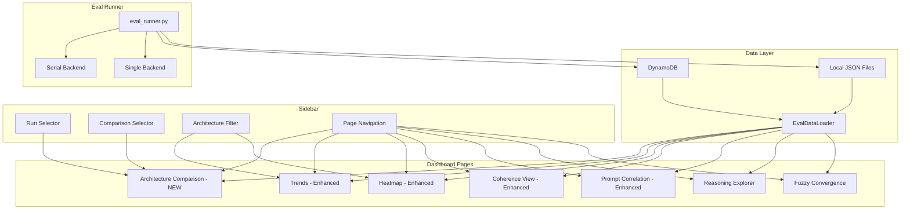

# Design Document: Comparative Eval Dashboard

## Overview

This design covers two workstreams that together deliver the comparative evaluation capability for CalledIt:

1. **Dashboard visualizations** — A new Architecture Comparison page, enhanced Trends/Heatmap/Coherence/Prompt Correlation pages, and data loader extensions to surface per-agent aggregates, Verification-Builder-centric scores, and execution time data.
2. **Comparative eval runs** — Three run configurations (Run 9, Run 7, Run 3) executed across serial and single backends to produce the architecture comparison data the dashboard consumes.

The dashboard work builds on the existing Streamlit app in `eval/dashboard/` and the pluggable backend + per-agent evaluator infrastructure from Spec 10. The eval runs use the existing `eval_runner.py` CLI with `--backend` and `--judge` flags.

### Design Rationale

The core design decision is to keep the dashboard purely presentational — all scoring, weighting, and aggregation happens in the eval runner and data loader. Dashboard pages receive pre-computed data and render it. This keeps the visualization layer thin and testable independently of the eval pipeline.

The Architecture Comparison page is the centerpiece new page. It accepts two runs (via the existing sidebar selectors) and renders side-by-side metrics grouped by evaluator type. The grouping taxonomy (final-output, per-agent, cross-pipeline, deterministic) comes directly from the `evaluator_groups` field already present in eval reports from Spec 10.

## Architecture



## Components and Interfaces

### Component 1: Data Loader Extensions

The existing `EvalDataLoader` in `eval/dashboard/data_loader.py` needs three additions to its normalization functions.

**`_normalize_run_summary`** — Add fields:
- `per_agent_aggregates`: dict of evaluator name → average score. Already present in raw data from Spec 10's `_aggregate_report`, but the current normalizer only reads `json_validity_avg` sub-keys. Extend to read all evaluator-level averages (IntentExtraction, CategorizationJustification, ClarificationRelevance, PipelineCoherence, IntentPreservation, CriteriaMethodAlignment).
- `vb_centric_score`: float or None. Read from `vb_centric_score` field in raw run summary.

**`_normalize_test_result`** — Add field:
- `execution_time_ms`: int. Read from `execution_time_ms` in raw test result, default 0.

**Backward compatibility**: When `per_agent_aggregates` is missing (older runs), default to `{}`. When `vb_centric_score` is missing, default to `None`. When `execution_time_ms` is missing, default to 0.

**`compare_runs`** — Extend to include:
- `vb_centric_delta`: delta between `vb_centric_score` values.
- `per_agent_deltas`: per-evaluator delta for each evaluator in `per_agent_aggregates`.

### Component 2: Architecture Comparison Page

New file: `eval/dashboard/pages/architecture_comparison.py`

**Render function signature:**
```python
def render(run_a_detail: dict, run_b_detail: dict, run_a_summary: dict, run_b_summary: dict):
```

**Sections rendered (top to bottom):**

1. **Same-architecture guard** — If both runs have the same `architecture` value, display a notice and suggest Prompt Correlation instead. Still render the comparison below for convenience.

2. **Verification-Builder-Centric Score** — Two `st.metric` columns showing each run's `vb_centric_score` with delta indicator.

3. **Per-Evaluator Score Comparison** — Grouped bar chart (Plotly) with evaluators on x-axis, scores on y-axis, one bar per run. Evaluators grouped by `evaluator_groups` taxonomy with visual separators:
   - Final-output: IntentPreservation, CriteriaMethodAlignment
   - Per-agent: IntentExtraction, CategorizationJustification, ClarificationRelevance
   - Cross-pipeline: PipelineCoherence
   - Deterministic: CategoryMatch, JSONValidity, ClarificationQuality, Convergence

4. **Per-Agent Evaluator Scores** — Only shows evaluators that ran for each architecture. Uses `per_agent_aggregates` from run summaries. If an evaluator is missing for one run (e.g., IntentExtraction absent for single backend), show "N/A" for that cell.

5. **PipelineCoherence Callout** — Dedicated section with both runs' PipelineCoherence scores and an explanatory callout: "PipelineCoherence quantifies the silo problem — whether agents build on each other's work or re-interpret from scratch."

6. **Per-Category Accuracy** — Grouped bar chart with categories on x-axis, accuracy on y-axis, one bar per run.

7. **Execution Time** — Two metrics: total execution time and per-test-case average, for both runs.

### Component 3: Trends Page Enhancements

Modify `eval/dashboard/pages/trends.py`:

**New chart: "Per-Agent Judge Scores"** — Two visual sections:
- "Final-Output Evaluators": IntentPreservation, CriteriaMethodAlignment traces (move from existing "Verification Quality" chart).
- "Per-Agent & Cross-Pipeline Evaluators": IntentExtraction, CategorizationJustification, ClarificationRelevance, PipelineCoherence traces.

Data source: `per_agent_aggregates` from run summaries for the per-agent evaluators, `verification_quality_aggregates` for the final-output evaluators.

Use `connectgaps=True` so runs lacking per-agent data (pre-Spec 10) show gaps instead of zero.

**Architecture filtering**: When the sidebar architecture filter is set, filter `sorted_runs` to only runs matching that architecture before rendering all charts.

### Component 4: Heatmap Enhancements

Modify `eval/dashboard/pages/heatmap.py`:

**Evaluator grouping** — Reorder columns by group: final-output → per-agent → cross-pipeline → deterministic. Add group label annotations above each column group. Add vertical separators between groups (extend existing det/judge separator to 4 groups).

**Architecture label** — Display `run_detail.get("architecture", "serial")` in the page header.

**Side-by-side mode** — When a comparison run is selected and the two runs have different architectures, render two heatmaps side-by-side with matching test case row order. The `render` function signature changes to accept an optional `comparison_detail` parameter.

### Component 5: Coherence View Enhancements

Modify `eval/dashboard/pages/coherence.py`:

**Judge classification update** — Replace the current `"ReasoningQuality" in name` check with a set of all 6 LLM judge names: `{"IntentPreservation", "CriteriaMethodAlignment", "IntentExtraction", "CategorizationJustification", "ClarificationRelevance", "PipelineCoherence"}`.

**Per-judge agreement breakdown** — For each LLM judge, compute its agreement rate with the deterministic evaluators (does the judge's pass/fail align with the deterministic average pass/fail?). Display as a table.

**Judge-vs-judge correlation** — For each pair of LLM judges, compute how often they agree (both pass or both fail) on the same test cases. Display as a correlation matrix or summary table.

**Per-agent judges in chain-of-reasoning** — When the run has per-agent evaluator data, include per-agent judge scores and reasoning in the chain-of-reasoning inspection alongside existing agent output fields.

### Component 6: Prompt Correlation Enhancements

Modify `eval/dashboard/pages/prompt_correlation.py`:

**Verification-Builder-Centric Score delta** — Add a section showing `vb_centric_score` for both runs with delta indicator, above the existing overall pass rate delta.

**Per-agent evaluator deltas** — When both runs have `per_agent_aggregates`, show per-evaluator deltas (IntentExtraction, CategorizationJustification, ClarificationRelevance, PipelineCoherence).

**Architecture-aware grouping** — When comparing runs across architectures, group the delta display into:
- "Architecture Effect": evaluators that differ due to architecture (per-agent evaluators that only exist in one run).
- "Prompt Effect": evaluators that differ due to prompt changes (both runs have the evaluator, but prompt versions differ).

Use `architecture` and `prompt_version_manifest` fields to distinguish.

### Component 7: Sidebar and Routing Updates

**Sidebar** (`eval/dashboard/sidebar.py`):
- Add "Architecture Comparison" to the page navigation radio options.

**App routing** (`eval/dashboard/app.py`):
- Add routing for "Architecture Comparison" page, passing both run details and run summaries.
- Pass comparison run detail to Heatmap when in side-by-side mode.
- Apply architecture filter to Trends page runs.
- Apply architecture filter to Heatmap page.

### Component 8: Comparative Eval Runs

Three run configurations executed via the eval runner CLI. These are operational tasks, not code changes.

**Run 9 config** (current best prompts):
```bash
cd /home/wsluser/projects/calledit/backend/calledit-backend/handlers/strands_make_call
PROMPT_VERSION_PARSER=1 PROMPT_VERSION_CATEGORIZER=2 PROMPT_VERSION_VB=2 PROMPT_VERSION_REVIEW=2 \
  /home/wsluser/projects/calledit/venv/bin/python eval_runner.py \
  --dataset ../../../../eval/golden_dataset.json --backend serial --judge

PROMPT_VERSION_PARSER=1 PROMPT_VERSION_CATEGORIZER=2 PROMPT_VERSION_VB=2 PROMPT_VERSION_REVIEW=2 \
  /home/wsluser/projects/calledit/venv/bin/python eval_runner.py \
  --dataset ../../../../eval/golden_dataset.json --backend single --judge
```

**Run 7 config** (pre-Verification-Builder iteration baseline):
```bash
PROMPT_VERSION_PARSER=1 PROMPT_VERSION_CATEGORIZER=2 PROMPT_VERSION_VB=1 PROMPT_VERSION_REVIEW=1 \
  /home/wsluser/projects/calledit/venv/bin/python eval_runner.py \
  --dataset ../../../../eval/golden_dataset.json --backend serial --judge

PROMPT_VERSION_PARSER=1 PROMPT_VERSION_CATEGORIZER=2 PROMPT_VERSION_VB=1 PROMPT_VERSION_REVIEW=1 \
  /home/wsluser/projects/calledit/venv/bin/python eval_runner.py \
  --dataset ../../../../eval/golden_dataset.json --backend single --judge
```

**Run 3 config** (single backend only):
```bash
PROMPT_VERSION_CATEGORIZER=2 \
  /home/wsluser/projects/calledit/venv/bin/python eval_runner.py \
  --dataset ../../../../eval/golden_dataset.json --backend single --judge
```

Each run produces:
- A JSON report in `eval/reports/` with architecture, model_config, vb_centric_score, per_agent_aggregates, and all 6 LLM judge evaluator results per test case.
- An entry in `eval/score_history.json` with distinct timestamp and architecture label.
- DDB records (if available) for reasoning store.


## Data Models

### Run Summary (normalized by `_normalize_run_summary`)

```python
{
    "eval_run_id": str,
    "timestamp": str,                          # ISO 8601
    "prompt_version_manifest": dict,           # {"parser": "1", "categorizer": "2", ...}
    "dataset_version": str,
    "architecture": str,                       # "serial" | "single" | ...
    "model_config": dict,                      # {"parser": "sonnet-4", ...}
    "per_agent_aggregates": dict,              # {"IntentExtraction": {"avg": 0.82}, ...}
    "per_category_accuracy": dict,             # {"auto_verifiable": 1.0, ...}
    "verification_quality_aggregates": dict,   # {"intent_preservation_avg": 0.82, ...}
    "vb_centric_score": float | None,          # Weighted composite, 0.0-1.0
    "overall_pass_rate": float,
    "total_tests": int,
    "passed": int,
    "failed": int,
}
```

### Test Result (normalized by `_normalize_test_result`)

```python
{
    "test_case_id": str,
    "layer": str,                              # "base" | "fuzzy"
    "difficulty": str,
    "expected_category": str,
    "evaluator_scores": dict,                  # {evaluator_name: {"score": float, ...}}
    "error": str,
    "duration_s": float,
    "execution_time_ms": int,                  # NEW — backend execution time
}
```

### Evaluator Group Taxonomy

Used by the Architecture Comparison page and Heatmap for column grouping:

```python
EVALUATOR_GROUPS = {
    "final_output": ["IntentPreservation", "CriteriaMethodAlignment"],
    "per_agent": ["IntentExtraction", "CategorizationJustification", "ClarificationRelevance"],
    "cross_pipeline": ["PipelineCoherence"],
    "deterministic": ["CategoryMatch", "JSONValidity", "ClarificationQuality", "Convergence"],
}
```

This taxonomy is already emitted by the eval runner in the `evaluator_groups` report field. Dashboard pages should use this constant for consistent grouping.

### Compare Runs Result (extended)

```python
{
    "overall_pass_rate": {"current": float, "previous": float, "delta": float, "status": str},
    "category_deltas": {category: {"current": float, "previous": float, "delta": float, "status": str}},
    "changed_prompts": {agent: {"from": str, "to": str}},
    "dataset_version_mismatch": bool,
    "has_regression": bool,
    # NEW fields:
    "vb_centric_delta": {"current": float | None, "previous": float | None, "delta": float | None},
    "per_agent_deltas": {evaluator: {"current": float, "previous": float, "delta": float}},
}
```


## Correctness Properties

*A property is a characteristic or behavior that should hold true across all valid executions of a system — essentially, a formal statement about what the system should do. Properties serve as the bridge between human-readable specifications and machine-verifiable correctness guarantees.*

### Property 1: Run summary normalization preserves new fields

*For any* raw run summary dict containing `per_agent_aggregates` (a dict of evaluator name → score data) and `vb_centric_score` (a float), normalizing the summary via `_normalize_run_summary` should produce an output where `per_agent_aggregates` equals the input value and `vb_centric_score` equals the input float. When either field is absent from the input, the output should default to `{}` and `None` respectively.

**Validates: Requirements 1.1, 1.2, 1.4**

### Property 2: Test result normalization preserves execution_time_ms

*For any* raw test result dict containing `execution_time_ms` (a non-negative integer), normalizing via `_normalize_test_result` should produce an output where `execution_time_ms` equals the input value. When the field is absent, the output should default to `0`.

**Validates: Requirements 1.3**

### Property 3: Evaluator group classification

*For any* evaluator name string, classifying it into an evaluator group should place it in exactly one of: final_output, per_agent, cross_pipeline, deterministic, or unknown. The 6 LLM judge names (IntentPreservation, CriteriaMethodAlignment, IntentExtraction, CategorizationJustification, ClarificationRelevance, PipelineCoherence) should all be classified as non-deterministic (judge) evaluators. The 4 deterministic names (CategoryMatch, JSONValidity, ClarificationQuality, Convergence) should be classified as deterministic.

**Validates: Requirements 2.2, 4.1, 5.1**

### Property 4: Per-agent evaluator presence filtering

*For any* two run summaries with `per_agent_aggregates` dicts, the set of evaluators displayed for each run should be exactly the set of keys present in that run's `per_agent_aggregates`. An evaluator absent from one run's aggregates should show "N/A" for that run, not zero.

**Validates: Requirements 2.4**

### Property 5: Per-agent judge score extraction from run summaries

*For any* list of run summaries, extracting per-agent judge scores for the Trends chart should produce a value for each of the 6 LLM judge evaluators per run. When a run's `per_agent_aggregates` or `verification_quality_aggregates` lacks a given evaluator, the extracted value should be `None` (not `0`), so that `connectgaps=True` skips the data point.

**Validates: Requirements 3.1, 3.2**

### Property 6: Heatmap row order consistency

*For any* two lists of test cases (from two different runs), when rendered as side-by-side heatmaps, the row ordering function should produce the same test case ID order for both heatmaps. Specifically, the union of test case IDs should be sorted by the same key (ascending average score from run A), and both heatmaps should use that shared order.

**Validates: Requirements 4.3**

### Property 7: Per-judge agreement rate computation

*For any* set of test cases where each test case has both deterministic and judge evaluator scores, the per-judge agreement rate for each LLM judge should be a float in [0.0, 1.0]. The agreement rate should equal the fraction of test cases where the judge's pass/fail (score >= 0.5) matches the deterministic average's pass/fail.

**Validates: Requirements 5.2**

### Property 8: Judge-vs-judge correlation symmetry

*For any* set of test cases with multiple LLM judge scores, the pairwise agreement rate between judge A and judge B should equal the pairwise agreement rate between judge B and judge A (symmetry). Each pairwise rate should be in [0.0, 1.0].

**Validates: Requirements 5.3**

### Property 9: Architecture filtering

*For any* list of runs and any architecture filter string, filtering runs by architecture should return only runs whose `architecture` field equals the filter string. When the filter is "all", all runs should be returned. The filtered list should be a subset of the input list.

**Validates: Requirements 6.3, 6.4**

### Property 10: Eval report schema completeness

*For any* eval report produced by `_aggregate_report`, the report dict should contain the keys `architecture` (str), `model_config` (dict), `vb_centric_score` (float), `per_agent_aggregates` (dict), and `evaluator_groups` (dict). The `vb_centric_score` should be in [0.0, 1.0].

**Validates: Requirements 7.3, 8.3, 9.2**

### Property 11: Compare runs delta correctness

*For any* two run summaries with `vb_centric_score` and `per_agent_aggregates`, calling `compare_runs` should produce a `vb_centric_delta` where `delta == current - previous` (within floating point tolerance). For each evaluator present in both runs' `per_agent_aggregates`, the per-agent delta should equal `current_avg - previous_avg`.

**Validates: Requirements 10.1, 10.2**

### Property 12: Architecture-vs-prompt effect classification

*For any* two run summaries with different `architecture` values and potentially different `prompt_version_manifest` values, the effect classification function should label an evaluator delta as "Architecture Effect" when the evaluator exists in only one run's per_agent_aggregates (due to architecture differences), and as "Prompt Effect" when the evaluator exists in both runs but prompt versions differ.

**Validates: Requirements 10.3**

## Error Handling

### Data Loader Errors

- **Missing fields in raw data**: `_normalize_run_summary` and `_normalize_test_result` use `.get()` with defaults for all new fields. Older runs without `per_agent_aggregates`, `vb_centric_score`, or `execution_time_ms` produce valid normalized output with sensible defaults.
- **Invalid score values**: The existing `_clamp_score` function handles out-of-range values. New fields that are scores should pass through the same clamping.
- **DDB Decimal conversion**: The existing `_decimal_to_float` recursive converter handles all new numeric fields automatically.

### Architecture Comparison Page Errors

- **Missing comparison run**: If no comparison run is selected, display an info message prompting the user to select one. Don't render partial charts.
- **Missing evaluator data**: When one run lacks an evaluator (e.g., single backend has no IntentExtraction), display "N/A" in the comparison rather than zero. Use `None` values in chart data so Plotly skips the bar.
- **Same architecture**: Display a notice but still render the comparison — the user may want to compare two runs of the same architecture with different prompts.

### Trends Page Errors

- **No per-agent data across all runs**: If no run has `per_agent_aggregates` data, skip the "Per-Agent Judge Scores" chart entirely rather than showing an empty chart.
- **Partial data**: Use `connectgaps=True` in Plotly traces so gaps in per-agent data don't produce misleading zero-value points.

### Coherence View Errors

- **No judge scores**: If no test cases have any of the 6 LLM judge scores, display an info message suggesting running with `--judge`.
- **Single judge only**: If only one LLM judge has data, skip the judge-vs-judge correlation section (needs at least 2 judges).

### Eval Run Errors

- **Backend failure**: The eval runner already handles backend exceptions per test case, logging the error and continuing. No changes needed.
- **Partial run completion**: If a run fails partway through, the report still includes completed test cases. The dashboard handles partial data gracefully via the existing normalization layer.

## Testing Strategy

### Property-Based Testing

Use `hypothesis` (already in the project's dev dependencies) for property-based tests. Each property test should run a minimum of 100 iterations.

**Library**: `hypothesis` with `@given` decorator and `strategies` module.

**Test file**: `tests/dashboard/test_dashboard_properties.py`

Each property test must be tagged with a comment referencing the design property:
```python
# Feature: comparative-eval-dashboard, Property 1: Run summary normalization preserves new fields
```

**Properties to implement as PBT:**

1. **Property 1** — Generate random run summary dicts with/without `per_agent_aggregates` and `vb_centric_score`. Verify normalization preserves or defaults correctly.
2. **Property 2** — Generate random test result dicts with/without `execution_time_ms`. Verify normalization preserves or defaults.
3. **Property 3** — Generate random evaluator name strings (including the 10 known names and arbitrary strings). Verify group classification is correct and exhaustive.
4. **Property 4** — Generate two random `per_agent_aggregates` dicts. Verify the presence filtering returns exactly the keys present in each.
5. **Property 5** — Generate lists of run summaries with random per-agent data. Verify extraction produces `None` for missing evaluators, not `0`.
6. **Property 6** — Generate two lists of test cases with overlapping IDs. Verify row ordering is consistent.
7. **Property 7** — Generate test cases with random deterministic and judge scores. Verify agreement rate is in [0, 1] and matches the expected fraction.
8. **Property 8** — Generate test cases with multiple judge scores. Verify pairwise correlation is symmetric.
9. **Property 9** — Generate lists of runs with random architecture values and a filter string. Verify filtering correctness.
10. **Property 10** — Generate random test result lists and backend metadata. Verify `_aggregate_report` output contains required keys with valid ranges.
11. **Property 11** — Generate two run summaries with random scores. Verify `compare_runs` delta arithmetic.
12. **Property 12** — Generate two run summaries with different architectures and prompt manifests. Verify effect classification logic.

### Unit Testing

**Test file**: `tests/dashboard/test_dashboard_unit.py`

Unit tests cover specific examples and edge cases:

- **Coherence View judge classification**: Verify each of the 6 known judge names is classified correctly. Verify `ReasoningQuality` (legacy) is still recognized. Verify deterministic evaluators are not classified as judges.
- **Sidebar page list**: Verify "Architecture Comparison" appears in the page navigation options.
- **Same-architecture detection**: Verify two runs with `architecture: "serial"` trigger the notice. Verify `"serial"` vs `"single"` does not.
- **Empty data edge cases**: Verify Architecture Comparison page handles empty `per_agent_aggregates`, empty `per_category_accuracy`, and `None` `vb_centric_score` without errors.
- **Backward compatibility**: Verify a run summary from before Spec 10 (no `per_agent_aggregates`, no `vb_centric_score`, no `execution_time_ms`) normalizes without errors.

### Test Configuration

- All tests run via: `/home/wsluser/projects/calledit/venv/bin/python -m pytest tests/dashboard/ -v`
- Property tests use `@settings(max_examples=100)` minimum
- Each property test references its design property in a comment tag:
  `# Feature: comparative-eval-dashboard, Property N: <property_text>`
