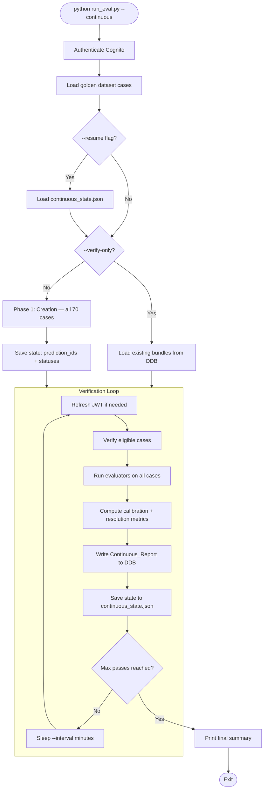
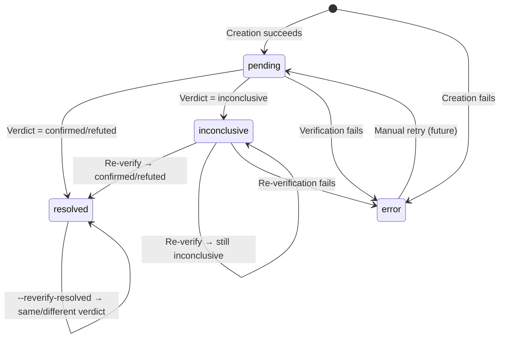
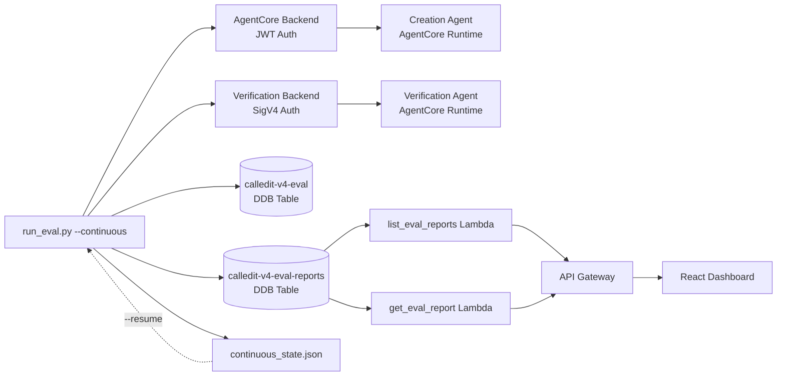

# Design Document: Continuous Verification Eval

## Overview

The continuous verification eval system extends the existing batched eval pipeline (`eval/run_eval.py`) to mirror production's continuous verification behavior. Instead of running creation and verification in a single batch, this system creates all 70 golden dataset predictions once, then repeatedly re-verifies inconclusive predictions as real-world events resolve — tracking the system's evolving performance over time.

The core insight: the current eval only meaningfully evaluates ~22 cases with hardcoded expected outcomes. The remaining 48 cases represent non-deterministic future events (sports scores, stock prices, weather) that can only be evaluated after the real world catches up. This system brings the production scanner pattern (EventBridge → verify every 15 min) into the eval framework.

### Key Design Decisions

1. **Extend `run_eval.py` rather than create a new file** — the `--continuous` flag activates a different execution path within the existing CLI, reusing `parse_args()`, `build_evaluators()`, backends, and report infrastructure.
2. **Local JSON state file** (`eval/continuous_state.json`) — simple, inspectable, no additional DDB tables. The state file is the source of truth for case lifecycle across process restarts.
3. **Agent type `continuous`** in Reports_Table — separate from `unified` so dashboard tabs don't mix batched and continuous runs.
4. **Recharts for new charts** — the dashboard already uses `recharts` (see `CalibrationScatter.tsx`, `TrendChart.tsx`), so we stay consistent.

## Architecture

### Continuous Loop Flow



### Case Lifecycle State Machine



### System Context



## Components and Interfaces

### 1. `ContinuousEvalRunner` (new class in `eval/run_eval.py`)

Orchestrates the continuous loop. Extracted from `main()` to keep the existing batched path untouched.

```python
class ContinuousEvalRunner:
    """Orchestrates create-once, verify-repeatedly eval loop."""

    def __init__(
        self,
        args: argparse.Namespace,
        cases: list[Case],
        creation_backend: AgentCoreBackend,
        verification_backend: VerificationBackend,
        evaluators: list,
        state: ContinuousState,
    ): ...

    def run(self) -> None:
        """Main loop: create (if needed) → verify → evaluate → report → sleep → repeat."""
        ...

    def _run_creation_phase(self) -> None:
        """Run creation agent on all cases. Populates state with prediction_ids."""
        ...

    def _run_verification_pass(self) -> list[dict]:
        """Single verification pass over eligible cases. Returns task outputs."""
        ...

    def _get_eligible_cases(self) -> list[CaseState]:
        """Return cases eligible for verification this pass."""
        ...

    def _run_evaluation(self, task_outputs: list[dict]) -> dict:
        """Run evaluators and compute calibration. Returns report dict."""
        ...

    def _write_report(self, report: dict) -> None:
        """Write Continuous_Report to DDB Reports_Table."""
        ...

    def _handle_sigint(self, signum, frame) -> None:
        """Graceful shutdown: finish current pass, write report, exit."""
        ...
```

### 2. `ContinuousState` (new module: `eval/continuous_state.py`)

Manages the persistent state file. Pure data operations — no I/O in the core logic (file read/write at boundaries).

```python
@dataclass
class CaseState:
    """Per-case lifecycle state."""
    case_id: str
    prediction_id: str | None
    status: Literal["pending", "inconclusive", "resolved", "error"]
    verdict: str | None          # confirmed, refuted, inconclusive, None
    confidence: float | None
    evidence: list[dict] | None
    reasoning: str | None
    creation_error: str | None
    verification_error: str | None
    creation_duration: float
    verification_date: str | None  # ISO 8601 from parsed_claim
    resolved_on_pass: int | None   # Pass number when first resolved
    verifiability_score: float | None
    score_tier: str | None
    verdict_history: list[VerdictEntry]  # All verdicts across passes

@dataclass
class VerdictEntry:
    """Single verdict from one verification pass."""
    pass_number: int
    timestamp: str
    verdict: str
    confidence: float | None

@dataclass
class ContinuousState:
    """Top-level state persisted to continuous_state.json."""
    pass_number: int
    cases: dict[str, CaseState]  # keyed by case_id
    pass_timestamps: list[str]   # ISO timestamps of each completed pass
    created_at: str              # When the continuous run started
    eval_table: str              # DDB table name used

    @classmethod
    def load(cls, path: str) -> "ContinuousState": ...

    def save(self, path: str) -> None: ...

    @classmethod
    def fresh(cls, eval_table: str) -> "ContinuousState": ...

    def get_eligible_for_verification(self, reverify_resolved: bool = False) -> list[CaseState]:
        """Return cases that should be verified this pass."""
        ...

    def update_case_verdict(self, case_id: str, verdict: str, confidence: float | None, pass_number: int) -> None:
        """Update a case's status based on verification result."""
        ...
```

### 3. `ContinuousMetrics` (new module: `eval/continuous_metrics.py`)

Computes continuous-specific metrics: resolution rate, stale inconclusive rate, resolution speed by tier.

```python
def compute_resolution_rate(state: ContinuousState) -> float:
    """Count of resolved / count of verified-at-least-once."""
    ...

def compute_stale_inconclusive_rate(state: ContinuousState, now: datetime | None = None) -> float:
    """Count of (inconclusive AND verification_date in past) / count of (verification_date in past)."""
    ...

def compute_resolution_speed_by_tier(state: ContinuousState) -> dict[str, float | None]:
    """Median pass number at which each V-score tier first resolved."""
    ...

def compute_continuous_calibration(state: ContinuousState, task_outputs: list[dict]) -> dict:
    """Full calibration dict for continuous reports. Extends base calibration."""
    ...
```

### 4. CLI Flag Extensions (in `parse_args()`)

New flags added to the existing `argparse` parser:

| Flag | Type | Default | Description |
|------|------|---------|-------------|
| `--continuous` | `store_true` | `False` | Enable continuous verification mode |
| `--interval` | `int` | `15` | Minutes between verification passes |
| `--max-passes` | `int` | `None` | Stop after N passes (None = indefinite) |
| `--once` | `store_true` | `False` | Single verification pass, no creation |
| `--reverify-resolved` | `store_true` | `False` | Re-verify already-resolved cases |
| `--resume` | *(exists)* | — | Load state from `continuous_state.json` |
| `--verify-only` | *(exists)* | — | Skip creation, load existing bundles |
| `--skip-cleanup` | *(exists)* | — | Implied by `--continuous` |

Flag interaction rules:
- `--continuous` implies `--skip-cleanup` (bundles must persist across passes)
- `--continuous --verify-only` skips creation, loads bundles from DDB, starts verification loop
- `--continuous --once` runs a single verification pass (no creation, no loop)
- `--continuous --resume` loads `continuous_state.json` and continues from last pass
- `--continuous --resume --verify-only` loads state AND refreshes bundles from DDB

### 5. Dashboard Components

#### New Tab: `ContinuousTab.tsx`

A new tab component that extends `AgentTab` with continuous-specific visualizations:

```
EvalDashboard
├── AGENT_TABS: [...existing, { key: 'continuous', label: 'Continuous Eval' }]
├── AgentTab (existing — handles run selector, metadata, case table)
└── ContinuousTab (new — wraps AgentTab + adds charts)
    ├── ResolutionRateChart (new — line chart over passes)
    ├── ResolutionSpeedChart (new — grouped bar chart by tier)
    └── CaseTable (existing — with color coding enhancements)
```

#### `ResolutionRateChart.tsx` (new)

Line chart using `recharts.LineChart` (same pattern as `TrendChart.tsx`):
- X-axis: pass number (1, 2, 3, ...)
- Y-axis: rate (0.0–1.0)
- Line 1: resolution rate (green, `#22c55e`)
- Line 2: stale inconclusive rate (red, `#ef4444`)
- Tooltip: pass timestamp + exact values
- Requires 2+ reports to render; shows "Insufficient data" message otherwise

#### `ResolutionSpeedChart.tsx` (new)

Grouped bar chart using `recharts.BarChart`:
- X-axis: V-score tier (high, moderate, low)
- Y-axis: median resolution pass number
- Bars colored by tier: high=green, moderate=yellow, low=red
- Null tiers rendered as empty bar with "N/A" label

#### CaseTable Color Coding Enhancements

Extended verdict cell rendering in `CaseTable.tsx` for `agentType === 'continuous'`:

| Case State | Verdict Cell Color | Row Background |
|---|---|---|
| Resolved (confirmed/refuted) | Green `#22c55e` | Default |
| Inconclusive + verification date past | Red `#ef4444` | Default |
| Not yet verified / date in future | Grey `#64748b` | Default |
| Creation or verification error | — | Dark red `#3b1111` |

### 6. Report Schema Extension

The `Continuous_Report` written to DDB follows the existing report schema with additions:

```python
{
    "run_metadata": {
        "description": "Continuous eval — pass 3",
        "agent": "continuous",           # New agent type
        "run_tier": "full",
        "timestamp": "2025-01-15T10:30:00+00:00",
        "duration_seconds": 245.0,
        "case_count": 70,
        "pass_number": 3,                # NEW: which pass produced this
        "total_passes": 3,               # NEW: total passes so far
        "interval_minutes": 15,          # NEW: configured interval
        "dataset_sources": ["eval/golden_dataset.json"],
        "git_commit": "abc1234",
        "prompt_versions": {"prediction_parser": "2", ...},
    },
    "creation_scores": { ... },          # Same as unified
    "verification_scores": { ... },      # Same as unified
    "calibration_scores": {
        # Existing calibration fields
        "calibration_accuracy": 0.85,
        "mean_absolute_error": 0.12,
        "high_score_confirmation_rate": 0.90,
        "low_score_failure_rate": 0.30,
        "verdict_distribution": {"confirmed": 15, "refuted": 5, "inconclusive": 40, "error": 10},
        # NEW continuous-specific fields
        "resolution_rate": 0.35,
        "stale_inconclusive_rate": 0.15,
        "resolution_speed_by_tier": {
            "high": 2.0,       # Median pass number
            "moderate": 4.5,
            "low": null         # < 2 resolved cases
        },
    },
    "case_results": [
        {
            "case_id": "base-001",
            "prediction_text": "...",
            "status": "resolved",           # NEW: case lifecycle status
            "verdict": "confirmed",
            "confidence": 0.92,
            "verifiability_score": 0.85,
            "score_tier": "high",
            "resolved_on_pass": 2,          # NEW: when it first resolved
            "verification_date": "2025-01-14T00:00:00Z",  # NEW: for stale calc
            "verdict_history": [             # NEW: all verdicts across passes
                {"pass": 1, "verdict": "inconclusive", "confidence": 0.3},
                {"pass": 2, "verdict": "confirmed", "confidence": 0.92},
            ],
            "creation_error": null,
            "verification_error": null,
            "scores": { ... },              # Per-evaluator scores
        },
        ...
    ],
}
```

## Data Models

### `continuous_state.json` Schema

```json
{
  "pass_number": 3,
  "created_at": "2025-01-15T08:00:00+00:00",
  "eval_table": "calledit-v4-eval",
  "pass_timestamps": [
    "2025-01-15T08:05:00+00:00",
    "2025-01-15T08:20:00+00:00",
    "2025-01-15T08:35:00+00:00"
  ],
  "cases": {
    "base-001": {
      "case_id": "base-001",
      "prediction_id": "abc-123",
      "status": "resolved",
      "verdict": "confirmed",
      "confidence": 0.92,
      "evidence": [{"source": "...", "text": "..."}],
      "reasoning": "The event occurred as predicted...",
      "creation_error": null,
      "verification_error": null,
      "creation_duration": 12.5,
      "verification_date": "2025-01-14T00:00:00Z",
      "resolved_on_pass": 2,
      "verifiability_score": 0.85,
      "score_tier": "high",
      "verdict_history": [
        {"pass_number": 1, "timestamp": "2025-01-15T08:05:00+00:00", "verdict": "inconclusive", "confidence": 0.3},
        {"pass_number": 2, "timestamp": "2025-01-15T08:20:00+00:00", "verdict": "confirmed", "confidence": 0.92}
      ]
    },
    "base-002": {
      "case_id": "base-002",
      "prediction_id": null,
      "status": "error",
      "verdict": null,
      "confidence": null,
      "evidence": null,
      "reasoning": null,
      "creation_error": "AgentCore invocation failed: HTTP 500",
      "verification_error": null,
      "creation_duration": 3.2,
      "verification_date": null,
      "resolved_on_pass": null,
      "verifiability_score": null,
      "score_tier": null,
      "verdict_history": []
    }
  }
}
```

### DDB Reports_Table Schema (unchanged)

The existing schema is reused with `PK = AGENT#continuous`:

| Key | Value |
|-----|-------|
| PK | `AGENT#continuous` |
| SK | ISO 8601 timestamp |
| run_metadata | Dict with `pass_number`, `agent: "continuous"`, etc. |
| creation_scores | Dict of creation evaluator scores |
| verification_scores | Dict of verification evaluator scores |
| calibration_scores | Dict with resolution_rate, stale_inconclusive_rate, resolution_speed_by_tier |
| case_results | List of per-case dicts (may be split to `SK={ts}#CASES` if >390KB) |

### Dashboard TypeScript Types (additions to `types.ts`)

```typescript
// Add to AgentType union
export type AgentType = 'creation' | 'verification' | 'calibration' | 'unified' | 'continuous';

// Add to AGENT_TABS
{ key: 'continuous', label: 'Continuous Eval' }

// Extended CaseResult for continuous
export interface ContinuousCaseResult extends CaseResult {
  status?: 'pending' | 'inconclusive' | 'resolved' | 'error';
  resolved_on_pass?: number | null;
  verification_date?: string | null;
  verdict_history?: Array<{
    pass: number;
    verdict: string;
    confidence: number | null;
  }>;
}

// Continuous calibration scores
export interface ContinuousCalibrationScores {
  resolution_rate?: number;
  stale_inconclusive_rate?: number;
  resolution_speed_by_tier?: {
    high: number | null;
    moderate: number | null;
    low: number | null;
  };
}
```


## Correctness Properties

*A property is a characteristic or behavior that should hold true across all valid executions of a system — essentially, a formal statement about what the system should do. Properties serve as the bridge between human-readable specifications and machine-verifiable correctness guarantees.*

### Property 1: State serialization round-trip

*For any* valid `ContinuousState` object (with arbitrary case_ids, prediction_ids, statuses, verdicts, verdict histories, pass numbers, and timestamps), serializing to JSON and deserializing back SHALL produce an equivalent `ContinuousState` object with all fields preserved.

**Validates: Requirements 1.2, 8.2**

### Property 2: Case eligibility for verification

*For any* `ContinuousState` with cases in arbitrary statuses (pending, inconclusive, resolved, error) and *for any* boolean value of `reverify_resolved`:
- Cases with status `pending` or `inconclusive` that have a non-null `prediction_id` SHALL be included in the eligible set
- Cases with status `resolved` SHALL be excluded when `reverify_resolved` is False, and included when `reverify_resolved` is True
- Cases with status `error` and no `prediction_id` SHALL always be excluded

**Validates: Requirements 2.1, 3.1, 3.3, 3.4**

### Property 3: State transition correctness

*For any* `ContinuousState` and *for any* case within it, when `update_case_verdict` is called:
- A verdict of `confirmed` or `refuted` SHALL transition the case status to `resolved` and set `resolved_on_pass` to the current pass number (if not already set)
- A verdict of `inconclusive` SHALL transition the case status to `inconclusive`
- A verification error (None verdict) SHALL preserve the case's previous verdict and status
- In all cases, the new verdict SHALL be appended to the case's `verdict_history`

**Validates: Requirements 2.2, 2.3, 2.4, 3.2**

### Property 4: Resolution rate computation

*For any* `ContinuousState` where cases have arbitrary statuses and verdict histories, `compute_resolution_rate` SHALL return a value equal to `count(cases with status resolved) / count(cases with len(verdict_history) >= 1)`. When no cases have been verified, the result SHALL be 0.0. The result SHALL always be in the range [0.0, 1.0].

**Validates: Requirements 5.1**

### Property 5: Stale inconclusive rate computation

*For any* `ContinuousState` with cases having arbitrary verification dates and verdicts, and *for any* reference time `now`, `compute_stale_inconclusive_rate` SHALL return a value equal to `count(cases where verdict == inconclusive AND verification_date < now) / count(cases where verification_date < now)`. Cases whose verification_date is in the future or null SHALL be excluded from both numerator and denominator. When no cases have past verification dates, the result SHALL be 0.0.

**Validates: Requirements 5.2, 5.3**

### Property 6: Resolution speed by tier

*For any* `ContinuousState` with cases having arbitrary verifiability scores and resolved_on_pass values, `compute_resolution_speed_by_tier` SHALL return the statistical median of `resolved_on_pass` for each V-score tier (high >= 0.7, moderate 0.4–0.7, low < 0.4). When a tier has fewer than 2 resolved cases, the median SHALL be `null` for that tier.

**Validates: Requirements 6.1, 6.2, 6.3, 6.5**

### Property 7: Creation phase resilience

*For any* list of cases where a random subset of creation invocations fail, the resulting `ContinuousState` SHALL contain an entry for every case: successful cases SHALL have status `pending` with a non-null `prediction_id`, and failed cases SHALL have status `error` with a non-null `creation_error`. The total number of entries SHALL equal the input case count.

**Validates: Requirements 1.1, 1.3**

## Error Handling

### Creation Phase Errors

| Error | Handling | Recovery |
|-------|----------|----------|
| AgentCore HTTP 5xx | Log error, mark case as `error` status, continue to next case | Case excluded from verification; retry on next `--resume` run |
| AgentCore timeout (>300s) | Same as HTTP 5xx | Same |
| Cognito token expired | Refresh token via `get_cognito_token()`, retry current case once | If refresh fails, log and continue |
| All cases fail creation | Log warning, proceed to verification loop (no eligible cases) | Operator investigates and re-runs |

### Verification Phase Errors

| Error | Handling | Recovery |
|-------|----------|----------|
| Verification agent HTTP error | Log error, preserve previous verdict, continue to next case | Case retried on next pass |
| Verification agent timeout | Same as HTTP error | Same |
| SigV4 credential expiry | boto3 auto-refreshes from credential chain | Transparent |
| Cognito JWT expiry (>50 min) | `_maybe_refresh_token()` called before each case batch | If refresh fails, log and continue with stale token |
| DDB read failure (bundle load) | Log error, mark case as `error`, continue | Case excluded from this pass |

### State Persistence Errors

| Error | Handling | Recovery |
|-------|----------|----------|
| `continuous_state.json` write failure | Log error, print warning, continue loop | State may be lost if process crashes before next successful write |
| `continuous_state.json` corrupt on `--resume` | Catch `json.JSONDecodeError`, start fresh from pass 1 with warning | Operator loses progress but can re-run |
| `continuous_state.json` missing on `--resume` | Start fresh from pass 1 (per Requirement 8.4) | Normal behavior |

### Report Writing Errors

| Error | Handling | Recovery |
|-------|----------|----------|
| DDB `write_report` failure | Log warning, continue loop (report lost for this pass) | Next pass writes a new report |
| Report exceeds 400KB | Existing split logic in `report_store.py` handles this | Transparent |

### Graceful Shutdown (SIGINT)

When Ctrl+C is received:
1. Set `_shutdown_requested = True` flag
2. Current verification pass completes (cases in progress finish)
3. Evaluators run on current pass results
4. Final report written to DDB
5. State saved to `continuous_state.json`
6. Summary printed
7. Process exits with code 0

If a second SIGINT is received during shutdown, force-exit immediately.

## Testing Strategy

### Property-Based Tests (Hypothesis)

Property-based tests validate the 7 correctness properties using the `hypothesis` library. Each test runs a minimum of 100 iterations with generated inputs.

| Property | Module Under Test | Generator Strategy |
|----------|-------------------|-------------------|
| P1: State round-trip | `eval/continuous_state.py` | Generate `ContinuousState` with random cases, statuses, verdicts, dates |
| P2: Case eligibility | `eval/continuous_state.py` | Generate states with random case statuses + random `reverify_resolved` bool |
| P3: State transitions | `eval/continuous_state.py` | Generate states + random verdict updates (confirmed/refuted/inconclusive/None) |
| P4: Resolution rate | `eval/continuous_metrics.py` | Generate states with random status distributions |
| P5: Stale inconclusive | `eval/continuous_metrics.py` | Generate states with random dates + random `now` reference time |
| P6: Resolution speed | `eval/continuous_metrics.py` | Generate states with random V-scores and resolved_on_pass values |
| P7: Creation resilience | `eval/run_eval.py` | Generate case lists with random failure positions (mock backend) |

Each property test is tagged with:
```python
# Feature: continuous-verification-eval, Property N: [property text]
```

### Unit Tests (pytest)

Unit tests cover specific examples, edge cases, and integration points:

**`eval/continuous_state.py`:**
- Load from non-existent file → fresh state
- Load from corrupt JSON → fresh state with warning
- `fresh()` creates state with pass_number=0, empty cases
- Resume increments pass_number correctly

**`eval/continuous_metrics.py`:**
- Resolution rate with 0 verified cases → 0.0
- Resolution rate with all resolved → 1.0
- Stale rate with all future dates → 0.0
- Resolution speed with exactly 1 resolved case per tier → null
- Resolution speed with exactly 2 resolved cases → correct median

**`eval/run_eval.py` (continuous path):**
- `--continuous` implies `--skip-cleanup`
- `--continuous --verify-only` skips creation
- `--continuous --once` runs single pass
- `--interval` default is 15
- `--max-passes 3` runs exactly 3 passes (mocked backends)

**Dashboard (`frontend-v4/`):**
- `AGENT_TABS` includes `continuous` entry
- `ContinuousCaseResult` type includes `status`, `resolved_on_pass`, `verdict_history`
- Verdict color function returns correct colors for each state
- Resolution rate chart data transformation
- Resolution speed chart handles null tiers

### Integration Tests

- End-to-end: `--continuous --max-passes 2 --tier smoke` with real backends (manual, not CI)
- State persistence: create → kill → resume → verify state continuity
- Report store: verify `AGENT#continuous` reports appear in dashboard API

### Test Configuration

```python
# hypothesis settings for property tests
from hypothesis import settings

@settings(max_examples=100, deadline=None)
```

Test files:
- `eval/tests/test_continuous_state.py` — P1, P2, P3 + unit tests
- `eval/tests/test_continuous_metrics.py` — P4, P5, P6 + unit tests
- `eval/tests/test_continuous_runner.py` — P7 + unit tests for CLI flags and orchestration
