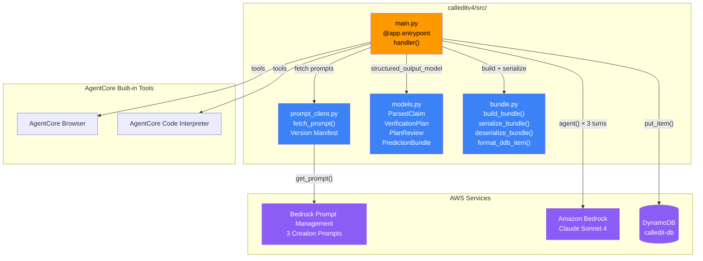
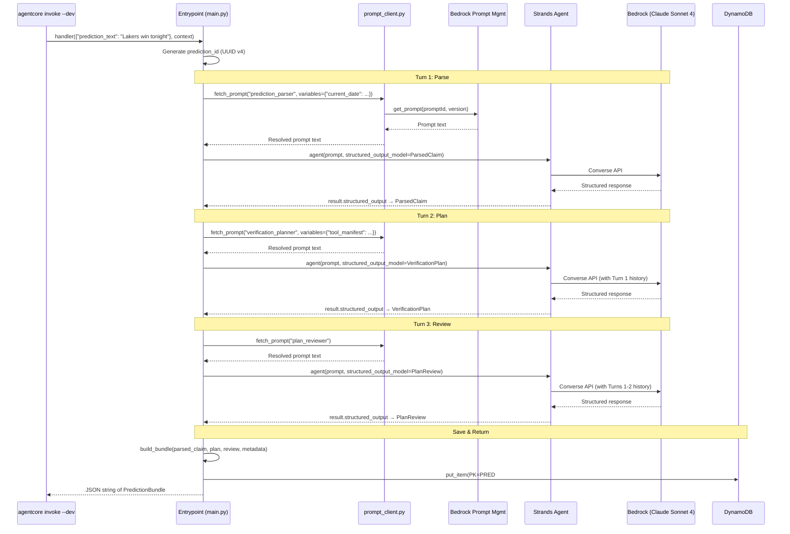
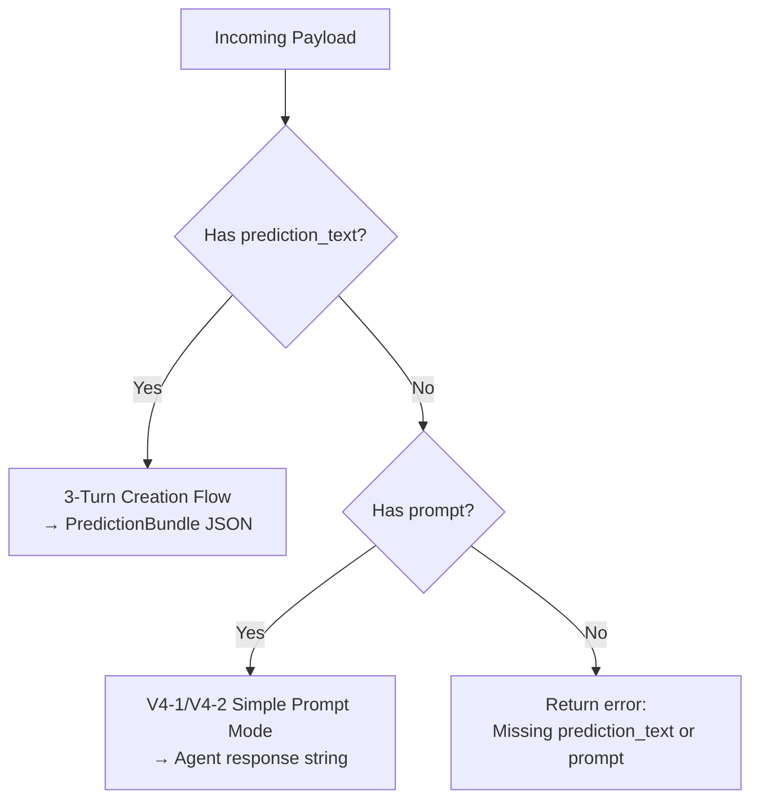

# Design Document — Spec V4-3a: Creation Agent Core

## Overview

This spec implements the 3-turn creation flow that transforms raw prediction text into a structured prediction bundle. It's the first v4 spec with real business logic, building on V4-1 (AgentCore Foundation) and V4-2 (Built-in Tools).

The creation agent is a single Strands Agent instance that processes 3 sequential prompt turns:
1. **Parse** (`calledit-prediction-parser`) — extract the prediction statement and resolve dates
2. **Plan** (`calledit-verification-planner`) — build a verification plan with sources, criteria, steps
3. **Review** (`calledit-plan-reviewer`) — score verifiability (0.0-1.0) AND generate clarification questions

This is a 3-turn design, not 4. The original score and review turns from Decision 94 are merged into a single review turn (Decision 99) — scoring verifiability and identifying assumptions are two perspectives on the same analysis of the verification plan.

Each turn uses Strands `structured_output_model` with a turn-specific Pydantic model for type-safe extraction. Conversation history accumulates naturally across `agent()` calls on the same instance — confirmed by Strands docs.

The spec delivers 5 things:
1. **Prompt Client** — clean port of v3 `prompt_client.py` with Decision 98 fallback behavior
2. **CloudFormation prompts** — 3 new creation prompts added to the existing template
3. **3-turn flow** — orchestrated in the entrypoint with Pydantic structured output
4. **DDB save** — prediction bundle saved to `calledit-db` with float→Decimal conversion
5. **Entrypoint integration** — backward-compatible with V4-1/V4-2 simple prompt mode

### Decision 99: 3 Turns, Not 4

The original architecture doc (Decision 94) described 4 turns: Parse → Plan → Score → Review. After analysis, scoring and review are merged into a single turn because:
- The reviewer already needs to understand the verification plan deeply to generate targeted questions
- Scoring verifiability requires the same deep analysis of the plan's assumptions
- Two separate LLM calls doing overlapping analysis wastes tokens and latency
- The merged turn produces a `PlanReview` model with both `verifiability_score` and `reviewable_sections`

This reduces latency by ~1 LLM call and simplifies the flow without losing any output quality.

## Architecture

### Component Diagram



### 3-Turn Request Flow



### Entrypoint Routing



### AgentCore Guardrail Compliance

| Guardrail | Status | Notes |
|-----------|--------|-------|
| BedrockAgentCoreApp + @app.entrypoint + app.run() | ✅ Compliant | Same pattern as V4-1/V4-2 |
| No hardcoded prompts in agent code | ✅ Compliant | All prompts from Prompt Management |
| No local MCP subprocesses | ✅ Compliant | Browser + Code Interpreter via AgentCore |
| No custom OTEL | ✅ Compliant | AgentCore Observability |
| Fail clearly on dependency failure (non-production) | ✅ Compliant | Decision 98 |
| Agent created per-request | ✅ Compliant | Fresh Agent instance in handler() |
| No deviations flagged | ✅ | All patterns align with steering doc |

## Components and Interfaces

### 1. Prompt Client (`calleditv4/src/prompt_client.py`)

Ported from v3 `backend/calledit-backend/handlers/strands_make_call/prompt_client.py`. Cleaned up per Decision 98: no lazy-loaded fallback imports from v3 agent modules, no v3 prompt identifiers.

```python
"""
Bedrock Prompt Management Client (v4)

Fetches versioned prompts from Bedrock Prompt Management.
Fallback behavior controlled by CALLEDIT_ENV (Decision 98):
- production: graceful fallback to hardcoded defaults, log warning
- any other value / unset: raise exception, fail clearly
"""

import os
import logging
from typing import Dict, Optional

import boto3

logger = logging.getLogger(__name__)

# v4 creation prompt identifiers — populated after CloudFormation deploy
# These are the 10-character Prompt IDs from the calledit-prompts stack
PROMPT_IDENTIFIERS: Dict[str, str] = {
    "prediction_parser": "",      # Set after CFN deploy
    "verification_planner": "",   # Set after CFN deploy
    "plan_reviewer": "",          # Set after CFN deploy
}

# Hardcoded fallback prompts for production-only graceful degradation
_FALLBACK_PROMPTS: Dict[str, str] = {
    "prediction_parser": (
        "You are a prediction parser. Extract the prediction statement "
        "and resolve dates relative to {{current_date}}. Return JSON with "
        "statement, verification_date (ISO 8601), and date_reasoning."
    ),
    "verification_planner": (
        "You are a verification planner. Build a verification plan with "
        "sources, criteria, and steps. Available tools: {{tool_manifest}}"
    ),
    "plan_reviewer": (
        "You are a plan reviewer. Score verifiability (0.0-1.0) across "
        "5 dimensions and identify assumptions for clarification questions."
    ),
}

_prompt_version_manifest: Dict[str, str] = {}


def _get_bedrock_agent_client():
    """Create a bedrock-agent client for Prompt Management API."""
    return boto3.client("bedrock-agent")


def _is_production() -> bool:
    """Check if running in production mode (Decision 98)."""
    return os.environ.get("CALLEDIT_ENV") == "production"


def fetch_prompt(
    prompt_name: str,
    version: Optional[str] = None,
    variables: Optional[Dict[str, str]] = None,
) -> str:
    """
    Fetch prompt text from Bedrock Prompt Management.

    Args:
        prompt_name: One of "prediction_parser", "verification_planner",
                     "plan_reviewer".
        version: Prompt version ("1", "2", ...) or "DRAFT".
                 Defaults to env var PROMPT_VERSION_{NAME} or "DRAFT".
        variables: Variable values to substitute (e.g., {"current_date": "..."}).

    Returns:
        Resolved prompt text string.

    Raises:
        Exception: In non-production mode, if Prompt Management fails.
    """
    prompt_id = PROMPT_IDENTIFIERS.get(prompt_name)
    if not prompt_id:
        msg = f"Unknown prompt name: {prompt_name}"
        if _is_production():
            logger.warning(msg)
            _prompt_version_manifest[prompt_name] = "fallback"
            return _resolve_variables(
                _FALLBACK_PROMPTS.get(prompt_name, ""), variables
            )
        raise ValueError(msg)

    if version is None:
        env_key = f"PROMPT_VERSION_{prompt_name.upper()}"
        version = os.environ.get(env_key, "DRAFT")

    try:
        client = _get_bedrock_agent_client()
        kwargs = {"promptIdentifier": prompt_id}
        if version != "DRAFT":
            kwargs["promptVersion"] = version

        response = client.get_prompt(**kwargs)
        variants = response.get("variants", [])
        if not variants:
            raise ValueError(
                f"Prompt '{prompt_name}' ({prompt_id}) version {version} "
                f"has no variants"
            )

        prompt_text = (
            variants[0]
            .get("templateConfiguration", {})
            .get("text", {})
            .get("text", "")
        )
        if not prompt_text:
            raise ValueError(
                f"Prompt '{prompt_name}' ({prompt_id}) version {version} "
                f"has empty text"
            )

        actual_version = str(response.get("version", version))
        _prompt_version_manifest[prompt_name] = actual_version
        logger.info(
            f"Fetched prompt '{prompt_name}' version {actual_version} "
            f"({len(prompt_text)} chars)"
        )
        return _resolve_variables(prompt_text, variables)

    except Exception as e:
        if _is_production():
            logger.warning(
                f"Prompt Management fallback for '{prompt_name}': "
                f"{type(e).__name__}: {e}"
            )
            _prompt_version_manifest[prompt_name] = "fallback"
            return _resolve_variables(
                _FALLBACK_PROMPTS.get(prompt_name, ""), variables
            )
        raise


def _resolve_variables(
    text: str, variables: Optional[Dict[str, str]]
) -> str:
    """Replace {{variable_name}} placeholders in prompt text."""
    if not variables or not text:
        return text
    for name, value in variables.items():
        text = text.replace("{{" + name + "}}", value)
    return text


def get_prompt_version_manifest() -> Dict[str, str]:
    """Return the current prompt version manifest."""
    return dict(_prompt_version_manifest)


def reset_manifest():
    """Reset the version manifest. Used in tests."""
    global _prompt_version_manifest
    _prompt_version_manifest = {}
```

**Key differences from v3:**
- No lazy-loaded fallback imports from v3 agent modules
- No v3 prompt identifiers (parser/categorizer/vb/review)
- Decision 98: non-production raises exceptions; production falls back to hardcoded defaults
- `_resolve_variables()` uses `{{name}}` consistently (v3 mixed `{{name}}` and `{name}`)
- `_is_production()` checks `CALLEDIT_ENV` env var

### 2. Pydantic Models (`calleditv4/src/models.py`)

Three structured output models for the 3 turns, plus the bundle model for serialization.

```python
"""Pydantic models for the 3-turn creation flow and prediction bundle."""

from typing import List
from pydantic import BaseModel, Field


class ParsedClaim(BaseModel):
    """Turn 1 output: extracted prediction statement with resolved dates."""
    statement: str = Field(
        description="The user's exact prediction statement"
    )
    verification_date: str = Field(
        description="ISO 8601 datetime for when to verify the prediction"
    )
    date_reasoning: str = Field(
        description="Explanation of how the date was resolved from the input"
    )


class VerificationPlan(BaseModel):
    """Turn 2 output: verification plan with sources, criteria, steps."""
    sources: List[str] = Field(
        description="Reliable sources to check for verification"
    )
    criteria: List[str] = Field(
        description="Measurable criteria for determining truth"
    )
    steps: List[str] = Field(
        description="Ordered verification steps to execute"
    )


class ReviewableSection(BaseModel):
    """A section of the verification plan that could be improved."""
    section: str = Field(
        description="The field name being reviewed"
    )
    improvable: bool = Field(
        description="Whether this section has questionable assumptions"
    )
    questions: List[str] = Field(
        description="Targeted clarification questions referencing specific plan elements"
    )
    reasoning: str = Field(
        description="What assumption in the verification plan this question validates"
    )


class PlanReview(BaseModel):
    """Turn 3 output: combined verifiability scoring and plan review."""
    verifiability_score: float = Field(
        ge=0.0, le=1.0,
        description="Likelihood (0.0-1.0) that the verification agent will "
                    "successfully determine the prediction's truth value"
    )
    verifiability_reasoning: str = Field(
        description="Explanation of the score across 5 dimensions"
    )
    reviewable_sections: List[ReviewableSection] = Field(
        description="Sections with assumptions that could be validated "
                    "via clarification questions"
    )
```

All models include `Field(description=...)` so Strands can generate accurate tool specifications for structured output extraction (Requirement 5.10).

### 3. Bundle Construction (`calleditv4/src/bundle.py`)

Pure functions for building, serializing, and formatting the prediction bundle.

```python
"""Prediction bundle construction, serialization, and DDB formatting."""

import json
import uuid
from datetime import datetime, timezone
from decimal import Decimal
from typing import Any, Dict, Optional


def generate_prediction_id() -> str:
    """Generate a prediction ID in the format pred-{uuid4}."""
    return f"pred-{uuid.uuid4()}"


def build_bundle(
    prediction_id: str,
    user_id: str,
    raw_prediction: str,
    parsed_claim: Dict[str, Any],
    verification_plan: Dict[str, Any],
    verifiability_score: float,
    verifiability_reasoning: str,
    reviewable_sections: list,
    prompt_versions: Dict[str, str],
) -> Dict[str, Any]:
    """Assemble the prediction bundle from all 3 turn outputs."""
    return {
        "prediction_id": prediction_id,
        "user_id": user_id,
        "raw_prediction": raw_prediction,
        "parsed_claim": parsed_claim,
        "verification_plan": verification_plan,
        "verifiability_score": verifiability_score,
        "verifiability_reasoning": verifiability_reasoning,
        "reviewable_sections": reviewable_sections,
        "clarification_rounds": 0,
        "created_at": datetime.now(timezone.utc).isoformat(),
        "status": "pending",
        "prompt_versions": prompt_versions,
    }


def serialize_bundle(bundle: Dict[str, Any]) -> str:
    """Serialize a prediction bundle to a JSON string."""
    return json.dumps(bundle, default=str)


def deserialize_bundle(json_str: str) -> Dict[str, Any]:
    """Deserialize a JSON string back to a prediction bundle dict."""
    return json.loads(json_str)


def _convert_floats_to_decimal(obj: Any) -> Any:
    """Recursively convert float values to Decimal for DynamoDB."""
    if isinstance(obj, float):
        return Decimal(str(obj))
    if isinstance(obj, dict):
        return {k: _convert_floats_to_decimal(v) for k, v in obj.items()}
    if isinstance(obj, list):
        return [_convert_floats_to_decimal(item) for item in obj]
    return obj


def format_ddb_item(bundle: Dict[str, Any]) -> Dict[str, Any]:
    """Format a prediction bundle as a DynamoDB item with PK/SK."""
    item = _convert_floats_to_decimal(bundle)
    item["PK"] = f"PRED#{bundle['prediction_id']}"
    item["SK"] = "BUNDLE"
    return item
```

### 4. Updated Entrypoint (`calleditv4/src/main.py`)

The entrypoint evolves from V4-2's simple prompt mode to support both the 3-turn creation flow and backward-compatible simple prompt mode.

```python
import json
import logging
import os

from bedrock_agentcore import RequestContext
from bedrock_agentcore.runtime import BedrockAgentCoreApp
from strands import Agent
from strands.models.bedrock import BedrockModel
from strands_tools.browser import AgentCoreBrowser
from strands_tools.code_interpreter import AgentCoreCodeInterpreter
from strands_tools import current_time

import boto3

from models import ParsedClaim, VerificationPlan, PlanReview
from prompt_client import fetch_prompt, get_prompt_version_manifest
from bundle import (
    generate_prediction_id, build_bundle,
    serialize_bundle, format_ddb_item,
)

logger = logging.getLogger(__name__)

app = BedrockAgentCoreApp()

MODEL_ID = "us.anthropic.claude-sonnet-4-20250514-v1:0"
DYNAMODB_TABLE_NAME = os.environ.get("DYNAMODB_TABLE_NAME", "calledit-db")

SIMPLE_PROMPT_SYSTEM = (
    "You are the CalledIt v4 agent. "
    "You have access to two tools:\n"
    "1. Browser — navigate URLs, search the web, extract content.\n"
    "2. Code Interpreter — execute Python code in a secure sandbox.\n"
    "Use the appropriate tool when the user's request would benefit from it. "
    "Respond helpfully to any message."
)

browser_tool = AgentCoreBrowser()
code_interpreter_tool = AgentCoreCodeInterpreter()
TOOLS = [browser_tool.browser, code_interpreter_tool.code_interpreter, current_time]


def _get_tool_manifest() -> str:
    """Build a tool manifest string describing available tools."""
    return (
        "- Browser: navigate URLs, search the web, extract content from pages\n"
        "- Code Interpreter: execute Python code for calculations, "
        "date math, data analysis\n"
        "- current_time: get the current date and time with timezone info"
    )


def _run_creation_flow(prediction_text: str, user_id: str) -> str:
    """Execute the 3-turn creation flow and return the bundle as JSON."""
    from datetime import datetime, timezone

    prediction_id = generate_prediction_id()
    current_date = datetime.now(timezone.utc).strftime("%Y-%m-%d %H:%M:%S UTC")
    tool_manifest = _get_tool_manifest()

    model = BedrockModel(model_id=MODEL_ID)
    agent = Agent(model=model, tools=TOOLS)

    # Turn 1: Parse
    parse_prompt = fetch_prompt(
        "prediction_parser",
        variables={"current_date": current_date},
    )
    parse_input = f"{parse_prompt}\n\nPrediction: {prediction_text}"
    parse_result = agent(parse_input, structured_output_model=ParsedClaim)
    parsed_claim = parse_result.structured_output

    # Turn 2: Plan
    plan_prompt = fetch_prompt(
        "verification_planner",
        variables={"tool_manifest": tool_manifest},
    )
    plan_result = agent(plan_prompt, structured_output_model=VerificationPlan)
    verification_plan = plan_result.structured_output

    # Turn 3: Review
    review_prompt = fetch_prompt("plan_reviewer")
    review_result = agent(review_prompt, structured_output_model=PlanReview)
    plan_review = review_result.structured_output

    # Build bundle
    bundle = build_bundle(
        prediction_id=prediction_id,
        user_id=user_id,
        raw_prediction=prediction_text,
        parsed_claim=parsed_claim.model_dump(),
        verification_plan=verification_plan.model_dump(),
        verifiability_score=plan_review.verifiability_score,
        verifiability_reasoning=plan_review.verifiability_reasoning,
        reviewable_sections=[s.model_dump() for s in plan_review.reviewable_sections],
        prompt_versions=get_prompt_version_manifest(),
    )

    # Save to DynamoDB
    try:
        ddb = boto3.resource("dynamodb")
        table = ddb.Table(DYNAMODB_TABLE_NAME)
        table.put_item(Item=format_ddb_item(bundle))
    except Exception as e:
        logger.error(f"DDB save failed for {prediction_id}: {e}", exc_info=True)
        bundle["save_error"] = str(e)

    return serialize_bundle(bundle)


@app.entrypoint
def handler(payload: dict, context: RequestContext) -> str:
    """Agent entrypoint — routes to creation flow or simple prompt mode."""
    if "prediction_text" in payload:
        user_id = payload.get("user_id", "anonymous")
        try:
            return _run_creation_flow(payload["prediction_text"], user_id)
        except Exception as e:
            logger.error(f"Creation flow failed: {e}", exc_info=True)
            return json.dumps({
                "error": f"Creation flow failed: {str(e)}",
                "turn": getattr(e, "turn", "unknown"),
            })

    if "prompt" in payload:
        try:
            model = BedrockModel(model_id=MODEL_ID)
            agent = Agent(
                model=model, system_prompt=SIMPLE_PROMPT_SYSTEM, tools=TOOLS
            )
            response = agent(payload["prompt"])
            return str(response)
        except Exception as e:
            logger.error(f"Agent invocation failed: {e}", exc_info=True)
            return json.dumps({"error": f"Agent invocation failed: {str(e)}"})

    return json.dumps({"error": "Missing 'prediction_text' or 'prompt' field in payload"})


if __name__ == "__main__":
    app.run()
```

**Key design decisions:**

- **`context: RequestContext`** — Uses the AgentCore `RequestContext` type instead of plain dict (Requirement 6.6). Enables future `context.session_id` support for V4-3b clarification rounds.
- **Single agent instance across 3 turns** — The same `Agent` object is called 3 times. Strands accumulates conversation history automatically, so Turn 2 sees Turn 1's context and Turn 3 sees both.
- **`structured_output_model` per-invocation** — Each `agent()` call passes a different Pydantic model. Strands validates the response and auto-retries on schema mismatch via `StructuredOutputException`.
- **No system prompt on creation agent** — The creation agent gets its instructions from Prompt Management prompts passed as user messages. The system prompt is omitted so the per-turn prompts have full control.
- **DDB save failure doesn't block return** — If `put_item` fails, the bundle is still returned with a `save_error` field. The caller gets the bundle regardless.
- **Backward compatibility** — `prompt` field triggers V4-1/V4-2 simple mode. `prediction_text` triggers creation flow. Neither field → error.

### 5. CloudFormation Prompt Resources

Three new prompt resources added to `infrastructure/prompt-management/template.yaml`, alongside the existing v3 prompts (which remain untouched per Decision 95).

```yaml
  # =========================================================================
  # V4 CREATION PROMPTS (3-turn flow)
  # =========================================================================

  PredictionParserPrompt:
    Type: AWS::Bedrock::Prompt
    Properties:
      Name: calledit-prediction-parser
      Description: "V4 Creation Turn 1 — extract prediction statement and resolve dates"
      DefaultVariant: default
      Tags:
        Project: calledit
        Agent: creation
      Variants:
        - Name: default
          ModelId: !Ref ModelId
          TemplateType: TEXT
          InferenceConfiguration:
            Text:
              Temperature: 0
              MaxTokens: 2000
          TemplateConfiguration:
            Text:
              InputVariables:
                - Name: current_date
              Text: |
                You are a prediction parser. Your task:
                1. Extract the user's EXACT prediction statement (preserve their words)
                2. Resolve time references relative to the current date/time: {{current_date}}
                3. Determine the verification_date — when this prediction can be checked
                4. Consider timezone implications for time-sensitive predictions

                TIME RESOLUTION RULES:
                - "tonight" → same day, 23:00 in the user's assumed timezone
                - "tomorrow" → next day, end of day
                - "this weekend" → upcoming Sunday, end of day
                - "by end of month" → last day of current month
                - "in 3 days" → current date + 3 days
                - If no time reference, use reasonable default based on claim type
                - Use the current_time tool if you need precise current time

                TIMEZONE HANDLING:
                - FIRST: Call the current_time tool — it returns the server's timezone.
                  Use this as your initial timezone reference for the user unless
                  the prediction provides stronger timezone signals.
                - If the prediction includes a location (e.g., "Lakers game tonight"),
                  infer the timezone from the location (Lakers → Los Angeles → America/Los_Angeles)
                  and use that instead of the server timezone.
                - If the prediction is time-sensitive but has no location context,
                  use the current_time tool's timezone as the default and note this
                  assumption in date_reasoning.
                - Always store verification_date in UTC (ISO 8601 with Z suffix)
                - Record what timezone you used and why in date_reasoning
                - Time-of-day references like "tonight", "this morning", "after lunch"
                  are timezone-dependent — a 3-hour difference between ET and PT can
                  change when verification should happen
                - Timezone priority: (1) explicit location in prediction, (2) current_time
                  tool's timezone, (3) UTC as last resort

                Return a JSON object with these exact fields:
                - statement: the user's exact prediction text
                - verification_date: ISO 8601 datetime string in UTC
                - date_reasoning: explanation of how you resolved the date,
                  including any timezone assumptions made

  PredictionParserPromptVersion:
    Type: AWS::Bedrock::PromptVersion
    Properties:
      PromptArn: !GetAtt PredictionParserPrompt.Arn
      Description: "v1 — initial creation parser prompt"

  VerificationPlannerPrompt:
    Type: AWS::Bedrock::Prompt
    Properties:
      Name: calledit-verification-planner
      Description: "V4 Creation Turn 2 — build verification plan"
      DefaultVariant: default
      Tags:
        Project: calledit
        Agent: creation
      Variants:
        - Name: default
          ModelId: !Ref ModelId
          TemplateType: TEXT
          InferenceConfiguration:
            Text:
              Temperature: 0
              MaxTokens: 3000
          TemplateConfiguration:
            Text:
              InputVariables:
                - Name: tool_manifest
              Text: |
                Based on the prediction you just parsed, build a verification plan.

                AVAILABLE TOOLS:
                {{tool_manifest}}

                Create a plan with:
                - sources: list of reliable data sources to check
                - criteria: list of measurable, objective criteria for truth
                - steps: ordered list of verification steps to execute

                RULES:
                - Criteria must match the prediction's specificity exactly
                - Do NOT add conditions the prediction didn't state
                - Do NOT omit conditions the prediction did state
                - Reference available tools by name in sources and steps
                - For subjective predictions, use self-report verification

                Return a JSON object with sources, criteria, and steps fields.
                All three must be lists.

  VerificationPlannerPromptVersion:
    Type: AWS::Bedrock::PromptVersion
    Properties:
      PromptArn: !GetAtt VerificationPlannerPrompt.Arn
      Description: "v1 — initial verification planner prompt"

  PlanReviewerPrompt:
    Type: AWS::Bedrock::Prompt
    Properties:
      Name: calledit-plan-reviewer
      Description: "V4 Creation Turn 3 — score verifiability and review plan"
      DefaultVariant: default
      Tags:
        Project: calledit
        Agent: creation
      Variants:
        - Name: default
          ModelId: !Ref ModelId
          TemplateType: TEXT
          InferenceConfiguration:
            Text:
              Temperature: 0
              MaxTokens: 3000
          TemplateConfiguration:
            Text:
              Text: |
                Review the verification plan you just created. Do two things:

                1. SCORE VERIFIABILITY (0.0 to 1.0):
                Evaluate across 5 dimensions:
                - Criteria Specificity (30%): Are criteria measurable and unambiguous?
                - Source Availability (25%): Do planned sources exist and are accessible?
                - Temporal Clarity (20%): Is the verification date clear and time-bound?
                  Consider: was a timezone assumed? Could a different timezone change
                  when verification should happen?
                - Outcome Objectivity (15%): Is the outcome binary (true/false)?
                - Tool Coverage (10%): Do available tools cover verification needs?

                2. IDENTIFY ASSUMPTIONS FOR CLARIFICATION:
                For each assumption in the verification plan that could be wrong:
                - What specific assumption was made?
                - What question would confirm or correct it?
                - Every question MUST reference a specific element from the plan

                TIMEZONE ASSUMPTIONS ARE HIGH-PRIORITY CLARIFICATION TARGETS:
                - If the parser assumed a timezone for a time-sensitive prediction
                  (e.g., "tonight", "this morning", "after 6pm"), flag it
                - Ask the user to confirm their timezone when it affects verification timing
                - Example: "The verification date assumes Pacific time (Lakers are in LA).
                  Are you in the Pacific timezone, or should we adjust?"

                Return a JSON object with:
                - verifiability_score: float 0.0-1.0
                - verifiability_reasoning: explanation of score across dimensions
                - reviewable_sections: list of objects, each with section, improvable,
                  questions, and reasoning fields

  PlanReviewerPromptVersion:
    Type: AWS::Bedrock::PromptVersion
    Properties:
      PromptArn: !GetAtt PlanReviewerPrompt.Arn
      Description: "v1 — initial plan reviewer prompt (merged score + review)"
```

The template Outputs section also gets 6 new entries (Id + Arn for each prompt). The existing v3 outputs remain unchanged.

## Data Models

### Invocation Payload (Input)

Two modes, determined by which field is present:

**Creation mode** (`prediction_text` field):
```json
{
    "prediction_text": "Lakers win tonight",
    "user_id": "user-123"
}
```
- `prediction_text` (required): raw prediction text from the user
- `user_id` (optional): defaults to `"anonymous"` if not provided

**Simple prompt mode** (`prompt` field — backward compatibility):
```json
{
    "prompt": "What's the weather in Seattle?"
}
```

### Prediction Bundle (Output — Creation Mode)

The complete bundle returned as a JSON string:

```json
{
    "prediction_id": "pred-550e8400-e29b-41d4-a716-446655440000",
    "user_id": "user-123",
    "raw_prediction": "Lakers win tonight",
    "parsed_claim": {
        "statement": "The Los Angeles Lakers will win their NBA game tonight",
        "verification_date": "2026-03-22T23:00:00Z",
        "date_reasoning": "Tonight refers to this evening, NBA games end by 11pm"
    },
    "verification_plan": {
        "sources": ["NBA scores via web search", "ESPN.com"],
        "criteria": ["Lakers final score > opponent final score"],
        "steps": [
            "Search for tonight's Lakers game schedule",
            "After game completion, search for final score",
            "Compare Lakers score to opponent score"
        ]
    },
    "verifiability_score": 0.92,
    "verifiability_reasoning": "Clear factual claim with specific team, timeframe, and objective outcome. NBA scores are publicly available.",
    "reviewable_sections": [
        {
            "section": "verification_plan.criteria",
            "improvable": true,
            "questions": [
                "The plan assumes this is a regular season game. Is this a playoff game?"
            ],
            "reasoning": "Regular season vs playoff could affect verification timing"
        }
    ],
    "clarification_rounds": 0,
    "created_at": "2026-03-22T18:30:00Z",
    "status": "pending",
    "prompt_versions": {
        "prediction_parser": "1",
        "verification_planner": "1",
        "plan_reviewer": "1"
    }
}
```

### DynamoDB Item Format

The bundle is stored with PK/SK keys and float→Decimal conversion:

```json
{
    "PK": "PRED#pred-550e8400-e29b-41d4-a716-446655440000",
    "SK": "BUNDLE",
    "prediction_id": "pred-550e8400-...",
    "verifiability_score": 0.92,
    "...": "all other bundle fields"
}
```

The `verifiability_score` float is converted to `Decimal("0.92")` before writing. DynamoDB rejects Python floats (Decision 82).

### Structured Output Models (Turn Outputs)

| Turn | Model | Fields | Strands Usage |
|------|-------|--------|---------------|
| 1. Parse | `ParsedClaim` | statement, verification_date, date_reasoning | `agent(prompt, structured_output_model=ParsedClaim)` |
| 2. Plan | `VerificationPlan` | sources, criteria, steps | `agent(prompt, structured_output_model=VerificationPlan)` |
| 3. Review | `PlanReview` | verifiability_score, verifiability_reasoning, reviewable_sections | `agent(prompt, structured_output_model=PlanReview)` |

Each model is a Pydantic `BaseModel`. Strands validates the LLM response against the model schema and raises `StructuredOutputException` on mismatch (with auto-retry built in).

### Error Response

```json
{
    "error": "Creation flow failed: <exception message>",
    "turn": "unknown"
}
```

Or for missing fields:
```json
{
    "error": "Missing 'prediction_text' or 'prompt' field in payload"
}
```

## Correctness Properties

*A property is a characteristic or behavior that should hold true across all valid executions of a system — essentially, a formal statement about what the system should do. Properties serve as the bridge between human-readable specifications and machine-verifiable correctness guarantees.*

### Property 1: Variable substitution replaces all placeholders

*For any* prompt text string containing `{{name}}` placeholders and *for any* dict of variable name→value mappings where every placeholder has a corresponding entry, the resolved text should contain none of the original `{{name}}` placeholders and should contain all the substituted values.

**Validates: Requirements 1.3**

### Property 2: Decision 98 fallback behavior

*For any* prompt name in the known set and *for any* exception raised during Prompt Management API calls: when `CALLEDIT_ENV` is not `production`, the exception should propagate (re-raised); when `CALLEDIT_ENV` is `production`, the function should return a non-empty fallback string and record `"fallback"` in the version manifest for that prompt name.

**Validates: Requirements 1.5, 1.6**

### Property 3: Bundle assembly invariants

*For any* valid combination of parsed claim dict, verification plan dict, plan review outputs, user ID string, raw prediction string, and prompt version manifest, the bundle returned by `build_bundle()` should: contain all required fields (`prediction_id`, `user_id`, `raw_prediction`, `parsed_claim`, `verification_plan`, `verifiability_score`, `verifiability_reasoning`, `reviewable_sections`, `clarification_rounds`, `created_at`, `status`, `prompt_versions`), have `status` equal to `"pending"`, have `clarification_rounds` equal to `0`, and have `created_at` as a valid ISO 8601 UTC timestamp string.

**Validates: Requirements 3.5, 5.5, 5.6**

### Property 4: Bundle serialization round-trip

*For any* valid prediction bundle dict, serializing it to JSON via `serialize_bundle()` and then deserializing back via `deserialize_bundle()` should produce a dict equivalent to the original (with float precision preserved via `default=str` handling).

**Validates: Requirements 5.8, 4.6**

### Property 5: DDB item format

*For any* valid prediction bundle dict, `format_ddb_item()` should produce a dict containing `PK` equal to `"PRED#{prediction_id}"` and `SK` equal to `"BUNDLE"`, plus all original bundle fields.

**Validates: Requirements 4.1, 4.2**

### Property 6: Float-to-Decimal conversion preserves value

*For any* Python float value (within reasonable range), `_convert_floats_to_decimal()` should produce a `Decimal` that, when converted back to float, equals the original value. Additionally, *for any* nested dict/list structure containing floats, the conversion should recursively replace all floats with Decimals and leave non-float values unchanged.

**Validates: Requirements 4.3**

### Property 7: Prediction ID format

*For any* call to `generate_prediction_id()`, the result should match the pattern `pred-{uuid4}` where the UUID portion is a valid UUID v4 string (36 characters with hyphens in the correct positions).

**Validates: Requirements 5.1**

### Property 8: PlanReview score validation

*For any* float value outside the range [0.0, 1.0], constructing a `PlanReview` with that value as `verifiability_score` should raise a Pydantic `ValidationError`. *For any* float value within [0.0, 1.0], construction should succeed.

**Validates: Requirements 5.4**

### Property 9: Missing payload fields produce structured error

*For any* payload dict that contains neither a `"prediction_text"` key nor a `"prompt"` key, the entrypoint handler should return a JSON string containing an `"error"` key.

**Validates: Requirements 6.3, 3.6**

### Property 10: User ID defaults to anonymous

*For any* payload dict containing `"prediction_text"` but not `"user_id"`, the resulting prediction bundle should have `user_id` equal to `"anonymous"`. *For any* payload dict containing both `"prediction_text"` and a non-empty `"user_id"` string, the bundle should have that exact `user_id` value.

**Validates: Requirements 3.7**

## Error Handling

### Error Handling Strategy

The creation flow has 4 error paths, each with distinct behavior:

**1. Payload validation error** — Neither `prediction_text` nor `prompt` in payload. Detected before any agent or API calls. Returns immediately with a structured error JSON string.

**2. Prompt Management failure** — `fetch_prompt()` fails to retrieve a prompt.
- Non-production (Decision 98): Exception propagates up, caught by the handler's `try/except`, returned as structured error with the prompt name and failure reason.
- Production: Falls back to hardcoded default prompt, logs warning, records `"fallback"` in version manifest. Flow continues.

**3. Structured output validation failure** — Strands raises `StructuredOutputException` when the LLM response doesn't match the Pydantic model schema. Strands has built-in auto-retry (re-prompts the model with the validation error). If retries are exhausted, the exception propagates to the handler's `try/except` and is returned as a structured error identifying the turn that failed.

**4. DynamoDB save failure** — `put_item()` fails (permissions, throttling, table not found). The bundle is still returned to the caller with an additional `save_error` field containing the error message. The save failure does NOT block the response — the caller gets the bundle regardless.

### Error Flow Diagram

```mermaid
graph TD
    START[handler receives payload] --> VALIDATE{Has prediction_text<br/>or prompt?}
    VALIDATE -->|Neither| ERR_PAYLOAD[Return error JSON:<br/>Missing field]
    VALIDATE -->|prediction_text| CREATION[_run_creation_flow]
    VALIDATE -->|prompt| SIMPLE[Simple prompt mode]

    CREATION --> FETCH[fetch_prompt]
    FETCH -->|Success| TURN[agent() with structured_output_model]
    FETCH -->|Fail + non-prod| ERR_PROMPT[Exception propagates →<br/>handler catches → error JSON]
    FETCH -->|Fail + prod| FALLBACK[Use hardcoded fallback,<br/>log warning, continue]

    TURN -->|Success| NEXT{More turns?}
    TURN -->|StructuredOutputException<br/>after retries| ERR_STRUCT[Exception propagates →<br/>handler catches → error JSON]
    NEXT -->|Yes| FETCH
    NEXT -->|No| SAVE[DDB put_item]

    SAVE -->|Success| RETURN[Return bundle JSON]
    SAVE -->|Fail| RETURN_ERR[Return bundle JSON<br/>+ save_error field]
```

### What We Don't Handle (Out of Scope)

- **Retry logic for Bedrock API failures** — Strands handles retries for structured output validation. We don't add custom retry logic for model throttling or timeouts.
- **Partial turn recovery** — If Turn 2 fails, we don't return Turn 1's partial results. The entire flow fails and returns an error.
- **DDB conditional writes** — No optimistic locking. `put_item` overwrites if the same prediction_id somehow exists (extremely unlikely with UUID v4).
- **Prompt Management caching** — Prompts are fetched fresh each invocation. Caching is a production optimization for V4-8.

## Testing Strategy

### Dual Testing Approach

This spec uses both unit tests and property-based tests. Decision 96: NO MOCKS.

- **Unit tests**: Verify specific examples, structural checks (Pydantic model fields, CloudFormation resources, code structure, import hygiene)
- **Property-based tests**: Verify universal properties across generated inputs (variable substitution, bundle construction, serialization round-trip, float→Decimal conversion, ID format, score validation, payload routing)
- **Integration tests**: Verify the full 3-turn flow via `agentcore invoke --dev` (manual, requires real Bedrock + Prompt Management + DynamoDB)

All tests use `/home/wsluser/projects/calledit/venv/bin/python -m pytest`.

### Property-Based Testing Configuration

- **Library**: [Hypothesis](https://hypothesis.readthedocs.io/) (Python)
- **Minimum iterations**: 100 per property test
- **Tag format**: `Feature: creation-agent-core, Property {number}: {property_text}`
- Each correctness property is implemented by a single property-based test

### Property-Based Tests

| Property | Test Description | Key Strategies |
|----------|-----------------|----------------|
| P1: Variable substitution | Generate random template strings with `{{name}}` placeholders and random variable dicts. Verify all placeholders replaced. | `st.dictionaries(st.text(), st.text())` for variables |
| P2: Decision 98 fallback | Generate random exception types. Test both CALLEDIT_ENV=production (returns fallback) and unset (raises). | `st.sampled_from(["prediction_parser", "verification_planner", "plan_reviewer"])` |
| P3: Bundle assembly invariants | Generate random valid inputs to `build_bundle()`. Verify all required fields present, status=pending, clarification_rounds=0, created_at is ISO 8601. | `st.text()` for strings, `st.floats(0, 1)` for score |
| P4: Bundle serialization round-trip | Generate random valid bundles. Serialize then deserialize. Verify equivalence. | Composite strategy building valid bundle dicts |
| P5: DDB item format | Generate random valid bundles. Verify `format_ddb_item()` produces correct PK/SK and preserves all fields. | Same bundle strategy as P4 |
| P6: Float→Decimal conversion | Generate random floats and nested structures containing floats. Verify all floats become Decimals, non-floats unchanged. | `st.floats(allow_nan=False, allow_infinity=False)`, `st.recursive()` for nested structures |
| P7: Prediction ID format | Generate many IDs via `generate_prediction_id()`. Verify `pred-{uuid4}` pattern. | No input strategy needed — function is parameterless |
| P8: PlanReview score validation | Generate floats inside and outside [0.0, 1.0]. Verify Pydantic accepts/rejects accordingly. | `st.floats()` partitioned by range |
| P9: Missing payload fields error | Generate random dicts without `prediction_text` or `prompt` keys. Verify handler returns JSON with `error` key. | `st.dictionaries()` filtered to exclude target keys |
| P10: User ID default | Generate payloads with and without `user_id`. Verify default to "anonymous" or passthrough. | `st.text()` for user_id, `st.none()` for absent |

### Unit Tests (Examples and Edge Cases)

| Test | What It Validates | Requirement |
|------|-------------------|-------------|
| `ParsedClaim` has fields: statement, verification_date, date_reasoning | Model structure | 5.2 |
| `VerificationPlan` has fields: sources, criteria, steps (all `list[str]`) | Model structure | 5.3 |
| `PlanReview` has fields: verifiability_score, verifiability_reasoning, reviewable_sections | Model structure | 5.4 |
| All Pydantic model fields have `Field(description=...)` | Field descriptions present | 5.10 |
| `prompt_client.py` does not import from v3 agent modules | Import hygiene | 1.8 |
| CloudFormation template has `calledit-prediction-parser` resource | CFN resource exists | 2.1 |
| CloudFormation template has `calledit-verification-planner` resource | CFN resource exists | 2.2 |
| CloudFormation template has `calledit-plan-reviewer` resource | CFN resource exists | 2.3 |
| Each new prompt has a PromptVersion resource | CFN versions exist | 2.4 |
| Each new prompt has `Project: calledit` and `Agent: creation` tags | CFN tags correct | 2.5 |
| Template outputs include new prompt IDs and ARNs | CFN outputs exist | 2.6 |
| Existing v3 prompts (ParserPrompt, CategorizerPrompt, VBPrompt, ReviewPrompt) still present | v3 untouched | 2.7 |
| `DYNAMODB_TABLE_NAME` defaults to `calledit-db` | Config default | 4.4 |
| Entrypoint uses `BedrockAgentCoreApp` + `@app.entrypoint` + `app.run()` | AgentCore pattern | 6.4 |
| Entrypoint handler accepts `context: RequestContext` | Type annotation | 6.6 |
| Version manifest records prompt versions after fetch | Manifest tracking | 1.4 |
| Version resolution defaults to DRAFT when env var not set | Version default | 1.2 |

### Integration Tests (Manual, Dev Server Required)

These require `agentcore dev` running, real Bedrock access, Prompt Management prompts deployed, and DynamoDB table available.

```bash
# Start dev server
cd /home/wsluser/projects/calledit/calleditv4
agentcore dev

# In another terminal:

# Test creation flow — basic prediction
agentcore invoke --dev '{"prediction_text": "Lakers win tonight", "user_id": "test-user"}'
# Expected: JSON bundle with parsed_claim, verification_plan, verifiability_score, etc.

# Test creation flow — no user_id (should default to anonymous)
agentcore invoke --dev '{"prediction_text": "It will rain tomorrow in Seattle"}'
# Expected: JSON bundle with user_id = "anonymous"

# Test backward compatibility — simple prompt mode
agentcore invoke --dev '{"prompt": "What is 2 + 2?"}'
# Expected: Agent response string (not a bundle)

# Test missing fields
agentcore invoke --dev '{"foo": "bar"}'
# Expected: Error JSON about missing prediction_text or prompt

# Test DDB save — verify bundle appears in DynamoDB
# After a successful creation flow, check DDB:
# aws dynamodb get-item --table-name calledit-db \
#   --key '{"PK": {"S": "PRED#<prediction_id>"}, "SK": {"S": "BUNDLE"}}'
```

### Test File Locations

- `calleditv4/tests/test_prompt_client.py` — prompt client unit + property tests
- `calleditv4/tests/test_models.py` — Pydantic model structure + validation tests
- `calleditv4/tests/test_bundle.py` — bundle construction, serialization, DDB formatting tests
- `calleditv4/tests/test_entrypoint.py` — updated with creation flow routing tests
- `calleditv4/tests/test_cfn_prompts.py` — CloudFormation template validation tests
