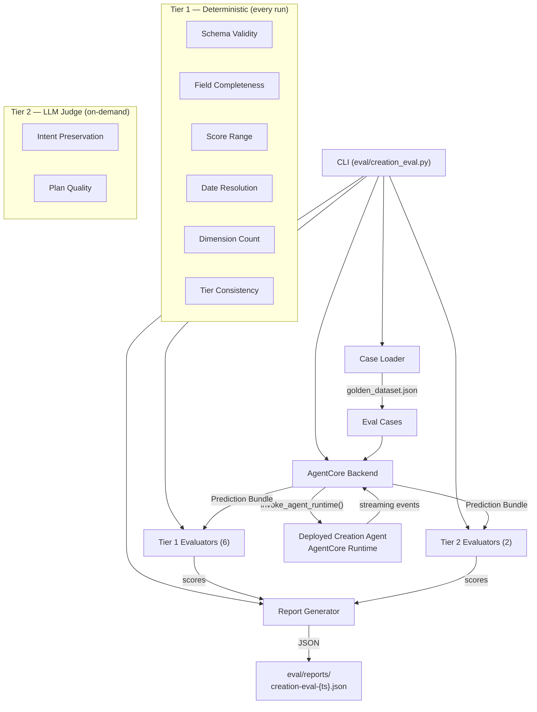

# Design Document: Creation Agent Eval

## Overview

This design covers the v4 creation agent evaluation framework — a CLI-driven eval runner that invokes the deployed creation agent via AgentCore HTTP streaming, applies tiered evaluators (6 deterministic Tier 1 + 2 LLM judge Tier 2), and produces JSON reports for the dashboard.

The system replaces the v3 eval framework (17 evaluators, 12 LLM judges, 60+ min runs) with a focused tiered strategy per Decision 122. It invokes the real deployed agent via `AgentCoreRuntimeClient.invoke_agent_runtime()` — no local agent instantiation, no mocks (Decision 96).

Key design drivers:
- **Tiered evaluators**: 6 fast deterministic checks catch structural regressions instantly; 2 targeted LLM judges measure intent preservation and plan quality on-demand
- **Run tiers**: smoke (~12 cases, Tier 1 only), smoke+judges (~12 cases, Tier 1+2), full (all cases, Tier 1+2) per Decision 125
- **Structured metadata**: Each run carries prompt versions, run tier, description, dataset version per Decision 127
- **No imports from calleditv4/**: The eval runner invokes the deployed agent via HTTP, except for importing Pydantic models from `calleditv4/src/models.py` for schema validation

## Architecture



### Data Flow

1. CLI parses args (`--tier`, `--dataset`, `--description`, `--case`, `--dry-run`, `--output-dir`)
2. Case Loader reads `golden_dataset.json`, filters by run tier or `--case` flag
3. For each case, AgentCore Backend sends `{prediction_text, user_id: "eval-runner", timezone: "UTC"}` to the deployed agent
4. Backend parses the streaming response, extracts the `flow_complete` event's data payload
5. Tier 1 evaluators run on every case (deterministic, instant)
6. Tier 2 evaluators run only when run tier includes judges (`smoke+judges` or `full`)
7. Report Generator aggregates scores, computes pass rates, writes JSON report

### Streaming Response Parsing

The creation agent yields JSON string events via an async generator. The backend must handle this streaming format:

```
{"type": "flow_started", "prediction_id": "pred-xxx", "data": {...}}
{"type": "text", "prediction_id": "pred-xxx", "data": {"turn_number": 1, ...}}
{"type": "turn_complete", "prediction_id": "pred-xxx", "data": {"turn_number": 1, ...}}
... (more text + turn_complete events)
{"type": "flow_complete", "prediction_id": "pred-xxx", "data": {full_bundle}}
```

The backend iterates through all events, looking for the `flow_complete` event. The `data` payload of that event contains the full prediction bundle with all fields needed by evaluators.

## Components and Interfaces

### 1. CLI Entry Point (`eval/creation_eval.py`)

Orchestrates the entire eval run. Uses `argparse` for CLI flags.

```python
def main():
    """CLI entry point for creation agent eval."""
    args = parse_args()  # --dataset, --tier, --description, --output-dir, --dry-run, --case
    
    # Load and filter cases
    dataset = load_dataset(args.dataset)
    cases = filter_cases(dataset, args.tier, args.case)
    
    if args.dry_run:
        print_dry_run(cases)
        return
    
    # Run eval
    backend = AgentCoreBackend()
    evaluators = build_evaluator_list(args.tier)
    results = run_eval(cases, backend, evaluators)
    
    # Build and save report
    metadata = build_run_metadata(args, dataset, results)
    report = build_report(metadata, results, cases)
    save_report(report, args.output_dir)
```

**CLI Flags:**
| Flag | Default | Description |
|------|---------|-------------|
| `--dataset` | `eval/golden_dataset.json` | Path to golden dataset |
| `--tier` | `smoke` | Run tier: `smoke`, `smoke+judges`, `full` |
| `--description` | auto-generated | One-line run description |
| `--output-dir` | `eval/reports/` | Report output directory |
| `--dry-run` | `false` | List cases without executing |
| `--case` | `None` | Execute single case by id |

### 2. AgentCore Backend (`eval/backends/agentcore_backend.py`)

Invokes the deployed creation agent and extracts the prediction bundle from the streaming response.

```python
class AgentCoreBackend:
    RUNTIME_ARN = "arn:aws:bedrock-agentcore:us-west-2:894249332178:runtime/calleditv4_Agent-AJiwpKBxRW"
    
    def __init__(self, region: str = "us-west-2"):
        self.client = AgentCoreRuntimeClient(region=region)
    
    def invoke(self, prediction_text: str) -> dict:
        """Invoke creation agent and return prediction bundle.
        
        Returns:
            dict with keys: parsed_claim, verification_plan, plan_review,
                           prompt_versions, prediction_id
        
        Raises:
            RuntimeError: If flow_complete event is missing or invocation fails
        """
        response = self.client.invoke_agent_runtime(
            runtime_arn=self.RUNTIME_ARN,
            payload={
                "prediction_text": prediction_text,
                "user_id": "eval-runner",
                "timezone": "UTC",
            }
        )
        return self._parse_stream(response)
    
    def _parse_stream(self, response) -> dict:
        """Parse streaming response, extract flow_complete bundle."""
        bundle = None
        for event in response:
            parsed = json.loads(event) if isinstance(event, str) else event
            if parsed.get("type") == "flow_complete":
                bundle = parsed["data"]
                break
        
        if bundle is None:
            raise RuntimeError("No flow_complete event in agent response")
        
        return {
            "parsed_claim": bundle.get("parsed_claim", {}),
            "verification_plan": bundle.get("verification_plan", {}),
            "plan_review": {
                "verifiability_score": bundle.get("verifiability_score"),
                "verifiability_reasoning": bundle.get("verifiability_reasoning"),
                "reviewable_sections": bundle.get("reviewable_sections", []),
                "score_tier": bundle.get("score_tier"),
                "score_label": bundle.get("score_label"),
                "score_guidance": bundle.get("score_guidance"),
                "dimension_assessments": bundle.get("dimension_assessments", []),
            },
            "prompt_versions": bundle.get("prompt_versions", {}),
            "prediction_id": bundle.get("prediction_id"),
        }
```

### 3. Case Loader (`eval/creation_eval.py` — inline)

Loads the golden dataset and maps each base prediction to an eval case.

```python
@dataclass
class EvalCase:
    id: str
    input: str  # prediction_text
    expected_output: dict  # ground_truth
    metadata: dict  # dimension_tags, difficulty, smoke_test, evaluation_rubric

def load_dataset(path: str) -> dict:
    """Load and validate golden dataset JSON."""
    with open(path) as f:
        data = json.load(f)
    if "base_predictions" not in data:
        sys.exit("Error: golden dataset missing 'base_predictions' array")
    return data

def filter_cases(dataset: dict, tier: str, case_id: str = None) -> list[EvalCase]:
    """Filter cases by run tier or specific case id."""
    cases = [_to_eval_case(bp) for bp in dataset["base_predictions"]]
    if case_id:
        matches = [c for c in cases if c.id == case_id]
        if not matches:
            sys.exit(f"Error: case '{case_id}' not found in dataset")
        return matches
    if tier in ("smoke", "smoke+judges"):
        return [c for c in cases if c.metadata.get("smoke_test")]
    return cases  # full tier
```

### 4. Tier 1 Evaluators (`eval/evaluators/`)

All Tier 1 evaluators extend `strands_evals.evaluators.Evaluator` and return `list[EvaluationOutput]`. Each is deterministic, instant, and free.

```python
# Base pattern for all Tier 1 evaluators
from strands_evals.evaluators import Evaluator
from strands_evals.types.evaluation import EvaluationData, EvaluationOutput

class SchemaValidityEvaluator(Evaluator):
    def evaluate(self, evaluation_case: EvaluationData) -> list[EvaluationOutput]:
        # Validate against Pydantic models
        ...
        return [EvaluationOutput(score=score, test_pass=passed, reason=reason)]
```

**Evaluator files:**
| File | Class | What it checks |
|------|-------|---------------|
| `schema_validity.py` | `SchemaValidityEvaluator` | Pydantic model conformance for ParsedClaim, VerificationPlan, PlanReview |
| `field_completeness.py` | `FieldCompletenessEvaluator` | sources, criteria, steps are non-empty lists |
| `score_range.py` | `ScoreRangeEvaluator` | verifiability_score is float in [0.0, 1.0] |
| `date_resolution.py` | `DateResolutionEvaluator` | verification_date is valid ISO 8601 |
| `dimension_count.py` | `DimensionCountEvaluator` | exactly 5 dimension_assessments |
| `tier_consistency.py` | `TierConsistencyEvaluator` | score_tier matches score value thresholds |

### 5. Tier 2 Evaluators (`eval/evaluators/`)

LLM judge evaluators using `strands_evals.evaluators.OutputEvaluator` with rubric strings.

```python
from strands_evals.evaluators import OutputEvaluator

intent_preservation_evaluator = OutputEvaluator(
    rubric=INTENT_PRESERVATION_RUBRIC,
    model="us.anthropic.claude-opus-4-6-v1",
    include_inputs=True,
)

plan_quality_evaluator = OutputEvaluator(
    rubric=PLAN_QUALITY_RUBRIC,
    model="us.anthropic.claude-opus-4-6-v1",
    include_inputs=True,
)
```

**Evaluator files:**
| File | What it assesses |
|------|-----------------|
| `intent_preservation.py` | Does parsed claim + plan faithfully represent the user's prediction? |
| `plan_quality.py` | Are criteria measurable, sources real, steps executable? |

### 6. Report Generator (`eval/creation_eval.py` — inline)

Builds the JSON report with run metadata, per-case scores, aggregate metrics, and smoke test summary.

```python
def build_report(metadata: dict, results: list, cases: list) -> dict:
    return {
        "run_metadata": metadata,
        "aggregate_scores": compute_aggregates(results),
        "case_results": results,
        "smoke_test_summary": compute_smoke_summary(results, cases),
    }
```

## Data Models

### EvalCase

```python
@dataclass
class EvalCase:
    id: str                    # e.g., "base-001"
    input: str                 # prediction_text
    expected_output: dict      # ground_truth object from golden dataset
    metadata: dict             # {dimension_tags, difficulty, smoke_test, id, evaluation_rubric}
```

### AgentCore Backend Response (internal)

```python
# Returned by AgentCoreBackend.invoke()
{
    "parsed_claim": {
        "statement": str,
        "verification_date": str,  # ISO 8601
        "date_reasoning": str,
    },
    "verification_plan": {
        "sources": list[str],
        "criteria": list[str],
        "steps": list[str],
    },
    "plan_review": {
        "verifiability_score": float,  # 0.0-1.0
        "verifiability_reasoning": str,
        "reviewable_sections": list[dict],
        "score_tier": str,  # "high" | "moderate" | "low"
        "score_label": str,
        "score_guidance": str,
        "dimension_assessments": list[dict],  # exactly 5
    },
    "prompt_versions": dict[str, str],
    "prediction_id": str,
}
```

### Eval Report Schema

```python
{
    "run_metadata": {
        "description": str,
        "prompt_versions": dict[str, str],
        "run_tier": str,  # "smoke" | "smoke+judges" | "full"
        "dataset_version": str,
        "agent": "creation",
        "timestamp": str,  # ISO 8601
        "duration_seconds": float,
        "case_count": int,
    },
    "aggregate_scores": {
        "schema_validity": float,      # avg score
        "field_completeness": float,
        "score_range": float,
        "date_resolution": float,
        "dimension_count": float,
        "tier_consistency": float,
        "intent_preservation": float | None,  # None if judges not run
        "plan_quality": float | None,
        "overall_pass_rate": float,    # fraction where all T1 = 1.0
    },
    "case_results": [
        {
            "id": str,
            "input": str,
            "scores": {
                "schema_validity": {"score": float, "pass": bool, "reason": str},
                "field_completeness": {"score": float, "pass": bool, "reason": str},
                "score_range": {"score": float, "pass": bool, "reason": str},
                "date_resolution": {"score": float, "pass": bool, "reason": str},
                "dimension_count": {"score": float, "pass": bool, "reason": str},
                "tier_consistency": {"score": float, "pass": bool, "reason": str},
                "intent_preservation": {"score": float, "reason": str} | None,
                "plan_quality": {"score": float, "reason": str} | None,
            },
        }
    ],
    "smoke_test_summary": {
        "case_count": int,
        "schema_validity": float,
        "field_completeness": float,
        "score_range": float,
        "date_resolution": float,
        "dimension_count": float,
        "tier_consistency": float,
        "overall_pass_rate": float,
    },
}
```

### Pydantic Models (imported from `calleditv4/src/models.py`)

Used by the Schema Validity evaluator for validation:
- `ParsedClaim`: statement, verification_date, date_reasoning
- `VerificationPlan`: sources (list), criteria (list), steps (list)
- `PlanReview`: verifiability_score (0.0-1.0), verifiability_reasoning, reviewable_sections, score_tier, score_label, score_guidance, dimension_assessments (exactly 5)
- `DimensionAssessment`: dimension, assessment (strong/moderate/weak), explanation
- `ReviewableSection`: section, improvable, questions, reasoning


## Correctness Properties

*A property is a characteristic or behavior that should hold true across all valid executions of a system — essentially, a formal statement about what the system should do. Properties serve as the bridge between human-readable specifications and machine-verifiable correctness guarantees.*

### Property 1: Backend payload construction

*For any* prediction text string, the AgentCore backend SHALL construct a payload with exactly `{"prediction_text": <text>, "user_id": "eval-runner", "timezone": "UTC"}` — the `user_id` and `timezone` fields are always fixed regardless of input.

**Validates: Requirements 1.1**

### Property 2: Stream parsing round trip

*For any* valid prediction bundle dict, wrapping it in a `flow_complete` event and feeding the resulting stream to the backend's parser SHALL return a dict where `parsed_claim`, `verification_plan`, and `plan_review` contain the corresponding data from the original bundle.

**Validates: Requirements 1.2, 1.3**

### Property 3: Case loading preserves all fields

*For any* base prediction in the golden dataset, the resulting EvalCase SHALL have `input` equal to the prediction's `prediction_text`, `expected_output` equal to the prediction's `ground_truth`, and `metadata` containing the prediction's `dimension_tags`, `difficulty`, `smoke_test`, `id`, and `evaluation_rubric`.

**Validates: Requirements 2.1, 2.2, 2.3, 2.4**

### Property 4: Schema validity is biconditional on Pydantic validation

*For any* prediction bundle dict, the schema validity evaluator SHALL return score 1.0 if and only if the `parsed_claim` validates as `ParsedClaim`, the `verification_plan` validates as `VerificationPlan`, and the `plan_review` validates as `PlanReview`. When validation fails, the output SHALL include the Pydantic error details.

**Validates: Requirements 3.1, 3.2, 3.3, 3.4, 3.5**

### Property 5: Field completeness is biconditional on non-empty lists

*For any* prediction bundle dict, the field completeness evaluator SHALL return score 1.0 if and only if `sources`, `criteria`, and `steps` in the verification plan are all non-empty lists. When any field is empty, the output SHALL identify which fields are empty.

**Validates: Requirements 4.1, 4.2, 4.3, 4.4, 4.5**

### Property 6: Score range validates float in [0.0, 1.0]

*For any* prediction bundle dict, the score range evaluator SHALL return score 1.0 if and only if `verifiability_score` is a float value between 0.0 and 1.0 inclusive.

**Validates: Requirements 5.1, 5.2, 5.3**

### Property 7: Date resolution validates ISO 8601

*For any* prediction bundle dict, the date resolution evaluator SHALL return score 1.0 if and only if the `verification_date` field in the parsed claim is a valid ISO 8601 datetime string.

**Validates: Requirements 6.1, 6.2, 6.3**

### Property 8: Dimension count validates exactly 5

*For any* prediction bundle dict, the dimension count evaluator SHALL return score 1.0 if and only if the `dimension_assessments` list contains exactly 5 entries.

**Validates: Requirements 7.1, 7.2, 7.3**

### Property 9: Tier consistency matches score_to_tier deterministic mapping

*For any* prediction bundle with a `verifiability_score` and `score_tier`, the tier consistency evaluator SHALL return score 1.0 if and only if the tier matches the deterministic mapping: score ≥ 0.7 → "high", score ≥ 0.4 → "moderate", score < 0.4 → "low". This is equivalent to `score_to_tier()` from `calleditv4/src/models.py`.

**Validates: Requirements 8.1, 8.2, 8.3, 8.4, 8.5**

### Property 10: Run tier filtering selects correct cases and evaluators

*For any* golden dataset and run tier, the eval runner SHALL: for `smoke` — select only cases with `smoke_test=true` and run only Tier 1 evaluators; for `smoke+judges` — select only cases with `smoke_test=true` and run Tier 1 + Tier 2; for `full` — select all cases and run Tier 1 + Tier 2.

**Validates: Requirements 11.1, 11.2, 11.3**

### Property 11: Dry run lists cases without side effects

*For any* dataset and tier combination, invoking the eval runner with `--dry-run` SHALL produce a list of case ids matching the tier's filtering rules, and SHALL NOT invoke the AgentCore backend or run any evaluators.

**Validates: Requirements 12.5**

### Property 12: Single case override ignores tier filtering

*For any* dataset and any valid case id, invoking the eval runner with `--case <id>` SHALL execute exactly that one case regardless of the run tier's case filtering rules.

**Validates: Requirements 12.6**

### Property 13: Run metadata contains all required fields

*For any* completed eval run, the run metadata SHALL contain: `description` (string), `prompt_versions` (dict), `run_tier` (string matching the CLI flag), `dataset_version` (string from dataset), `agent` (always "creation"), `timestamp` (valid ISO 8601), `duration_seconds` (non-negative float), and `case_count` (integer matching the number of executed cases).

**Validates: Requirements 13.1, 13.2, 13.3, 13.4, 13.5, 13.6, 13.7, 13.8, 14.2**

### Property 14: Aggregate scores are correct averages

*For any* set of per-case evaluator results, the `aggregate_scores` in the report SHALL contain per-evaluator averages that equal the arithmetic mean of the individual case scores, and an `overall_pass_rate` that equals the fraction of cases where all Tier 1 evaluators returned 1.0.

**Validates: Requirements 14.3**

### Property 15: Smoke test summary filters correctly

*For any* eval report from a `full` run, the `smoke_test_summary` SHALL contain aggregate scores computed only from cases where `smoke_test=true`, even though the full run includes all cases.

**Validates: Requirements 14.5**

### Property 16: Report filename follows convention

*For any* eval run timestamp, the report file SHALL be named `creation-eval-{YYYYMMDD-HHMMSS}.json` where the timestamp components match the run's start time.

**Validates: Requirements 14.1**

### Property 17: Report output is valid JSON

*For any* eval report, the serialized output SHALL be valid JSON parseable by `json.loads()` with consistent 2-space indentation.

**Validates: Requirements 14.6**

## Error Handling

### AgentCore Backend Errors

| Error Condition | Behavior |
|----------------|----------|
| No `flow_complete` event in stream | Raise `RuntimeError` with message identifying missing event and case id |
| Network/service error from `invoke_agent_runtime()` | Raise `RuntimeError` with HTTP status code and case id |
| Malformed JSON in stream events | Raise `RuntimeError` with parse error details |

The eval runner catches backend errors per-case and records them in the case result with `error` field set, rather than aborting the entire run. This allows partial results when some cases fail.

### Dataset Loading Errors

| Error Condition | Behavior |
|----------------|----------|
| File not found | `sys.exit(1)` with descriptive message |
| Invalid JSON | `sys.exit(1)` with parse error details |
| Missing `base_predictions` array | `sys.exit(1)` with descriptive message |
| `--case` id not found | `sys.exit(1)` with descriptive message |

### Evaluator Errors

Tier 1 evaluators should never raise — they handle malformed input gracefully by returning score 0.0 with a reason. Tier 2 evaluators (LLM judges) may fail due to model invocation errors; these are caught and recorded as score 0.0 with the error in the reason field.

### Report Output Errors

If the output directory doesn't exist, the runner creates it with `os.makedirs(output_dir, exist_ok=True)` before writing.

## Testing Strategy

### Property-Based Testing (Hypothesis)

The project already uses Hypothesis extensively. Each correctness property above maps to one property-based test with minimum 100 iterations.

**Library**: `hypothesis` (already in project dependencies)
**Tag format**: `# Feature: creation-agent-eval, Property N: <property text>`

Property tests focus on the deterministic components that can be tested without the real agent:
- Stream parsing logic (Property 2) — generate random valid bundles, wrap in event streams
- Case loading (Property 3) — generate random dataset structures
- All 6 Tier 1 evaluators (Properties 4–9) — generate random bundle dicts with valid/invalid fields
- Tier filtering logic (Property 10) — generate random datasets with smoke_test flags
- Aggregate computation (Properties 14–15) — generate random score arrays
- Report serialization (Property 17) — generate random report structures

**Generators needed**:
- `valid_bundle()` — generates a dict matching the prediction bundle schema
- `valid_parsed_claim()` — generates valid ParsedClaim-shaped dicts
- `valid_verification_plan()` — generates valid VerificationPlan-shaped dicts
- `valid_plan_review()` — generates valid PlanReview-shaped dicts
- `invalid_bundle()` — generates bundles with at least one invalid field
- `stream_events(bundle)` — wraps a bundle in a realistic event stream

### Unit Tests

Unit tests cover specific examples and edge cases:
- Backend: missing `flow_complete` event, empty stream, malformed JSON events
- Case loader: invalid JSON file, missing `base_predictions`, unknown case id
- CLI: default flag values, `--dry-run` output format, auto-generated description
- Evaluators: specific known-good and known-bad bundles from the golden dataset
- Report: directory creation, filename format with specific timestamps
- Rubric content: Intent preservation and plan quality rubrics contain required focus areas (Req 9.3, 10.4)

### Test File Layout

```
eval/tests/
├── test_agentcore_backend.py      # Properties 1-2, backend error handling
├── test_case_loader.py            # Property 3, dataset error handling
├── test_schema_validity.py        # Property 4
├── test_field_completeness.py     # Property 5
├── test_score_range.py            # Property 6
├── test_date_resolution.py        # Property 7
├── test_dimension_count.py        # Property 8
├── test_tier_consistency.py       # Property 9
├── test_run_tier_filtering.py     # Properties 10-12
├── test_report.py                 # Properties 13-17
└── conftest.py                    # Shared Hypothesis generators
```

### Integration Tests (manual)

Integration tests require the deployed agent and are run manually:
- Smoke run against real agent: `/home/wsluser/projects/calledit/venv/bin/python eval/creation_eval.py --tier smoke`
- Full run with judges: `/home/wsluser/projects/calledit/venv/bin/python eval/creation_eval.py --tier full --description "integration test"`
- Single case: `/home/wsluser/projects/calledit/venv/bin/python eval/creation_eval.py --case base-001`

### Test Configuration

- Property tests: minimum 100 iterations via `@settings(max_examples=100)`
- Each property test tagged with: `# Feature: creation-agent-eval, Property N: <title>`
- All tests run with: `/home/wsluser/projects/calledit/venv/bin/python -m pytest eval/tests/ -v`
