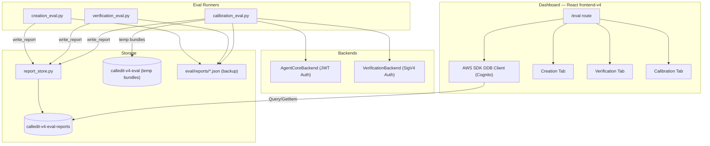
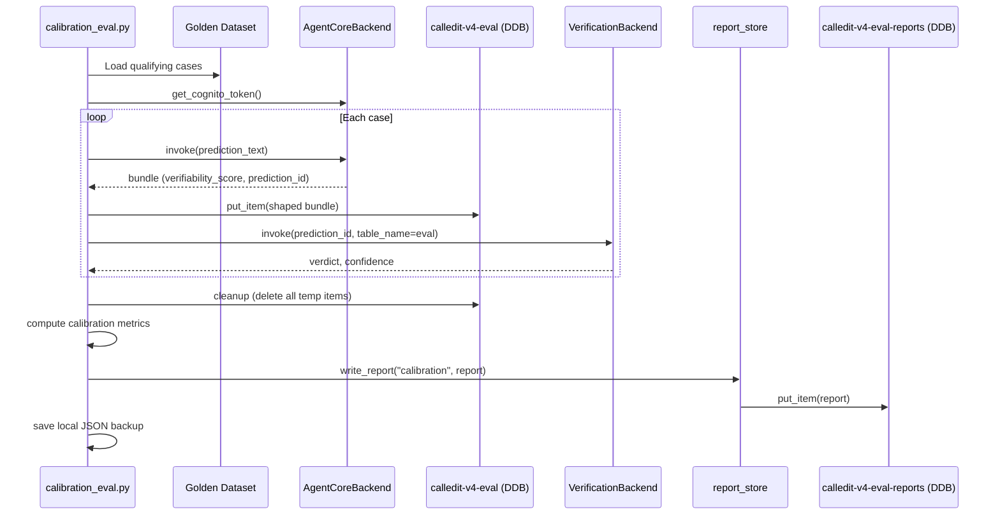

# Design Document: Cross-Agent Calibration Dashboard

## Overview

This design covers three components that complete the CalledIt v4 eval framework:

1. **DDB Report Store** (`eval/report_store.py`) — A shared module for reading/writing eval reports to a dedicated DynamoDB table (`calledit-v4-eval-reports`). All three eval runners write here; the dashboard reads from here. Existing creation and verification runners get fire-and-forget DDB writes. A `backfill_from_files()` function imports historical JSON reports.

2. **Calibration Runner** (`eval/calibration_eval.py`) — Chains the creation agent → verification agent per case. Reuses `AgentCoreBackend` (JWT) and `VerificationBackend` (SigV4). Writes temporary bundles to `calledit-v4-eval` (same pattern as `verification_eval.py`), cleans up after. Produces a calibration report with metrics like `calibration_accuracy`, `mean_absolute_error`, `high_score_confirmation_rate`, `low_score_failure_rate`, and `verdict_distribution`.

3. **Dashboard** (React, integrated into `frontend-v4/`) — A new `/eval` route in the existing React app with three tabs (Creation Agent, Verification Agent, Cross-Agent Calibration). Reads from the Reports_Table via AWS SDK DynamoDB client authenticated through Cognito. Uses Recharts for interactive charts (trend lines, scatter plots with hover/click). Provides run selection, aggregate score summaries with color coding, per-case detail views, and multi-run comparison with overlay trend lines.

### Key Design Decisions

- **Separate DDB table for reports**: The `calledit-v4-eval-reports` table is distinct from `calledit-v4-eval` (temporary bundles). Reports are the source of truth; local JSON files are backup.
- **PAY_PER_REQUEST billing**: Low-volume table (dozens of reports), no need for provisioned capacity.
- **Auto-create table**: `report_store.py` creates the table if it doesn't exist, matching the pattern in `verification_eval.py`'s `_ensure_table_exists()`.
- **Fire-and-forget DDB writes**: Existing runners log warnings on DDB failure but never abort the eval run.
- **React dashboard in existing frontend-v4 app**: The eval dashboard is a `/eval` route in the existing React 18 + TypeScript + Vite app. This reuses the existing Cognito auth context, build tooling, and CloudFront deployment. Recharts provides interactive charts (hover tooltips, click-to-drill, multi-series overlays) that Streamlit can't match. The dashboard reads DDB directly from the browser using `@aws-sdk/client-dynamodb` authenticated via the existing Cognito token.
- **DDB item size limit (400KB)**: Large runs with many cases could approach this. Design uses projection expressions to fetch `run_metadata` + `aggregate_scores` without `case_results` for list views. Full reports (with `case_results`) are fetched only on demand. If a report exceeds 400KB, the `case_results` field will be stored as a separate item with SK=`{timestamp}#CASES` and reassembled on read.

## Architecture



### Calibration Runner Flow



## Components and Interfaces

### 1. Report Store Module (`eval/report_store.py`)

```python
"""Shared DDB report store for all eval runners and dashboard."""

REPORTS_TABLE_NAME = "calledit-v4-eval-reports"

def write_report(agent_type: str, report: dict) -> None:
    """Write report to Reports_Table.
    
    PK = AGENT#{agent_type}, SK = report['run_metadata']['timestamp']
    Converts float→Decimal for DDB. Handles item size >400KB by splitting
    case_results into a separate item with SK={timestamp}#CASES.
    """

def list_reports(agent_type: str) -> list[dict]:
    """Query Reports_Table for all reports matching agent_type.
    
    Returns run_metadata + aggregate_scores only (no case_results).
    Uses ProjectionExpression to minimize read cost.
    Sorted by timestamp descending.
    """

def get_report(agent_type: str, timestamp: str) -> dict:
    """Get full report including case_results.
    
    Fetches main item + optional #CASES item if case_results were split.
    Converts Decimal→float on read.
    """

def backfill_from_files(directory: str) -> dict:
    """Import historical JSON reports from directory into Reports_Table.
    
    Detects agent_type from filename pattern or report['run_metadata']['agent'].
    Skips items that already exist (idempotent via conditional put).
    Returns {"imported": N, "skipped": M, "errors": [...]}
    """

def _ensure_table_exists() -> None:
    """Create Reports_Table if not exists. PAY_PER_REQUEST, PK(S) + SK(S)."""

def _float_to_decimal(obj: Any) -> Any:
    """Recursively convert float values to Decimal for DDB write."""

def _decimal_to_float(obj: Any) -> Any:
    """Recursively convert Decimal values to float for read."""
```

### 2. Calibration Runner (`eval/calibration_eval.py`)

```python
"""Cross-Agent Calibration Eval Runner.

Chains creation agent → verification agent per case.
Measures whether verifiability_score predicts verification success.

Usage:
    python eval/calibration_eval.py --tier smoke --description "baseline"
    python eval/calibration_eval.py --tier full
    python eval/calibration_eval.py --dry-run
    python eval/calibration_eval.py --case base-002
"""

# Reuses from existing modules:
# - AgentCoreBackend, get_cognito_token (eval/backends/agentcore_backend.py)
# - VerificationBackend (eval/backends/verification_backend.py)
# - report_store.write_report (eval/report_store.py)
# - Eval table setup/cleanup pattern from verification_eval.py

SCORE_TIER_THRESHOLDS = {"high": 0.7, "moderate": 0.4}  # <0.4 = low

def classify_score_tier(score: float) -> str:
    """Map verifiability_score to tier: high (≥0.7), moderate (≥0.4), low (<0.4)."""

def is_calibration_correct(score_tier: str, verdict: str) -> bool:
    """Check if score tier prediction aligned with verdict outcome.
    
    high → confirmed = correct
    low → refuted/inconclusive = correct
    moderate → always correct (indeterminate zone)
    """

def compute_calibration_metrics(case_results: list[dict]) -> dict:
    """Compute aggregate calibration metrics from case results.
    
    Returns: calibration_accuracy, mean_absolute_error,
             high_score_confirmation_rate, low_score_failure_rate,
             verdict_distribution
    """

def run_calibration(cases, creation_backend, verification_backend) -> list[dict]:
    """Run creation→verification pipeline for each case. Returns case_results."""

def main():
    """CLI entry point. Follows same pattern as verification_eval.py."""
```

### 3. Dashboard (React — `frontend-v4/src/pages/EvalDashboard/`)

The dashboard is a new `/eval` route in the existing `frontend-v4` React app. It reads from DDB directly using the AWS SDK authenticated via the existing Cognito auth context.

**New dependencies** (add to `frontend-v4/package.json`):
- `react-router-dom` — routing for `/eval` route
- `recharts` — interactive charts (line, scatter, bar)
- `@aws-sdk/client-dynamodb` — DDB access
- `@aws-sdk/lib-dynamodb` — DDB document client (handles marshalling)

**File structure:**
```
frontend-v4/src/
  pages/
    EvalDashboard/
      index.tsx              — Main page with three tabs
      components/
        RunSelector.tsx      — Dropdown: 'timestamp | agent | tier | description'
        AggregateScores.tsx  — Color-coded score bar (green/yellow/red)
        CaseTable.tsx        — Per-case results table with expandable rows
        CaseDetail.tsx       — Expanded detail panel (scores + reasons)
        WarningBanner.tsx    — ground_truth_limitation / bias_warning display
        CalibrationScatter.tsx — Recharts scatter: score vs outcome
        TrendChart.tsx       — Recharts line chart for multi-run comparison
        PromptVersionDiff.tsx — Highlights changed prompt versions
      hooks/
        useReportStore.ts    — DDB query hooks (listReports, getReport)
      types.ts               — TypeScript interfaces for report schemas
      utils.ts               — Score color, tier classification, text truncation
  services/
    dynamodb.ts              — DDB client singleton (reuses Cognito credentials)
```

**Key interfaces** (`types.ts`):
```typescript
interface RunMetadata {
  description: string;
  agent: 'creation' | 'verification' | 'calibration';
  run_tier: string;
  timestamp: string;
  duration_seconds: number;
  case_count: number;
  dataset_version: string;
  prompt_versions?: Record<string, string>;
  model_id?: string;
  git_commit?: string;
  features?: Record<string, unknown>;
  ground_truth_limitation?: string;
  bias_warning?: string;
}

interface ReportSummary {
  run_metadata: RunMetadata;
  aggregate_scores: Record<string, number | Record<string, number>>;
}

interface FullReport extends ReportSummary {
  case_results: CaseResult[];
}

interface CaseResult {
  id: string;
  scores?: Record<string, { score: number; pass: boolean; reason: string }>;
  // Creation-specific
  input?: string;
  prediction_id?: string;
  // Verification-specific
  prediction_text?: string;
  expected_verdict?: string;
  // Calibration-specific
  verifiability_score?: number;
  score_tier?: string;
  actual_verdict?: string;
  actual_confidence?: number;
  calibration_correct?: boolean;
  creation_duration_seconds?: number;
  verification_duration_seconds?: number;
  error?: string | null;
}
```

**DDB access** (`hooks/useReportStore.ts`):
```typescript
// Uses @aws-sdk/lib-dynamodb DynamoDBDocumentClient
// Authenticated via Cognito token from existing AuthContext

async function listReports(agentType: string): Promise<ReportSummary[]> {
  // Query PK=AGENT#{agentType}, ProjectionExpression excludes case_results
  // Sort by SK descending (newest first)
}

async function getReport(agentType: string, timestamp: string): Promise<FullReport | null> {
  // GetItem PK + SK, plus optional #CASES item if case_results were split
  // Reassemble if split
}
```

**Routing** — Update `App.tsx` to add react-router-dom:
```typescript
import { BrowserRouter, Routes, Route } from 'react-router-dom';
import EvalDashboard from './pages/EvalDashboard';

// Add /eval route alongside existing views
<Routes>
  <Route path="/" element={<AppContent />} />
  <Route path="/eval" element={<EvalDashboard />} />
</Routes>
```

### 4. Integration Points (Existing Runner Updates)

**`eval/creation_eval.py`** — Add after `save_report()`:
```python
# Fire-and-forget DDB write
try:
    from eval.report_store import write_report
    write_report("creation", report)
except Exception as e:
    logger.warning(f"DDB write failed (non-fatal): {e}")
```

**`eval/verification_eval.py`** — Same pattern after `save_report()`.

### Dashboard Extensibility Principle

The dashboard renders data-driven, not hardcoded. This means:

1. **Tabs are driven by data**: The tab list comes from the distinct `agent` values found in the Reports_Table (via a scan or known set). Adding a new eval experiment (e.g., `AGENT#planner`) automatically creates a new tab — no code change needed.

2. **Aggregate scores render dynamically**: The `AggregateScores` component iterates over whatever keys exist in `aggregate_scores` and renders a color-coded bar for each. New evaluators appear automatically when a report includes them. Old reports without the new key simply don't show that bar.

3. **Case table columns are derived from data**: The `CaseTable` component reads the `scores` keys from the first case result and generates columns dynamically. Adding a new evaluator to a runner means the dashboard shows it on the next run — no frontend change.

4. **Metadata display is key-driven**: The metadata panel renders all keys from `run_metadata` that have values, using a simple key→label mapping with a fallback to the raw key name for unknown fields. New metadata fields appear automatically.

5. **Multi-run comparison works across any metric**: The trend chart accepts a list of metric keys to plot. The user selects which metrics to overlay from the available keys in the selected runs. New metrics are selectable as soon as they appear in a report.

This keeps the dashboard useful as the eval framework evolves — new evaluators, new metadata dimensions, new agent types — without requiring dashboard code changes for each addition.

## Data Models

### Reports_Table DDB Schema

| Field | Type | Description |
|-------|------|-------------|
| PK | String | `AGENT#creation`, `AGENT#verification`, or `AGENT#calibration` |
| SK | String | ISO 8601 timestamp (e.g., `2026-03-25T20:54:19.531789+00:00`) |
| run_metadata | Map | Description, agent, tier, timestamp, duration, case_count, etc. |
| aggregate_scores | Map | Per-evaluator averages (creation/verification) or calibration metrics |
| case_results | List | Per-case detail (may be split to separate item if >400KB) |

### Creation Report Schema (existing, stored as-is)

```json
{
  "run_metadata": {
    "description": "string",
    "prompt_versions": {"parser": "1", "planner": "1", "reviewer": "1"},
    "model_id": "string",
    "agent_runtime_arn": "string",
    "git_commit": "string",
    "run_tier": "smoke|smoke+judges|full",
    "dataset_version": "string",
    "agent": "creation",
    "timestamp": "ISO 8601",
    "duration_seconds": 0.0,
    "case_count": 0,
    "features": {"long_term_memory": false, "tools": []}
  },
  "aggregate_scores": {
    "schema_validity": 1.0,
    "field_completeness": 1.0,
    "score_range": 1.0,
    "date_resolution": 1.0,
    "dimension_count": 1.0,
    "tier_consistency": 1.0,
    "intent_preservation": 0.0,
    "plan_quality": 0.0,
    "overall_pass_rate": 1.0
  },
  "case_results": [
    {
      "id": "base-002",
      "input": "prediction text",
      "scores": {
        "evaluator_name": {"score": 1.0, "pass": true, "reason": "..."}
      },
      "prediction_id": "pred-uuid",
      "prompt_versions": {}
    }
  ]
}
```

### Verification Report Schema (existing, stored as-is)

```json
{
  "run_metadata": {
    "description": "string",
    "agent": "verification",
    "source": "golden|ddb",
    "run_tier": "smoke|smoke+judges|full",
    "dataset_version": "string",
    "timestamp": "ISO 8601",
    "duration_seconds": 0.0,
    "case_count": 0,
    "ground_truth_limitation": "string"
  },
  "aggregate_scores": {
    "schema_validity": 1.0,
    "verdict_accuracy": 0.5,
    "evidence_quality": 0.55,
    "overall_pass_rate": 1.0
  },
  "case_results": [
    {
      "id": "base-002",
      "prediction_text": "text",
      "expected_verdict": "confirmed",
      "scores": {
        "evaluator_name": {"score": 1.0, "pass": true, "reason": "..."}
      }
    }
  ]
}
```

### Calibration Report Schema (new)

```json
{
  "run_metadata": {
    "description": "string",
    "prompt_versions": {"parser": "1", "planner": "1", "reviewer": "1"},
    "model_id": "string",
    "agent_runtime_arn": "string",
    "git_commit": "string",
    "run_tier": "smoke|full",
    "dataset_version": "string",
    "agent": "calibration",
    "timestamp": "ISO 8601",
    "duration_seconds": 0.0,
    "case_count": 0,
    "features": {},
    "ground_truth_limitation": "string",
    "bias_warning": "string"
  },
  "aggregate_scores": {
    "calibration_accuracy": 0.0,
    "mean_absolute_error": 0.0,
    "high_score_confirmation_rate": 0.0,
    "low_score_failure_rate": 0.0,
    "verdict_distribution": {
      "confirmed": 0,
      "refuted": 0,
      "inconclusive": 0,
      "creation_error": 0,
      "verification_error": 0
    }
  },
  "case_results": [
    {
      "id": "base-002",
      "prediction_text": "text",
      "verifiability_score": 0.85,
      "score_tier": "high",
      "expected_verdict": "confirmed",
      "actual_verdict": "confirmed",
      "actual_confidence": 0.9,
      "calibration_correct": true,
      "creation_duration_seconds": 45.2,
      "verification_duration_seconds": 30.1,
      "error": null
    }
  ],
  "bias_warning": "All 7 qualifying verification cases have 'confirmed' expected outcomes. Calibration accuracy for 'refuted' and 'inconclusive' predictions cannot be measured with the current dataset."
}
```

### Score Tier Classification

| Verifiability Score | Tier | Expected Verdict Alignment |
|---|---|---|
| ≥ 0.7 | high | `confirmed` |
| ≥ 0.4, < 0.7 | moderate | any (indeterminate) |
| < 0.4 | low | `refuted` or `inconclusive` |

### Verification Outcome Numeric Mapping (for scatter plot)

| Verdict | Numeric Value |
|---|---|
| confirmed | 1.0 |
| inconclusive | 0.5 |
| refuted | 0.0 |


## Correctness Properties

*A property is a characteristic or behavior that should hold true across all valid executions of a system — essentially, a formal statement about what the system should do. Properties serve as the bridge between human-readable specifications and machine-verifiable correctness guarantees.*

### Property 1: Report write/read round trip

*For any* valid eval report (creation, verification, or calibration) and any agent_type string, writing the report via `write_report(agent_type, report)` and then reading it back via `get_report(agent_type, timestamp)` should produce a report equivalent to the original (with float values preserved within floating-point precision).

**Validates: Requirements 11.1, 11.3, 11.5**

### Property 2: Float↔Decimal round trip preserves values

*For any* Python dict containing arbitrarily nested float values (including within lists and nested dicts), applying `_float_to_decimal()` then `_decimal_to_float()` should produce values equal to the originals within a tolerance of 1e-10.

**Validates: Requirements 11.5**

### Property 3: list_reports excludes case_results

*For any* set of reports written to the Reports_Table for a given agent_type, calling `list_reports(agent_type)` should return items that each contain `run_metadata` and `aggregate_scores` but never contain `case_results`.

**Validates: Requirements 11.2**

### Property 4: Backfill idempotency

*For any* directory of valid eval report JSON files, calling `backfill_from_files(directory)` twice should produce the same Reports_Table state as calling it once — the second call should skip all previously imported reports and import zero new items.

**Validates: Requirements 12.4**

### Property 5: Calibration report schema completeness

*For any* list of calibration case results (with varying verifiability_scores, verdicts, and error states), the generated calibration report should contain all required fields: `run_metadata` with all 12 specified subfields, `aggregate_scores` with all 5 specified metrics, and each `case_results` entry with all 11 specified fields.

**Validates: Requirements 2.2, 2.3, 2.4**

### Property 6: Score tier classification consistency

*For any* float verifiability_score in [0.0, 1.0], `classify_score_tier(score)` should return `"high"` if score ≥ 0.7, `"moderate"` if 0.4 ≤ score < 0.7, and `"low"` if score < 0.4. The tiers should be exhaustive and mutually exclusive.

**Validates: Requirements 2.3, 2.4**

### Property 7: Calibration accuracy metric correctness

*For any* list of calibration case results with known score_tiers and verdicts, `compute_calibration_metrics()` should produce a `calibration_accuracy` equal to the proportion of cases where `is_calibration_correct(score_tier, verdict)` returns True, and `mean_absolute_error` equal to the average of |verifiability_score - binary_outcome| across all non-error cases.

**Validates: Requirements 2.3**

### Property 8: Tab-to-agent-type mapping

*For any* tab name in {"Creation Agent", "Verification Agent", "Cross-Agent Calibration"}, the dashboard should query the Reports_Table with the correct PK: `AGENT#creation`, `AGENT#verification`, or `AGENT#calibration` respectively. The mapping should be bijective.

**Validates: Requirements 4.3, 4.4, 4.5**

### Property 9: Run selector format contains all components

*For any* report with `run_metadata` containing `timestamp`, `agent`, `run_tier`, and `description`, the formatted run selector string should contain all four values as substrings.

**Validates: Requirements 5.1**

### Property 10: Run selector sorted by timestamp descending

*For any* list of reports with distinct timestamps, the run selector should present them in strictly descending timestamp order (newest first).

**Validates: Requirements 5.4**

### Property 11: Score color coding

*For any* numeric score in [0.0, 1.0], the color coding function should return green if score ≥ 0.8, yellow if 0.5 ≤ score < 0.8, and red if score < 0.5. The mapping should be exhaustive for all valid scores.

**Validates: Requirements 6.1**

### Property 12: Text truncation preserves prefix

*For any* string, truncating to 60 characters should produce a result with length ≤ 63 (60 + "..." suffix), and the first min(60, len(string)) characters of the result should equal the first min(60, len(string)) characters of the original. Strings ≤ 60 characters should be returned unchanged.

**Validates: Requirements 6.2**

### Property 13: Verdict-to-numeric mapping

*For any* verdict string in {"confirmed", "inconclusive", "refuted"}, the numeric mapping should return 1.0, 0.5, or 0.0 respectively. The mapping should be total over the three valid verdicts.

**Validates: Requirements 8.2**

### Property 14: Tier case filtering

*For any* golden dataset and tier value in {"smoke", "full"}, the `smoke` tier should return only cases where `smoke_test=True`, and the `full` tier should return all qualifying cases (those with `expected_verification_outcome` and `verification_mode: "immediate"`). The smoke subset should always be a subset of the full set.

**Validates: Requirements 3.1**

### Property 15: Run tier filtering for comparison

*For any* list of reports and a selected `run_tier` filter value, the filtered list should contain only reports whose `run_metadata.run_tier` matches the filter value.

**Validates: Requirements 9.3**

### Property 16: Prompt version diff correctness

*For any* two prompt_versions dicts, the diff function should return exactly the set of keys where the values differ between the two dicts, including keys present in one but not the other.

**Validates: Requirements 9.4**

### Property 17: Warning banner display for limitation fields

*For any* report metadata dict, if `ground_truth_limitation` is a non-empty string or `bias_warning` is a non-empty string, the warning banner rendering function should produce output containing that string. If both fields are absent or empty, no warning should be rendered.

**Validates: Requirements 5.3**

## Error Handling

### Report Store (`eval/report_store.py`)

| Error Scenario | Handling |
|---|---|
| Table doesn't exist | Auto-create with PAY_PER_REQUEST. Wait for ACTIVE status. |
| Table creation fails (permissions) | Raise `RuntimeError` with clear message about IAM permissions. |
| Write fails (item too large >400KB) | Split `case_results` into separate item with SK=`{timestamp}#CASES`. Retry write without case_results in main item. |
| Write fails (other DDB error) | Raise exception. Callers (eval runners) catch and log warning. |
| Read fails (item not found) | Return `None` from `get_report()`. |
| Float→Decimal conversion for NaN/Inf | Replace with `None` before writing. Log warning. |
| Backfill file parse error | Log warning, skip file, continue with remaining files. Include in error list. |
| Backfill conditional put fails (item exists) | Skip silently (idempotent behavior). |

### Calibration Runner (`eval/calibration_eval.py`)

| Error Scenario | Handling |
|---|---|
| Missing Cognito credentials | `sys.exit()` with message: "Set COGNITO_USERNAME and COGNITO_PASSWORD environment variables." |
| Missing AWS credentials | `sys.exit()` with message about AWS credential configuration. |
| Creation backend fails for a case | Record `creation_error` in case result, continue to next case. |
| Verification backend fails for a case | Record `verification_error` in case result, continue to next case. |
| All cases fail | Still produce report (with all error cases). Still write to DDB and local file. |
| Eval table setup fails | `sys.exit()` — cannot proceed without temp storage. |
| Eval table cleanup fails for an item | Log warning, continue cleanup of remaining items. |
| DDB report write fails | Log warning, continue (local JSON already saved). |
| Golden dataset not found | `sys.exit()` with file path. |
| Case ID not found (--case flag) | `sys.exit()` listing available case IDs. |

### Dashboard (React — `frontend-v4/src/pages/EvalDashboard/`)

| Error Scenario | Handling |
|---|---|
| DDB unavailable / Cognito token expired | Display error banner with "Unable to load reports. Check your login." |
| No reports found for a tab | Display "No runs found for this agent type." info message. |
| Report missing expected fields | Use optional chaining and defaults. Display "N/A" for missing scores. |
| Scatter plot with zero data points | Display "No valid cases for scatter plot." info message. |
| Large report slow to load | Show loading spinner during `getReport()` call. |
| User not authenticated | Redirect to login or show "Log in to view eval dashboard." |

### Existing Runner Updates

| Error Scenario | Handling |
|---|---|
| `report_store` import fails | Catch `ImportError`, log warning, skip DDB write. |
| `write_report()` raises any exception | Catch `Exception`, log warning, continue. Local JSON already saved. |

## Testing Strategy

### Property-Based Testing

Use **Hypothesis** (already in the project's `.hypothesis/` directory) for property-based tests. Each property test runs a minimum of 100 iterations.

**Library**: `hypothesis` (Python)
**Config**: `@settings(max_examples=100)` minimum per test

Each property-based test must be tagged with a comment referencing the design property:
```python
# Feature: cross-agent-calibration-dashboard, Property 1: Report write/read round trip
```

**Property tests to implement:**

1. **Float↔Decimal round trip** (Property 2) — Generate nested dicts/lists with random floats, verify `_decimal_to_float(_float_to_decimal(obj))` preserves values.
2. **Score tier classification** (Property 6) — Generate random floats in [0.0, 1.0], verify tier boundaries.
3. **Calibration accuracy computation** (Property 7) — Generate random case results with score_tiers and verdicts, verify metric computation.
4. **Run selector format** (Property 9) — Generate random metadata dicts, verify formatted string contains all components.
5. **Timestamp sort order** (Property 10) — Generate random timestamp lists, verify descending sort.
6. **Score color coding** (Property 11) — Generate random scores in [0.0, 1.0], verify color boundaries.
7. **Text truncation** (Property 12) — Generate random strings, verify truncation preserves prefix and respects length.
8. **Verdict numeric mapping** (Property 13) — Generate random verdicts from valid set, verify mapping.
9. **Tier case filtering** (Property 14) — Generate random case lists with smoke_test flags, verify subset relationship.
10. **Run tier filtering** (Property 15) — Generate random report lists with tiers, verify filter correctness.
11. **Prompt version diff** (Property 16) — Generate random version dict pairs, verify diff correctness.
12. **Warning banner logic** (Property 17) — Generate random metadata with/without limitation fields, verify rendering.
13. **Calibration report schema completeness** (Property 5) — Generate random case results, verify all required fields present in output.

### Unit Tests

Unit tests cover specific examples, edge cases, and integration points:

**Report Store:**
- `write_report()` with a known report, verify DDB item structure (mocked DDB)
- `list_reports()` returns correct projection (no case_results)
- `get_report()` reassembles split items (case_results in separate item)
- `backfill_from_files()` with mixed creation/verification files
- `backfill_from_files()` skips already-existing items
- Edge: report with NaN/Inf float values
- Edge: empty case_results list
- Edge: report exactly at 400KB boundary

**Calibration Runner:**
- `is_calibration_correct()` truth table: all tier×verdict combinations
- `compute_calibration_metrics()` with known inputs, verify exact metric values
- `classify_score_tier()` at exact boundaries: 0.0, 0.39, 0.4, 0.69, 0.7, 1.0
- Error handling: creation_error recorded correctly
- Error handling: verification_error recorded correctly
- Cleanup runs even when cases fail
- `--dry-run` produces no side effects

**Dashboard (React):**
- Tab-to-PK mapping for all three tabs
- Run selector formatting with missing optional fields
- Color coding at exact boundaries: 0.0, 0.49, 0.5, 0.79, 0.8, 1.0
- Scatter plot data preparation with error cases excluded
- Multi-run comparison with single run (degenerate case)
- Prompt version diff with identical versions (empty diff)
- Prompt version diff with completely different keys

### Test File Locations

- `eval/tests/test_report_store.py` — Report store unit + property tests (Python, Hypothesis)
- `eval/tests/test_calibration_eval.py` — Calibration runner unit + property tests (Python, Hypothesis)
- `frontend-v4/src/pages/EvalDashboard/__tests__/` — Dashboard component + utility tests (TypeScript, Vitest)

### Dependencies

**Python** (add to `requirements.txt`):
- `moto` (DDB mocking for tests, if not already present)

**React** (add to `frontend-v4/package.json`):
- `react-router-dom` (routing)
- `recharts` (charts)
- `@aws-sdk/client-dynamodb` (DDB access)
- `@aws-sdk/lib-dynamodb` (DDB document client)
