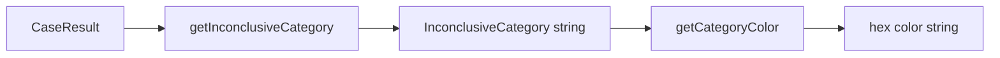

# Design Document: Dashboard Inconclusive Colors

## Overview

This feature replaces the binary green/red color scheme in the Continuous Eval dashboard with a 4-color scheme that visually distinguishes different root causes of inconclusive cases. A pure categorizer function classifies each `CaseResult` into one of five categories (`resolved`, `future_dated`, `personal_subjective`, `should_have_resolved`, `uncategorized`), and a color mapping function translates categories to hex colors. These two functions live in `utils.ts` and are consumed by `CalibrationScatter`, `CaseTable`, and `ResolutionRateChart`.

The change is scoped entirely to the React frontend (`frontend-v4/src/pages/EvalDashboard/`). No backend or API changes are needed — all classification fields (`status`, `verification_mode`, `expected_verdict`, `verifiability_score`) already exist on `CaseResult` records returned by the API.

## Architecture

The design follows a simple function-composition pattern:



All logic is centralized in `utils.ts`. Components call `getCategoryColor(getInconclusiveCategory(caseResult))` instead of the old `getContinuousVerdictColor(caseResult)`.

The categorizer evaluates rules in strict priority order:
1. `status === "resolved"` → `resolved`
2. `status === "inconclusive"` AND `verification_mode ∈ {"at_date", "before_date"}` AND `expected_verdict === null` → `future_dated`
3. `status === "inconclusive"` AND `verifiability_score < 0.4` → `personal_subjective`
4. `status === "inconclusive"` AND `verification_mode === "immediate"` AND `verifiability_score >= 0.7` → `should_have_resolved`
5. Everything else → `uncategorized`

This priority order means a case with `verifiability_score < 0.4` AND `verification_mode === "at_date"` will be classified as `future_dated` (rule 2 fires first), which is the correct behavior — the future-dated nature is the primary reason it's inconclusive.

### Scope of Change

Only the `continuous` agent type uses the new 4-color scheme. The `calibration` and `unified` agent types retain their existing binary green/red calibration-correct color scheme in the scatter plot and their existing verdict coloring in the case table.

## Components and Interfaces

### New Exports in `utils.ts`

```typescript
/** Inconclusive category type */
export type InconclusiveCategory =
  | 'resolved'
  | 'future_dated'
  | 'personal_subjective'
  | 'should_have_resolved'
  | 'uncategorized';

/** Color mapping constant */
export const CATEGORY_COLORS: Record<InconclusiveCategory, string> = {
  resolved: '#22c55e',           // green
  future_dated: '#f59e0b',       // amber
  personal_subjective: '#ef4444', // red
  should_have_resolved: '#f97316', // orange
  uncategorized: '#64748b',       // grey
};

/** Human-readable labels for legend/tooltip */
export const CATEGORY_LABELS: Record<InconclusiveCategory, string> = {
  resolved: 'Resolved',
  future_dated: 'Future-Dated',
  personal_subjective: 'Personal/Subjective',
  should_have_resolved: 'Should Have Resolved',
  uncategorized: 'Uncategorized',
};

/** Pure categorizer: classifies a case into an InconclusiveCategory */
export function getInconclusiveCategory(caseResult: Record<string, unknown>): InconclusiveCategory;

/** Color lookup: maps category to hex color */
export function getCategoryColor(category: InconclusiveCategory): string;
```

### Removed Export from `utils.ts`

- `getContinuousVerdictColor` — replaced by `getCategoryColor(getInconclusiveCategory(...))`.

### Component Changes

**CalibrationScatter.tsx**:
- Accepts new `agentType` prop to distinguish continuous from calibration/unified.
- When `agentType === 'continuous'`: colors dots via `getCategoryColor(getInconclusiveCategory(case))`, shows category in tooltip, renders a legend below the subtitle.
- When `agentType !== 'continuous'`: retains existing binary calibration-correct coloring.

**CaseTable.tsx**:
- For `agentType === 'continuous'` rows: replaces `getContinuousVerdictColor` call with `getCategoryColor(getInconclusiveCategory(case))` for both the status and verdict cells.

**ResolutionRateChart.tsx**:
- Updates the "Stale Inconclusive" line color from `#ef4444` (red) to `#f97316` (orange) to align with the `should_have_resolved` category in the color scheme.

**AgentTab.tsx**:
- Passes `agentType` prop to `CalibrationScatter`.

## Data Models

### Input: CaseResult Fields Used by Categorizer

The categorizer reads these fields from the case result record (all already present in the API response):

| Field | Type | Used For |
|---|---|---|
| `status` | `string` | Primary branch: `"resolved"` vs `"inconclusive"` vs other |
| `verification_mode` | `string \| undefined` | Detecting future-dated cases (`"at_date"`, `"before_date"`) |
| `expected_verdict` | `string \| null \| undefined` | Future-dated requires `null` (no ground truth yet) |
| `verifiability_score` | `number \| undefined` | Threshold checks: `< 0.4` (personal), `>= 0.7` (should resolve) |

### Output: InconclusiveCategory

A string literal union: `'resolved' | 'future_dated' | 'personal_subjective' | 'should_have_resolved' | 'uncategorized'`.

### Type Extension

The existing `ContinuousCaseResult` interface in `types.ts` already has `status` and `verification_date`. We need to ensure `verification_mode` and `expected_verdict` are accessible. Since `CaseResult` already has `expected_verdict`, and the categorizer operates on `Record<string, unknown>` (the raw case object), no type changes are strictly required — the fields are present on the JSON objects from the API.


## Correctness Properties

*A property is a characteristic or behavior that should hold true across all valid executions of a system — essentially, a formal statement about what the system should do. Properties serve as the bridge between human-readable specifications and machine-verifiable correctness guarantees.*

### Property 1: Resolved status always returns resolved

*For any* `CaseResult` with `status === "resolved"` and arbitrary values for `verification_mode`, `expected_verdict`, and `verifiability_score`, `getInconclusiveCategory` SHALL return `"resolved"`.

**Validates: Requirements 1.1, 1.8**

### Property 2: Future-dated classification with priority

*For any* `CaseResult` with `status === "inconclusive"`, `verification_mode` in `{"at_date", "before_date"}`, `expected_verdict === null`, and any `verifiability_score` (including values < 0.4 that would otherwise trigger personal_subjective), `getInconclusiveCategory` SHALL return `"future_dated"`.

**Validates: Requirements 1.2, 1.8**

### Property 3: Personal/subjective classification

*For any* `CaseResult` with `status === "inconclusive"`, `verifiability_score < 0.4`, and conditions that do NOT match the future_dated rule (i.e., `verification_mode` is not in `{"at_date", "before_date"}` or `expected_verdict` is not null), `getInconclusiveCategory` SHALL return `"personal_subjective"`.

**Validates: Requirements 1.3**

### Property 4: Should-have-resolved classification

*For any* `CaseResult` with `status === "inconclusive"`, `verification_mode === "immediate"`, `verifiability_score >= 0.7`, and conditions that do NOT match the future_dated or personal_subjective rules, `getInconclusiveCategory` SHALL return `"should_have_resolved"`.

**Validates: Requirements 1.4**

### Property 5: Uncategorized fallback

*For any* `CaseResult` whose fields do not satisfy the resolved, future_dated, personal_subjective, or should_have_resolved conditions (including cases with `status` values other than `"resolved"` or `"inconclusive"`), `getInconclusiveCategory` SHALL return `"uncategorized"`.

**Validates: Requirements 1.5, 1.6**

### Property 6: Exhaustive and deterministic categorization

*For any* `CaseResult` with any combination of `status`, `verification_mode`, `expected_verdict`, and `verifiability_score`, `getInconclusiveCategory` SHALL return exactly one value from the set `{"resolved", "future_dated", "personal_subjective", "should_have_resolved", "uncategorized"}`, and `getCategoryColor` applied to that value SHALL return a valid hex color string.

**Validates: Requirements 1.7, 2.1, 2.2, 2.3, 2.4, 2.5**

## Error Handling

The categorizer is a pure function operating on in-memory data — there are no network calls, async operations, or failure modes beyond unexpected input shapes.

| Scenario | Handling |
|---|---|
| `status` is `undefined` or missing | Falls through all rules → returns `"uncategorized"` |
| `verifiability_score` is `undefined` or `NaN` | Numeric comparisons (`< 0.4`, `>= 0.7`) evaluate to `false` → falls through to `"uncategorized"` |
| `verification_mode` is `undefined` | Does not match `"at_date"`, `"before_date"`, or `"immediate"` → skips those rules |
| `expected_verdict` is `undefined` vs `null` | Only `null` (not `undefined`) triggers the future_dated rule — `undefined` means the field wasn't present, which is different from explicitly null |
| Unknown category string passed to `getCategoryColor` | Returns the `uncategorized` grey color as a safe default |

No try/catch blocks are needed. The function's if/else chain naturally handles all edge cases by falling through to the `uncategorized` default.

## Testing Strategy

### Property-Based Tests (via fast-check)

The categorizer is a pure function with a well-defined input space — an ideal candidate for property-based testing. We'll use [fast-check](https://github.com/dubzzz/fast-check) (the standard PBT library for TypeScript/JavaScript).

Each of the 6 correctness properties above maps to one property-based test with a minimum of 100 iterations. Tests will generate random `CaseResult`-like objects with constrained fields matching each property's preconditions.

**Generator strategy**: Build a custom `arbitraryCaseResult` generator that produces objects with:
- `status`: one of `"resolved"`, `"inconclusive"`, `"pending"`, `"error"`, or arbitrary strings
- `verification_mode`: one of `"immediate"`, `"at_date"`, `"before_date"`, or arbitrary strings
- `expected_verdict`: `null`, `undefined`, or arbitrary strings
- `verifiability_score`: floats in `[0, 1]`, `undefined`, or `NaN`

Each property test constrains the generator to its precondition and asserts the expected output.

**Tag format**: `Feature: dashboard-inconclusive-colors, Property N: <property text>`

### Unit Tests (example-based)

- Color mapping: verify each of the 5 categories maps to the correct hex color (Requirements 2.1–2.5)
- Label mapping: verify each category has the correct human-readable label
- Backward compatibility: verify `CalibrationScatter` with `agentType="calibration"` still uses binary coloring
- `getContinuousVerdictColor` removal: verify the old function is no longer exported

### Integration / Visual Tests

- Render `CalibrationScatter` with `agentType="continuous"` and verify legend is present
- Render `CaseTable` with continuous cases and verify cell colors match categorizer output
- Verify `ResolutionRateChart` stale inconclusive line uses orange (`#f97316`)

These are lower priority and can be done as manual visual checks or lightweight React Testing Library tests.
