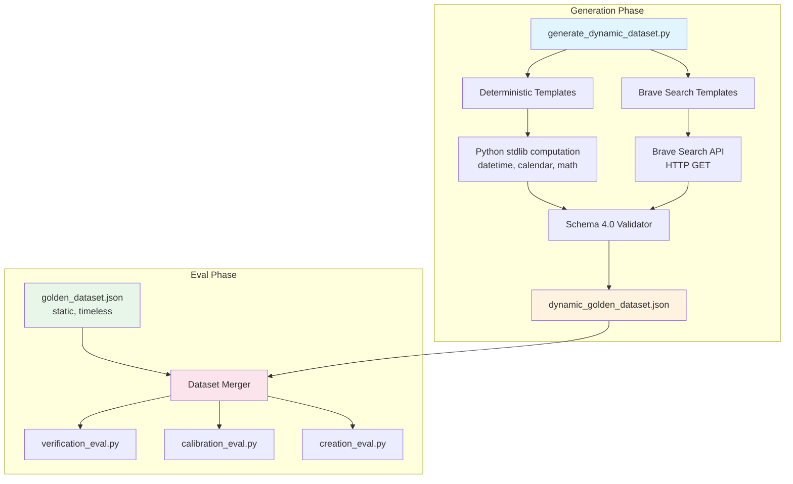

# Design Document: Dynamic Golden Dataset

## Overview

The CalledIt eval framework's static golden dataset (`eval/golden_dataset.json`) has 55 predictions but only 10 immediate-mode cases are testable in the verification eval — the other 45 have null expected verdicts because their verification dates are in the future. Worse, some immediate cases (e.g., base-010) have time-dependent ground truth that goes stale.

This feature introduces `eval/generate_dynamic_dataset.py`, a generator script that produces a fresh `eval/dynamic_golden_dataset.json` with time-anchored predictions each time it runs. Ground truth is computed at generation time via deterministic Python calculations or Brave Search API lookups, so expected verdicts are always current. The eval runners merge static (timeless) and dynamic (time-anchored) datasets, enabling all four verification modes to be tested in every eval run.

### Key Design Decisions

1. **Two-file strategy**: Static dataset stays hand-curated for timeless cases; dynamic dataset is regenerated before each eval run. No single file tries to do both.
2. **Ground truth at generation time**: The generator computes verdicts when it runs, not when the eval runs. This means the dynamic dataset is a snapshot — valid for hours, not days.
3. **Backward-compatible merging**: The `--dynamic-dataset` CLI arg is optional. Without it, all three eval runners behave exactly as today.
4. **Brave Search degradation**: If the Brave API is unavailable, the generator produces a smaller dataset with only deterministic predictions. The eval still runs.

## Architecture



### Generation Pipeline

1. **Template instantiation**: Each template is a Python function that takes the current datetime and returns a prediction dict (or `None` if it can't compute ground truth).
2. **Ground truth computation**: Deterministic templates use `datetime`, `calendar`, `math`. Brave templates call the Brave Search API and extract facts from results.
3. **Validation**: The complete dataset is validated against schema 4.0 rules before writing to disk.
4. **Output**: `eval/dynamic_golden_dataset.json` in the same format as the static dataset.

### Merge Pipeline

1. Load static dataset via existing `load_dataset()`.
2. Load dynamic dataset via the same function.
3. Build a `replaces` index from dynamic predictions (each dynamic prediction can declare which static ID it replaces).
4. Filter static predictions: exclude any with `time_sensitive: true` that have a dynamic replacement.
5. Concatenate remaining static + all dynamic predictions.
6. Return merged dataset to the eval runner.

## Components and Interfaces

### 1. Generator Script (`eval/generate_dynamic_dataset.py`)

```python
# Entry point
def main() -> None:
    """Generate dynamic golden dataset and write to eval/dynamic_golden_dataset.json."""

# Template registry
def get_all_templates() -> list[Callable]:
    """Return all prediction template functions."""

# Template function signature
def template_weekday_check(now: datetime) -> dict | None:
    """Example deterministic template. Returns prediction dict or None."""

# Brave Search integration
def brave_search(query: str, count: int = 5) -> dict | None:
    """Query Brave Search API. Returns parsed results or None on failure."""

# Ground truth computation
def compute_deterministic_ground_truth(template_id: str, now: datetime) -> dict:
    """Compute ground truth using Python stdlib. Returns ground_truth dict."""

# Validation
def validate_dynamic_dataset(dataset: dict) -> list[str]:
    """Validate against schema 4.0 rules. Returns list of errors."""

# Output
def write_dataset(dataset: dict, path: str) -> None:
    """Write validated dataset to JSON file."""
```

### 2. Dataset Merger (`eval/dataset_merger.py`)

```python
def merge_datasets(
    static_path: str,
    dynamic_path: str,
) -> dict:
    """Merge static and dynamic datasets.
    
    - Dynamic predictions with `replaces` field override matching static predictions.
    - Static predictions with `time_sensitive: true` are excluded if replaced.
    - Returns merged dataset dict in schema 4.0 format.
    """

def load_and_merge(
    static_path: str,
    dynamic_path: str | None = None,
) -> dict:
    """Load datasets and merge. If dynamic_path is None, returns static only."""
```

### 3. Eval Runner Changes

All three eval runners (`verification_eval.py`, `creation_eval.py`, `calibration_eval.py`) get:

- `--dynamic-dataset` CLI argument (optional)
- Updated `load_dataset()` call to use `load_and_merge()` when dynamic path is provided
- `dataset_sources` field in report metadata

The change is minimal — replace the `load_dataset(args.dataset)` call with `load_and_merge(args.dataset, args.dynamic_dataset)`.

### 4. Validation Extension (`eval/validate_dataset.py`)

The existing validator gets a new mode for dynamic datasets:
- Relaxed coverage requirements (dynamic datasets are smaller, don't need 12+ per category)
- Additional checks: `generated_at` in metadata, `ground_truth_computation` in each prediction, non-null `expected_verification_outcome` for all predictions
- Same structural checks for prediction fields

### 5. Static Dataset Update (`eval/golden_dataset.json`)

One-time migration:
- Add `time_sensitive: true` to base-010 (full moon prediction) and any other time-dependent cases
- No predictions deleted, no IDs changed

## Data Models

### Dynamic Dataset Schema (schema 4.0 compatible)

```json
{
  "schema_version": "4.0",
  "dataset_version": "dynamic-1.0",
  "metadata": {
    "generated_at": "2026-04-01T12:00:00Z",
    "generator_version": "1.0",
    "brave_api_available": true,
    "expected_base_count": 12,
    "expected_mode_counts": {
      "immediate": 3,
      "at_date": 3,
      "before_date": 3,
      "recurring": 3
    }
  },
  "base_predictions": [
    {
      "id": "dyn-imm-001",
      "prediction_text": "Today is a weekday",
      "difficulty": "easy",
      "verification_mode": "immediate",
      "verification_readiness": "immediate",
      "expected_verification_outcome": "confirmed",
      "expected_verifiability_score_range": [0.9, 1.0],
      "smoke_test": false,
      "is_boundary_case": false,
      "boundary_description": null,
      "replaces": null,
      "time_sensitive": false,
      "dimension_tags": {
        "domain": "science",
        "stakes": "trivial",
        "time_horizon": "minutes-to-hours",
        "persona": "student"
      },
      "ground_truth": {
        "verifiability_reasoning": "Day of week is deterministic from calendar.",
        "date_derivation": "Current date at generation time.",
        "verification_sources": ["calendar_arithmetic"],
        "objectivity_assessment": "objective",
        "verification_criteria": ["Today is Monday-Friday"],
        "verification_steps": ["Check current day of week"],
        "verification_timing": "Immediate",
        "expected_verification_criteria": ["The current day is a weekday (Mon-Fri)"],
        "expected_verification_method": "Calendar arithmetic on current date.",
        "ground_truth_source": "deterministic",
        "ground_truth_computation": {
          "source": "deterministic",
          "raw_data": {
            "date": "2026-04-01",
            "day_of_week": "Wednesday",
            "formula": "calendar.weekday(2026, 4, 1) < 5"
          },
          "computation_logic": "Wednesday is weekday index 2 (< 5), so this is a weekday → confirmed",
          "computed_at": "2026-04-01T12:00:00Z"
        }
      },
      "evaluation_rubric": "Agent should confirm via calendar reasoning or current date check."
    }
  ]
}
```

### New Fields (Schema Extensions)

| Field | Location | Type | Description |
|-------|----------|------|-------------|
| `time_sensitive` | prediction root | `bool` | `true` if ground truth can go stale. Used in static dataset to flag cases needing dynamic replacement. |
| `ground_truth_source` | `ground_truth` | `string` | One of `deterministic`, `brave_search`, `api_lookup`. How the generator computed the verdict. |
| `ground_truth_computation` | `ground_truth` | `object` | Audit trail: `source`, `raw_data`, `computation_logic`, `computed_at`. |
| `replaces` | prediction root | `string\|null` | Static dataset prediction ID that this dynamic prediction replaces (e.g., `"base-010"`). |
| `generated_at` | `metadata` | `string` | ISO 8601 timestamp of when the dynamic dataset was generated. |
| `brave_api_available` | `metadata` | `bool` | Whether Brave API was reachable during generation. |
| `recurring_interval` | prediction root | `string\|null` | For recurring mode: check frequency (e.g., `"daily"`, `"weekly"`). |

### Prediction Template Structure

Each template is a function with this signature:

```python
def template_name(now: datetime, brave_fn: Callable | None) -> dict | None:
    """
    Args:
        now: Current UTC datetime (generation time).
        brave_fn: Brave search function, or None if API unavailable.
    
    Returns:
        Prediction dict in schema 4.0 format, or None if ground truth
        cannot be computed (e.g., brave_fn is None for a brave_search template).
    """
```

### Template Categories

**Immediate Mode Templates:**
- Deterministic: weekday check, current year parity, days until end of year, current month has 31 days
- Brave Search: current US President name, Python latest version, current Bitcoin price vs threshold

**At-Date Mode Templates:**
- Deterministic: day-of-week for yesterday, was yesterday a holiday (US federal calendar)
- Brave Search: yesterday's S&P 500 close vs threshold, recent sports result

**Before-Date Mode Templates:**
- Deterministic: full moon occurred before [recent date] (lunar cycle math), solstice/equinox before [date]
- Brave Search: specific event occurred before deadline (product launch, policy announcement)

**Recurring Mode Templates:**
- Brave Search: US national debt exceeds threshold, Bitcoin above threshold, specific website is accessible

### ID Convention

```
dyn-{mode_prefix}-{sequence}

Mode prefixes:
  imm = immediate
  atd = at_date
  bfd = before_date
  rec = recurring

Examples: dyn-imm-001, dyn-atd-003, dyn-bfd-002, dyn-rec-001
```


## Correctness Properties

*A property is a characteristic or behavior that should hold true across all valid executions of a system — essentially, a formal statement about what the system should do. Properties serve as the bridge between human-readable specifications and machine-verifiable correctness guarantees.*

### Property 1: Generator output round-trip

*For any* invocation of the generator (with any combination of available/unavailable Brave API), the produced JSON file should be successfully loadable by the existing `load_dataset()` function and contain a valid `base_predictions` array and `metadata` object with `generated_at` timestamp.

**Validates: Requirements 1.2, 1.4**

### Property 2: Non-null verdict invariant

*For any* prediction in a generated dynamic dataset, the `expected_verification_outcome` field must be non-null and one of `confirmed`, `refuted`, or `inconclusive`.

**Validates: Requirements 1.3, 8.4**

### Property 3: Valid enum fields

*For any* prediction in a generated dynamic dataset: `verification_mode` must be one of `immediate`, `at_date`, `before_date`, `recurring`; `ground_truth_source` must be one of `deterministic`, `brave_search`, `api_lookup`; and `difficulty` must be one of `easy`, `medium`, `hard`.

**Validates: Requirements 1.5, 8.5**

### Property 4: Graceful Brave API degradation

*For any* generator invocation where the Brave API is unavailable (mocked to fail), the generator should still produce a valid dataset containing only predictions with `ground_truth_source` equal to `deterministic`, and no predictions with `ground_truth_source` equal to `brave_search`.

**Validates: Requirements 1.7**

### Property 5: Minimum prediction count per mode

*For any* generated dynamic dataset (with Brave API available), each verification mode must meet its minimum count: `immediate` >= 3, `at_date` >= 3, `before_date` >= 3, `recurring` >= 3.

**Validates: Requirements 2.1, 3.1, 4.1, 5.1**

### Property 6: Verdict distribution balance per mode

*For any* generated dynamic dataset (with Brave API available), each of `immediate`, `at_date`, and `before_date` modes must contain at least 1 prediction with `expected_verification_outcome` equal to `confirmed` and at least 1 with `refuted`.

**Validates: Requirements 2.6, 3.6, 4.6, 10.4**

### Property 7: Verification dates in valid temporal range

*For any* `at_date` prediction in a generated dynamic dataset, the `verification_date` must be in the past relative to `generated_at` and within 72 hours. *For any* `before_date` prediction, the `verification_date` (deadline) must be in the past relative to `generated_at` and within 7 days.

**Validates: Requirements 3.2, 3.5, 4.2**

### Property 8: Auditability completeness

*For any* prediction in a generated dynamic dataset, `ground_truth.ground_truth_computation` must contain all four required fields: `source`, `raw_data`, `computation_logic`, `computed_at`. When `ground_truth_source` is `brave_search`, `raw_data` must contain `query` and `snippet` keys. When `ground_truth_source` is `deterministic`, `raw_data` must contain computation inputs.

**Validates: Requirements 9.1, 9.2, 9.3**

### Property 9: Recurring prediction completeness

*For any* recurring-mode prediction in a generated dynamic dataset, `recurring_interval` must be a non-null string, and `ground_truth.ground_truth_computation.raw_data` must contain the queried current value.

**Validates: Requirements 5.4, 5.5**

### Property 10: Static dataset immutability

*For any* invocation of the generator, the contents of `eval/golden_dataset.json` must be byte-identical before and after generation.

**Validates: Requirements 6.2**

### Property 11: Time-sensitive exclusion in merge

*For any* static dataset containing a prediction with `time_sensitive: true` and a dynamic dataset containing a prediction with `replaces` pointing to that static prediction's ID, the merged dataset must not contain the static prediction — only the dynamic replacement.

**Validates: Requirements 6.3**

### Property 12: Merge precedence and deduplication

*For any* pair of static and dynamic datasets where a dynamic prediction has `replaces` set to a static prediction ID, the merged dataset must contain the dynamic prediction and exclude the replaced static prediction. All other static predictions must be preserved.

**Validates: Requirements 7.2**

### Property 13: Backward compatibility

*For any* static dataset, calling `load_and_merge(static_path, dynamic_path=None)` must return a dataset identical to calling `load_dataset(static_path)`.

**Validates: Requirements 7.3**

### Property 14: ID prefix convention

*For any* merged dataset, all predictions originating from the dynamic dataset must have IDs starting with `dyn-`, and all predictions originating from the static dataset must retain their original IDs (not starting with `dyn-`).

**Validates: Requirements 7.5**

### Property 15: Difficulty and domain diversity

*For any* generated dynamic dataset, the set of `difficulty` values across all predictions must include at least `easy`, `medium`, and `hard`. The set of `domain` values (from `dimension_tags.domain`) must have cardinality >= 4.

**Validates: Requirements 10.1, 10.2**

### Property 16: Report metadata includes dataset sources

*For any* eval run using merged datasets, the report's `run_metadata` must contain a `dataset_sources` field listing the file paths of all dataset files used.

**Validates: Requirements 7.4, 9.4**

## Error Handling

### Generator Errors

| Error Condition | Behavior |
|----------------|----------|
| Brave API key not set (`BRAVE_API_KEY` env var missing) | Log warning, generate deterministic-only dataset |
| Brave API timeout (>15s per request) | Skip that template, log warning, continue with remaining templates |
| Brave API HTTP error (4xx/5xx) | Skip all brave_search templates, log warning, produce deterministic-only dataset |
| Brave API returns no results for a query | Skip that specific template, log warning |
| Schema validation failure | Exit with code 1, print all validation errors to stderr |
| Output file write failure | Exit with code 1, print error to stderr |
| Fewer predictions than minimum thresholds | Log warning in dataset metadata, do not fail (degraded mode) |

### Merger Errors

| Error Condition | Behavior |
|----------------|----------|
| Dynamic dataset file not found | Exit with error (user explicitly requested it) |
| Dynamic dataset invalid JSON | Exit with error |
| Dynamic dataset missing `base_predictions` | Exit with error |
| `replaces` field references non-existent static ID | Log warning, include dynamic prediction anyway (it's still valid) |

### Eval Runner Errors

| Error Condition | Behavior |
|----------------|----------|
| `--dynamic-dataset` path doesn't exist | Exit with error message |
| Merged dataset has 0 qualifying cases | Exit with error (same as today) |

## Testing Strategy

### Property-Based Testing

Use `hypothesis` (already in the project's venv) for property-based tests. Each property test runs a minimum of 100 iterations.

**Library**: `hypothesis` (Python)
**Location**: `eval/tests/test_dynamic_dataset.py`

Property tests will cover:
- **Properties 1-3, 5-9, 15**: Generate random datetime inputs, invoke deterministic templates, verify structural invariants on the output.
- **Property 4**: Mock Brave API to fail, verify degraded output.
- **Properties 11-14**: Generate random static/dynamic dataset pairs using hypothesis strategies, verify merge behavior.
- **Property 10**: Hash static dataset before/after generator invocation.
- **Property 16**: Mock eval report generation, verify metadata structure.

Each test is tagged with: `# Feature: dynamic-golden-dataset, Property {N}: {title}`

### Unit Testing

**Location**: `eval/tests/test_dynamic_dataset.py` (same file)

Unit tests focus on:
- Specific template outputs for known dates (e.g., "2026-04-01 is a Wednesday" → confirmed weekday)
- Brave Search response parsing for specific mock responses
- Edge cases: generation on weekends, holidays, leap years, month boundaries
- Merge edge cases: empty dynamic dataset, dynamic dataset with no `replaces` fields, all static predictions replaced
- Validator acceptance/rejection of specific malformed predictions
- CLI argument parsing for `--dynamic-dataset`

### Integration Testing

Manual integration tests (not automated):
- Run generator end-to-end: `/home/wsluser/projects/calledit/venv/bin/python eval/generate_dynamic_dataset.py`
- Run validator on output: `/home/wsluser/projects/calledit/venv/bin/python eval/validate_dataset.py eval/dynamic_golden_dataset.json`
- Run verification eval with merged dataset: `--dataset eval/golden_dataset.json --dynamic-dataset eval/dynamic_golden_dataset.json`
- Verify backward compatibility: run eval without `--dynamic-dataset` and compare report structure
