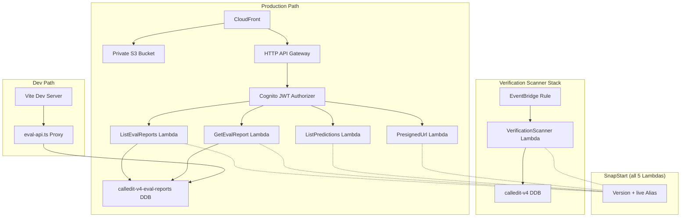

# Design Document: Eval Dashboard API

## Overview

This design adds production API endpoints for the eval dashboard by extending the existing v4-frontend SAM stack with two new Lambda functions (ListEvalReports, GetEvalReport), a new DynamoDB table in the persistent resources stack, SnapStart across all v4 Lambdas, and a frontend API client that switches between Vite proxy (dev) and API Gateway + JWT (prod).

The approach replicates the exact DynamoDB query logic already proven in the Vite dev server proxy (`server/eval-api.ts`) and the Python `report_store.py` module, wrapping it in Lambda handlers that follow the established `ListPredictions` pattern (Python 3.12, API Gateway V2 payload format 2.0, `DecimalEncoder` for JSON serialization).

### Key Design Decisions

1. **Reuse existing patterns** — new Lambdas mirror `ListPredictions` handler structure (same response helper, same Decimal handling, same error shape).
2. **SnapStart everywhere** — all 5 v4 Lambdas (2 existing + 2 new in v4-frontend, 1 in verification-scanner) get SnapStart with published version + `live` alias. API Gateway integrations and EventBridge targets point at alias ARNs.
3. **Persistent table** — `calledit-v4-eval-reports` table lives in `v4-persistent-resources` with Retain policy, exported for cross-stack reference.
4. **Dual-mode frontend** — `import.meta.env.DEV` gates between Vite proxy paths and API Gateway base URL + JWT Authorization header.

## Architecture



### Request Flow (Production)

1. Browser loads React SPA from CloudFront → S3.
2. `useReportStore` detects `import.meta.env.DEV === false`.
3. Fetches `{VITE_V4_API_URL}/eval/reports?agent=creation` with `Authorization: Bearer {id_token}`.
4. HTTP API Gateway validates JWT via CognitoAuthorizer.
5. ListEvalReports Lambda queries `calledit-v4-eval-reports` table, returns JSON array of report summaries.
6. For drill-down, fetches `{VITE_V4_API_URL}/eval/report?agent=creation&ts=2025-01-15T...` — GetEvalReport Lambda returns full report with reassembled split case_results.

### Request Flow (Development)

1. Vite dev server serves React SPA on `localhost:5173`.
2. `useReportStore` detects `import.meta.env.DEV === true`.
3. Fetches `/api/eval/reports?agent=creation` — no auth header.
4. Vite middleware (`eval-api.ts`) queries DDB directly using local AWS credentials.

## Components and Interfaces

### 1. Persistent Resources Stack Additions

**File:** `infrastructure/v4-persistent-resources/template.yaml`

New resource: `V4EvalReportsTable` — DynamoDB table with:
- `TableName: calledit-v4-eval-reports`
- `PK` (String) partition key, `SK` (String) sort key
- `BillingMode: PAY_PER_REQUEST`
- `DeletionPolicy: Retain`, `UpdateReplacePolicy: Retain`

New outputs:
- `V4EvalReportsTableName` — exported as `${AWS::StackName}-EvalReportsTableName`
- `V4EvalReportsTableArn` — exported as `${AWS::StackName}-EvalReportsTableArn`

### 2. V4 Frontend Stack Additions

**File:** `infrastructure/v4-frontend/template.yaml`

New parameters:
- `EvalReportsTableName` (String) — from persistent resources output
- `EvalReportsTableArn` (String) — from persistent resources output

#### ListEvalReports Lambda

**Code:** `infrastructure/v4-frontend/list_eval_reports/handler.py`

```python
def lambda_handler(event, context):
    # Extract ?agent= from queryStringParameters
    # Query DDB: PK=AGENT#{agent}, ProjectionExpression excludes case_results
    # ScanIndexForward=False (newest first)
    # Return JSON array of {run_metadata, aggregate_scores}
```

SAM resources:
- `ListEvalReportsFunction` — `AWS::Serverless::Function` with SnapStart
- `ListEvalReportsVersion` — `AWS::Lambda::Version`
- `ListEvalReportsAlias` — `AWS::Lambda::Alias` (Name: `live`)
- `ListEvalReportsIntegration` — targets alias ARN
- `ListEvalReportsRoute` — `GET /eval/reports` with JWT auth
- `ListEvalReportsPermission` — `DependsOn: ListEvalReportsAlias`

#### GetEvalReport Lambda

**Code:** `infrastructure/v4-frontend/get_eval_report/handler.py`

```python
def lambda_handler(event, context):
    # Extract ?agent= and ?ts= from queryStringParameters
    # GetItem: PK=AGENT#{agent}, SK={ts}
    # If case_results_split: GetItem SK={ts}#CASES, merge case_results
    # Remove PK, SK, case_results_split from response
    # Return full report JSON
```

SAM resources: same pattern as ListEvalReports (Version, Alias, Integration, Route, Permission).

#### SnapStart Retrofit for Existing Lambdas

For `PresignedUrlFunction` and `ListPredictionsFunction`:
- Add `SnapStart: ApplyOn: PublishedVersions` to function properties
- Add `AWS::Lambda::Version` resource
- Add `AWS::Lambda::Alias` resource (Name: `live`)
- Update existing `Integration` to target alias ARN
- Update existing `Permission` to reference alias ARN + `DependsOn` alias

### 3. Verification Scanner Stack SnapStart

**File:** `infrastructure/verification-scanner/template.yaml`

- Add `SnapStart: ApplyOn: PublishedVersions` to `VerificationScannerFunction`
- Add `VerificationScannerVersion` + `VerificationScannerAlias`
- Update EventBridge `ScheduledScan` target to invoke alias ARN (use `Arn` property on the event pointing to the alias)

### 4. Frontend API Client

**File:** `frontend-v4/src/pages/EvalDashboard/hooks/useReportStore.ts`

Updated to dual-mode:

```typescript
// Base URL: dev uses Vite proxy path, prod uses API Gateway
const BASE = import.meta.env.DEV ? '/api' : import.meta.env.VITE_V4_API_URL;

// Auth header: dev omits, prod includes Cognito ID token
function authHeaders(): HeadersInit {
  if (import.meta.env.DEV) return {};
  const token = getToken(); // from AuthContext
  return token ? { Authorization: `Bearer ${token}` } : {};
}
```

The `useReportList` hook and `getFullReport` function use `BASE` + `authHeaders()` while preserving the same `?agent=` and `?ts=` query parameter interface.

### 5. SnapStart CloudFormation Pattern (all Lambdas)

Each SnapStart-enabled Lambda follows this exact pattern:

```yaml
MyFunction:
  Type: AWS::Serverless::Function
  Properties:
    SnapStart:
      ApplyOn: PublishedVersions
    # ... other properties

MyFunctionVersion:
  Type: AWS::Lambda::Version
  Properties:
    FunctionName: !Ref MyFunction

MyFunctionAlias:
  Type: AWS::Lambda::Alias
  Properties:
    FunctionName: !Ref MyFunction
    FunctionVersion: !GetAtt MyFunctionVersion.Version
    Name: live

MyFunctionIntegration:
  Type: AWS::ApiGatewayV2::Integration
  Properties:
    IntegrationUri: !GetAtt MyFunctionAlias.Arn  # alias, not function

MyFunctionPermission:
  Type: AWS::Lambda::Permission
  DependsOn: MyFunctionAlias  # prevent race condition
  Properties:
    FunctionName: !GetAtt MyFunctionAlias.Arn
```

## Data Models

### DynamoDB: calledit-v4-eval-reports

| Field | Type | Description |
|-------|------|-------------|
| `PK` | String | `AGENT#{agent_type}` where agent_type ∈ {creation, verification, calibration} |
| `SK` | String | ISO 8601 timestamp (e.g., `2025-01-15T10:30:00Z`) |
| `run_metadata` | Map | Agent name, run tier, timestamp, duration, case count, prompt versions, etc. |
| `aggregate_scores` | Map | Numeric scores keyed by metric name |
| `case_results` | List | Per-case results (excluded in list queries, may be split) |
| `case_results_split` | Boolean | `true` if case_results stored in companion `{SK}#CASES` item |
| `bias_warning` | String | Optional warning text |

**Split item pattern:** When the main item exceeds ~390KB, `case_results` is stored in a separate item with `SK={timestamp}#CASES` containing only `PK`, `SK`, and `case_results`.

### API Response Shapes

**GET /eval/reports?agent={agent_type}** → `200 OK`
```json
[
  {
    "run_metadata": {
      "agent": "creation",
      "timestamp": "2025-01-15T10:30:00Z",
      "duration_seconds": 120.5,
      "case_count": 50,
      "prompt_versions": {"parser": "2", "categorizer": "3"}
    },
    "aggregate_scores": {
      "overall_accuracy": 0.85,
      "parsing_score": 0.92
    }
  }
]
```

**GET /eval/report?agent={agent_type}&ts={timestamp}** → `200 OK`
```json
{
  "run_metadata": { ... },
  "aggregate_scores": { ... },
  "case_results": [
    {
      "id": "case_001",
      "scores": { "accuracy": { "score": 1.0, "pass": true, "reason": "..." } },
      "input": "raw prediction text"
    }
  ]
}
```

**Error responses** (400, 404, 500):
```json
{ "error": "descriptive error message" }
```

### Lambda Handler Response Format

Following the `ListPredictions` pattern — API Gateway V2 payload format 2.0:
```python
{
    "statusCode": 200,
    "headers": {"Content-Type": "application/json"},
    "body": json.dumps(payload, cls=DecimalEncoder)
}
```


## Correctness Properties

*A property is a characteristic or behavior that should hold true across all valid executions of a system — essentially, a formal statement about what the system should do. Properties serve as the bridge between human-readable specifications and machine-verifiable correctness guarantees.*

### Property 1: Decimal conversion round-trip

*For any* nested Python data structure containing `Decimal` values (including nested dicts and lists), converting all `Decimal` values to `float`/`int` via `DecimalEncoder` should produce a JSON-serializable structure where every original `Decimal` value is represented as a numerically equivalent `float` (or `int` if the Decimal has no fractional part), and no `Decimal` instances remain.

**Validates: Requirements 2.8, 3.10**

### Property 2: ListEvalReports query construction

*For any* valid agent type string, when the ListEvalReports handler receives an API Gateway V2 event with `queryStringParameters.agent` set to that string, the DynamoDB Query call should use `PK = AGENT#{agent}` as the key condition, `ScanIndexForward=False`, and a ProjectionExpression that excludes `case_results`.

**Validates: Requirements 2.5**

### Property 3: ListEvalReports response shape

*For any* list of DynamoDB items returned by a Query (each containing `run_metadata` and `aggregate_scores` maps), the ListEvalReports handler should return a `200` response whose JSON body is an array where each element contains exactly `run_metadata` and `aggregate_scores` keys (no `PK`, `SK`, or `case_results`).

**Validates: Requirements 2.7**

### Property 4: GetEvalReport key construction

*For any* agent type string and timestamp string, when the GetEvalReport handler receives an API Gateway V2 event with `queryStringParameters.agent` and `queryStringParameters.ts` set to those values, the DynamoDB GetItem call should use `PK = AGENT#{agent}` and `SK = {ts}` as the key.

**Validates: Requirements 3.5**

### Property 5: Split case_results reassembly

*For any* DynamoDB item with `case_results_split=True` and a companion item at `SK={ts}#CASES` containing a `case_results` list, the GetEvalReport handler should return a response where `case_results` equals the companion item's `case_results`, and the `case_results_split` flag is absent from the response.

**Validates: Requirements 3.6, 3.9**

### Property 6: GetEvalReport response sanitization

*For any* DynamoDB item containing `PK`, `SK`, and optionally `case_results_split` fields alongside `run_metadata`, `aggregate_scores`, and `case_results`, the GetEvalReport handler response should contain `run_metadata`, `aggregate_scores`, and `case_results` but never contain `PK`, `SK`, or `case_results_split`.

**Validates: Requirements 3.9**

### Property 7: Frontend API client mode switching

*For any* agent type string and optional timestamp string, when `import.meta.env.DEV` is `true` the constructed fetch URL should start with `/api/eval/` and include no `Authorization` header, and when `import.meta.env.DEV` is `false` the URL should start with `{VITE_V4_API_URL}/eval/` and include an `Authorization: Bearer {token}` header. In both modes, the `agent` and `ts` query parameters should be identical.

**Validates: Requirements 5.1, 5.2, 5.3**

## Error Handling

### Lambda Error Responses

All Lambda handlers follow a consistent error response pattern:

| Condition | Status | Body | Log |
|-----------|--------|------|-----|
| Missing required query parameter | 400 | `{"error": "agent param required"}` or `{"error": "agent and ts params required"}` | Warning |
| Item not found (GetEvalReport only) | 404 | `{"error": "not found"}` | Info |
| DynamoDB ClientError | 500 | `{"error": "Database error: {details}"}` | Error with exc_info |
| Unexpected exception | 500 | `{"error": "Unexpected error: {details}"}` | Error with exc_info |

### Frontend Error Handling

- `useReportList` hook catches fetch errors and surfaces them via `error` state.
- `getFullReport` throws on non-OK responses (caller handles).
- Auth token retrieval failure (null token) — fetch proceeds without header; API Gateway returns 401, surfaced as error.

### Split Case Results Edge Cases

- If main item has `case_results_split=True` but companion `#CASES` item is missing, return `case_results: []` and log a warning (matches existing `report_store.py` behavior).

## Testing Strategy

### Property-Based Testing

**Library:** [Hypothesis](https://hypothesis.readthedocs.io/) (Python) for Lambda handler tests.

Each correctness property maps to a single Hypothesis test with `@settings(max_examples=100)`.

Tests mock the DynamoDB boto3 calls (using `unittest.mock.patch`) and generate random inputs:
- Agent type strings (non-empty text)
- Timestamp strings (ISO 8601 format)
- DDB item dicts with nested Decimal values
- Split/non-split report items

Each test is tagged with a comment:
```python
# Feature: eval-dashboard-api, Property 1: Decimal conversion round-trip
```

**Test file:** `infrastructure/v4-frontend/tests/test_handler_properties.py`

### Unit Tests

Unit tests cover specific examples and edge cases not suited to property-based testing:

- **Missing query parameters** → 400 response (Requirements 2.6, 3.7)
- **Item not found** → 404 response (Requirement 3.8)
- **DynamoDB failure** → 500 response (Requirements 2.9, 3.11)
- **CloudFormation template validation** — verify table definition, SnapStart config, alias/version resources, integration targets (Requirements 1.1–1.3, 2.1–2.4, 3.1–3.4, 4.1–4.4, 7.1–7.5)

**Test file:** `infrastructure/v4-frontend/tests/test_handler_unit.py`

### Frontend Tests

- Unit tests for URL construction and header logic in `useReportStore` (vitest + jsdom).
- Verify dev mode produces `/api/eval/...` URLs with no auth header.
- Verify prod mode produces `{VITE_V4_API_URL}/eval/...` URLs with Bearer token.

**Test file:** `frontend-v4/src/pages/EvalDashboard/hooks/__tests__/useReportStore.test.ts`

### Integration Testing

Manual integration tests after deployment:
1. Deploy persistent resources stack → verify table exists.
2. Deploy v4-frontend stack → verify all 4 Lambdas have SnapStart aliases.
3. `curl` the API Gateway endpoints with a valid JWT → verify 200 responses.
4. Build frontend, sync to S3, invalidate CloudFront → verify dashboard loads and fetches data.
