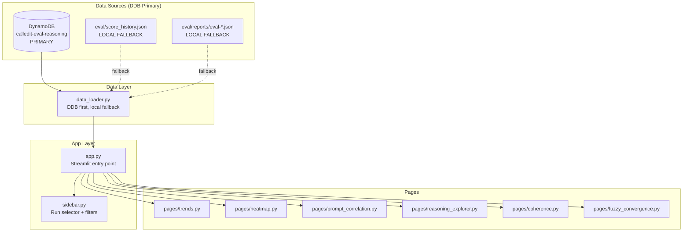

# Design Document: Eval Dashboard

## Overview

The Eval Dashboard is a local Streamlit web application that replaces the static PNG chart generator (`eval/generate_charts.py`) and Jupyter notebook (`eval/eval_explorer.ipynb`) with an interactive, multi-view dashboard for exploring CalledIt eval results.

The dashboard reads from DynamoDB as its primary data source, with local JSON files as fallback:
1. DynamoDB `calledit-eval-reasoning` table — primary store for all eval data (run summaries, per-test scores, agent reasoning traces, judge reasoning, token counts)
2. `eval/score_history.json` — local fallback for run summaries (written alongside DDB)
3. `eval/reports/eval-*.json` — local fallback for per-test detail (written alongside DDB, gitignored)

The application is organized into 6 pages: Trends, Heatmap, Prompt Correlation, Reasoning Explorer, Coherence View, and Fuzzy Convergence. A persistent sidebar provides run selection and filtering.

### Key Design Decisions

1. **Streamlit over Dash/Flask**: Streamlit is Python-native, requires no frontend code, has built-in Plotly integration, and supports multi-page apps natively. The dashboard is a dev tool — Streamlit's rapid iteration model fits perfectly.

2. **DDB-primary storage with local fallback**: All eval data lives in DynamoDB as the primary store. The eval runner writes to DDB first, then local JSON as backup. The dashboard reads from DDB first; if DDB is unavailable, it falls back to local files. This gives durability (no data loss on crash), queryability, and no git repo bloat — while keeping the eval runner functional even without DDB.

3. **Unified DDB table**: All eval data uses the existing `calledit-eval-reasoning` table with new record types: `report_summary#SUMMARY` for run aggregates, `test_result#{test_case_id}` for per-test scores. These sit alongside existing `agent_output#`, `judge_reasoning#`, and `token_counts#` records. One table, one query pattern.

4. **No eval runner modifications for the dashboard**: The dashboard reads existing DDB records and local files. The eval runner already writes to DDB (reasoning store) and local JSON. The only eval runner change needed is writing the additional `report_summary` and `test_result` record types to DDB — a small extension of the existing `EvalReasoningStore`.

5. **Plotly for charts**: Plotly provides interactive hover, zoom, and selection out of the box with Streamlit's `st.plotly_chart`. This replaces the static matplotlib charts.

## Architecture



### Data Flow

1. On startup, `data_loader.py` attempts to load all eval runs from DDB (`calledit-eval-reasoning` table) by querying for all `report_summary#SUMMARY` records. If DDB is unavailable, it falls back to reading `score_history.json` and `eval/reports/eval-*.json` from local files. Results are cached via `@st.cache_data`.
2. The sidebar presents a run selector populated from loaded data. The selected run(s) are stored in `st.session_state`.
3. Each page reads from `st.session_state` to get the selected run and renders its view.
4. Per-test-case detail and reasoning traces are loaded from DDB on demand when a user selects a specific test case. If DDB is unavailable, the dashboard shows scores from the local report JSON but without reasoning traces.

## Components and Interfaces

### `eval/dashboard/data_loader.py` — Unified Data Layer (DDB Primary, Local Fallback)

```python
class EvalDataLoader:
    """Loads eval data from DDB (primary) with local file fallback."""

    def __init__(self, table_name: str = "calledit-eval-reasoning",
                 history_path: str = "eval/score_history.json",
                 reports_dir: str = "eval/reports"):
        """Initialize DDB client and local file paths."""

    def is_ddb_available(self) -> bool:
        """Returns True if DDB connection was established."""

    @st.cache_data
    def load_all_runs(_self) -> list[dict]:
        """Load all eval run summaries. DDB first, local fallback.
        From DDB: queries all report_summary#SUMMARY records.
        From local: reads score_history.json."""

    def load_run_detail(_self, eval_run_id: str) -> dict | None:
        """Load full per-test-case detail for a run.
        From DDB: queries all test_result#{test_case_id} records for the run.
        From local: finds matching eval/reports/eval-*.json file."""

    def load_agent_outputs(self, eval_run_id: str, test_case_id: str) -> dict | None:
        """Load agent reasoning traces from DDB. No local fallback (DDB-only data)."""

    def load_judge_reasoning(self, eval_run_id: str, test_case_id: str) -> list[dict]:
        """Load judge reasoning from DDB. No local fallback."""

    def load_token_counts(self, eval_run_id: str, test_case_id: str) -> dict | None:
        """Load token counts from DDB. No local fallback."""

    def compare_runs(self, run_a: dict, run_b: dict) -> dict:
        """Compare two run summaries. Returns prompt deltas, category deltas,
        regression flags."""
```

### `eval/dashboard/sidebar.py` — Run Selection & Filters

```python
def render_sidebar(history: dict, reports: list[dict]) -> dict:
    """Render sidebar with run selector, comparison selector, and filters.
    Returns {"selected_run": dict, "comparison_run": dict | None,
             "filter_layer": str | None, "filter_category": str | None,
             "filter_dataset_version": str | None}."""
```

### Page Modules

Each page module exposes a single `render(...)` function:

| Module | Signature | Data Sources |
|--------|-----------|-------------|
| `pages/trends.py` | `render(runs: list[dict])` | run summaries (DDB/local) |
| `pages/heatmap.py` | `render(run_detail: dict)` | run detail (DDB/local) |
| `pages/prompt_correlation.py` | `render(run_a: dict, run_b: dict, runs: list[dict])` | run summaries |
| `pages/reasoning_explorer.py` | `render(run_detail: dict, loader: EvalDataLoader)` | run detail + DDB reasoning |
| `pages/coherence.py` | `render(run_detail: dict, loader: EvalDataLoader)` | run detail + DDB reasoning |
| `pages/fuzzy_convergence.py` | `render(run_detail: dict)` | run detail (DDB/local) |

### `eval/dashboard/app.py` — Entry Point

```python
"""
Streamlit entry point.
Run: streamlit run eval/dashboard/app.py
"""
# Loads data, renders sidebar, dispatches to selected page.
```

## Data Models

### Score History Entry (from `eval/score_history.json`)

Each entry in `evaluations[]`:

```python
{
    "timestamp": "2026-03-14T18:03:38Z",          # ISO 8601
    "prompt_version_manifest": {                    # agent -> version string
        "parser": "fallback",
        "categorizer": "2",
        "vb": "fallback",
        "review": "fallback"
    },
    "dataset_version": "v2.0",                     # optional in older runs
    "per_agent_aggregates": {
        "parser": {"json_validity_avg": 0.933},
        "categorizer": {"json_validity_avg": 1.0},
        "vb": {"json_validity_avg": 1.0}
    },
    "per_category_accuracy": {
        "auto_verifiable": 1.0,
        "automatable": 0.8,
        "human_only": 1.0
    },
    "overall_pass_rate": 0.3,
    "total_tests": 20,
    "passed": 6
}
```

### Eval Report (from `eval/reports/eval-*.json`)

Top-level report fields:

```python
{
    "timestamp": "2026-03-14T18:03:38Z",
    "schema_version": "2.0",
    "dataset_version": "v2.0",
    "eval_run_id": "uuid-string",                  # links to DDB
    "prompt_version_manifest": {...},
    "architecture": "serial",                       # optional, default "serial"
    "model_config": {"parser": "sonnet-4", ...},   # optional, future use
    "per_test_case_scores": [...],                  # see below
    "per_agent_aggregates": {...},
    "per_category_accuracy": {...},
    "overall_pass_rate": 0.3,
    "total_tests": 20,
    "passed": 6,
    "failed": 14
}
```

### Per-Test-Case Score Entry

```python
{
    "test_case_id": "base-001",
    "layer": "base",                                # "base" or "fuzzy"
    "difficulty": "easy",
    "expected_category": "auto_verifiable",
    "evaluator_scores": {
        "CategoryMatch": {"score": 1.0, "evaluator": "CategoryMatch", "actual": "auto_verifiable", "expected": "auto_verifiable"},
        "JSONValidity_parser": {"score": 1.0, "evaluator": "JSONValidity", "error": null},
        "ReasoningQuality_categorizer": {"score": 0.9, "evaluator": "ReasoningQuality", "judge_reasoning": "...", "judge_model": "..."},
        # ... more evaluators
    },
    "error": null,                                  # error string if test case failed
    "duration_s": 40.39
}
```

### DynamoDB Record Schemas (calledit-eval-reasoning)

Key schema: `eval_run_id` (PK), `record_key` (SK)

**report_summary#SUMMARY** (run-level aggregates — replaces old run_metadata#SUMMARY):
```python
{"timestamp": "...", "prompt_version_manifest": {...},
 "dataset_version": "v2.0", "schema_version": "2.0",
 "architecture": "serial", "model_config": {...},
 "per_agent_aggregates": {...}, "per_category_accuracy": {...},
 "overall_pass_rate": "0.3", "total_tests": 20, "passed": 6, "failed": 14,
 "duration_s": "245.6"}
```

**test_result#{test_case_id}** (per-test scores):
```python
{"test_case_id": "base-001", "layer": "base", "difficulty": "easy",
 "expected_category": "auto_verifiable",
 "evaluator_scores": {"CategoryMatch": {"score": 1.0, ...}, ...},
 "error": null, "duration_s": "40.39"}
```

**agent_output#{test_case_id}**:
```python
{"parser_output": "...", "categorizer_output": "...",
 "verification_builder_output": "...", "review_output": "..."}
```

**judge_reasoning#{test_case_id}#{agent_name}**:
```python
{"agent_name": "categorizer", "score": "0.9",
 "judge_reasoning": "...", "judge_model": "us.anthropic.claude-opus-4-6-v1"}
```

**token_counts#{test_case_id}**:
```python
{"parser_input_tokens": 1200, "parser_output_tokens": 450,
 "categorizer_input_tokens": 2100, "categorizer_output_tokens": 380, ...}
```

Note: The old `run_metadata#SUMMARY` record type from the existing `EvalReasoningStore` is superseded by `report_summary#SUMMARY`. Old records expire via TTL (90 days). The eval runner's `write_run_metadata()` method is updated to write `report_summary#SUMMARY` instead.

### Run Comparison Result

Produced by `compare_runs()`:

```python
{
    "overall_pass_rate": {"current": 0.3, "previous": 0.8, "delta": -0.5, "status": "regressed"},
    "category_deltas": {
        "auto_verifiable": {"current": 1.0, "previous": 1.0, "delta": 0.0, "status": "unchanged"},
        "automatable": {"current": 0.71, "previous": 1.0, "delta": -0.29, "status": "regressed"},
        "human_only": {"current": 0.88, "previous": 0.82, "delta": 0.06, "status": "improved"}
    },
    "changed_prompts": {"categorizer": {"from": "DRAFT", "to": "2"}},
    "dataset_version_mismatch": false,
    "has_regression": true
}
```

## Correctness Properties

*A property is a characteristic or behavior that should hold true across all valid executions of a system — essentially, a formal statement about what the system should do. Properties serve as the bridge between human-readable specifications and machine-verifiable correctness guarantees.*

### Property 1: Trend data transformation preserves all run data

*For any* valid score history with N evaluations, the trend data transformation should produce exactly N data points, where each data point contains the overall pass rate, all per-category accuracy values present in the source entry, and the complete prompt version manifest.

**Validates: Requirements 1.1, 1.2, 1.3**

### Property 2: Heatmap matrix dimensions match source data

*For any* eval report with T test cases and E distinct evaluator keys across all test cases, the heatmap data transformation should produce a matrix with exactly T rows and E columns, where each cell contains the score from the corresponding test case and evaluator (or NaN if that evaluator was not applied to that test case).

**Validates: Requirements 2.1**

### Property 3: Evaluator column grouping separates deterministic from judge scores

*For any* set of evaluator names, the grouping function should classify evaluators containing "ReasoningQuality" into the judge group and all others into the deterministic group, with no evaluator appearing in both groups and all evaluators accounted for.

**Validates: Requirements 2.3**

### Property 4: Heatmap sort orders by ascending average score

*For any* list of test case score rows, sorting by average evaluator score should produce a list where each row's average score is less than or equal to the next row's average score.

**Validates: Requirements 2.5**

### Property 5: Run comparison correctly identifies prompt changes and computes category deltas

*For any* two score history entries, the comparison function should: (a) identify exactly the prompt keys where versions differ between the two manifests, and (b) compute category deltas where each delta equals the current value minus the previous value for every category present in either run.

**Validates: Requirements 3.1, 3.2**

### Property 6: Agent outputs are always ordered in pipeline sequence

*For any* set of agent output keys (in any order), the ordering function should return them in the fixed pipeline order: parser, categorizer, verification_builder, review.

**Validates: Requirements 4.5**

### Property 7: Agent output field extraction returns expected fields from valid JSON

*For any* valid parser output JSON containing a "prediction" field, the extraction function should return the prediction text. *For any* valid categorizer output JSON containing a "verifiable_category" field, the extraction function should return the category. The same pattern applies for VB (verification_steps) and ReviewAgent (reviewable_sections).

**Validates: Requirements 5.3**

### Property 8: Optional report fields default correctly when absent

*For any* eval report dict, if the "architecture" field is absent the loader should return "serial" as the default, and if the "model_config" field is absent the loader should return an empty dict. When these fields are present, their values should be preserved exactly.

**Validates: Requirements 6.1, 6.2, 6.4**

### Property 9: Filtering by architecture or dataset version returns only matching runs

*For any* list of eval runs and a filter value, filtering by architecture type should return only runs whose architecture field (or default "serial") matches the filter. Filtering by dataset version should return only runs whose dataset_version matches the filter. Both filters should never drop runs that match or include runs that don't.

**Validates: Requirements 6.3, 8.3**

### Property 10: Fuzzy score extraction correctly separates round 1 and round 2 scores

*For any* fuzzy test case evaluator_scores dict, the extraction function should: place keys prefixed with "R1_" into the round 1 group, place "Convergence" and keys prefixed with "R2_" into the round 2 group, and place "ClarificationQuality" or "R1_ClarificationQuality" into the clarification group. No score should appear in multiple groups.

**Validates: Requirements 7.1, 7.2, 7.3, 7.4**

### Property 11: Dataset version mismatch detection

*For any* two eval runs, the comparison function should flag a dataset version mismatch if and only if the two runs have different dataset_version values (treating missing as empty string).

**Validates: Requirements 8.2**

### Property 12: Data loading preserves all fields from valid JSON

*For any* valid score history JSON conforming to the existing schema, loading and re-serializing should preserve all field values. *For any* valid eval report JSON, loading should preserve all per-test-case scores, evaluator scores, and aggregate values without modification.

**Validates: Requirements 9.1, 9.2**

### Property 13: Malformed reports are skipped without affecting valid reports

*For any* list of eval report file contents where some are valid JSON and some are malformed (invalid JSON or missing required fields), the loader should return exactly the valid reports in their original order, skipping all malformed entries.

**Validates: Requirements 9.4**

## Error Handling

| Scenario | Behavior |
|----------|----------|
| DynamoDB table unreachable | Fall back to local files (`score_history.json` + `eval/reports/`). Show banner: "DDB unavailable — using local data. Reasoning traces not available." |
| DDB available but no data for a run | Fall back to local report JSON for that run if available |
| Both DDB and local files unavailable | Show empty state: "No eval runs found. Run an evaluation first." |
| `score_history.json` missing (DDB available) | Load from DDB only — local fallback not needed |
| `eval/reports/` directory empty (DDB available) | Load from DDB only — local fallback not needed |
| Individual report file malformed JSON | Skip file in local fallback, log warning to console |
| Report missing expected fields | Skip report, log warning |
| DDB query returns no reasoning traces for a run | Show message: "No reasoning traces found for this eval run" |
| `eval_run_id` missing from report (older reports) | Disable DDB drill-down for that run |
| `architecture` field missing | Default to "serial" |
| `model_config` field missing | Default to empty dict, display "Not recorded" |
| `dataset_version` field missing | Default to empty string, display "Unknown" |
| Score values outside [0, 1] range | Clamp to [0, 1] for display, log warning |
| boto3 import fails (no AWS SDK) | All DDB features disabled, full local fallback mode |

## Testing Strategy

### Property-Based Testing

Library: **Hypothesis** (already in the project's dev dependencies)

Each correctness property maps to a single Hypothesis test. Tests generate random eval data structures and verify the properties hold across all inputs. Minimum 100 examples per test (Hypothesis default is 100, which meets the requirement).

Test file: `tests/eval_dashboard/test_data_properties.py`

Each test is tagged with a comment referencing the design property:
```python
# Feature: eval-dashboard, Property 1: Trend data transformation preserves all run data
@given(score_histories())
def test_trend_data_preserves_all_runs(history):
    ...
```

Custom Hypothesis strategies needed:
- `score_history_entry()` — generates a valid score history entry with random timestamps, manifests, category accuracies, and pass rates
- `eval_report()` — generates a valid eval report with random test cases and evaluator scores
- `evaluator_scores_dict()` — generates a dict of evaluator name → score dict
- `prompt_manifest()` — generates a dict of agent name → version string
- `fuzzy_evaluator_scores()` — generates evaluator scores with R1_, R2_, Convergence keys

### Unit Testing

Test file: `tests/eval_dashboard/test_data_loader.py`

Unit tests cover specific examples and edge cases:
- Loading the actual `eval/score_history.json` from the repo (integration smoke test)
- Loading a report with only deterministic scores (no ReasoningQuality)
- Loading a report with both deterministic and judge scores
- Empty score history (0 evaluations)
- Single evaluation (no trend line)
- DDB client initialization failure (boto3 unavailable)
- DDB query returning empty results
- Report with `error` field set on a test case
- Comparison of two runs with identical manifests (no changes detected)
- Filtering with no matching runs (empty result)

### Test Configuration

```python
from hypothesis import settings

# All property tests use at least 100 examples
@settings(max_examples=100)
```

### What Is NOT Tested

- Streamlit UI rendering (page layout, widget behavior, chart appearance)
- Plotly chart configuration (color scales, hover templates)
- DynamoDB integration (requires live table; covered by existing `test_eval_reasoning_store.py`)
- CSS/visual styling
