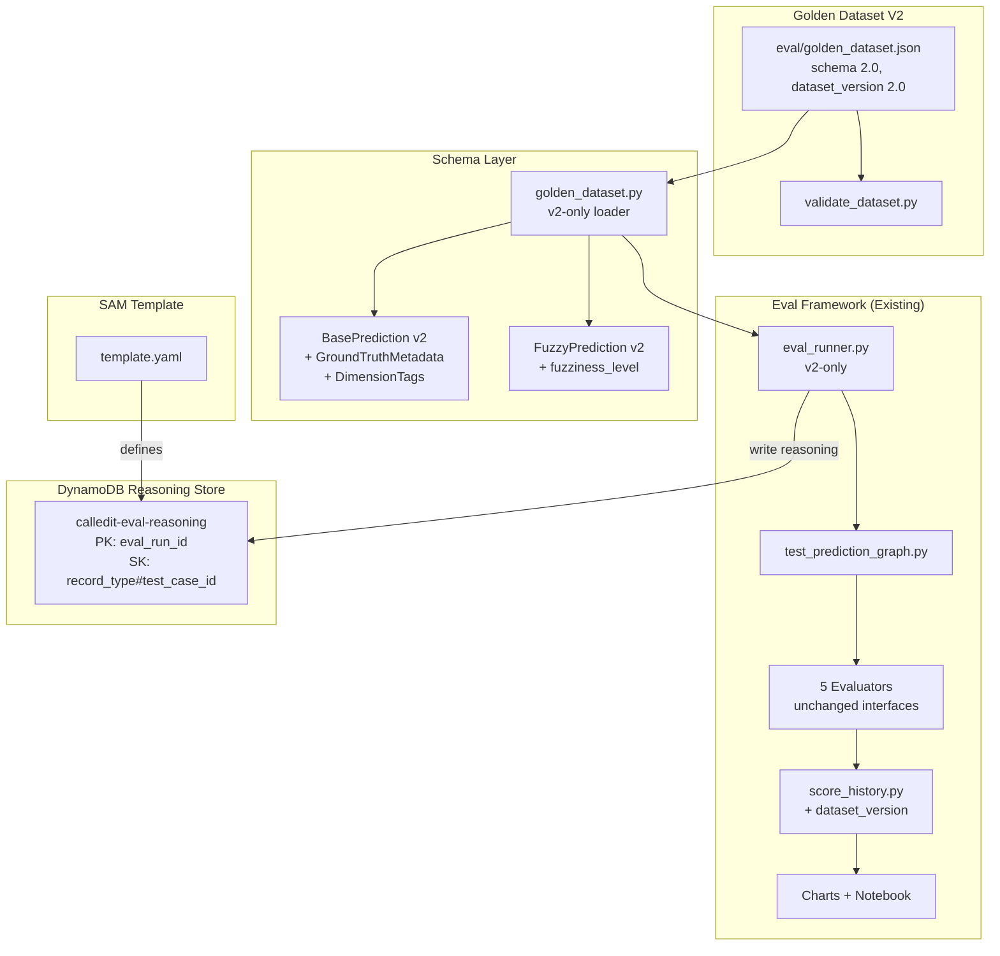
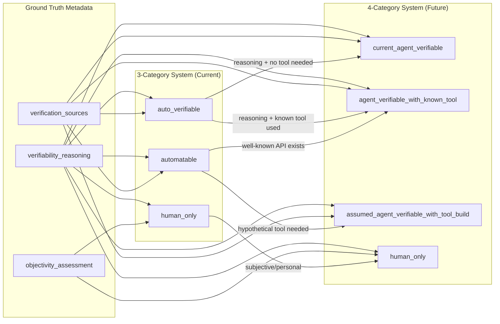

# Design Document: Golden Dataset V2

## Overview

This design describes the expansion of the CalledIt golden dataset from 15 base + 5 fuzzy predictions (v1.0) to ~40-50 base + 20-30 fuzzy predictions (v2.0) with rich ground truth metadata per prediction. The core insight: each prediction captures *why* it has its expected category through structured metadata (verifiability reasoning, date derivation, verification sources, objectivity assessment, criteria, steps), so labels can be re-derived when verification categories evolve — rather than manually re-tagging 50+ test cases.

The design covers six components:

1. **V2 Schema** — Rewritten `golden_dataset.py` dataclasses with ground truth metadata, fuzziness levels, dimension matrix tags, and `dataset_version` field. Clean v2-only loader (no v1 backward compatibility — fresh foundation).
2. **Persona-Driven Dataset Content** — ~100 raw candidates from 18 personas, cross-section selected to 40-50 base predictions across a 5-dimension matrix (domain, stakes, time horizon, category, fuzziness potential), plus 20-30 fuzzy variants at fuzziness levels 0-3.
3. **Validation Script** — Standalone `validate_dataset.py` that checks structural constraints, ground truth coherence, ID uniqueness, cross-references, and field completeness.
4. **DynamoDB Eval Reasoning Store** — New DDB table (`calledit-eval-reasoning`) added to the existing SAM template for capturing full model reasoning traces during eval runs.
5. **Eval Runner V2 Integration** — Updates to `eval_runner.py` and `score_history.py` to handle v2 schema, write reasoning to DDB, and include `dataset_version` in reports.
6. **Category Re-derivation Support** — Design for how ground truth metadata enables re-deriving labels under a future 4-category system.

The system replaces the v1 dataset entirely — a clean break for a stronger foundation. The v1 score history remains in git as a historical record; v2 starts a new baseline. The eval framework (evaluators, score history, chart generation) is updated to work with the v2 schema only.

## Architecture

### System Architecture



### Category Re-derivation Flow

When categories evolve from 3 (auto_verifiable, automatable, human_only) to 4 (current_agent_verifiable, agent_verifiable_with_known_tool, assumed_agent_verifiable_with_tool_build, human_only), the ground truth metadata enables re-derivation:



**Re-derivation example**: A prediction like "Bitcoin hits $150k by December" has ground truth metadata:
- `verifiability_reasoning`: "Cryptocurrency price data is publicly available through well-known APIs (CoinGecko, CoinMarketCap), but no price API tool is currently registered"
- `verification_sources`: ["cryptocurrency_price_api", "CoinGecko", "CoinMarketCap"]
- `objectivity_assessment`: "objective"

Under the 3-category system → `automatable` (tool could exist but doesn't).
Under the 4-category system → `agent_verifiable_with_known_tool` (the API is well-known and documented, an agent could find and use it).

Compare with "My soufflé won't fall" where:
- `verifiability_reasoning`: "Soufflé outcome requires real-time physical observation in a specific kitchen — no sensor or API can determine this"
- `verification_sources`: ["direct_physical_observation"]
- `objectivity_assessment`: "subjective"

Under both systems → `human_only`.

## Components and Interfaces

### Component 1: V2 Schema (`golden_dataset.py`)

The existing `golden_dataset.py` is rewritten with new dataclasses and a v2-only loader. No backward compatibility with v1 — this is a clean break for a stronger foundation. The v1 dataset file is archived and the loader only supports `schema_version: "2.0"`.

```python
# New dataclasses added to golden_dataset.py

@dataclass
class GroundTruthMetadata:
    """WHY a prediction has its expected category — the stable foundation."""
    verifiability_reasoning: str      # Why this category
    date_derivation: str              # How verification date is determined
    verification_sources: List[str]   # Data sources needed
    objectivity_assessment: str       # "objective", "subjective", "mixed"
    verification_criteria: List[str]  # Measurable conditions
    verification_steps: List[str]     # Ordered actions to verify

VALID_OBJECTIVITY = {"objective", "subjective", "mixed"}

@dataclass
class DimensionTags:
    """5-axis classification for cross-section coverage analysis."""
    domain: str          # weather, sports, finance, personal, health, tech, etc.
    stakes: str          # life-changing, significant, moderate, trivial
    time_horizon: str    # minutes-to-hours, days, weeks-to-months, months-to-years
    persona: str         # parent, commuter, investor, etc.

VALID_STAKES = {"life-changing", "significant", "moderate", "trivial"}
VALID_TIME_HORIZONS = {"minutes-to-hours", "days", "weeks-to-months", "months-to-years"}
```

**BasePrediction v2** replaces v1 with:
- `ground_truth: GroundTruthMetadata` — required for all v2 predictions
- `dimension_tags: DimensionTags` — required for all v2 predictions
- `is_boundary_case: bool` — defaults to False
- `boundary_description: Optional[str]` — explains the boundary condition

**FuzzyPrediction v2** replaces v1 with:
- `fuzziness_level: int` — 0, 1, 2, or 3 (required)

**GoldenDataset v2** replaces v1 with:
- `dataset_version: str` — content revision (e.g., "2.0"), required
- `metadata: Optional[DatasetMetadata]` — expected counts for integrity checking

```python
@dataclass
class DatasetMetadata:
    """Optional metadata for integrity checking."""
    expected_base_count: Optional[int] = None
    expected_fuzzy_count: Optional[int] = None
```

**V2-only loader**: The `load_golden_dataset()` function only supports `schema_version: "2.0"`. Loading a v1 dataset raises a `ValueError` directing the user to migrate.

```python
SUPPORTED_SCHEMA_VERSION = "2.0"

def load_golden_dataset(path: str = "eval/golden_dataset.json") -> GoldenDataset:
    """Load and validate golden dataset. Only supports schema version 2.0."""
    with open(path, "r") as f:
        data = json.load(f)
    
    version = data.get("schema_version")
    if version != SUPPORTED_SCHEMA_VERSION:
        raise ValueError(f"Unsupported schema version '{version}', "
                         f"expected '{SUPPORTED_SCHEMA_VERSION}'. "
                         f"V1 datasets must be migrated to v2 schema.")
    
    return _load_v2(data)
```

### Component 2: Validation Script (`validate_dataset.py`)

A standalone script in `eval/validate_dataset.py` that performs comprehensive validation. Designed to run in CI or pre-commit.

```python
# eval/validate_dataset.py

def validate_dataset(path: str = "eval/golden_dataset.json") -> List[str]:
    """Validate all structural constraints and return list of errors.
    
    Checks:
    1. Structural: required fields, types, valid enum values
    2. Referential: fuzzy base_prediction_id references resolve
    3. Uniqueness: no duplicate IDs, no base/fuzzy ID collisions
    4. Ground truth coherence: sources support criteria, criteria align
       with objectivity_assessment, reasoning references sources
    5. Coverage: category distribution, dimension matrix coverage
    6. Count integrity: actual counts match metadata expected counts
    7. Dataset version: present and non-empty
    
    Returns:
        List of error strings. Empty list = valid.
    """
    ...

def validate_ground_truth_coherence(gt: dict) -> List[str]:
    """Check that ground truth metadata tells a coherent story.
    
    - verification_sources is non-empty
    - verification_criteria is non-empty
    - verification_steps is non-empty
    - objectivity_assessment is valid
    - If objectivity is "subjective", sources should include personal/human observation
    - If objectivity is "objective", sources should reference data/APIs/tools
    """
    ...

def validate_coverage(dataset: dict) -> List[str]:
    """Check dimension matrix coverage meets requirements.
    
    - At least 12 per category
    - At least 3 per stakes level
    - At least 3 per time horizon
    - At least 8 domains
    - At least 12 personas
    - At least 5 boundary cases
    - Fuzzy: at least 3 at level 0, 5 at levels 1/2/3
    """
    ...
```

**Exit codes**: 0 = valid, 1 = errors found. Prints errors to stderr, summary to stdout.

### Component 3: DynamoDB Eval Reasoning Store

A new DynamoDB table added to `backend/calledit-backend/template.yaml` following existing patterns.

**Table design**:
- Table name: `calledit-eval-reasoning`
- Partition key: `eval_run_id` (S) — UUID generated per eval run
- Sort key: `record_type#test_case_id` (S) — enables querying by record type
- Billing: PAY_PER_REQUEST (on-demand, matches eval usage pattern)
- TTL: `ttl` attribute, set to 90 days from creation (eval data is ephemeral)

**Record types**:
- `run_metadata#SUMMARY` — overall run info (timestamp, manifest, dataset_version, pass rate, duration)
- `agent_output#base-001` — full text output from all 4 agents for a test case
- `judge_reasoning#base-001` — judge model reasoning, score, model ID for a test case
- `token_counts#base-001` — input/output tokens per agent and judge invocation

```yaml
# Added to template.yaml Resources section
EvalReasoningTable:
  Type: AWS::DynamoDB::Table
  Properties:
    TableName: calledit-eval-reasoning
    BillingMode: PAY_PER_REQUEST
    AttributeDefinitions:
      - AttributeName: eval_run_id
        AttributeType: S
      - AttributeName: record_key
        AttributeType: S
    KeySchema:
      - AttributeName: eval_run_id
        KeyType: HASH
      - AttributeName: record_key
        KeyType: RANGE
    TimeToLiveSpecification:
      AttributeName: ttl
      Enabled: true
    PointInTimeRecoverySpecification:
      PointInTimeRecoveryEnabled: true
    SSESpecification:
      SSEEnabled: true
```

**Write client** (`eval_reasoning_store.py`):

```python
# eval_reasoning_store.py — new module

import boto3
import uuid
import time
import logging
from typing import Dict, Any, Optional

logger = logging.getLogger(__name__)

TABLE_NAME = "calledit-eval-reasoning"
TTL_DAYS = 90

class EvalReasoningStore:
    """Write eval reasoning traces to DynamoDB. Fire-and-forget on failure."""
    
    def __init__(self, table_name: str = TABLE_NAME):
        self.table_name = table_name
        self.eval_run_id = str(uuid.uuid4())
        try:
            self._table = boto3.resource("dynamodb").Table(table_name)
        except Exception as e:
            logger.warning(f"DynamoDB unavailable, reasoning store disabled: {e}")
            self._table = None
    
    def write_run_metadata(self, manifest: dict, dataset_version: str,
                           total_tests: int, pass_rate: float, duration_s: float):
        """Write overall run metadata."""
        ...
    
    def write_agent_outputs(self, test_case_id: str, agent_outputs: Dict[str, str]):
        """Write full text outputs from all 4 agents for a test case."""
        ...
    
    def write_judge_reasoning(self, test_case_id: str, agent_name: str,
                              score: float, reasoning: str, judge_model: str):
        """Write judge reasoning for a specific agent evaluation."""
        ...
    
    def write_token_counts(self, test_case_id: str, counts: Dict[str, Dict[str, int]]):
        """Write token counts per agent. counts = {agent: {input: N, output: N}}"""
        ...
    
    def _put_item(self, record_key: str, data: dict):
        """Fire-and-forget DDB write. Logs warning on failure."""
        if not self._table:
            return
        try:
            item = {
                "eval_run_id": self.eval_run_id,
                "record_key": record_key,
                "ttl": int(time.time()) + (TTL_DAYS * 86400),
                **data,
            }
            self._table.put_item(Item=item)
        except Exception as e:
            logger.warning(f"DDB write failed for {record_key}: {e}")
```

### Component 4: Eval Runner V2 Integration

Updates to `eval_runner.py`:

1. **Dataset version in reports**: The report dict includes `dataset_version` alongside `schema_version` and `prompt_version_manifest`.

2. **Reasoning store writes**: The eval runner creates an `EvalReasoningStore` instance per run and writes agent outputs, judge reasoning, and token counts as test cases execute. Failures are logged and ignored (Requirement 6.6).

3. **Fuzziness level 0 handling**: For fuzzy predictions with `fuzziness_level == 0`, the eval runner still executes round 1 but expects the ClarificationQuality evaluator to score high (no clarification needed = empty reviewable_sections = score 1.0).

Updates to `score_history.py`:

1. **Dataset version tracking**: Each score history entry includes `dataset_version`.
2. **Cross-version comparison warning**: When `compare_latest()` detects different `dataset_version` values between runs, it includes a `dataset_version_mismatch: true` flag and a warning message.
3. **ID-matched deltas**: When dataset versions differ, per-test-case deltas are computed only for test cases present in both runs (matched by ID).

### Component 5: Dataset Content Structure

The v2 JSON structure for a base prediction:

```json
{
  "id": "base-020",
  "prediction_text": "Bitcoin will exceed $150,000 USD by December 31, 2026",
  "difficulty": "medium",
  "dimension_tags": {
    "domain": "finance",
    "stakes": "significant",
    "time_horizon": "months-to-years",
    "persona": "investor"
  },
  "is_boundary_case": false,
  "ground_truth": {
    "verifiability_reasoning": "Cryptocurrency price data is publicly available through well-known APIs (CoinGecko, CoinMarketCap). No price API tool is currently registered in the tool manifest, so this requires a tool that could plausibly be built.",
    "date_derivation": "Explicit date: December 31, 2026 stated directly in prediction text.",
    "verification_sources": ["cryptocurrency_price_api", "CoinGecko", "CoinMarketCap"],
    "objectivity_assessment": "objective",
    "verification_criteria": ["BTC/USD spot price exceeds $150,000 at any point before Dec 31 2026 23:59 UTC"],
    "verification_steps": [
      "Query cryptocurrency price API for BTC/USD price",
      "Compare price against $150,000 threshold",
      "Check if date is before December 31, 2026 deadline"
    ]
  },
  "tool_manifest_config": {"tools": []},
  "expected_per_agent_outputs": {
    "categorizer": {"expected_category": "automatable"}
  },
  "evaluation_rubric": "Categorizer reasoning should explain that price data exists publicly but no tool is registered. Should NOT classify as auto_verifiable without a price API tool."
}
```

The v2 JSON structure for a fuzzy prediction:

```json
{
  "id": "fuzzy-020",
  "fuzzy_text": "The crypto thing will moon soon",
  "base_prediction_id": "base-020",
  "fuzziness_level": 3,
  "simulated_clarifications": ["I mean Bitcoin will exceed $150,000 USD by December 31, 2026"],
  "expected_clarification_topics": ["cryptocurrency", "price_target", "timeframe"],
  "expected_post_clarification_outputs": {
    "categorizer": {"expected_category": "automatable"}
  },
  "evaluation_rubric": "Round 1 should ask about which crypto, price target, and timeframe. After clarification should converge to automatable."
}
```

**Key simplification from v1**: Only `expected_category` is required in expected outputs. Parser, VB, and review outputs are optional rubric guidance. This makes maintaining 50+ predictions practical.

### Component 6: Serialization (`dataset_to_dict`)

The existing `dataset_to_dict()` function is rewritten to serialize v2 fields. All fields are always present since we only support v2.

```python
def dataset_to_dict(dataset: GoldenDataset) -> dict:
    """Serialize GoldenDataset to JSON-compatible dict. V2 only."""
    result = {
        "schema_version": dataset.schema_version,
        "dataset_version": dataset.dataset_version,
        "base_predictions": [_serialize_base(bp) for bp in dataset.base_predictions],
        "fuzzy_predictions": [_serialize_fuzzy(fp) for fp in dataset.fuzzy_predictions],
    }
    if dataset.metadata:
        result["metadata"] = {
            "expected_base_count": dataset.metadata.expected_base_count,
            "expected_fuzzy_count": dataset.metadata.expected_fuzzy_count,
        }
    return result
```

## Data Models

### V2 Golden Dataset JSON Schema (Top Level)

```json
{
  "schema_version": "2.0",
  "dataset_version": "2.0",
  "metadata": {
    "expected_base_count": 45,
    "expected_fuzzy_count": 25
  },
  "base_predictions": [ "..." ],
  "fuzzy_predictions": [ "..." ]
}
```

### GroundTruthMetadata Schema

```json
{
  "verifiability_reasoning": "string — why this category",
  "date_derivation": "string — how verification date is determined",
  "verification_sources": ["string — data sources needed"],
  "objectivity_assessment": "objective | subjective | mixed",
  "verification_criteria": ["string — measurable conditions"],
  "verification_steps": ["string — ordered verification actions"]
}
```

### DimensionTags Schema

```json
{
  "domain": "string — weather, sports, finance, personal, health, tech, social, work, food, travel, entertainment, nature, politics",
  "stakes": "string — life-changing, significant, moderate, trivial",
  "time_horizon": "string — minutes-to-hours, days, weeks-to-months, months-to-years",
  "persona": "string — parent, commuter, investor, etc."
}
```

### EvalReasoningStore DynamoDB Item Schemas

**Run metadata** (`record_key = "run_metadata#SUMMARY"`):
```json
{
  "eval_run_id": "uuid",
  "record_key": "run_metadata#SUMMARY",
  "timestamp": "ISO8601",
  "prompt_version_manifest": {"parser": "3", "categorizer": "5", "vb": "2", "review": "4"},
  "dataset_version": "2.0",
  "schema_version": "2.0",
  "total_tests": 45,
  "pass_rate": 0.82,
  "duration_s": 340.5,
  "ttl": 1726000000
}
```

**Agent outputs** (`record_key = "agent_output#base-001"`):
```json
{
  "eval_run_id": "uuid",
  "record_key": "agent_output#base-001",
  "parser_output": "full text from parser agent",
  "categorizer_output": "full text from categorizer agent",
  "verification_builder_output": "full text from VB agent",
  "review_output": "full text from review agent",
  "ttl": 1726000000
}
```

**Judge reasoning** (`record_key = "judge_reasoning#base-001#categorizer"`):
```json
{
  "eval_run_id": "uuid",
  "record_key": "judge_reasoning#base-001#categorizer",
  "agent_name": "categorizer",
  "score": 0.85,
  "judge_reasoning": "The categorizer correctly identified...",
  "judge_model": "us.anthropic.claude-opus-4-6-v1",
  "ttl": 1726000000
}
```

**Token counts** (`record_key = "token_counts#base-001"`):
```json
{
  "eval_run_id": "uuid",
  "record_key": "token_counts#base-001",
  "parser": {"input_tokens": 1200, "output_tokens": 350},
  "categorizer": {"input_tokens": 1500, "output_tokens": 280},
  "verification_builder": {"input_tokens": 1800, "output_tokens": 450},
  "review": {"input_tokens": 2000, "output_tokens": 600},
  "ttl": 1726000000
}
```

### Evaluation Report V2 Schema

Extended from v1 with `dataset_version` and `schema_version`:

```json
{
  "timestamp": "2026-03-15T10:30:00Z",
  "schema_version": "2.0",
  "dataset_version": "2.0",
  "prompt_version_manifest": {"parser": "3", "categorizer": "5", "vb": "2", "review": "4"},
  "eval_run_id": "uuid — links to DDB reasoning store",
  "per_test_case_scores": ["..."],
  "per_agent_aggregates": {"..."},
  "per_category_accuracy": {"..."},
  "overall_pass_rate": 0.82,
  "total_tests": 45,
  "passed": 37,
  "failed": 8
}
```

### Score History V2 Entry

Extended with `dataset_version`:

```json
{
  "timestamp": "2026-03-15T10:30:00Z",
  "dataset_version": "2.0",
  "prompt_version_manifest": {"..."},
  "per_agent_aggregates": {"..."},
  "per_category_accuracy": {"..."},
  "overall_pass_rate": 0.82,
  "total_tests": 45,
  "passed": 37
}
```


## Correctness Properties

*A property is a characteristic or behavior that should hold true across all valid executions of a system — essentially, a formal statement about what the system should do. Properties serve as the bridge between human-readable specifications and machine-verifiable correctness guarantees.*

### Property 1: V2 base prediction ground truth completeness

*For any* v2 base prediction with ground truth metadata, all six ground truth fields must be present and correctly typed: `verifiability_reasoning` (non-empty string), `date_derivation` (non-empty string), `verification_sources` (non-empty list of strings), `objectivity_assessment` (one of "objective", "subjective", "mixed"), `verification_criteria` (non-empty list of strings), and `verification_steps` (non-empty list of strings). Additionally, if `is_boundary_case` is True, `boundary_description` must be a non-empty string.

**Validates: Requirements 1.1, 1.2, 1.3, 1.4, 1.5, 1.6, 4.1, 4.4, 5.4**

### Property 2: V2 fuzzy prediction structural validity

*For any* v2 fuzzy prediction, `fuzziness_level` must be an integer in {0, 1, 2, 3}, `simulated_clarifications` must be a non-empty list of strings, `expected_clarification_topics` must be a non-empty list of strings, `base_prediction_id` must reference an existing base prediction, and `expected_post_clarification_outputs` must contain a valid `expected_category` from {auto_verifiable, automatable, human_only}.

**Validates: Requirements 3.2, 3.5, 3.7, 4.4**

### Property 3: Reasoning store fire-and-forget resilience

*For any* DynamoDB write failure (connection error, throttle, validation error), the `EvalReasoningStore` must log a warning and return without raising an exception, so that the eval runner continues executing remaining test cases and still produces a local score history file.

**Validates: Requirements 6.6**

### Property 4: Reasoning store item completeness

*For any* test case execution with agent outputs (4 non-empty strings), token counts (4 agent entries with input/output integers), and optional judge reasoning (score float, reasoning string, model ID string), the `EvalReasoningStore` must produce DynamoDB items containing all provided fields with correct types and a valid TTL timestamp in the future.

**Validates: Requirements 6.1, 6.2, 6.3, 6.4**

### Property 5: Unsupported schema version rejection

*For any* schema version string that is not `"2.0"`, calling `load_golden_dataset()` on a JSON file with that version must raise a `ValueError` whose message contains both the unsupported version string and the expected version `"2.0"`.

**Validates: Requirements 7.2**

### Property 6: Dataset version propagation

*For any* valid v2 golden dataset with a `dataset_version` field, loading the dataset, running an evaluation, generating a report, and appending to score history must result in the `dataset_version` value appearing identically in: (a) the loaded `GoldenDataset` object, (b) the evaluation report dict, and (c) the score history entry.

**Validates: Requirements 7.1, 7.3, 7.4**

### Property 7: Validation script catches structural violations

*For any* golden dataset JSON with exactly one structural violation (missing required field, invalid enum value, duplicate ID, fuzzy referencing non-existent base ID, or count mismatch with metadata), the validation script must return a non-empty list of errors that includes a message identifying the specific violation.

**Validates: Requirements 8.1, 8.2, 8.4, 9.2**

### Property 8: Round-trip serialization

*For any* valid v2 `GoldenDataset` object, serializing to a dict via `dataset_to_dict()`, converting to JSON, parsing back, and loading via `load_golden_dataset()` must produce an equivalent dataset: same `schema_version`, same `dataset_version`, same number of base and fuzzy predictions, and identical field values for all predictions.

**Validates: Requirements 9.1**

### Property 9: Count integrity check

*For any* golden dataset JSON where `metadata.expected_base_count` or `metadata.expected_fuzzy_count` is present and does not match the actual count of base or fuzzy predictions, the loader must raise a `ValueError` identifying the count mismatch.

**Validates: Requirements 9.3**

### Property 10: Score history cross-version warning

*For any* two consecutive score history entries where `dataset_version` differs, `compare_latest()` must return a result containing `dataset_version_mismatch: True` and a warning message that includes both version strings.

**Validates: Requirements 7.4**

### Property 11: Fuzzy variants with same base have distinct fuzziness levels

*For any* set of fuzzy predictions in a v2 dataset that share the same `base_prediction_id`, each fuzzy prediction in the set must have a distinct `fuzziness_level` value — no two fuzzy variants of the same base prediction may have the same fuzziness level.

**Validates: Requirements 3.7**

## Error Handling

### Schema Loading Errors

| Error Condition | Behavior | Severity |
|---|---|---|
| Unsupported `schema_version` | `ValueError` with expected version "2.0" | FATAL — cannot proceed |
| Missing required field (v2 base prediction) | `ValueError` identifying prediction ID and field | FATAL — dataset invalid |
| Invalid `objectivity_assessment` enum | `ValueError` with valid values | FATAL — dataset invalid |
| Invalid `expected_category` enum | `ValueError` with valid values | FATAL — dataset invalid |
| Fuzzy `base_prediction_id` not found | `ValueError` identifying the dangling reference | FATAL — dataset invalid |
| Count mismatch with metadata | `ValueError` with expected vs actual counts | FATAL — possible corruption |
| Duplicate prediction IDs | `ValueError` listing duplicates | FATAL — dataset invalid |
| Missing `dataset_version` in v2 | `ValueError` — required for v2 schema | FATAL — dataset invalid |
| Extra/unrecognized fields | Silently ignored — forward compatibility | INFO — logged |

### DynamoDB Reasoning Store Errors

| Error Condition | Behavior | Severity |
|---|---|---|
| DynamoDB table not found | Log WARNING, disable store for run | WARN — eval continues |
| DynamoDB write throttled | Log WARNING, skip item | WARN — eval continues |
| DynamoDB connection error | Log WARNING, disable store for run | WARN — eval continues |
| Malformed item (serialization error) | Log WARNING, skip item | WARN — eval continues |

The reasoning store follows a strict fire-and-forget pattern. No DynamoDB failure can block or abort an evaluation run. The local score history file (`eval/score_history.json`) is always written regardless of DDB status.

### Validation Script Errors

The validation script collects all errors rather than failing on the first one. This gives the developer a complete picture of what needs fixing. Errors are categorized:

- **STRUCTURAL**: Missing fields, wrong types, invalid enums
- **REFERENTIAL**: Dangling base_prediction_id references
- **UNIQUENESS**: Duplicate IDs, base/fuzzy namespace collisions
- **COVERAGE**: Insufficient category/domain/stakes/horizon distribution
- **COHERENCE**: Ground truth metadata inconsistencies
- **INTEGRITY**: Count mismatches with metadata

### V1 Dataset Handling

The v1 dataset (`eval/golden_dataset.json` with `schema_version: "1.0"`) is archived to `eval/golden_dataset_v1_archived.json`. The v2 loader rejects v1 schemas with a clear error message. The v1 score history entries remain in `eval/score_history.json` as historical record — the score history comparison will flag `dataset_version_mismatch` when comparing across the boundary.

## Testing Strategy

### Dual Testing Approach

This feature uses both unit tests and property-based tests. Unit tests cover specific examples, edge cases, and integration points. Property-based tests verify universal properties across randomly generated inputs.

### Property-Based Testing

**Library**: [Hypothesis](https://hypothesis.readthedocs.io/) (Python, already in project dependencies)

**Configuration**: Each property test runs a minimum of 100 iterations via `@settings(max_examples=100)`.

**Tag format**: Each test is tagged with a comment referencing the design property:
```python
# Feature: golden-dataset-v2, Property N: [property description]
```

**Property test implementations**:

| Property | Test Strategy | Generator |
|---|---|---|
| P1: Ground truth completeness | Generate random GroundTruthMetadata dicts with valid/invalid fields, validate | `st.fixed_dictionaries` with ground truth fields |
| P2: Fuzzy structural validity | Generate random FuzzyPrediction dicts, validate required fields | `st.fixed_dictionaries` with fuzzy fields |
| P3: Reasoning store resilience | Generate random exceptions, verify store catches and logs | `st.sampled_from` exception types |
| P4: Reasoning store item completeness | Generate random agent outputs and token counts, verify item structure | `st.dictionaries` with agent name keys |
| P5: Unsupported schema version | Generate random version strings not equal to "2.0", verify ValueError | `st.text().filter(lambda x: x != "2.0")` |
| P6: Dataset version propagation | Generate random version strings, trace through load→report→history | `st.from_regex(r"[0-9]+\.[0-9]+")` |
| P7: Validation catches violations | Generate valid datasets then inject one violation, verify detection | Custom strategy with mutation |
| P8: Round-trip serialization | Generate random valid GoldenDataset objects, serialize and reload | Composite strategy building full datasets |
| P9: Count integrity check | Generate datasets with mismatched metadata counts, verify ValueError | `st.integers` for count mismatches |
| P10: Score history cross-version warning | Generate pairs of history entries with different dataset_versions | `st.tuples` of version strings |
| P11: Distinct fuzziness levels | Generate fuzzy sets sharing base_prediction_id, verify distinct levels | `st.lists` of fuzziness levels |
| P12: Evaluator output format stability | Generate v1 and v2 test case data, verify evaluator output format | Reuse existing evaluator test generators |

### Unit Tests

Unit tests focus on specific examples and edge cases that complement the property tests:

- **V1 rejection**: Attempt to load the archived v1 dataset through the v2 loader, verify `ValueError` with clear migration message
- **Actual dataset validation**: Run the validation script against the real v2 dataset file, verify zero errors
- **Coverage checks**: Verify the actual dataset meets all Requirement 2 and 3 coverage thresholds (these are example tests on the real data, not properties)
- **Boundary case examples**: Verify specific boundary cases have correct ground truth metadata
- **Fuzziness level 0 control cases**: Verify level-0 fuzzy predictions have empty expected_clarification_topics or topics that should NOT trigger clarification
- **DDB item format**: Verify specific item structures match the documented schemas
- **SAM template validation**: Verify the EvalReasoningTable resource exists with correct key schema

### Test File Organization

```
tests/
  strands_make_call/
    test_golden_dataset_v2.py          # Schema, loader, serialization tests
    test_validate_dataset.py           # Validation script tests
    test_eval_reasoning_store.py       # DDB store tests (mocked)
    test_eval_runner_v2.py             # Eval runner v2 integration tests
    test_score_history_v2.py           # Score history dataset_version tests
```
