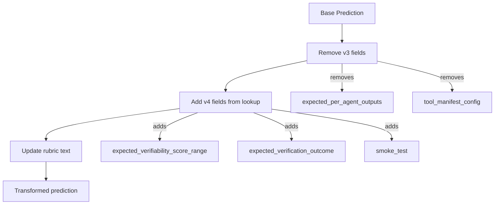

# Design Document: Golden Dataset V4 Reshape

## Overview

This design covers the transformation of the v3 golden dataset (`eval/golden_dataset.json`) into a v4-native format. The v3 dataset was built around a 4-agent serial graph with 3-category routing (`auto_verifiable`/`automatable`/`human_only`). V4 uses a single 3-turn creation agent producing `ParsedClaim`, `VerificationPlan`, and `PlanReview` Pydantic models with continuous verifiability scoring (0.0–1.0).

Two Python scripts are produced:
- `eval/reshape_v4.py` — reads the v3 dataset, applies all field transformations, writes the v4 dataset back to the same file
- `eval/validate_v4.py` — loads the reshaped dataset and verifies structural correctness against all v4 schema rules

Both scripts are standalone, idempotent, and use the project venv at `/home/wsluser/projects/calledit/venv/bin/python`.

### Design Decisions

1. **Overwrite in place**: The reshape script writes back to `eval/golden_dataset.json` rather than creating a separate v4 file. This avoids confusion about which file is canonical. Idempotency ensures re-running is safe.

2. **Hardcoded score ranges and outcomes**: The reshape script contains a lookup table mapping each `base-XXX` id to its `expected_verifiability_score_range` and `expected_verification_outcome`. These values require human judgment about each prediction's characteristics and cannot be derived algorithmically from v3 fields alone. The lookup table serves as auditable ground truth.

3. **Hardcoded smoke test selection**: The 12 smoke test cases are selected by hand to satisfy all constraints (4 easy + 5 medium + 3 hard, all 12 domains, boundary case coverage, etc.). This is a lookup set in the reshape script.

4. **Rubric text replacement via string substitution**: Evaluation rubric updates use simple `str.replace()` calls for known v3 terms. The v3 terms ("Categorizer", "VB", "auto_verifiable", etc.) are distinctive enough to avoid false positives in free-form rubric text.

5. **Fuzzy prediction category-to-tier mapping**: The `expected_post_clarification_outputs` field is replaced with `expected_post_clarification_verifiability` using a direct mapping: `auto_verifiable` → `"high"`, `automatable` → `"moderate"`, `human_only` → `"low"`.

## Architecture

The system consists of two independent scripts with no shared code beyond the Python standard library.

```mermaid
flowchart LR
    subgraph Reshape["eval/reshape_v4.py"]
        R1[Load v3 JSON] --> R2[Transform base predictions]
        R2 --> R3[Transform fuzzy predictions]
        R3 --> R4[Update metadata & versions]
        R4 --> R5[Write v4 JSON]
    end

    subgraph Validate["eval/validate_v4.py"]
        V1[Load JSON] --> V2[Check top-level fields]
        V2 --> V3[Check each base prediction]
        V3 --> V4[Check each fuzzy prediction]
        V4 --> V5[Check metadata counts]
        V5 --> V6[Check smoke test constraints]
        V6 --> V7[Print summary & exit code]
    end

    R5 -.->|golden_dataset.json| V1
```



### Reshape Pipeline (per base prediction)



## Components and Interfaces

### eval/reshape_v4.py

**Responsibilities:**
- Read `eval/golden_dataset.json`
- For each base prediction: remove v3 fields, add v4 fields from lookup tables, update rubric text
- For each fuzzy prediction: replace `expected_post_clarification_outputs` with `expected_post_clarification_verifiability`
- Update `schema_version` and `dataset_version` to `"4.0"`
- Update metadata counts (base, fuzzy, smoke test)
- Write the result back to `eval/golden_dataset.json` with 2-space indentation
- Print a transformation summary

**Key functions:**
- `reshape()` — main entry point, orchestrates the full pipeline
- `transform_base_prediction(pred: dict) -> dict` — applies all base prediction transformations
- `transform_fuzzy_prediction(pred: dict) -> dict` — applies fuzzy prediction transformations
- `update_rubric(text: str) -> str` — performs v3→v4 text substitutions on rubric strings

**Lookup tables (module-level constants):**
- `SCORE_RANGES: dict[str, list[float]]` — maps prediction id → `[low, high]`
- `VERIFICATION_OUTCOMES: dict[str, str | None]` — maps prediction id → outcome
- `SMOKE_TEST_IDS: set[str]` — set of prediction ids flagged for smoke testing
- `CATEGORY_TO_TIER: dict[str, str]` — maps v3 category → v4 tier name

### eval/validate_v4.py

**Responsibilities:**
- Load `eval/golden_dataset.json` and parse as JSON
- Run all structural checks, collecting violations
- Print per-check pass/fail status with specific violation details (prediction id + field name)
- Exit 0 if all pass, non-zero if any fail

**Key functions:**
- `validate(path: str) -> list[str]` — main entry point, returns list of violation strings
- `check_base_prediction(pred: dict) -> list[str]` — validates one base prediction
- `check_fuzzy_prediction(pred: dict, valid_base_ids: set[str]) -> list[str]` — validates one fuzzy prediction
- `check_metadata(data: dict) -> list[str]` — validates metadata counts
- `check_smoke_test_constraints(preds: list[dict]) -> list[str]` — validates smoke test subset constraints

### Score Range Assignment Table

Based on the v3 category mapping and individual prediction review:

| Category (v3) | Count | Default Score Range | Rationale |
|---|---|---|---|
| `auto_verifiable` | 14 | [0.7, 1.0] | Objective, public data, accessible via Browser tool |
| `automatable` | 14 | [0.4, 0.7] | Data exists but may need specific tools or timing |
| `human_only` | 17 | [0.0, 0.4] | Subjective, requires physical observation, or private data |

Individual overrides where the default doesn't fit:
- `base-013` (Wikipedia references >500) — `auto_verifiable` but requires page parsing → [0.6, 0.9]
- `base-006` (USGS earthquake 5.0+) — `auto_verifiable` but 30-day window adds complexity → [0.6, 0.9]
- `base-042` ("nice out this weekend") — boundary case, subjective framing on weather → [0.1, 0.3]
- `base-043` (restaurant 4 stars) — boundary case, needs personal context → [0.1, 0.3]
- `base-044` (Fitbit 10k steps) — boundary case, private but objective data → [0.3, 0.5]

### Verification Outcome Assignment Logic

| Condition | Outcome | Examples |
|---|---|---|
| `verification_readiness: immediate` + objective | `"confirmed"` or `"refuted"` (per prediction) | base-001 (sunrise → confirmed), base-002 (Christmas Friday → confirmed) |
| Future event, not yet verifiable | `null` | base-014 (Bitcoin by Dec 2026), base-016 (iPhone Sept 2026) |
| Subjective prediction | `null` | base-027 (enjoy movie), base-030 (feel happy) |
| Private data, no access | `null` | base-022 (Amazon package), base-044 (Fitbit steps) |

### Smoke Test Selection (12 cases)

Selected to satisfy all constraints from Requirement 4:

| ID | Prediction | Domain | Difficulty | Boundary | Immediate | Objectivity |
|---|---|---|---|---|---|---|
| base-002 | Christmas 2026 Friday | personal | easy | no | yes | objective |
| base-008 | Tokyo temp >10°C | weather | easy | no | yes | objective |
| base-027 | Enjoy movie tonight | entertainment | easy | no | no | subjective |
| base-034 | Dinner will taste good | food | easy | no | no | subjective |
| base-004 | S&P 500 higher today | finance | medium | no | no | objective |
| base-007 | Yankees game after 6pm | sports | medium | no | yes | objective |
| base-011 | Python 3.13 released | tech | medium | no | yes | objective |
| base-015 | Flight AA1234 on time | travel | medium | no | no | objective |
| base-033 | Get promotion this quarter | work | medium | no | no | subjective |
| base-006 | USGS earthquake 5.0+ | nature | hard | no | no | objective |
| base-023 | DMV wait <30 min | social | hard | no | no | objective |
| base-044 | Fitbit 10k steps | health | hard | yes | no | objective |

**Constraint verification:**
- Count: 12 ✓
- Difficulty: 4 easy (base-002, base-008, base-027, base-034) + 5 medium (base-004, base-007, base-011, base-015, base-033) + 3 hard (base-006, base-023, base-044) ✓
- Domains: personal, weather, entertainment, food, finance, sports, tech, travel, work, nature, social, health = all 12 ✓
- Boundary cases: base-044 ✓
- Immediate verification: base-002, base-008, base-007, base-011 ✓
- Subjective: base-027, base-034, base-033 ✓
- Objective: base-002, base-008, base-004, base-007, base-011, base-015, base-006, base-023, base-044 ✓

## Data Models

### V4 Base Prediction Schema

```json
{
  "id": "base-001",
  "prediction_text": "The sun will rise tomorrow in New York City",
  "difficulty": "easy",
  "ground_truth": {
    "verifiability_reasoning": "...",
    "date_derivation": "...",
    "verification_sources": ["..."],
    "objectivity_assessment": "objective",
    "verification_criteria": ["..."],
    "verification_steps": ["..."],
    "verification_timing": "...",
    "expected_verification_criteria": ["..."],
    "expected_verification_method": "..."
  },
  "dimension_tags": {
    "domain": "nature",
    "stakes": "trivial",
    "time_horizon": "days",
    "persona": "commuter"
  },
  "evaluation_rubric": "...(v4 text, no v3 references)...",
  "is_boundary_case": false,
  "boundary_description": null,
  "verification_readiness": "immediate",
  "expected_verifiability_score_range": [0.8, 1.0],
  "expected_verification_outcome": "confirmed",
  "smoke_test": true
}
```

**Removed fields** (v3 debt):
- `expected_per_agent_outputs` — mapped to dead 3-category system
- `tool_manifest_config` — v4 uses AgentCore built-in tools (Browser, Code Interpreter)

**Added fields** (v4 native):
- `expected_verifiability_score_range` — `[low, high]` floats in [0.0, 1.0], low ≤ high
- `expected_verification_outcome` — `"confirmed"` | `"refuted"` | `"inconclusive"` | `null`
- `smoke_test` — boolean, `true` for 12 selected cases

### V4 Fuzzy Prediction Schema

```json
{
  "id": "fuzzy-001",
  "fuzzy_text": "The sun will rise tomorrow in New York City",
  "base_prediction_id": "base-001",
  "fuzziness_level": 0,
  "simulated_clarifications": [],
  "expected_clarification_topics": [],
  "expected_post_clarification_verifiability": "high",
  "evaluation_rubric": "..."
}
```

**Removed fields:**
- `expected_post_clarification_outputs` — contained v3 category references

**Added fields:**
- `expected_post_clarification_verifiability` — `"high"` | `"moderate"` | `"low"` (maps from old category)

### V4 Top-Level Schema

```json
{
  "schema_version": "4.0",
  "dataset_version": "4.0",
  "metadata": {
    "expected_base_count": 45,
    "expected_fuzzy_count": 23,
    "expected_smoke_test_count": 12
  },
  "base_predictions": [],
  "fuzzy_predictions": []
}
```

## Correctness Properties

*A property is a characteristic or behavior that should hold true across all valid executions of a system — essentially, a formal statement about what the system should do. Properties serve as the bridge between human-readable specifications and machine-verifiable correctness guarantees.*

### Property 1: V3 field removal

*For any* base prediction in the v3 dataset that contains `expected_per_agent_outputs` or `tool_manifest_config`, after running `transform_base_prediction`, the resulting dict should not contain either of those keys.

**Validates: Requirements 1.1, 1.2**

### Property 2: V4 field addition with valid structure

*For any* base prediction, after running `transform_base_prediction`, the result should contain: (a) an `expected_verifiability_score_range` that is a 2-element list of floats where both are in [0.0, 1.0] and first ≤ second, (b) an `expected_verification_outcome` that is one of `"confirmed"`, `"refuted"`, `"inconclusive"`, or `None`, and (c) a `smoke_test` boolean field.

**Validates: Requirements 2.1, 3.1, 4.1**

### Property 3: Preserved fields are unchanged

*For any* base prediction, after running `transform_base_prediction`, the fields `id`, `prediction_text`, `difficulty`, `dimension_tags`, `is_boundary_case`, `boundary_description`, and all `ground_truth` sub-fields (`verifiability_reasoning`, `date_derivation`, `verification_sources`, `objectivity_assessment`, `verification_criteria`, `verification_steps`, `verification_timing`, `expected_verification_criteria`, `expected_verification_method`) should be identical to their values before transformation. If `verification_readiness` was present, it should also be unchanged.

**Validates: Requirements 7.1, 7.2, 7.3**

### Property 4: Rubric text contains no v3 terms after transformation

*For any* base prediction, after running `transform_base_prediction`, the `evaluation_rubric` field should not contain any of the strings `"auto_verifiable"`, `"automatable"`, `"human_only"`, `"Categorizer"`, `"categorizer"`, or `" VB "` (as a standalone term).

**Validates: Requirements 5.1, 5.2, 5.3**

### Property 5: Fuzzy prediction category-to-tier mapping

*For any* fuzzy prediction that contains `expected_post_clarification_outputs` with a category value, after running `transform_fuzzy_prediction`, the result should (a) not contain `expected_post_clarification_outputs`, and (b) contain `expected_post_clarification_verifiability` with the correct tier: `auto_verifiable` → `"high"`, `automatable` → `"moderate"`, `human_only` → `"low"`.

**Validates: Requirements 8.2, 8.4, 8.5**

### Property 6: Fuzzy prediction field preservation

*For any* fuzzy prediction, after running `transform_fuzzy_prediction`, the fields `id`, `fuzzy_text`, `base_prediction_id`, `fuzziness_level`, `simulated_clarifications`, `expected_clarification_topics`, and `evaluation_rubric` should be identical to their values before transformation.

**Validates: Requirements 8.1**

### Property 7: Metadata counts match actual data

*For any* reshaped dataset, `metadata.expected_base_count` should equal `len(base_predictions)`, `metadata.expected_fuzzy_count` should equal `len(fuzzy_predictions)`, and `metadata.expected_smoke_test_count` should equal the count of base predictions where `smoke_test` is `true`.

**Validates: Requirements 9.1, 9.2, 9.3**

### Property 8: Validator detects missing required fields

*For any* base prediction dict that is missing one or more required fields (`id`, `prediction_text`, `difficulty`, `ground_truth`, `dimension_tags`, `evaluation_rubric`, `is_boundary_case`, `boundary_description`, `expected_verifiability_score_range`, `expected_verification_outcome`, `smoke_test`), the validator's `check_base_prediction` function should return at least one violation string that mentions the missing field name.

**Validates: Requirements 2.3, 3.3, 7.4, 7.5, 10.2**

### Property 9: Validator detects v3 dead fields

*For any* base prediction dict that contains `expected_per_agent_outputs` or `tool_manifest_config`, the validator's `check_base_prediction` function should return at least one violation string mentioning that field.

**Validates: Requirements 1.3, 1.4, 10.3**

### Property 10: Validator accepts valid score ranges and rejects invalid ones

*For any* 2-element list `[a, b]` where both `a` and `b` are floats in [0.0, 1.0] and `a ≤ b`, the validator should accept it as a valid `expected_verifiability_score_range`. For any value that violates these constraints (wrong length, out of range, a > b, non-numeric), the validator should reject it.

**Validates: Requirements 2.4**

### Property 11: Validator smoke test constraint checks

*For any* dataset where the smoke test subset has the wrong difficulty distribution (not 4 easy + 5 medium + 3 hard), or is missing any of the 12 domains, or has no boundary case, or has no immediate verification readiness case, or has no subjective prediction, or has no objective prediction, the validator's `check_smoke_test_constraints` function should return at least one violation.

**Validates: Requirements 4.7, 4.8, 4.9, 4.10**

### Property 12: Validator fuzzy prediction referential integrity

*For any* fuzzy prediction whose `base_prediction_id` does not appear in the set of base prediction ids, the validator should return a violation. For any fuzzy prediction with a valid `base_prediction_id`, no referential integrity violation should be reported.

**Validates: Requirements 8.3**

### Property 13: Reshape idempotency

*For any* dataset, running the reshape pipeline twice should produce byte-identical output. That is, `reshape(reshape(v3_data))` should equal `reshape(v3_data)`.

**Validates: Requirements 11.1, 11.2 (idempotency design constraint)**

### Property 14: Lookup table validity

*For all* entries in the `SCORE_RANGES` lookup table, the value should be a 2-element list of floats in [0.0, 1.0] with first ≤ second. *For all* entries in the `VERIFICATION_OUTCOMES` lookup table, the value should be one of `"confirmed"`, `"refuted"`, `"inconclusive"`, or `None`. *For all* entries in `SCORE_RANGES`, there should be a corresponding entry in `VERIFICATION_OUTCOMES`, and vice versa, and both should cover all 45 base prediction ids.

**Validates: Requirements 2.2, 3.2**

## Error Handling

### Reshape Script

- **Missing v3 fields**: If a base prediction lacks `expected_per_agent_outputs` or `tool_manifest_config`, the script skips removal silently (idempotency — the field may already have been removed in a prior run).
- **Missing lookup entry**: If a base prediction id is not found in `SCORE_RANGES` or `VERIFICATION_OUTCOMES`, the script logs a warning with the prediction id and skips that field addition. This satisfies Requirement 11.5.
- **Malformed fuzzy prediction**: If a fuzzy prediction lacks `expected_post_clarification_outputs`, the script checks if `expected_post_clarification_verifiability` already exists (idempotency). If neither exists, it logs a warning.
- **File I/O errors**: The script uses standard `open()` with `json.load()`/`json.dump()`. File not found or permission errors propagate as unhandled exceptions with clear tracebacks.

### Validation Script

- **Invalid JSON**: The script catches `json.JSONDecodeError`, prints the error, and exits with status code 1 (Requirement 10.1).
- **Missing fields**: Each missing field is reported as a violation string containing the prediction id and field name (Requirement 10.2).
- **Accumulative reporting**: All violations are collected across all checks before printing the summary. The script does not short-circuit on the first failure.
- **Exit codes**: Exit 0 when violations list is empty, exit 1 otherwise (Requirement 10.5).

## Testing Strategy

### Property-Based Testing

Property-based tests use the `hypothesis` library (already in the project venv). Each property test runs a minimum of 100 iterations.

**Library**: `hypothesis` (Python)

**Test file**: `eval/test_reshape_v4.py`

Property tests focus on the transformation functions (`transform_base_prediction`, `transform_fuzzy_prediction`, `update_rubric`) and the validation functions (`check_base_prediction`, `check_fuzzy_prediction`). Generators produce random base prediction dicts with v3 fields, random rubric strings containing v3 terms, and random fuzzy prediction dicts with v3 category references.

Each property test is tagged with a comment referencing the design property:
```python
# Feature: golden-dataset-v4-reshape, Property 1: V3 field removal
```

**Properties to implement as PBT:**
- Property 1: V3 field removal
- Property 2: V4 field addition with valid structure
- Property 3: Preserved fields are unchanged
- Property 4: Rubric text contains no v3 terms
- Property 5: Fuzzy prediction category-to-tier mapping
- Property 6: Fuzzy prediction field preservation
- Property 8: Validator detects missing required fields
- Property 9: Validator detects v3 dead fields
- Property 10: Validator accepts valid score ranges and rejects invalid ones
- Property 12: Validator fuzzy prediction referential integrity
- Property 14: Lookup table validity

### Unit Tests

Unit tests validate specific examples, edge cases, and integration points. They complement property tests by covering concrete scenarios.

**Test file**: `eval/test_reshape_v4.py` (same file as property tests)

**Unit test cases:**
- Smoke test selection satisfies all constraints (Requirement 4.2–4.6) — verified against the real dataset
- Schema and dataset versions are "4.0" after reshape (Requirement 6.1, 6.2)
- Metadata counts match after reshape on real dataset (Property 7)
- Reshape idempotency on real dataset (Property 13)
- Validator exits non-zero on invalid JSON file (Requirement 10.1)
- Validator prints summary with pass/fail per check (Requirement 10.4)
- Reshape script prints transformation summary with counts (Requirement 11.4)
- Reshape script logs warning for unexpected prediction structure (Requirement 11.5)
- JSON output uses 2-space indentation (Requirement 11.3)

### Running Tests

```bash
# Run all tests
/home/wsluser/projects/calledit/venv/bin/python -m pytest eval/test_reshape_v4.py -v

# Run only property tests
/home/wsluser/projects/calledit/venv/bin/python -m pytest eval/test_reshape_v4.py -v -k "property"

# Run only unit tests
/home/wsluser/projects/calledit/venv/bin/python -m pytest eval/test_reshape_v4.py -v -k "not property"
```

### No Mocks Policy

Per Decision 96, tests validate real data. Property tests that need random inputs generate them via hypothesis strategies, but integration tests run against the actual `eval/golden_dataset.json` file. The validation script is tested by running it against both valid and intentionally corrupted dataset copies.
