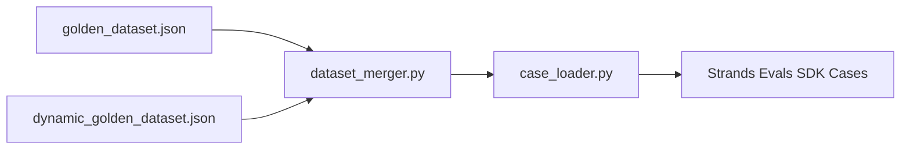

# Design Document

## Overview

This design covers the cleanup of the CalledIt golden evaluation dataset from schema 4.0 to 5.0. The changes are purely data-level — no new modules, APIs, or architectural components are introduced. The work modifies `eval/golden_dataset.json` (static dataset), `eval/generate_dynamic_dataset.py` (dynamic generator), and `eval/tests/test_case_loader.py` (test assertions).

The dataset currently has 55 base predictions and 23 fuzzy predictions. After cleanup it will have 58 base predictions (remove 2 duplicates, add 5 new recently-happened events) and 23 fuzzy predictions (unchanged).

## Architecture

No architectural changes. The existing pipeline remains:



The only changes are to the data files and test assertions. The `case_loader.py` and `dataset_merger.py` modules are unchanged.

## Components and Interfaces

### 1. Static Dataset Changes (`eval/golden_dataset.json`)

#### 1.1 Remove Duplicates

| Remove | Keep | Prediction Text |
|--------|------|----------------|
| `base-046` | `base-004` | "The S&P 500 will close higher today than yesterday" |
| `base-052` | `base-009` | "The US national debt exceeds $35 trillion" |

`base-046` has `smoke_test: false`, `verification_mode: "at_date"`, `expected_verification_outcome: null`.
`base-052` has `smoke_test: false`, `verification_mode: "recurring"`, `expected_verification_outcome: "confirmed"`.

Neither is a smoke test, so smoke coverage is unaffected. Removing `base-052` drops one qualifying case (from 7 to 6) and one recurring mode entry.

#### 1.2 Shorten Far-Future Predictions

**base-014** — Bitcoin prediction:
- Old: `"Bitcoin will exceed $150,000 USD by December 31, 2026"`
- New: `"Bitcoin will be trading above $90,000 USD next Friday"`
- Mode stays `before_date`, outcome stays `null` (future event, unknown result)
- Update `ground_truth`, `evaluation_rubric`, `dimension_tags.time_horizon` to `"days"`

**base-050** — SpaceX prediction:
- Old: `"SpaceX will land a spacecraft on Mars before 2030"`
- New: `"SpaceX will launch a Starship test flight before May 2026"`
- Mode stays `before_date`, outcome stays `null` (future event at time of dataset creation)
- Update `ground_truth`, `evaluation_rubric`, `dimension_tags.time_horizon` to `"weeks-to-months"`

#### 1.3 Add Recently-Happened Event Predictions

Five new predictions covering 5 domains (sports, finance, politics, technology, weather-adjacent/science). All use `verification_mode: "immediate"` and have non-null `expected_verification_outcome`.

| ID | Prediction Text | Domain | Outcome |
|----|----------------|--------|---------|
| `base-056` | "The Atlanta Hawks defeated the New York Knicks 109-108 in Game 3 of the 2026 NBA Playoffs on April 23, 2026" | sports | confirmed |
| `base-057` | "The S&P 500 closed above 7,100 on April 23, 2026" | finance | confirmed |
| `base-058` | "Zohran Mamdani was sworn in as Mayor of New York City on January 1, 2026" | politics | confirmed |
| `base-059` | "NASA's Artemis II mission launched from Kennedy Space Center on April 1, 2026" | technology | confirmed |
| `base-060` | "The Carolina Hurricanes defeated the Ottawa Senators 2-1 in Game 3 of the 2026 NHL Playoffs on April 23, 2026" | sports | confirmed |

All five have `smoke_test: false` except `base-056` which gets `smoke_test: true` to improve smoke tier coverage of `"immediate"` mode with known outcomes (Requirement 9.3).

#### 1.4 Version Bump

- `schema_version`: `"4.0"` → `"5.0"`
- `dataset_version`: `"4.0"` → `"5.0"`

#### 1.5 Metadata Update

After all changes (55 - 2 removed + 5 added = 58 base predictions):

- Smoke: 12 original (none removed since base-046 and base-052 were not smoke) + 1 new (base-056) = 13
- Immediate mode: 10 original + 5 new = 15
- At_date mode: 31 original - 1 (base-046 removed) = 30
- Before_date mode: 11 (unchanged)
- Recurring mode: 3 original - 1 (base-052 removed) = 2

```json
{
  "expected_base_count": 58,
  "expected_fuzzy_count": 23,
  "expected_smoke_test_count": 13,
  "expected_mode_counts": {
    "immediate": 15,
    "at_date": 30,
    "before_date": 11,
    "recurring": 2
  }
}
```

### 2. Dynamic Generator Changes (`eval/generate_dynamic_dataset.py`)

Remove `template_python_released` from the `get_all_templates()` return list. The function definition can remain in the file (dead code) or be removed entirely — removing from the list is sufficient to prevent `dyn-imm-005` generation.

### 3. Test Assertion Changes (`eval/tests/test_case_loader.py`)

| Test | Old Value | New Value | Reason |
|------|-----------|-----------|--------|
| `test_load_static_dataset_count` | 55 | 58 | -2 removed +5 added |
| `test_load_merged_dataset_count` | 70 | 72 | 58 static - 1 replaced (base-010) + 15 dynamic = 72 |
| `test_qualifying_count_static` | 7 | 11 | 7 - 1 (base-052 removed) + 5 new qualifying = 11 |
| `test_qualifying_count_merged` | 22 | 25 | 11 static qualifying - 1 replaced (base-010) + 15 dynamic qualifying = 25 |
| `test_smoke_filter_count` | 12 | 13 | +1 new smoke case (base-056) |

### 4. Personal/Subjective Cases (Preserved)

All 18 personal/subjective cases are preserved unchanged: base-027 through base-039, base-041 through base-045. Their smoke_test flags remain as-is.

## Data Models

No data model changes. The prediction schema remains identical to v4.0 — only the `schema_version` and `dataset_version` fields change to `"5.0"`.

Each new prediction follows the existing schema:

```json
{
  "id": "base-0XX",
  "prediction_text": "...",
  "difficulty": "easy|medium|hard",
  "ground_truth": {
    "verifiability_reasoning": "...",
    "date_derivation": "...",
    "verification_sources": ["..."],
    "objectivity_assessment": "objective",
    "verification_criteria": ["..."],
    "verification_steps": ["..."],
    "verification_timing": "...",
    "expected_verification_criteria": ["..."],
    "expected_verification_method": "..."
  },
  "dimension_tags": {
    "domain": "...",
    "stakes": "...",
    "time_horizon": "...",
    "persona": "..."
  },
  "evaluation_rubric": "...",
  "is_boundary_case": false,
  "boundary_description": null,
  "verification_readiness": "immediate",
  "expected_verifiability_score_range": [0.8, 1.0],
  "expected_verification_outcome": "confirmed|refuted",
  "smoke_test": false,
  "verification_mode": "immediate"
}
```

## Correctness Properties

*A property is a characteristic or behavior that should hold true across all valid executions of a system — essentially, a formal statement about what the system should do. Properties serve as the bridge between human-readable specifications and machine-verifiable correctness guarantees.*

### Property Reflection

From the prework analysis, the following properties were identified as candidates:

- 4.2 (new predictions have non-null outcome), 4.3 (new predictions have mode=immediate), 4.4 (new predictions have complete ground_truth) — these are all structural constraints on the same set of new predictions. They can be combined into a single property: "all new predictions are structurally valid."
- 7.1 (base count matches), 7.2 (smoke count matches), 7.3 (mode counts match) — these are all metadata consistency invariants. They can be combined into a single property: "metadata is consistent with actual data."

After consolidation, we have 2 properties.

### Property 1: New prediction structural validity

*For any* prediction in the golden dataset with an ID of `base-056` or higher, the prediction SHALL have: (a) `expected_verification_outcome` set to a non-null value (`"confirmed"` or `"refuted"`), (b) `verification_mode` set to `"immediate"`, and (c) a `ground_truth` object containing non-empty `verification_sources`, `verification_criteria`, `verification_steps`, and `expected_verification_method` fields.

**Validates: Requirements 4.2, 4.3, 4.4**

### Property 2: Metadata-data consistency

*For any* valid golden dataset, the `metadata.expected_base_count` SHALL equal the length of the `base_predictions` array, `metadata.expected_smoke_test_count` SHALL equal the count of predictions with `smoke_test: true`, and `metadata.expected_mode_counts` SHALL match the actual distribution of `verification_mode` values across all predictions.

**Validates: Requirements 7.1, 7.2, 7.3**

## Error Handling

No new error handling is needed. The existing validation in `generate_dynamic_dataset.py` (the `validate_dynamic_dataset` function) already checks for valid modes, verdicts, difficulties, and required fields. The `case_loader.py` handles missing optional fields gracefully via `.get()` with defaults.

The only error scenario is if the dataset JSON is malformed after editing — this is caught by the existing test suite which loads and validates the dataset on every test run.

## Testing Strategy

### Approach

This feature is a data cleanup — the code under test is primarily the dataset JSON file itself and the test assertions. Property-based testing applies to the structural invariants (Properties 1 and 2 above), while example-based tests cover the specific data changes.

### Property-Based Tests

Using `hypothesis` (already in the project). Each property test runs minimum 100 iterations.

- **Property 1 test**: Generate random prediction dicts with IDs matching `base-05[6-9]` or `base-06[0-9]` patterns, apply the structural validation function, verify all constraints hold. Tag: `Feature: golden-dataset-v5, Property 1: New prediction structural validity`
- **Property 2 test**: Generate random datasets with varying prediction counts, smoke flags, and modes, compute expected metadata, verify consistency. Tag: `Feature: golden-dataset-v5, Property 2: Metadata-data consistency`

### Example-Based Tests (Unit Tests)

Update existing tests in `eval/tests/test_case_loader.py`:

| Test | Old Assertion | New Assertion |
|------|--------------|---------------|
| `test_load_static_dataset_count` | `== 55` | `== 58` |
| `test_load_merged_dataset_count` | `== 70` | `== 72` |
| `test_qualifying_count_static` | `== 7` | `== 11` |
| `test_qualifying_count_merged` | `== 22` | `== 25` |
| `test_smoke_filter_count` | `== 12` | `== 13` |

### Additional Validation Tests

- Assert `base-046` and `base-052` are absent from the dataset
- Assert `base-004` and `base-009` are present and unchanged
- Assert all 18 personal/subjective cases are present
- Assert `schema_version` and `dataset_version` are `"5.0"`
- Assert `base-014` and `base-050` have updated prediction text
- Assert new predictions (base-056 through base-060) exist with correct fields
- Assert `template_python_released` is not in `get_all_templates()` return list

### Test Execution

```bash
/home/wsluser/projects/calledit/venv/bin/python -m pytest eval/tests/ -v
```
