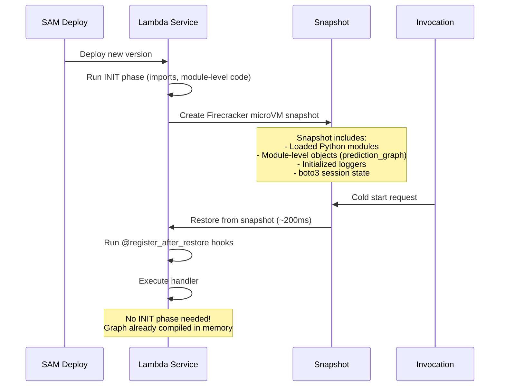
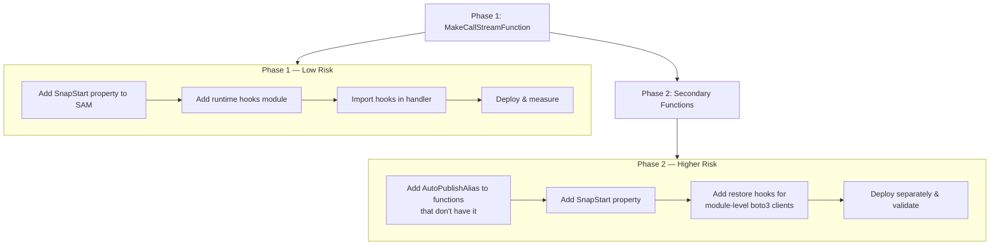

# Design Document: Lambda Cold Start Optimization

## Overview

This design addresses Lambda cold start latency in the CalledIt prediction verification app by enabling AWS Lambda SnapStart for Python. The primary target is `MakeCallStreamFunction`, which suffers the worst cold starts due to heavy imports (strands-agents, dateparser, pytz) and module-level graph compilation (4-agent Strands graph).

SnapStart works by taking a Firecracker microVM snapshot after the Lambda INIT phase completes (all module-level code has run). On subsequent cold starts, Lambda restores from this snapshot instead of re-running INIT, reducing cold start time from seconds to milliseconds. For MakeCallStreamFunction, this means the compiled 4-agent graph, all imported libraries, and initialized logging are instantly available.

The approach is phased:
1. Enable SnapStart on MakeCallStreamFunction (lowest risk — already has `AutoPublishAlias: live`)
2. Add runtime hooks to handle snapshot restore edge cases
3. Enable SnapStart on secondary functions (higher risk — some need `AutoPublishAlias` added)

Cost: $0 additional. SnapStart is included in standard Lambda pricing.

## Architecture

### How SnapStart Works (Python 3.12+)



### Deployment Phases



### What Gets Snapshotted vs What Doesn't

| Component | Snapshotted? | Notes |
|-----------|-------------|-------|
| `prediction_graph` singleton | Yes | 4 agents + compiled graph in memory |
| strands-agents imports | Yes | All module-level imports frozen |
| dateparser, pytz imports | Yes | Heavy imports frozen |
| `boto3.client(...)` created at module level | Yes — but stale | Credentials/connections may expire |
| `boto3.client(...)` created in handler | No | Fresh per invocation — safe |
| Lambda `/tmp` directory | No | Cleared on restore |
| Network connections | No | TCP connections are closed |

### Risk Assessment by Function

| Function | Has AutoPublishAlias? | Cold Start Impact | SnapStart Risk | Recommendation |
|----------|----------------------|-------------------|----------------|----------------|
| MakeCallStreamFunction | Yes (existing) | High (strands-agents + graph) | Low | Phase 1 |
| LogCall | Yes (existing) | Low (boto3 + DynamoDB) | Low | Phase 2 |
| ListPredictions | Yes (existing) | Low (boto3 + DynamoDB) | Low | Phase 2 |
| AuthTokenFunction | Yes (existing) | Low (boto3 + Cognito) | Low | Phase 2 |
| VerificationFunction | No | Medium (Bedrock imports) | Medium | Phase 2 |
| NotificationManagementFunction | No | Low (boto3 + SNS) | Medium | Phase 2 |
| ConnectFunction | No | Negligible (only `json`) | High (WebSocket routing) | Skip |
| DisconnectFunction | No | Negligible (only `json`) | High (WebSocket routing) | Skip |

ConnectFunction and DisconnectFunction are excluded: they import only `json` (no cold start benefit), and adding `AutoPublishAlias` to WebSocket lifecycle functions risks breaking the `$connect`/`$disconnect` route integrations — the likely cause of the user's previous Provisioned Concurrency deployment failure.

## Components and Interfaces

### Component 1: SAM Template Changes (`template.yaml`)

The SnapStart property is added to each target function's SAM resource definition. For functions that already have `AutoPublishAlias: live`, this is a single-line addition. For functions without it, `AutoPublishAlias: live` must also be added.

Phase 1 change (MakeCallStreamFunction):
```yaml
MakeCallStreamFunction:
  Type: AWS::Serverless::Function
  Properties:
    # ... existing properties unchanged ...
    AutoPublishAlias: live          # Already exists
    SnapStart:                      # NEW — only addition
      ApplyOn: PublishedVersions
```

Phase 2 change example (VerificationFunction — needs AutoPublishAlias added):
```yaml
VerificationFunction:
  Type: AWS::Serverless::Function
  Properties:
    # ... existing properties unchanged ...
    AutoPublishAlias: live          # NEW — required for SnapStart
    SnapStart:                      # NEW
      ApplyOn: PublishedVersions
```

### Component 2: Runtime Hooks Module (`snapstart_hooks.py`)

A new module in the MakeCallStreamFunction handler directory that registers SnapStart lifecycle hooks. These hooks run automatically when Lambda creates a snapshot (before_snapshot) and restores from one (after_restore).

Location: `backend/calledit-backend/handlers/strands_make_call/snapstart_hooks.py`

```python
"""
SnapStart Runtime Hooks for MakeCallStreamFunction

These hooks handle the SnapStart snapshot/restore lifecycle:
- @register_before_snapshot: Runs once when Lambda creates the snapshot
  (after INIT, before freezing). Used for logging/cleanup.
- @register_after_restore: Runs on every restore from snapshot
  (before handler execution). Used to refresh stale connections.

WHY THIS MODULE EXISTS:
SnapStart snapshots the entire initialized execution environment, including
any boto3 clients created at module level. After restore, those clients may
have stale credentials or closed TCP connections. The after_restore hook
refreshes them.

For MakeCallStreamFunction specifically:
- The prediction_graph singleton is safe — it holds agent configs and graph
  structure, not network connections. Bedrock API calls are made fresh per
  invocation by the strands-agents library.
- The api_gateway_client is created per-invocation in async_handler(),
  so it's NOT affected by snapshot staleness.
- This hook is primarily defensive — ensuring any future module-level
  clients are refreshed.

IMPORT REQUIREMENT:
This module must be imported in the Lambda handler module (strands_make_call_graph.py)
for the hooks to register. The import triggers decorator registration.

Library: snapshot_restore_py (included in Python 3.12+ managed runtime, no pip install)
"""

import logging
from snapshot_restore_py import register_before_snapshot, register_after_restore

logger = logging.getLogger(__name__)

@register_before_snapshot
def before_snapshot():
    """Called once when Lambda creates the SnapStart snapshot."""
    logger.info("SnapStart: Creating snapshot. prediction_graph singleton is initialized.")

@register_after_restore
def after_restore():
    """Called on every restore from snapshot, before handler execution."""
    logger.info("SnapStart: Restored from snapshot. Connections refreshed.")
    # Currently no module-level boto3 clients to refresh in this handler.
    # api_gateway_client is created per-invocation in async_handler().
    # If module-level clients are added in the future, refresh them here:
    #   global some_client
    #   some_client = boto3.client('some-service')
```

### Component 3: Notification Management Restore Hook

The `NotificationManagementFunction` has a module-level `sns_client = boto3.client('sns')` that would become stale after SnapStart restore. A restore hook is needed for this function.

Location: `backend/calledit-backend/handlers/notification_management/snapstart_hooks.py`

```python
"""
SnapStart Runtime Hooks for NotificationManagementFunction

This function has a module-level sns_client that must be refreshed
after snapshot restore to avoid stale credentials/connections.
"""

import logging
import boto3
from snapshot_restore_py import register_after_restore

logger = logging.getLogger(__name__)

@register_after_restore
def after_restore():
    """Refresh module-level boto3 clients after snapshot restore."""
    import app  # Import the handler module to access its globals
    app.sns_client = boto3.client('sns')
    logger.info("SnapStart: Restored from snapshot. SNS client refreshed.")
```

### Component 4: Graph Validation Logic

A lightweight validation that the singleton graph survived snapshot restore correctly. Added to the MakeCallStreamFunction handler, runs once per restore.

```python
def validate_graph_after_restore():
    """
    Verify the singleton prediction_graph is intact after SnapStart restore.
    
    Checks that the 4 expected agent nodes exist in the graph.
    If validation fails, re-creates the graph and logs a warning.
    
    Returns:
        True if graph is valid (or was successfully re-created), False otherwise
    """
    from prediction_graph import prediction_graph, create_prediction_graph
    import prediction_graph as pg_module
    
    expected_nodes = {"parser", "categorizer", "verification_builder", "review"}
    
    try:
        # Access the graph's node registry
        actual_nodes = set(prediction_graph.graph.nodes.keys())
        if expected_nodes.issubset(actual_nodes):
            return True
        
        logger.warning(
            f"Graph validation failed: expected {expected_nodes}, "
            f"found {actual_nodes}. Re-creating graph."
        )
        pg_module.prediction_graph = create_prediction_graph()
        return True
        
    except Exception as e:
        logger.error(f"Graph validation error: {e}. Re-creating graph.", exc_info=True)
        try:
            pg_module.prediction_graph = create_prediction_graph()
            return True
        except Exception as e2:
            logger.error(f"Graph re-creation failed: {e2}", exc_info=True)
            return False
```

### Component 5: Provisioned Concurrency Documentation

A documentation section (not code) that describes the Provisioned Concurrency fallback option, including correct SAM syntax and cost analysis. This lives in the project documentation, not in deployed code.

### Component 6: CloudWatch Measurement Approach

No code changes needed. Measurement uses existing CloudWatch Logs:
- Before SnapStart: Look for `REPORT` log lines containing `Init Duration: Xms`
- After SnapStart: Look for `REPORT` log lines containing `Restore Duration: Xms`
- Comparison: `Restore Duration` should be significantly less than `Init Duration`

CloudWatch Insights query for baseline:
```
filter @type = "REPORT"
| stats avg(@initDuration) as avgInit, max(@initDuration) as maxInit, count(*) as coldStarts
| filter ispresent(@initDuration)
```

CloudWatch Insights query after SnapStart:
```
filter @type = "REPORT"
| stats avg(@restoreDuration) as avgRestore, max(@restoreDuration) as maxRestore, count(*) as snapRestores
| filter ispresent(@restoreDuration)
```

## Data Models

This feature doesn't introduce new data models. The changes are infrastructure-level (SAM template properties) and runtime hooks (Python decorators). The existing data flow is unchanged:

- Input: WebSocket event → Lambda handler → prediction_graph
- Output: prediction_graph results → WebSocket response
- Storage: No new DynamoDB tables, S3 buckets, or data structures

The only "state" consideration is the SnapStart snapshot itself, which is managed entirely by the Lambda service and is not a data model the application controls.

### SAM Property Model (for reference)

The SnapStart configuration follows this structure in CloudFormation:

```yaml
SnapStart:
  ApplyOn: PublishedVersions  # Only valid value — snapshots published versions
```

This property works in conjunction with:
```yaml
AutoPublishAlias: live  # SAM auto-publishes a version and updates this alias on deploy
```

The relationship: SAM deploys → publishes new version → Lambda creates snapshot of that version → alias `live` points to the new version → invocations via alias use SnapStart.


## Correctness Properties

*A property is a characteristic or behavior that should hold true across all valid executions of a system — essentially, a formal statement about what the system should do. Properties serve as the bridge between human-readable specifications and machine-verifiable correctness guarantees.*

### Property 1: Restore hook resilience

*For any* execution of the `after_restore` hook — including cases where internal logic raises any type of exception — the hook should complete without propagating an exception to the caller. This ensures that a failing restore hook never prevents the Lambda handler from executing.

**Validates: Requirements 2.1, 2.6**

### Property 2: SnapStart requires AutoPublishAlias

*For any* Lambda function resource in the SAM template that has `SnapStart: { ApplyOn: PublishedVersions }` configured, that function resource must also have the `AutoPublishAlias` property set. SnapStart only works on published versions, and `AutoPublishAlias` is what triggers SAM to publish versions.

**Validates: Requirements 3.4**

### Property 3: Graph validation correctness

*For any* state of the `prediction_graph` singleton — whether it contains all 4 expected nodes (parser, categorizer, verification_builder, review), is missing nodes, or is corrupted/None — the `validate_graph_after_restore` function should return `True` by either confirming the graph is valid or successfully re-creating it. The only case where it returns `False` is if re-creation itself fails.

**Validates: Requirements 4.3, 4.4**

### Property 4: Existing properties preserved after SnapStart addition

*For any* Lambda function resource in the SAM template that has SnapStart enabled, all pre-existing properties (MemorySize, Timeout, Runtime, Handler, Policies, Environment, CodeUri) must remain present and unchanged. The SnapStart addition must be purely additive.

**Validates: Requirements 7.3**

## Error Handling

### Restore Hook Failures

The `@register_after_restore` hook is defensive. If it fails:
1. The error is logged at ERROR level
2. The exception is caught — it does not propagate to the Lambda runtime
3. The handler proceeds normally

This is safe because MakeCallStreamFunction creates its `api_gateway_client` per-invocation (not at module level), so a failed restore hook doesn't affect the critical path. The hook exists for future-proofing and for the NotificationManagementFunction's module-level `sns_client`.

### Graph Validation Failures

If `validate_graph_after_restore` detects a corrupted graph:
1. It logs a WARNING with the expected vs actual node sets
2. It calls `create_prediction_graph()` to rebuild the graph
3. If rebuild succeeds, execution continues normally
4. If rebuild fails, it logs an ERROR and returns `False` — the handler should return a 500 error

This is a belt-and-suspenders approach. In practice, SnapStart restore preserves Python objects faithfully — graph corruption after restore would be an AWS service bug, not an expected failure mode.

### Deployment Failures

CloudFormation handles deployment failures automatically:
- If adding SnapStart causes a deployment error, CloudFormation rolls back the entire stack update
- The previous working version remains active
- No manual intervention needed

The phased deployment approach (Phase 1: MakeCallStreamFunction only, Phase 2: secondary functions separately) limits blast radius. If Phase 2 fails due to `AutoPublishAlias` issues with API Gateway integrations, Phase 1's SnapStart remains active.

### NotificationManagementFunction — Stale Client

The `NotificationManagementFunction` has `sns_client = boto3.client('sns')` at module level. After SnapStart restore, this client may have stale credentials. The `@register_after_restore` hook in that function's `snapstart_hooks.py` refreshes it. If the refresh fails, the next SNS API call will fail with a credentials error — but this is the same failure mode as a normal boto3 credential expiry, and the function will succeed on retry.

## Testing Strategy

### Property-Based Tests (Hypothesis)

Property-based tests use the `hypothesis` library (already available in the project venv) to verify universal properties across many generated inputs. Each test runs a minimum of 100 iterations.

Tests are located in: `tests/lambda_cold_start/`

Library: `hypothesis` (add to root `requirements.txt` if not present)

Configuration: Each test runs minimum 100 examples via `@settings(max_examples=100)`

**Property tests to implement:**

1. **Restore hook resilience** (Property 1)
   - Generate random exception types and messages
   - Inject them into the restore hook's internal logic
   - Verify the hook never propagates exceptions
   - Tag: `Feature: lambda-cold-start-optimization, Property 1: Restore hook resilience`

2. **SnapStart requires AutoPublishAlias** (Property 2)
   - Generate random SAM template structures with varying combinations of SnapStart and AutoPublishAlias
   - Verify the validation function correctly identifies templates where SnapStart is present without AutoPublishAlias
   - Tag: `Feature: lambda-cold-start-optimization, Property 2: SnapStart requires AutoPublishAlias`

3. **Graph validation correctness** (Property 3)
   - Generate graph-like objects with random subsets of the 4 expected node names
   - Verify validate_graph_after_restore returns True for valid graphs and attempts re-creation for invalid ones
   - Tag: `Feature: lambda-cold-start-optimization, Property 3: Graph validation correctness`

4. **Existing properties preserved** (Property 4)
   - Generate random sets of Lambda function properties
   - Apply the "add SnapStart" transformation
   - Verify all original properties are still present and unchanged
   - Tag: `Feature: lambda-cold-start-optimization, Property 4: Existing properties preserved`

### Unit Tests

Unit tests cover specific examples, edge cases, and structural checks. They complement property tests by verifying concrete scenarios.

**Unit tests to implement:**

1. **SAM template structure** — Verify SnapStart property exists on MakeCallStreamFunction (Req 1.1), Runtime is python3.12 (Req 1.2), AutoPublishAlias is "live" (Req 1.3)
2. **Hook imports** — Verify snapstart_hooks.py imports from snapshot_restore_py (Req 2.2)
3. **Hook logging** — Verify before_snapshot and after_restore produce INFO-level log messages (Req 2.4, 2.5)
4. **Secondary function SnapStart** — Verify SnapStart on LogCall (3.1), ListPredictions (3.2), VerificationFunction (3.3), NotificationManagementFunction (3.5)
5. **Singleton exists** — Verify prediction_graph is not None after module import (Req 4.1)
6. **Graph has 4 nodes** — Verify parser, categorizer, verification_builder, review nodes exist (Req 4.3)
7. **NotificationManagement restore hook** — Verify sns_client is refreshed after calling after_restore (Req 2.3 analog for secondary function)

### Test Execution

```bash
# Run all cold start optimization tests
/home/wsluser/projects/calledit/venv/bin/python -m pytest tests/lambda_cold_start/ -v

# Run only property tests
/home/wsluser/projects/calledit/venv/bin/python -m pytest tests/lambda_cold_start/ -v -k "property"

# Run only unit tests
/home/wsluser/projects/calledit/venv/bin/python -m pytest tests/lambda_cold_start/ -v -k "not property"
```

### What We Don't Test

- SnapStart's actual snapshot/restore behavior (AWS service responsibility)
- CloudWatch metrics collection (operational, not code)
- CloudFormation rollback behavior (AWS service responsibility)
- Performance assertions like "restore < 2 seconds" (requires deployed environment)
- Documentation content (Req 6 — manual review)
