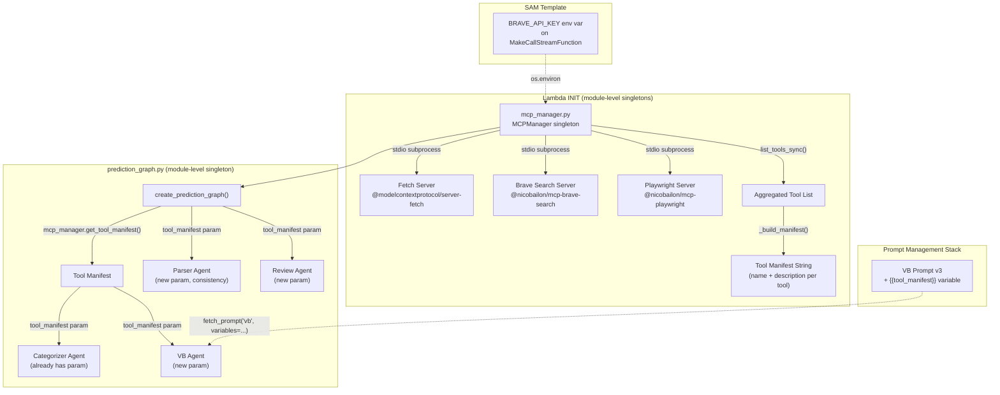

# Design Document: MCP Tool Integration (Spec A2)

## Overview

This design wires MCP tool servers into the CalledIt prediction pipeline's application logic. It introduces a new `mcp_manager.py` module that connects to 3 MCP servers (fetch, brave-search, playwright) via Strands `MCPClient` with stdio transport, discovers tools at Lambda INIT time, and provides a human-readable tool manifest for agent prompts. The Categorizer and Verification Builder agents become tool-aware using this live manifest, and the Prompt Management stack gets a VB v3 prompt with `{{tool_manifest}}` support.

This spec builds on Spec A1 (`verification-teardown-docker`) which deployed the Docker Lambda image with Python 3.12 + Node.js v20 LTS and archived the old verification system. The Docker image already supports `npx` for MCP server subprocess execution.

### Key Design Decisions

1. **MCP Manager as module-level singleton** — connections established at import time (Lambda INIT), reused across warm invocations. Same pattern as the existing `prediction_graph` singleton.
2. **MCPClient stdio transport** — each MCP server runs as a subprocess via `npx`. The Strands `MCPClient` wraps this with `StdioServerParameters`.
3. **Graceful degradation** — if MCP servers fail to connect, the pipeline falls back to reasoning-only mode (empty manifest). No hard dependency on MCP availability.
4. **Manifest-only for now** — MCP tools are used for manifest building (prompt injection) only. Direct tool invocation by agents is deferred to Spec B (verification execution agent).
5. **VB mirrors Categorizer pattern** — `create_verification_builder_agent(tool_manifest)` matches the existing `create_categorizer_agent(tool_manifest)` signature and prompt injection approach.

### Prerequisites (from Spec A1)

- Docker Lambda image with Python 3.12 + Node.js v20 LTS (`backend/calledit-backend/Dockerfile`)
- `MakeCallStreamFunction` using `PackageType: Image`
- Old verification system archived to `docs/historical/verification-v1/`
- `tool_registry.py` archived (import in `prediction_graph.py` still references it via try/except)

## Architecture



### Data Flow

1. Lambda cold start → `mcp_manager.py` imports → `MCPManager.__init__()` runs
2. MCPManager connects to 3 MCP servers via `MCPClient` with stdio transport (`npx` subprocesses)
3. `list_tools_sync()` called on each connected client → tools aggregated into a single list
4. `_build_manifest()` produces a human-readable string: `"- tool_name: description"` per tool
5. `prediction_graph.py` imports `mcp_manager` → calls `mcp_manager.get_tool_manifest()`
6. `create_prediction_graph()` passes manifest to both `create_categorizer_agent(tool_manifest)` and `create_verification_builder_agent(tool_manifest)`
7. Each agent factory passes the manifest to `fetch_prompt()` with `variables={"tool_manifest": ...}` (API path) or formats it into the bundled prompt (fallback path)
8. Warm invocations reuse the singleton graph — no reconnection needed

## Components and Interfaces

### Component 1: MCP Manager (`mcp_manager.py`)

New module at `backend/calledit-backend/handlers/strands_make_call/mcp_manager.py`.

**Responsibilities:**
- Connect to configured MCP servers at initialization
- Discover tools via `list_tools_sync()` on each connected client
- Build and cache a human-readable tool manifest
- Expose clients and tools for future use (Spec B)
- Handle partial and total server failures gracefully

```python
"""
MCP Manager — Manages MCP server connections and tool discovery.

Connections are established at module level (Lambda INIT) and reused
across warm Lambda invocations. Same singleton pattern as prediction_graph.

If any server fails, the remaining servers still contribute tools.
If ALL servers fail, the pipeline operates in reasoning-only mode
(empty manifest — same behavior as before MCP integration).
"""

import os
import logging
from typing import List, Dict, Optional, Any

from strands.mcp import MCPClient
from mcp import StdioServerParameters

logger = logging.getLogger(__name__)

# Static MCP server configurations.
# Each entry maps to an npx-invoked MCP server subprocess.
# env=None means no extra env vars beyond the Lambda's environment.
MCP_SERVERS: Dict[str, Dict[str, Any]] = {
    "fetch": {
        "command": "npx",
        "args": ["-y", "@modelcontextprotocol/server-fetch"],
        "env": None,
    },
    "brave_search": {
        "command": "npx",
        "args": ["-y", "@nicobailon/mcp-brave-search"],
        "env": {"BRAVE_API_KEY": os.environ.get("BRAVE_API_KEY", "")},
    },
    "playwright": {
        "command": "npx",
        "args": ["-y", "@nicobailon/mcp-playwright"],
        "env": None,
    },
}


class MCPManager:
    """Manages MCP server connections and provides tool discovery."""

    def __init__(self):
        self._clients: Dict[str, MCPClient] = {}
        self._tool_list: list = []
        self._manifest: str = ""
        self._initialize()

    def _initialize(self):
        """Connect to all configured MCP servers, discover tools."""
        for name, config in MCP_SERVERS.items():
            try:
                env = {**os.environ, **(config["env"] or {})}
                client = MCPClient(
                    lambda c=config, e=env: StdioServerParameters(
                        command=c["command"],
                        args=c["args"],
                        env=e,
                    )
                )
                client.start()
                tools = client.list_tools_sync()
                self._clients[name] = client
                self._tool_list.extend(tools)
                logger.info(f"MCP server '{name}' connected: {len(tools)} tools")
            except Exception as e:
                logger.error(f"MCP server '{name}' failed to connect: {e}")

        if not self._clients:
            logger.warning(
                "All MCP servers failed — operating in reasoning-only mode"
            )

        self._manifest = self._build_manifest()

    def _build_manifest(self) -> str:
        """Build human-readable tool manifest from discovered tools."""
        if not self._tool_list:
            return ""
        lines = []
        for tool in self._tool_list:
            name = getattr(tool, "name", str(tool))
            desc = getattr(tool, "description", "No description")
            lines.append(f"- {name}: {desc}")
        return "\n".join(lines)

    def get_tool_manifest(self) -> str:
        """Return human-readable tool manifest for agent prompts."""
        return self._manifest

    def get_mcp_clients(self) -> List[MCPClient]:
        """Return MCPClient instances for future Agent(tools=[...]) wiring."""
        return list(self._clients.values())

    def get_mcp_tools(self) -> list:
        """Return raw MCP tool objects from aggregated tool list."""
        return list(self._tool_list)

    def shutdown(self):
        """Stop all MCP client connections."""
        for name, client in self._clients.items():
            try:
                client.stop(None, None, None)
                logger.info(f"MCP server '{name}' stopped")
            except Exception as e:
                logger.error(f"Failed to stop MCP server '{name}': {e}")


# Module-level singleton — initialized at Lambda INIT, reused across warm invocations.
mcp_manager = MCPManager()
```

**Interface:**
| Method | Returns | Purpose |
|---|---|---|
| `get_tool_manifest()` | `str` | Human-readable manifest for agent prompts |
| `get_mcp_clients()` | `List[MCPClient]` | Client instances for future `Agent(tools=[...])` (Spec B) |
| `get_mcp_tools()` | `list` | Raw MCP tool objects |
| `shutdown()` | `None` | Cleanup — stop all client connections |

### Component 2: Updated `prediction_graph.py`

Replace the `tool_registry` try/except block with a single import from `mcp_manager`.

**Before (current code):**
```python
try:
    from tool_registry import read_active_tools, build_tool_manifest
    tools = read_active_tools()
    tool_manifest = build_tool_manifest(tools)
except Exception as e:
    logger.error(f"Failed to read tool registry, falling back to pure reasoning: {e}")
    tool_manifest = ""
```

**After:**
```python
from mcp_manager import mcp_manager
tool_manifest = mcp_manager.get_tool_manifest()
```

The categorizer call stays the same: `create_categorizer_agent(tool_manifest)`.
The VB call changes: `create_verification_builder_agent(tool_manifest)` (new parameter added).
The review call changes: `create_review_agent(tool_manifest)` (new parameter added).
The parser call changes: `create_parser_agent(tool_manifest)` (new parameter for interface consistency).

### Component 3: Updated `verification_builder_agent.py`

Add `tool_manifest` parameter to `create_verification_builder_agent()`, matching the Categorizer pattern.

**Changes:**

1. Add `tool_manifest: str = ""` parameter to factory function
2. Pass manifest to `fetch_prompt("vb", variables={"tool_manifest": manifest_text})` on the API path
3. Format manifest into bundled prompt on the fallback path: `VERIFICATION_BUILDER_SYSTEM_PROMPT.format(tool_manifest=manifest_text)`
4. Add `AVAILABLE TOOLS` section to the bundled `VERIFICATION_BUILDER_SYSTEM_PROMPT` constant

```python
def create_verification_builder_agent(
    tool_manifest: str = "", model_id: str = None
) -> Agent:
    manifest_text = (
        tool_manifest
        if tool_manifest
        else "No tools currently registered. Rely on pure reasoning for verification planning."
    )

    try:
        from prompt_client import fetch_prompt
        system_prompt = fetch_prompt("vb", variables={"tool_manifest": manifest_text})
    except Exception as e:
        logger.warning(f"Prompt Management unavailable, using bundled prompt: {e}")
        system_prompt = VERIFICATION_BUILDER_SYSTEM_PROMPT.format(
            tool_manifest=manifest_text
        )

    agent = Agent(
        model=model_id or "us.anthropic.claude-sonnet-4-20250514-v1:0",
        system_prompt=system_prompt,
    )

    logger.info("Verification Builder Agent created with tool manifest")
    return agent
```

The bundled prompt gets an `AVAILABLE TOOLS` section added before the JSON format block:

```
AVAILABLE TOOLS:
{tool_manifest}

When writing verification plans:
- If an available tool matches the verification need, reference it by name in the "source" and "steps" fields
- If no matching tool exists for an "automatable" prediction, note "tool not currently available" in the "steps" field
- For "human_only" predictions, use self-report or manual verification sources as before
```

### Component 4: Updated `review_agent.py`

Add `tool_manifest` parameter to `create_review_agent()`, matching the Categorizer and VB pattern.

**Changes:**

1. Add `tool_manifest: str = ""` parameter to factory function
2. Pass manifest to `fetch_prompt("review", variables={"tool_manifest": manifest_text})` on the API path
3. Format manifest into bundled prompt on the fallback path
4. Add `AVAILABLE TOOLS` section to the bundled `REVIEW_SYSTEM_PROMPT` constant

```python
def create_review_agent(
    tool_manifest: str = "", model_id: str = None
) -> Agent:
    manifest_text = (
        tool_manifest
        if tool_manifest
        else "No tools currently registered."
    )

    try:
        from prompt_client import fetch_prompt
        system_prompt = fetch_prompt("review", variables={"tool_manifest": manifest_text})
    except Exception as e:
        logger.warning(f"Prompt Management unavailable, using bundled prompt: {e}")
        system_prompt = REVIEW_SYSTEM_PROMPT.format(
            tool_manifest=manifest_text
        )

    agent = Agent(
        model=model_id or "us.anthropic.claude-sonnet-4-20250514-v1:0",
        system_prompt=system_prompt,
    )

    logger.info("Review Agent created with tool manifest")
    return agent
```

The bundled prompt gets an `AVAILABLE TOOLS` section added to the SECTIONS TO REVIEW area:

```
AVAILABLE TOOLS:
{tool_manifest}

When reviewing the verification plan, consider:
- Are the chosen tools the best match from the available tool list for this prediction?
- Could a different available tool provide better or more direct verification?
- If the plan references tools that aren't in the available list, flag this
- If a better tool exists but wasn't chosen, ask why
```

This enables the ReviewAgent to ask questions like "The plan uses web search to check weather, but the fetch tool could directly query a weather API endpoint — would that be more reliable?"

### Component 5: Prompt Management VB v3 and Review v4

Update the VB prompt in `infrastructure/prompt-management/template.yaml`:

1. Add `{{tool_manifest}}` input variable to the VB prompt's `TemplateConfiguration`
2. Add `AVAILABLE TOOLS` section to the prompt text
3. Add tool-referencing instructions
4. Add `VBPromptVersionV3` resource depending on `VBPromptVersionV2`

The VB prompt text gets the same `AVAILABLE TOOLS` block as the bundled prompt, but using `{{tool_manifest}}` (double-brace for Bedrock Prompt Management) instead of `{tool_manifest}` (single-brace for Python `.format()`).

The `InputVariables` section is added to match the Categorizer prompt pattern:
```yaml
InputVariables:
  - Name: tool_manifest
```

New version resource:
```yaml
VBPromptVersionV3:
  Type: AWS::Bedrock::PromptVersion
  DependsOn: VBPromptVersionV2
  Properties:
    PromptArn: !GetAtt VBPrompt.Arn
    Description: "v3 — MCP tool awareness with {{tool_manifest}} variable"
```

The Review prompt also gets the same treatment:
1. Add `{{tool_manifest}}` input variable to the Review prompt's `TemplateConfiguration`
2. Add `AVAILABLE TOOLS` section to the Review prompt text
3. Add tool-awareness instructions for reviewing tool choices
4. Add `ReviewPromptVersionV4` resource depending on `ReviewPromptVersionV3`

```yaml
ReviewPromptVersionV4:
  Type: AWS::Bedrock::PromptVersion
  DependsOn: ReviewPromptVersionV3
  Properties:
    PromptArn: !GetAtt ReviewPrompt.Arn
    Description: "v4 — MCP tool awareness with {{tool_manifest}} variable"
```

### Component 6: SAM Template `BRAVE_API_KEY`

Add `BRAVE_API_KEY` to the `MakeCallStreamFunction` environment variables:

```yaml
Environment:
  Variables:
    PROMPT_VERSION_PARSER: "1"
    PROMPT_VERSION_CATEGORIZER: "2"
    PROMPT_VERSION_VB: "2"
    PROMPT_VERSION_REVIEW: "3"
    BRAVE_API_KEY: "PLACEHOLDER_REPLACE_BEFORE_DEPLOY"
```

The placeholder value is for initial development. Before production deployment, this should be replaced with an SSM Parameter Store dynamic reference (e.g., `'{{resolve:ssm:calledit-brave-api-key:1}}'`). All existing environment variables remain unchanged.

## Data Models

### MCP Server Configuration

Static configuration — no database storage needed. Defined as a module-level dict in `mcp_manager.py`:

```python
MCP_SERVERS = {
    "server_name": {
        "command": str,      # "npx"
        "args": list[str],   # ["-y", "@package/name"]
        "env": dict | None,  # Additional env vars (e.g., API keys)
    }
}
```

Three servers configured:
| Server Name | Package | API Key Required |
|---|---|---|
| `fetch` | `@modelcontextprotocol/server-fetch` | No |
| `brave_search` | `@nicobailon/mcp-brave-search` | Yes (`BRAVE_API_KEY`) |
| `playwright` | `@nicobailon/mcp-playwright` | No |

### Tool Manifest Format

Human-readable string injected into agent system prompts. One line per tool:

```
- fetch: Fetches a URL from the internet and extracts its contents as markdown
- brave_web_search: Performs a web search using the Brave Search API
- brave_local_search: Performs a local search using the Brave Search API
- browser_navigate: Navigate to a URL in the browser
- browser_screenshot: Take a screenshot of the current page
- browser_click: Click an element on the page
```

Empty string when no servers connect (reasoning-only mode).

### MCP Tool Object

Each tool returned by `list_tools_sync()` has:
- `name: str` — tool identifier (e.g., `"brave_web_search"`)
- `description: str` — human-readable description
- `inputSchema: dict` — JSON Schema for tool input parameters

The manifest uses only `name` and `description`. The full `inputSchema` is available via `get_mcp_tools()` for future use in Spec B.

### Environment Variables

| Variable | Source | Purpose |
|---|---|---|
| `BRAVE_API_KEY` | SAM template env → SSM Parameter Store (production) | Brave Search API authentication |
| `PROMPT_VERSION_VB` | SAM template env | VB prompt version (bump to "3" after VB v3 deployment) |
| `PROMPT_VERSION_REVIEW` | SAM template env | Review prompt version (bump to "4" after Review v4 deployment) |


## Correctness Properties

*A property is a characteristic or behavior that should hold true across all valid executions of a system — essentially, a formal statement about what the system should do. Properties serve as the bridge between human-readable specifications and machine-verifiable correctness guarantees.*

### Property 1: Tool aggregation with partial failure resilience

*For any* set of MCP servers where each server either succeeds (returning a list of tools) or fails (raising an exception), the aggregated tool list returned by `get_mcp_tools()` should contain exactly the tools from the servers that succeeded — no tools lost from surviving servers, no tools present from failed servers, and an empty list when all servers fail.

**Validates: Requirements 1.4, 1.6, 1.7**

### Property 2: Manifest contains all tool names and descriptions

*For any* list of MCP tools with names and descriptions, the string returned by `get_tool_manifest()` should contain every tool's name and every tool's description as substrings. When the tool list is empty, the manifest should be an empty string.

**Validates: Requirements 1.8**

### Property 3: VB factory passes tool manifest through to prompt

*For any* non-empty tool manifest string, calling `create_verification_builder_agent(tool_manifest=manifest)` should produce an agent whose system prompt contains the manifest string as a substring. This validates both the factory function signature and the prompt variable injection.

**Validates: Requirements 3.1, 3.2**

### Property 4: Categorizer factory preserves tool manifest in prompt

*For any* non-empty tool manifest string, calling `create_categorizer_agent(tool_manifest=manifest)` should produce an agent whose system prompt contains the manifest string as a substring. This is a regression guard — the categorizer already has this capability, and it must continue working after the `prediction_graph.py` wiring changes.

**Validates: Requirements 2.4**

### Property 5: Review agent factory passes tool manifest through to prompt

*For any* non-empty tool manifest string, calling `create_review_agent(tool_manifest=manifest)` should produce an agent whose system prompt contains the manifest string as a substring. This validates the new parameter and prompt injection for the ReviewAgent.

**Validates: Requirements 6.1, 6.2**

## Error Handling

### MCP Server Connection Failures

| Failure Mode | Handling | User Impact |
|---|---|---|
| Single MCP server fails to start | Log error, skip server, continue with remaining | Reduced tool coverage — some predictions may route to `automatable` instead of `auto_verifiable` |
| All MCP servers fail to start | Log warning, return empty tool list/manifest | Pipeline operates in reasoning-only mode — same behavior as before MCP integration |
| `npx` not found (Node.js missing) | All servers fail → reasoning-only mode | Deployment issue — Docker image needs Node.js (already present from Spec A1) |
| `BRAVE_API_KEY` missing/invalid | Brave Search server fails, others succeed | Web search unavailable, fetch and playwright still work |
| MCP subprocess dies mid-invocation | Tool call fails, agent handles error | Degraded for that invocation — future Spec B concern |

### Prompt Management Failures

The existing fallback pattern in `prompt_client.py` handles Bedrock API failures by falling back to bundled prompt constants. The VB bundled prompt will be updated to include the `{tool_manifest}` placeholder, so even in fallback mode the tool manifest is injected correctly.

Note the variable syntax difference:
- Bedrock Prompt Management API path: `{{tool_manifest}}` (double-brace, resolved by `prompt_client.fetch_prompt()` via `str.replace("{{" + var_name + "}}", var_value)`)
- Bundled fallback path: `{tool_manifest}` (single-brace, resolved by `prompt_client.fetch_prompt()` via `str.replace("{" + var_name + "}", var_value)` on the fallback path)

This asymmetry already exists for the Categorizer prompt and is handled correctly by `prompt_client.py`.

### Graceful Degradation Summary

The system has three layers of fallback:
1. **MCP server failure** → empty manifest → agents use reasoning-only mode
2. **Prompt Management API failure** → bundled prompt with manifest injected via fallback path
3. **Both fail** → bundled prompt with empty manifest → pure reasoning mode

At no point does a failure in MCP or Prompt Management prevent the pipeline from processing predictions.

## Testing Strategy

### Dual Testing Approach

- **Unit tests**: Verify specific examples (3 servers configured, correct import wiring, prompt content checks, SAM template structure) and edge cases (all servers fail, empty manifest)
- **Property tests**: Verify universal properties across randomized inputs (tool aggregation, manifest completeness, manifest passthrough to agent prompts)

Both are complementary — unit tests catch concrete integration bugs, property tests verify general correctness across all possible inputs.

### Property-Based Testing Configuration

- **Library**: [Hypothesis](https://hypothesis.readthedocs.io/) (already in `requirements.txt` as `hypothesis>=6.0.0`)
- **Minimum iterations**: 100 per property test
- **Tag format**: `Feature: mcp-tool-integration, Property {number}: {property_text}`
- **Each correctness property is implemented by a single property-based test**

| Property | Test Strategy | Key Generators |
|---|---|---|
| P1: Tool aggregation + partial failure | Generate random tool lists per server + random failure mask, verify aggregate matches surviving tools | `st.lists(mock_tools)` per server, `st.lists(st.booleans(), min_size=3, max_size=3)` for failure mask |
| P2: Manifest completeness | Generate random tool names/descriptions, verify all appear in manifest string | `st.lists(st.tuples(st.text(min_size=1, alphabet=st.characters(whitelist_categories=('L', 'N'))), st.text(min_size=1)))` |
| P3: VB manifest passthrough | Generate random manifest strings, verify they appear in agent's system_prompt | `st.text(min_size=1)` for manifest content |
| P4: Categorizer manifest passthrough | Generate random manifest strings, verify they appear in agent's system_prompt | `st.text(min_size=1)` for manifest content |
| P5: Review agent manifest passthrough | Generate random manifest strings, verify they appear in agent's system_prompt | `st.text(min_size=1)` for manifest content |

### Unit Test Coverage

Key unit tests (specific examples and edge cases):

1. **MCP_SERVERS config** — 3 servers configured with correct names (fetch, brave_search, playwright)
2. **BRAVE_API_KEY from env** — verify `MCP_SERVERS["brave_search"]["env"]` reads from `os.environ`, not hardcoded
3. **All servers fail** — MCPManager returns empty manifest, empty tool list, empty clients list
4. **prediction_graph.py imports** — verify `mcp_manager` is imported, `tool_registry` is not referenced
5. **VB factory signature** — `create_verification_builder_agent(tool_manifest="test")` accepts the parameter
6. **VB bundled prompt content** — contains `AVAILABLE TOOLS` section and `{tool_manifest}` placeholder
7. **VB bundled prompt tool instructions** — contains instructions to reference tool names and note unavailable tools
8. **Review agent factory signature** — `create_review_agent(tool_manifest="test")` accepts the parameter
9. **Review bundled prompt content** — contains `AVAILABLE TOOLS` section and `{tool_manifest}` placeholder
10. **Prompt Management VB template** — contains `{{tool_manifest}}` input variable and `AVAILABLE TOOLS` section
11. **Prompt Management Review template** — contains `{{tool_manifest}}` input variable and `AVAILABLE TOOLS` section
12. **VBPromptVersionV3 resource** — exists in template, depends on VBPromptVersionV2
13. **ReviewPromptVersionV4 resource** — exists in template, depends on ReviewPromptVersionV3
14. **SAM template BRAVE_API_KEY** — present in MakeCallStreamFunction environment variables
15. **SAM template existing env vars** — all 4 PROMPT_VERSION vars still present and unchanged

### Test File Location

New test file: `backend/calledit-backend/tests/test_mcp_manager.py`

Following the existing test structure. Tests for prediction_graph wiring and VB factory changes go in the same file since they're tightly coupled to the MCP Manager integration.

### Mocking Strategy

MCP server connections are mocked in tests — no real subprocess spawning. The `MCPClient` class is mocked to return configurable tool lists or raise exceptions. This keeps tests fast and deterministic.

For the VB and Categorizer passthrough properties, the `fetch_prompt` function is mocked to return the bundled prompt with variable substitution, avoiding Bedrock API calls in tests.
