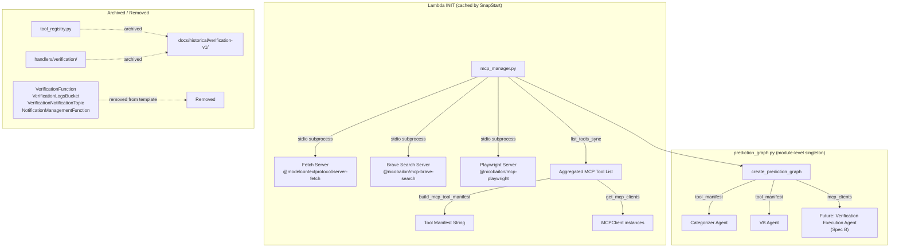

# Design Document: MCP Verification Foundation

> **⚠️ SUPERSEDED — DO NOT IMPLEMENT**
>
> This spec was split into Spec A1 (`verification-teardown-docker`) and Spec A2 (`mcp-tool-integration`) per Decision 64.
> See `.kiro/specs/verification-teardown-docker/` for the active infrastructure spec.
> Spec A2 will be created separately for MCP Manager + tool-aware agents.

## Overview

This design replaces the DynamoDB-based tool registry with MCP-native tool discovery, makes the Categorizer and Verification Builder agents tool-aware using live MCP tool lists, and tears down the old verification system. It introduces a new `mcp_manager.py` module in `handlers/strands_make_call/` that manages MCP server connections, discovers tools at Lambda INIT time, and provides both a human-readable tool manifest (for agent prompts) and raw MCP tool objects (for future agent tool wiring).

The three MCP servers (fetch, brave-search, playwright) run as subprocesses via stdio transport. Since Lambda python3.12 does NOT include Node.js, and these servers are npm packages invoked via `npx`, the design uses a Docker-based Lambda image (Option B) that includes both Python 3.12 and Node.js runtimes. This is the most reliable approach for subprocess-based MCP servers in Lambda.

The old verification system (`handlers/verification/`, SAM resources) is archived and removed. The Prompt Management stack gets a VB v3 prompt with `{{tool_manifest}}` support.

### Key Design Decisions

1. **Docker-based Lambda** for MCP subprocess support — Python 3.12 + Node.js in a single image. This avoids Lambda Layer complexity and ensures `npx` works reliably.
2. **MCP_Manager as a module-level singleton** — connections established at import time (Lambda INIT), cached by SnapStart. Same pattern as the existing `prediction_graph` singleton.
3. **MCPClient as ToolProvider** — MCPClient instances can be passed directly to `Agent(tools=[...])` for future use (Spec B verification execution agent). For now, we only use `list_tools_sync()` for manifest building.
4. **Graceful degradation** — if MCP servers fail to connect, the pipeline falls back to reasoning-only mode (empty manifest). No hard dependency on MCP availability.
5. **NotificationManagementFunction depends on SNS topic** — since the old VerificationNotificationTopic is being removed, the NotificationManagementFunction must either get its own SNS topic or be removed. Given it was built for the old verification system's email notifications, it should be removed alongside the verification system.

## Architecture



### Data Flow

1. Lambda cold start → `mcp_manager.py` imports → MCPClient connections established to 3 servers
2. `list_tools_sync()` called on each MCPClient → tools aggregated into a single list
3. `prediction_graph.py` imports `mcp_manager` → gets tool manifest string + MCPClient instances
4. `create_prediction_graph()` passes manifest to `create_categorizer_agent(tool_manifest)` and `create_verification_builder_agent(tool_manifest)`
5. Agents use the manifest in their system prompts to make tool-aware decisions
6. SnapStart caches the entire INIT phase — warm invocations reuse connections

## Components and Interfaces

### Component 1: MCP Manager (`mcp_manager.py`)

New module at `backend/calledit-backend/handlers/strands_make_call/mcp_manager.py`.

```python
"""
MCP Manager — Manages MCP server connections and tool discovery.

Replaces the DynamoDB-based tool_registry.py with MCP-native tool discovery.
Connections are established at module level (Lambda INIT) and cached by SnapStart.
"""

import os
import logging
from typing import List, Optional

from strands.mcp import MCPClient
from mcp import StdioServerParameters, stdio_client

logger = logging.getLogger(__name__)

# MCP Server configurations
MCP_SERVERS = {
    "fetch": {
        "command": "npx",
        "args": ["-y", "@modelcontextprotocol/server-fetch"],
        "env": None,
    },
    "brave_search": {
        "command": "npx",
        "args": ["-y", "@nicobailon/mcp-brave-search"],
        "env": {"BRAVE_API_KEY": os.environ.get("BRAVE_API_KEY", "")},
    },
    "playwright": {
        "command": "npx",
        "args": ["-y", "@nicobailon/mcp-playwright"],
        "env": None,
    },
}


class MCPManager:
    """Manages MCP server connections and provides tool discovery."""

    def __init__(self):
        self._clients: dict[str, MCPClient] = {}
        self._tool_list: list = []
        self._manifest: str = ""
        self._initialize()

    def _initialize(self):
        """Connect to all configured MCP servers, discover tools."""
        for name, config in MCP_SERVERS.items():
            try:
                env = {**os.environ, **(config["env"] or {})}
                client = MCPClient(
                    lambda c=config, e=env: stdio_client(
                        StdioServerParameters(
                            command=c["command"],
                            args=c["args"],
                            env=e,
                        )
                    )
                )
                client.start()
                tools = client.list_tools_sync()
                self._clients[name] = client
                self._tool_list.extend(tools)
                logger.info(f"MCP server '{name}' connected: {len(tools)} tools")
            except Exception as e:
                logger.error(f"MCP server '{name}' failed to connect: {e}")

        if not self._clients:
            logger.warning("All MCP servers failed — operating in reasoning-only mode")

        self._manifest = self._build_manifest()

    def _build_manifest(self) -> str:
        """Build human-readable tool manifest from discovered tools."""
        if not self._tool_list:
            return ""
        lines = []
        for tool in self._tool_list:
            name = getattr(tool, "name", str(tool))
            desc = getattr(tool, "description", "No description")
            lines.append(f"- {name}: {desc}")
        return "\n".join(lines)

    def get_tool_manifest(self) -> str:
        """Return human-readable tool manifest for agent prompts."""
        return self._manifest

    def get_mcp_clients(self) -> list[MCPClient]:
        """Return MCPClient instances for passing to Agent(tools=[...])."""
        return list(self._clients.values())

    def get_mcp_tools(self) -> list:
        """Return raw MCP tool objects."""
        return self._tool_list

    def shutdown(self):
        """Stop all MCP client connections."""
        for name, client in self._clients.items():
            try:
                client.stop(None, None, None)
                logger.info(f"MCP server '{name}' stopped")
            except Exception as e:
                logger.error(f"Failed to stop MCP server '{name}': {e}")


# Module-level singleton — initialized at Lambda INIT, cached by SnapStart
mcp_manager = MCPManager()
```

**Interface:**
- `mcp_manager.get_tool_manifest() → str` — for Categorizer and VB prompts
- `mcp_manager.get_mcp_clients() → List[MCPClient]` — for future Agent(tools=[...]) wiring
- `mcp_manager.get_mcp_tools() → list` — raw tool objects
- `mcp_manager.shutdown()` — cleanup

### Component 2: Updated `prediction_graph.py`

Changes to `create_prediction_graph()`:

```python
# BEFORE (DDB-based):
from tool_registry import read_active_tools, build_tool_manifest
tools = read_active_tools()
tool_manifest = build_tool_manifest(tools)

# AFTER (MCP-based):
from mcp_manager import mcp_manager
tool_manifest = mcp_manager.get_tool_manifest()
```

The categorizer call stays the same: `create_categorizer_agent(tool_manifest)`.
The VB call changes: `create_verification_builder_agent(tool_manifest)` (new parameter).

### Component 3: Updated `verification_builder_agent.py`

Add `tool_manifest` parameter to `create_verification_builder_agent()`:

```python
def create_verification_builder_agent(tool_manifest: str = "", model_id: str = None) -> Agent:
    manifest_text = tool_manifest if tool_manifest else "No tools currently registered."
    try:
        from prompt_client import fetch_prompt
        system_prompt = fetch_prompt("vb", variables={"tool_manifest": manifest_text})
    except Exception as e:
        logger.warning(f"Prompt Management unavailable, using bundled prompt: {e}")
        system_prompt = VERIFICATION_BUILDER_SYSTEM_PROMPT.format(tool_manifest=manifest_text)
    # ... rest unchanged
```

The bundled `VERIFICATION_BUILDER_SYSTEM_PROMPT` gets an `AVAILABLE TOOLS:\n{tool_manifest}` section added, matching the Categorizer's pattern.

### Component 4: Prompt Management Updates

The VB prompt in `infrastructure/prompt-management/template.yaml` gets:
1. A `{{tool_manifest}}` input variable added to the template configuration
2. An `AVAILABLE TOOLS` section in the prompt text referencing the variable
3. Instructions to use specific tool names in `source` and `steps` fields
4. Instructions to note "tool not currently available" for `automatable` predictions
5. A new `VBPromptVersionV3` resource

### Component 5: SAM Template Changes

**Removed resources:**
- `VerificationFunction` (Lambda + EventBridge schedule)
- `VerificationLogsBucket` (S3 bucket)
- `VerificationNotificationTopic` (SNS topic)
- `NotificationManagementFunction` (depends on removed SNS topic)
- Corresponding Outputs entries

**Modified resources:**
- `MakeCallStreamFunction`: Add `BRAVE_API_KEY` environment variable

**Docker image consideration:**
The MakeCallStreamFunction currently uses `Runtime: python3.12`. To support MCP server subprocesses (which need `npx`/Node.js), this needs to change to a Docker-based Lambda. This is a significant infrastructure change that should be validated in a separate deployment step. For initial development, the `BRAVE_API_KEY` env var and `mcp_manager.py` module can be developed and tested locally, with the Docker image change as a deployment prerequisite.

### Component 6: Code Archive

- `handlers/verification/` → `docs/historical/verification-v1/`
- `tool_registry.py` → `docs/historical/verification-v1/tool_registry.py`
- `web_search_tool.py` (from verification handler) already in the archive directory
- Archive includes a `README.md` documenting the old system

### Component 7: Decision Log and Backlog Updates

Three new decisions (64, 65, 66) and backlog item 7 update.

## Data Models

### MCP Server Configuration

```python
# Static configuration — no DDB storage needed
MCP_SERVERS = {
    "server_name": {
        "command": str,      # "npx"
        "args": list[str],   # ["-y", "@package/name"]
        "env": dict | None,  # Additional env vars (e.g., API keys)
    }
}
```

### Tool Manifest Format

The tool manifest is a human-readable string injected into agent prompts:

```
- fetch: Fetches a URL from the internet and extracts its contents as markdown
- brave_web_search: Performs a web search using the Brave Search API
- brave_local_search: Performs a local search using the Brave Search API
- browser_navigate: Navigate to a URL in the browser
- browser_screenshot: Take a screenshot of the current page
- browser_click: Click an element on the page
... (additional tools discovered from MCP servers)
```

This replaces the DDB-based manifest format:
```
- web_search: Search the web using DuckDuckGo
  Capabilities: web_search, fact_checking
```

### Archived DDB Tool Records

Existing `TOOL#` records in `calledit-db` remain untouched for historical reference. No production code reads them after this change.

### Environment Variables

| Variable | Source | Purpose |
|---|---|---|
| `BRAVE_API_KEY` | SSM Parameter Store / env | Brave Search API authentication |
| `PROMPT_VERSION_VB` | SAM template env | VB prompt version (bumped to "3" after deployment) |


## Correctness Properties

*A property is a characteristic or behavior that should hold true across all valid executions of a system — essentially, a formal statement about what the system should do. Properties serve as the bridge between human-readable specifications and machine-verifiable correctness guarantees.*

### Property 1: Tool aggregation preserves all tools

*For any* set of MCP servers each returning a list of tools, the aggregated MCP_Tool_List returned by `get_mcp_tools()` should contain every tool from every successfully connected server, with no tools lost or duplicated beyond what the servers themselves return.

**Validates: Requirements 1.3**

### Property 2: Partial server failure preserves surviving tools

*For any* subset of MCP servers that fail during initialization, the MCP_Manager's tool list should contain exactly the tools from the servers that succeeded, and no tools from the servers that failed. When all servers fail (edge case), the tool list should be empty and the manifest should be empty.

**Validates: Requirements 1.5, 1.6**

### Property 3: Manifest contains all tool names and descriptions

*For any* list of MCP tools with names and descriptions, the string returned by `get_tool_manifest()` should contain every tool's name and every tool's description as substrings.

**Validates: Requirements 1.7**

### Property 4: VB factory passes tool manifest through to prompt

*For any* non-empty tool manifest string, calling `create_verification_builder_agent(tool_manifest=manifest)` should produce an agent whose system prompt contains the manifest string. This validates both the factory function signature (Req 8.6) and the prompt injection (Req 3.2).

**Validates: Requirements 3.2, 8.6**

### Property 5: SAM template resource references are internally consistent

*For any* `!Ref` or `!GetAtt` reference in the updated SAM template, the referenced resource must exist in the same template's Resources section. No dangling references to removed resources (VerificationFunction, VerificationLogsBucket, VerificationNotificationTopic).

**Validates: Requirements 5.6**

### Property 6: Subprocess death triggers reconnection attempt

*For any* MCP server whose subprocess dies during a warm Lambda invocation, the MCP_Manager should detect the failure when a tool call is attempted and either return a graceful error or attempt reconnection, rather than propagating an unhandled exception.

**Validates: Requirements 7.5**

## Error Handling

### MCP Server Connection Failures

| Failure Mode | Handling | User Impact |
|---|---|---|
| Single MCP server fails to start | Log error, skip server, continue with remaining | Reduced tool coverage, some predictions may route to `automatable` instead of `auto_verifiable` |
| All MCP servers fail to start | Log warning, return empty tool list/manifest | Pipeline operates in reasoning-only mode — same behavior as before MCP integration |
| MCP subprocess dies mid-invocation | Detect failure, attempt reconnection, fall back to cached tools or empty | Degraded for that invocation, recovered on next |
| `npx` not found (Node.js missing) | All servers fail → reasoning-only mode | Deployment issue — Docker image needs Node.js |
| `BRAVE_API_KEY` missing/invalid | Brave Search server fails, others succeed | Web search unavailable, fetch and playwright still work |

### Prompt Management Failures

The existing fallback pattern in `prompt_client.py` handles Bedrock API failures by falling back to bundled prompt constants. The VB bundled prompt will be updated to include the `{tool_manifest}` placeholder, so even in fallback mode the tool manifest is injected.

### SAM Deployment Failures

If the SAM template has dangling references after resource removal, `sam deploy` will fail with a clear error. The design ensures all references to removed resources are also removed (including Outputs, NotificationManagementFunction, and any DependsOn chains).

### Archive Operations

File move operations are idempotent — if the archive directory already exists, files are overwritten. The archive README is generated fresh each time.

## Testing Strategy

### Dual Testing Approach

This feature requires both unit tests and property-based tests:

- **Unit tests**: Verify specific examples (e.g., "3 servers configured", "archive README contains expected filenames"), edge cases (all servers fail), and integration points (prediction_graph imports from mcp_manager)
- **Property tests**: Verify universal properties across randomized inputs (tool aggregation, manifest completeness, partial failure resilience)

### Property-Based Testing Configuration

- **Library**: [Hypothesis](https://hypothesis.readthedocs.io/) (already in the project's dev dependencies)
- **Minimum iterations**: 100 per property test
- **Tag format**: `Feature: mcp-verification-foundation, Property {number}: {property_text}`

Each correctness property maps to a single property-based test:

| Property | Test Strategy | Key Generators |
|---|---|---|
| P1: Tool aggregation | Generate random lists of mock tools per server, verify aggregate | `st.lists(st.fixed_dictionaries({"name": st.text(), "description": st.text()}))` |
| P2: Partial failure | Generate random failure masks for servers, verify surviving tools | `st.lists(st.booleans(), min_size=3, max_size=3)` for which servers fail |
| P3: Manifest completeness | Generate random tool names/descriptions, verify all appear in manifest string | `st.lists(st.tuples(st.text(min_size=1), st.text(min_size=1)))` |
| P4: VB manifest passthrough | Generate random manifest strings, verify they appear in the agent's prompt | `st.text(min_size=1)` for manifest content |
| P5: SAM template consistency | Parse YAML, extract all !Ref/!GetAtt targets, verify all exist in Resources | Deterministic (single template), but can be parameterized across template variants |
| P6: Subprocess death recovery | Simulate server death via mock, verify graceful handling | `st.sampled_from(["fetch", "brave_search", "playwright"])` for which server dies |

### Unit Test Coverage

Key unit tests (specific examples and edge cases):

1. **MCP_Manager initialization** — 3 servers configured, all connect successfully
2. **MCP_Manager all-fail** — all 3 servers fail, empty tool list, warning logged
3. **BRAVE_API_KEY from env** — verify env var is read, not hardcoded
4. **prediction_graph imports** — verify `mcp_manager` is imported, `tool_registry` is not
5. **VB factory signature** — `create_verification_builder_agent(tool_manifest="...")` works
6. **SAM template removed resources** — VerificationFunction, VerificationLogsBucket, VerificationNotificationTopic, NotificationManagementFunction not in template
7. **SAM template retained resources** — MakeCallStreamFunction still present with BRAVE_API_KEY env var
8. **Archive README content** — contains all 19 filenames, references Decisions 18/19/20 and Backlog item 7
9. **Prompt Management VB template** — contains `{{tool_manifest}}` input variable and AVAILABLE TOOLS section
10. **Decision log entries** — 3 new decisions present with correct references

### Test File Location

Tests go in `backend/calledit-backend/tests/strands_make_call/` following the existing test structure. New test file: `test_mcp_manager.py`.

### Mocking Strategy

MCP server connections are mocked in tests — no real subprocess spawning. The `MCPClient` class is mocked to return configurable tool lists or raise exceptions. This keeps tests fast and deterministic.

