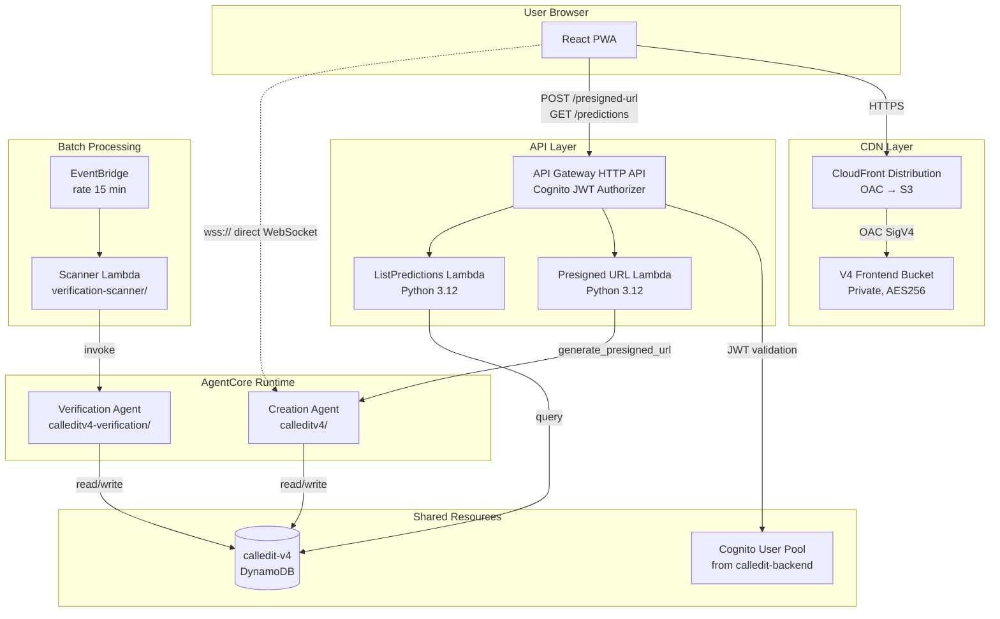
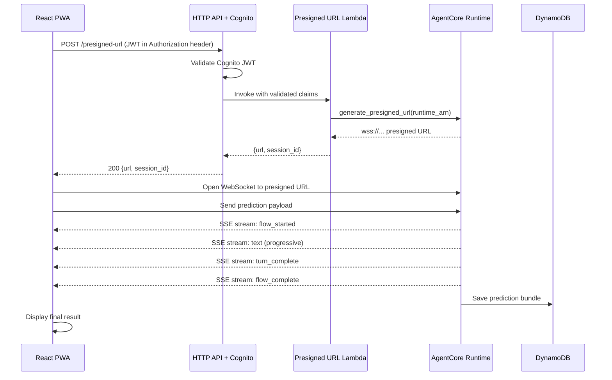

# Design Document — V4-8a: Production Cutover

## Overview

V4-8a replaces the v3 Lambda-based backend with AgentCore Runtime by deploying both v4 agents, building new frontend infrastructure (S3 + CloudFront + API Gateway HTTP API), and connecting the React PWA to the v4 agents via presigned WebSocket URLs.

The core architectural shift is from v3's proxy pattern (React → API Gateway WebSocket → Docker Lambda → Strands Agent) to v4's direct pattern (React → presigned WSS URL → AgentCore Runtime). A thin Presigned URL Lambda bridges Cognito auth to AgentCore's `generate_presigned_url()` API (Decision 110). The v3 stack stays running untouched until v4 is validated (Decision 111).

### Key Design Decisions Referenced

| Decision | Summary |
|----------|---------|
| 110 | Presigned WebSocket URL for frontend-to-agent connectivity |
| 111 | Fresh infrastructure instances for v4, v3 stays running |
| 112 | S3 bucket in separate CloudFormation template |
| 113 | Separate v4 DynamoDB table — clean break from v3 key format |
| 114 | v4 DDB table in same persistent resources template as S3 bucket |

### Scope

**In scope:** Agent deployment, S3 bucket, CloudFront + OAC, Presigned URL Lambda, API Gateway HTTP API, ListPredictions Lambda, frontend WebSocket integration, frontend API migration, scanner agent integration, infrastructure separation.

**Out of scope:** v3 teardown, Memory integration (V4-6), eval framework updates (V4-7a), custom domain, Cognito Identity Pool.

## Architecture

### System Architecture



### Prediction Creation Flow (v4)



### Infrastructure Layout

```
infrastructure/
  v4-persistent-resources/
    template.yaml              # S3 bucket + DDB table (Decision 112, 114)
  v4-frontend/
    template.yaml              # CloudFront + OAC + HTTP API + Lambdas
    presigned_url/
      handler.py               # Cognito JWT → presigned WSS URL
      requirements.txt
    list_predictions/
      handler.py               # DDB GSI query for user's predictions
      requirements.txt
  verification-scanner/        # Existing (V4-5b), updated with agent ID + table name
    template.yaml
    scanner.py
```

### Deployment Order

1. Deploy `calledit-v4-persistent-resources` stack (S3 bucket + DDB table with GSIs)
2. `agentcore launch` both agents with `DYNAMODB_TABLE_NAME=calledit-v4` → capture runtime ARNs
3. Deploy `calledit-v4-frontend` stack with runtime ARNs + Cognito params
4. Update Cognito callback URLs with new CloudFront domain
5. Build React PWA with v4 API URLs in `.env`
6. Deploy React build to S3 bucket (`aws s3 sync`)
7. Invalidate CloudFront cache
8. Update scanner Lambda with `VERIFICATION_AGENT_ID` + `DYNAMODB_TABLE_NAME=calledit-v4`, enable schedule
9. Validate end-to-end

## Components and Interfaces

### 1. V4 Persistent Resources Template (`infrastructure/v4-persistent-resources/template.yaml`)

Standalone CloudFormation template containing the S3 bucket and DynamoDB table. Separated per Decisions 112/114 so that a rollback of the main stack cannot delete a non-empty bucket or table with data.

**Resources:**
- `V4FrontendBucket` — Private S3 bucket, all public access blocked, AES256 encryption
- `V4PredictionsTable` — DynamoDB table `calledit-v4`, PAY_PER_REQUEST, with two GSIs:
  - `user_id-created_at-index` — partition: `user_id`, sort: `created_at` (for ListPredictions)
  - `status-verification_date-index` — partition: `status`, sort: `verification_date` (for scanner)

**Outputs (exported for cross-stack reference):**
- `V4FrontendBucketName`
- `V4FrontendBucketArn`
- `V4FrontendBucketRegionalDomainName`
- `V4PredictionsTableName`
- `V4PredictionsTableArn`

### 2. V4 Frontend Main Template (`infrastructure/v4-frontend/template.yaml`)

SAM template containing CloudFront, OAC, bucket policy, HTTP API, and both Lambdas.

**Parameters:**
| Parameter | Source |
|-----------|--------|
| `CognitoUserPoolId` | `calledit-backend` stack output `UserPoolId` |
| `CognitoUserPoolClientId` | `calledit-backend` stack output `UserPoolClientId` |
| `DynamoDBTableName` | `calledit-v4` from persistent resources stack |
| `CreationAgentRuntimeArn` | Output of `agentcore launch` for creation agent |
| `FrontendBucketName` | `v4-persistent-resources` stack output |
| `FrontendBucketArn` | `v4-persistent-resources` stack output |
| `FrontendBucketDomainName` | `v4-persistent-resources` stack output |

**Resources:**
- `CloudFrontOAC` — Origin Access Control (SigV4, always sign, S3 origin type)
- `CloudFrontDistribution` — HTTPS redirect, `index.html` default root, 403/404 → `/index.html` with 200 for SPA routing
- `FrontendBucketPolicy` — `s3:GetObject` for `cloudfront.amazonaws.com` principal, conditioned on distribution ARN
- `V4HttpApi` — API Gateway HTTP API with Cognito JWT authorizer
- `PresignedUrlFunction` — Python 3.12 Lambda (zip)
- `ListPredictionsFunction` — Python 3.12 Lambda (zip)

### 3. Presigned URL Lambda (`infrastructure/v4-frontend/presigned_url/handler.py`)

**Interface:**
```
POST /presigned-url
Authorization: Bearer <Cognito JWT>

Response 200:
{
  "url": "wss://...",
  "session_id": "uuid"
}

Response 401: { "error": "..." }  // Missing/invalid JWT (handled by API GW authorizer)
Response 502: { "error": "..." }  // generate_presigned_url() failure
```

**Behavior:**
1. API Gateway Cognito JWT authorizer validates the token before Lambda invocation
2. Extract `sub` (user_id) from `event.requestContext.authorizer.jwt.claims`
3. Call `AgentCoreRuntimeClient.generate_presigned_url(runtime_arn=CREATION_AGENT_RUNTIME_ARN)`
4. Return `{url, session_id}` with 200
5. On failure, return 502 with error description

**Environment Variables:**
- `CREATION_AGENT_RUNTIME_ARN` — ARN from `agentcore launch`

**IAM Permissions:**
- `bedrock:InvokeAgent` on the creation agent runtime resource

### 4. ListPredictions Lambda (`infrastructure/v4-frontend/list_predictions/handler.py`)

**Interface:**
```
GET /predictions
Authorization: Bearer <Cognito JWT>

Response 200:
{
  "results": [
    {
      "prediction_id": "pred-xxx",
      "prediction_statement": "...",
      "status": "pending|verified",
      "verification_date": "2026-04-01T00:00:00Z",
      "verifiable_category": "auto_verifiable|automatable|human_only",
      "verification_result": { "verdict": "...", "confidence": 0.95, "reasoning": "..." }
    }
  ]
}

Response 500: { "error": "..." }  // DDB query failure
```

**Behavior:**
1. Extract `sub` from JWT claims (same pattern as presigned URL Lambda)
2. Query `calledit-v4` table's `user_id-created_at-index` GSI with `user_id = {sub}`, sorted by `created_at` descending
3. Format predictions with fields: `prediction_id`, `raw_prediction`, `status`, `verification_date`, `verifiability_score`, `verification_result`, `created_at`
4. Return empty list `[]` with 200 if no predictions found
5. On DDB error, return 500

**Environment Variables:**
- `DYNAMODB_TABLE_NAME` — defaults to `calledit-v4`

**IAM Permissions:**
- `dynamodb:Query` on `calledit-v4` table and its GSIs

### 5. API Gateway HTTP API

**Routes:**
| Method | Path | Lambda | Auth |
|--------|------|--------|------|
| POST | /presigned-url | PresignedUrlFunction | Cognito JWT |
| GET | /predictions | ListPredictionsFunction | Cognito JWT |

**Cognito JWT Authorizer Configuration:**
- Issuer: `https://cognito-idp.{region}.amazonaws.com/{user_pool_id}`
- Audience: `{user_pool_client_id}`

**CORS:**
- AllowOrigins: CloudFront distribution domain + `http://localhost:5173` (dev)
- AllowHeaders: `Authorization`, `Content-Type`
- AllowMethods: `GET`, `POST`, `OPTIONS`

### 6. Frontend Changes

**New service: `agentCoreWebSocket.ts`**
Replaces the v3 `WebSocketService` and `CallService` for prediction creation:
1. Call `POST /presigned-url` with Cognito JWT
2. Open native `WebSocket` to the returned `wss://` URL
3. Send prediction payload as first message
4. Parse SSE-formatted events (`data: {...}\n\n`) from the stream
5. Emit typed events to the UI: `flow_started`, `text`, `turn_complete`, `flow_complete`
6. Handle connection errors with retry UI

**Updated components:**
- `PredictionInput.tsx` — Replace direct API call with presigned URL → WebSocket flow
- `ListPredictions.tsx` — Update endpoint from `/list-predictions` to `/predictions` on v4 HTTP API
- `apiService.ts` — Update `baseURL` to v4 HTTP API invoke URL
- `.env` — Add `VITE_V4_API_URL` for the HTTP API invoke URL

**Unchanged:**
- `AuthContext.tsx` — Cognito auth flow stays the same, just add CloudFront domain to redirect URIs
- `authService.ts` — Token management unchanged

### 7. AgentCore WebSocket Message Format

The creation agent's async handler yields events. AgentCore wraps these in SSE format over WebSocket:

```
data: {"type": "flow_started", "prediction_id": "pred-xxx", "data": {...}}\n\n
data: {"type": "text", "prediction_id": "pred-xxx", "data": {"content": "..."}}\n\n
data: {"type": "turn_complete", "prediction_id": "pred-xxx", "data": {...}}\n\n
data: {"type": "flow_complete", "prediction_id": "pred-xxx", "data": {...}}\n\n
```

The frontend SSE parser splits on `\n\n`, strips the `data: ` prefix, and `JSON.parse`s each event.

## Data Models

### DynamoDB Schema (`calledit-v4` — New Table)

Clean v4 schema. No v3 key format compatibility.

**Table Keys:**
| Attribute | Type | Description |
|-----------|------|-------------|
| `PK` | String | `PRED#{prediction_id}` |
| `SK` | String | `BUNDLE` |

**GSI: `user_id-created_at-index`:**
| Attribute | Role | Type |
|-----------|------|------|
| `user_id` | Partition Key | String (Cognito `sub`) |
| `created_at` | Sort Key | String (ISO 8601) |

**GSI: `status-verification_date-index`:**
| Attribute | Role | Type |
|-----------|------|------|
| `status` | Partition Key | String (`pending`, `verified`, `inconclusive`) |
| `verification_date` | Sort Key | String (ISO 8601) |

**Prediction Item Attributes:**
| Attribute | Type | Description |
|-----------|------|-------------|
| `prediction_id` | String | Unique prediction identifier |
| `user_id` | String | Cognito `sub` claim |
| `raw_prediction` | String | User's original prediction text |
| `parsed_claim` | Map | `{statement, verification_date, date_reasoning}` |
| `verification_plan` | Map | `{sources: [], criteria: [], steps: []}` |
| `verifiability_score` | Number | 0.0–1.0 |
| `verification_date` | String | ISO 8601 UTC (top-level for GSI) |
| `status` | String | `pending`, `verified`, `inconclusive` |
| `created_at` | String | ISO 8601 UTC |
| `verdict` | String | Set by verification agent |
| `confidence` | Number | Set by verification agent |
| `reasoning` | String | Set by verification agent |
| `verified_at` | String | Set by verification agent |

### CloudFormation Outputs

**`calledit-v4-persistent-resources` stack:**
| Output | Value |
|--------|-------|
| `V4FrontendBucketName` | Bucket name |
| `V4FrontendBucketArn` | Bucket ARN |
| `V4FrontendBucketRegionalDomainName` | Regional domain for CloudFront origin |
| `V4PredictionsTableName` | `calledit-v4` |
| `V4PredictionsTableArn` | Table ARN |

**`calledit-v4-frontend` stack:**
| Output | Value |
|--------|-------|
| `CloudFrontDomainName` | `xxx.cloudfront.net` |
| `CloudFrontDistributionId` | For cache invalidation |
| `HttpApiUrl` | API Gateway invoke URL |

### Frontend Environment Variables

```env
# V4 API (replaces VITE_APIGATEWAY for v4 routes)
VITE_V4_API_URL=https://{http-api-id}.execute-api.{region}.amazonaws.com

# Cognito (unchanged, add v4 CloudFront to redirect URIs)
VITE_COGNITO_PROD_REDIRECT_URI=https://{cloudfront-domain}.cloudfront.net/
```


## Correctness Properties

*A property is a characteristic or behavior that should hold true across all valid executions of a system — essentially, a formal statement about what the system should do. Properties serve as the bridge between human-readable specifications and machine-verifiable correctness guarantees.*

### Property 1: S3 Bucket Security Configuration

*For any* S3 bucket resource defined in the v4 CloudFormation templates, the bucket must have `AccessControl` set to `Private`, all four `PublicAccessBlockConfiguration` settings (`BlockPublicAcls`, `BlockPublicPolicy`, `IgnorePublicAcls`, `RestrictPublicBuckets`) set to `true`, and `SSEAlgorithm` set to `AES256`.

**Validates: Requirements 2.2, 2.3, 2.4**

### Property 2: JWT Claim Extraction

*For any* API Gateway HTTP API event containing valid Cognito JWT authorizer claims with a `sub` field, both the Presigned URL Lambda and ListPredictions Lambda shall extract the `user_id` as the value of the `sub` claim from `event.requestContext.authorizer.jwt.claims`.

**Validates: Requirements 4.3, 6.3**

### Property 3: Presigned URL Response Format

*For any* successful call to `generate_presigned_url()`, the Presigned URL Lambda shall return HTTP 200 with a JSON body containing a `url` field that starts with `wss://` and a `session_id` field that is a valid UUID string.

**Validates: Requirements 4.5**

### Property 4: Prediction List Formatting

*For any* set of DynamoDB prediction items returned for a user, the ListPredictions Lambda shall return a JSON response where each prediction in the `results` array contains `prediction_id`, `prediction_statement`, `status`, `verification_date`, and `verifiable_category` fields, and optionally `verification_result` when available.

**Validates: Requirements 6.5**

### Property 5: SSE Stream Event Parsing

*For any* valid SSE-formatted string received over the AgentCore WebSocket (matching the pattern `data: {json}\n\n`), the frontend SSE parser shall extract and return a valid JSON object with a `type` field.

**Validates: Requirements 7.3**

## Error Handling

### Presigned URL Lambda

| Error Condition | Response | Behavior |
|----------------|----------|----------|
| Missing/invalid JWT | HTTP 401 | Handled by API Gateway Cognito authorizer before Lambda invocation |
| `generate_presigned_url()` failure | HTTP 502 | Lambda catches exception, returns `{"error": "..."}` with failure description |
| Unexpected exception | HTTP 500 | Lambda catches all exceptions, returns generic error |

### ListPredictions Lambda

| Error Condition | Response | Behavior |
|----------------|----------|----------|
| Missing/invalid JWT | HTTP 401 | Handled by API Gateway Cognito authorizer |
| DynamoDB `ClientError` | HTTP 500 | Lambda catches, returns `{"error": "Database error: ..."}` |
| No predictions found | HTTP 200 | Returns `{"results": []}` — not an error |
| Unexpected exception | HTTP 500 | Lambda catches, returns `{"error": "Unexpected error: ..."}` |

### Frontend WebSocket

| Error Condition | UI Behavior |
|----------------|-------------|
| Presigned URL request fails (network/401/502) | Display error message, allow retry |
| WebSocket connection fails | Display connection error, allow retry |
| WebSocket drops mid-stream | Display partial results + error, allow retry |
| SSE parse error (malformed event) | Log warning, skip malformed event, continue processing |

### Scanner Lambda

Error handling is unchanged from V4-5b. The scanner's `lambda_handler` catches exceptions per-prediction and continues processing remaining predictions. Failures are logged and included in the summary response.

## Testing Strategy

### Testing Approach

This spec uses a dual testing approach:
- **Unit tests** for specific examples, edge cases, and error conditions
- **Property-based tests** for universal properties across generated inputs

Property-based tests use the **Hypothesis** library (Python) and **fast-check** (TypeScript/frontend). Each property test runs a minimum of 100 iterations and references its design document property.

### Property-Based Tests

Each correctness property maps to a single property-based test:

| Property | Test Location | Library | Tag |
|----------|--------------|---------|-----|
| 1: S3 Bucket Security | `infrastructure/v4-frontend-bucket/tests/` | Hypothesis | Feature: production-cutover, Property 1: S3 bucket security configuration |
| 2: JWT Claim Extraction | `infrastructure/v4-frontend/tests/` | Hypothesis | Feature: production-cutover, Property 2: JWT claim extraction |
| 3: Presigned URL Response | `infrastructure/v4-frontend/tests/` | Hypothesis | Feature: production-cutover, Property 3: Presigned URL response format |
| 4: Prediction List Formatting | `infrastructure/v4-frontend/tests/` | Hypothesis | Feature: production-cutover, Property 4: Prediction list formatting |
| 5: SSE Parsing | `frontend/src/tests/` | fast-check | Feature: production-cutover, Property 5: SSE stream event parsing |

### Unit Tests

| Test | What it validates |
|------|-------------------|
| Presigned URL Lambda — happy path | Returns 200 with wss:// URL for valid event |
| Presigned URL Lambda — generate_presigned_url failure | Returns 502 with error message |
| ListPredictions Lambda — happy path | Returns formatted predictions for valid user |
| ListPredictions Lambda — empty results | Returns 200 with empty list |
| ListPredictions Lambda — DDB error | Returns 500 with error message |
| SSE parser — multi-event stream | Correctly splits and parses multiple events |
| SSE parser — malformed event | Skips bad events, continues parsing |
| CloudFormation template — OAC not OAI | Verifies CloudFront uses OAC |
| CloudFormation template — SPA error pages | Verifies 403/404 → index.html routing |
| CloudFormation template — HTTP API routes | Verifies POST /presigned-url and GET /predictions routes exist |

### Integration Tests (Manual)

These tests hit real deployed services and are run manually during cutover:

1. `agentcore invoke` both agents — verify responses
2. Call `POST /presigned-url` with valid Cognito JWT — verify wss:// URL returned
3. Open WebSocket to presigned URL — verify streaming works
4. Call `GET /predictions` — verify prediction list returned
5. Load CloudFront URL — verify React PWA loads
6. Full flow: login → make prediction → verify streaming → check prediction list
7. Enable scanner schedule → check CloudWatch logs for verification runs
