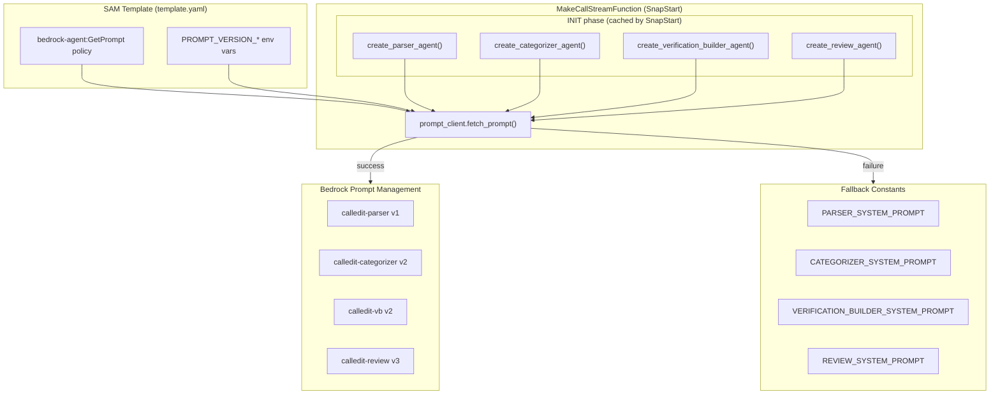

# Design Document: Production Prompt Management Wiring

## Overview

This feature wires the production `MakeCallStreamFunction` Lambda to use Bedrock Prompt Management for its 4 agent system prompts (parser, categorizer, VB, review). The `prompt_client.py` module already contains the fetch-and-fallback logic — the Lambda just lacks the IAM permission (`bedrock-agent:GetPrompt`) and the environment variables (`PROMPT_VERSION_*`) needed to call the API.

The change is purely infrastructure + constant updates:
1. Add a `bedrock-agent:GetPrompt` IAM policy statement to the SAM template
2. Add an `Environment` block with 4 `PROMPT_VERSION_*` env vars pinned to eval-validated versions
3. Update the 4 hardcoded `*_SYSTEM_PROMPT` fallback constants to match the latest Prompt Management text

No new modules, no new runtime logic, no changes to `prompt_client.py`.

## Architecture

The existing architecture already supports Prompt Management — the wiring just isn't active in production yet.



### Key Design Decisions

1. **`Resource: '*'` for GetPrompt** — Matches the existing `bedrock:InvokeModel` pattern in the same template. Prompt identifiers are 10-character IDs that aren't predictable ARN paths, so wildcard is the pragmatic choice. This is consistent with how the template already handles Bedrock permissions.

2. **Separate IAM statement vs. merging into existing Bedrock statement** — `bedrock-agent:GetPrompt` uses the `bedrock-agent` service namespace, not `bedrock`. These are different IAM service prefixes and cannot share a single Action list. A new Statement block is required.

3. **No changes to prompt_client.py** — The module already reads `PROMPT_VERSION_{AGENT_NAME}` from env vars, defaults to `"DRAFT"`, handles fallback, logs versions, and resolves `{{variable}}` syntax. It's complete as-is.

4. **SnapStart caching** — Agent factories run during Lambda INIT. The fetched prompt text is baked into each Agent's `system_prompt` attribute and frozen by SnapStart. Warm invocations never call the Prompt Management API. This means env var changes require a new deployment (to trigger a new SnapStart snapshot), which is the desired behavior for version pinning.

## Components and Interfaces

### Component 1: SAM Template IAM Policy Addition

**File**: `backend/calledit-backend/template.yaml`

Add a new IAM policy statement to the `MakeCallStreamFunction.Policies` list:

```yaml
- Statement:
    - Effect: Allow
      Action:
        - 'bedrock-agent:GetPrompt'
      Resource: '*'
```

This goes after the existing Bedrock `InvokeModel` statement. The `bedrock-agent` service prefix is distinct from `bedrock`, so it needs its own Statement block.

### Component 2: SAM Template Environment Variables

**File**: `backend/calledit-backend/template.yaml`

Add an `Environment` block to `MakeCallStreamFunction.Properties` (none exists currently):

```yaml
Environment:
  Variables:
    PROMPT_VERSION_PARSER: "1"
    PROMPT_VERSION_CATEGORIZER: "2"
    PROMPT_VERSION_VB: "2"
    PROMPT_VERSION_REVIEW: "3"
```

These values are the latest eval-validated versions from the Prompt Management stack. The `prompt_client.py` already reads these via `os.environ.get(f"PROMPT_VERSION_{agent_name.upper()}", "DRAFT")`.

### Component 3: Fallback Constant Updates

**Files**: 4 agent modules in `backend/calledit-backend/handlers/strands_make_call/`

Each agent module's `*_SYSTEM_PROMPT` constant must be updated to match the text from the corresponding Prompt Management version:

| Agent Module | Constant | Source Version |
|---|---|---|
| `parser_agent.py` | `PARSER_SYSTEM_PROMPT` | calledit-parser v1 |
| `categorizer_agent.py` | `CATEGORIZER_SYSTEM_PROMPT` | calledit-categorizer v2 |
| `verification_builder_agent.py` | `VERIFICATION_BUILDER_SYSTEM_PROMPT` | calledit-vb v2 |
| `review_agent.py` | `REVIEW_SYSTEM_PROMPT` | calledit-review v3 |

#### Categorizer Variable Syntax

The categorizer prompt uses dual variable syntax that must be preserved:
- **Prompt Management**: `{{tool_manifest}}` (double-brace, Bedrock template variable)
- **Fallback constant**: `{tool_manifest}` (single-brace, Python `.format()`)

The `prompt_client.py` already handles this: it uses `replace("{{" + var_name + "}}", var_value)` for Prompt Management responses and `replace("{" + var_name + "}", var_value)` for fallback constants.

#### Diff Summary

The parser v1 prompt has a minor wording change in the JSON output instruction ("No markdown code blocks, no backticks, no explanation text before or after the JSON. The first character of your response must be { and the last must be }." vs the current "Do not wrap in markdown code blocks. Do not include any text before or after the JSON.").

The categorizer v2 prompt is identical to the current fallback (the v2 version expanded `human_only` definition, which is already in the current code constant).

The VB v2 prompt is substantially longer — it adds the "HANDLING VAGUE OR SUBJECTIVE PREDICTIONS" section (Track 1 operationalization, Track 2 self-report) and the "SPECIFICITY MATCHING" section. The current fallback is the shorter v1 text.

The review v3 prompt is substantially different — it replaces the generic "meta-analysis" prompt with targeted "find specific assumptions in the Verification Builder's output" instructions. The current fallback is the v1 text.

### Interface: prompt_client.py (No Changes)

The existing `fetch_prompt()` interface is unchanged:

```python
def fetch_prompt(
    agent_name: str,                          # "parser", "categorizer", "vb", "review"
    version: Optional[str] = None,            # reads from env var if None
    variables: Optional[Dict[str, str]] = None # e.g., {"tool_manifest": "..."}
) -> str:
```

Each agent factory already calls this correctly:
- `parser_agent.py`: `fetch_prompt("parser")`
- `categorizer_agent.py`: `fetch_prompt("categorizer", variables={"tool_manifest": manifest_text})`
- `verification_builder_agent.py`: `fetch_prompt("vb")`
- `review_agent.py`: `fetch_prompt("review")`

## Data Models

### Environment Variables

| Variable | Type | Value | Read By |
|---|---|---|---|
| `PROMPT_VERSION_PARSER` | string | `"1"` | `prompt_client.fetch_prompt("parser")` |
| `PROMPT_VERSION_CATEGORIZER` | string | `"2"` | `prompt_client.fetch_prompt("categorizer")` |
| `PROMPT_VERSION_VB` | string | `"2"` | `prompt_client.fetch_prompt("vb")` |
| `PROMPT_VERSION_REVIEW` | string | `"3"` | `prompt_client.fetch_prompt("review")` |

### Prompt Version Manifest

The `prompt_client.py` maintains a module-level `_prompt_version_manifest` dict that records what was actually fetched:

```python
# Success case:
{"parser": "1", "categorizer": "2", "vb": "2", "review": "3"}

# Partial failure case:
{"parser": "1", "categorizer": "fallback", "vb": "2", "review": "3"}

# Full failure case (no IAM permission):
{"parser": "fallback", "categorizer": "fallback", "vb": "fallback", "review": "fallback"}
```

### Bedrock GetPrompt Response Structure

The `prompt_client.py` already parses this — documented here for reference:

```json
{
  "variants": [{
    "templateConfiguration": {
      "text": {
        "text": "You are a prediction parser..."
      }
    }
  }],
  "version": "1"
}
```


## Correctness Properties

*A property is a characteristic or behavior that should hold true across all valid executions of a system — essentially, a formal statement about what the system should do. Properties serve as the bridge between human-readable specifications and machine-verifiable correctness guarantees.*

### Property 1: Environment variable passthrough to API call

*For any* valid agent name ("parser", "categorizer", "vb", "review") and *for any* version string set in the corresponding `PROMPT_VERSION_{AGENT_NAME}` environment variable, calling `fetch_prompt(agent_name)` shall pass that version string as the `promptVersion` parameter to the `bedrock-agent:GetPrompt` API call.

**Validates: Requirements 2.5**

### Property 2: Fallback on API failure

*For any* valid agent name and *for any* exception raised by the `bedrock-agent:GetPrompt` API call, `fetch_prompt()` shall return the bundled fallback constant for that agent AND record `"fallback"` as that agent's entry in the prompt version manifest.

**Validates: Requirements 3.1, 3.2**

### Property 3: Variable substitution on both paths

*For any* variable name and variable value, when passed to `fetch_prompt()` via the `variables` parameter:
- On the API success path, `{{variable_name}}` in the Prompt Management response text shall be replaced with the variable value.
- On the fallback path, `{variable_name}` in the fallback constant shall be replaced with the variable value.

**Validates: Requirements 3.3, 3.4, 4.5**

### Property 4: Successful fetch records numeric version

*For any* valid agent name, when the `bedrock-agent:GetPrompt` API call succeeds and returns a response with a `version` field, `fetch_prompt()` shall record that version string in the prompt version manifest for that agent (not `"fallback"`).

**Validates: Requirements 5.1, 5.2**

## Error Handling

### Prompt Management API Failures

The `prompt_client.py` already handles all failure modes with a broad `except Exception` catch:

1. **No IAM permission** (`AccessDeniedException`) — Falls back to bundled constant, logs error, records `"fallback"` in manifest.
2. **Prompt not found** (`ResourceNotFoundException`) — Same fallback path.
3. **Network timeout** — Same fallback path.
4. **Empty response** (no variants or empty text) — Raises `ValueError` internally, caught by the same `except` block.
5. **Unknown agent name** — Returns empty string from fallback dict, logs error. No API call attempted.

### SnapStart Implications

If the Prompt Management API is down during a cold start (new SnapStart snapshot creation), the Lambda will start with fallback prompts baked into the snapshot. All subsequent warm invocations will use those fallback prompts until a new deployment triggers a new snapshot. This is acceptable — the fallback constants are kept in sync with the latest Prompt Management versions by Requirement 4.

### No Retry Logic

The `prompt_client.py` does not retry failed API calls. This is intentional:
- INIT phase has a time budget; retries could cause cold start timeouts.
- The fallback path provides identical prompt text (after Requirement 4 updates).
- SnapStart means cold starts are rare; a transient failure affects at most one snapshot.

## Testing Strategy

### Property-Based Tests (Hypothesis)

Each correctness property maps to a single property-based test using the `hypothesis` library. Tests mock the `boto3` bedrock-agent client to avoid real API calls.

Configuration:
- Minimum 100 iterations per property test (Hypothesis default is 100)
- Each test tagged with: `Feature: production-prompt-management, Property {N}: {title}`

| Property | Test Description | Generator Strategy |
|---|---|---|
| 1 | Env var passthrough | `st.sampled_from(["parser", "categorizer", "vb", "review"])` × `st.from_regex(r'[1-9][0-9]{0,2}', fullmatch=True)` |
| 2 | Fallback on failure | `st.sampled_from(agent_names)` × `st.sampled_from([Exception, ConnectionError, ValueError, ClientError])` |
| 3 | Variable substitution | `st.text(alphabet=st.characters(whitelist_categories=('L', 'N')), min_size=1)` for var names and values |
| 4 | Successful fetch version | `st.sampled_from(agent_names)` × `st.from_regex(r'[1-9][0-9]{0,2}', fullmatch=True)` |

### Unit Tests (pytest)

Unit tests cover specific examples and structural checks that aren't property-based:

1. **SAM template structure** — Parse `template.yaml` as YAML, verify:
   - `MakeCallStreamFunction.Policies` contains a statement with `bedrock-agent:GetPrompt` action and `Resource: '*'`
   - `MakeCallStreamFunction.Environment.Variables` contains all 4 `PROMPT_VERSION_*` vars with correct values

2. **Fallback constant content** — Verify each `*_SYSTEM_PROMPT` constant contains expected key phrases from the corresponding Prompt Management version (e.g., VB constant contains "HANDLING VAGUE OR SUBJECTIVE PREDICTIONS", review constant contains "find specific assumptions").

3. **Categorizer variable syntax** — Verify `CATEGORIZER_SYSTEM_PROMPT` contains `{tool_manifest}` (single-brace for `.format()`) and does NOT contain `{{tool_manifest}}` (double-brace is for Prompt Management only).

4. **Manifest starts empty** — After `reset_manifest()`, `get_prompt_version_manifest()` returns `{}`.
