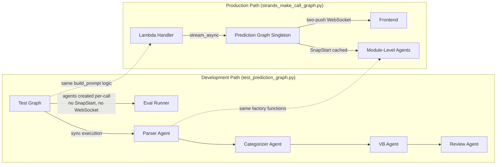
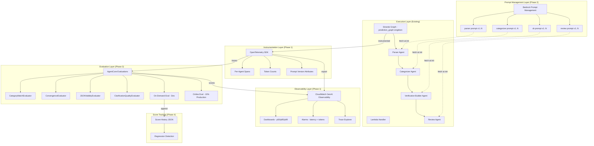
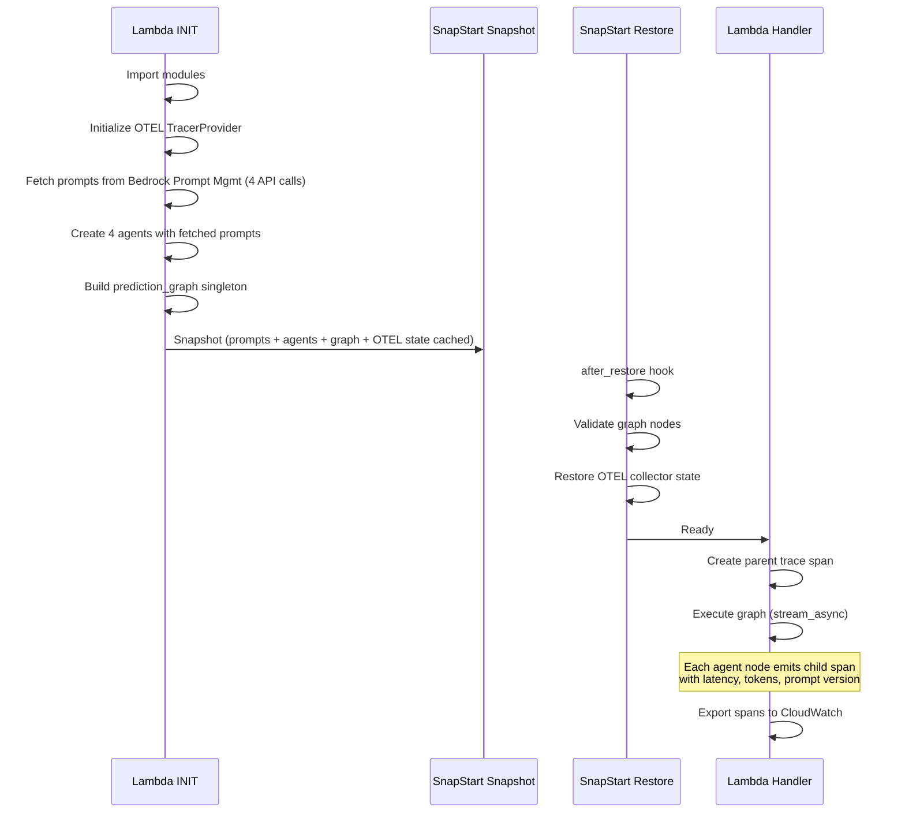

# Design Document: Prompt Evaluation Framework

## Overview

This design describes a prompt evaluation and observability system for the CalledIt prediction verification app. The system layers three managed AWS services onto the existing 4-agent Strands graph (Parser → Categorizer → Verification Builder → ReviewAgent) running on Lambda with SnapStart:

1. **OpenTelemetry + CloudWatch GenAI Observability** (Phase 1) — Per-agent spans with latency, token counts, and trace context. Dashboards and alarms for operational health.
2. **Bedrock Prompt Management** (Phase 2) — Migrate hardcoded `*_SYSTEM_PROMPT` constants to versioned managed prompts with immutable version numbers and variables support.
3. **AgentCore Evaluations** (Phase 3) — Four custom evaluators (CategoryMatch, Convergence, JSONValidity, ClarificationQuality) scoring OTEL traces at the span level. On-demand evaluation against a golden dataset and online evaluation sampling 10% of production traffic.
4. **Score Tracking** (Phase 4) — Persistent score history correlated with prompt version manifests for regression detection.

The app runtime stays low-cost serverless (Lambda + SAM + DynamoDB). The managed services apply only to the testing, evaluation, and observability layers.

### Key Constraints

- Agents are module-level singletons created once at cold start and reused across warm Lambda invocations (SnapStart). System prompts are baked in at creation time — dynamic per-invocation prompts are not viable.
- The categorizer agent receives a `tool_manifest` injected into its system prompt at creation time via `create_categorizer_agent(tool_manifest)`.
- Round context (previous outputs, clarifications) flows through the user prompt, not the system prompt. The system prompt has a static "refinement mode" block that activates conditionally.
- The Lambda handler builds different prompts for round 1 vs round 2+ via `build_prompt(state)`.
- The frontend holds session state (stateless backend). The backend builds state from `current_state` sent by the frontend on each clarify request.
- The graph uses `stream_async` for two-push WebSocket delivery (prediction_ready when VB completes, review_ready when Review completes).

### Standalone Test Graph (Phase 0 — SnapStart Decoupling)

The SnapStart constraints above make iterating on OTEL instrumentation, prompt fetching, and evaluators painful — every change would require a Lambda deploy + snapshot cycle. To solve this, Phase 0 creates a **standalone test graph** (`test_prediction_graph.py`) that:

- Reuses the same `create_*_agent()` factory functions and `build_prompt()` logic as production
- Runs **synchronously** — no `stream_async`, no WebSocket two-push delivery, no SnapStart hooks
- Creates agents fresh per invocation (not module-level singletons) — this lets us test different prompt versions without restarting
- Exposes a simple `run_test_graph(prediction_text, timezone, tool_manifest, round, clarifications, prev_outputs)` function that returns parsed results as a dict
- Is the execution target for the on-demand evaluation runner (Component 5) during development

This means the eval framework develops and runs entirely locally. The Lambda handler and SnapStart integration are only touched when wiring OTEL export (Phase 1, task 2.5) and prompt fetch caching (Phase 2, task 4.4) into the production path.



## Architecture

### System Architecture



### SnapStart Lifecycle with OTEL + Prompt Fetch




## Components and Interfaces

### Component 1: OTEL Instrumentation Module (`otel_instrumentation.py`)

Responsible for initializing the OpenTelemetry TracerProvider, configuring the CloudWatch exporter, and providing span-creation utilities for the graph execution.

```python
# otel_instrumentation.py — new module in handlers/strands_make_call/

from opentelemetry import trace
from opentelemetry.sdk.trace import TracerProvider
from opentelemetry.sdk.trace.export import BatchSpanProcessor
# CloudWatch OTEL exporter (aws-opentelemetry-distro)
from amazon.opentelemetry.distro import AwsOpenTelemetryDistro

# Module-level initialization (cached by SnapStart)
def init_otel() -> trace.Tracer:
    """Initialize OTEL TracerProvider with CloudWatch exporter.
    Called once at module level, cached by SnapStart snapshot."""
    ...

def create_graph_span(tracer, prompt_version_manifest: dict) -> trace.Span:
    """Create parent span for a full graph execution.
    Records prompt_version_manifest as span attributes."""
    ...

def record_agent_span_attributes(span, agent_name: str, prompt_id: str, prompt_version: int,
                                  input_tokens: int, output_tokens: int, model_id: str):
    """Record per-agent attributes on an agent span."""
    ...
```

**Integration point**: The `prediction_graph.py` module imports `init_otel()` at module level. The `strands_make_call_graph.py` handler wraps `execute_and_deliver()` in a parent trace span. Strands' native OTEL support emits per-agent child spans automatically when the TracerProvider is configured.

**SnapStart compatibility**: The TracerProvider is initialized at INIT time and included in the snapshot. The `after_restore` hook in `snapstart_hooks.py` is extended to verify the OTEL collector state and re-initialize if needed. The BatchSpanProcessor's background thread is restored by SnapStart's CRaC support.

**Failure mode**: If the OTEL exporter fails, spans are dropped silently (fire-and-forget). The graph execution continues unaffected. Failures are logged at WARN level.

### Component 2: Prompt Management Client (`prompt_client.py`)

Responsible for fetching prompt text from Bedrock Prompt Management and resolving variables. Provides a fallback to bundled prompt copies.

```python
# prompt_client.py — new module in handlers/strands_make_call/

import boto3
from typing import Optional

# Bundled fallback prompts (current hardcoded constants, kept as safety net)
FALLBACK_PROMPTS = {
    "parser": PARSER_SYSTEM_PROMPT,       # from parser_agent.py
    "categorizer": CATEGORIZER_SYSTEM_PROMPT,  # from categorizer_agent.py
    "verification_builder": VERIFICATION_BUILDER_SYSTEM_PROMPT,
    "review": REVIEW_SYSTEM_PROMPT,
}

def fetch_prompt(prompt_identifier: str, prompt_version: str,
                 variables: Optional[dict] = None) -> str:
    """Fetch prompt text from Bedrock Prompt Management.
    
    Args:
        prompt_identifier: e.g., "calledit-parser"
        prompt_version: e.g., "3" (immutable version number)
        variables: Optional dict of variable values to resolve
                   e.g., {"tool_manifest": manifest_text}
    
    Returns:
        Resolved prompt text string
    
    Raises:
        Falls back to FALLBACK_PROMPTS[prompt_identifier] on API failure
    """
    ...

def get_prompt_version_manifest() -> dict:
    """Return the current prompt version manifest.
    
    Returns:
        {"parser": "3", "categorizer": "5", "vb": "2", "review": "4"}
    """
    ...
```

**Integration point**: The `create_*_agent()` factory functions in each agent module are modified to call `fetch_prompt()` instead of using the hardcoded `*_SYSTEM_PROMPT` constant. The version numbers are read from environment variables or a config file, defaulting to "1" (the initial migration version).

**Categorizer special case**: The categorizer prompt contains a `{tool_manifest}` variable. This is resolved at agent creation time via the `variables` parameter, same as the current `CATEGORIZER_SYSTEM_PROMPT.format(tool_manifest=manifest_text)` pattern.

**SnapStart caching**: `fetch_prompt()` is called during INIT (at agent creation time). The fetched prompt text is baked into the agent's `system_prompt` attribute, which is included in the SnapStart snapshot. Warm invocations never call Bedrock Prompt Management.

**Fallback**: If the Bedrock API call fails, the function logs at ERROR level and returns the bundled fallback prompt. This ensures the Lambda can always start, even if Bedrock Prompt Management is unavailable.

### Component 3: Golden Dataset Schema and Loader (`golden_dataset.py`)

Responsible for loading, validating, and providing access to the golden dataset JSON file.

```python
# golden_dataset.py — new module in handlers/strands_make_call/ or eval/ directory

from dataclasses import dataclass
from typing import List, Optional, Dict, Any

@dataclass
class ExpectedAgentOutputs:
    """Expected outputs for each agent individually."""
    parser: Dict[str, Any]        # {prediction_statement, verification_date, date_reasoning}
    categorizer: Dict[str, Any]   # {verifiable_category, category_reasoning}
    verification_builder: Dict[str, Any]  # {verification_method: {source, criteria, steps}}
    review: Optional[Dict[str, Any]]      # {reviewable_sections: [...]}

@dataclass
class BasePrediction:
    """Layer 1: Fully-specified prediction requiring zero clarification."""
    id: str
    prediction_text: str
    difficulty: str  # "easy", "medium", "hard"
    tool_manifest_config: Dict[str, Any]  # {tools: [{name, description, capabilities}]}
    expected_per_agent_outputs: ExpectedAgentOutputs

@dataclass
class FuzzyPrediction:
    """Layer 2: Degraded prediction requiring clarification to converge."""
    id: str
    fuzzy_text: str
    base_prediction_id: str  # Reference to corresponding BasePrediction
    simulated_clarifications: List[str]  # Answers to provide in round 2
    expected_clarification_topics: List[str]  # Keywords expected in ReviewAgent questions
    expected_post_clarification_outputs: ExpectedAgentOutputs

@dataclass
class GoldenDataset:
    """Top-level dataset container."""
    schema_version: str  # e.g., "1.0"
    base_predictions: List[BasePrediction]
    fuzzy_predictions: List[FuzzyPrediction]

def load_golden_dataset(path: str = "eval/golden_dataset.json") -> GoldenDataset:
    """Load and validate the golden dataset from JSON file."""
    ...

def filter_test_cases(dataset: GoldenDataset, 
                       name: str = None, category: str = None,
                       layer: str = None, difficulty: str = None) -> List:
    """Filter test cases by name, category, layer, or difficulty."""
    ...
```

**Schema version field**: The JSON file includes `"schema_version": "1.0"` at the top level. The loader validates this field and raises an error if the version is unsupported, enabling future format migrations.

**Coverage requirements**: At least 15 base predictions covering all three verifiability categories (≥3 per category), and at least 3 fuzzy predictions where clarification improves precision without changing the category.

### Component 4: Custom Evaluators (`evaluators/`)

Four AgentCore custom evaluators, each implementing domain-specific scoring logic.

**CategoryMatchEvaluator**: Deterministic binary score. Compares the categorizer span's `verifiable_category` output against the golden dataset expected category. Score is 1.0 (match) or 0.0 (mismatch).

**JSONValidityEvaluator**: Structural score (0.0–1.0). Checks field presence and type correctness per agent:
- Parser: requires `prediction_statement` (str), `verification_date` (str), `date_reasoning` (str)
- Categorizer: requires `verifiable_category` (str in VALID_CATEGORIES), `category_reasoning` (str)
- Verification Builder: requires `verification_method` with `source`, `criteria`, `steps` as non-empty lists

Score = (fields_present_and_correct / total_expected_fields). Malformed JSON that can't be parsed scores 0.0.

**ConvergenceEvaluator**: Compares round 2 per-agent outputs against the corresponding base prediction's expected outputs. Scoring weights:
- Verifiability category match: 0.5 weight
- Prediction statement similarity: 0.2 weight
- Verification method overlap: 0.2 weight
- Date accuracy: 0.1 weight

**ClarificationQualityEvaluator**: Proportion of expected topic keywords from the golden dataset that appear in the ReviewAgent's generated clarification questions. Score = keywords_found / total_expected_keywords.

```python
# evaluators/category_match.py
def evaluate_category_match(span_output: dict, expected: dict) -> dict:
    """Deterministic binary score for category match.
    Returns: {"score": 0.0 or 1.0, "evaluator": "CategoryMatch", "span_id": ...}
    """
    ...

# evaluators/json_validity.py  
def evaluate_json_validity(span_output: str, agent_name: str) -> dict:
    """Structural score based on field presence and type correctness.
    Returns: {"score": 0.0-1.0, "evaluator": "JSONValidity", "span_id": ..., "error": ...}
    """
    ...

# evaluators/convergence.py
def evaluate_convergence(round2_outputs: dict, base_expected: dict) -> dict:
    """Weighted convergence score comparing round 2 to base prediction.
    Returns: {"score": 0.0-1.0, "evaluator": "Convergence", "span_id": ...}
    """
    ...

# evaluators/clarification_quality.py
def evaluate_clarification_quality(review_output: dict, expected_topics: list) -> dict:
    """Topic keyword coverage score for ReviewAgent questions.
    Returns: {"score": 0.0-1.0, "evaluator": "ClarificationQuality", "span_id": ...}
    """
    ...
```

### Component 5: On-Demand Evaluation Runner (`eval_runner.py`)

CLI-invokable script that loads the golden dataset, executes test cases through the OTEL-instrumented graph, submits traces to AgentCore for evaluation, and produces a report.

```python
# eval_runner.py

def run_on_demand_evaluation(
    dataset_path: str = "eval/golden_dataset.json",
    filter_name: str = None,
    filter_category: str = None,
    filter_layer: str = None,
    filter_difficulty: str = None,
    dry_run: bool = False
) -> dict:
    """Run on-demand evaluation against the golden dataset.
    
    For base predictions: executes round 1, submits trace for evaluation.
    For fuzzy predictions: executes round 1, constructs round 2 with
    simulated clarifications, executes round 2, submits both traces.
    
    Returns:
        Report dict with per-test scores, per-agent aggregates,
        per-category accuracy, overall pass rate, prompt version manifest.
    """
    ...
```

**Dry-run mode**: Lists test cases that would be executed and estimated graph invocations without making API calls.

**Fuzzy prediction execution**: For each fuzzy prediction, the runner:
1. Executes round 1 with the fuzzy text
2. Constructs a round 2 state using `build_clarify_state()` with simulated clarification answers from the golden dataset
3. Executes round 2
4. Submits both traces to AgentCore with the ConvergenceEvaluator

### Component 6: Online Evaluation Configuration

Configures AgentCore to sample 10% of production sessions and apply evaluators continuously.

**Sampling**: Configured at the AgentCore level. The Lambda handler records the prompt version manifest as OTEL trace attributes on every production trace, enabling score-to-version correlation.

**Evaluators applied**: CategoryMatchEvaluator and JSONValidityEvaluator on sampled sessions. ConvergenceEvaluator is not applied online (requires golden dataset expected outputs).

**Failure mode**: If AgentCore is unavailable, predictions continue serving normally. The evaluation skip is logged at WARN level.

### Component 7: Score History and Regression Detection (`score_history.py`)

Persistent JSON file storing evaluation results keyed by timestamp and prompt version manifest.

```python
# score_history.py

def append_score(report: dict, manifest: dict, path: str = "eval/score_history.json"):
    """Append evaluation scores with prompt version manifest to history file."""
    ...

def compare_latest(path: str = "eval/score_history.json") -> dict:
    """Compare current vs previous evaluation scores.
    Returns delta indicators (improved/regressed/unchanged) per metric,
    identifies which prompt version changed, and flags correlations.
    """
    ...
```

## Data Models

### PredictionGraphState (Existing — Extended)

The existing state dict is extended with OTEL trace context:

```python
PredictionGraphState = {
    # Existing fields (unchanged)
    "user_prompt": str,
    "user_timezone": str,
    "current_datetime_utc": str,
    "current_datetime_local": str,
    "round": int,
    "user_clarifications": List[str],
    "prev_parser_output": Optional[dict],
    "prev_categorizer_output": Optional[dict],
    "prev_vb_output": Optional[dict],
    
    # New: prompt version manifest (Phase 2)
    "prompt_version_manifest": {
        "parser": str,        # e.g., "3"
        "categorizer": str,   # e.g., "5"
        "vb": str,            # e.g., "2"
        "review": str,        # e.g., "4"
    }
}
```

### Golden Dataset JSON Schema

```json
{
  "schema_version": "1.0",
  "base_predictions": [
    {
      "id": "base-001",
      "prediction_text": "Tomorrow the high temperature in Central Park will reach at least 70°F",
      "difficulty": "easy",
      "tool_manifest_config": {
        "tools": [
          {"name": "weather_api", "description": "Real-time weather data", "capabilities": ["current_weather", "forecast"]}
        ]
      },
      "expected_per_agent_outputs": {
        "parser": {
          "prediction_statement": "Tomorrow the high temperature in Central Park will reach at least 70°F",
          "verification_date": "2026-03-15T00:00:00Z",
          "date_reasoning": "Tomorrow relative to current date"
        },
        "categorizer": {
          "verifiable_category": "auto_verifiable",
          "category_reasoning": "Weather API can verify temperature forecasts"
        },
        "verification_builder": {
          "verification_method": {
            "source": ["weather_api"],
            "criteria": ["High temperature >= 70°F in Central Park"],
            "steps": ["Query weather API for Central Park forecast", "Check high temperature"]
          }
        },
        "review": {
          "reviewable_sections": []
        }
      }
    }
  ],
  "fuzzy_predictions": [
    {
      "id": "fuzzy-001",
      "fuzzy_text": "Tomorrow will be a beautiful day",
      "base_prediction_id": "base-001",
      "simulated_clarifications": ["I mean 70+ degrees and sunny in Central Park, New York"],
      "expected_clarification_topics": ["location", "temperature", "weather_criteria"],
      "expected_post_clarification_outputs": {
        "parser": { "..." : "same structure as base" },
        "categorizer": { "verifiable_category": "auto_verifiable", "..." : "..." },
        "verification_builder": { "..." : "..." },
        "review": { "..." : "..." }
      }
    }
  ]
}
```

### Evaluation Report Schema

```json
{
  "timestamp": "2026-03-15T10:30:00Z",
  "prompt_version_manifest": {
    "parser": "3",
    "categorizer": "5",
    "vb": "2",
    "review": "4"
  },
  "per_test_case_scores": [
    {
      "test_case_id": "base-001",
      "layer": "base",
      "difficulty": "easy",
      "evaluator_scores": {
        "CategoryMatch": 1.0,
        "JSONValidity": 1.0,
        "ClarificationQuality": 0.85
      },
      "error": null
    }
  ],
  "per_agent_aggregates": {
    "parser": {"json_validity_avg": 0.95},
    "categorizer": {"category_match_avg": 0.87, "json_validity_avg": 0.98},
    "verification_builder": {"json_validity_avg": 0.92},
    "review": {"clarification_quality_avg": 0.78}
  },
  "per_category_accuracy": {
    "auto_verifiable": 0.90,
    "automatable": 0.85,
    "human_only": 0.95
  },
  "overall_pass_rate": 0.88
}
```

### Score History Schema

```json
{
  "evaluations": [
    {
      "timestamp": "2026-03-15T10:30:00Z",
      "prompt_version_manifest": {"parser": "3", "categorizer": "5", "vb": "2", "review": "4"},
      "per_agent_aggregates": {"...": "..."},
      "per_category_accuracy": {"...": "..."},
      "overall_pass_rate": 0.88
    },
    {
      "timestamp": "2026-03-14T14:00:00Z",
      "prompt_version_manifest": {"parser": "3", "categorizer": "4", "vb": "2", "review": "4"},
      "per_agent_aggregates": {"...": "..."},
      "per_category_accuracy": {"...": "..."},
      "overall_pass_rate": 0.82
    }
  ]
}
```


## Correctness Properties

*A property is a characteristic or behavior that should hold true across all valid executions of a system — essentially, a formal statement about what the system should do. Properties serve as the bridge between human-readable specifications and machine-verifiable correctness guarantees.*

### Property 1: OTEL span attributes are complete

*For any* agent execution with a valid agent name, model ID, token counts (non-negative integers), and prompt version (identifier + version number), recording span attributes should produce a span containing all specified attributes with their exact values retrievable.

**Validates: Requirements 1.1, 1.2, 1.4**

### Property 2: Prompt variable resolution preserves values

*For any* prompt template containing variable placeholders and a dict of variable values (non-empty strings), resolving the variables should produce a prompt string that contains every variable value as a substring.

**Validates: Requirements 3.4**

### Property 3: Golden dataset round-trip serialization

*For any* valid GoldenDataset object, serializing to JSON and deserializing back should produce an equivalent object with the same schema_version, same number of base_predictions and fuzzy_predictions, and identical field values.

**Validates: Requirements 4.1**

### Property 4: Golden dataset structural validity

*For any* test case in the golden dataset (base or fuzzy), all required fields must be present and correctly typed: base predictions must have prediction_text (non-empty str), difficulty (one of easy/medium/hard), tool_manifest_config (dict with tools list where each tool has name and capabilities), and expected_per_agent_outputs (with parser, categorizer, verification_builder, and review sub-dicts). Fuzzy predictions must additionally have fuzzy_text, base_prediction_id referencing an existing base prediction, simulated_clarifications (non-empty list), and expected_clarification_topics (non-empty list).

**Validates: Requirements 4.2, 4.3, 4.6**

### Property 5: CategoryMatch evaluator is deterministic binary

*For any* pair of verifiability category strings (actual, expected) drawn from {auto_verifiable, automatable, human_only}, the CategoryMatchEvaluator score should be exactly 1.0 when actual equals expected and exactly 0.0 otherwise. The result dict must contain "score", "evaluator" (equal to "CategoryMatch"), and "span_id" fields.

**Validates: Requirements 5.1, 5.5**

### Property 6: JSONValidity evaluator scores field presence correctly

*For any* agent name in {parser, categorizer, verification_builder} and any dict of agent output fields (possibly with missing or wrongly-typed fields), the JSONValidityEvaluator score should equal the ratio of correctly-present-and-typed fields to total expected fields for that agent. For any non-parseable string input, the score should be 0.0 with a non-empty error message in the result.

**Validates: Requirements 5.2, 5.5, 5.6**

### Property 7: Convergence evaluator score bounds and identity

*For any* pair of (round2_outputs, base_expected_outputs) dicts, the ConvergenceEvaluator score should be between 0.0 and 1.0 inclusive. When round2_outputs equals base_expected_outputs exactly, the score should be 1.0. The result dict must contain "score", "evaluator", and "span_id" fields.

**Validates: Requirements 5.3, 5.5**

### Property 8: ClarificationQuality evaluator scores keyword coverage

*For any* list of review questions (non-empty strings) and list of expected topic keywords (non-empty strings), the ClarificationQualityEvaluator score should equal the proportion of expected keywords that appear (case-insensitive) in at least one question. When all keywords appear, score should be 1.0. When no keywords appear, score should be 0.0.

**Validates: Requirements 5.4, 5.5**

### Property 9: Evaluation report aggregation is correct

*For any* list of per-test-case score dicts (each with test_case_id, layer, difficulty, category, and evaluator_scores), the report aggregation should produce per-agent averages that equal the arithmetic mean of the individual scores, per-category accuracy that equals the mean CategoryMatch score for test cases in that category, and an overall pass rate that equals the proportion of test cases where all evaluator scores exceed 0.5.

**Validates: Requirements 6.4**

### Property 10: Test case filtering returns correct subset

*For any* golden dataset and filter criteria (name, category, layer, difficulty), every test case in the filtered result must match all specified filter criteria, and every test case in the original dataset that matches all criteria must appear in the filtered result.

**Validates: Requirements 6.5**

### Property 11: Online evaluation sampling respects configured rate

*For any* sampling rate between 0.0 and 1.0 and any deterministic seed, the sampling function applied to a sufficiently large set of session IDs should select a proportion of sessions within a reasonable tolerance (±5%) of the configured rate.

**Validates: Requirements 7.1**

### Property 12: Prompt version manifest round-trip through trace attributes

*For any* prompt version manifest dict (with parser, categorizer, vb, review keys mapping to version strings), recording it as OTEL trace attributes and reading it back should produce an identical dict.

**Validates: Requirements 7.5**

### Property 13: Score history append and read-back

*For any* evaluation report and prompt version manifest, appending to the score history file and then reading the history should contain an entry with the exact same scores, manifest, and a valid timestamp.

**Validates: Requirements 8.1**

### Property 14: Score comparison correctly identifies deltas and prompt changes

*For any* two evaluation reports with prompt version manifests, the comparison function should: (a) mark each metric as "improved" if current > previous, "regressed" if current < previous, or "unchanged" if equal; (b) correctly identify which prompt identifiers have different version numbers between the two manifests; (c) when a regression exists, include the changed prompt identifier and the score delta in the output.

**Validates: Requirements 8.2, 8.3, 8.4**

### Property 15: Dry-run invocation count is accurate

*For any* golden dataset and filter criteria, the dry-run output should list exactly the test cases that would be executed (matching the filter), and the estimated invocation count should equal (number of base predictions × 1) + (number of fuzzy predictions × 2).

**Validates: Requirements 8.6**

## Error Handling

### OTEL Export Failures (Phase 1)
- The OTEL BatchSpanProcessor is configured with fire-and-forget semantics. If the CloudWatch exporter fails, spans are dropped and a WARN-level log is emitted.
- Graph execution is never blocked by OTEL failures. The `try/except` wrapping span export ensures the prediction response is always delivered.
- SnapStart restore: if the OTEL collector state is corrupted after restore, the `after_restore` hook re-initializes the TracerProvider. If re-initialization fails, OTEL is disabled for that invocation (logged at ERROR).

### Bedrock Prompt Management Failures (Phase 2)
- `fetch_prompt()` wraps the Bedrock API call in a `try/except`. On failure, it returns the bundled fallback prompt (the current hardcoded constant) and logs at ERROR level.
- This ensures the Lambda always starts, even if Bedrock Prompt Management is unavailable. The fallback prompts are kept in sync with the v1 managed prompt versions.
- The prompt version manifest records "fallback" instead of a version number when the fallback is used, so evaluation reports can identify fallback usage.

### Golden Dataset Validation Failures (Phase 3)
- `load_golden_dataset()` validates the schema_version field and all required fields on every test case. Invalid test cases raise a `ValueError` with a descriptive message identifying the invalid test case and field.
- Missing `base_prediction_id` references in fuzzy predictions are caught during loading (cross-reference validation).

### Evaluator Failures (Phase 3)
- Each custom evaluator wraps its scoring logic in a `try/except`. If scoring fails (e.g., unexpected output format), the evaluator returns score 0.0 with the error message recorded in the result.
- The JSONValidityEvaluator specifically handles malformed JSON by catching `json.JSONDecodeError` and returning 0.0 with the parse error.

### On-Demand Evaluation Failures (Phase 3)
- If the Prediction_Graph returns an error for a test case, the runner records the test case as failed with score 0.0 for all evaluators and the error message.
- The runner continues to the next test case — a single failure doesn't abort the entire evaluation run.

### Online Evaluation Failures (Phase 3)
- If AgentCore Evaluations is unavailable, the Lambda continues serving predictions normally. The evaluation skip is logged at WARN level.
- Evaluation failures never affect the user-facing prediction response.

### Score History File Corruption (Phase 4)
- `append_score()` reads the existing file, appends the new entry, and writes atomically (write to temp file, then rename). If the existing file is corrupted (invalid JSON), it starts a new history file and logs the corruption at ERROR level.

## Testing Strategy

### Dual Testing Approach

This feature uses both unit tests and property-based tests:

- **Unit tests**: Specific examples, edge cases, integration points, and error conditions. Used for infrastructure configuration validation, SnapStart lifecycle behavior, and CloudWatch dashboard/alarm setup.
- **Property-based tests**: Universal properties across generated inputs. Used for evaluator scoring logic, dataset validation, report aggregation, score comparison, and filtering.

Both are complementary — unit tests catch concrete bugs in specific scenarios, property tests verify general correctness across the input space.

### Property-Based Testing Configuration

- **Library**: [Hypothesis](https://hypothesis.readthedocs.io/) (already in use in this project)
- **Minimum iterations**: 100 per property test (Hypothesis default `max_examples=100`)
- **Tag format**: Each property test includes a comment referencing the design property:
  ```python
  # Feature: prompt-eval-framework, Property 5: CategoryMatch evaluator is deterministic binary
  ```
- **Each correctness property is implemented by a single property-based test**

### Test Organization

```
tests/
  eval/
    test_evaluators.py          # Properties 5-8: evaluator scoring
    test_golden_dataset.py      # Properties 3-4: dataset round-trip and structural validity
    test_report_aggregation.py  # Property 9: report aggregation
    test_filtering.py           # Property 10: test case filtering
    test_score_history.py       # Properties 13-14: score history and comparison
    test_dry_run.py             # Property 15: dry-run invocation counting
    test_sampling.py            # Property 11: online evaluation sampling
  strands_make_call/
    test_otel_attributes.py     # Properties 1, 12: OTEL span attributes
    test_prompt_client.py       # Property 2: prompt variable resolution
```

### Unit Test Coverage

Unit tests (non-PBT) cover:
- OTEL export failure handling (Req 1.6) — simulate export failure, verify execution continues
- Bedrock Prompt Management fallback (Req 3.6) — simulate API failure, verify fallback prompt returned
- Golden dataset minimum coverage (Req 4.4, 4.5) — verify actual dataset meets count requirements
- AgentCore unavailability (Req 7.6) — simulate unavailability, verify predictions continue
- SnapStart OTEL restore (Req 1.5) — verify collector state after simulated restore
- Factory function wiring (Req 3.3) — verify fetch_prompt is called with correct parameters

### Property Test to Requirement Mapping

| Property | Test File | Requirements |
|----------|-----------|-------------|
| P1: OTEL span attributes | test_otel_attributes.py | 1.1, 1.2, 1.4 |
| P2: Prompt variable resolution | test_prompt_client.py | 3.4 |
| P3: Dataset round-trip | test_golden_dataset.py | 4.1 |
| P4: Dataset structural validity | test_golden_dataset.py | 4.2, 4.3, 4.6 |
| P5: CategoryMatch scoring | test_evaluators.py | 5.1, 5.5 |
| P6: JSONValidity scoring | test_evaluators.py | 5.2, 5.5, 5.6 |
| P7: Convergence scoring | test_evaluators.py | 5.3, 5.5 |
| P8: ClarificationQuality scoring | test_evaluators.py | 5.4, 5.5 |
| P9: Report aggregation | test_report_aggregation.py | 6.4 |
| P10: Test case filtering | test_filtering.py | 6.5 |
| P11: Sampling rate | test_sampling.py | 7.1 |
| P12: Manifest round-trip | test_otel_attributes.py | 7.5 |
| P13: Score history round-trip | test_score_history.py | 8.1 |
| P14: Score comparison | test_score_history.py | 8.2, 8.3, 8.4 |
| P15: Dry-run counting | test_dry_run.py | 8.6 |
