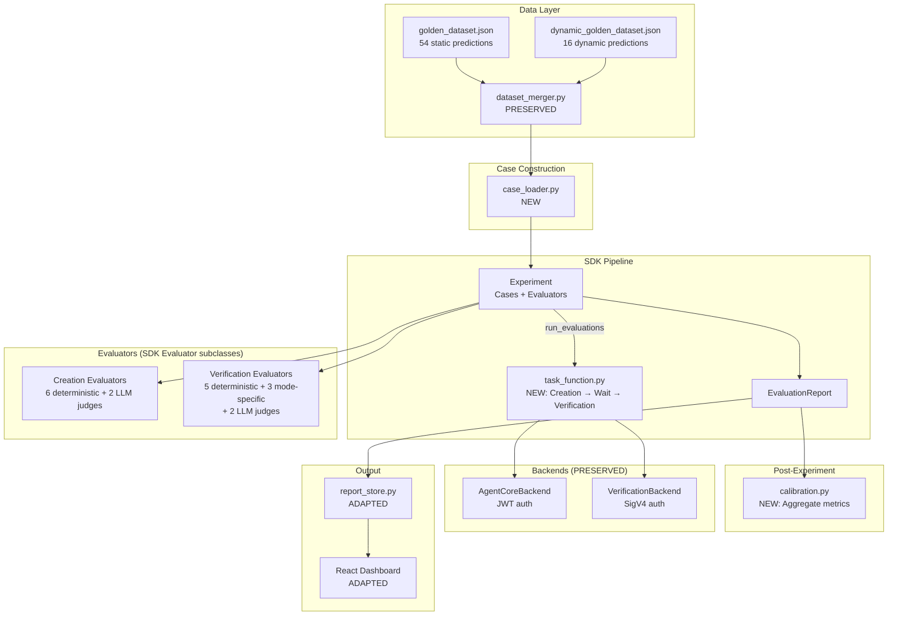

# Design Document: Strands Evals SDK Migration

## Overview

This design describes the migration of CalledIt's custom eval framework to the Strands Evals SDK. The migration replaces ~1,200 lines of hand-rolled orchestration, evaluator interfaces, and LLM judge wrappers with SDK primitives (`Case`, `Experiment`, `Evaluator`, `OutputEvaluator`, `EvaluationOutput`). The golden dataset, DDB report store, React dashboard, and agent backends are preserved but adapted.

The core architectural shift: instead of `unified_eval.py` manually looping evaluators over case results, the SDK's `Experiment.run_evaluations(task_function)` handles orchestration. Each evaluator becomes a standardized `Evaluator` subclass returning `EvaluationOutput` objects. LLM judges shrink from ~80 lines each to ~5-line `OutputEvaluator` configurations. Calibration remains a post-experiment analysis step since it's an aggregate metric, not a per-case evaluator.

### Design Decisions

1. **Single Experiment with metadata-based evaluator routing** (vs separate Experiments per mode): All evaluators run in one Experiment. Mode-specific evaluators check `evaluation_case.metadata["verification_mode"]` internally and return a no-op `EvaluationOutput(score=1.0, test_pass=True, reason="N/A — mode not applicable")` when the mode doesn't match. This keeps the pipeline simple and produces one unified report.

2. **Calibration as post-experiment analysis** (vs custom Evaluator): Calibration is a cross-case aggregate metric (score-vs-outcome correlation), not a per-case evaluation. It reads from the completed `EvaluationReport` rather than running as an evaluator. This matches the SDK's design intent.

3. **Task function returns structured dict** (vs separate creation/verification outputs): The task function returns `{"creation_bundle": {...}, "verification_result": {...}}` so evaluators can access both agent outputs from `evaluation_case.actual_output`.

4. **Report store writes SDK-compatible format with same DDB schema**: The DDB table schema (`PK=AGENT#unified`, `SK=timestamp`) and top-level report keys (`creation_scores`, `verification_scores`, `calibration_scores`, `case_results`) are preserved so the dashboard needs minimal changes.

5. **Clean break — no backward compatibility layer**: Old evaluator files, legacy runners, and Streamlit dashboard are deleted. The new pipeline is the only eval system.

## Architecture



### Pipeline Flow

```
CLI (run_eval.py)
  │
  ├─ 1. Load & merge datasets → case_loader.py → list[Case]
  │
  ├─ 2. Build evaluator set based on --tier
  │
  ├─ 3. Construct Experiment(cases, evaluators)
  │
  ├─ 4. Experiment.run_evaluations(task_function)
  │     │
  │     ├─ For each Case:
  │     │   ├─ task_function(case) → invoke creation agent (JWT)
  │     │   ├─ Wait for verification date (capped 300s)
  │     │   ├─ Invoke verification agent (SigV4)
  │     │   └─ Return {"creation_bundle": {...}, "verification_result": {...}}
  │     │
  │     └─ For each Case × Evaluator:
  │         └─ evaluator.evaluate(EvaluationData) → list[EvaluationOutput]
  │
  ├─ 5. Post-experiment: calibration.py reads EvaluationReport
  │
  ├─ 6. Report: write to DDB (primary store)
  │     Optional: --local-backup writes local JSON copy
  │
  └─ 7. Cleanup: delete eval bundles from DDB
```

## Components and Interfaces

### 1. case_loader.py (NEW)

Loads golden dataset predictions and constructs SDK `Case` objects.

```python
from strands_evals import Case
from eval.dataset_merger import load_and_merge

def load_cases(
    static_path: str,
    dynamic_path: str | None = None,
    tier: str = "smoke",
    case_id: str | None = None,
) -> list[Case[str, str]]:
    """Load golden dataset → merge → filter → construct Case objects.

    Returns list of Case[str, str] where:
      - input = prediction_text
      - expected_output = expected_verification_outcome (or None)
      - metadata = {id, difficulty, verification_mode, smoke_test,
                    ground_truth, expected_verifiability_score_range, qualifying}
      - name = prediction id
    """
```

Key behaviors:
- Uses existing `dataset_merger.load_and_merge()` for static+dynamic merge
- Sets `metadata.qualifying = False` when `expected_verification_outcome` is None
- Filters by `--case <id>` or `--tier smoke` (smoke_test=True) when specified
- Assigns `session_id` from prediction `id` for trace correlation

### 2. task_function.py (NEW)

The callable passed to `Experiment.run_evaluations()`. Chains two agents with a wait step.

```python
from strands_evals import Case

class TaskFunctionFactory:
    """Creates a task function with pre-configured backends."""

    def __init__(self, creation_backend, verification_backend, eval_table_name: str):
        self.creation_backend = creation_backend
        self.verification_backend = verification_backend
        self.eval_table_name = eval_table_name

    def __call__(self, case: Case) -> dict:
        """Execute creation → wait → verification pipeline for one Case.

        Returns:
            {
                "creation_bundle": dict | None,
                "verification_result": dict | None,
                "creation_error": str | None,
                "verification_error": str | None,
                "prediction_id": str | None,
                "creation_duration": float,
                "verification_duration": float,
            }
        """
```

Key behaviors:
- Invokes `AgentCoreBackend.invoke(case.input)` with JWT auth
- Computes wait time from bundle verification dates (capped at 300s)
- Invokes `VerificationBackend.invoke(prediction_id)` with SigV4 auth
- Returns partial results on creation or verification failure (never raises)
- Supports `--resume` by checking eval DDB table for existing prediction IDs

### 3. Evaluators (NEW — SDK Evaluator subclasses)

All evaluators implement the SDK `Evaluator` base class interface:

```python
from strands_evals.evaluators import Evaluator
from strands_evals.types.evaluation import EvaluationData, EvaluationOutput

class MyEvaluator(Evaluator[str, dict]):
    def evaluate(self, evaluation_case: EvaluationData[str, dict]) -> list[EvaluationOutput]:
        # evaluation_case.input = prediction_text
        # evaluation_case.expected_output = expected_verification_outcome
        # evaluation_case.actual_output = task_function return dict
        # evaluation_case.metadata = Case metadata
        ...

    async def evaluate_async(self, evaluation_case: EvaluationData[str, dict]) -> list[EvaluationOutput]:
        return self.evaluate(evaluation_case)
```

#### Creation Evaluators (eval/evaluators/creation/)

| Evaluator | Type | SDK Class | Logic |
|-----------|------|-----------|-------|
| schema_validity.py | Deterministic | `SchemaValidityEvaluator(Evaluator)` | Validate bundle against Pydantic models |
| field_completeness.py | Deterministic | `FieldCompletenessEvaluator(Evaluator)` | Check sources/criteria/steps non-empty |
| score_range.py | Deterministic | `ScoreRangeEvaluator(Evaluator)` | Verify score in [0.0, 1.0] |
| date_resolution.py | Deterministic | `DateResolutionEvaluator(Evaluator)` | Verify ISO 8601 date |
| dimension_count.py | Deterministic | `DimensionCountEvaluator(Evaluator)` | Verify ≥1 dimension assessment |
| tier_consistency.py | Deterministic | `TierConsistencyEvaluator(Evaluator)` | Verify tier label matches score |
| intent_preservation.py | LLM Judge | `OutputEvaluator(rubric=RUBRIC)` | Fidelity, temporal, scope, assumptions |
| plan_quality.py | LLM Judge | `OutputEvaluator(rubric=RUBRIC)` | Criteria, sources, steps, language |

#### Verification Evaluators (eval/evaluators/verification/)

| Evaluator | Type | SDK Class | Logic |
|-----------|------|-----------|-------|
| schema_validity.py | Deterministic | `VerificationSchemaEvaluator(Evaluator)` | Check verdict/confidence/evidence/reasoning types |
| verdict_validity.py | Deterministic | `VerdictValidityEvaluator(Evaluator)` | Check verdict ∈ {confirmed, refuted, inconclusive} |
| confidence_range.py | Deterministic | `ConfidenceRangeEvaluator(Evaluator)` | Verify confidence in [0.0, 1.0] |
| evidence_completeness.py | Deterministic | `EvidenceCompletenessEvaluator(Evaluator)` | Verify ≥1 evidence item |
| evidence_structure.py | Deterministic | `EvidenceStructureEvaluator(Evaluator)` | Verify source/finding/relevant_to_criteria per item |
| verdict_accuracy.py | Deterministic | `VerdictAccuracyEvaluator(Evaluator)` | Exact match vs expected_output |
| at_date_verdict.py | Mode-specific | `AtDateVerdictEvaluator(Evaluator)` | Temporal logic for at_date mode |
| before_date_verdict.py | Mode-specific | `BeforeDateVerdictEvaluator(Evaluator)` | Deadline logic for before_date mode |
| recurring_freshness.py | Mode-specific | `RecurringFreshnessEvaluator(Evaluator)` | Evidence source field coverage |
| evidence_quality.py | LLM Judge | `OutputEvaluator(rubric=RUBRIC)` | Source authenticity, finding specificity |

#### Mode-Specific Evaluator Routing

Mode-specific evaluators check `evaluation_case.metadata["verification_mode"]` and return a no-op output when the mode doesn't match:

```python
class AtDateVerdictEvaluator(Evaluator[str, dict]):
    def evaluate(self, evaluation_case: EvaluationData[str, dict]) -> list[EvaluationOutput]:
        if evaluation_case.metadata.get("verification_mode") != "at_date":
            return [EvaluationOutput(score=1.0, test_pass=True, reason="N/A — not at_date mode")]
        # ... actual at_date logic ...
```

### 4. calibration.py (NEW)

Post-experiment calibration analysis. Reads from the completed evaluation results, not from the SDK's evaluator pipeline.

```python
def compute_calibration(case_results: list[dict]) -> dict:
    """Compute calibration metrics from task function outputs.

    Reads verifiability_score from creation_bundle and verdict from
    verification_result for each case.

    Returns:
        {
            "calibration_accuracy": float,
            "mean_absolute_error": float,
            "high_score_confirmation_rate": float,
            "low_score_failure_rate": float,
            "verdict_distribution": {"confirmed": int, "refuted": int, ...},
        }
    """
```

Logic is identical to the existing `calibration_eval.compute_calibration_metrics()` — the function signature changes to accept the new case result shape.

### 5. run_eval.py (NEW — CLI entry point)

Replaces `unified_eval.py`. Constructs the Experiment and orchestrates the full pipeline.

```python
def main():
    args = parse_args()  # Same flags as current unified_eval.py

    # 1. Load cases
    cases = load_cases(args.dataset, args.dynamic_dataset, args.tier, args.case)

    # 2. Auth
    token = get_cognito_token()
    creation_backend = AgentCoreBackend(bearer_token=token, table_name=EVAL_TABLE_NAME)
    verification_backend = VerificationBackend()

    # 3. Build evaluators based on tier
    evaluators = build_evaluators(args.tier)

    # 4. Build task function
    task_fn = TaskFunctionFactory(creation_backend, verification_backend, EVAL_TABLE_NAME)

    # 5. Run experiment
    experiment = Experiment(cases=cases, evaluators=evaluators)
    reports = experiment.run_evaluations(task_fn)

    # 6. Post-experiment: calibration (full tier only)
    calibration_scores = compute_calibration(reports) if args.tier == "full" else {}

    # 7. Build and write report
    report = build_report(args, reports, calibration_scores)
    write_report("unified", report)  # DDB (primary store)
    if args.local_backup:
        save_report(report, args.output_dir)  # Optional local JSON

    # 8. Cleanup eval table
    if not args.skip_cleanup:
        cleanup_eval_table(...)

    # 9. Print summary
    print_summary(report)
```

### 6. report_store.py (ADAPTED)

The existing report store is preserved with minimal changes:
- `write_report()` accepts the new report shape (same top-level keys)
- `list_reports()` and `get_report()` unchanged (dashboard API contract preserved)
- New reports use `PK=AGENT#unified` (same as current unified pipeline)
- Float/Decimal conversion and item splitting logic unchanged

### 7. Backends (PRESERVED)

`eval/backends/agentcore_backend.py` and `eval/backends/verification_backend.py` are unchanged. The task function calls them with the same interface.

## Data Models

### Case Object

```python
Case[str, str](
    name="base-001",
    input="Christmas 2026 falls on a Friday",
    expected_output="confirmed",  # or None for non-qualifying
    metadata={
        "id": "base-001",
        "difficulty": "easy",
        "verification_mode": "immediate",
        "smoke_test": True,
        "qualifying": True,  # False when expected_output is None
        "ground_truth": { ... },
        "expected_verifiability_score_range": [0.8, 1.0],
    },
)
```

### Task Function Output

```python
{
    "creation_bundle": {
        "parsed_claim": { ... },
        "verification_plan": { ... },
        "plan_review": {
            "verifiability_score": 0.85,
            "score_tier": "high",
            "dimension_assessments": [ ... ],
            ...
        },
        "prompt_versions": { ... },
        "prediction_id": "uuid-...",
        "raw_bundle": { ... },
    },
    "verification_result": {
        "verdict": "confirmed",
        "confidence": 0.92,
        "evidence": [ ... ],
        "reasoning": "...",
        "prediction_id": "uuid-...",
    },
    "creation_error": None,
    "verification_error": None,
    "prediction_id": "uuid-...",
    "creation_duration": 12.3,
    "verification_duration": 45.6,
}
```

### EvaluationOutput

```python
EvaluationOutput(
    score=1.0,          # 0.0–1.0
    test_pass=True,     # bool
    reason="All models validate",  # str
    label="schema_validity",       # optional str for grouping
)
```

### DDB Report Shape (preserved)

```json
{
    "PK": "AGENT#unified",
    "SK": "2026-04-02T01:00:00+00:00",
    "run_metadata": {
        "description": "SDK migration baseline",
        "run_tier": "full",
        "timestamp": "2026-04-02T01:00:00+00:00",
        "duration_seconds": 4500.0,
        "case_count": 22,
        "dataset_sources": ["eval/golden_dataset.json", "eval/dynamic_golden_dataset.json"],
        "git_commit": "abc1234",
        "prompt_versions": {"prediction_parser": "2", "verification_planner": "2", "plan_reviewer": "3"},
        "phase_durations": {"creation_seconds": 1200, "wait_seconds": 30, "verification_seconds": 2400, "evaluation_seconds": 300}
    },
    "creation_scores": {
        "schema_validity": 1.0,
        "field_completeness": 1.0,
        "score_range": 1.0,
        "date_resolution": 1.0,
        "dimension_count": 1.0,
        "tier_consistency": 1.0,
        "intent_preservation": 0.87,
        "plan_quality": 0.81,
        "overall_pass_rate": 1.0
    },
    "verification_scores": {
        "schema_validity": 1.0,
        "verdict_validity": 1.0,
        "confidence_range": 1.0,
        "evidence_completeness": 1.0,
        "evidence_structure": 1.0,
        "verdict_accuracy": 0.94,
        "evidence_quality": 0.73,
        "overall_pass_rate": 1.0
    },
    "calibration_scores": {
        "calibration_accuracy": 0.95,
        "mean_absolute_error": 0.16,
        "high_score_confirmation_rate": 0.95,
        "low_score_failure_rate": 0.0,
        "verdict_distribution": {"confirmed": 18, "refuted": 2, "inconclusive": 2}
    },
    "case_results": [ ... ]
}
```

### Module Structure

```
eval/
├── run_eval.py                    # NEW: CLI entry point + Experiment construction
├── task_function.py               # NEW: Two-agent pipeline task function
├── case_loader.py                 # NEW: Golden dataset → Case objects
├── calibration.py                 # NEW: Post-experiment calibration analysis
├── evaluators/                    # NEW: SDK evaluator classes
│   ├── __init__.py
│   ├── creation/
│   │   ├── __init__.py
│   │   ├── schema_validity.py
│   │   ├── field_completeness.py
│   │   ├── score_range.py
│   │   ├── date_resolution.py
│   │   ├── dimension_count.py
│   │   ├── tier_consistency.py
│   │   ├── intent_preservation.py    # OutputEvaluator wrapper
│   │   └── plan_quality.py           # OutputEvaluator wrapper
│   └── verification/
│       ├── __init__.py
│       ├── schema_validity.py
│       ├── verdict_validity.py
│       ├── confidence_range.py
│       ├── evidence_completeness.py
│       ├── evidence_structure.py
│       ├── verdict_accuracy.py
│       ├── at_date_verdict.py
│       ├── before_date_verdict.py
│       ├── recurring_freshness.py
│       └── evidence_quality.py       # OutputEvaluator wrapper
├── golden_dataset.json              # PRESERVED
├── dynamic_golden_dataset.json      # PRESERVED
├── generate_dynamic_dataset.py      # PRESERVED
├── dataset_merger.py                # PRESERVED
├── validate_dataset.py              # PRESERVED
├── report_store.py                  # ADAPTED
├── score_history.json               # PRESERVED
├── backends/                        # PRESERVED
│   ├── agentcore_backend.py
│   └── verification_backend.py
└── reports/                         # PRESERVED (historical)
```


## Correctness Properties

*A property is a characteristic or behavior that should hold true across all valid executions of a system — essentially, a formal statement about what the system should do. Properties serve as the bridge between human-readable specifications and machine-verifiable correctness guarantees.*

### Property 1: Case construction preserves prediction data

*For any* golden dataset prediction dict with fields `prediction_text`, `expected_verification_outcome`, `id`, `difficulty`, `verification_mode`, `smoke_test`, `ground_truth`, and `expected_verifiability_score_range`, the constructed Case object SHALL have `input` equal to `prediction_text`, `expected_output` equal to `expected_verification_outcome` (including None), `name` equal to `id`, `metadata.qualifying` equal to `(expected_verification_outcome is not None)`, and all metadata fields correctly mapped. Furthermore, when both static and dynamic datasets are provided, the number of Cases SHALL equal the number of merged predictions from `dataset_merger.load_and_merge()`.

**Validates: Requirements 1.1, 1.2, 1.3, 1.4**

### Property 2: Case filtering correctness

*For any* list of Cases and a filter criterion (either a specific case id or smoke tier), the filtered result SHALL contain only Cases matching the criterion: when filtering by case id, exactly one Case with that id; when filtering by smoke tier, only Cases where `metadata.smoke_test` is True. The filtered set SHALL always be a subset of the unfiltered set.

**Validates: Requirements 1.5, 1.6**

### Property 3: Deterministic creation evaluator equivalence

*For any* creation bundle dict, each of the 6 deterministic creation evaluators (schema_validity, field_completeness, score_range, date_resolution, dimension_count, tier_consistency) SHALL return an `EvaluationOutput` with `score` equal to 1.0 if and only if the corresponding validation condition holds (Pydantic models validate, list fields non-empty, score in [0.0, 1.0], date is valid ISO 8601, ≥1 dimension assessment, tier label matches score thresholds), and `score` equal to 0.0 otherwise. The `test_pass` field SHALL equal `(score == 1.0)`. The new SDK evaluators SHALL produce the same binary score as the old evaluator functions for the same input bundle.

**Validates: Requirements 2.1, 2.2, 2.3, 2.4, 2.5, 2.6**

### Property 4: Deterministic verification evaluator equivalence

*For any* verification result dict, each of the 5 deterministic verification evaluators (schema_validity, verdict_validity, confidence_range, evidence_completeness, evidence_structure) SHALL return an `EvaluationOutput` with `score` equal to 1.0 if and only if the corresponding validation condition holds (all required fields present with correct types, verdict in {confirmed, refuted, inconclusive}, confidence in [0.0, 1.0], ≥1 evidence item, all evidence items have source/finding/relevant_to_criteria), and `score` equal to 0.0 otherwise. The new SDK evaluators SHALL produce the same binary score as the old evaluator functions for the same input.

**Validates: Requirements 3.1, 3.2, 3.3, 3.4, 3.5**

### Property 5: Mode-specific evaluator routing and temporal logic

*For any* Case with a `verification_mode` and any mode-specific evaluator (at_date, before_date, recurring_freshness), the evaluator SHALL return a no-op output (`score=1.0, reason="N/A"`) when the Case's mode does not match the evaluator's target mode. When the mode matches: for at_date, the score SHALL be 1.0 when verdict is "inconclusive" before the verification date and when verdict matches expected_output at/after the date; for before_date, the score SHALL be 1.0 when verdict is "confirmed" or "inconclusive" before the deadline and when verdict matches expected_output at/after the deadline; for recurring_freshness, the score SHALL equal the fraction of evidence items with non-empty source fields.

**Validates: Requirements 4.1, 4.2, 4.3, 4.4**

### Property 6: Verdict accuracy evaluator correctness

*For any* (actual_verdict, expected_output) pair, the VerdictAccuracyEvaluator SHALL return `score=1.0` when `actual_verdict == expected_output`, `score=0.0` when they differ, and an empty output list when `expected_output` is None.

**Validates: Requirements 5.4**

### Property 7: Verification wait computation

*For any* creation bundle with a verification date and a current timestamp, the computed wait time SHALL equal `max(0, (verification_date - current_time).total_seconds() + 30)` capped at 300 seconds. When the verification date is in the past or the verification mode is "immediate" or "recurring", the wait SHALL be 0.

**Validates: Requirements 6.2**

### Property 8: Calibration metrics correctness

*For any* list of case result dicts containing `verifiability_score`, `score_tier`, and `actual_verdict` fields, the calibration analyzer SHALL compute: `calibration_accuracy` as the fraction of cases where `is_calibration_correct(score_tier, verdict)` returns True; `mean_absolute_error` as the mean of `|verifiability_score - binary_outcome|` where binary_outcome is 1.0 for resolved (confirmed/refuted) and 0.0 for inconclusive; `high_score_confirmation_rate` as the fraction of high-tier cases with resolved verdicts; `low_score_failure_rate` as the fraction of low-tier cases with inconclusive verdicts; and `verdict_distribution` as the exact count of each verdict value.

**Validates: Requirements 8.1, 8.2, 8.3, 8.4, 8.5**

### Property 9: Report format completeness and aggregate correctness

*For any* set of per-case evaluator results, the report SHALL contain `run_metadata` with all required keys (description, run_tier, timestamp, duration_seconds, case_count, dataset_sources, git_commit, prompt_versions), `creation_scores` and `verification_scores` as dictionaries where each evaluator key maps to the arithmetic mean of that evaluator's scores across all cases, and `case_results` as an array with exactly one entry per case.

**Validates: Requirements 9.2, 9.3, 9.4**

### Property 10: Baseline comparison validation logic

*For any* two sets of evaluator scores (old pipeline vs new pipeline), the comparison SHALL report exact match for deterministic evaluators (tolerance = 0.0) and match within ±0.05 for LLM judge evaluators. The migration SHALL be reported as validated if and only if all deterministic scores match exactly and all LLM judge scores are within tolerance.

**Validates: Requirements 12.3, 12.4**

## Error Handling

### Task Function Errors

The task function never raises exceptions. All errors are captured in the return dict:

| Error Scenario | Behavior | Return Shape |
|---------------|----------|-------------|
| Creation agent HTTP error | Catch, set `creation_error` | `creation_bundle=None, verification_result=None` |
| Creation agent timeout (>300s) | Catch, set `creation_error` | Same as above |
| Cognito token expired mid-run | Catch, set `creation_error` | Same as above |
| Verification agent HTTP error | Catch, set `verification_error` | `creation_bundle={...}, verification_result=None` |
| Verification agent timeout | Catch, set `verification_error` | Same as above |
| DDB write failure (eval table) | Catch, set `verification_error` | Same as above |

### Evaluator Errors

SDK evaluators should not raise exceptions. If an evaluator encounters unexpected input:

- Deterministic evaluators return `EvaluationOutput(score=0.0, test_pass=False, reason="Error: ...")` 
- LLM judge evaluators (OutputEvaluator) have built-in error handling in the SDK — JSON parse failures, model errors, and timeouts are handled internally
- Mode-specific evaluators return no-op output for non-matching modes (not an error)

### Report Store Errors

- DDB write failure: logged as warning, does not fail the pipeline. Local JSON report is always written.
- Item size exceeding 390KB: automatic split into main item + `{timestamp}#CASES` item (existing logic preserved).
- Float/Decimal conversion: NaN and Inf replaced with None (existing logic preserved).

### Dataset Errors

- Missing dataset file: `sys.exit(1)` with error message (fail fast)
- Invalid JSON: `sys.exit(1)` with parse error
- Missing `base_predictions` key: `sys.exit(1)` with schema error
- No qualifying cases after filtering: `sys.exit(1)` with message

## Testing Strategy

### Property-Based Testing

Property-based tests use the `hypothesis` library (already in the project's venv). Each property test runs a minimum of 100 iterations with generated inputs.

Each property test is tagged with a comment referencing the design property:
```python
# Feature: strands-evals-migration, Property N: <property_text>
```

**Property tests to implement:**

1. **Case construction** (Property 1): Generate random prediction dicts with hypothesis strategies. Verify Case field mappings, including None expected_output → qualifying=False.

2. **Case filtering** (Property 2): Generate random Case lists and filter criteria. Verify subset relationship and filter correctness.

3. **Deterministic creation evaluators** (Property 3): Generate random creation bundles (valid and invalid). For each evaluator, verify score matches the validation condition. Compare new SDK evaluator output against old evaluator function output for the same input.

4. **Deterministic verification evaluators** (Property 4): Generate random verification result dicts. Same pattern as Property 3.

5. **Mode-specific evaluator routing** (Property 5): Generate random Cases with different verification modes and temporal scenarios. Verify no-op for non-matching modes and correct scoring for matching modes.

6. **Verdict accuracy** (Property 6): Generate random (verdict, expected) pairs including None expected. Verify exact match logic.

7. **Verification wait computation** (Property 7): Generate random verification dates and current timestamps. Verify wait formula with 30s buffer and 300s cap.

8. **Calibration metrics** (Property 8): Generate random case result lists with scores and verdicts. Verify all 5 metrics are mathematically correct.

9. **Report format** (Property 9): Generate random evaluator results. Verify report structure and aggregate computation.

10. **Baseline comparison** (Property 10): Generate random score pairs. Verify tolerance logic and validation decision.

### Unit Tests

Unit tests cover specific examples, edge cases, and integration points:

- **Case loader**: Load the actual `golden_dataset.json`, verify case count and field values for known predictions (e.g., base-001).
- **Evaluator edge cases**: Empty bundles, missing fields, None values, non-dict inputs.
- **Task function error paths**: Mock backend failures, verify error result shape.
- **Calibration edge cases**: All cases same verdict, zero cases, all errors.
- **Report store**: Verify DDB item shape, split logic for large items.
- **CLI argument parsing**: Verify all flags are accepted and defaults are correct.
- **Tier evaluator composition**: Verify smoke/smoke+judges/full evaluator sets contain the expected evaluators.

### Test Organization

```
eval/tests/
├── test_case_loader.py           # Property 1, 2 + unit tests
├── test_creation_evaluators.py   # Property 3 + edge cases
├── test_verification_evaluators.py  # Property 4 + edge cases
├── test_mode_evaluators.py       # Property 5 + edge cases
├── test_verdict_accuracy.py      # Property 6
├── test_wait_computation.py      # Property 7
├── test_calibration.py           # Property 8 + edge cases
├── test_report.py                # Property 9 + edge cases
├── test_comparison.py            # Property 10
└── test_cli.py                   # Unit tests for CLI parsing
```

### PBT Library

- **Library**: `hypothesis` (Python) — already installed in the project venv
- **Minimum iterations**: 100 per property (via `@settings(max_examples=100)`)
- **Tag format**: `# Feature: strands-evals-migration, Property N: <title>`
- **Each correctness property is implemented by a single property-based test**
