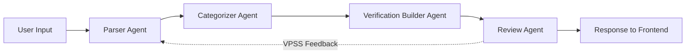

# Design Document: Strands Graph Refactor

## Overview

This design refactors the CalledIt prediction verification system from a monolithic single-agent architecture to a Strands Graph-based multi-agent workflow. The current implementation uses a single agent with a 200+ line system prompt, complex manual JSON parsing with regex fallbacks, and custom error handling wrappers. The refactored system will use four specialized agents orchestrated through a sequential graph workflow, following Strands best practices.

### Current Architecture Issues

1. **Monolithic Agent**: Single agent handles parsing, categorization, verification method building, and review
2. **Complex Parsing**: Manual JSON extraction with regex fallbacks and multiple parsing attempts
3. **Custom Error Handling**: Wrapper functions (`safe_agent_call`, `with_agent_fallback`) duplicate Strands functionality
4. **Incomplete Callbacks**: Callback handler missing lifecycle events (init_event_loop, start_event_loop, force_stop)
5. **Long Prompts**: 200+ line system prompt mixing multiple concerns

### Refactored Architecture Benefits

1. **Specialized Agents**: Four focused agents (Parser, Categorizer, Verification Builder, Review) with 20-30 line prompts
2. **Graph Orchestration**: Sequential workflow with explicit state management and conditional edges
3. **Simplified Parsing**: Trust Strands structured output, single json.loads call
4. **Built-in Error Handling**: Leverage Strands retry and error mechanisms
5. **Complete Callbacks**: Handle all lifecycle events for proper streaming

## Architecture

### High-Level Graph Structure



### Sequential Workflow Pattern

The system uses a **sequential workflow** where each agent's output becomes the next agent's input. This pattern is appropriate because:

- Tasks have clear dependencies (must parse before categorizing, must categorize before building verification)
- Each stage requires specialized expertise
- Information flows linearly through the pipeline
- No parallel execution needed (each step depends on previous)

### Graph State Management

The graph maintains shared state that flows between agents:

```python
class GraphState(TypedDict):
    # User inputs
    user_prompt: str
    user_timezone: str
    current_datetime_utc: str
    current_datetime_local: str
    
    # Parser outputs
    prediction_statement: str
    verification_date: str
    date_reasoning: str
    
    # Categorizer outputs
    verifiable_category: str
    category_reasoning: str
    
    # Verification Builder outputs
    verification_method: dict  # {source: [], criteria: [], steps: []}
    
    # Review outputs
    reviewable_sections: list
    
    # Metadata
    initial_status: str
    error: Optional[str]
```

### Agent Specialization

Each agent has a focused responsibility:

1. **Parser Agent**: Extracts prediction statement, parses time references, converts 12-hour to 24-hour format
2. **Categorizer Agent**: Determines one of 5 verifiability categories with reasoning
3. **Verification Builder Agent**: Constructs verification method (source, criteria, steps)
4. **Review Agent**: Identifies improvable sections, generates questions, supports VPSS feedback loop

## Components and Interfaces

### 1. Parser Agent

**Responsibility**: Extract user's exact prediction and parse temporal references

**System Prompt** (~25 lines):
```python
"""You are a prediction parser. Your task:
1. Extract the user's EXACT prediction statement (no modifications)
2. Parse time references using parse_relative_date tool
3. Convert 12-hour to 24-hour format (3:00pm → 15:00)
4. Work in user's local timezone

TIME CONVERSIONS:
- "3:00pm" → "15:00"
- "this morning" → "09:00"
- "this afternoon" → "15:00"
- "this evening" → "19:00"
- "tonight" → "22:00"

Return JSON:
{
    "prediction_statement": "exact user text",
    "verification_date": "YYYY-MM-DD HH:MM:SS",
    "date_reasoning": "explanation of time parsing"
}
"""
```

**Tools**: `parse_relative_date`, `current_time`

**Input**: User prompt, timezone, current datetime

**Output**: Prediction statement, verification date, reasoning

### 2. Categorizer Agent

**Responsibility**: Classify prediction into one of 5 verifiability categories

**System Prompt** (~30 lines):
```python
"""You are a verifiability categorizer. Classify predictions into exactly one category:

1. agent_verifiable - Pure reasoning/knowledge, no external tools
   Examples: "Sun will rise tomorrow", "2+2=4", "Christmas 2025 is Thursday"

2. current_tool_verifiable - Only needs current_time tool
   Examples: "It's after 3pm", "Today is a weekday", "We're in January 2025"

3. strands_tool_verifiable - Needs Strands library tools (calculator, python_repl)
   Examples: "Calculate compound interest", "Parse complex data"

4. api_tool_verifiable - Needs external APIs or MCP integrations
   Examples: "Bitcoin hits $100k", "Weather is sunny", "Stock prices"

5. human_verifiable_only - Needs human observation/judgment
   Examples: "Movie will be good", "I will feel happy", "Meeting goes well"

Return JSON:
{
    "verifiable_category": "one of 5 categories",
    "category_reasoning": "why you chose this category"
}
"""
```

**Tools**: None

**Input**: Parsed prediction data from Parser Agent

**Output**: Category, reasoning

### 3. Verification Builder Agent

**Responsibility**: Construct detailed verification method

**System Prompt** (~25 lines):
```python
"""You are a verification method builder. Create detailed verification plans.

For the given prediction and category, specify:
- source: List of reliable sources to check
- criteria: List of measurable criteria for truth
- steps: List of detailed verification steps

Make verification methods:
- Specific and actionable
- Appropriate for the verifiability category
- Measurable and objective

Return JSON:
{
    "verification_method": {
        "source": ["source1", "source2"],
        "criteria": ["criterion1", "criterion2"],
        "steps": ["step1", "step2", "step3"]
    }
}
"""
```

**Tools**: None

**Input**: Categorized prediction data from Categorizer Agent

**Output**: Verification method structure

### 4. Review Agent

**Responsibility**: Identify improvable sections and support VPSS feedback

**System Prompt** (~30 lines):
```python
"""You are a prediction review expert. Analyze completed predictions for improvements.

For each section, consider:
- Could more specificity improve verification accuracy?
- Would additional context change verifiability category?
- What user information would be most helpful?

Return JSON:
{
    "reviewable_sections": [
        {
            "section": "field_name",
            "improvable": true/false,
            "questions": ["question1", "question2"],
            "reasoning": "why this could be improved"
        }
    ]
}

For section regeneration with user input:
- prediction_statement changes → update verification_date and verification_method
- verification_method → return {source: [], criteria: [], steps: []}
- Other sections → return improved value
"""
```

**Tools**: None (uses agent invocation for regeneration)

**Input**: Complete prediction response

**Output**: Reviewable sections with questions

### Graph Implementation

**GraphBuilder Pattern**:

```python
from strands import Agent
from strands.graph import GraphBuilder

# Define graph state
class PredictionGraphState(TypedDict):
    user_prompt: str
    user_timezone: str
    current_datetime_utc: str
    current_datetime_local: str
    prediction_statement: str
    verification_date: str
    date_reasoning: str
    verifiable_category: str
    category_reasoning: str
    verification_method: dict
    reviewable_sections: list
    initial_status: str
    error: Optional[str]

# Create specialized agents
parser_agent = Agent(
    name="parser_agent",
    model="claude-3-5-sonnet-20241022",
    tools=[parse_relative_date, current_time],
    system_prompt=PARSER_PROMPT
)

categorizer_agent = Agent(
    name="categorizer_agent",
    model="claude-3-5-sonnet-20241022",
    system_prompt=CATEGORIZER_PROMPT
)

verification_builder_agent = Agent(
    name="verification_builder_agent",
    model="claude-3-5-sonnet-20241022",
    system_prompt=VERIFICATION_BUILDER_PROMPT
)

review_agent = Agent(
    name="review_agent",
    model="claude-3-5-sonnet-20241022",
    system_prompt=REVIEW_PROMPT
)

# Build graph
graph_builder = GraphBuilder(state_schema=PredictionGraphState)

# Add nodes
graph_builder.add_node("parser", parser_node_function)
graph_builder.add_node("categorizer", categorizer_node_function)
graph_builder.add_node("verification_builder", verification_builder_node_function)
graph_builder.add_node("review", review_node_function)

# Add edges
graph_builder.add_edge("parser", "categorizer")
graph_builder.add_edge("categorizer", "verification_builder")
graph_builder.add_edge("verification_builder", "review")

# Set entry point
graph_builder.set_entry_point("parser")

# Compile graph
prediction_graph = graph_builder.compile()
```

**Node Functions**:

Each node function receives state, invokes its agent, and updates state:

```python
def parser_node_function(state: PredictionGraphState) -> PredictionGraphState:
    """Parser node: Extract prediction and parse time"""
    prompt = f"""
    PREDICTION: {state['user_prompt']}
    CURRENT DATE: {state['current_datetime_local']}
    TIMEZONE: {state['user_timezone']}
    
    Extract the prediction and parse the verification date.
    """
    
    response = parser_agent(prompt)
    result = json.loads(str(response))
    
    return {
        **state,
        "prediction_statement": result["prediction_statement"],
        "verification_date": result["verification_date"],
        "date_reasoning": result["date_reasoning"]
    }

def categorizer_node_function(state: PredictionGraphState) -> PredictionGraphState:
    """Categorizer node: Determine verifiability category"""
    prompt = f"""
    PREDICTION: {state['prediction_statement']}
    VERIFICATION DATE: {state['verification_date']}
    
    Categorize this prediction's verifiability.
    """
    
    response = categorizer_agent(prompt)
    result = json.loads(str(response))
    
    return {
        **state,
        "verifiable_category": result["verifiable_category"],
        "category_reasoning": result["category_reasoning"]
    }

def verification_builder_node_function(state: PredictionGraphState) -> PredictionGraphState:
    """Verification Builder node: Construct verification method"""
    prompt = f"""
    PREDICTION: {state['prediction_statement']}
    CATEGORY: {state['verifiable_category']}
    VERIFICATION DATE: {state['verification_date']}
    
    Build a detailed verification method.
    """
    
    response = verification_builder_agent(prompt)
    result = json.loads(str(response))
    
    return {
        **state,
        "verification_method": result["verification_method"]
    }

def review_node_function(state: PredictionGraphState) -> PredictionGraphState:
    """Review node: Identify improvable sections"""
    prompt = f"""
    PREDICTION RESPONSE:
    {json.dumps({
        "prediction_statement": state["prediction_statement"],
        "verification_date": state["verification_date"],
        "verifiable_category": state["verifiable_category"],
        "verification_method": state["verification_method"]
    }, indent=2)}
    
    Identify sections that could be improved with more user information.
    """
    
    response = review_agent(prompt)
    result = json.loads(str(response))
    
    return {
        **state,
        "reviewable_sections": result.get("reviewable_sections", []),
        "initial_status": "pending"
    }
```

### Callback Handler Implementation

**Comprehensive Lifecycle Tracking**:

```python
def create_streaming_callback(connection_id, api_gateway_client):
    """Create callback handler with all lifecycle events"""
    
    def callback_handler(**kwargs):
        try:
            # Text generation events
            if "data" in kwargs:
                api_gateway_client.post_to_connection(
                    ConnectionId=connection_id,
                    Data=json.dumps({
                        "type": "text",
                        "content": kwargs["data"]
                    })
                )
            
            # Tool usage events
            elif "current_tool_use" in kwargs and kwargs["current_tool_use"].get("name"):
                api_gateway_client.post_to_connection(
                    ConnectionId=connection_id,
                    Data=json.dumps({
                        "type": "tool",
                        "name": kwargs["current_tool_use"]["name"],
                        "input": kwargs["current_tool_use"].get("input", {})
                    })
                )
            
            # Lifecycle events
            elif kwargs.get("init_event_loop"):
                logger.info("Event loop initialized")
                
            elif kwargs.get("start_event_loop"):
                logger.info("Event loop cycle starting")
                
            elif kwargs.get("complete"):
                api_gateway_client.post_to_connection(
                    ConnectionId=connection_id,
                    Data=json.dumps({
                        "type": "status",
                        "status": "complete"
                    })
                )
                
            elif kwargs.get("force_stop"):
                reason = kwargs.get("force_stop_reason", "unknown")
                logger.warning(f"Agent force-stopped: {reason}")
                
            # Message events
            elif "message" in kwargs:
                logger.debug(f"Message created: {kwargs['message'].get('role')}")
                
        except Exception as e:
            # Graceful error handling - don't crash agent
            logger.error(f"Callback error: {str(e)}", exc_info=True)
            # Don't re-raise - callback errors shouldn't stop execution
    
    return callback_handler
```

## Data Models

### Input Model

```python
class PredictionRequest:
    prompt: str                    # User's prediction text
    timezone: str                  # User's timezone (e.g., "America/New_York")
    action: str = "makecall"       # Action type: makecall, improve_section, improvement_answers
    
    # For improvement requests
    section: Optional[str]         # Section to improve
    answers: Optional[List[str]]   # User's answers to questions
    original_value: Optional[str]  # Original section value
    full_context: Optional[dict]   # Full prediction context
```

### Output Model

```python
class PredictionResponse:
    prediction_statement: str           # User's exact prediction
    verification_date: str              # UTC ISO format (YYYY-MM-DDTHH:MM:SSZ)
    prediction_date: str                # UTC ISO format (when prediction was made)
    timezone: str = "UTC"               # Always UTC for storage
    user_timezone: str                  # User's original timezone
    local_prediction_date: str          # Local time representation
    verifiable_category: str            # One of 5 categories
    category_reasoning: str             # Why this category was chosen
    verification_method: VerificationMethod
    initial_status: str = "pending"     # Always pending initially
    date_reasoning: str                 # Explanation of date parsing
    
class VerificationMethod:
    source: List[str]                   # Verification sources
    criteria: List[str]                 # Measurable criteria
    steps: List[str]                    # Verification steps

class ReviewResult:
    reviewable_sections: List[ReviewableSection]
    
class ReviewableSection:
    section: str                        # Field name
    improvable: bool                    # Can it be improved?
    questions: List[str]                # Questions for user
    reasoning: str                      # Why improvable
```

### Graph State Model

```python
class PredictionGraphState(TypedDict):
    # Inputs
    user_prompt: str
    user_timezone: str
    current_datetime_utc: str
    current_datetime_local: str
    
    # Parser outputs
    prediction_statement: str
    verification_date: str
    date_reasoning: str
    
    # Categorizer outputs
    verifiable_category: str
    category_reasoning: str
    
    # Verification Builder outputs
    verification_method: dict
    
    # Review outputs
    reviewable_sections: list
    
    # Metadata
    initial_status: str
    error: Optional[str]
```


## Correctness Properties

A property is a characteristic or behavior that should hold true across all valid executions of a system—essentially, a formal statement about what the system should do. Properties serve as the bridge between human-readable specifications and machine-verifiable correctness guarantees.

### Graph Structure Properties

Property 1: State flows through graph nodes
*For any* initial graph state and any execution of the graph, each agent node should receive the accumulated state from all previous nodes
**Validates: Requirements 1.2**

Property 2: Parser preserves exact prediction text
*For any* user input text, the Parser Agent output should contain the exact same prediction_statement without any modifications
**Validates: Requirements 2.1**

Property 3: Parser converts 12-hour to 24-hour format
*For any* time reference in 12-hour format (e.g., "3:00pm", "this morning"), the Parser Agent output should contain the equivalent 24-hour format (e.g., "15:00", "09:00")
**Validates: Requirements 2.3**

Property 4: Parser respects user timezone
*For any* timezone and time reference, the Parser Agent should interpret the time in that timezone, resulting in different UTC outputs for different timezones with the same time reference
**Validates: Requirements 2.4, 11.2**

Property 5: Parser output structure completeness
*For any* input, the Parser Agent output should contain prediction_statement and verification_date fields
**Validates: Requirements 2.5**

### Categorization Properties

Property 6: Categorizer returns valid category
*For any* prediction, the Categorizer Agent should return exactly one category from the valid set: agent_verifiable, current_tool_verifiable, strands_tool_verifiable, api_tool_verifiable, human_verifiable_only
**Validates: Requirements 3.1, 3.2**

Property 7: Categorizer provides reasoning
*For any* prediction, the Categorizer Agent output should include a non-empty category_reasoning field
**Validates: Requirements 3.3**

Property 8: Categorizer output structure completeness
*For any* input, the Categorizer Agent output should contain verifiable_category and category_reasoning fields
**Validates: Requirements 3.5**

### Verification Builder Properties

Property 9: Verification Builder output structure completeness
*For any* prediction, the Verification Builder Agent output should contain verification_method with source, criteria, and steps fields, where each field is a list
**Validates: Requirements 4.1, 4.2, 4.3, 4.4**

### Review Agent Properties

Property 10: Review Agent identifies improvable sections
*For any* prediction response, the Review Agent output should contain a reviewable_sections list with proper structure (section, improvable, questions, reasoning fields)
**Validates: Requirements 5.2**

Property 11: Review Agent generates questions for improvable sections
*For any* section marked as improvable, the questions list should be non-empty
**Validates: Requirements 5.3**

Property 12: Review Agent regenerates sections
*For any* section name and user clarifications, the Review Agent should return a regenerated value for that section
**Validates: Requirements 5.4**

Property 13: Review Agent updates related fields for prediction_statement
*For any* prediction_statement regeneration, the output should include updated verification_date and verification_method fields
**Validates: Requirements 5.5, 12.4**

### Callback Handler Properties

Property 14: Callback handles all event types without crashing
*For any* event type (text, tool, lifecycle, message), the callback handler should process it without throwing exceptions that stop agent execution
**Validates: Requirements 7.1, 7.2, 7.3, 7.4, 7.5, 7.7**

Property 15: Callback streams to WebSocket
*For any* streamable event (text, tool, status), the callback handler should make WebSocket API calls with the appropriate message format
**Validates: Requirements 7.6**

### JSON Parsing Properties

Property 16: JSON parsing with single call
*For any* valid JSON response from an agent, parsing with json.loads should succeed and return the expected structure
**Validates: Requirements 8.3**

Property 17: JSON parsing fallback for invalid input
*For any* invalid JSON response, the system should return a simple fallback response without crashing
**Validates: Requirements 8.4**

### WebSocket Streaming Properties

Property 18: WebSocket message format consistency
*For any* WebSocket message sent by the system, the message structure should match the expected format with type and content/data fields
**Validates: Requirements 10.4**

Property 19: WebSocket streams all event types
*For any* execution, the system should send WebSocket messages for text chunks, tool usage, and status updates
**Validates: Requirements 10.1, 10.2, 10.3**

Property 20: WebSocket sends completion notification
*For any* completed processing, the system should send a completion message via WebSocket
**Validates: Requirements 10.5**

### Timezone Handling Properties

Property 21: UTC conversion correctness
*For any* local time and timezone, the UTC conversion should produce the correct UTC timestamp
**Validates: Requirements 11.3**

Property 22: Response includes both UTC and local time
*For any* response, both UTC and local time representations should be present in the output
**Validates: Requirements 11.4**

Property 23: Invalid timezone fallback
*For any* invalid timezone string, the system should fall back to UTC without crashing
**Validates: Requirements 11.5**

### VPSS Feedback Properties

Property 24: Improvement request generates questions
*For any* section improvement request, the system should return a non-empty list of questions
**Validates: Requirements 12.1**

Property 25: Improvement answers regenerate section
*For any* section and user answers, the system should return a regenerated section value
**Validates: Requirements 12.2**

Property 26: All fields support improvement
*For any* of the fields (prediction_statement, verification_date, verification_method, verifiable_category), the system should support improvement requests
**Validates: Requirements 12.3**

### Backward Compatibility Properties

Property 27: Input format compatibility
*For any* valid current WebSocket message format, the refactored system should accept and process it correctly
**Validates: Requirements 13.1**

Property 28: Output format compatibility
*For any* request, the response structure should contain all fields present in the current implementation
**Validates: Requirements 13.2, 13.5**

Property 29: Action type support
*For any* action type (makecall, improve_section, improvement_answers), the system should handle it correctly
**Validates: Requirements 13.3**

Property 30: Event type consistency
*For any* WebSocket event sent, the event type should be one of: text, tool, status, call_response, review_complete, complete
**Validates: Requirements 13.4**

### Lambda Environment Properties

Property 31: Lambda execution time compliance
*For any* valid request, the system should complete processing within AWS Lambda execution time limits
**Validates: Requirements 14.1**

Property 32: Lambda event handling
*For any* valid Lambda event object, the system should extract connection_id, domain_name, and stage correctly
**Validates: Requirements 14.3, 14.4**

Property 33: Lambda response format
*For any* request, the Lambda handler should return a response with statusCode and body fields
**Validates: Requirements 14.5**

## Error Handling

### Error Handling Strategy

The refactored system removes custom error wrappers and relies on Strands' built-in error handling with targeted try/except blocks only where custom fallback logic is needed.

**Removed Components**:
- `safe_agent_call` wrapper function
- `with_agent_fallback` decorator
- `safe_streaming_callback` wrapper function
- `ToolFallbackManager` class

**Error Handling Approach**:

1. **Agent Errors**: Let Strands handle retries and errors internally
2. **JSON Parsing Errors**: Single try/except with simple fallback
3. **Callback Errors**: Catch and log without re-raising
4. **WebSocket Errors**: Catch and log without crashing agent
5. **Lambda Errors**: Return proper error response format

**Example Error Handling**:

```python
# JSON parsing with simple fallback
try:
    result = json.loads(str(response))
except json.JSONDecodeError:
    logger.error("JSON parsing failed, using fallback")
    result = {
        "prediction_statement": user_prompt,
        "verifiable_category": "human_verifiable_only",
        "category_reasoning": "Unable to process due to parsing error",
        "verification_method": {
            "source": ["manual"],
            "criteria": ["Human verification required"],
            "steps": ["Manual review needed"]
        }
    }

# Callback error handling
def callback_handler(**kwargs):
    try:
        # Process events
        pass
    except Exception as e:
        logger.error(f"Callback error: {str(e)}", exc_info=True)
        # Don't re-raise - continue agent execution

# WebSocket error handling
try:
    api_gateway_client.post_to_connection(
        ConnectionId=connection_id,
        Data=json.dumps(message)
    )
except Exception as e:
    logger.error(f"WebSocket send failed: {str(e)}")
    # Continue processing
```

### Error Categories

1. **Recoverable Errors**: JSON parsing, WebSocket send failures
   - Action: Log and use fallback, continue execution
   
2. **Fatal Errors**: Invalid Lambda event, missing required parameters
   - Action: Return error response immediately
   
3. **Callback Errors**: Any error in callback handler
   - Action: Log and continue (never crash agent)

## Testing Strategy

### Dual Testing Approach

The testing strategy uses both unit tests and property-based tests as complementary approaches:

- **Unit tests**: Verify specific examples, edge cases, and integration points
- **Property tests**: Verify universal properties across all inputs

Together, they provide comprehensive coverage where unit tests catch concrete bugs and property tests verify general correctness.

### Property-Based Testing Configuration

**Library**: `hypothesis` for Python

**Configuration**:
- Minimum 100 iterations per property test
- Each test tagged with feature name and property number
- Tag format: `# Feature: strands-graph-refactor, Property N: [property text]`

**Example Property Test**:

```python
from hypothesis import given, strategies as st
import pytest

# Feature: strands-graph-refactor, Property 2: Parser preserves exact prediction text
@given(st.text(min_size=1))
def test_parser_preserves_exact_text(prediction_text):
    """For any user input text, Parser should preserve it exactly"""
    state = {
        "user_prompt": prediction_text,
        "user_timezone": "UTC",
        "current_datetime_local": "2025-01-01 12:00:00"
    }
    
    result = parser_node_function(state)
    
    assert result["prediction_statement"] == prediction_text

# Feature: strands-graph-refactor, Property 6: Categorizer returns valid category
@given(st.text(min_size=1))
def test_categorizer_returns_valid_category(prediction_text):
    """For any prediction, Categorizer should return a valid category"""
    valid_categories = {
        "agent_verifiable",
        "current_tool_verifiable",
        "strands_tool_verifiable",
        "api_tool_verifiable",
        "human_verifiable_only"
    }
    
    state = {
        "prediction_statement": prediction_text,
        "verification_date": "2025-01-01 12:00:00"
    }
    
    result = categorizer_node_function(state)
    
    assert result["verifiable_category"] in valid_categories
```

### Unit Testing Strategy

**Focus Areas**:
1. Graph structure verification (4 nodes, correct edges)
2. Agent configuration (names, models specified)
3. Specific time conversion examples (3:00pm → 15:00)
4. Timezone edge cases (invalid timezones, DST transitions)
5. WebSocket message format validation
6. Lambda event handling
7. VPSS workflow integration
8. Error fallback responses

**Example Unit Tests**:

```python
def test_graph_has_four_nodes():
    """Verify graph has exactly 4 specialized agents"""
    assert len(prediction_graph.nodes) == 4
    assert "parser" in prediction_graph.nodes
    assert "categorizer" in prediction_graph.nodes
    assert "verification_builder" in prediction_graph.nodes
    assert "review" in prediction_graph.nodes

def test_agents_have_explicit_names():
    """Verify all agents have explicit names"""
    assert parser_agent.name == "parser_agent"
    assert categorizer_agent.name == "categorizer_agent"
    assert verification_builder_agent.name == "verification_builder_agent"
    assert review_agent.name == "review_agent"

def test_time_conversion_3pm():
    """Verify 3:00pm converts to 15:00"""
    state = {
        "user_prompt": "It will rain before 3:00pm",
        "user_timezone": "America/New_York",
        "current_datetime_local": "2025-01-01 12:00:00"
    }
    
    result = parser_node_function(state)
    
    assert "15:00" in result["verification_date"]

def test_invalid_timezone_fallback():
    """Verify invalid timezone falls back to UTC"""
    state = {
        "user_prompt": "Test prediction",
        "user_timezone": "Invalid/Timezone",
        "current_datetime_local": "2025-01-01 12:00:00"
    }
    
    result = parser_node_function(state)
    
    # Should not crash, should use UTC
    assert result["verification_date"] is not None
```

### Integration Testing

**Test Scenarios**:
1. End-to-end graph execution with real agents
2. WebSocket streaming with mock API Gateway client
3. VPSS feedback loop (improvement request → questions → answers → regeneration)
4. Lambda handler with various event types
5. Error scenarios (invalid JSON, WebSocket failures, agent errors)

### Testing Priorities

**Phase 1: Core Functionality** (Must have)
- Graph structure and state flow
- Parser agent (text preservation, time conversion)
- Categorizer agent (valid categories)
- Verification Builder agent (output structure)
- Basic WebSocket streaming

**Phase 2: Integration** (Should have)
- Review agent integration
- VPSS feedback loop
- Complete callback handler
- Lambda environment compatibility

**Phase 3: Edge Cases** (Nice to have)
- Timezone edge cases
- Error recovery scenarios
- Performance under load
- Backward compatibility validation

### Iterative Testing Approach

The implementation will follow an iterative build-and-test approach:

1. **Build Parser Agent** → Test parser in isolation
2. **Build Categorizer Agent** → Test categorizer in isolation
3. **Build Verification Builder Agent** → Test builder in isolation
4. **Integrate 3 agents in graph** → Test graph execution
5. **Build Review Agent** → Test review in isolation
6. **Integrate review into graph** → Test complete graph
7. **Add WebSocket streaming** → Test streaming
8. **Add VPSS feedback** → Test feedback loop
9. **Lambda integration** → Test in Lambda environment

Each milestone is tested before moving to the next, ensuring progressive validation.
