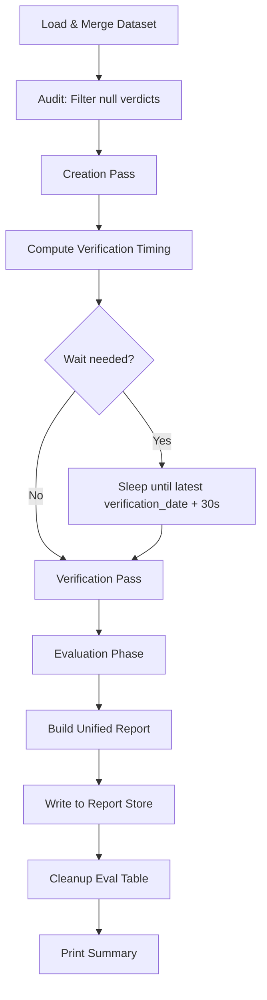
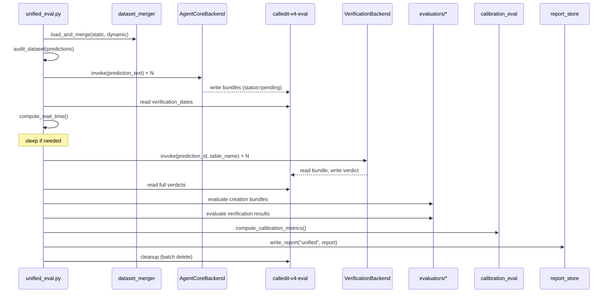

# Design Document: Unified Eval Pipeline

## Overview

The unified eval pipeline (`eval/unified_eval.py`) replaces the three separate eval runners (`creation_eval.py`, `verification_eval.py`, `calibration_eval.py`) with a single orchestrator that mirrors the production DynamoDB-based flow. Instead of each runner independently invoking agents and computing metrics in isolation, the unified pipeline chains the phases sequentially:

1. **Dataset Audit** — Load and merge the golden dataset, filter out predictions with null `expected_verification_outcome`, log exclusions.
2. **Creation Pass** — Authenticate via Cognito JWT, invoke `AgentCoreBackend` for each prediction, write bundles to `calledit-v4-eval` DDB table.
3. **Verification Timing** — Read `verification_date` from all written bundles, compute exact wait to the latest date + 30s buffer, sleep if needed.
4. **Verification Pass** — Invoke `VerificationBackend` with each `prediction_id` + `table_name=calledit-v4-eval` (scanner pattern), read full verdicts back from DDB.
5. **Evaluation** — Run all creation evaluators + verification evaluators + calibration metrics against paired results.
6. **Report** — Produce a single `unified-eval-{YYYYMMDD-HHMMSS}.json` with `creation_scores`, `verification_scores`, `calibration_scores`, per-case results, and `run_metadata`.
7. **Cleanup** — Batch delete all eval bundles from the Eval_Table.

The pipeline reuses all existing components (backends, evaluators, dataset merger, report store, calibration functions) without modification. It is a new file that imports and orchestrates them.



## Architecture

### Single-File Orchestrator

The unified pipeline lives in `eval/unified_eval.py`. It is a CLI script with `main()` that parses arguments, then calls phase functions in sequence. Each phase is a standalone function that takes explicit inputs and returns explicit outputs — no global state.

### Phase Architecture



### Auth Strategy

- **Creation Agent**: JWT via Cognito (`get_cognito_token()` → `AgentCoreBackend(bearer_token=token)`)
- **Verification Agent**: SigV4 via AWS credentials (`VerificationBackend()` — uses default credential chain)

Both tokens are obtained once at pipeline start. The Cognito token has a 1-hour TTL which is sufficient for most eval runs. If a run exceeds 1 hour, the creation pass will have already completed.

### Resume Support

The `--resume` flag skips creation for prediction_ids that already exist in the Eval_Table with `status=pending` or `status=verified`. On resume:
1. Scan the Eval_Table for existing items.
2. For each qualifying prediction, check if a bundle already exists.
3. Skip creation for those, proceed directly to verification (or evaluation if already verified).

## Components and Interfaces

### New Components

#### `eval/unified_eval.py`

The single new file. Key functions:

```python
def audit_dataset(predictions: list[dict]) -> tuple[list[dict], list[str]]:
    """Filter predictions with null expected_verification_outcome.
    Returns (qualifying_predictions, excluded_ids).
    """

def run_creation_pass(
    predictions: list[dict],
    backend: AgentCoreBackend,
    eval_table,
    resume_ids: set[str] | None = None,
) -> tuple[list[dict], float]:
    """Invoke creation agent for each prediction, write bundles to DDB.
    Returns (case_results, duration_seconds).
    Skips prediction_ids in resume_ids.
    """

def compute_verification_wait(eval_table, prediction_ids: list[str]) -> float:
    """Read verification_date from all bundles, compute seconds to wait.
    Returns wait_seconds (0 if all dates are past).
    """

def run_verification_pass(
    case_results: list[dict],
    backend: VerificationBackend,
    eval_table_name: str,
) -> tuple[list[dict], float]:
    """Invoke verification agent for each successful creation.
    Returns (updated_case_results, duration_seconds).
    """

def run_evaluation(
    case_results: list[dict],
    tier: str,
) -> tuple[dict, dict, dict, list[dict]]:
    """Run creation evaluators, verification evaluators, calibration metrics.
    Returns (creation_scores, verification_scores, calibration_scores, updated_case_results).
    """

def build_unified_report(
    args, dataset, case_results,
    creation_scores, verification_scores, calibration_scores,
    phase_durations, excluded_ids,
) -> dict:
    """Assemble the unified report dict."""

def cleanup_eval_table(eval_table, prediction_ids: list[str]) -> None:
    """Batch delete all items. Best-effort, logs warnings on failure."""
```

### Reused Components (unchanged)

| Component | Import Path | Usage |
|---|---|---|
| `AgentCoreBackend` | `eval.backends.agentcore_backend` | Creation agent invocation (JWT) |
| `get_cognito_token` | `eval.backends.agentcore_backend` | Cognito auth |
| `VerificationBackend` | `eval.backends.verification_backend` | Verification agent invocation (SigV4) |
| `load_and_merge` | `eval.dataset_merger` | Dataset loading + merge |
| `write_report` | `eval.report_store` | DDB report persistence |
| `classify_score_tier` | `eval.calibration_eval` | Score → tier mapping |
| `is_calibration_correct` | `eval.calibration_eval` | Calibration correctness check |
| `compute_calibration_metrics` | `eval.calibration_eval` | Aggregate calibration metrics |
| `schema_validity` | `eval.evaluators` | Creation Tier 1 evaluator |
| `field_completeness` | `eval.evaluators` | Creation Tier 1 evaluator |
| `score_range` | `eval.evaluators` | Creation Tier 1 evaluator |
| `date_resolution` | `eval.evaluators` | Creation Tier 1 evaluator |
| `dimension_count` | `eval.evaluators` | Creation Tier 1 evaluator |
| `tier_consistency` | `eval.evaluators` | Creation Tier 1 evaluator |
| `intent_preservation` | `eval.evaluators` | Creation Tier 2 evaluator |
| `plan_quality` | `eval.evaluators` | Creation Tier 2 evaluator |
| `verification_schema_validity` | `eval.evaluators` | Verification Tier 1 evaluator |
| `verification_verdict_validity` | `eval.evaluators` | Verification Tier 1 evaluator |
| `verification_confidence_range` | `eval.evaluators` | Verification Tier 1 evaluator |
| `verification_evidence_completeness` | `eval.evaluators` | Verification Tier 1 evaluator |
| `verification_evidence_structure` | `eval.evaluators` | Verification Tier 1 evaluator |
| `verification_verdict_accuracy` | `eval.evaluators` | Verification Tier 2 evaluator |
| `verification_evidence_quality` | `eval.evaluators` | Verification Tier 2 evaluator |
| `verification_at_date_verdict_accuracy` | `eval.evaluators` | Mode-specific evaluator |
| `verification_before_date_verdict_appropriateness` | `eval.evaluators` | Mode-specific evaluator |
| `verification_recurring_evidence_freshness` | `eval.evaluators` | Mode-specific evaluator |

### Evaluator Interface Contract

All evaluators follow one of two signatures:

```python
# Standard evaluator (creation Tier 1, verification Tier 1)
def evaluate(bundle_or_result: dict) -> dict:
    """Returns {"score": float, "pass": bool, "reason": str}"""

# Context evaluator (Tier 2 judges, evidence quality, mode-specific)
def evaluate(result: dict, context: str, **kwargs) -> dict:
    """Returns {"score": float, "pass": bool, "reason": str}"""
```

The unified pipeline calls each evaluator with the same arguments as the existing runners — no interface changes needed.

### CLI Interface

```
usage: unified_eval.py [-h]
    [--dataset PATH]
    [--dynamic-dataset PATH]
    [--tier {smoke,smoke+judges,full}]
    [--description TEXT]
    [--output-dir DIR]
    [--dry-run]
    [--case CASE_ID]
    [--resume]
    [--skip-cleanup]
```

All flags mirror the existing runners. `--resume` and `--skip-cleanup` are new.


## Data Models

### Case Result (per-prediction)

Each prediction flows through all phases and accumulates results in a single dict:

```python
case_result = {
    # Identity
    "prediction_id": str,           # UUID from creation agent
    "case_id": str,                 # Golden dataset id (e.g., "base-001")
    "prediction_text": str,

    # Creation phase
    "creation_bundle": dict | None, # Raw bundle from AgentCoreBackend
    "creation_scores": dict,        # {evaluator_name: {"score": float, "pass": bool, "reason": str}}
    "creation_duration_seconds": float,
    "creation_error": str | None,

    # Verification phase
    "verification_result": dict | None,  # Raw result from VerificationBackend
    "verification_scores": dict,         # {evaluator_name: {"score": float, "pass": bool, "reason": str}}
    "verification_duration_seconds": float,
    "verification_error": str | None,

    # Calibration
    "verifiability_score": float | None,
    "score_tier": str | None,       # "high", "moderate", "low"
    "expected_verdict": str | None,
    "actual_verdict": str | None,
    "calibration_correct": bool | None,

    # Metadata
    "verification_mode": str,       # "immediate", "at_date", "before_date", "recurring"
    "prompt_versions": dict,
}
```

### Unified Report Schema

```python
unified_report = {
    "run_metadata": {
        "description": str,
        "agent": "unified",
        "timestamp": str,              # ISO 8601
        "duration_seconds": float,
        "case_count": int,
        "excluded_count": int,         # Predictions filtered for null verdict
        "dataset_version": str,
        "dataset_sources": list[str],
        "run_tier": str,
        "git_commit": str,
        "prompt_versions": dict,
        "phase_durations": {
            "creation_seconds": float,
            "wait_seconds": float,
            "verification_seconds": float,
            "evaluation_seconds": float,
        },
        "ground_truth_limitation": str,
    },
    "creation_scores": {
        # Per-evaluator averages
        "schema_validity": float,
        "field_completeness": float,
        "score_range": float,
        "date_resolution": float,
        "dimension_count": float,
        "tier_consistency": float,
        "intent_preservation": float | None,  # Tier 2 only
        "plan_quality": float | None,         # Tier 2 only
        "overall_pass_rate": float,
        "by_mode": dict,                      # Per-mode breakdowns
    },
    "verification_scores": {
        # Per-evaluator averages
        "schema_validity": float,
        "verdict_validity": float,
        "confidence_range": float,
        "evidence_completeness": float,
        "evidence_structure": float,
        "verdict_accuracy": float | None,     # Tier 2 only
        "evidence_quality": float | None,     # Tier 2 only
        "overall_pass_rate": float,
        "by_mode": dict,                      # Per-mode breakdowns
    },
    "calibration_scores": {
        "calibration_accuracy": float,
        "mean_absolute_error": float,
        "high_score_confirmation_rate": float,
        "low_score_failure_rate": float,
        "verdict_distribution": {
            "confirmed": int,
            "refuted": int,
            "inconclusive": int,
            "creation_error": int,
            "verification_error": int,
        },
    },
    "case_results": list[dict],  # Array of case_result dicts above
}
```

### DDB Item Schema (Eval Table)

Unchanged from existing runners. The unified pipeline writes the same item shape:

```
PK: PRED#{prediction_id}  (String, HASH)
SK: BUNDLE                 (String, RANGE)

Fields written by creation pass:
  prediction_id, status="pending", verification_mode, parsed_claim,
  verification_plan, verifiability_score, prompt_versions

Fields written by verification agent:
  verdict, confidence, evidence, reasoning, status="verified"
```

### Report Store Item Schema

Written with `agent_type="unified"`:

```
PK: AGENT#unified
SK: {ISO 8601 timestamp}
```

Same split-item logic applies for reports exceeding 390KB.


## Correctness Properties

*A property is a characteristic or behavior that should hold true across all valid executions of a system — essentially, a formal statement about what the system should do. Properties serve as the bridge between human-readable specifications and machine-verifiable correctness guarantees.*

### Property 1: Dataset audit partitions predictions correctly

*For any* list of predictions where each has an `expected_verification_outcome` that is either a string or None, the `audit_dataset` function should return an included list containing exactly the predictions with non-null outcomes and an excluded list containing exactly the prediction ids with null outcomes. The union of included ids and excluded ids should equal the set of all input prediction ids, and the two sets should be disjoint.

**Validates: Requirements 1.1, 1.2, 1.3**

### Property 2: Bundle shaping produces valid DDB items

*For any* prediction id and creation bundle dict, the `shape_bundle` function should produce a DDB item where `PK` equals `PRED#{prediction_id}`, `SK` equals `BUNDLE`, `status` equals `pending`, and all float values are converted to `Decimal`.

**Validates: Requirements 2.3**

### Property 3: Phase error isolation

*For any* list of case results where some have `creation_error` set and others do not, the verification pass should only process cases where `creation_error` is None and `prediction_id` is not None. Similarly, for any list of case results where some have `verification_error` set, the evaluation phase should still produce scores for all cases that have valid creation bundles and verification results.

**Validates: Requirements 2.4, 3.1, 3.4**

### Property 4: Verification wait computation

*For any* list of ISO 8601 verification date strings and a current time, `compute_verification_wait` should return a non-negative float. If all dates are at or before current time, the result should be 0. If any date is after current time, the result should be at least `(max_date - now)` seconds and at most `(max_date - now + 30)` seconds (the 30-second buffer). The result should equal `max(0, max_date - now + 30)`.

**Validates: Requirements 4.2**

### Property 5: Creation evaluator selection by tier

*For any* tier in `{smoke, smoke+judges, full}`, the creation evaluator list should always contain the 6 Tier 1 evaluators (schema_validity, field_completeness, score_range, date_resolution, dimension_count, tier_consistency). When the tier is `smoke+judges` or `full`, the list should additionally contain intent_preservation and plan_quality. When the tier is `smoke`, the list should contain exactly the 6 Tier 1 evaluators.

**Validates: Requirements 5.1, 5.2**

### Property 6: Verification evaluator selection by tier and mode

*For any* combination of tier in `{smoke, smoke+judges, full}` and verification_mode in `{immediate, at_date, before_date, recurring}`, the verification evaluator list should always contain the 5 Tier 1 evaluators (schema_validity, verdict_validity, confidence_range, evidence_completeness, evidence_structure). When the tier is `smoke`, only Tier 1 evaluators should be present. When the tier is `smoke+judges` or `full`, mode-specific Tier 2 evaluators should be added: `verdict_accuracy` for immediate/recurring, `verdict_accuracy` (at_date variant) for at_date, `verdict_appropriateness` for before_date, and `evidence_freshness` for recurring.

**Validates: Requirements 5.3, 5.4, 5.5**

### Property 7: Unified report structure completeness

*For any* valid set of case results, creation scores, verification scores, and calibration scores, the `build_unified_report` function should produce a report dict containing: (a) `run_metadata` with keys description, agent, timestamp, duration_seconds, case_count, dataset_version, run_tier, phase_durations; (b) `creation_scores` with all Tier 1 evaluator keys and overall_pass_rate; (c) `verification_scores` with all Tier 1 evaluator keys and overall_pass_rate; (d) `calibration_scores` with calibration_accuracy, mean_absolute_error, high_score_confirmation_rate, low_score_failure_rate, verdict_distribution; (e) `case_results` as a list with length equal to the input case count.

**Validates: Requirements 6.2, 6.3, 6.4, 6.5, 6.6, 6.8**

### Property 8: Resume skips existing prediction_ids

*For any* set of prediction_ids already present in the eval table and a list of qualifying predictions, the creation pass with `resume=True` should only invoke the creation agent for predictions whose ids are NOT in the existing set. The number of invocations should equal `len(qualifying) - len(qualifying ∩ existing)`.

**Validates: Requirements 7.3**

## Error Handling

### Creation Pass Errors

- **Cognito auth failure**: Fatal — exit with error message. Cannot proceed without JWT.
- **Per-prediction creation failure**: Non-fatal — record `creation_error` in case result, skip prediction for verification and evaluation, continue with remaining predictions.
- **DDB write failure**: Non-fatal — record error, skip prediction for subsequent phases.

### Verification Pass Errors

- **Per-prediction verification failure**: Non-fatal — record `verification_error` in case result, continue with remaining predictions. The case still gets creation evaluator scores.
- **DDB read failure** (reading full verdict): Non-fatal — record partial result with verdict from HTTP response only (missing evidence/reasoning).

### Verification Timing Errors

- **DDB scan failure** (reading verification_dates): Non-fatal — log warning, proceed to verification immediately (best-effort timing).
- **All dates unparseable**: Proceed immediately with a warning.

### Evaluation Errors

- **Individual evaluator failure**: Non-fatal — record `{"score": 0.0, "pass": False, "reason": "Evaluator error: ..."}` for that evaluator, continue with remaining evaluators.
- **Calibration computation failure**: Non-fatal — set calibration_scores to empty dict with a warning.

### Cleanup Errors

- **Per-item delete failure**: Non-fatal — log warning, continue deleting remaining items. This matches the existing pattern in `calibration_eval.py`.

### Report Errors

- **File write failure**: Fatal — exit with error. The report is the primary output.
- **DDB report store write failure**: Non-fatal — log warning. The JSON file is the authoritative artifact.

### General Principle

The pipeline follows a "record and continue" pattern: individual case failures never abort the entire run. Only infrastructure-level failures (auth, report file write) are fatal. This matches the existing runners' behavior.

## Testing Strategy

### Property-Based Testing

Use `hypothesis` (already in the project's venv) for property-based tests. Each property test runs a minimum of 100 iterations.

**Library**: `hypothesis`
**Config**: `@settings(max_examples=100)`

Property tests target the pure functions in `eval/unified_eval.py`:

| Property | Function Under Test | Generator Strategy |
|---|---|---|
| Property 1: Dataset audit | `audit_dataset()` | Lists of prediction dicts with random null/non-null `expected_verification_outcome` |
| Property 2: Bundle shaping | `shape_bundle()` | Random prediction_id strings + random bundle dicts with nested floats |
| Property 3: Phase error isolation | `filter_for_verification()` | Lists of case_result dicts with random error/success states |
| Property 4: Verification wait | `compute_verification_wait()` | Lists of ISO 8601 date strings + random "now" datetime |
| Property 5: Creation evaluator selection | `build_creation_evaluators()` | Tier enum values |
| Property 6: Verification evaluator selection | `build_verification_evaluators()` | Tier × mode combinations |
| Property 7: Report structure | `build_unified_report()` | Random case results, scores dicts, metadata |
| Property 8: Resume filtering | `filter_for_creation()` | Random prediction lists + random existing id sets |

### Unit Testing

Unit tests cover specific examples, edge cases, and integration points:

- **Edge cases**: Empty dataset, all predictions excluded, all creation failures, all verification failures, single-case run.
- **CLI parsing**: Verify all flags are accepted, default values are correct, mutually exclusive flags are handled.
- **Report filename format**: Verify `unified-eval-{YYYYMMDD-HHMMSS}.json` pattern.
- **Calibration integration**: Verify `classify_score_tier` and `is_calibration_correct` are called correctly with unified pipeline data.
- **Dry-run mode**: Verify no backends are invoked.

### Test File Location

`tests/test_unified_eval.py` — mirrors the existing test structure.

### Test Tagging

Each property test includes a comment referencing the design property:

```python
# Feature: unified-eval-pipeline, Property 1: Dataset audit partitions predictions correctly
@given(st.lists(prediction_strategy(), min_size=0, max_size=50))
@settings(max_examples=100)
def test_audit_dataset_partitions_correctly(predictions):
    ...
```

### Integration Testing

Integration tests (not property-based) verify the end-to-end flow with mocked backends:

- Mock `AgentCoreBackend.invoke()` to return canned bundles.
- Mock `VerificationBackend.invoke()` to return canned verdicts.
- Mock DDB table operations.
- Verify the full pipeline produces a valid unified report.

These are separate from property tests and run with `pytest` markers (`@pytest.mark.integration`).
