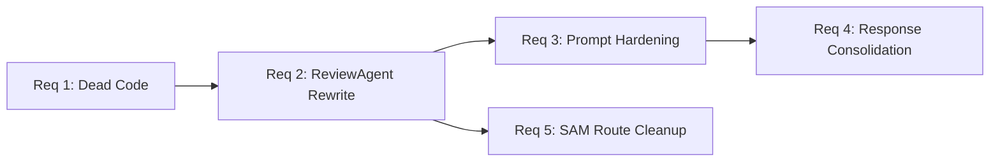
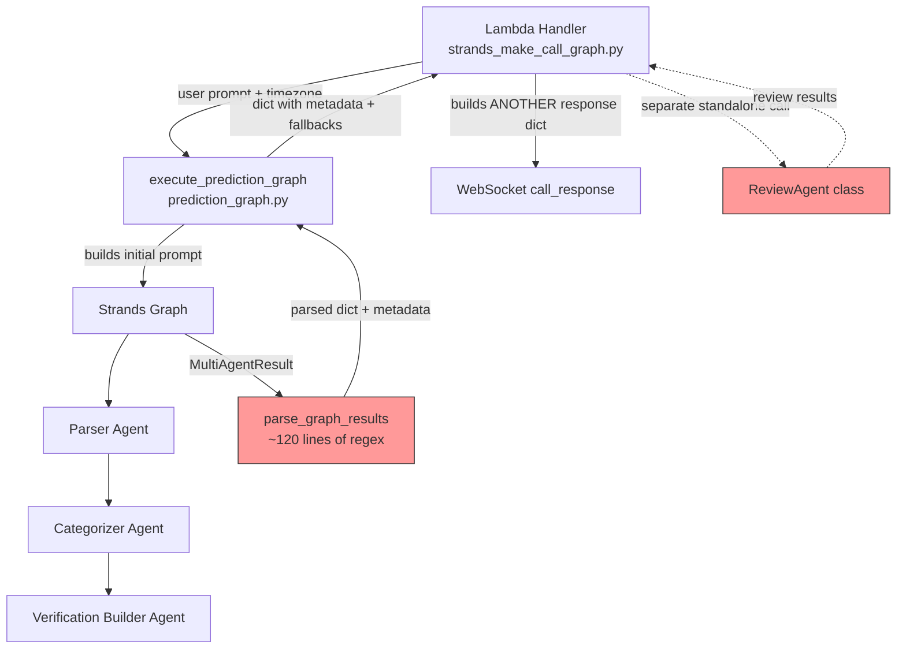
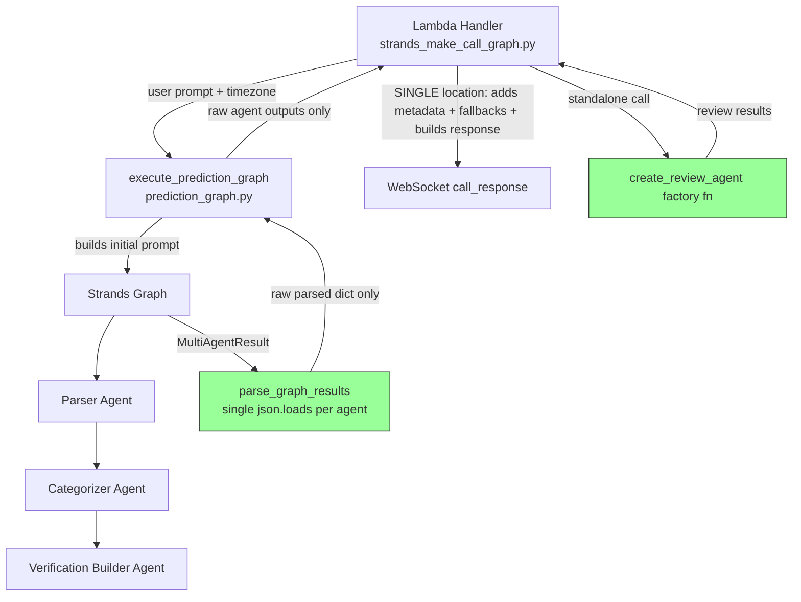

# Design Document — Spec 1: v2 Cleanup & Foundation

## Overview

This design covers five refactoring tasks that clean up architectural debt in the CalledIt prediction pipeline before Spec 2 adds new complexity. Every change preserves v1 behavior — same agent outputs, same WebSocket message format, same DynamoDB save format. The goal is a codebase where each pattern exists exactly once and every line of code is reachable.

### Why This Ordering Matters

The five requirements have natural dependencies that dictate implementation order:

1. **Dead Code Cleanup (Req 1)** — No dependencies. Remove `*_node_function()` from agent files. This is pure deletion with no behavioral change, so it's the safest starting point.
2. **ReviewAgent Rewrite (Req 2)** — Depends on Req 1 being done (so we're not editing files that still have dead code). Converts the class to a factory function and removes the broken `error_handling` import.
3. **Prompt Hardening + Simplified Parsing (Req 3)** — Depends on Req 2 (ReviewAgent needs its new factory function before we harden its prompt). This is the most complex requirement: fix prompts, validate with a test harness, then simplify `parse_graph_results()`.
4. **Single Response Building Location (Req 4)** — Depends on Req 3 (simplified parsing changes what `execute_prediction_graph()` returns). Moves all response assembly into the Lambda handler.
5. **Remove Stale SAM Routes (Req 5)** — Depends on Req 2 (HITL methods must be gone before we remove the routes that called them). Pure infrastructure deletion.



## Architecture

### Current Architecture (v1.6)

The prediction pipeline currently works like this:



**Problems highlighted in red above:**
- `parse_graph_results()` uses `extract_json_from_text()` with 5 regex strategies to handle malformed agent output — this masks prompt quality issues
- `ReviewAgent` is a class with a broken import (`from error_handling import ...`) and two dead HITL methods
- Response building happens in two places: `execute_prediction_graph()` adds metadata/fallbacks, then `lambda_handler()` builds a *separate* response dict with its own field mapping

### Post-Cleanup Architecture (after this spec)



**What changed (green):**
- `parse_graph_results()` is now a simple `json.loads()` per agent — no regex
- `ReviewAgent` is a factory function matching the other three agents
- Response building happens in exactly one place (Lambda handler)

## Components and Interfaces

### Component 1: Dead Code Removal (Req 1)

**What gets deleted:**

| File | Function | Why it's dead |
|------|----------|---------------|
| `parser_agent.py` | `parser_node_function()` | Leftover from custom-node architecture. `prediction_graph.py` imports only `create_parser_agent`. |
| `categorizer_agent.py` | `categorizer_node_function()` | Same — only `create_categorizer_agent` is imported. |
| `verification_builder_agent.py` | `verification_builder_node_function()` | Same — only `create_verification_builder_agent` is imported. |

**Why these exist:** When the project first adopted Strands graphs, it used the `MultiAgentBase` custom node pattern where each agent had a node function that managed state manually. The project later switched to the plain Agent pattern (where the Graph handles text propagation automatically). The factory functions (`create_*_agent()`) replaced the node functions, but the node functions were never deleted.

**Why plain Agent nodes are the right pattern here:** The 3-agent graph is a simple sequential pipeline. Each agent receives the previous agent's text output automatically — no structured state management needed between nodes. Plain Agent nodes are simpler, and Strands Graph handles the input propagation. Custom nodes (`MultiAgentBase`) would only be needed if we had deterministic business logic between agents (validation, calculations) or needed structured data transformation. We don't — each agent just reads the previous agent's JSON output as text context.

**Verification:** After deletion, `grep -r "node_function" backend/calledit-backend/handlers/strands_make_call/` should return zero results.

### Component 2: ReviewAgent Factory Function (Req 2)

**Current state:** `review_agent.py` contains a `ReviewAgent` class with:
- `__init__()` — creates a Strands Agent with callback handler
- `review_prediction()` — the core review capability (keep this logic)
- `generate_improvement_questions()` — HITL method (delete)
- `regenerate_section()` — HITL method (delete)
- `from error_handling import safe_agent_call, with_agent_fallback` — broken import (delete)

**Target state:** A `create_review_agent()` factory function that returns a configured `Agent`, matching the pattern of the other three agents.

**Design decision — why factory function, not just a bare Agent?**

We considered three patterns:

1. **Bare Agent at module level** (like `prediction_graph.py` does with the graph singleton): Simple, but doesn't allow passing a callback handler per invocation. The Lambda handler needs to pass a streaming callback.

2. **Factory function** (`create_review_agent(callback_handler=None)`): Returns a new Agent each time. Allows per-invocation callback handlers. Matches the pattern of `create_parser_agent()`, `create_categorizer_agent()`, `create_verification_builder_agent()`. Consistent patterns reduce cognitive load.

3. **Keep the class but slim it down**: Would work, but classes with a single method are just functions with extra steps. The class adds no value over a factory function.

We chose option 2 — factory function — for consistency with the existing agent pattern and because it naturally supports the callback handler parameter.

**New `review_agent.py` interface:**

```python
REVIEW_SYSTEM_PROMPT = """..."""  # Focused on meta-analysis

def create_review_agent(callback_handler=None) -> Agent:
    """Create the Review Agent with explicit configuration."""
    return Agent(
        model="anthropic.claude-sonnet-4-20250514-v1:0",
        system_prompt=REVIEW_SYSTEM_PROMPT,
        callback_handler=callback_handler
    )
```

**Lambda handler change:** Replace `ReviewAgent(callback_handler=cb).review_prediction(data)` with:
```python
review_agent = create_review_agent(callback_handler=cb)
review_result = review_agent(review_prompt)
parsed = json.loads(str(review_result))
```

**Note:** The Lambda handler still calls ReviewAgent standalone (outside the graph). Moving it into the graph is Spec 2's job. This spec just makes it follow the same pattern so Spec 2 can add it as a graph node trivially.

### Component 3: Model Upgrade + Prompt Hardening + Simplified Parsing (Req 3)

This is the most complex requirement. It has a deliberate four-step approach — we don't rip out the safety net until we've proven the new model + new prompts work.

**Step 0: Upgrade model from Claude 3.5 Sonnet to Claude Sonnet 4**

All four agent factory functions currently use `anthropic.claude-3-5-sonnet-20241022-v2:0` (Claude 3.5 Sonnet v2, October 2024). The Strands SDK default is now Claude Sonnet 4 (`anthropic.claude-sonnet-4-20250514-v1:0`), which has better instruction following — directly relevant to our JSON output problem.

**Why upgrade before prompt hardening?** If we harden prompts on the old model, validate them, then upgrade the model later, we'd need to re-validate. Better to upgrade first, then harden prompts against the model we'll actually run in production. The testing harness validates the combination of prompt + model.

**Why Claude Sonnet 4 specifically?**
- Same Sonnet tier = similar latency and cost (not a jump to Opus pricing)
- Better instruction following = our "Return ONLY the raw JSON" instructions are more likely to work reliably
- Current Strands default = the framework is optimized for it
- Supports `Agent.structured_output()` if we ever want it (we're not using it now)
- Haiku is too weak for categorization and verification method generation
- Opus is overkill for this use case, much higher cost and latency

**Model ID change in all four factory functions:**
```python
# Before (all 4 agents)
model="anthropic.claude-3-5-sonnet-20241022-v2:0"

# After (all 4 agents)
model="anthropic.claude-sonnet-4-20250514-v1:0"

# If cross-region inference is needed (depends on AWS region):
model="us.anthropic.claude-sonnet-4-20250514-v1:0"
```

**Note on cross-region inference:** If the deployment region doesn't support the model ID directly, you'll get an "on-demand throughput isn't supported" error. The fix is to prefix with `us.` (or `eu.` for European regions). The Strands Bedrock docs cover this in their troubleshooting section. We'll determine which prefix is needed during the testing harness step.

**Step 1: Harden agent prompts**

The current prompts say things like `Return JSON:` followed by an example. Claude interprets this as an invitation to be helpful and often wraps the output in ` ```json ``` ` markdown blocks or adds explanatory text. The fix is explicit instruction.

**Current prompt pattern (all 4 agents):**
```
Return JSON:
{
    "field": "value"
}
```

**New prompt pattern (all 4 agents):**
```
Return ONLY the raw JSON object. Do not wrap in markdown code blocks.
Do not include any text before or after the JSON.

{
    "field": "value"
}
```

**Why this works:** Claude models follow explicit negative instructions ("do not") more reliably than implicit positive ones ("return JSON"). Claude Sonnet 4 is particularly good at this. The key additions are:
- "ONLY the raw JSON object" — explicit constraint
- "Do not wrap in markdown code blocks" — addresses the specific failure mode
- "Do not include any text before or after" — prevents preamble/postamble

**Alternative considered:** Using Strands structured output (`Agent.structured_output()` with Pydantic models). We rejected this because: (a) it adds tool overhead to every agent call, (b) the prompts should produce clean JSON on their own — structured output masks prompt quality issues the same way regex does, (c) the current agents don't use tools for output formatting and adding that changes the agent behavior, and (d) it would require restructuring how the graph passes data between agents.

**Step 2: Validate with testing harness**

A test script at `tests/test_prompt_json_output.py` that:
- Invokes each of the 4 agents with representative inputs
- Runs each agent at least 3 times (LLM output variance)
- Validates that `json.loads(str(result))` succeeds without regex extraction
- Reports per-agent success rates
- Logs raw outputs that fail direct parsing

This is an integration test (it calls real LLM endpoints), so it's separate from unit tests. It validates that the prompt changes actually work before we simplify the parsing code.

**Step 3: Simplify `parse_graph_results()`**

After the test harness confirms clean JSON output, we:
- Delete `extract_json_from_text()` entirely
- Replace each agent's parsing block with a single `json.loads(str(result))` + `JSONDecodeError` fallback with ERROR-level logging

**Simplified parsing pattern (per agent):**
```python
try:
    data = json.loads(str(agent_result.result))
    parsed_data["field"] = data.get("field", default)
except json.JSONDecodeError:
    logger.error(f"Agent returned non-JSON: {str(agent_result.result)[:500]}")
    parsed_data["field"] = default
```

**Why log at ERROR level on parse failure?** Because after prompt hardening, a parse failure means something unexpected happened — either the prompt regressed or the model changed behavior. This should be visible in CloudWatch, not silently handled.

### Component 4: Single Response Building Location (Req 4)

**Current problem — two layers of response assembly:**

Layer 1 (`execute_prediction_graph()` in `prediction_graph.py`):
```python
# Adds metadata
parsed_data["user_timezone"] = user_timezone
parsed_data["current_datetime_utc"] = current_datetime_utc
parsed_data["current_datetime_local"] = current_datetime_local

# Applies fallback defaults
if not parsed_data.get("prediction_statement"):
    parsed_data["prediction_statement"] = user_prompt
if not parsed_data.get("verification_date"):
    parsed_data["verification_date"] = current_datetime_local
# ... more fallbacks
```

Layer 2 (`lambda_handler()` in `strands_make_call_graph.py`):
```python
response_data = {
    "prediction_statement": final_state.get("prediction_statement", prompt),
    "verification_date": verification_date_utc,
    "prediction_date": formatted_datetime_utc,
    "timezone": "UTC",
    "user_timezone": user_timezone,
    # ... builds a SEPARATE dict with its own fallbacks
}
```

**The fix:** `execute_prediction_graph()` returns only the raw parsed agent outputs — no metadata, no fallbacks. The Lambda handler is the single place that:
1. Receives raw agent outputs
2. Adds metadata fields (`prediction_date`, `timezone`, `user_timezone`, `local_prediction_date`, `initial_status`)
3. Applies fallback defaults for any missing fields
4. Builds the `call_response` WebSocket message

**New `execute_prediction_graph()` return value:**
```python
{
    "prediction_statement": "...",      # from Parser
    "verification_date": "...",         # from Parser
    "date_reasoning": "...",            # from Parser
    "verifiable_category": "...",       # from Categorizer
    "category_reasoning": "...",        # from Categorizer
    "verification_method": {...},       # from Verification Builder
    "error": "..."                      # only if graph execution failed
}
```

No `user_timezone`, no `current_datetime_utc`, no `current_datetime_local` — those are metadata the Lambda handler already has from its own variables.

**Why this matters:** When you're debugging a response format issue, you want to look in exactly one place. With two layers, you have to trace through both files to understand which layer set which field and which fallback won.

### Component 5: SAM Route and HITL Cleanup (Req 5)

**Resources to delete from `template.yaml`:**

| Resource | Type | Why it's dead |
|----------|------|---------------|
| `ImproveSectionRoute` | `AWS::ApiGatewayV2::Route` | Routes to `improve_section` action → calls `generate_improvement_questions()` which is being deleted |
| `ImprovementAnswersRoute` | `AWS::ApiGatewayV2::Route` | Routes to `improvement_answers` action → calls `regenerate_section()` which is being deleted |
| `ImproveSectionFunctionPermission` | `AWS::Lambda::Permission` | Permission for the deleted route |
| `ImprovementAnswersFunctionPermission` | `AWS::Lambda::Permission` | Permission for the deleted route |

**Also update:** The `WebSocketDeployment` resource's `DependsOn` list currently includes both deleted routes. Remove them:

```yaml
# Before
DependsOn:
  - ConnectRoute
  - DisconnectRoute
  - MakeCallStreamRoute
  - ImproveSectionRoute          # DELETE
  - ImprovementAnswersRoute      # DELETE

# After
DependsOn:
  - ConnectRoute
  - DisconnectRoute
  - MakeCallStreamRoute
```

**Lambda handler routing cleanup:** The current Lambda handler doesn't have explicit routing for `improve_section` / `improvement_answers` actions (it parses `action` from the body but only uses it for logging). However, we should verify there's no hidden routing logic and ensure the handler cleanly ignores unknown actions. If any routing logic exists, remove it.

**Note:** This spec does NOT add the new `clarify` route — that's Spec 2's job.

## Data Models

### PredictionGraphState (unchanged)

The `PredictionGraphState` TypedDict in `graph_state.py` is not modified by this spec. It already defines the correct schema. However, it's worth noting that the current graph doesn't actually use this TypedDict at runtime — the plain Agent pattern passes text between nodes, not typed state. The TypedDict serves as documentation of the data shape. Spec 2 may use it more formally if custom nodes are introduced.

```python
class PredictionGraphState(TypedDict, total=False):
    # User inputs
    user_prompt: str
    user_timezone: str
    current_datetime_utc: str
    current_datetime_local: str
    
    # Parser outputs
    prediction_statement: str
    verification_date: str
    date_reasoning: str
    
    # Categorizer outputs
    verifiable_category: str
    category_reasoning: str
    
    # Verification Builder outputs
    verification_method: Dict[str, List[str]]
    
    # Review Agent outputs
    reviewable_sections: List[Dict[str, any]]
    
    # Metadata
    initial_status: str
    error: Optional[str]
```

### WebSocket Message Format (unchanged)

The `call_response` message sent to the frontend remains identical:

```json
{
    "type": "call_response",
    "content": {
        "prediction_statement": "string",
        "verification_date": "ISO datetime string",
        "prediction_date": "ISO datetime string",
        "timezone": "UTC",
        "user_timezone": "string (e.g. America/New_York)",
        "local_prediction_date": "formatted local datetime string",
        "verifiable_category": "one of 5 categories",
        "category_reasoning": "string",
        "verification_method": {
            "source": ["string"],
            "criteria": ["string"],
            "steps": ["string"]
        },
        "initial_status": "pending",
        "date_reasoning": "string"
    }
}
```

### Review Output Format (unchanged)

The review agent's output format stays the same — a JSON object with a `reviewable_sections` list:

```json
{
    "reviewable_sections": [
        {
            "section": "field_name",
            "improvable": true,
            "questions": ["question1", "question2"],
            "reasoning": "why this section could be improved"
        }
    ]
}
```

### Agent JSON Output Formats (unchanged, but now reliably clean)

Each agent's JSON output format stays the same. The only change is that prompts now explicitly require raw JSON without markdown wrapping:

**Parser Agent output:**
```json
{
    "prediction_statement": "exact user text",
    "verification_date": "YYYY-MM-DD HH:MM:SS",
    "date_reasoning": "explanation"
}
```

**Categorizer Agent output:**
```json
{
    "verifiable_category": "one of 5 categories",
    "category_reasoning": "explanation"
}
```

**Verification Builder Agent output:**
```json
{
    "verification_method": {
        "source": ["source1", "source2"],
        "criteria": ["criterion1", "criterion2"],
        "steps": ["step1", "step2"]
    }
}
```

## Correctness Properties

*A property is a characteristic or behavior that should hold true across all valid executions of a system — essentially, a formal statement about what the system should do. Properties serve as the bridge between human-readable specifications and machine-verifiable correctness guarantees.*

### Property 1: No unreachable functions in agent files

*For any* function defined in any agent file (`parser_agent.py`, `categorizer_agent.py`, `verification_builder_agent.py`, `review_agent.py`), that function should be imported or called by at least one other module in the `strands_make_call` handler directory or by the test suite.

**Validates: Requirements 1.4**

### Property 2: Review agent output format preservation

*For any* valid prediction response dict (containing prediction_statement, verification_date, verifiable_category, category_reasoning, and verification_method fields), invoking the review agent should return a JSON object that contains a `reviewable_sections` key whose value is a list, where each element has `section`, `improvable`, `questions`, and `reasoning` fields.

**Validates: Requirements 2.6**

### Property 3: All agent prompts contain explicit JSON output instructions

*For any* agent created by the four factory functions (`create_parser_agent`, `create_categorizer_agent`, `create_verification_builder_agent`, `create_review_agent`), the agent's system prompt should contain the instruction text "Return ONLY the raw JSON object" and "Do not wrap in markdown code blocks".

**Validates: Requirements 3.1**

### Property 4: Simplified parsing round-trip

*For any* valid JSON string matching an agent's expected output schema, passing it through the simplified `parse_graph_results()` logic (simulating `str()` then `json.loads()`) should recover the original field values. For any non-JSON string, the parsing should return default fallback values and not raise an exception.

**Validates: Requirements 3.5**

### Property 5: execute_prediction_graph returns only agent output fields

*For any* successful execution of `execute_prediction_graph()`, the returned dictionary's keys should be a subset of `{prediction_statement, verification_date, date_reasoning, verifiable_category, category_reasoning, verification_method, error}`. It should NOT contain metadata keys like `user_timezone`, `current_datetime_utc`, or `current_datetime_local`.

**Validates: Requirements 4.1**

### Property 6: Response assembly preserves wire format

*For any* valid set of raw agent outputs (as returned by the cleaned-up `execute_prediction_graph()`) and any valid metadata inputs (timezone, datetime strings), the Lambda handler's response assembly should produce a dict containing all required wire format fields: `prediction_statement`, `verification_date`, `prediction_date`, `timezone`, `user_timezone`, `local_prediction_date`, `verifiable_category`, `category_reasoning`, `verification_method`, `initial_status`, `date_reasoning`.

**Validates: Requirements 4.4**

## Error Handling

This spec is primarily about cleanup and refactoring, so error handling changes are minimal. The key principle: **don't change error behavior, just simplify how errors are handled.**

### Parsing Errors (Req 3)

**Before:** `extract_json_from_text()` silently tries 5 regex strategies to recover JSON from malformed output. If all fail, it returns the original text, which then fails `json.loads()` and hits the fallback.

**After:** A single `json.loads()` call. If it fails, we log at ERROR level and use fallback defaults. No silent recovery attempts.

```python
# New pattern for each agent in parse_graph_results()
try:
    data = json.loads(str(agent_result.result))
    parsed_data["field"] = data.get("field", "default")
except json.JSONDecodeError:
    logger.error(f"Agent returned non-JSON output: {str(agent_result.result)[:500]}")
    parsed_data["field"] = "default"
```

**Why ERROR level?** After prompt hardening, a JSON parse failure is unexpected. It means either the prompt regressed or the model changed behavior. This should show up in CloudWatch alerts, not be silently swallowed. The fallback defaults still ensure the user gets a response — we're not crashing, we're just making the failure visible.

**Fallback defaults remain the same:**
- `prediction_statement` → original user prompt
- `verification_date` → current local datetime
- `verifiable_category` → `"human_verifiable_only"`
- `category_reasoning` → `"No reasoning provided"`
- `verification_method` → `{"source": ["Manual verification"], "criteria": ["Human judgment required"], "steps": ["Manual review needed"]}`
- `date_reasoning` → `"No reasoning provided"`

### Graph Execution Errors (Req 4)

**Before:** `execute_prediction_graph()` catches exceptions and returns an error dict with metadata fields mixed in.

**After:** `execute_prediction_graph()` catches exceptions and returns an error dict with only agent output fields + the `error` key. No metadata. The Lambda handler adds metadata when building the response.

```python
# New error return from execute_prediction_graph()
except Exception as e:
    logger.error(f"Prediction graph execution failed: {str(e)}", exc_info=True)
    return {
        "error": f"Graph execution failed: {str(e)}",
        "prediction_statement": user_prompt,
        "verification_date": "",
        "date_reasoning": "Error during processing",
        "verifiable_category": "human_verifiable_only",
        "category_reasoning": "Error during processing",
        "verification_method": {
            "source": ["Manual verification"],
            "criteria": ["Human judgment required"],
            "steps": ["Manual review needed due to error"]
        }
    }
```

### ReviewAgent Errors (Req 2)

**Before:** The `ReviewAgent` class uses `safe_agent_call()` from the deleted `error_handling` module (which would crash on import).

**After:** The factory function creates a plain Agent. The Lambda handler wraps the invocation in a simple try/except:

```python
try:
    review_agent = create_review_agent(callback_handler=callback_handler)
    review_result = review_agent(review_prompt)
    parsed_review = json.loads(str(review_result))
except Exception as e:
    logger.error(f"Review agent failed: {str(e)}", exc_info=True)
    parsed_review = {"reviewable_sections": []}
```

This follows the Strands best practice: simple try/except where needed, no custom wrapper functions.

### SAM Route Errors (Req 5)

No error handling changes. Removing routes means WebSocket messages with `action: "improve_section"` or `action: "improvement_answers"` will get a route-not-found response from API Gateway, which is the correct behavior for deleted functionality.

## Testing Strategy

### Dual Testing Approach

This spec uses both unit tests and property-based tests. They're complementary:

- **Unit tests** verify specific examples, edge cases, and structural checks (e.g., "this function was deleted", "this import doesn't exist")
- **Property-based tests** verify universal properties across many generated inputs (e.g., "for any valid JSON, parsing recovers the original values")

Most of the acceptance criteria in this spec are structural (delete this, move that, rename this), which are best verified by unit tests / example tests. The property-based tests focus on the behavioral guarantees that must hold across all inputs.

### Property-Based Testing Configuration

- **Library:** [Hypothesis](https://hypothesis.readthedocs.io/) (Python's standard PBT library)
- **Minimum iterations:** 100 per property test (Hypothesis default is 100 examples)
- **Tag format:** Each test is tagged with a comment: `# Feature: v2-cleanup-foundation, Property N: <property text>`
- **Each correctness property is implemented by a SINGLE property-based test**

### Test File Organization

```
tests/
├── test_dead_code_cleanup.py          # Req 1: structural checks
├── test_review_agent_factory.py       # Req 2: factory function + output format
├── test_prompt_json_output.py         # Req 3: integration test (calls real LLM)
├── test_parse_graph_results.py        # Req 3: unit + property tests for parsing
├── test_response_building.py          # Req 4: unit + property tests for response assembly
└── test_sam_route_cleanup.py          # Req 5: structural checks on template.yaml
```

### Unit Tests (specific examples and edge cases)

**Req 1 — Dead Code Cleanup:**
- Verify `parser_node_function` is not defined in `parser_agent.py` (AST check or import check)
- Verify `categorizer_node_function` is not defined in `categorizer_agent.py`
- Verify `verification_builder_node_function` is not defined in `verification_builder_agent.py`
- Verify no `node_function` string appears in any agent file

**Req 2 — ReviewAgent Factory:**
- Verify `create_review_agent()` returns a Strands `Agent` instance
- Verify the agent's system prompt contains meta-analysis keywords
- Verify `ReviewAgent` class no longer exists in `review_agent.py`
- Verify `error_handling` import no longer exists in `review_agent.py`
- Verify `generate_improvement_questions` and `regenerate_section` no longer exist

**Req 3 — Prompt Hardening:**
- Verify each agent's system prompt contains "Return ONLY the raw JSON object"
- Verify each agent's system prompt contains "Do not wrap in markdown code blocks"
- Verify `extract_json_from_text` no longer exists in `prediction_graph.py`
- Test `parse_graph_results` with clean JSON input → correct parsing
- Test `parse_graph_results` with non-JSON input → fallback defaults + no exception
- Test `parse_graph_results` with markdown-wrapped JSON → fallback defaults (no longer rescued by regex)

**Req 4 — Response Building:**
- Verify `execute_prediction_graph` return value does NOT contain `user_timezone`, `current_datetime_utc`, `current_datetime_local` keys
- Verify Lambda handler response contains all required wire format fields
- Test with missing agent output fields → fallback defaults applied

**Req 5 — SAM Routes:**
- Verify `ImproveSectionRoute` not in template.yaml
- Verify `ImprovementAnswersRoute` not in template.yaml
- Verify `ImproveSectionFunctionPermission` not in template.yaml
- Verify `ImprovementAnswersFunctionPermission` not in template.yaml
- Verify `WebSocketDeployment.DependsOn` does not reference deleted routes

### Property-Based Tests (universal properties)

**Property 1: No unreachable functions in agent files**
```python
# Feature: v2-cleanup-foundation, Property 1: No unreachable functions in agent files
# For any function defined in any agent file, it should be imported or called
# by at least one other module.
# Implementation: AST-scan all agent files, collect function names, then grep
# the codebase for imports/calls. This is a static analysis test, not a
# Hypothesis test — it's exhaustive over the actual codebase.
```
Note: This property is best tested as an exhaustive static analysis (scan all functions, check all imports) rather than a Hypothesis property test, since the input space is the actual codebase, not generated data.

**Property 2: Review agent output format preservation**
```python
# Feature: v2-cleanup-foundation, Property 2: Review agent output format preservation
@given(prediction_response=st.fixed_dictionaries({
    "prediction_statement": st.text(min_size=1),
    "verification_date": st.text(min_size=1),
    "verifiable_category": st.sampled_from([...]),
    "category_reasoning": st.text(min_size=1),
    "verification_method": st.fixed_dictionaries({...})
}))
def test_review_output_format(prediction_response):
    """For any valid prediction response, review agent returns reviewable_sections list."""
    # This is an integration test that calls the real LLM — run separately
```
Note: This property requires LLM invocation, so it belongs in the integration test suite (`test_prompt_json_output.py`), not the fast unit test suite.

**Property 3: All agent prompts contain explicit JSON instructions**
```python
# Feature: v2-cleanup-foundation, Property 3: All agent prompts contain JSON instructions
@given(agent_factory=st.sampled_from([
    create_parser_agent, create_categorizer_agent,
    create_verification_builder_agent, create_review_agent
]))
def test_all_prompts_have_json_instructions(agent_factory):
    """For any agent factory, the system prompt contains explicit JSON instructions."""
    agent = agent_factory()
    assert "Return ONLY the raw JSON object" in agent.system_prompt
    assert "Do not wrap in markdown code blocks" in agent.system_prompt
```

**Property 4: Simplified parsing round-trip**
```python
# Feature: v2-cleanup-foundation, Property 4: Simplified parsing round-trip
@given(
    prediction_statement=st.text(min_size=1, max_size=500),
    verification_date=st.from_regex(r"\d{4}-\d{2}-\d{2} \d{2}:\d{2}:\d{2}", fullmatch=True),
    date_reasoning=st.text(min_size=1, max_size=200)
)
def test_parsing_round_trip(prediction_statement, verification_date, date_reasoning):
    """For any valid JSON matching parser schema, json.loads recovers original values."""
    original = {
        "prediction_statement": prediction_statement,
        "verification_date": verification_date,
        "date_reasoning": date_reasoning
    }
    json_str = json.dumps(original)
    recovered = json.loads(json_str)
    assert recovered == original
```

**Property 5: execute_prediction_graph returns only agent output fields**
```python
# Feature: v2-cleanup-foundation, Property 5: execute_prediction_graph returns only agent fields
ALLOWED_KEYS = {"prediction_statement", "verification_date", "date_reasoning",
                "verifiable_category", "category_reasoning", "verification_method", "error"}
FORBIDDEN_KEYS = {"user_timezone", "current_datetime_utc", "current_datetime_local"}

# Test that for any return value, no forbidden keys are present
```

**Property 6: Response assembly preserves wire format**
```python
# Feature: v2-cleanup-foundation, Property 6: Response assembly preserves wire format
REQUIRED_WIRE_FIELDS = {"prediction_statement", "verification_date", "prediction_date",
                        "timezone", "user_timezone", "local_prediction_date",
                        "verifiable_category", "category_reasoning", "verification_method",
                        "initial_status", "date_reasoning"}

@given(
    raw_outputs=st.fixed_dictionaries({
        "prediction_statement": st.text(min_size=1),
        "verification_date": st.text(min_size=1),
        "date_reasoning": st.text(min_size=1),
        "verifiable_category": st.sampled_from([...]),
        "category_reasoning": st.text(min_size=1),
        "verification_method": st.fixed_dictionaries({...})
    }),
    user_timezone=st.sampled_from(["UTC", "America/New_York", "Europe/London"]),
    formatted_datetime_utc=st.text(min_size=1),
    formatted_datetime_local=st.text(min_size=1)
)
def test_response_assembly_has_all_fields(raw_outputs, user_timezone, ...):
    """For any valid agent outputs + metadata, response contains all wire format fields."""
    response = build_response(raw_outputs, user_timezone, ...)
    assert REQUIRED_WIRE_FIELDS.issubset(response.keys())
```

### Integration Tests (Req 3 — Prompt Testing Harness)

The `test_prompt_json_output.py` script is a special integration test that calls real LLM endpoints. It:
- Invokes each of the 4 agents with representative prediction inputs
- Runs each agent 3+ times to account for LLM output variance
- Validates `json.loads(str(result))` succeeds without regex extraction
- Reports per-agent success rates
- Logs raw outputs that fail direct parsing
- Is runnable via `/home/wsluser/projects/calledit/venv/bin/python -m pytest tests/test_prompt_json_output.py -v`

This test is the gate between Step 2 (validate prompts) and Step 3 (simplify parsing) of Req 3. We don't remove `extract_json_from_text()` until this test passes consistently.

### What We're NOT Testing

- **LLM output quality** — We're not testing whether the agents produce *good* predictions, categories, or verification methods. That's a product quality concern, not a correctness concern.
- **WebSocket streaming** — The streaming callback handler is unchanged by this spec.
- **DynamoDB persistence** — The save format is unchanged; the Lambda handler that calls `write_to_db` is not modified.
- **Frontend behavior** — The wire format is unchanged, so the frontend doesn't need testing for this spec.
