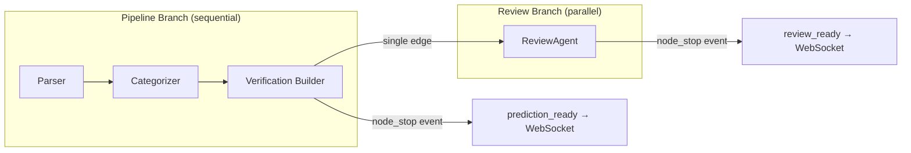
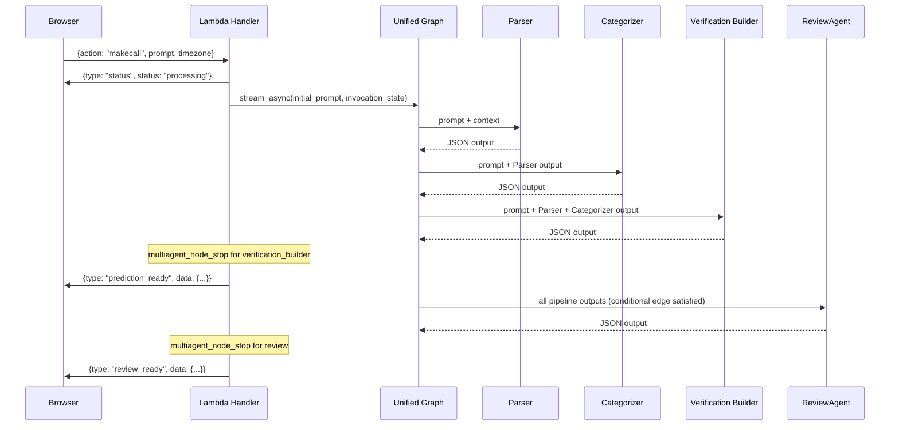
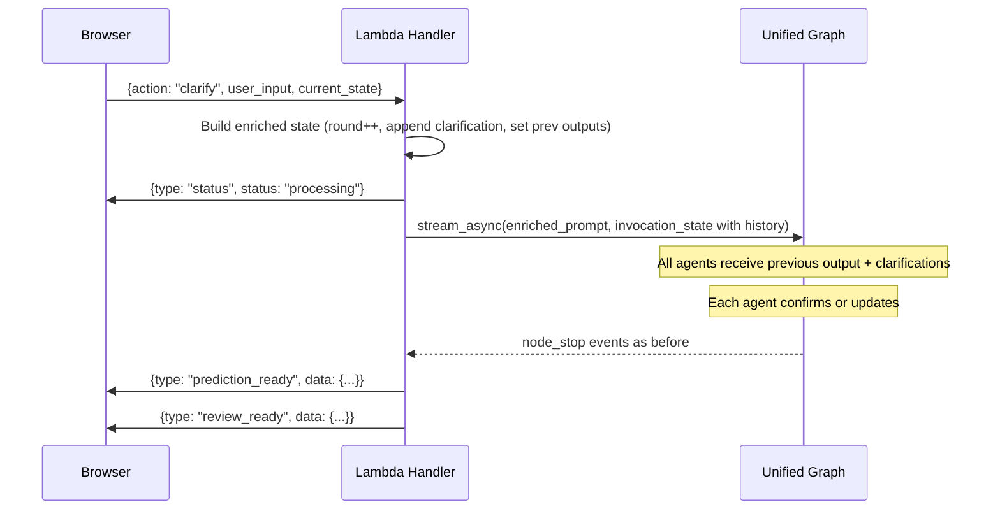

# Design Document — Spec 2: Unified Graph with Stateful Refinement

## Overview

This design transforms CalledIt's prediction pipeline from a 3-agent sequential graph + standalone ReviewAgent into a single 4-agent graph with a parallel review branch, two-push WebSocket delivery, and stateful multi-round refinement.

The core insight: instead of hardcoded cascade logic deciding which fields to regenerate when a user clarifies, we re-run the entire graph with enriched state and let agents decide for themselves. Each agent sees its previous output plus all accumulated clarifications and either confirms or updates. The graph carries history; agents make judgment calls.

Three Strands patterns drive the design:

1. **Parallel branches via conditional edges** — ReviewAgent must wait for ALL three pipeline agents, not just the first to complete. Strands' default edge behavior fires a target when ANY dependency completes. We use `add_conditional_edge` with an `all_dependencies_complete` check to enforce the "wait for all" semantic.

2. **`stream_async` for mid-execution delivery** — The Graph runs to completion and returns a `GraphResult`. It doesn't natively support sending WebSocket messages mid-execution. We use `stream_async` to listen for `multiagent_node_stop` events: when `verification_builder` stops, we send `prediction_ready`; when `review` stops, we send `review_ready`.

3. **`invocation_state` for round context** — Round number, clarifications, and previous outputs are passed via `invocation_state` (not baked into the prompt). Each agent's system prompt includes a refinement instruction block that activates when `round > 1`. The initial prompt stays identical to v1 for round 1.

### What Changes vs. v1

| Aspect | v1 (current) | v2 (this spec) |
|--------|-------------|-----------------|
| Graph nodes | 3 (Parser → Cat → VB) | 4 (Parser → Cat → VB → Review as parallel branch) |
| ReviewAgent | Standalone invocation after graph | Graph node with conditional edge |
| Client delivery | Single `call_response` after everything | Two pushes: `prediction_ready` then `review_ready` |
| Clarification | `improve_call` Lambda with hardcoded cascade | Full graph re-trigger with enriched state |
| State across rounds | Not preserved | Full history in `PredictionGraphState` |
| WebSocket actions | `makecall` only | `makecall` (round 1) + `clarify` (round 2+) |

### What Does NOT Change

- DynamoDB schema — prediction storage format is identical
- Verification pipeline — EventBridge + verify_predictions Lambda untouched
- Agent models — all four agents stay on Claude Sonnet 4 (`us.anthropic.claude-sonnet-4-20250514-v1:0`)
- Agent tools — Parser keeps `parse_relative_date` and `current_time`; others remain tool-free
- SAM template structure — we add a route, not a new Lambda

## Architecture

### High-Level Graph Structure



### Execution Flow (stream_async)



### Clarification Re-Trigger Flow



### Why stream_async Instead of Two Separate Graph Executions

We considered running the pipeline graph first, sending `prediction_ready`, then running ReviewAgent separately. We chose `stream_async` because:

1. **Single graph execution** — one Bedrock session setup, one Lambda invocation context
2. **Idiomatic Strands** — `stream_async` with `multiagent_node_stop` is the documented pattern for monitoring graph progress
3. **Automatic context propagation** — ReviewAgent receives all pipeline outputs via Strands' built-in input propagation, no manual assembly needed
4. **Simpler error handling** — one try/except around one graph execution vs. two separate error paths

### Why Full Re-Trigger Instead of Selective Agent Re-Run

We considered re-running only the agent whose section the user clarified. We chose full re-trigger because:

1. **Cross-agent dependencies** — a date clarification might change the verification method; a prediction restatement might change the category. Agents are better at judging this than hardcoded rules.
2. **Simplicity** — one code path for all clarifications vs. conditional routing logic
3. **Speed** — all four agents complete in ~3-5 seconds total. The user won't notice the difference between re-running one vs. all.
4. **Correctness** — full re-run guarantees consistency. Selective re-run risks stale data in agents that weren't re-run.


## Components and Interfaces

### Component 1: Extended PredictionGraphState

**File:** `backend/calledit-backend/handlers/strands_make_call/graph_state.py`

The state TypedDict gains five new fields for round tracking and history. All existing fields are preserved for backward compatibility.

```python
class PredictionGraphState(TypedDict, total=False):
    # --- Existing fields (unchanged) ---
    user_prompt: str
    user_timezone: str
    current_datetime_utc: str
    current_datetime_local: str
    prediction_statement: str
    verification_date: str
    date_reasoning: str
    verifiable_category: str
    category_reasoning: str
    verification_method: Dict[str, List[str]]
    reviewable_sections: List[Dict[str, any]]
    initial_status: str
    error: Optional[str]

    # --- New v2 fields ---
    round: int                                    # Starts at 1, increments per clarification
    user_clarifications: List[str]                # Accumulates ALL clarifications across rounds
    prev_parser_output: Optional[Dict[str, str]]  # Previous round's parser JSON, None in round 1
    prev_categorizer_output: Optional[Dict[str, str]]  # Previous round's categorizer JSON
    prev_vb_output: Optional[Dict[str, Any]]      # Previous round's VB JSON
```

**Why `total=False`:** Allows partial state construction. Round 1 passes `prev_*_output=None`; round 2+ populates them from the previous execution's parsed results.

**Why `List[str]` for clarifications instead of `List[Dict]`:** Clarifications are plain text from the user. No metadata (timestamp, section) is needed because agents see the full list and decide relevance themselves. Keeping it simple.

### Component 2: Unified Prediction Graph

**File:** `backend/calledit-backend/handlers/strands_make_call/prediction_graph.py`

Major rewrite. The graph goes from 3 sequential nodes to 4 nodes with a parallel review branch.

**Graph Construction:**

```python
def create_prediction_graph():
    parser = create_parser_agent()
    categorizer = create_categorizer_agent()
    vb = create_verification_builder_agent()
    review = create_review_agent()  # Now a graph node, not standalone

    builder = GraphBuilder()

    # Add all 4 nodes
    builder.add_node(parser, "parser")
    builder.add_node(categorizer, "categorizer")
    builder.add_node(vb, "verification_builder")
    builder.add_node(review, "review")

    # Pipeline branch: sequential edges
    builder.add_edge("parser", "categorizer")
    builder.add_edge("categorizer", "verification_builder")

    # Review branch: single edge from VB — no conditional needed!
    # WHY THIS WORKS: The pipeline is sequential (Parser → Cat → VB).
    # When VB completes, Parser and Categorizer have already completed
    # by definition. So a single edge from VB to Review is sufficient.
    # This is the idiomatic Strands pattern — no all_dependencies_complete
    # check needed because the sequential pipeline guarantees ordering.
    builder.add_edge("verification_builder", "review")

    builder.set_entry_point("parser")
    graph = builder.build()
    return graph
```

**Why a single edge from VB, not conditional edges from all three:** The initial design proposed conditional edges with `all_dependencies_complete` from all three pipeline agents to ReviewAgent. After reading the Strands Graph source code, we realized this is unnecessary. The "any one dependency" concern only applies when you have multiple independent branches feeding into one node. Our pipeline is sequential — VB completing is the natural "all done" signal. A single edge is simpler, idiomatic, and doesn't fight the framework.

**Key change to `parse_graph_results()`:** Now parses 4 agents instead of 3. The review parsing block follows the same pattern (single `json.loads()`, ERROR-level log on failure, safe defaults).

**`execute_prediction_graph()` becomes async:** Must use `stream_async` for two-push delivery. The function signature changes to return an async generator of events rather than a final dict. The Lambda handler consumes these events and sends WebSocket messages at the right moments.

### Component 3: Async Lambda Handler with Two-Push Delivery

**File:** `backend/calledit-backend/handlers/strands_make_call/strands_make_call_graph.py`

The Lambda handler becomes the orchestration center for v2. Major changes:

**1. Action routing:**
```python
async def async_handler(event, context):
    body = json.loads(event.get('body', '{}'))
    action = body.get('action', 'makecall')

    if action == 'makecall':
        state = build_round1_state(body)
    elif action == 'clarify':
        state = build_clarify_state(body)  # round++, append clarification, set prev outputs
    else:
        return {'statusCode': 400, 'body': json.dumps({'error': f'Unknown action: {action}'})}

    await execute_and_deliver(state, connection_id, api_gateway_client)
```

**2. Two-push delivery via stream_async:**
```python
async def execute_and_deliver(state, connection_id, api_client):
    initial_prompt = build_prompt(state)
    invocation_state = {
        "round": state["round"],
        "user_clarifications": state.get("user_clarifications", []),
        "prev_parser_output": state.get("prev_parser_output"),
        "prev_categorizer_output": state.get("prev_categorizer_output"),
        "prev_vb_output": state.get("prev_vb_output"),
    }

    async for event in prediction_graph.stream_async(
        initial_prompt, invocation_state=invocation_state
    ):
        if is_node_stop(event, "verification_builder"):
            # Pipeline complete — send prediction_ready
            pipeline_data = parse_pipeline_results(event)
            send_ws(api_client, connection_id, "prediction_ready", pipeline_data)

        elif is_node_stop(event, "review"):
            # Review complete — send review_ready
            review_data = parse_review_results(event)
            send_ws(api_client, connection_id, "review_ready", review_data)
```

**3. Lambda async runtime:**

AWS Lambda supports async handlers via `asyncio.run()`. The sync `lambda_handler` wraps the async logic:

```python
def lambda_handler(event, context):
    return asyncio.run(async_handler(event, context))
```

**Why this works:** Lambda's Python 3.12 runtime supports `asyncio.run()`. The event loop is created fresh per invocation. No long-running process concerns — the graph executes and completes within the Lambda timeout.

**4. `build_clarify_state()` — the enrichment function:**

```python
def build_clarify_state(body):
    current_state = body.get('current_state', {})
    new_clarification = body.get('user_input', '')
    prev_round = current_state.get('round', 1)

    return {
        "user_prompt": current_state.get('user_prompt', ''),
        "user_timezone": current_state.get('user_timezone', 'UTC'),
        "round": prev_round + 1,
        "user_clarifications": current_state.get('user_clarifications', []) + [new_clarification],
        "prev_parser_output": {
            "prediction_statement": current_state.get('prediction_statement', ''),
            "verification_date": current_state.get('verification_date', ''),
            "date_reasoning": current_state.get('date_reasoning', ''),
        },
        "prev_categorizer_output": {
            "verifiable_category": current_state.get('verifiable_category', ''),
            "category_reasoning": current_state.get('category_reasoning', ''),
        },
        "prev_vb_output": {
            "verification_method": current_state.get('verification_method', {}),
        },
    }
```

### Component 4: Agent Refinement Mode (System Prompt Updates)

**Files:** `parser_agent.py`, `categorizer_agent.py`, `verification_builder_agent.py`

Each agent's system prompt gains a refinement instruction block. The block is always present in the prompt but only activates when the user prompt includes previous output and clarifications (round > 1).

**Design decision: static prompt with conditional activation vs. dynamic prompt construction.**

We chose static prompts because:
- Strands agents are created once as module-level singletons (for graph reuse across warm Lambda invocations)
- Dynamic prompt construction would require creating new agents per invocation, losing the singleton benefit
- The refinement block is ~4 lines and doesn't bloat the prompt for round 1 (agents simply ignore it when no previous output is present)

**Refinement block (appended to each agent's existing prompt):**

```
REFINEMENT MODE (when previous output is provided):
You are refining a prediction. Your previous output is provided below.
Review it in light of any new user clarifications — confirm it if it stands,
update it if the new information makes a more precise version possible.
Always return the complete JSON output, whether confirmed or updated.
```

**How previous output reaches agents:** Via the initial prompt, not the system prompt. The Lambda handler builds the prompt differently for round 1 vs. round 2+:

- **Round 1:** `"PREDICTION: {prompt}\nCURRENT DATE: {datetime}\nTIMEZONE: {timezone}"`
- **Round 2+:** Same as round 1, plus: `"\n\nPREVIOUS OUTPUT:\n{json}\n\nUSER CLARIFICATIONS:\n- {clarification_1}\n- {clarification_2}"`

This keeps the system prompt stable (singleton-friendly) while varying the user prompt per invocation.

### Component 5: ReviewAgent as Graph Node

**File:** `backend/calledit-backend/handlers/strands_make_call/review_agent.py`

Minimal changes. The factory function drops the `callback_handler` parameter (graph handles streaming). The system prompt is unchanged — ReviewAgent already analyzes complete pipeline output, which is exactly what it receives via Strands' automatic context propagation.

```python
def create_review_agent() -> Agent:
    agent = Agent(
        model="us.anthropic.claude-sonnet-4-20250514-v1:0",
        system_prompt=REVIEW_SYSTEM_PROMPT
    )
    return agent
```

**Why no refinement mode for ReviewAgent:** ReviewAgent's job is to analyze the current pipeline output and identify improvable sections. It doesn't have "previous output" to refine — it always analyzes fresh. Each round produces a new set of reviewable sections based on the current pipeline output.

### Component 6: SAM Template — ClarifyRoute

**File:** `backend/calledit-backend/template.yaml`

Add a new WebSocket route that maps the `clarify` action to the same `MakeCallStreamFunction` Lambda. No new Lambda needed — the handler routes internally based on `action`.

```yaml
ClarifyRoute:
  Type: AWS::ApiGatewayV2::Route
  Properties:
    ApiId: !Ref WebSocketApi
    RouteKey: clarify
    AuthorizationType: NONE
    OperationName: ClarifyRoute
    Target: !Join
      - '/'
      - - 'integrations'
        - !Ref MakeCallStreamIntegration
```

The `WebSocketDeployment` DependsOn list must include `ClarifyRoute`.

### Component 7: Frontend — New Message Type Handlers

**File:** `frontend/src/services/callService.ts`

Replace v1 message handlers with v2 handlers:

- Remove: `call_response`, `review_complete`, `improvement_questions`, `improved_response` handlers
- Remove: `isImprovementInProgress` flag and `data.improved` check
- Add: `prediction_ready` handler → calls `onComplete` with parsed pipeline data
- Add: `review_ready` handler → calls `onReviewComplete` with reviewable sections
- Add: `sendClarification(userInput, currentState)` method → sends `{action: "clarify", user_input, current_state}`

The `WebSocketService` class is unchanged — it already supports arbitrary message types via `onMessage(type, handler)`.


## Data Models

### PredictionGraphState (Extended)

```python
class PredictionGraphState(TypedDict, total=False):
    # User inputs (set at graph entry)
    user_prompt: str                              # Original prediction text
    user_timezone: str                            # e.g., "America/New_York"
    current_datetime_utc: str                     # e.g., "2025-01-16 12:00:00 UTC"
    current_datetime_local: str                   # e.g., "2025-01-16 07:00:00 EST"

    # Parser Agent outputs
    prediction_statement: str                     # Exact user prediction text
    verification_date: str                        # Parsed datetime (local timezone)
    date_reasoning: str                           # Explanation of time parsing

    # Categorizer Agent outputs
    verifiable_category: str                      # One of 5 categories
    category_reasoning: str                       # Why this category

    # Verification Builder Agent outputs
    verification_method: Dict[str, List[str]]     # {source: [], criteria: [], steps: []}

    # Review Agent outputs
    reviewable_sections: List[Dict[str, Any]]     # [{section, improvable, questions, reasoning}]

    # Metadata
    initial_status: str                           # Always "pending"
    error: Optional[str]                          # Error message if graph failed

    # --- v2: Round tracking ---
    round: int                                    # 1-indexed, increments per clarification
    user_clarifications: List[str]                # All clarifications across all rounds
    prev_parser_output: Optional[Dict[str, str]]  # Round N-1 parser output, None for round 1
    prev_categorizer_output: Optional[Dict[str, str]]  # Round N-1 categorizer output
    prev_vb_output: Optional[Dict[str, Any]]      # Round N-1 VB output
```

### WebSocket Message Types (v2 Protocol)

**Outbound (backend → client):**

```typescript
// Sent when pipeline branch completes (Parser + Categorizer + VB)
{
  type: "prediction_ready",
  data: {
    prediction_statement: string,
    verification_date: string,       // UTC ISO format
    date_reasoning: string,
    verifiable_category: string,
    category_reasoning: string,
    verification_method: {
      source: string[],
      criteria: string[],
      steps: string[]
    },
    // Metadata added by Lambda handler
    prediction_date: string,         // When prediction was made (UTC)
    timezone: "UTC",
    user_timezone: string,
    local_prediction_date: string,
    round: number,
    user_clarifications: string[]
  }
}

// Sent when review branch completes
{
  type: "review_ready",
  data: {
    reviewable_sections: Array<{
      section: string,
      improvable: boolean,
      questions: string[],
      reasoning: string
    }>
  }
}

// Status updates
{ type: "status", status: "processing", message: string }

// Error
{ type: "error", message: string }
```

**Inbound (client → backend):**

```typescript
// Round 1: initial prediction
{
  action: "makecall",
  prompt: string,
  timezone: string
}

// Round 2+: clarification
{
  action: "clarify",
  user_input: string,          // The clarification text
  current_state: {             // Previous round's complete state
    user_prompt: string,
    user_timezone: string,
    round: number,
    user_clarifications: string[],
    prediction_statement: string,
    verification_date: string,
    date_reasoning: string,
    verifiable_category: string,
    category_reasoning: string,
    verification_method: object
  }
}
```

### State Evolution Across Rounds

| Field | Round 1 | Round 2 | Round 3 |
|-------|---------|---------|---------|
| `round` | 1 | 2 | 3 |
| `user_clarifications` | `[]` | `["clarification_1"]` | `["clarification_1", "clarification_2"]` |
| `prev_parser_output` | `None` | Round 1 parser JSON | Round 2 parser JSON |
| `prev_categorizer_output` | `None` | Round 1 categorizer JSON | Round 2 categorizer JSON |
| `prev_vb_output` | `None` | Round 1 VB JSON | Round 2 VB JSON |
| Initial prompt | v1-identical | v1 + previous output + clarifications | v1 + previous output + clarifications |

### DynamoDB Schema (Unchanged)

The prediction saved to DynamoDB uses the same schema as v1. The `round` and `user_clarifications` fields are NOT persisted — they're transient graph state. Only the final pipeline output (from whichever round the user submits) is saved.

This is intentional: the DynamoDB record represents the submitted prediction, not the refinement history. If we later want refinement analytics, we'd add a separate table — not bloat the prediction record.


## Correctness Properties

*A property is a characteristic or behavior that should hold true across all valid executions of a system — essentially, a formal statement about what the system should do. Properties serve as the bridge between human-readable specifications and machine-verifiable correctness guarantees.*

### Property 1: prediction_ready message completeness

*For any* valid pipeline output (any combination of prediction_statement, verification_date, date_reasoning, verifiable_category, category_reasoning, and verification_method values), the `prediction_ready` message built by the Lambda handler SHALL contain all six agent output fields plus all metadata fields (prediction_date, timezone, user_timezone, local_prediction_date, round, user_clarifications).

**Validates: Requirements 2.2, 2.4**

### Property 2: review_ready section completeness

*For any* valid ReviewAgent output containing a list of reviewable sections, each section in the `review_ready` message SHALL contain all four required fields: section (string), improvable (boolean), questions (list), and reasoning (string).

**Validates: Requirements 2.3, 2.5**

### Property 3: State enrichment round trip

*For any* valid current_state dictionary and any non-empty clarification string, calling `build_clarify_state(current_state, clarification)` SHALL produce a new state where: (a) `round` equals the previous round + 1, (b) `user_clarifications` is the previous list with the new clarification appended, (c) `prev_parser_output` contains the previous round's parser fields, (d) `prev_categorizer_output` contains the previous round's categorizer fields, and (e) `prev_vb_output` contains the previous round's VB fields. This must hold for any number of sequential enrichments (round 2, 3, 4, ..., N).

**Validates: Requirements 3.1, 3.2, 3.5, 4.1, 4.2, 4.5**

### Property 4: Round 1 state invariant

*For any* valid makecall request body (any prompt string and any timezone string), the state built by `build_round1_state` SHALL have `round == 1`, `user_clarifications == []`, `prev_parser_output is None`, `prev_categorizer_output is None`, and `prev_vb_output is None`.

**Validates: Requirements 3.4, 8.1**

### Property 5: Round 1 prompt format matches v1

*For any* user prompt string, datetime string, and timezone string, the prompt built for round 1 SHALL exactly match the v1 format: `"PREDICTION: {prompt}\nCURRENT DATE: {datetime}\nTIMEZONE: {timezone}\n\nExtract the prediction and parse the verification date."` — with no previous output section and no clarifications section.

**Validates: Requirements 5.3, 9.2**

### Property 6: Round > 1 prompt contains previous output and clarifications

*For any* round > 1 state with non-empty `prev_parser_output` and at least one clarification, the built prompt SHALL contain: (a) the v1 base prompt format, (b) a PREVIOUS OUTPUT section containing the JSON-serialized previous output, and (c) a USER CLARIFICATIONS section listing every clarification string from `user_clarifications`.

**Validates: Requirements 5.1**

### Property 7: Clarify action validation rejects missing fields

*For any* WebSocket request body with `action == "clarify"` that is missing `user_input` OR missing `current_state`, the Lambda handler SHALL return a 400 status code with an error message.

**Validates: Requirements 8.3**

## Error Handling

### Graph Execution Errors

If the graph throws an exception during `stream_async`:
- The Lambda handler catches the exception in a try/except around the async for loop
- Sends `{type: "error", message: "Processing failed: {error}"}` to the WebSocket client
- Returns `{'statusCode': 500}` to API Gateway
- Logs at ERROR level with full traceback

### Individual Agent Failures

If a single agent within the graph fails:
- Strands Graph propagates the error — downstream nodes don't execute
- If Parser fails: no pipeline output, no review. Client gets an error message.
- If Categorizer or VB fails: partial pipeline output. The handler sends `prediction_ready` with whatever fields are available (using fallback defaults for missing fields, same pattern as v1).
- If ReviewAgent fails: pipeline output is unaffected. The handler sends `prediction_ready` normally, then sends `review_ready` with `reviewable_sections: []` and logs the error. The user gets their prediction without review suggestions.

### JSON Parse Failures

Same pattern as v1 (established in Spec 1): single `json.loads()` per agent, ERROR-level log on `JSONDecodeError`, safe fallback defaults. No regex extraction, no retry.

### WebSocket Send Failures

If `post_to_connection` fails (e.g., client disconnected):
- Caught in try/except, logged at WARNING level
- Does not crash the Lambda — remaining processing continues
- The graph result is still valid even if the client never receives it

### Clarify Action Validation

If the `clarify` action is missing `user_input` or `current_state`:
- Return `{'statusCode': 400, 'body': json.dumps({'error': 'Missing required fields: user_input and current_state'})}` immediately
- Do not execute the graph
- Do not send any WebSocket messages (the client sent a malformed request)

### Lambda Timeout

The Lambda timeout is 300 seconds (5 minutes). The 4-agent graph typically completes in 5-10 seconds. If it times out:
- Lambda runtime kills the process
- API Gateway returns a 500 to the WebSocket route
- The client's WebSocket connection may receive a disconnect event
- No special handling needed — this would indicate a Bedrock outage, not a code bug

## Testing Strategy

### Property-Based Testing (Hypothesis)

Each correctness property maps to a single Hypothesis test. Tests run with `min_examples=100` to ensure broad input coverage.

**Library:** `hypothesis` (Python) — already available in the project's testing ecosystem.

**Test file:** `tests/strands_make_call/test_v2_properties.py`

**Configuration:**
```python
from hypothesis import given, strategies as st, settings

@settings(max_examples=100)
@given(...)
def test_property_name(...):
    ...
```

**Tag format:** Each test includes a comment referencing its design property:
```python
# Feature: v2-unified-graph-refinement, Property 3: State enrichment round trip
```

**Property test mapping:**

| Property | Test | Generator Strategy |
|----------|------|-------------------|
| 1: prediction_ready completeness | Generate random pipeline output dicts, build prediction_ready message, assert all fields present | `st.fixed_dictionaries` with `st.text()` for string fields, `st.lists(st.text())` for list fields |
| 2: review_ready section completeness | Generate random reviewable section lists, build review_ready message, assert all fields per section | `st.lists(st.fixed_dictionaries({section: st.text(), improvable: st.booleans(), ...}))` |
| 3: State enrichment round trip | Generate random current_state + clarification string, call build_clarify_state, assert all invariants | `st.fixed_dictionaries` for state + `st.text(min_size=1)` for clarification |
| 4: Round 1 state invariant | Generate random prompt + timezone, call build_round1_state, assert round=1 and prev fields None | `st.text(min_size=1)` for prompt, `st.sampled_from(TIMEZONES)` for timezone |
| 5: Round 1 prompt format | Generate random prompt + datetime + timezone, build prompt, assert exact v1 format | `st.text(min_size=1)` for each string field |
| 6: Round > 1 prompt content | Generate random round > 1 state, build prompt, assert contains previous output and all clarifications | `st.integers(min_value=2)` for round, `st.lists(st.text(min_size=1), min_size=1)` for clarifications |
| 7: Clarify validation | Generate request bodies missing user_input or current_state, assert 400 response | `st.one_of(st.none(), st.just(""))` for missing fields |

### Unit Tests (pytest)

Unit tests cover specific examples, edge cases, and integration points that property tests don't reach.

**Test file:** `tests/strands_make_call/test_v2_unit.py`

**Key unit tests:**

1. **Graph structure** — verify 4 nodes exist with expected IDs (Req 1.1)
2. **Graph edges** — verify sequential edges parser→categorizer→VB (Req 1.2)
3. **Conditional edge** — verify review node has conditional edge from all 3 pipeline agents (Req 1.3)
4. **Graph singleton** — verify module-level graph is reused (Req 1.4)
5. **Review failure graceful degradation** — mock ReviewAgent to throw, verify review_ready has empty sections (Req 2.6)
6. **State schema backward compatibility** — verify new TypedDict is superset of old (Req 3.6)
7. **Refinement instruction in prompts** — verify each agent's system prompt contains the refinement block (Req 5.4)
8. **No v1 message types in backend** — grep for `call_response`, `review_complete`, `improvement_questions` in handler code (Req 7.1)
9. **DynamoDB save format unchanged** — verify response_data keys match v1 (Req 7.4)
10. **Processing status sent before graph** — mock graph, verify status message sent first (Req 8.4)

### Test Execution

```bash
# Run all v2 tests
/home/wsluser/projects/calledit/venv/bin/python -m pytest tests/strands_make_call/test_v2_properties.py tests/strands_make_call/test_v2_unit.py -v

# Run only property tests
/home/wsluser/projects/calledit/venv/bin/python -m pytest tests/strands_make_call/test_v2_properties.py -v

# Run only unit tests
/home/wsluser/projects/calledit/venv/bin/python -m pytest tests/strands_make_call/test_v2_unit.py -v
```

### What We Don't Test

- **LLM output quality** — we can't property-test that agents produce "good" predictions. That's what manual testing and the prompt testing harness (from Spec 1) are for.
- **Strands framework behavior** — we don't test that GraphBuilder propagates context correctly. That's Strands' responsibility.
- **Frontend UI behavior** — submit button enablement, visual state during clarification rounds. Those are manual/E2E test concerns.
- **WebSocket connectivity** — connection/disconnection handling is unchanged from v1.

