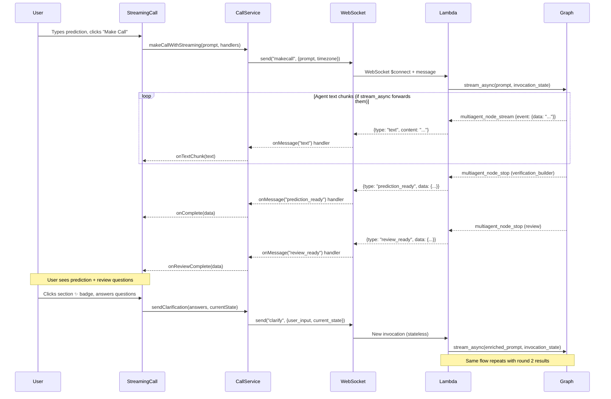
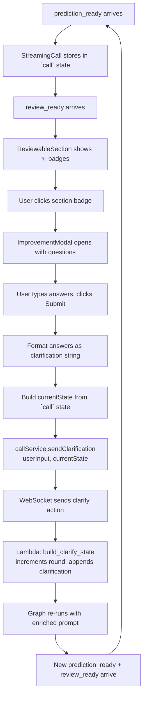

# Design Document — Spec 3: Frontend v2 Protocol Alignment

## Overview

This spec completes the v2 migration by fixing the frontend-backend integration. The backend (Spec 2) works correctly — `prediction_ready` and `review_ready` messages arrive as confirmed via console logs. Three categories of work remain:

1. **Streaming text diagnosis and fix** (backend-only) — The v2 `stream_async` event forwarding may not send text chunks in the format the frontend expects, or may not forward text events at all. The frontend streaming code is correct and unchanged from v1.

2. **Clarification UI** — Re-enable the v1 `ImprovementModal` component and wire it to the v2 `sendClarification()` flow. The UI design is correct; only the plumbing changed.

3. **Dead code removal** — Delete four unused v1 files and clean up stale references.

4. **LogCallButton compatibility** — Verify the `prediction_ready` data shape matches what the save API expects.

### Why This Is Mostly Frontend Work

The v2 backend is stateless and working. The frontend holds session state (Decision 8 from the project narrative). The fixes are about making the frontend correctly consume v2 messages and send v2 actions. The one exception is Requirement 1 (streaming text), which may require a backend change if `stream_async` doesn't forward agent text events.

### Learning Goals

This design explains the "why" behind each decision, discusses alternatives, and teaches Strands streaming patterns as they come up.

## Architecture

The system follows a WebSocket-based request/response pattern with two-push delivery:



### Clarification Round Data Flow

This is the most important data flow to understand. The frontend is the session owner — it holds all state and sends it back to the backend on each clarify request.



The `currentState` sent in the clarify request contains everything the backend needs to reconstruct the graph state:
- `prediction_statement`, `verification_date`, `date_reasoning` → becomes `prev_parser_output`
- `verifiable_category`, `category_reasoning` → becomes `prev_categorizer_output`  
- `verification_method` → becomes `prev_vb_output`
- `round`, `user_clarifications` → round tracking
- `user_timezone`, `user_prompt` → carried forward from round 1

This is the "frontend-as-session" pattern (Decision 8). The backend is completely stateless — any Lambda instance can handle any round.

## Components and Interfaces

### Component 1: Streaming Text Fix (Backend — Requirement 1)

**The Problem:**
In v1, each agent had a `callback_handler` that sent text chunks directly to the WebSocket:
```python
# v1 pattern (deleted in Spec 2)
def create_streaming_callback(api_gateway_client, connection_id):
    def callback(**kwargs):
        if "data" in kwargs:
            send_ws(api_gateway_client, connection_id, "text", content=kwargs["data"])
    return callback
```

In v2, agents are graph nodes. The graph's `stream_async` wraps agent events in `multiagent_node_stream` events. The Lambda handler attempts to forward these:
```python
# Current v2 code in execute_and_deliver()
if event_type == "multiagent_node_stream":
    inner_event = event_data.get("event", {})
    if "data" in inner_event:
        send_ws(api_gateway_client, connection_id, "text", content=inner_event["data"])
```

**Analysis of the `send_ws` call:**
The `send_ws` function puts `content` into `**extra`, which becomes a top-level field:
```python
# send_ws produces: {"type": "text", "content": "chunk text"}
```
The frontend's `websocket.ts` passes the full parsed message to handlers. The `callService.ts` text handler does `data.content` where `data` IS the full message. So `data.content` correctly accesses the `content` field. The wire format is correct.

**The real question:** Does `stream_async` actually yield `multiagent_node_stream` events with `data` for text generation?

The Strands docs show this pattern:
```python
elif event.get("type") == "multiagent_node_stream":
    inner_event = event["event"]
    if "data" in inner_event:
        print(inner_event["data"], end="")
```

This confirms `stream_async` DOES forward agent text events as `multiagent_node_stream` with nested `event.data`. The current backend code matches this pattern exactly.

**Investigation approach (two-track):**

Track A — Verify current code works:
1. Add temporary debug logging to `execute_and_deliver()` to log ALL events from `stream_async` (event type + keys)
2. Make a test prediction and check CloudWatch logs
3. If `multiagent_node_stream` events with `data` appear → the code should work, look for WebSocket send failures
4. If no `data` events appear → `stream_async` doesn't forward text events in this Lambda context

Track B — Fallback to per-agent callbacks:
If Track A shows `stream_async` doesn't forward text events, restore the v1 callback pattern:
1. Create a `create_streaming_callback(api_gateway_client, connection_id)` function
2. Pass it to each agent's `callback_handler` parameter when creating agents in `prediction_graph.py`
3. Text chunks go directly to WebSocket via callbacks, bypassing `stream_async`
4. `stream_async` still handles node_stop events for two-push delivery

**Why callbacks work even inside a graph:**
Strands agents fire their `callback_handler` during execution regardless of whether they're running standalone or as graph nodes. The callback is an agent-level feature, not a graph-level feature. So a callback that sends WebSocket messages will fire during graph execution — the graph's `stream_async` and the agent's callbacks are independent channels.

**Design decision:** Try Track A first (verify current code). If it works, no code changes needed for streaming. If it doesn't, implement Track B (callbacks). The design below covers both tracks.

**Files affected:**
- `backend/.../strands_make_call_graph.py` — Add debug logging (Track A), or add callback factory (Track B)
- `backend/.../prediction_graph.py` — Pass callbacks to agents (Track B only)

### Component 2: Clarification UI (Frontend — Requirement 2)

**What exists and works:**
- `ImprovementModal.tsx` — Modal with questions + text inputs. Props: `isOpen`, `section`, `questions`, `reasoning`, `onSubmit(answers: string[])`, `onCancel`. Fully functional UI.
- `ReviewableSection.tsx` — Clickable section with ✨ badge. Calls `onImprove(section)` on click. Working.
- `useReviewState.ts` — Manages modal state: `startImprovement(section, questions)` opens modal, `cancelImprovement()` closes it. Working.
- `callService.sendClarification(userInput, currentState)` — Sends `{action: "clarify", user_input, current_state}` via WebSocket. Working.

**What needs to change in `StreamingCall.tsx`:**

1. **Uncomment the `ImprovementModal` JSX** (currently commented out at bottom of component)

2. **Add `ImprovementModal` import** (currently not imported)

3. **Wire `onSubmit`** — Format the user's answers into a clarification string and call `sendClarification`:
   ```typescript
   const handleClarificationSubmit = async (answers: string[]) => {
     // Format answers with their questions for context
     const section = reviewState.improvingSection;
     const sectionData = reviewState.reviewableSections.find(s => s.section === section);
     const questions = sectionData?.questions || [];
     
     // Build a human-readable clarification string
     const clarification = questions.map((q, i) => 
       `Q: ${q}\nA: ${answers[i] || '(no answer)'}`
     ).join('\n\n');
     
     // Build currentState from the current call data
     const currentState = {
       ...call,
       user_prompt: prompt,  // Original prediction text
     };
     
     // Close modal, show processing state
     cancelImprovement();
     setIsProcessing(true);
     setStreamingText('');
     
     // Send clarification — same handlers fire for the new round
     await callService.sendClarification(clarification, currentState);
   };
   ```

4. **Wire `onCancel`** — Call `cancelImprovement()` from `useReviewState`:
   ```typescript
   const handleModalCancel = () => {
     cancelImprovement();
   };
   ```

5. **Add `cancelImprovement` to the destructured hook** — It's already returned by `useReviewState` but not destructured in `StreamingCall.tsx`.

**Why format answers as a string, not structured data:**
The backend's `build_clarify_state` puts `user_input` into the `user_clarifications` list, which gets appended to the prompt. Agents read natural language, not JSON. A formatted Q&A string like:
```
Q: What city are you in?
A: San Francisco

Q: Do you mean Eastern or Pacific time?
A: Pacific
```
...is exactly what agents need to refine their output. The backend doesn't parse the clarification — it passes it through to the prompt.

**State management during clarification:**
- When clarification is sent: `setIsProcessing(true)`, `setStreamingText('')` (clear old streaming text), keep `call` visible (user can still see and submit the current prediction)
- When new `prediction_ready` arrives: the existing `onComplete` handler updates `call` state, sets `isProcessing(false)` — this already works
- When new `review_ready` arrives: the existing `onReviewComplete` handler updates review sections — this already works
- The `call` state already contains `round` and `user_clarifications` from `build_prediction_ready()`, so `currentState` in the clarify request automatically carries round context

**Multi-round support:**
Each `prediction_ready` includes `round` and `user_clarifications` in its data (added by `build_prediction_ready()`). When the user clarifies again, the frontend sends this data back as `currentState`. The backend increments `round` and appends the new clarification. No special multi-round logic needed in the frontend — it's inherent in the data flow.

### Component 3: Dead Code Removal (Frontend — Requirement 3)

**Files to delete:**
| File | Why it's dead |
|------|--------------|
| `frontend/src/services/reviewWebSocket.ts` | References `review_complete` type, not imported by any active code |
| `frontend/src/services/predictionService.ts` | v1 prediction service, not used by active components |
| `frontend/src/hooks/useImprovementHistory.ts` | v1 improvement history hook, not imported |
| `frontend/src/components/StreamingPrediction.tsx` | v1 streaming component, not rendered in App.tsx |

**Barrel export cleanup:**
- `frontend/src/services/index.ts` — Remove `export * from './predictionService'`

**Reference cleanup:**
- Verify no active code imports from deleted files
- The only references to old v1 message types (`call_response`, `review_complete`, `improvement_questions`, `improved_response`) in active code are in comments in `callService.ts` explaining the v2 changes — these are documentation, not code references, and should stay

**`useReviewState.ts` cleanup:**
The `setImprovementInProgress` function is still used in `StreamingCall.tsx`'s review handler:
```typescript
setImprovementInProgress(false);
```
In v2, this is called when `review_ready` arrives. It sets `isImproving: false` and clears the review status. This is still useful — when a clarification round completes and new review data arrives, we want to clear the "improving" indicator. Keep `setImprovementInProgress` but rename the concept: it now means "clarification in progress" rather than "v1 improvement in progress". The function behavior is identical, just the semantic context changed.

### Component 4: LogCallButton Compatibility (Frontend — Requirement 4)

**Data flow analysis:**

1. Backend `build_prediction_ready()` produces:
   ```python
   {
     "prediction_statement": "...",
     "verification_date": "...",
     "date_reasoning": "...",
     "verifiable_category": "...",
     "category_reasoning": "...",
     "verification_method": {...},
     "prediction_date": "...",
     "timezone": "UTC",
     "user_timezone": "...",
     "local_prediction_date": "...",
     "initial_status": "pending",
     "round": 1,
     "user_clarifications": []
   }
   ```

2. `callService.ts` `prediction_ready` handler calls `onComplete(data.data)` — passes the inner `data` dict

3. `StreamingCall.tsx` `onComplete` handler:
   ```typescript
   const parsedResponse = typeof finalResponse === 'string' 
     ? JSON.parse(finalResponse) : finalResponse;
   setCall(parsedResponse);
   const apiResponse: APIResponse = { results: [parsedResponse] };
   setResponse(apiResponse);
   ```

4. `LogCallButton` accesses `response.results[0]` and sends it to `/log-call`

**Field compatibility check:**
| Field | LogCallButton expects | prediction_ready provides | Match? |
|-------|----------------------|--------------------------|--------|
| prediction_statement | ✅ | ✅ | ✅ |
| verification_date | ✅ | ✅ | ✅ |
| verifiable_category | ✅ | ✅ | ✅ |
| category_reasoning | ✅ | ✅ | ✅ |
| verification_method | ✅ | ✅ | ✅ |
| initial_status | ✅ | ✅ ("pending") | ✅ |
| prediction_date | ✅ | ✅ | ✅ |
| local_prediction_date | ✅ | ✅ | ✅ |
| date_reasoning | ✅ | ✅ | ✅ |

The v2 `prediction_ready` data includes two extra fields (`round`, `user_clarifications`) that v1 didn't have. These are harmless — the `/log-call` API and DynamoDB write ignore unknown fields. The DynamoDB save format is unchanged.

**Verdict:** LogCallButton is compatible with v2 data. No changes needed.

## Data Models

### WebSocket Message Types (v2 Protocol)

**Server → Client messages:**

```typescript
// Streaming text from agent reasoning
{ type: "text", content: string }

// Agent tool usage
{ type: "tool", name: string }

// Processing status
{ type: "status", status: "processing", message?: string }

// Pipeline results (first push — user can submit immediately)
{ type: "prediction_ready", data: PredictionReadyData }

// Review results (second push — improvement suggestions)
{ type: "review_ready", data: ReviewReadyData }

// Graph execution complete
{ type: "complete", status: "ready" }

// Error
{ type: "error", message: string }
```

**Client → Server messages:**

```typescript
// Round 1: Make a prediction
{ action: "makecall", prompt: string, timezone: string }

// Round 2+: Clarify and re-run
{ action: "clarify", user_input: string, current_state: PredictionReadyData }
```

### PredictionReadyData

```typescript
interface PredictionReadyData {
  // Agent outputs
  prediction_statement: string;
  verification_date: string;       // UTC ISO format
  date_reasoning: string;
  verifiable_category: string;     // e.g., "agent_verifiable", "human_verifiable_only"
  category_reasoning: string;
  verification_method: {
    source: string[];
    criteria: string[];
    steps: string[];
  };
  
  // Metadata
  prediction_date: string;         // UTC ISO format
  timezone: "UTC";
  user_timezone: string;           // e.g., "America/Los_Angeles"
  local_prediction_date: string;
  initial_status: "pending";
  
  // Round context (for clarify requests)
  round: number;
  user_clarifications: string[];
}
```

### ReviewReadyData

```typescript
interface ReviewReadyData {
  reviewable_sections: Array<{
    section: string;        // e.g., "prediction_statement", "verifiable_category"
    improvable: boolean;
    questions: string[];    // ReviewAgent's questions for this section
    reasoning: string;      // Why this section could be improved
  }>;
}
```

### State Ownership

| State | Owner | Lifetime |
|-------|-------|----------|
| Current prediction data | Frontend (`call` state in StreamingCall) | Until new prediction_ready or page refresh |
| Round number | Frontend (inside `call.round`) | Carried in prediction_ready, sent back in clarify |
| Clarification history | Frontend (inside `call.user_clarifications`) | Accumulated across rounds |
| Review sections | Frontend (`useReviewState` hook) | Until new review_ready or page refresh |
| Graph execution state | Backend (Lambda invocation) | Single Lambda invocation only |
| Permanent record | DynamoDB | Forever (written on "Log Call") |


## Correctness Properties

*A property is a characteristic or behavior that should hold true across all valid executions of a system — essentially, a formal statement about what the system should do. Properties serve as the bridge between human-readable specifications and machine-verifiable correctness guarantees.*

### Property 1: send_ws text message format

*For any* text string, calling `send_ws` with message_type `"text"` and `content=text` should produce a JSON message with exactly `{"type": "text", "content": text}` — matching the wire format the frontend expects.

This is an invariant property. The `send_ws` function uses `**extra` kwargs as top-level fields. For text streaming to work, the `content` kwarg must appear as a top-level field in the serialized message, not nested under `data`. We verify this for all possible text strings (including empty, unicode, multiline).

**Validates: Requirements 1.2**

### Property 2: Review sections state management

*For any* list of `ReviewableSection` objects (varying length, section names, question counts), calling `updateReviewSections(sections)` should result in `reviewState.reviewableSections` containing exactly those sections, and `reviewState.reviewStatus` being cleared to empty string.

This is an invariant property on the state management hook. The review sections from `review_ready` must be faithfully stored without transformation or loss.

**Validates: Requirements 2.2**

### Property 3: Clarification string formatting

*For any* list of question-answer pairs (where questions are non-empty strings and answers are arbitrary strings), the formatted clarification string should contain every question and every non-empty answer. Specifically, for each question `q` at index `i`, the output should contain `Q: {q}` and if `answers[i]` is non-empty, it should contain `A: {answers[i]}`.

This is an invariant property on the formatting function. The clarification string is what agents read to understand the user's refinement intent — losing a question or answer would cause agents to miss context.

**Validates: Requirements 2.4**

### Property 4: Round state accumulation

*For any* valid `current_state` with round number N (N ≥ 1) and existing clarification list of length M, and any non-empty `user_input` string, calling `build_clarify_state` should produce a state with `round = N + 1` and `user_clarifications` of length `M + 1` where the last element is the new `user_input`.

This is an invariant property on the backend's state builder. Round numbers must monotonically increase and clarifications must accumulate without loss. This is the core of multi-round refinement correctness.

**Validates: Requirements 2.6**

### Property 5: prediction_ready contains all required fields

*For any* valid `pipeline_data` dict and `state` dict (with required keys), `build_prediction_ready(pipeline_data, state)` should return a dict containing all required fields: `prediction_statement`, `verification_date`, `date_reasoning`, `verifiable_category`, `category_reasoning`, `verification_method`, `prediction_date`, `local_prediction_date`, `initial_status`, `round`, `user_clarifications`.

This is an invariant property on the response builder. The frontend and LogCallButton depend on all these fields being present. Missing fields would cause undefined access errors or failed saves.

**Validates: Requirements 4.2**

## Error Handling

### WebSocket Errors

| Error | Source | Handling |
|-------|--------|----------|
| WebSocket disconnect during streaming | Network | `send_ws` catches exception, logs warning, graph continues. Frontend shows last received state. |
| WebSocket disconnect during clarify | Network | Same as above. User can refresh and re-submit. |
| Invalid JSON from backend | Backend bug | `websocket.ts` catches parse error, logs to console. Message dropped. |
| Missing handler for message type | Protocol mismatch | `websocket.ts` logs "No handler for message type". Non-fatal. |

### Clarification Errors

| Error | Source | Handling |
|-------|--------|----------|
| Empty answers submitted | User | `ImprovementModal` disables submit button when all answers are empty. |
| `sendClarification` fails | WebSocket | Error propagates to `callService`, which calls `onError`. StreamingCall shows error banner. |
| Backend returns error for clarify | Backend | `error` message type handler shows error in UI. Previous prediction remains visible and submittable. |
| `build_clarify_state` validation fails | Missing fields | Backend returns 400 with error message. Frontend shows error. |

### Graceful Degradation

- If `review_ready` never arrives (ReviewAgent fails): prediction is still visible and submittable. No ✨ badges appear. User can log the call without clarification.
- If `stream_async` doesn't forward text events: user sees "Processing..." indicator but no streaming text. Prediction still arrives correctly via `prediction_ready`.
- If clarification round fails: previous prediction remains in `call` state. User can submit the previous version or try clarifying again.

## Testing Strategy

### Property-Based Testing

Use **Hypothesis** (Python) for backend properties and **fast-check** (TypeScript) for frontend properties. Each property test runs minimum 100 iterations.

**Python properties (pytest + hypothesis):**

| Property | Test Location | What It Tests |
|----------|--------------|---------------|
| Property 1: send_ws format | `tests/test_send_ws.py` | `send_ws` produces correct JSON for text messages |
| Property 4: Round accumulation | `tests/test_build_clarify_state.py` | `build_clarify_state` increments round and accumulates clarifications |
| Property 5: prediction_ready fields | `tests/test_build_prediction_ready.py` | `build_prediction_ready` includes all required fields |

```python
# Feature: v3-frontend-v2-protocol, Property 1: send_ws text message format
@given(st.text())
def test_send_ws_text_format(text_content):
    """For any text string, send_ws with type 'text' and content=text
    should produce {"type": "text", "content": text}."""
    # Mock api_gateway_client, capture posted data
    # Assert message has exactly type and content at top level
    pass

# Feature: v3-frontend-v2-protocol, Property 4: Round state accumulation
@given(
    round_num=st.integers(min_value=1, max_value=100),
    existing_clarifications=st.lists(st.text(min_size=1), max_size=20),
    new_input=st.text(min_size=1)
)
def test_round_accumulation(round_num, existing_clarifications, new_input):
    """For any round N and clarification list, build_clarify_state should
    produce round N+1 with the new clarification appended."""
    pass
```

**TypeScript properties (vitest + fast-check):**

| Property | Test Location | What It Tests |
|----------|--------------|---------------|
| Property 2: Review sections state | `frontend/src/hooks/__tests__/useReviewState.test.ts` | `updateReviewSections` stores sections correctly |
| Property 3: Clarification formatting | `frontend/src/utils/__tests__/formatClarification.test.ts` | Formatting function preserves all Q&A pairs |

```typescript
// Feature: v3-frontend-v2-protocol, Property 3: Clarification string formatting
fc.assert(
  fc.property(
    fc.array(fc.record({
      question: fc.string({ minLength: 1 }),
      answer: fc.string()
    }), { minLength: 1 }),
    (pairs) => {
      const questions = pairs.map(p => p.question);
      const answers = pairs.map(p => p.answer);
      const result = formatClarification(questions, answers);
      // Every question appears in the output
      questions.forEach(q => expect(result).toContain(`Q: ${q}`));
      // Every non-empty answer appears in the output
      answers.filter(a => a.trim()).forEach(a => expect(result).toContain(a));
    }
  ),
  { numRuns: 100 }
);
```

### Unit Tests

Unit tests cover specific examples, edge cases, and integration points that property tests don't reach:

| Test | What It Covers |
|------|---------------|
| `send_ws` with `data` param vs `**extra` | Verify `data` goes under `data` key, extras go top-level |
| `build_clarify_state` with missing `user_input` | Returns `(None, "Missing required field: user_input")` |
| `build_clarify_state` with missing `current_state` | Returns `(None, "Missing required field: current_state")` |
| `build_prediction_ready` with empty pipeline_data | All fields get fallback defaults |
| `ImprovementModal` submit disabled when all answers empty | Button disabled state |
| `ImprovementModal` submit enabled when any answer non-empty | Button enabled state |
| Review sections with 0 sections | No ✨ badges rendered |
| LogCallButton with v2 prediction_ready data | Sends correct payload to `/log-call` |

### Integration / E2E Tests (Manual)

These require a running backend and are verified manually during Requirement 5:

1. Make prediction → see streaming text → see structured result
2. See review questions with ✨ badges → click badge → modal opens
3. Answer questions → submit → see "Processing..." → see updated result
4. Log call → verify DynamoDB record
5. `npm run build` completes with zero errors
6. No console errors during normal flow

### Test Configuration

- Python: `pytest` with `hypothesis` library, min 100 examples per property
- TypeScript: `vitest` with `fast-check` library, min 100 runs per property
- Each property test tagged with: `Feature: v3-frontend-v2-protocol, Property N: {title}`
- Extract `formatClarification` into a pure utility function (`frontend/src/utils/formatClarification.ts`) to make it independently testable
