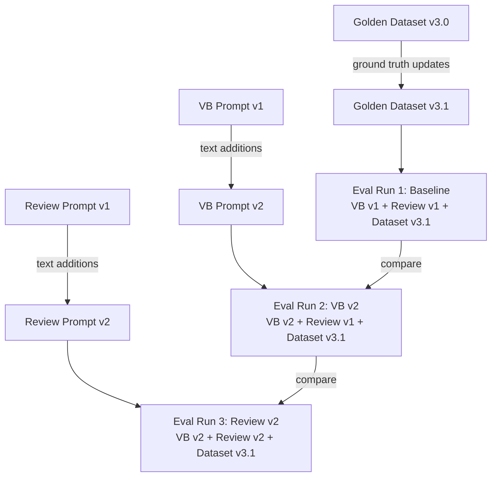

# Design Document: VB Prompt Iteration

## Overview

This spec iterates on the Verification Builder (VB) prompt to fix two systematic failure patterns identified by the IntentPreservation (0.66 avg) and CriteriaMethodAlignment (0.71 avg) evaluators:

1. **Over-engineering subjective predictions** — The VB v1 produces philosophical hedging ("enjoyment is subjective...") instead of actionable verification plans. For operationalizable terms ("go well", "beat the level"), it should produce measurable conditions. For truly subjective states ("feel happy", "enjoy"), it should produce structured self-report plans.

2. **Specificity mismatch** — The VB v1 sometimes adds conditions the prediction didn't claim or weakens directional claims (e.g., "after 6pm" becomes "before or after 6pm").

The changes are primarily prompt text additions (not new code), golden dataset ground truth updates for 7 subjective test cases, a ReviewAgent prompt update for operationalization-validating questions, and an eval run plan to measure improvement.

## Architecture

The system architecture remains unchanged. This spec modifies three existing artifacts in isolated steps, each with its own eval run to measure the effect of a single variable:



**Isolation principle:** Each eval run changes exactly one variable from the previous run. This lets us attribute score changes to the specific change that caused them:
- Run 1 → Run 2 delta: caused by VB prompt changes only
- Run 2 → Run 3 delta: caused by Review prompt changes only
- Run 1 baseline vs original baseline: caused by ground truth corrections only

All changes flow through existing infrastructure:
- **Prompt text** → `infrastructure/prompt-management/template.yaml` (CloudFormation)
- **Prompt versions** → New `AWS::Bedrock::PromptVersion` resources in the same template
- **Golden dataset** → `eval/golden_dataset.json` (JSON file, version bump)
- **Eval runs** → `eval_runner.py` with `--judge --compare` flags

No new Lambda functions, evaluators, or dashboard pages are needed.

## Components and Interfaces

### Component 1: VB Prompt v2 Text

The VB prompt in `template.yaml` (resource `VBPrompt`) gets two new instruction blocks appended to the existing system prompt text:

**Block A — Operationalization Instructions:**
- Directive to convert vague terms into measurable conditions when external proxies exist
- Directive to use structured self-report when no external proxy exists (truly subjective)
- Two worked examples demonstrating the two-track approach
- Directive to state operationalization assumptions explicitly
- Directive to flag assumptions for ReviewAgent clarification

**Block B — Specificity Matching Instructions:**
- Rule: criteria must not introduce conditions the prediction didn't state
- Rule: criteria must not omit conditions the prediction did state
- One worked example showing a directional claim preserved correctly

### Component 2: VB Prompt Version v2

A new `AWS::Bedrock::PromptVersion` resource (`VBPromptVersionV2`) in `template.yaml`:
- `DependsOn: VBPromptVersion` (ensures correct version ordering)
- `Description: "v2 — operationalization instructions and specificity matching"`

### Component 3: Review Prompt v2 Text

The Review prompt (resource `ReviewPrompt`) gets a new instruction block:

**Block C — Operationalization Validation:**
- Directive to identify operationalization assumptions made by the VB
- Directive to generate specific clarification questions validating those assumptions (not generic "can you be more specific?")
- Directive to ask questions that could lead to verifiable reformulations for subjective predictions

### Component 4: Review Prompt Version v2

A new `AWS::Bedrock::PromptVersion` resource (`ReviewPromptVersionV2`) in `template.yaml`:
- `DependsOn: ReviewPromptVersion` (ensures correct version ordering)
- `Description: "v2 — operationalization validation questions"`

### Component 5: Golden Dataset v3.1 Ground Truth Updates

Updates to `eval/golden_dataset.json` for 7 subjective test cases. The `dataset_version` bumps from `"3.0"` to `"3.1"`. Each update modifies `expected_verification_criteria` and `expected_verification_method` to reflect the two-track approach:

| Test Case | Prediction | Track | Updated Ground Truth Strategy |
|-----------|-----------|-------|-------------------------------|
| base-027 | "enjoy the movie" | Self-report | Structured self-report with timing and specific prompt |
| base-028 | "meeting go well" | Operationalize | Observable outcomes: decisions made, action items, no unresolved conflicts |
| base-030 | "feel happy" | Self-report | Morning self-report with specific timing |
| base-032 | "daughter love present" | Self-report | Observation of recipient reaction + parent report |
| base-034 | "dinner taste good" | Self-report | Post-dinner self-report (taste is inherently personal) |
| base-036 | "beat game level" | Operationalize | Binary outcome: level completion confirmed by user |
| base-041 | "code compile first try" | Operationalize | Binary outcome: compilation succeeds without errors |

### Component 6: Eval Run Plan — Isolated Single-Variable Changes

Three eval runs, each changing exactly one variable:

1. **Run 1 — New baseline** (golden dataset v3.1 only, no prompt changes)
   - VB v1 + Review v1 + Dataset v3.1
   - Measures: effect of corrected ground truth on evaluator scores
   
2. **Run 2 — VB v2** (VB prompt change only)
   - VB v2 + Review v1 + Dataset v3.1
   - Measures: effect of VB operationalization + specificity instructions
   - Compare against Run 1

3. **Run 3 — Review v2** (Review prompt change only)
   - VB v2 + Review v2 + Dataset v3.1
   - Measures: effect of operationalization-validating clarification questions
   - Compare against Run 2


## Data Models

### VB Prompt v2 — Proposed Text Additions

The following text blocks are appended to the existing VB prompt body in `template.yaml`, after the existing instructions and before the REFINEMENT MODE section.

**Block A — Operationalization Instructions (appended after "Realistic and achievable"):**

```
HANDLING VAGUE OR SUBJECTIVE PREDICTIONS:

When a prediction uses vague language ("nice weather", "go well", "taste good"),
apply the appropriate strategy:

Track 1 — Operationalize (when external proxies exist):
Convert the vague term into specific, measurable conditions with default thresholds.
State your assumptions explicitly in the criteria.
Flag assumptions for the ReviewAgent to validate via clarification questions.

  Example: "It'll be nice out this weekend"
  → criteria: ["Temperature between 60-80°F, precipitation probability below 30%,
     and wind speed under 15 mph on Saturday and Sunday
     (assuming 'nice' means warm, dry, and calm — ReviewAgent should validate
     these thresholds with the user)"]
  → source: ["weather forecast service (e.g., weather.gov, OpenWeatherMap)"]
  → steps: ["Query weather forecast for the user's location for Saturday and Sunday",
     "Check temperature, precipitation probability, and wind speed against thresholds",
     "All three conditions must be met on at least one of the two days"]

Track 2 — Self-report (when no external proxy exists):
For truly subjective internal states (emotions, taste, enjoyment), use a structured
self-report plan with specific timing and a concrete yes/no prompt.

  Example: "I will feel happy when I wake up tomorrow morning"
  → criteria: ["User self-reports feeling happy upon waking tomorrow morning"]
  → source: ["user self-report"]
  → steps: ["Schedule verification prompt for tomorrow at 8am",
     "Send prompt: 'You predicted you would feel happy when you woke up. Are you feeling happy? (yes/no)'",
     "Record the self-assessment as the verification outcome"]

SPECIFICITY MATCHING:

Your criteria must match the specificity of the original prediction:
- Do NOT add conditions the prediction did not state.
  Bad: prediction says "after 6pm" → criteria says "before or after 6pm"
- Do NOT omit conditions the prediction did state.
  Bad: prediction says "at least 70°F" → criteria drops the 70°F threshold
- Preserve directional claims exactly.

  Example: "The S&P 500 will close higher today"
  → criteria: ["S&P 500 closing price today > S&P 500 closing price yesterday"]
  NOT: ["S&P 500 closing price today differs from yesterday"]
```

**Block C — Review Prompt v2 Additions (appended after existing EVALUATION CRITERIA):**

```
OPERATIONALIZATION VALIDATION:

When the Verification Builder has operationalized a vague term (converted it into
measurable conditions with assumed thresholds), you MUST:

1. Identify each operationalization assumption (e.g., "assuming 'nice weather' means 60-80°F")
2. Generate specific clarification questions that validate those assumptions:
   - Good: "Do you consider 60°F a nice day, or is your threshold higher?"
   - Bad: "Can you be more specific about what you mean?"
3. For truly subjective predictions, ask questions that could lead to verifiable
   reformulations:
   - "What would make the meeting 'go well' for you — decisions made? No conflicts?
     Finishing on time?"
   - "What does 'enjoy' mean for you with movies — entertainment value? Emotional
     impact? Not falling asleep?"
```

### Golden Dataset v3.1 — Specific Ground Truth Updates

Below are the exact `expected_verification_criteria` and `expected_verification_method` values for each of the 7 subjective test cases:

**base-027** ("I will enjoy the movie I am seeing tonight") — Track 2: Self-report
- `expected_verification_criteria`: `["User self-reports a positive experience after watching the movie tonight, answering 'yes' to: 'Did you enjoy the movie?' prompted within 30 minutes of the movie ending"]`
- `expected_verification_method`: `"Schedule a self-report prompt for approximately 30 minutes after the estimated movie end time. Ask: 'You predicted you would enjoy the movie. Did you enjoy it? (yes/no)'. Enjoyment is a subjective internal state — only the viewer can assess it."`

**base-028** ("My meeting with the team tomorrow at 2pm will go well") — Track 1: Operationalize
- `expected_verification_criteria`: `["The team meeting at 2pm tomorrow results in at least one concrete decision or action item, no unresolved conflicts requiring follow-up, and the user assesses it as productive (assuming 'go well' means productive outcomes — ReviewAgent should validate what 'well' means to this user)"]`
- `expected_verification_method`: `"Prompt the user after the meeting (approximately 3pm tomorrow) to report: (1) were concrete decisions or action items produced? (2) were there unresolved conflicts? (3) overall, did it feel productive? Combines observable meeting outcomes with participant assessment."`

**base-030** ("I will feel happy when I wake up tomorrow morning") — Track 2: Self-report
- `expected_verification_criteria`: `["User self-reports feeling happy upon waking tomorrow morning, answering 'yes' to: 'Are you feeling happy this morning?' prompted at approximately 8am"]`
- `expected_verification_method`: `"Schedule a self-report prompt for tomorrow at 8am. Ask: 'You predicted you would feel happy when you woke up. Are you feeling happy? (yes/no)'. Happiness is a subjective internal state — no external measurement applies."`

**base-032** ("My daughter will love the birthday present I got her") — Track 2: Self-report
- `expected_verification_criteria`: `["The user reports that their daughter expressed clear positive reaction (joy, excitement, or enthusiastic gratitude) upon receiving the birthday present, answering 'yes' to: 'Did your daughter love the present?'"]`
- `expected_verification_method`: `"Prompt the user the day after the birthday to report the daughter's reaction. Ask: 'Did your daughter love the birthday present? (yes/no)'. This requires the user's observation and interpretation of another person's emotional response — no tool can assess this."`

**base-034** ("The dinner I'm cooking tonight will taste good") — Track 2: Self-report
- `expected_verification_criteria`: `["User self-reports that the dinner tasted good after eating, answering 'yes' to: 'Did the dinner taste good?' prompted after the meal"]`
- `expected_verification_method`: `"Schedule a self-report prompt for tonight at approximately 9pm (after dinner). Ask: 'You predicted dinner would taste good. Did it? (yes/no)'. Taste is an inherently personal sensory experience — no external tool can assess it."`

**base-036** ("I'll beat this video game level tonight") — Track 1: Operationalize
- `expected_verification_criteria`: `["The user successfully completes (advances past) the video game level they are currently attempting, confirmed by the user reporting 'yes' to level completion before going to bed tonight"]`
- `expected_verification_method`: `"Prompt the user late tonight (approximately 11pm) to report: 'Did you beat the game level tonight? (yes/no/didn't play)'. Level completion is a binary objective outcome tracked by the game itself, but not externally accessible — requires user confirmation."`

**base-041** ("My code will compile on the first try") — Track 1: Operationalize
- `expected_verification_criteria`: `["The user's code compiles without errors on the first compilation attempt, confirmed by the user reporting 'yes' to: 'Did your code compile on the first try?'"]`
- `expected_verification_method`: `"Prompt the user after their next coding session to report: 'Did your code compile on the first try? (yes/no)'. Compilation success is a binary objective outcome, but without a CI/CD tool in the tool manifest, it requires user self-report."`

### CloudFormation Version Resources

Two new resources added to `template.yaml`:

```yaml
VBPromptVersionV2:
  Type: AWS::Bedrock::PromptVersion
  DependsOn: VBPromptVersion
  Properties:
    PromptArn: !GetAtt VBPrompt.Arn
    Description: "v2 — operationalization instructions and specificity matching"

ReviewPromptVersionV2:
  Type: AWS::Bedrock::PromptVersion
  DependsOn: ReviewPromptVersion
  Properties:
    PromptArn: !GetAtt ReviewPrompt.Arn
    Description: "v2 — operationalization validation questions"
```

### Eval Run Commands

```bash
# From: /home/wsluser/projects/calledit/backend/calledit-backend/handlers/strands_make_call

# Run 1: New baseline — VB v1 + Review v1 + updated dataset v3.1
# (run AFTER golden dataset ground truth updates, BEFORE any prompt changes)
PROMPT_VERSION_PARSER=1 PROMPT_VERSION_CATEGORIZER=2 \
PROMPT_VERSION_VB=1 PROMPT_VERSION_REVIEW=1 \
/home/wsluser/projects/calledit/venv/bin/python eval_runner.py \
  --dataset ../../../../eval/golden_dataset.json --judge

# Run 2: VB v2 — after deploying VB prompt changes only
# (Review prompt still at v1)
PROMPT_VERSION_PARSER=1 PROMPT_VERSION_CATEGORIZER=2 \
PROMPT_VERSION_VB=2 PROMPT_VERSION_REVIEW=1 \
/home/wsluser/projects/calledit/venv/bin/python eval_runner.py \
  --dataset ../../../../eval/golden_dataset.json --judge --compare

# Run 3: Review v2 — after deploying Review prompt changes
# (VB prompt stays at v2)
PROMPT_VERSION_PARSER=1 PROMPT_VERSION_CATEGORIZER=2 \
PROMPT_VERSION_VB=2 PROMPT_VERSION_REVIEW=2 \
/home/wsluser/projects/calledit/venv/bin/python eval_runner.py \
  --dataset ../../../../eval/golden_dataset.json --judge --compare
```


## Correctness Properties

*A property is a characteristic or behavior that should hold true across all valid executions of a system — essentially, a formal statement about what the system should do. Properties serve as the bridge between human-readable specifications and machine-verifiable correctness guarantees.*

### Property 1: Two-track ground truth correctness

*For any* subjective test case in the golden dataset, the `expected_verification_criteria` follows the correct track based on prediction type: operationalizable predictions (base-028, base-036, base-041) contain measurable conditions or observable binary outcomes, and self-report predictions (base-027, base-030, base-032, base-034) contain a structured self-report plan with a specific yes/no prompt. In all cases, the criteria contains at least one checkable true/false condition.

**Validates: Requirements 4.1, 4.2, 4.3, 4.6**

### Property 2: Method-criteria consistency

*For any* updated subjective test case, the `expected_verification_method` is consistent with the `expected_verification_criteria` track — operationalized criteria (containing measurable conditions or observable outcomes) are paired with methods that reference observable data or structured user reporting of outcomes, and self-report criteria are paired with methods that describe a timed user prompt.

**Validates: Requirements 4.4**

### Property 3: VB prompt contains required instruction blocks

*For any* valid VB prompt v2 text, the prompt contains: (a) instructions for operationalizing vague terms into measurable conditions, (b) instructions for self-report when no external proxy exists, (c) at least two worked examples of the two-track approach, (d) instructions to state operationalization assumptions explicitly, (e) instructions to flag assumptions for ReviewAgent, (f) a specificity matching rule against adding unstated conditions, (g) a specificity matching rule against omitting stated conditions, and (h) at least one worked example of specificity matching.

**Validates: Requirements 1.1, 1.2, 1.3, 1.4, 1.5, 2.1, 2.2, 2.3, 2.4**

### Property 4: CloudFormation version resource structure

*For any* new prompt version resource added to the template, the resource has type `AWS::Bedrock::PromptVersion`, a `DependsOn` reference to the previous version resource, and a `Description` field summarizing the changes.

**Validates: Requirements 3.1, 3.2, 3.3, 5.4, 8.2**

## Error Handling

This spec involves prompt text changes and dataset updates — there is minimal new error-handling code. The key failure modes are:

1. **CloudFormation deployment failure** — If the template has syntax errors or invalid resource references, `aws cloudformation deploy` will fail and roll back. The existing stack remains unchanged. Mitigation: validate template with `aws cloudformation validate-template` before deploying.

2. **Golden dataset JSON parse failure** — If the dataset JSON is malformed after editing, `load_golden_dataset()` will raise `json.JSONDecodeError`. Mitigation: validate JSON syntax after editing (e.g., `python -m json.tool eval/golden_dataset.json`).

3. **Eval run regression** — If VB v2 scores lower than VB v1 on IntentPreservation or CriteriaMethodAlignment, the `--compare` flag will surface the regression. Per Requirement 8.4, the next iteration must address the regression before making further changes.

4. **Prompt version mismatch** — If the eval runner pins a version that doesn't exist yet (e.g., VB v2 before deployment), the Bedrock API will return an error. The eval runner already logs this as a warning. Mitigation: deploy prompt changes before running eval with the new version number.

## Testing Strategy

This spec is primarily about prompt text and dataset content, not new application code. The testing strategy reflects this:

### Unit Tests (specific examples)

- Validate that the updated `template.yaml` parses as valid YAML and contains the expected resources (`VBPromptVersionV2`, `ReviewPromptVersionV2`)
- Validate that `golden_dataset.json` parses as valid JSON with `dataset_version` = `"3.1"`
- Validate that all 7 subjective test case IDs (base-027, base-028, base-030, base-032, base-034, base-036, base-041) have updated `expected_verification_criteria` and `expected_verification_method`
- Validate that the VB prompt text contains the operationalization and specificity matching instruction blocks

### Property-Based Tests (universal properties)

Property-based testing library: **Hypothesis** (Python, already in project dependencies)

Each property test runs a minimum of 100 iterations and is tagged with the design property it validates.

- **Property 1 test**: Generate random selections from the 7 subjective test cases. For each, verify the criteria follows the correct track (operationalize vs self-report) and contains at least one checkable condition. Tag: `Feature: vb-prompt-iteration, Property 1: Two-track ground truth correctness`

- **Property 2 test**: Generate random selections from the 7 subjective test cases. For each, verify method-criteria consistency — self-report criteria paired with self-report methods, operationalized criteria paired with outcome-reporting methods. Tag: `Feature: vb-prompt-iteration, Property 2: Method-criteria consistency`

- **Property 3 test**: Parse the VB prompt text and verify all required instruction elements are present. Since the prompt is a single artifact, this is effectively a comprehensive example test rather than a true property test, but it validates the structural completeness property. Tag: `Feature: vb-prompt-iteration, Property 3: VB prompt contains required instruction blocks`

- **Property 4 test**: Parse the CloudFormation template YAML and for each `PromptVersion` resource, verify it has the required `DependsOn` and `Description` fields. Tag: `Feature: vb-prompt-iteration, Property 4: CloudFormation version resource structure`

### Eval-Based Validation (the primary quality gate)

The real validation for this spec is the eval runs themselves, each isolating a single variable:

1. **Run 1 — New baseline**: VB v1 + Review v1 + Dataset v3.1 → establishes baseline with corrected ground truth
2. **Run 2 — VB v2**: VB v2 + Review v1 + Dataset v3.1 → measures VB prompt effect in isolation
3. **Run 3 — Review v2**: VB v2 + Review v2 + Dataset v3.1 → measures Review prompt effect in isolation
4. **Success criteria**: IntentPreservation avg ≥ 0.80 and CriteriaMethodAlignment avg ≥ 0.80, or measurable improvement toward those targets within 3 iterations

The eval runs use the existing `eval_runner.py` with `--judge --compare` flags. No new evaluator code is needed.
