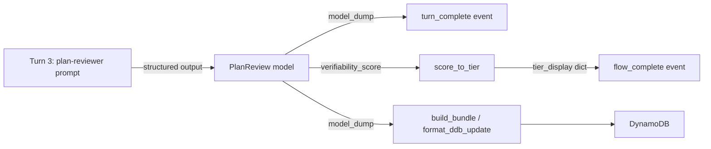

# Design Document — Spec V4-4: Verifiability Scorer (Simplified)

## Overview

V4-4 extends the Turn 3 structured output so the plan-reviewer LLM produces score tier metadata, per-dimension assessments, and actionable guidance text directly — no post-processing, no regex, no templates, no separate scorer module.

The change touches 4 files:
1. `calleditv4/src/models.py` — new `DimensionAssessment` model + 4 new fields on `PlanReview` + `score_to_tier()` pure function
2. `infrastructure/prompt-management/template.yaml` — updated `calledit-plan-reviewer` prompt + new PromptVersion
3. `calleditv4/src/main.py` — call `score_to_tier()` after Turn 3, inject `tier_display` into `flow_complete` event
4. No changes to `bundle.py` — `model_dump()` already captures all PlanReview fields, and `build_bundle`/`format_ddb_update` already store the model_dump() output

The LLM does the heavy lifting (guidance text, dimension assessments, tier classification). The only deterministic code is `score_to_tier()` which maps the numeric score to display constants (color, icon) that shouldn't vary with LLM output.

## Architecture



No new modules. No new async flows. No new DDB schema changes (new fields flow through existing `model_dump()` serialization).

## Components and Interfaces

### 1. DimensionAssessment Model (models.py)

New Pydantic model representing one dimension's evaluation:

```python
class DimensionAssessment(BaseModel):
    """One dimension's assessment from the plan reviewer."""

    dimension: str = Field(
        description="Dimension name: criteria_specificity, source_availability, "
        "temporal_clarity, outcome_objectivity, or tool_coverage"
    )
    assessment: str = Field(
        description="Rating: strong, moderate, or weak"
    )
    explanation: str = Field(
        description="One-line explanation of the rating"
    )
```

### 2. Extended PlanReview Model (models.py)

Four new fields added to the existing `PlanReview`:

```python
class PlanReview(BaseModel):
    """Turn 3 output: combined verifiability scoring and plan review."""

    # Existing fields (unchanged)
    verifiability_score: float = Field(
        ge=0.0, le=1.0,
        description="Likelihood (0.0-1.0) that the verification agent will "
        "successfully determine the prediction's truth value",
    )
    verifiability_reasoning: str = Field(
        description="Explanation of the score across 5 dimensions"
    )
    reviewable_sections: List[ReviewableSection] = Field(
        description="Sections with assumptions that could be validated "
        "via clarification questions"
    )

    # New V4-4 fields
    score_tier: str = Field(
        description="Tier: high (>=0.7), moderate (>=0.4), or low (<0.4)"
    )
    score_label: str = Field(
        description="Human-readable label, e.g. 'High Confidence'"
    )
    score_guidance: str = Field(
        description="Actionable guidance text based on the assessment"
    )
    dimension_assessments: List[DimensionAssessment] = Field(
        description="Exactly 5 entries, one per scoring dimension"
    )
```

### 3. score_to_tier() Pure Function (models.py)

```python
def score_to_tier(score: float) -> dict:
    """Map a verifiability score to deterministic display constants.

    Clamps score to [0.0, 1.0] before computing tier.
    Returns dict with keys: tier, label, color, icon.
    """
    score = max(0.0, min(1.0, score))
    if score >= 0.7:
        return {"tier": "high", "label": "High Confidence",
                "color": "#166534", "icon": "🟢"}
    if score >= 0.4:
        return {"tier": "moderate", "label": "Moderate Confidence",
                "color": "#854d0e", "icon": "🟡"}
    return {"tier": "low", "label": "Low Confidence",
            "color": "#991b1b", "icon": "🔴"}
```

### 4. Prompt Update (template.yaml)

The `calledit-plan-reviewer` prompt text gets extended with instructions for the 4 new fields. Key additions to the prompt:

**After the existing "SCORE VERIFIABILITY" section, add:**

```
3. DIMENSION ASSESSMENTS:
For each of the 5 dimensions, provide a structured assessment:
- dimension: one of criteria_specificity, source_availability, temporal_clarity, outcome_objectivity, tool_coverage
- assessment: one of strong, moderate, weak
- explanation: one-line explanation of the rating

4. SCORE TIER AND GUIDANCE:
Based on your verifiability_score:
- If score >= 0.7: set score_tier to "high", score_label to "High Confidence"
- If score >= 0.4: set score_tier to "moderate", score_label to "Moderate Confidence"  
- If score < 0.4: set score_tier to "low", score_label to "Low Confidence"

For score_guidance:
- High confidence: brief encouragement, note what makes this prediction well-suited for verification
- Moderate/Low confidence: specific improvement suggestions referencing the weak dimensions
```

A new `PlanReviewerPromptVersionV2` resource is added after the existing `PlanReviewerPromptVersion`.

### 5. Threading Through main.py

The only change in `main.py` is in the `flow_complete` event construction. After Turn 3 completes, call `score_to_tier()` and inject the result as `tier_display`.

**Creation route** — after the existing `bundle = build_bundle(...)` call:

```python
# Add deterministic tier display to flow_complete event
bundle["tier_display"] = score_to_tier(plan_review.verifiability_score)
```

**Clarification route** — after the existing `updated_bundle = {...}` construction:

```python
updated_bundle["tier_display"] = score_to_tier(plan_review.verifiability_score)
```

The `turn_complete` event already includes all new PlanReview fields via `plan_review.model_dump()` — no changes needed there.

Note: `build_bundle()` and `format_ddb_update()` currently take individual named parameters (not a `model_dump()` spread). Rather than adding 4 new parameters to each function signature, the new PlanReview fields get injected into the bundle dict *after* `build_bundle()` returns — same pattern as `tier_display`:

```python
bundle = build_bundle(...)  # existing call, unchanged
# Inject V4-4 fields from plan_review
review_dump = plan_review.model_dump()
bundle["score_tier"] = review_dump["score_tier"]
bundle["score_label"] = review_dump["score_label"]
bundle["score_guidance"] = review_dump["score_guidance"]
bundle["dimension_assessments"] = review_dump["dimension_assessments"]
bundle["tier_display"] = score_to_tier(plan_review.verifiability_score)
```

For the clarification route's `format_ddb_update()`, the same 4 fields + `tier_display` get added to the `updated_bundle` dict. The DDB update expression in `format_ddb_update()` needs 4 new SET clauses for the new fields so they persist on clarification updates. This is a small change to `format_ddb_update()` internals (adding SET clauses and expression attribute values) but no signature change — the fields arrive via the existing parameter pattern or are added to the update dict directly.

## Data Models

### DimensionAssessment

| Field | Type | Constraints | Description |
|-------|------|-------------|-------------|
| dimension | str | One of: criteria_specificity, source_availability, temporal_clarity, outcome_objectivity, tool_coverage | Dimension name |
| assessment | str | One of: strong, moderate, weak | Rating |
| explanation | str | — | One-line explanation |

### PlanReview (extended)

| Field | Type | New? | Description |
|-------|------|------|-------------|
| verifiability_score | float | No | 0.0-1.0 score |
| verifiability_reasoning | str | No | Explanation across 5 dimensions |
| reviewable_sections | List[ReviewableSection] | No | Sections with clarification questions |
| score_tier | str | Yes | high, moderate, or low |
| score_label | str | Yes | Human-readable label |
| score_guidance | str | Yes | Actionable guidance from LLM |
| dimension_assessments | List[DimensionAssessment] | Yes | 5 entries, one per dimension |

### score_to_tier Output

| Field | Type | Description |
|-------|------|-------------|
| tier | str | high, moderate, or low |
| label | str | "High Confidence", "Moderate Confidence", or "Low Confidence" |
| color | str | Hex color code |
| icon | str | Emoji indicator |

### Tier Boundaries

| Score Range | Tier | Label | Color | Icon |
|-------------|------|-------|-------|------|
| >= 0.7 | high | High Confidence | #166534 | 🟢 |
| >= 0.4, < 0.7 | moderate | Moderate Confidence | #854d0e | 🟡 |
| < 0.4 | low | Low Confidence | #991b1b | 🔴 |


## Correctness Properties

*A property is a characteristic or behavior that should hold true across all valid executions of a system — essentially, a formal statement about what the system should do. Properties serve as the bridge between human-readable specifications and machine-verifiable correctness guarantees.*

### Property 1: DimensionAssessment and PlanReview model structure

*For any* valid DimensionAssessment instance constructed with arbitrary strings for dimension, assessment, and explanation, `model_dump()` shall return a dict containing exactly those three keys with string values. *For any* valid PlanReview instance, `model_dump()` shall contain all 7 fields: the 3 existing fields (`verifiability_score`, `verifiability_reasoning`, `reviewable_sections`) and the 4 new fields (`score_tier`, `score_label`, `score_guidance`, `dimension_assessments`).

**Validates: Requirements 1.1, 1.2, 1.3, 1.4, 1.5, 1.6, 4.1**

### Property 2: Tier boundary correctness

*For any* float score in [0.0, 1.0], `score_to_tier(score)` shall return a dict with exactly 4 keys (`tier`, `label`, `color`, `icon`), and the `tier` value shall be `"high"` when score >= 0.7, `"moderate"` when 0.4 <= score < 0.7, and `"low"` when score < 0.4. The corresponding label, color, and icon shall match the tier's defined constants.

**Validates: Requirements 2.1, 2.2, 2.3, 2.4**

### Property 3: score_to_tier determinism

*For any* float score, calling `score_to_tier(score)` twice with the same input shall produce identical output dicts.

**Validates: Requirements 2.4**

### Property 4: score_to_tier clamping

*For any* float score outside [0.0, 1.0], `score_to_tier(score)` shall produce the same result as `score_to_tier(max(0.0, min(1.0, score)))`. Specifically, negative scores shall map to the `"low"` tier and scores > 1.0 shall map to the `"high"` tier.

**Validates: Requirements 2.5**

## Error Handling

This feature introduces minimal error surface:

1. **Invalid score values**: `score_to_tier()` clamps out-of-range floats to [0.0, 1.0] — no exceptions thrown. The PlanReview model's existing `ge=0.0, le=1.0` constraint on `verifiability_score` means Pydantic rejects out-of-range scores at the model level. `score_to_tier()` adds clamping as defense-in-depth.

2. **LLM produces wrong tier/label**: The LLM might output `score_tier: "high"` when the score is 0.3. This is acceptable — the `tier_display` field from `score_to_tier()` provides the deterministic truth. The frontend should use `tier_display` for visual treatment and can use the LLM's `score_tier`/`score_label` as supplementary text.

3. **LLM produces fewer than 5 dimension assessments**: Pydantic accepts any list length. The prompt instructs "exactly 5" but the model might produce fewer. This is a prompt quality issue, not a code error — no runtime exception occurs. The frontend should handle variable-length lists gracefully.

4. **Existing error paths unchanged**: All existing error handling in `main.py` (DDB failures, ConditionalCheckFailedException, agent exceptions) remains unchanged. The new fields flow through the same `model_dump()` → bundle → DDB path.

## Testing Strategy

### Property-Based Tests (Hypothesis)

Each correctness property maps to one Hypothesis test. Minimum 100 iterations per test.

- **Property 1 test**: Generate random strings for DimensionAssessment fields, random floats/strings/lists for PlanReview fields. Verify `model_dump()` output structure.
  - Tag: `Feature: verifiability-scorer, Property 1: DimensionAssessment and PlanReview model structure`

- **Property 2 test**: Generate random floats in [0.0, 1.0] via `st.floats(min_value=0.0, max_value=1.0)`. Verify `score_to_tier()` output matches expected tier/label/color/icon based on boundary checks.
  - Tag: `Feature: verifiability-scorer, Property 2: Tier boundary correctness`

- **Property 3 test**: Generate arbitrary floats (including NaN edge cases excluded). Verify `score_to_tier(x) == score_to_tier(x)`.
  - Tag: `Feature: verifiability-scorer, Property 3: score_to_tier determinism`

- **Property 4 test**: Generate floats outside [0.0, 1.0] via `st.floats().filter(lambda x: x < 0.0 or x > 1.0)`. Verify output matches clamped equivalent.
  - Tag: `Feature: verifiability-scorer, Property 4: score_to_tier clamping`

### Unit Tests

- Boundary examples: `score_to_tier(0.0)`, `score_to_tier(0.4)`, `score_to_tier(0.7)`, `score_to_tier(1.0)` — verify exact outputs
- Edge cases: `score_to_tier(-0.5)` → low, `score_to_tier(1.5)` → high
- PlanReview backward compatibility: construct with old + new fields, verify no ValidationError
- No `legacy_category` field: verify `PlanReview` model schema does not include it

### Testing Library

- **Property-based testing**: Hypothesis (already in project dependencies)
- **Unit testing**: pytest (already in project dependencies)
- **No mocks** (Decision 96): `score_to_tier()` and model validation are pure — no mocks needed
