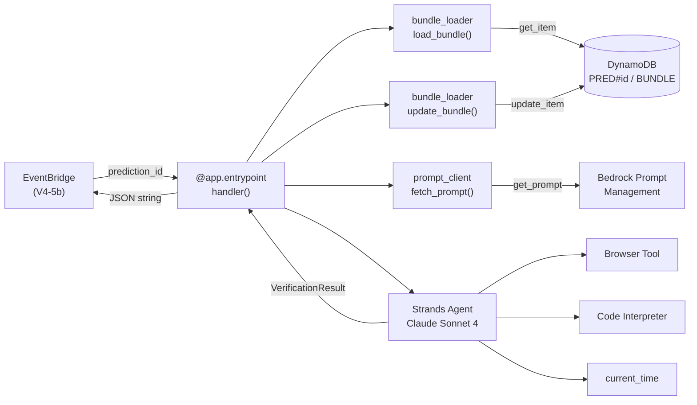

# Design Document — Spec V4-5a: Verification Agent Core

## Overview

The Verification Agent is the second AgentCore runtime in CalledIt v4. It runs at `verification_date` to determine whether a prediction came true. Unlike the creation agent (user-facing, async, streaming), the verification agent is batch-oriented: synchronous entrypoint, no streaming, no user interaction.

The agent receives a `prediction_id`, loads the prediction bundle from DynamoDB, fetches a verification prompt from Bedrock Prompt Management, invokes a Strands Agent with Browser + Code Interpreter + current_time tools, and writes the structured verdict back to DDB.

The project lives in `calleditv4-verification/` (Decision 105), completely independent from `calleditv4/`. Shared code (~20 lines: DDB key format, float-to-Decimal conversion) is duplicated per Decision 106.

### Design Rationale

- **Synchronous entrypoint**: No user is waiting. EventBridge triggers batch verification. `def handler` returns a JSON string.
- **Structured output via Pydantic**: `structured_output_model=VerificationResult` gives type-safe, validated verdicts. No JSON parsing fallbacks needed.
- **Never-raise pattern**: Carried forward from v3's `run_verification()`. A single failed verification must not crash the batch loop (V4-5b). All exceptions → inconclusive with confidence 0.0.
- **No prompt fallbacks**: Per the AgentCore steering doc, if Prompt Management is unavailable, fail clearly. The verification agent has no hardcoded fallback prompts.

## Architecture



### Handler Flow (Sequential)

1. Extract `prediction_id` from payload
2. `load_bundle_from_ddb(prediction_id)` → bundle dict or None
3. Validate bundle exists and `status == "pending"`
4. `fetch_prompt("verification_executor")` → system prompt text
5. Build user message from bundle fields (statement, plan, verification_date)
6. Create Strands Agent with system prompt + tools
7. Invoke agent with `structured_output_model=VerificationResult`
8. `update_bundle_with_verdict(prediction_id, result)` → DDB update
9. Return JSON string with verdict summary

On any exception at steps 6-7: catch, build inconclusive result, attempt DDB update (step 8), return.
On any exception at steps 2-4: return JSON error immediately, skip agent invocation.

## Components and Interfaces

### `src/main.py` — Entrypoint

```python
"""
CalledIt v4 — Verification Agent on AgentCore
Synchronous batch handler. Receives prediction_id, returns verdict JSON.
"""
import json
import logging
import os
import sys
from datetime import datetime, timezone

from bedrock_agentcore.runtime import BedrockAgentCoreApp
from strands import Agent
from strands.models.bedrock import BedrockModel
from strands_tools.browser import AgentCoreBrowser
from strands_tools.code_interpreter import AgentCoreCodeInterpreter
from strands_tools.current_time import current_time

app = BedrockAgentCoreApp()
logger = logging.getLogger(__name__)

sys.path.insert(0, os.path.dirname(__file__))

from models import VerificationResult
from bundle_loader import load_bundle_from_ddb, update_bundle_with_verdict
from prompt_client import fetch_prompt, get_prompt_version_manifest

MODEL_ID = "us.anthropic.claude-sonnet-4-20250514-v1:0"
REGION = os.getenv("AWS_REGION", "us-west-2")

browser_tool = AgentCoreBrowser(region=REGION)
code_interpreter_tool = AgentCoreCodeInterpreter(region=REGION)


def _make_inconclusive(reasoning: str) -> VerificationResult:
    """Build a standard inconclusive result for error cases."""
    return VerificationResult(
        verdict="inconclusive",
        confidence=0.0,
        evidence=[],
        reasoning=reasoning,
    )


def _build_user_message(bundle: dict) -> str:
    """Construct the user message from bundle fields."""
    parsed_claim = bundle.get("parsed_claim", {})
    plan = bundle.get("verification_plan", {})
    return (
        f"PREDICTION: {parsed_claim.get('statement', '')}\n"
        f"VERIFICATION DATE: {parsed_claim.get('verification_date', '')}\n\n"
        f"VERIFICATION PLAN:\n"
        f"Sources: {json.dumps(plan.get('sources', []))}\n"
        f"Criteria: {json.dumps(plan.get('criteria', []))}\n"
        f"Steps: {json.dumps(plan.get('steps', []))}\n\n"
        f"Execute this verification plan now."
    )


@app.entrypoint
def handler(payload: dict, context: dict) -> str:
    """Verification agent entrypoint — receives prediction_id, returns verdict JSON."""
    prediction_id = payload.get("prediction_id")
    if not prediction_id:
        return json.dumps({"prediction_id": None, "status": "error",
                           "error": "Missing 'prediction_id' in payload"})

    # Step 1: Load bundle
    try:
        table = _get_ddb_table()
        bundle = load_bundle_from_ddb(table, prediction_id)
    except Exception as e:
        logger.error(f"DDB load failed for {prediction_id}: {e}", exc_info=True)
        return json.dumps({"prediction_id": prediction_id, "status": "error",
                           "error": f"DDB load failed: {e}"})

    if bundle is None:
        return json.dumps({"prediction_id": prediction_id, "status": "error",
                           "error": "Prediction bundle not found"})

    if bundle.get("status") != "pending":
        return json.dumps({"prediction_id": prediction_id, "status": "error",
                           "error": f"Prediction already processed (status={bundle.get('status')})"})

    # Step 2: Run verification (never raises)
    result = _run_verification(prediction_id, bundle)

    # Step 3: Update DDB (best-effort)
    prompt_versions = get_prompt_version_manifest()
    try:
        update_bundle_with_verdict(table, prediction_id, result, prompt_versions)
    except Exception as e:
        logger.error(f"DDB update failed for {prediction_id}: {e}", exc_info=True)

    # Step 4: Return verdict
    new_status = "verified" if result.verdict in ("confirmed", "refuted") else "inconclusive"
    return json.dumps({
        "prediction_id": prediction_id,
        "verdict": result.verdict,
        "confidence": result.confidence,
        "status": new_status,
    })


def _run_verification(prediction_id: str, bundle: dict) -> VerificationResult:
    """Run the Strands agent. Never raises — returns inconclusive on error."""
    try:
        system_prompt = fetch_prompt("verification_executor")
    except Exception as e:
        logger.error(f"Prompt fetch failed: {e}", exc_info=True)
        return _make_inconclusive(f"Prompt Management unavailable: {e}")

    try:
        user_message = _build_user_message(bundle)
        model = BedrockModel(model_id=MODEL_ID)
        agent = Agent(
            model=model,
            system_prompt=system_prompt,
            tools=[browser_tool.browser, code_interpreter_tool.code_interpreter, current_time],
        )
        result = agent.structured_output(user_message, output_model=VerificationResult)
        return result
    except Exception as e:
        logger.error(f"Agent invocation failed for {prediction_id}: {e}", exc_info=True)
        return _make_inconclusive(f"Agent invocation error: {e}")


def _get_ddb_table():
    """Get the DynamoDB table resource."""
    table_name = os.environ.get("PREDICTIONS_TABLE", "calledit-predictions")
    dynamodb = boto3.resource("dynamodb")
    return dynamodb.Table(table_name)


if __name__ == "__main__":
    app.run()
```

### `src/models.py` — Pydantic Models

```python
"""Pydantic models for verification verdict output."""

from typing import List
from pydantic import BaseModel, Field


class EvidenceItem(BaseModel):
    """A single piece of evidence gathered during verification."""

    source: str = Field(
        description="URL or source name where evidence was found"
    )
    finding: str = Field(
        description="What was found at this source"
    )
    relevant_to_criteria: str = Field(
        description="Which verification criterion this evidence addresses"
    )


class VerificationResult(BaseModel):
    """Complete verification verdict — used as structured_output_model."""

    verdict: str = Field(
        description="Verification outcome: confirmed, refuted, or inconclusive"
    )
    confidence: float = Field(
        ge=0.0, le=1.0,
        description="Confidence in the verdict (0.0 to 1.0)"
    )
    evidence: List[EvidenceItem] = Field(
        description="Evidence items gathered during verification"
    )
    reasoning: str = Field(
        description="Explanation of how evidence maps to criteria and why this verdict was chosen"
    )
```

### `src/bundle_loader.py` — DDB Operations

```python
"""DynamoDB operations for loading and updating prediction bundles."""

import logging
from datetime import datetime, timezone
from decimal import Decimal
from typing import Any, Dict, List, Optional

logger = logging.getLogger(__name__)


def _convert_floats_to_decimal(obj: Any) -> Any:
    """Recursively convert float values to Decimal for DynamoDB."""
    if isinstance(obj, float):
        return Decimal(str(obj))
    if isinstance(obj, dict):
        return {k: _convert_floats_to_decimal(v) for k, v in obj.items()}
    if isinstance(obj, list):
        return [_convert_floats_to_decimal(item) for item in obj]
    return obj


def load_bundle_from_ddb(table, prediction_id: str) -> Optional[Dict[str, Any]]:
    """Load a prediction bundle from DynamoDB.

    Args:
        table: boto3 DynamoDB Table resource
        prediction_id: e.g. "pred-abc123..."

    Returns:
        Bundle dict if found, None otherwise.
    """
    response = table.get_item(
        Key={"PK": f"PRED#{prediction_id}", "SK": "BUNDLE"}
    )
    item = response.get("Item")
    if item is None:
        return None
    item.pop("PK", None)
    item.pop("SK", None)
    return item


def update_bundle_with_verdict(
    table,
    prediction_id: str,
    result,
    prompt_versions: Dict[str, str],
) -> bool:
    """Write verification result back to the prediction bundle.

    Uses ConditionExpression to prevent overwriting already-verified bundles.

    Args:
        table: boto3 DynamoDB Table resource
        prediction_id: The prediction ID
        result: VerificationResult Pydantic model instance
        prompt_versions: Dict of prompt name → version used

    Returns:
        True if update succeeded, False if condition check failed.
    """
    now = datetime.now(timezone.utc).isoformat()
    new_status = "verified" if result.verdict in ("confirmed", "refuted") else "inconclusive"

    evidence_dicts = [e.model_dump() for e in result.evidence]

    try:
        table.update_item(
            Key={"PK": f"PRED#{prediction_id}", "SK": "BUNDLE"},
            UpdateExpression=(
                "SET verdict = :v, confidence = :c, evidence = :e, "
                "reasoning = :r, verified_at = :va, #s = :ns, "
                "prompt_versions.verification = :pv"
            ),
            ExpressionAttributeNames={"#s": "status"},
            ExpressionAttributeValues={
                ":v": result.verdict,
                ":c": _convert_floats_to_decimal(result.confidence),
                ":e": _convert_floats_to_decimal(evidence_dicts),
                ":r": result.reasoning,
                ":va": now,
                ":ns": new_status,
                ":pv": prompt_versions.get("verification_executor", "unknown"),
                ":pending": "pending",
            },
            ConditionExpression="attribute_exists(PK) AND #s = :pending",
        )
        return True
    except table.meta.client.exceptions.ConditionalCheckFailedException:
        logger.warning(f"Condition check failed for {prediction_id} — already verified or deleted")
        return False
```

### `src/prompt_client.py` — Prompt Management Client

Duplicated from `calleditv4/src/prompt_client.py` with minimal changes (Decision 106):

- `PROMPT_IDENTIFIERS` contains only `"verification_executor"` (ID populated after CFN deploy)
- No `_FALLBACK_PROMPTS` — verification agent has no fallbacks (AgentCore steering doc)
- Same `fetch_prompt()`, `_resolve_variables()`, `get_prompt_version_manifest()` functions

```python
PROMPT_IDENTIFIERS: Dict[str, str] = {
    "verification_executor": "PLACEHOLDER",  # Populated after CFN deploy
}

# No fallback prompts — fail clearly if Prompt Management is unavailable
```

The `fetch_prompt()` function is identical to the creation agent's, minus the production fallback logic. In non-production mode it raises on failure; in production mode it also raises (no fallback for verification).

### `.bedrock_agentcore.yaml`

Same structure as `calleditv4/.bedrock_agentcore.yaml` but with:
- `default_agent: calleditv4_verification_Agent`
- `entrypoint` pointing to `calleditv4-verification/src/main.py`
- `source_path` pointing to `calleditv4-verification/src`

### `pyproject.toml`

```toml
[build-system]
requires = ["setuptools>=68", "wheel"]
build-backend = "setuptools.build_meta"

[project]
name = "calleditv4-verification"
version = "0.1.0"
requires-python = ">=3.10"

dependencies = [
    "bedrock-agentcore >= 1.0.3",
    "boto3 >= 1.38.0",
    "pydantic >= 2.0.0",
    "strands-agents >= 1.13.0",
    "strands-agents-tools >= 0.2.16",
]
```

## Data Models

### VerificationResult (Pydantic)

| Field | Type | Constraints | Description |
|-------|------|-------------|-------------|
| `verdict` | `str` | One of: `confirmed`, `refuted`, `inconclusive` | The verification outcome |
| `confidence` | `float` | `ge=0.0, le=1.0` | Confidence in the verdict |
| `evidence` | `List[EvidenceItem]` | — | Evidence gathered during verification |
| `reasoning` | `str` | — | Explanation of verdict decision |

### EvidenceItem (Pydantic)

| Field | Type | Description |
|-------|------|-------------|
| `source` | `str` | URL or source name |
| `finding` | `str` | What was found |
| `relevant_to_criteria` | `str` | Which criterion this addresses |

### DDB Bundle Fields Added by Verification

| Field | Type | Description |
|-------|------|-------------|
| `verdict` | `S` | `confirmed`, `refuted`, or `inconclusive` |
| `confidence` | `N` | 0.0–1.0 as Decimal |
| `evidence` | `L` | List of evidence item maps |
| `reasoning` | `S` | Verdict explanation |
| `verified_at` | `S` | ISO 8601 timestamp |
| `status` | `S` | Changed from `pending` to `verified` or `inconclusive` |
| `prompt_versions.verification` | `S` | Prompt version used |

### DDB Update Expression

```
SET verdict = :v, confidence = :c, evidence = :e,
    reasoning = :r, verified_at = :va, #s = :ns,
    prompt_versions.verification = :pv
ConditionExpression: attribute_exists(PK) AND #s = :pending
```

### Verification Prompt (CloudFormation Addition)

Added to `infrastructure/prompt-management/template.yaml`:

```yaml
VerificationExecutorPrompt:
  Type: AWS::Bedrock::Prompt
  Properties:
    Name: calledit-verification-executor
    Description: "V4-5a Verification Executor — gathers evidence and produces verdict"
    DefaultVariant: default
    Tags:
      Project: calledit
      Agent: verification
    Variants:
      - Name: default
        ModelId: !Ref ModelId
        TemplateType: TEXT
        InferenceConfiguration:
          Text:
            Temperature: 0
            MaxTokens: 4000
        TemplateConfiguration:
          Text:
            Text: |
              You are a verification executor. Your job is to determine whether a prediction came true by gathering evidence and evaluating it against the verification plan.

              PROCESS:
              1. Read the prediction statement and verification plan (sources, criteria, steps)
              2. Execute each verification step using your tools:
                 - Use Browser to search for and fetch evidence from planned sources
                 - Use Code Interpreter for calculations or data analysis
                 - Use current_time to confirm the current date/time
              3. For each criterion in the plan, record what evidence you found
              4. Evaluate all evidence against all criteria
              5. Determine the verdict

              VERDICT RULES:
              - confirmed: Evidence clearly shows the prediction met ALL criteria
              - refuted: Evidence clearly shows the prediction failed one or more criteria
              - inconclusive: Use when ANY of these apply:
                - The event has not yet occurred (verification_date is in the future)
                - Evidence is contradictory
                - Planned sources are unavailable or don't contain relevant information
                - You cannot determine truth with reasonable confidence

              CONFIDENCE SCALE:
              - 0.9-1.0: Strong, unambiguous evidence from multiple reliable sources
              - 0.7-0.8: Good evidence from at least one reliable source
              - 0.5-0.6: Partial evidence, some criteria unclear
              - 0.1-0.4: Weak evidence, mostly reasoning-based
              - 0.0: No evidence gathered (error case)

              EVIDENCE QUALITY:
              - Each evidence item must reference a specific source (URL or name)
              - Each evidence item must state what was found
              - Each evidence item must link to a specific criterion from the plan
              - If a tool call fails, note the failure as evidence and continue

              Do NOT guess. If you cannot find sufficient evidence, return inconclusive.
              It is better to be honest about uncertainty than to produce a wrong verdict.

VerificationExecutorPromptVersion:
  Type: AWS::Bedrock::PromptVersion
  Properties:
    PromptArn: !GetAtt VerificationExecutorPrompt.Arn
    Description: "v1 — initial verification executor prompt"
```


## Correctness Properties

*A property is a characteristic or behavior that should hold true across all valid executions of a system — essentially, a formal statement about what the system should do. Properties serve as the bridge between human-readable specifications and machine-verifiable correctness guarantees.*

### Property 1: DDB Key Format

*For any* prediction_id string, the DynamoDB key constructed by `load_bundle_from_ddb` and `update_bundle_with_verdict` shall use `PK=PRED#{prediction_id}` and `SK=BUNDLE`.

**Validates: Requirements 2.1, 2.4**

### Property 2: Float-to-Decimal Round Trip

*For any* nested data structure containing floats, applying `_convert_floats_to_decimal` shall produce a structure where every float has been replaced by a `Decimal` with the same numeric value (i.e., `float(Decimal(str(f))) == f` for all original floats), and all non-float values are preserved unchanged.

**Validates: Requirements 2.5**

### Property 3: User Message Contains All Bundle Fields

*For any* prediction bundle containing a `parsed_claim` with `statement` and `verification_date`, and a `verification_plan` with `sources`, `criteria`, and `steps`, the user message produced by `_build_user_message` shall contain the statement text, the verification_date text, and JSON representations of sources, criteria, and steps.

**Validates: Requirements 3.3**

### Property 4: VerificationResult Model Validation

*For any* verdict string not in `{confirmed, refuted, inconclusive}`, or confidence float outside `[0.0, 1.0]`, constructing a `VerificationResult` shall raise a Pydantic `ValidationError`. Conversely, *for any* valid verdict, confidence in range, list of valid `EvidenceItem` objects, and non-empty reasoning string, construction shall succeed.

**Validates: Requirements 4.1, 4.2, 4.3, 4.4**

### Property 5: Verdict-to-Status Mapping

*For any* `VerificationResult` with verdict `confirmed` or `refuted`, the DDB update shall set `status` to `"verified"`. *For any* `VerificationResult` with verdict `inconclusive`, the DDB update shall set `status` to `"inconclusive"`.

**Validates: Requirements 5.1, 5.2**

### Property 6: Handler Returns Valid JSON with Required Fields

*For any* invocation of `handler` (whether successful verification, missing bundle, non-pending status, or agent error), the return value shall be a valid JSON string parseable by `json.loads`, and the parsed object shall contain at minimum the keys `prediction_id` and `status`.

**Validates: Requirements 7.3, 7.4**

### Property 7: Non-Pending Status Rejection

*For any* prediction bundle with a `status` field that is not `"pending"` (e.g., `"verified"`, `"inconclusive"`, `"deleted"`), the handler shall return an error response without invoking the Strands Agent.

**Validates: Requirements 2.3**

### Property 8: Exception Produces Inconclusive with Zero Confidence

*For any* exception raised during agent invocation, `_run_verification` shall return a `VerificationResult` with `verdict="inconclusive"` and `confidence=0.0`, and shall not propagate the exception.

**Validates: Requirements 7.1**

## Error Handling

The verification agent follows a "never raise" pattern inherited from v3's `run_verification()`. The handler has three error zones with different strategies:

### Zone 1: Payload Validation (pre-DDB)
- Missing `prediction_id` → return error JSON immediately
- No DDB call, no agent invocation

### Zone 2: DDB Load (pre-agent)
- DDB network error, permissions, throttling → catch, log, return error JSON
- Bundle not found → return error JSON
- Bundle status != "pending" → return error JSON
- In all cases: no agent invocation attempted

### Zone 3: Agent Execution (post-load)
- Prompt Management failure → `_make_inconclusive()`, attempt DDB update
- Agent invocation failure → `_make_inconclusive()`, attempt DDB update
- DDB update failure after verdict → log warning, return verdict anyway (the verification result is still valid)

### DDB Condition Check Failure
- `ConditionalCheckFailedException` (bundle was verified between load and update) → log warning, return `False` from `update_bundle_with_verdict`. The handler still returns the verdict — the verification work was valid, only the DDB write was a no-op.

### Error Response Format

All error responses follow the same JSON structure:
```json
{
    "prediction_id": "pred-xxx" | null,
    "status": "error",
    "error": "Human-readable error message"
}
```

All success responses:
```json
{
    "prediction_id": "pred-xxx",
    "verdict": "confirmed|refuted|inconclusive",
    "confidence": 0.85,
    "status": "verified|inconclusive"
}
```

## Testing Strategy

### Property-Based Testing

Use **Hypothesis** (already in the project's dev dependencies) for property-based tests. Each property test runs a minimum of 100 iterations.

Properties to implement as PBT:

| Property | Test Strategy |
|----------|--------------|
| P1: DDB Key Format | Generate random prediction_id strings, verify key format |
| P2: Float-to-Decimal | Generate nested dicts/lists with floats, verify all converted to Decimal |
| P3: User Message Fields | Generate random bundles, verify message contains all fields |
| P4: Model Validation | Generate valid/invalid verdict+confidence combos, verify accept/reject |
| P5: Verdict-to-Status | Generate all three verdicts, verify status mapping |
| P6: Handler JSON | Generate various payloads (valid, missing fields, bad status), verify JSON output |
| P7: Non-Pending Rejection | Generate bundles with random non-pending statuses, verify error response |
| P8: Exception → Inconclusive | Generate various exception types, verify inconclusive result |

Each test tagged with: `# Feature: verification-agent-core, Property N: {description}`

### Unit Tests

Unit tests cover specific examples and edge cases not well-suited to property testing:

- `test_handler_missing_prediction_id` — payload with no prediction_id
- `test_handler_bundle_not_found` — DDB returns None
- `test_handler_already_verified` — bundle with status="verified"
- `test_condition_check_failure` — ConditionalCheckFailedException handling
- `test_prompt_fetch_failure` — Prompt Management unavailable
- `test_ddb_update_failure_after_verdict` — DDB update fails but verdict still returned
- `test_evidence_item_fields` — EvidenceItem has all Field(description=...) annotations
- `test_make_inconclusive_helper` — returns correct default structure

### Test Configuration

- PBT library: `hypothesis`
- Min iterations: 100 per property (`@settings(max_examples=100)`)
- DDB interactions: mocked with `unittest.mock` (Decision 96 applies to integration tests, not unit/property tests)
- Agent invocations: mocked (no real Bedrock calls in unit tests)
- Test location: `calleditv4-verification/tests/`
