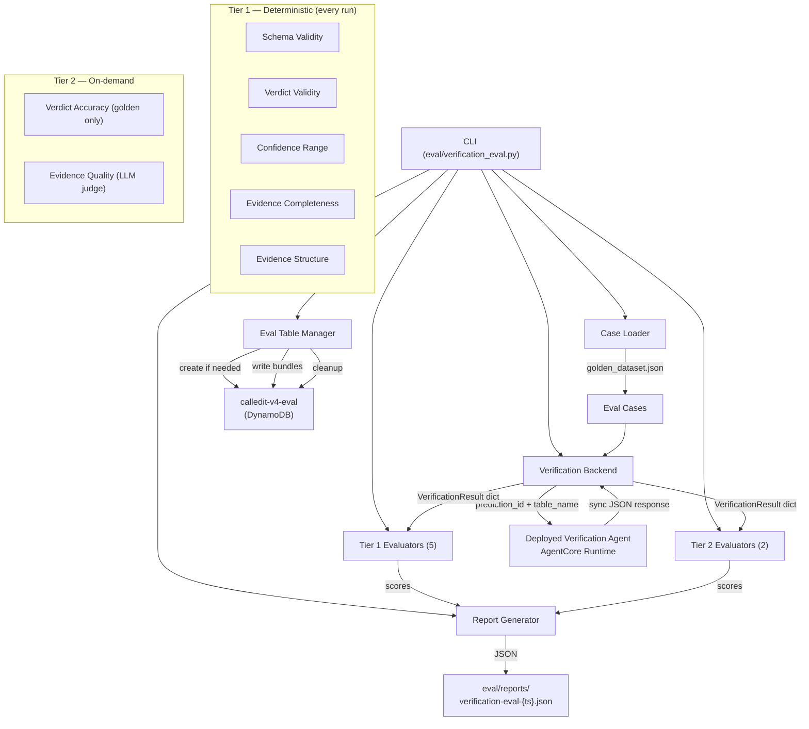

# Design Document: Verification Agent Eval

## Overview

This design covers the v4 verification agent evaluation framework — a CLI-driven eval runner that invokes the deployed verification agent via AgentCore HTTPS (synchronous JSON, not streaming), applies tiered evaluators (5 deterministic Tier 1 + 2 Tier 2), and produces JSON reports.

The system is parallel to the creation agent eval (V4-7a-2) and follows the same structural patterns. Key differences from the creation eval:

- **Synchronous response**: The verification agent returns a plain JSON string, not an SSE stream. No `flow_complete` event parsing needed.
- **Eval table isolation**: Golden mode writes qualifying case bundles to a dedicated `calledit-v4-eval` DynamoDB table, passes `table_name` in the payload, and cleans up after the run.
- **Two source modes**: `golden` (7 qualifying cases with known expected verdicts) and `ddb` (live `calledit-v4` table, no ground truth).
- **Ground truth limitation**: All 7 qualifying cases have `confirmed` expected outcomes. `refuted`/`inconclusive` accuracy cannot be measured deterministically with the current dataset.
- **Agent handler change**: One-line change to `calleditv4-verification/src/main.py` to accept optional `table_name` payload override.

**Intentional scope: `immediate` verification mode only.** All evaluators in this spec assume `verification_mode: "immediate"` — predictions verifiable right now with a single agent invocation and a definitive answer. This is the right starting point: the evaluator assumptions are explicit, the ground truth is unambiguous, and the framework is clean. Every bundle written to the eval table includes `verification_mode: "immediate"`. Support for `at_date`, `before_date`, and `recurring` modes is tracked in backlog item 0 — those modes require mode-aware evaluator variants that will be added alongside the existing ones without changing what's built here. The `immediate` evaluators are not wrong; they are correctly scoped.

Key design drivers:
- **No mocks** — hits the real deployed agent (Decision 96)
- **Tiered evaluators** — 5 fast deterministic Tier 1 checks + 2 targeted Tier 2 evaluators
- **Eval table isolation** — `calledit-v4-eval` table prevents production data contamination
- **Reuse auth pattern** — `get_cognito_token()` from `agentcore_backend.py`

## Architecture



### Data Flow

1. CLI parses args (`--source`, `--tier`, `--dataset`, `--description`, `--case`, `--dry-run`, `--output-dir`)
2. Case Loader reads `golden_dataset.json` (golden mode) or queries `calledit-v4` DDB (ddb mode), filters by tier/case
3. **Golden mode only**: Eval Table Manager creates `calledit-v4-eval` if needed, writes all case bundles
4. For each case, Verification Backend sends `{prediction_id, table_name}` to the deployed agent via HTTPS with JWT
5. Backend parses the synchronous JSON response body, extracts verdict summary
6. Tier 1 evaluators run on every case (deterministic, instant)
7. Tier 2 evaluators run when tier includes judges (`smoke+judges` or `full` in golden mode; always in ddb mode except Verdict_Accuracy)
8. Report Generator aggregates scores, writes JSON report
9. **Golden mode only**: Eval Table Manager deletes all written items (cleanup)

### Synchronous Response Parsing

Unlike the creation agent's SSE stream, the verification agent returns a plain JSON string:

```
HTTP 200
Content-Type: application/json

"{\"prediction_id\": \"pred-xxx\", \"verdict\": \"confirmed\", \"confidence\": 0.9, \"status\": \"verified\"}"
```

The response body is a JSON-encoded string (double-encoded). The backend does:
```python
outer = response.json()          # str: "{\"verdict\": ...}"
inner = json.loads(outer)        # dict: {"verdict": "confirmed", ...}
```

## Components and Interfaces

### 1. Agent Handler Change (`calleditv4-verification/src/main.py`)

One-line change in the `handler` function: read optional `table_name` from payload and override the module-level `DYNAMODB_TABLE_NAME` before the DDB resource is initialized.

```python
@app.entrypoint
def handler(payload: dict, context: RequestContext) -> str:
    prediction_id = payload.get("prediction_id")
    # NEW: optional table_name override for eval isolation
    table_name = payload.get("table_name", DYNAMODB_TABLE_NAME)
    ...
    ddb = boto3.resource("dynamodb")
    table = ddb.Table(table_name)   # was: ddb.Table(DYNAMODB_TABLE_NAME)
    ...
```

### 2. CLI Entry Point (`eval/verification_eval.py`)

Orchestrates the entire eval run. Follows the same pattern as `eval/creation_eval.py`.

```python
def main():
    args = parse_args()
    dataset = load_dataset(args.dataset)  # golden mode
    cases = load_cases(args)              # golden or ddb

    if args.dry_run:
        print_dry_run(cases)
        return

    if args.source == "golden":
        setup_eval_table(cases)           # create + write bundles

    backend = VerificationBackend()
    backend.set_token(get_cognito_token())
    evaluators = build_evaluator_list(args)
    results = run_eval(cases, backend, evaluators)

    if args.source == "golden":
        cleanup_eval_table(cases)         # delete written items

    report = build_report(args, dataset, results, cases, evaluators)
    save_report(report, args.output_dir)
```

**CLI Flags:**
| Flag | Default | Description |
|------|---------|-------------|
| `--source` | `golden` | Data source: `golden` or `ddb` |
| `--dataset` | `eval/golden_dataset.json` | Path to golden dataset |
| `--tier` | `smoke` | Run tier: `smoke`, `smoke+judges`, `full` (golden mode only) |
| `--description` | auto-generated | One-line run description |
| `--output-dir` | `eval/reports` | Report output directory |
| `--dry-run` | `false` | List cases without executing |
| `--case` | `None` | Execute single case by id (golden mode only) |

### 3. Verification Backend (`eval/backends/verification_backend.py`)

Invokes the deployed verification agent and extracts the verdict from the synchronous JSON response.

```python
VERIFICATION_AGENT_ARN = (
    "arn:aws:bedrock-agentcore:us-west-2:894249332178:"
    "runtime/calleditv4_verification_Agent-77DiT7GHdH"
)

class VerificationBackend:
    def __init__(self, region="us-west-2", runtime_arn=None, bearer_token=None):
        ...

    def invoke(self, prediction_id: str, table_name: str = None, case_id: str = "") -> dict:
        """Invoke verification agent and return verdict dict.

        Args:
            prediction_id: The prediction to verify.
            table_name: DDB table override (None = use agent's env var, i.e. ddb mode).
            case_id: For error reporting.

        Returns:
            dict with keys: verdict, confidence, status, prediction_id

        Raises:
            RuntimeError: On HTTP error or missing fields.
        """
        payload = {"prediction_id": prediction_id}
        if table_name:
            payload["table_name"] = table_name

        response = requests.post(self.invoke_url, json=payload, headers=headers, timeout=300)
        response.raise_for_status()

        # Double-encoded: response body is a JSON string containing another JSON string
        outer = response.json()
        result = json.loads(outer) if isinstance(outer, str) else outer
        return {
            "verdict": result.get("verdict"),
            "confidence": result.get("confidence"),
            "status": result.get("status"),
            "prediction_id": result.get("prediction_id"),
        }
```

### 4. Eval Table Manager (inline in `eval/verification_eval.py`)

Manages the `calledit-v4-eval` DynamoDB table lifecycle for golden mode runs.

```python
EVAL_TABLE_NAME = "calledit-v4-eval"
PROD_TABLE_NAME = "calledit-v4"

def setup_eval_table(cases: list[EvalCase]) -> None:
    """Create eval table if needed, write all case bundles."""
    ddb = boto3.resource("dynamodb", region_name="us-west-2")
    table = _ensure_table_exists(ddb)
    for case in cases:
        bundle = _shape_bundle(case)
        table.put_item(Item=bundle)

def cleanup_eval_table(cases: list[EvalCase]) -> None:
    """Delete all items written during this run."""
    ddb = boto3.resource("dynamodb", region_name="us-west-2")
    table = ddb.Table(EVAL_TABLE_NAME)
    for case in cases:
        table.delete_item(Key={"PK": f"PRED#{case.prediction_id}", "SK": "BUNDLE"})
```

**Bundle shaping** — the item written to DDB must match what `load_bundle_from_ddb()` returns (it strips PK/SK and returns the rest). The bundle must include `status: "pending"` so the agent's condition check passes:

```python
def _shape_bundle(case: EvalCase) -> dict:
    """Shape a golden case into the DDB item format the verification agent expects."""
    gt = case.ground_truth
    return {
        "PK": f"PRED#{case.prediction_id}",
        "SK": "BUNDLE",
        "prediction_id": case.prediction_id,
        "status": "pending",
        "verification_mode": "immediate",  # V4-7a-3 scope: immediate only
        "parsed_claim": {
            "statement": case.prediction_text,
            "verification_date": gt.get("verification_timing", ""),
            "date_reasoning": gt.get("date_derivation", ""),
        },
        "verification_plan": {
            "sources": gt.get("verification_sources", []),
            "criteria": gt.get("expected_verification_criteria", gt.get("verification_criteria", [])),
            "steps": gt.get("verification_steps", []),
        },
        "prompt_versions": {},
    }
```

### 5. Case Loader (inline in `eval/verification_eval.py`)

```python
@dataclass
class EvalCase:
    prediction_id: str
    prediction_text: str
    expected_verdict: str | None   # None in ddb mode
    ground_truth: dict             # from golden dataset (empty in ddb mode)
    metadata: dict                 # difficulty, smoke_test, id

def load_golden_cases(dataset: dict, tier: str, case_id: str = None) -> list[EvalCase]:
    """Load qualifying cases from golden dataset."""
    qualifying = [
        bp for bp in dataset["base_predictions"]
        if bp.get("verification_readiness") == "immediate"
        and bp.get("expected_verification_outcome") is not None
    ]
    cases = [_to_eval_case(bp) for bp in qualifying]

    if case_id:
        matches = [c for c in cases if c.prediction_id == case_id]
        if not matches:
            sys.exit(f"Error: case '{case_id}' not found in qualifying cases")
        return matches

    if tier in ("smoke", "smoke+judges"):
        return [c for c in cases if c.metadata.get("smoke_test")]

    return cases  # full tier

def load_ddb_cases() -> list[EvalCase]:
    """Query calledit-v4 table for verification_readiness=immediate items."""
    ...
```

### 6. Tier 1 Evaluators (`eval/evaluators/verification_*.py`)

All Tier 1 evaluators are pure functions: `evaluate(result: dict) -> dict` returning `{"score": float, "pass": bool, "reason": str}`. They never raise — malformed input returns score 0.0.

| File | What it checks |
|------|---------------|
| `verification_schema_validity.py` | `verdict` is str, `confidence` is float, `evidence` is list, `reasoning` is str |
| `verification_verdict_validity.py` | `verdict` in `{"confirmed", "refuted", "inconclusive"}` |
| `verification_confidence_range.py` | `confidence` is float in [0.0, 1.0] |
| `verification_evidence_completeness.py` | `evidence` list is non-empty |
| `verification_evidence_structure.py` | each EvidenceItem has `source`, `finding`, `relevant_to_criteria` |

### 7. Tier 2 Evaluators (`eval/evaluators/verification_*.py`)

| File | What it assesses |
|------|-----------------|
| `verification_verdict_accuracy.py` | Exact match of `verdict` against `expected_verdict` (golden mode only, skipped when expected_verdict is None) |
| `verification_evidence_quality.py` | LLM judge: source authenticity, finding specificity, criteria linkage clarity |

**Evidence Quality rubric focus areas:**
1. Source authenticity — are `source` fields real, accessible URLs or named data sources?
2. Finding specificity — are `finding` fields concrete observations, not vague summaries?
3. Criteria linkage — do `relevant_to_criteria` fields clearly link to a specific verification criterion?

## Data Models

### EvalCase

```python
@dataclass
class EvalCase:
    prediction_id: str             # e.g., "base-001"
    prediction_text: str           # original prediction text
    expected_verdict: str | None   # "confirmed" | "refuted" | "inconclusive" | None
    ground_truth: dict             # golden dataset ground_truth object
    metadata: dict                 # {difficulty, smoke_test, id}
```

### Verification Backend Response (internal)

```python
# Returned by VerificationBackend.invoke()
{
    "verdict": str,        # "confirmed" | "refuted" | "inconclusive"
    "confidence": float,   # 0.0 to 1.0
    "status": str,         # "verified" | "inconclusive"
    "prediction_id": str,
}
```

### DDB Bundle Item Shape

The item written to `calledit-v4-eval` must satisfy `load_bundle_from_ddb()` and the agent's `status == "pending"` condition check:

```python
{
    "PK": "PRED#{prediction_id}",
    "SK": "BUNDLE",
    "prediction_id": str,
    "status": "pending",
    "verification_mode": "immediate",  # always "immediate" in V4-7a-3; other modes in backlog item 0
    "parsed_claim": {
        "statement": str,
        "verification_date": str,
        "date_reasoning": str,
    },
    "verification_plan": {
        "sources": list[str],
        "criteria": list[str],
        "steps": list[str],
    },
    "prompt_versions": dict,
}
```

### Eval Report Schema

```python
{
    "run_metadata": {
        "description": str,
        "agent": "verification",
        "source": "golden" | "ddb",
        "run_tier": str,           # "smoke" | "smoke+judges" | "full" | "all"
        "dataset_version": str,    # from golden dataset or "ddb-live"
        "timestamp": str,          # ISO 8601
        "duration_seconds": float,
        "case_count": int,
        "ground_truth_limitation": str,  # notes all 7 qualifying cases are "confirmed"
    },
    "aggregate_scores": {
        "schema_validity": float,
        "verdict_validity": float,
        "confidence_range": float,
        "evidence_completeness": float,
        "evidence_structure": float,
        "verdict_accuracy": float | None,   # None if not run
        "evidence_quality": float | None,   # None if not run
        "overall_pass_rate": float,         # fraction where all T1 = 1.0
    },
    "case_results": [
        {
            "prediction_id": str,
            "expected_verdict": str | None,
            "scores": {
                "schema_validity": {"score": float, "pass": bool, "reason": str},
                "verdict_validity": {"score": float, "pass": bool, "reason": str},
                "confidence_range": {"score": float, "pass": bool, "reason": str},
                "evidence_completeness": {"score": float, "pass": bool, "reason": str},
                "evidence_structure": {"score": float, "pass": bool, "reason": str},
                "verdict_accuracy": {"score": float, "pass": bool, "reason": str} | None,
                "evidence_quality": {"score": float, "pass": bool, "reason": str} | None,
            },
        }
    ],
}
```

### Qualifying Cases

The 7 qualifying cases (verification_readiness=immediate, expected_verification_outcome non-null):

| ID | Prediction | Difficulty | Smoke | Expected |
|----|-----------|------------|-------|----------|
| base-001 | The sun will rise tomorrow in New York City | easy | no | confirmed |
| base-002 | Christmas 2026 will fall on a Friday | easy | yes | confirmed |
| base-009 | The US national debt currently exceeds $35 trillion | medium | no | confirmed |
| base-010 | The next full moon will occur before April 1, 2026 | easy | no | confirmed |
| base-011 | Python 3.13 has been officially released | medium | yes | confirmed |
| base-013 | The Wikipedia article for 'Artificial Intelligence' has more than 500 references | hard | no | confirmed |
| base-040 | I bet the sun rises tomorrow | easy | no | confirmed |

Smoke cases: base-002, base-011.


## Correctness Properties

*A property is a characteristic or behavior that should hold true across all valid executions of a system — essentially, a formal statement about what the system should do. Properties serve as the bridge between human-readable specifications and machine-verifiable correctness guarantees.*

### Property 1: Handler table_name override

*For any* payload dict, the verification agent handler SHALL use `payload["table_name"]` as the DynamoDB table name when present, and fall back to the `DYNAMODB_TABLE_NAME` environment variable when absent.

**Validates: Requirements 1.1, 1.2, 1.3**

### Property 2: Verification backend payload construction

*For any* prediction_id string and source mode, the Verification_Backend SHALL construct a payload containing `prediction_id` plus `table_name: "calledit-v4-eval"` in golden mode, and containing only `prediction_id` (no `table_name` key) in ddb mode.

**Validates: Requirements 3.1, 3.6**

### Property 3: Verification backend response parsing round trip

*For any* valid verdict dict `{"verdict": v, "confidence": c, "status": s, "prediction_id": p}`, wrapping it as a double-encoded JSON response and feeding it to the backend's parser SHALL return a dict with those same four keys and values.

**Validates: Requirements 3.2, 3.3**

### Property 4: Backend error propagation

*For any* HTTP error status code (4xx or 5xx), the Verification_Backend SHALL raise a RuntimeError whose message contains both the HTTP status code and the prediction_id.

**Validates: Requirements 3.4**

### Property 5: Bundle write precedes invocation

*For any* set of qualifying cases in golden mode, the eval runner SHALL write all case bundles to the Eval_Table before invoking the Verification_Backend for any case.

**Validates: Requirements 2.2**

### Property 6: Eval table cleanup is complete

*For any* set of qualifying cases written to the Eval_Table during a golden mode run, after the run completes (successfully or with errors) every written item SHALL be deleted from the Eval_Table.

**Validates: Requirements 2.3**

### Property 7: Bundle shaping preserves required fields

*For any* qualifying case from the golden dataset, the shaped DDB bundle SHALL contain `PK=PRED#{prediction_id}`, `SK=BUNDLE`, `status="pending"`, and non-empty `parsed_claim`, `verification_plan` dicts with the fields `load_bundle_from_ddb()` expects.

**Validates: Requirements 2.4**

### Property 8: Golden case loading filters correctly

*For any* golden dataset, the case loader SHALL return only cases where `verification_readiness == "immediate"` and `expected_verification_outcome` is non-null, with each EvalCase's `prediction_id`, `expected_verdict`, and `metadata` fields correctly mapped from the source prediction.

**Validates: Requirements 4.1, 4.2, 4.3, 4.4**

### Property 9: Smoke tier further filters to smoke_test cases

*For any* golden dataset and tier in `{"smoke", "smoke+judges"}`, all returned cases SHALL have `smoke_test == true`.

**Validates: Requirements 4.5, 13.1, 13.2**

### Property 10: DDB mode sets expected_verdict to null

*For any* case loaded in ddb mode, the EvalCase's `expected_verdict` field SHALL be `None`.

**Validates: Requirements 5.3**

### Property 11: Schema validity is biconditional on field presence and types

*For any* verdict response dict, the schema validity evaluator SHALL return score 1.0 if and only if `verdict` is a str, `confidence` is a float, `evidence` is a list, and `reasoning` is a str. When any field fails, the output SHALL identify which fields failed.

**Validates: Requirements 6.1, 6.2, 6.3, 6.4, 6.5, 6.6**

### Property 12: Verdict validity is biconditional on allowed values

*For any* verdict response dict, the verdict validity evaluator SHALL return score 1.0 if and only if `verdict` is one of `"confirmed"`, `"refuted"`, or `"inconclusive"`. When it fails, the output SHALL include the actual value.

**Validates: Requirements 7.1, 7.2**

### Property 13: Confidence range is biconditional on [0.0, 1.0]

*For any* verdict response dict, the confidence range evaluator SHALL return score 1.0 if and only if `confidence` is a float with value in [0.0, 1.0] inclusive. When it fails, the output SHALL include the actual value.

**Validates: Requirements 8.1, 8.2**

### Property 14: Evidence completeness is biconditional on non-empty list

*For any* verdict response dict, the evidence completeness evaluator SHALL return score 1.0 if and only if `evidence` is a non-empty list.

**Validates: Requirements 9.1, 9.2**

### Property 15: Evidence structure validates all items

*For any* verdict response dict, the evidence structure evaluator SHALL return score 1.0 if and only if every item in `evidence` contains `source`, `finding`, and `relevant_to_criteria` fields (vacuously true for empty list). When any item fails, the output SHALL identify which items and fields failed.

**Validates: Requirements 10.1, 10.2, 10.3, 10.4**

### Property 16: Verdict accuracy is biconditional on exact match

*For any* (verdict, expected_verdict) pair where expected_verdict is non-null, the verdict accuracy evaluator SHALL return score 1.0 if and only if `verdict == expected_verdict`. When it fails, the output SHALL include both the actual and expected values. When expected_verdict is None, the evaluator SHALL be skipped entirely.

**Validates: Requirements 11.1, 11.2, 11.3**

### Property 17: Evidence quality judge returns bounded score with reasoning

*For any* verdict response dict, the evidence quality evaluator SHALL return a dict with `score` in [0.0, 1.0] and a non-empty `reason` string, regardless of the evidence content.

**Validates: Requirements 12.5, 12.6**

### Property 18: Run metadata contains all required fields

*For any* completed eval run, the run metadata SHALL contain: `description` (str), `agent` (always `"verification"`), `source` (`"golden"` or `"ddb"`), `run_tier` (str), `dataset_version` (str), `timestamp` (valid ISO 8601), `duration_seconds` (non-negative float), `case_count` (int matching executed cases), and `ground_truth_limitation` (non-empty str).

**Validates: Requirements 15.1, 15.2, 15.3, 15.4, 15.5, 15.6, 15.7, 15.8, 15.9**

### Property 19: Aggregate scores are correct averages

*For any* set of per-case evaluator results, the `aggregate_scores` SHALL contain per-evaluator arithmetic means and an `overall_pass_rate` equal to the fraction of cases where all Tier 1 evaluators returned score 1.0.

**Validates: Requirements 16.3**

### Property 20: Report filename follows convention

*For any* eval run timestamp, the report file SHALL be named `verification-eval-{YYYYMMDD-HHMMSS}.json` where the timestamp components match the run's start time.

**Validates: Requirements 16.1**

### Property 21: Report output is valid JSON

*For any* eval report, the serialized output SHALL be valid JSON parseable by `json.loads()` with consistent 2-space indentation.

**Validates: Requirements 16.5**

## Error Handling

### Verification Backend Errors

| Error Condition | Behavior |
|----------------|----------|
| HTTP 4xx/5xx from agent | Raise `RuntimeError` with status code and prediction_id |
| Network timeout (>300s) | Raise `RuntimeError` with timeout details and prediction_id |
| Response body not parseable as JSON | Raise `RuntimeError` with parse error and prediction_id |
| Missing `verdict` field in response | Raise `RuntimeError` identifying missing field |

The eval runner catches backend errors per-case and records them in the case result with an `error` field, rather than aborting the entire run. Cleanup still runs after errors.

### Eval Table Errors

| Error Condition | Behavior |
|----------------|----------|
| Table creation fails | `sys.exit(1)` with descriptive message |
| Bundle write fails for any case | `sys.exit(1)` before any invocations — do not run partial eval |
| Cleanup delete fails for an item | Log warning, continue deleting remaining items (best-effort cleanup) |

### Dataset / Case Loading Errors

| Error Condition | Behavior |
|----------------|----------|
| Dataset file not found | `sys.exit(1)` with descriptive message |
| Invalid JSON in dataset | `sys.exit(1)` with parse error details |
| No qualifying cases found | `sys.exit(1)` with descriptive message |
| `--case` id not found | `sys.exit(1)` with descriptive message |
| No `verification_readiness: immediate` items in ddb mode | `sys.exit(1)` with descriptive message |

### Evaluator Errors

Tier 1 evaluators never raise — they handle malformed input by returning score 0.0 with a reason. Tier 2 evaluators (LLM judge, DDB query) may fail; these are caught and recorded as score 0.0 with the error in the reason field.

### Report Output Errors

If the output directory doesn't exist, the runner creates it with `os.makedirs(output_dir, exist_ok=True)` before writing.

## Testing Strategy

### Property-Based Testing (Hypothesis)

The project already uses Hypothesis. Each correctness property above maps to one property-based test with minimum 100 iterations.

**Library**: `hypothesis` (already in project dependencies)
**Tag format**: `# Feature: verification-agent-eval, Property N: <property text>`

Property tests focus on deterministic components testable without the real agent:

- Handler table_name override logic (Property 1) — generate random payloads with/without table_name
- Backend payload construction (Property 2) — generate random prediction_ids and source modes
- Backend response parsing (Property 3) — generate random verdict dicts, double-encode, parse
- Bundle shaping (Property 7) — generate random qualifying cases, verify shaped bundle fields
- Case loading filters (Properties 8, 9, 10) — generate random dataset structures
- All 5 Tier 1 evaluators (Properties 11–15) — generate random verdict dicts with valid/invalid fields
- Verdict accuracy evaluator (Property 16) — generate random (verdict, expected_verdict) pairs
- Evidence quality judge structure (Property 17) — verify return shape regardless of content
- Aggregate computation (Property 19) — generate random score arrays
- Report serialization (Property 21) — generate random report structures

**Generators needed**:
- `valid_verdict_response()` — generates a dict matching the VerificationResult schema
- `invalid_verdict_response()` — generates a dict with at least one invalid field
- `valid_evidence_item()` — generates a dict with source, finding, relevant_to_criteria
- `invalid_evidence_item()` — generates a dict missing at least one required field
- `qualifying_case()` — generates a golden dataset base prediction with verification_readiness=immediate
- `golden_dataset(cases)` — wraps cases in a dataset structure

### Unit Tests

Unit tests cover specific examples and edge cases:
- Backend: double-encoded response parsing, missing verdict field, HTTP 404 error
- Table manager: table already exists (no recreate), cleanup after partial run failure
- Case loader: empty qualifying cases exits, `--case` with unknown id exits
- CLI: default flag values, `--dry-run` lists cases without DDB writes or invocations
- Evaluators: known-good and known-bad responses from the 7 qualifying cases
- Report: directory creation, filename format with specific timestamps
- Metadata: `ground_truth_limitation` field is present and non-empty

### Test File Layout

```
eval/tests/
├── test_verification_backend.py       # Properties 2-4, backend error handling
├── test_verification_table_manager.py # Properties 5-7, table lifecycle
├── test_verification_case_loader.py   # Properties 8-10, dataset error handling
├── test_verification_schema_validity.py    # Property 11
├── test_verification_verdict_validity.py   # Property 12
├── test_verification_confidence_range.py   # Property 13
├── test_verification_evidence_completeness.py  # Property 14
├── test_verification_evidence_structure.py     # Property 15
├── test_verification_verdict_accuracy.py   # Property 16
├── test_verification_evidence_quality.py   # Property 17
├── test_verification_report.py        # Properties 18-21
└── conftest.py                        # Shared Hypothesis generators (extend existing)
```

### Integration Tests (manual)

Integration tests require the deployed agent and are run manually:

```bash
# Smoke run (2 cases, Tier 1 only)
/home/wsluser/projects/calledit/venv/bin/python eval/verification_eval.py --tier smoke

# Smoke with judges
/home/wsluser/projects/calledit/venv/bin/python eval/verification_eval.py --tier smoke+judges

# Full run
/home/wsluser/projects/calledit/venv/bin/python eval/verification_eval.py --tier full --description "baseline"

# Single case
/home/wsluser/projects/calledit/venv/bin/python eval/verification_eval.py --case base-002

# DDB mode
/home/wsluser/projects/calledit/venv/bin/python eval/verification_eval.py --source ddb

# Dry run
/home/wsluser/projects/calledit/venv/bin/python eval/verification_eval.py --dry-run
```

### Test Configuration

- Property tests: minimum 100 iterations via `@settings(max_examples=100)`
- Each property test tagged with: `# Feature: verification-agent-eval, Property N: <title>`
- All tests run with: `/home/wsluser/projects/calledit/venv/bin/python -m pytest eval/tests/ -v`
