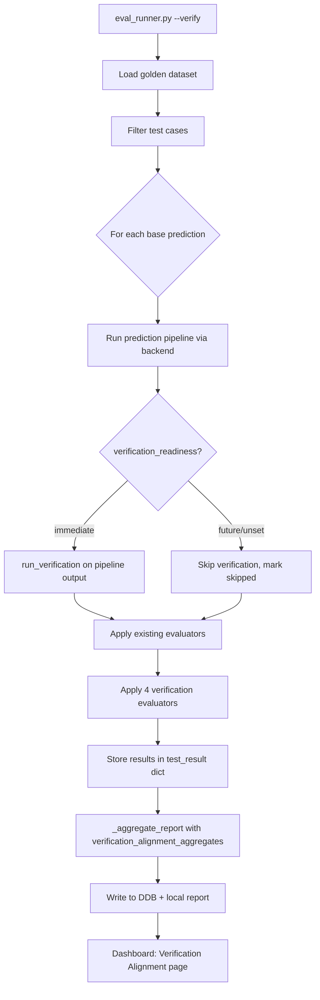
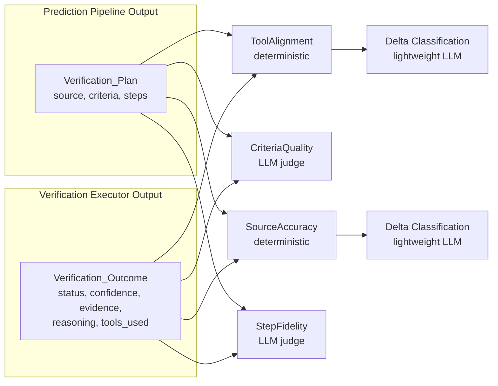

# Design Document — Spec B3: Verification Eval Integration

## Overview

This design extends the existing eval framework with a `--verify` mode and four new evaluators that measure plan-execution alignment — how well the Verification Builder's plans translate into actual Verification Executor outcomes.

The core insight: the prediction pipeline produces a Verification_Plan (sources, criteria, steps), and the Verification Executor produces a Verification_Outcome (status, evidence, tools_used). The four new evaluators compare these two artifacts across different dimensions: tool overlap, criteria clarity, source accuracy, and step fidelity.

The design follows existing patterns throughout:
- Deterministic evaluators follow `category_match.py` (function returning `{"score": float, "evaluator": str, ...}`)
- LLM judge evaluators follow `intent_preservation.py` (Strands Evals SDK `OutputEvaluator`)
- Report aggregation extends `_aggregate_report()` in `eval_runner.py`
- DDB storage extends `EvalReasoningStore` with a new record type
- Dashboard page follows the existing `render(run_detail, loader)` pattern

Key design decisions:
- **Decision 62**: Verification evaluators NOT added to `EVALUATOR_WEIGHTS` — scores are reported but don't affect the VB-centric composite until empirical calibration
- **Decision 77**: Fold verification eval into existing framework (not a separate runner)
- **Decision 78**: No mocks — all tests hit real services
- **Decision 81**: Eval runner calls `run_verification()` directly, bypassing production triggers
- **Decision 83**: 120s timeout for MCP cold start on verification execution

## Architecture

The `--verify` flag adds a verification execution step after the existing prediction pipeline for each eligible test case. The flow:



The verification evaluators operate on two inputs:
1. **Verification_Plan**: Extracted from the prediction pipeline's `verification_method` output (already available in `result` dict)
2. **Verification_Outcome**: Returned by `run_verification(prediction_record)` from Spec B1



## Components and Interfaces

### 1. CLI Extension (`eval_runner.py`)

Add `--verify` flag to argparse. In the main evaluation loop, after running the prediction pipeline for each base prediction:

```python
# In __main__ argparse block
parser.add_argument("--verify", action="store_true",
                    help="Run Verification Executor after prediction pipeline")

# In run_on_demand_evaluation(), new parameter
def run_on_demand_evaluation(..., use_verify: bool = False) -> dict:
```

The `--verify` flag composes with all existing filters. When `--verify` is set and a test case has `verification_readiness == "immediate"`, the runner calls `run_verification()` on the pipeline output, then applies the four verification evaluators.

### 2. Verification Evaluator Dispatch (`eval_runner.py`)

New function `_evaluate_verification()` called after `_evaluate_base_prediction()` when `--verify` is active:

```python
def _evaluate_verification(
    bp: BasePrediction,
    pipeline_output: dict,
    verification_outcome: dict,
    use_judge: bool = False,
) -> dict:
    """Apply verification alignment evaluators.

    Args:
        bp: The base prediction test case.
        pipeline_output: The prediction pipeline's final output dict.
        verification_outcome: The Verification_Outcome from run_verification().
        use_judge: Whether to run LLM judge evaluators (CriteriaQuality, StepFidelity).

    Returns:
        Dict of evaluator scores keyed by evaluator name.
    """
```

This function extracts the Verification_Plan from `pipeline_output["verification_method"]` and dispatches to each evaluator. The deterministic evaluators (ToolAlignment, SourceAccuracy) always run. The LLM judge evaluators (CriteriaQuality, StepFidelity) run when `use_judge=True` (controlled by the existing `--judge` flag).

### 3. ToolAlignment Evaluator (`evaluators/tool_alignment.py`)

Deterministic evaluator following `category_match.py` pattern. Measures set overlap between planned tools and actually-used tools.

```python
def evaluate_tool_alignment(
    verification_plan: dict,
    verification_outcome: dict,
) -> dict:
    """Score tool overlap between plan and execution.

    Extracts tool references from plan's steps field (heuristic: tool names
    mentioned in step text) and compares against outcome's tools_used list.

    Returns:
        {"score": float, "evaluator": "ToolAlignment",
         "planned_tools": list, "used_tools": list,
         "overlap": list, "plan_only": list, "execution_only": list,
         "delta_classification": str|None}
    """
```

Score calculation: Jaccard similarity between planned tool set and used tool set. When score < 1.0 (delta exists), a lightweight LLM call classifies the delta as `plan_error`, `new_information`, or `tool_drift`.

Tool extraction from plan steps uses keyword matching against known MCP tool names (`brave_web_search`, `fetch`, etc.) since the plan's `steps` field contains natural language descriptions that reference tools by name.

### 4. CriteriaQuality Evaluator (`evaluators/criteria_quality.py`)

LLM judge evaluator following `intent_preservation.py` pattern. Uses Strands Evals SDK `OutputEvaluator` to score whether each criterion in the plan led to a clear verdict.

```python
def evaluate_criteria_quality(
    verification_plan: dict,
    verification_outcome: dict,
    judge_model: str = DEFAULT_JUDGE_MODEL,
) -> dict:
    """Score whether VB criteria led to clear verdicts.

    Returns:
        {"score": float, "evaluator": "CriteriaQuality",
         "judge_reasoning": str, "judge_model": str}
    """
```

The rubric evaluates: (1) each criterion is specific enough to be checkable, (2) the evidence maps clearly to criteria, (3) no criteria were ignored or unmeasurable.

### 5. SourceAccuracy Evaluator (`evaluators/source_accuracy.py`)

Deterministic evaluator. Measures whether evidence sources in the outcome correspond to planned sources.

```python
def evaluate_source_accuracy(
    verification_plan: dict,
    verification_outcome: dict,
) -> dict:
    """Score source overlap between plan and execution evidence.

    Extracts planned sources from plan's source field and compares against
    evidence[].source in the outcome using fuzzy URL/domain matching.

    Returns:
        {"score": float, "evaluator": "SourceAccuracy",
         "planned_sources": list, "evidence_sources": list,
         "matched": list, "unmatched_plan": list, "unmatched_evidence": list,
         "delta_classification": str|None}
    """
```

Score calculation: proportion of planned sources that appear (fuzzy domain match) in the evidence sources. When score < 1.0, a lightweight LLM call classifies the delta.

### 6. StepFidelity Evaluator (`evaluators/step_fidelity.py`)

LLM judge evaluator using Strands Evals SDK `OutputEvaluator`. Scores whether the executor followed the planned steps in sequence and intent.

```python
def evaluate_step_fidelity(
    verification_plan: dict,
    verification_outcome: dict,
    judge_model: str = DEFAULT_JUDGE_MODEL,
) -> dict:
    """Score whether execution followed planned steps.

    Returns:
        {"score": float, "evaluator": "StepFidelity",
         "judge_reasoning": str, "judge_model": str,
         "delta_classification": str|None}
    """
```

The rubric evaluates: (1) each planned step was attempted, (2) steps were executed in the planned order, (3) the executor didn't skip critical steps. Delta classification is included in the judge's rubric output since the LLM is already reasoning about the execution.

### 7. Delta Classification (Lightweight LLM)

For deterministic evaluators (ToolAlignment, SourceAccuracy), when a delta exists (score < 1.0), a lightweight LLM call classifies the root cause:

```python
def classify_delta(
    plan_field: str,
    planned_items: list,
    actual_items: list,
    reasoning: str,
    model: str = "us.anthropic.claude-sonnet-4-20250514-v1:0",
) -> str:
    """Classify WHY a plan-execution delta occurred.

    Returns one of: "plan_error", "new_information", "tool_drift"
    """
```

- **plan_error**: The VB wrote a plan that couldn't be executed as written (wrong tool name, unavailable source)
- **new_information**: The executor found better/different information than planned (adaptive behavior)
- **tool_drift**: The executor used different tools than planned for no clear reason

This uses a direct Bedrock `converse` call (not the full Strands Evals SDK) to keep it lightweight — just a classification prompt, not a full rubric evaluation.

### 8. Report Aggregation Extension (`eval_runner.py`)

Extend `_aggregate_report()` to include `verification_alignment_aggregates`:

```python
"verification_alignment_aggregates": {
    "tool_alignment": {"mean": float, "min": float, "max": float},
    "criteria_quality": {"mean": float, "min": float, "max": float},
    "source_accuracy": {"mean": float, "min": float, "max": float},
    "step_fidelity": {"mean": float, "min": float, "max": float},
    "delta_classification_breakdown": {
        "plan_error": int,
        "new_information": int,
        "tool_drift": int,
    },
    "verification_count": int,
    "skipped_count": int,
}
```

### 9. DDB Storage Extension (`eval_reasoning_store.py`)

New method `write_verification_outcome()` following the existing fire-and-forget pattern:

```python
def write_verification_outcome(
    self,
    test_case_id: str,
    verification_plan: dict,
    verification_outcome: dict,
    evaluator_scores: dict,
):
    """Write verification data as verification_outcome#{test_case_id}."""
    self._put_item(f"verification_outcome#{test_case_id}", {
        "verification_plan": verification_plan,
        "verification_outcome": verification_outcome,
        "evaluator_scores": evaluator_scores,
    })
```

### 10. Dashboard Page (`eval/dashboard/pages/verification_alignment.py`)

New page following the existing `render(run_detail, loader)` pattern:

```python
def render(run_detail: dict, loader):
    """Render the Verification Alignment dashboard page."""
```

Visualizations:
- Four-dimension radar/bar chart showing mean scores for each evaluator
- Delta classification pie chart (plan_error vs new_information vs tool_drift)
- Per-test-case table with expandable details showing plan vs outcome comparison
- Skipped test cases section showing future-dated cases

### 11. Sidebar and Routing Updates

- `sidebar.py`: Add `"Verification Alignment"` to the `st.radio` page list
- `app.py`: Import `verification_alignment` from `eval.dashboard.pages`, add `elif page == "Verification Alignment"` dispatch


## Data Models

### Golden Dataset Extension

The `BasePrediction` dataclass gains an optional `verification_readiness` field:

```python
@dataclass
class BasePrediction:
    # ... existing fields ...
    verification_readiness: str = "future"  # "immediate" or "future"
```

Valid values: `{"immediate", "future"}`. Default: `"future"` (conservative — don't attempt verification unless explicitly marked).

Validation in `_validate_base_prediction()`:
```python
VALID_VERIFICATION_READINESS = {"immediate", "future"}

verification_readiness = bp.get("verification_readiness", "future")
if verification_readiness not in VALID_VERIFICATION_READINESS:
    raise ValueError(...)
```

Serialization in `_serialize_base()` adds the field. Schema version stays at `"3.0"` — this is an optional field with a safe default, no breaking change.

### Verification Evaluator Return Dicts

All four evaluators return dicts compatible with the existing `evaluator_scores` pattern:

**ToolAlignment** (deterministic + delta classification):
```python
{
    "score": 0.75,           # Jaccard similarity
    "evaluator": "ToolAlignment",
    "planned_tools": ["brave_web_search", "fetch"],
    "used_tools": ["brave_web_search"],
    "overlap": ["brave_web_search"],
    "plan_only": ["fetch"],
    "execution_only": [],
    "delta_classification": "tool_drift",  # None when score == 1.0
}
```

**CriteriaQuality** (LLM judge):
```python
{
    "score": 0.8,
    "evaluator": "CriteriaQuality",
    "judge_reasoning": "All criteria were specific and measurable...",
    "judge_model": "us.anthropic.claude-opus-4-6-v1",
}
```

**SourceAccuracy** (deterministic + delta classification):
```python
{
    "score": 0.5,
    "evaluator": "SourceAccuracy",
    "planned_sources": ["openweathermap.org", "weather.gov"],
    "evidence_sources": ["weather.gov", "accuweather.com"],
    "matched": ["weather.gov"],
    "unmatched_plan": ["openweathermap.org"],
    "unmatched_evidence": ["accuweather.com"],
    "delta_classification": "new_information",
}
```

**StepFidelity** (LLM judge):
```python
{
    "score": 0.9,
    "evaluator": "StepFidelity",
    "judge_reasoning": "Executor followed 4 of 5 planned steps...",
    "judge_model": "us.anthropic.claude-opus-4-6-v1",
    "delta_classification": "plan_error",  # None when score == 1.0
}
```

### DDB Record Type

New record type in `calledit-eval-reasoning` table:

```
PK: eval_run_id (S)
SK: verification_outcome#{test_case_id} (S)
```

Fields:
```python
{
    "eval_run_id": "uuid",
    "record_key": "verification_outcome#base-001",
    "ttl": int,  # 90 days
    "verification_plan": {
        "source": [...],
        "criteria": [...],
        "steps": [...]
    },
    "verification_outcome": {
        "status": "confirmed|refuted|inconclusive",
        "confidence": "0.85",  # string for DDB Decimal compat
        "evidence": [...],
        "reasoning": "...",
        "tools_used": [...]
    },
    "evaluator_scores": {
        "ToolAlignment": {"score": "0.75", ...},
        "CriteriaQuality": {"score": "0.8", ...},
        "SourceAccuracy": {"score": "0.5", ...},
        "StepFidelity": {"score": "0.9", ...},
    }
}
```

### Report Extension

The `_aggregate_report()` return dict gains a `verification_alignment_aggregates` key (see Components section above). This is `None` when `--verify` was not used, preserving backward compatibility with existing dashboard pages that don't expect this field.


## Correctness Properties

*A property is a characteristic or behavior that should hold true across all valid executions of a system — essentially, a formal statement about what the system should do. Properties serve as the bridge between human-readable specifications and machine-verifiable correctness guarantees.*

### Property 1: Verify-mode test result structural completeness

*For any* base prediction test case with `verification_readiness == "immediate"` processed with `--verify` enabled, the resulting test result dict must contain: (a) a `verification_plan` key with a dict containing `source`, `criteria`, and `steps`, (b) a `verification_outcome` key with a dict containing `status`, `confidence`, `evidence`, `reasoning`, and `tools_used`, and (c) evaluator scores keyed as `ToolAlignment`, `SourceAccuracy`, and (when `--judge` is also set) `CriteriaQuality` and `StepFidelity` in the `evaluator_scores` dict.

**Validates: Requirements 1.1, 1.2, 2.6**

### Property 2: Future-dated cases are skipped with reason

*For any* base prediction test case where `verification_readiness` is `"future"` or unset, when processed with `--verify` enabled, the test result's `evaluator_scores["_skipped_evaluators"]` must contain entries for all four verification evaluators (`ToolAlignment`, `SourceAccuracy`, `CriteriaQuality`, `StepFidelity`) each with reason `"future_dated"`, and the test result must not contain a `verification_outcome` key.

**Validates: Requirements 1.3**

### Property 3: ToolAlignment score equals Jaccard similarity

*For any* two sets of tool names (planned_tools, used_tools), the ToolAlignment evaluator's score must equal the Jaccard similarity: `|intersection| / |union|` when the union is non-empty, and `1.0` when both sets are empty.

**Validates: Requirements 2.1**

### Property 4: SourceAccuracy score equals planned source coverage

*For any* list of planned sources and list of evidence sources, the SourceAccuracy evaluator's score must equal the proportion of planned sources that fuzzy-match at least one evidence source. When planned sources is empty, score must be `1.0` (nothing to miss).

**Validates: Requirements 2.3**

### Property 5: LLM judge evaluator return structure

*For any* invocation of CriteriaQuality or StepFidelity evaluators (including error cases), the return dict must contain keys `score` (float in [0.0, 1.0]), `evaluator` (matching the evaluator name), `judge_reasoning` (non-empty string), and `judge_model` (non-empty string).

**Validates: Requirements 2.2, 2.4**

### Property 6: Delta classification invariant

*For any* evaluator result from ToolAlignment, SourceAccuracy, or StepFidelity where `score < 1.0`, the `delta_classification` field must be present and one of `{"plan_error", "new_information", "tool_drift"}`. When `score == 1.0`, `delta_classification` must be `None`.

**Validates: Requirements 2.5**

### Property 7: Verification readiness parsing and default

*For any* base prediction dict in the golden dataset, the parsed `BasePrediction.verification_readiness` must be one of `{"immediate", "future"}`. When the field is absent from the JSON, it must default to `"future"`.

**Validates: Requirements 3.1, 3.3**

### Property 8: Verification alignment aggregation correctness

*For any* list of test results containing verification evaluator scores, the `verification_alignment_aggregates` in the report must have correct `mean`, `min`, and `max` for each evaluator, and the `delta_classification_breakdown` counts must sum to the total number of non-None delta classifications across all evaluator results.

**Validates: Requirements 4.1**

### Property 9: DDB verification record key format

*For any* test case ID written via `write_verification_outcome()`, the DDB record key must follow the pattern `verification_outcome#{test_case_id}` and the item must contain `verification_plan`, `verification_outcome`, and `evaluator_scores` keys with all float values sanitized to strings.

**Validates: Requirements 4.2**

## Error Handling

### Verification Execution Failures

When `run_verification()` fails or returns an error for a test case:
- The test result records the error in the existing `error` field
- Verification evaluator scores are set to `0.0` with a `"verification_failed"` note
- The test case still counts toward totals (not silently dropped)
- Other test cases continue executing (same pattern as existing pipeline error handling)

### Delta Classification LLM Failures

When the lightweight LLM call for delta classification fails:
- `delta_classification` is set to `None` (same as no-delta case)
- A warning is logged but the evaluator score is still returned
- The deterministic score (WHAT diverged) is always available even if the WHY classification fails

### LLM Judge Evaluator Failures

CriteriaQuality and StepFidelity follow the same error pattern as `intent_preservation.py`:
- Return `{"score": 0.0, "evaluator": "...", "judge_reasoning": "SDK invocation failed: {error}", "judge_model": "..."}`
- Never raise — always return a valid score dict

### DDB Write Failures

Follow the existing fire-and-forget pattern in `EvalReasoningStore`:
- Log warning, never raise
- Local report file is always written regardless of DDB status

### Timeout Handling

Verification execution has a 120s timeout (Decision 83) for MCP cold start. If a test case exceeds this:
- The test case is marked as failed with a timeout error
- Subsequent test cases still execute (MCP should be warm after first invocation)

## Testing Strategy

### Property-Based Testing

Use `hypothesis` (already in the project's dev dependencies) for property-based tests. Each property test runs minimum 100 iterations.

**Library**: `hypothesis` with `@given` decorator and `strategies` module.

**Test file**: `backend/calledit-backend/tests/test_verification_eval.py`

Each property-based test must be tagged with a comment referencing the design property:
```python
# Feature: verification-eval-integration, Property 3: ToolAlignment score equals Jaccard similarity
```

Property tests focus on:
- **Property 3**: Generate random tool name sets, verify Jaccard calculation
- **Property 4**: Generate random source lists, verify coverage calculation
- **Property 5**: Test judge evaluator return structure with various inputs (including error-inducing inputs)
- **Property 6**: Generate random evaluator results with varying scores, verify delta_classification presence/absence invariant
- **Property 7**: Generate random base prediction dicts with/without verification_readiness, verify parsing
- **Property 8**: Generate random lists of test results with verification scores, verify aggregation math

### Unit Testing

Unit tests complement property tests for specific examples and edge cases:

- **Property 1 & 2**: Integration tests that run a single test case through the verify pipeline (requires real services per Decision 78)
- **Empty inputs**: ToolAlignment with empty tool sets, SourceAccuracy with empty source lists
- **EVALUATOR_WEIGHTS exclusion**: Assert the four new evaluator names are not in the weights dict
- **Schema version**: Assert `SUPPORTED_SCHEMA_VERSION == "3.0"`
- **Golden dataset content**: Assert the dataset contains both `immediate` and `future` test cases
- **Dashboard page existence**: Assert `verification_alignment.py` has a `render` function
- **Sidebar inclusion**: Assert `"Verification Alignment"` appears in the sidebar page list

### Test Configuration

- All tests use `/home/wsluser/projects/calledit/venv/bin/python`
- No mocks (Decision 78) — integration tests hit real Bedrock and DDB
- Property tests use `@settings(max_examples=100)` minimum
- Integration tests with `--verify` use `--name` filter for single-case iteration (~20-120s)

