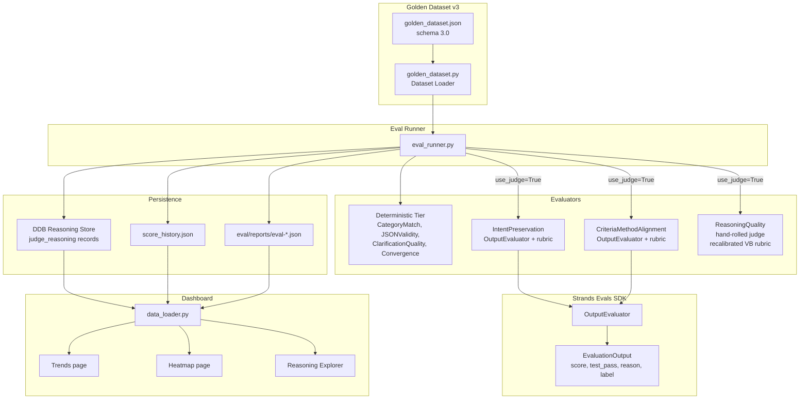

# Design Document: Verification-Centric Evaluators

## Overview

This design adds verification-quality measurement to CalledIt's eval framework. The current evaluators measure proxy metrics (category accuracy, JSON validity, essay-quality reasoning) rather than the system's actual goals: understanding prediction intent and producing executable verification plans.

The change introduces:
1. Golden dataset v3 schema with `expected_verification_criteria` and `expected_verification_method` fields in `ground_truth`
2. Two new LLM-as-judge evaluators (`IntentPreservation`, `CriteriaMethodAlignment`) built on Strands Evals SDK `OutputEvaluator`
3. Recalibrated `verification_builder` judge rubric in the existing `ReasoningQuality` evaluator
4. Eval runner integration to invoke new evaluators alongside existing ones
5. Dashboard updates to visualize the new scores

The Strands Evals SDK (`strands-agents-evals`) provides the evaluation primitive layer — handling judge model invocation, response parsing, and structured `EvaluationOutput` — while CalledIt retains its custom persistence (DDB reasoning store), versioning (score history), and visualization (Streamlit dashboard).

## Architecture



### Key Design Decisions

1. **Wrapper pattern over SDK, not subclass**: The new evaluators are thin Python modules that instantiate `OutputEvaluator`, invoke it, and map `EvaluationOutput` to CalledIt's existing score dict format (`{"score", "evaluator", "judge_reasoning", "judge_model"}`). This avoids coupling CalledIt's evaluator interface to the SDK's type system while getting the SDK's judge invocation, parsing, and retry logic for free.

2. **Additive schema migration (v2 → v3)**: The two new `ground_truth` fields (`expected_verification_criteria`, `expected_verification_method`) are added to the existing `GroundTruthMetadata` dataclass. The loader validates them as required on all base predictions. Schema version bumps to `"3.0"`.

3. **Judge model separation**: Both new evaluators use a judge model different from the agent model (Opus 4.6 as judge, Sonnet 4 as agent) to avoid self-evaluation bias, consistent with the existing `ReasoningQuality` evaluator.

4. **Existing evaluators untouched**: `CategoryMatch`, `JSONValidity`, `ClarificationQuality`, `Convergence`, and the `ReasoningQuality` evaluator's `categorizer`/`review` rubrics remain unchanged. Only the `verification_builder` rubric in `ReasoningQuality` is recalibrated.

## Components and Interfaces

### 1. Golden Dataset Loader (`golden_dataset.py`)

**Changes to `GroundTruthMetadata` dataclass:**

```python
@dataclass
class GroundTruthMetadata:
    """WHY a prediction has its expected category — the stable foundation."""
    verifiability_reasoning: str
    date_derivation: str
    verification_sources: List[str]
    objectivity_assessment: str
    verification_criteria: List[str]
    verification_steps: List[str]
    verification_timing: str
    # V3 additions
    expected_verification_criteria: List[str]  # checkable true/false conditions
    expected_verification_method: str           # approach for proving true/false
```

**Validation changes in `_validate_ground_truth()`:**
- Validate `expected_verification_criteria` is a non-empty `List[str]`
- Validate `expected_verification_method` is a non-empty `str`
- Raise `ValueError` with prediction ID on failure

**Schema version:** `SUPPORTED_SCHEMA_VERSION = "3.0"`

**Serialization:** `_serialize_base()` includes both new fields in the `ground_truth` dict.

### 2. IntentPreservation Evaluator (`evaluators/intent_preservation.py`)

```python
def evaluate_intent_preservation(
    prediction_text: str,
    vb_criteria: list,
    expected_criteria: list[str],
    judge_model: str = DEFAULT_JUDGE_MODEL,
) -> dict:
    """Score whether VB criteria captures the prediction's intent.

    Returns:
        {"score": 0.0-1.0, "evaluator": "IntentPreservation",
         "judge_reasoning": str, "judge_model": str}
    """
```

**SDK integration:**
- Instantiates `OutputEvaluator(rubric=INTENT_RUBRIC, model=judge_model, include_inputs=True)`
- Constructs `EvaluationData` with:
  - `input`: original prediction text
  - `actual_output`: VB's criteria (stringified)
  - `expected_output`: expected criteria from golden dataset (stringified)
- Maps `EvaluationOutput.score` → `score`, `EvaluationOutput.reason` → `judge_reasoning`
- On SDK failure: returns `score=0.0` with error in `judge_reasoning`

**Rubric focus:** Semantic equivalence between VB criteria and expected criteria, penalizing framing language retention ("user believes X" instead of "X").

### 3. CriteriaMethodAlignment Evaluator (`evaluators/criteria_method_alignment.py`)

```python
def evaluate_criteria_method_alignment(
    vb_criteria: list,
    vb_method: dict,
    expected_method: str,
    judge_model: str = DEFAULT_JUDGE_MODEL,
) -> dict:
    """Score whether VB method provides a realistic verification plan.

    Returns:
        {"score": 0.0-1.0, "evaluator": "CriteriaMethodAlignment",
         "judge_reasoning": str, "judge_model": str}
    """
```

**SDK integration:** Same pattern as IntentPreservation — `OutputEvaluator` with a different rubric.

**Rubric focus:** Whether the method identifies specific, accessible data sources appropriate for the criteria, penalizing "ask the user" as primary approach when public sources exist.

### 4. Eval Runner (`eval_runner.py`)

**Changes to `_evaluate_base_prediction()`:**
- When `use_judge=True`, invoke `evaluate_intent_preservation()` and `evaluate_criteria_method_alignment()`
- Pass `ground_truth.expected_verification_criteria` and `ground_truth.expected_verification_method` from the `BasePrediction`
- Extract VB criteria/method from `result` (the agent pipeline output)
- Store results in `scores["IntentPreservation"]` and `scores["CriteriaMethodAlignment"]`

**Changes to `_aggregate_report()`:**
- Compute average `IntentPreservation` and `CriteriaMethodAlignment` scores across all test cases
- Include in report under a new `verification_quality_aggregates` section

**Changes to `print_report()`:**
- Display IntentPreservation and CriteriaMethodAlignment averages in console output

**Reasoning store writes:**
- Call `reasoning_store.write_judge_reasoning()` for both new evaluators, same pattern as existing `ReasoningQuality` writes

### 5. ReasoningQuality Rubric Recalibration (`evaluators/reasoning_quality.py`)

Only the `verification_builder` entry in `JUDGE_PROMPTS` changes. The prompt shifts from "are the steps well-written?" to "would this verification plan succeed?"

**New scoring anchors:**
- 1.0: Plan identifies specific data sources and timing for verification
- 0.7: Correct approach but vague sources
- 0.4: Generic plan that could apply to any prediction
- 0.0: Plan would fail to verify the prediction

The `categorizer` and `review` rubrics remain unchanged.

### 6. Dashboard Updates

**Trends page (`pages/trends.py`):**
- Add `IntentPreservation` and `CriteriaMethodAlignment` average score trend lines
- Source from `per_agent_aggregates` or `verification_quality_aggregates` in run summaries

**Heatmap page (`pages/heatmap.py`):**
- `IntentPreservation` and `CriteriaMethodAlignment` appear as columns alongside existing evaluators
- Classified as judge evaluators (right side of the deterministic/judge separator)
- No code change needed — the heatmap dynamically discovers evaluator columns from `evaluator_scores` keys

**Reasoning Explorer page:**
- Display IntentPreservation and CriteriaMethodAlignment judge reasoning alongside existing ReasoningQuality reasoning
- Source from DDB `judge_reasoning#<test_case_id>#IntentPreservation` and `judge_reasoning#<test_case_id>#CriteriaMethodAlignment` records

**Backward compatibility:**
- `_is_judge_evaluator()` in heatmap.py updated to recognize `IntentPreservation` and `CriteriaMethodAlignment` as judge evaluators
- Dashboard data loader handles runs with and without new evaluator scores — missing scores render as "N/A" not 0

## Data Models

### Golden Dataset v3 JSON Schema (ground_truth additions)

```json
{
  "schema_version": "3.0",
  "dataset_version": "3.0",
  "base_predictions": [
    {
      "id": "base-001",
      "prediction_text": "The sun will rise tomorrow in New York City",
      "ground_truth": {
        "verifiability_reasoning": "...",
        "date_derivation": "...",
        "verification_sources": ["..."],
        "objectivity_assessment": "objective",
        "verification_criteria": ["..."],
        "verification_steps": ["..."],
        "verification_timing": "...",
        "expected_verification_criteria": [
          "The sun appears above the horizon in New York City on the specified date"
        ],
        "expected_verification_method": "Confirm via astronomical calculations based on Earth's rotation and NYC coordinates. No external data source needed — this is deterministic from orbital mechanics."
      }
    }
  ]
}
```

### Evaluator Output Format (CalledIt internal)

Both new evaluators return the same dict shape as `ReasoningQuality`:

```python
{
    "score": 0.85,                          # 0.0-1.0, from OutputEvaluator
    "evaluator": "IntentPreservation",      # or "CriteriaMethodAlignment"
    "judge_reasoning": "The VB criteria...", # from EvaluationOutput.reason
    "judge_model": "us.anthropic.claude-opus-4-6-v1"
}
```

### DDB Record Types (additions)

New judge reasoning records follow the existing pattern:

```
PK: eval_run_id
SK: judge_reasoning#<test_case_id>#IntentPreservation
SK: judge_reasoning#<test_case_id>#CriteriaMethodAlignment
```

Fields: `agent_name`, `score` (str), `judge_reasoning`, `judge_model`

### Report Aggregates (additions)

```json
{
  "verification_quality_aggregates": {
    "intent_preservation_avg": 0.82,
    "criteria_method_alignment_avg": 0.75
  }
}
```


## Correctness Properties

*A property is a characteristic or behavior that should hold true across all valid executions of a system — essentially, a formal statement about what the system should do. Properties serve as the bridge between human-readable specifications and machine-verifiable correctness guarantees.*

### Property 1: Ground truth v3 field validation round-trip

*For any* valid base prediction ground_truth dict containing `expected_verification_criteria` (a non-empty list of non-empty strings) and `expected_verification_method` (a non-empty string), the `_validate_ground_truth()` function should successfully parse it into a `GroundTruthMetadata` dataclass with those fields preserved. Conversely, for any ground_truth dict where either field is missing, empty, or the wrong type, the function should raise `ValueError` with the prediction ID in the message.

**Validates: Requirements 1.2, 1.3, 1.4, 1.5**

### Property 2: Ground truth serialization round-trip

*For any* valid `GroundTruthMetadata` instance with `expected_verification_criteria` and `expected_verification_method` populated, serializing via `_serialize_base()` and then validating the resulting dict via `_validate_ground_truth()` should produce an equivalent `GroundTruthMetadata` with both v3 fields preserved.

**Validates: Requirements 1.7**

### Property 3: Evaluator output structure invariant

*For any* invocation of `evaluate_intent_preservation()` or `evaluate_criteria_method_alignment()` (whether the SDK call succeeds or fails), the returned dict must contain exactly the keys `score` (float in [0.0, 1.0]), `evaluator` (the correct label string), `judge_reasoning` (non-empty string), and `judge_model` (non-empty string).

**Validates: Requirements 3.3, 3.6, 4.3, 4.6**

### Property 4: Evaluator graceful degradation on SDK failure

*For any* exception raised by the Strands Evals SDK `OutputEvaluator`, both `evaluate_intent_preservation()` and `evaluate_criteria_method_alignment()` should return `score=0.0` with the exception message contained in `judge_reasoning`, and should never propagate the exception to the caller.

**Validates: Requirements 3.6, 4.6**

### Property 5: Eval runner includes verification evaluator scores when judge enabled

*For any* base prediction test case run with `use_judge=True`, the resulting `evaluator_scores` dict must contain both `"IntentPreservation"` and `"CriteriaMethodAlignment"` keys, each with a valid score dict.

**Validates: Requirements 7.1, 7.2**

### Property 6: Aggregate report computes verification quality averages

*For any* non-empty list of test results where each contains `IntentPreservation` and `CriteriaMethodAlignment` scores, the `_aggregate_report()` function should produce `verification_quality_aggregates` with `intent_preservation_avg` and `criteria_method_alignment_avg` equal to the arithmetic mean of the respective scores.

**Validates: Requirements 7.4, 7.6**

### Property 7: Heatmap discovers new evaluator columns

*For any* list of test case dicts where `evaluator_scores` contains `IntentPreservation` and/or `CriteriaMethodAlignment` keys, the heatmap `_build_matrix()` function should include those as columns in the returned evaluator list, classified on the judge side of the deterministic/judge separator.

**Validates: Requirements 8.2**

### Property 8: Data loader handles missing evaluator scores gracefully

*For any* run data (DDB or local) that lacks `IntentPreservation` or `CriteriaMethodAlignment` in `evaluator_scores`, the data loader normalization functions should not raise exceptions, and the normalized output should preserve whatever scores are present without injecting zeros for missing evaluators.

**Validates: Requirements 8.5**

## Error Handling

### Evaluator SDK Failures
Both new evaluators wrap the `OutputEvaluator` call in try/except. On any exception (network, model throttling, malformed response), the evaluator returns `{"score": 0.0, "evaluator": "<name>", "judge_reasoning": "SDK invocation failed: <error>", "judge_model": "<model>"}`. This matches the existing `ReasoningQuality` evaluator's error handling pattern. The eval runner continues to the next evaluator/test case — a single judge failure never aborts the run.

### Dataset Validation Failures
The loader raises `ValueError` with the prediction ID and field name for any v3 validation failure. This is a hard stop — the dataset must be fixed before running evals. This is consistent with existing v2 validation behavior.

### Dashboard Backward Compatibility
The data loader and dashboard pages handle missing evaluator scores by checking key existence before access. The heatmap uses `None` for missing cells (rendered as gaps). The trends page skips metrics that don't exist in older runs. The reasoning explorer shows "No reasoning available" when DDB has no judge_reasoning record for the new evaluators.

### DDB Write Failures
The reasoning store's fire-and-forget pattern applies to new evaluator reasoning writes. DDB failures are logged at WARN level and never block the eval run. This is the existing pattern from `EvalReasoningStore._put_item()`.

## Testing Strategy

### Property-Based Tests (Hypothesis)

Each correctness property maps to a single property-based test with minimum 100 iterations. Tests use `hypothesis` (already in `requirements.txt`).

**Test file:** `backend/calledit-backend/tests/strands_make_call/test_verification_evaluators.py`

Property tests to implement:

1. **Feature: verification-evaluators, Property 1: Ground truth v3 field validation round-trip**
   - Generate random valid ground_truth dicts with v3 fields → assert `_validate_ground_truth()` succeeds and fields are preserved
   - Generate invalid variants (missing, empty, wrong type) → assert `ValueError` raised with prediction ID

2. **Feature: verification-evaluators, Property 2: Ground truth serialization round-trip**
   - Generate random valid `BasePrediction` instances → serialize → validate → assert v3 fields match

3. **Feature: verification-evaluators, Property 3: Evaluator output structure invariant**
   - Mock `OutputEvaluator` to return random `EvaluationOutput` values → assert return dict has correct keys and types
   - Mock `OutputEvaluator` to raise random exceptions → assert return dict still has correct keys and types

4. **Feature: verification-evaluators, Property 4: Evaluator graceful degradation on SDK failure**
   - Mock `OutputEvaluator` to raise various exception types → assert score is 0.0 and exception message appears in judge_reasoning

5. **Feature: verification-evaluators, Property 5: Eval runner includes verification evaluator scores when judge enabled**
   - Mock the evaluator functions and pipeline → run `_evaluate_base_prediction()` with `use_judge=True` → assert both keys present

6. **Feature: verification-evaluators, Property 6: Aggregate report computes verification quality averages**
   - Generate random test result lists with IntentPreservation/CriteriaMethodAlignment scores → assert averages are correct

7. **Feature: verification-evaluators, Property 7: Heatmap discovers new evaluator columns**
   - Generate test case dicts with various evaluator_scores keys → assert `_build_matrix()` includes new evaluators as judge columns

8. **Feature: verification-evaluators, Property 8: Data loader handles missing evaluator scores gracefully**
   - Generate run data with and without new evaluator keys → assert normalization never raises

### Unit Tests (pytest)

Unit tests cover specific examples, edge cases, and integration points:

- **Schema version check**: Load a dataset with `schema_version: "3.0"` → succeeds; load with `"2.0"` → fails
- **GroundTruthMetadata fields exist**: Assert dataclass has `expected_verification_criteria` and `expected_verification_method` attributes
- **All 45 base predictions populated**: Load actual `golden_dataset.json` → assert all base predictions have non-empty v3 fields
- **Judge model differs from agent model**: Assert `DEFAULT_JUDGE_MODEL != AGENT_MODEL` in both new evaluator modules
- **VB rubric recalibrated**: Assert `JUDGE_PROMPTS["verification_builder"]` contains "verification plan would succeed" or equivalent language
- **Categorizer/review rubrics unchanged**: Snapshot test — assert `JUDGE_PROMPTS["categorizer"]` and `JUDGE_PROMPTS["review"]` match known values
- **strands-agents-evals in requirements.txt**: Assert the package appears in root `requirements.txt`
- **Heatmap classifies new evaluators as judge**: Assert `_is_judge_evaluator("IntentPreservation")` and `_is_judge_evaluator("CriteriaMethodAlignment")` return True

### Testing Library

- **Property-based testing**: `hypothesis` (already installed, `>=6.0.0`)
- **Unit testing**: `pytest` (already installed, `>=7.0.0`)
- **Mocking**: `unittest.mock` (stdlib) for SDK and DDB mocking
- Each property test configured with `@settings(max_examples=100)`
