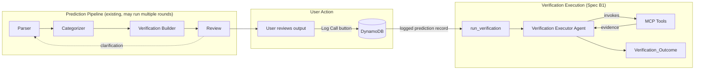

# Design Document — Spec B1: Verification Executor Agent

## Overview

This design describes the Verification Executor Agent — a new Strands agent that receives a verification plan (produced by the Verification Builder) and executes it by invoking MCP tools to gather evidence, evaluate it against criteria, and produce a structured verification outcome (confirmed/refuted/inconclusive).

The agent follows the same factory pattern as the existing 4 agents (parser, categorizer, verification_builder, review) but differs in one key way: it receives actual MCP tool objects via `Agent(tools=[...])` for direct invocation, rather than just a tool manifest string in its system prompt. This is because the executor *uses* tools to gather evidence, while the other agents only *reference* tools in their reasoning.

The entry point `run_verification(prediction_record)` orchestrates the full flow: extract the verification plan from a prediction record, build a user prompt, invoke the executor agent, parse the JSON response into a `Verification_Outcome`, and handle errors gracefully (returning `inconclusive` on failure).

This spec is self-contained and testable in isolation — no DynamoDB writes, no pipeline triggers, no eval integration. Those are Spec B2 and B3 respectively.

## Architecture

The Verification Executor fits into the existing system as a standalone agent module, invoked only after the user has completed the HITL review loop and logged the prediction to DynamoDB.



**Critical: The trigger is the logged prediction, not the VB output.** The prediction pipeline can run one or many rounds (user clarifies → agents refine → user reviews again). Only when the user clicks "Log Call" and the prediction is saved to DynamoDB does verification become relevant. This preserves the full HITL workflow — the user has the final say on what gets verified.

Spec B2 handles the actual trigger logic (immediate vs scheduled based on verification_date). Spec B1 only builds the agent and `run_verification()` entry point.

Key architectural decisions:

1. **Standalone invocation, not a graph node.** The executor runs independently after the user logs a prediction, not as a 5th node in the prediction graph. The prediction graph produces plans; the executor runs plans. Different lifecycles, different triggers (Spec B2).

2. **Direct tool invocation via `Agent(tools=[...])`**. Unlike the VB and Review agents which receive a `tool_manifest` string for reasoning, the executor receives the raw MCP tool objects from `mcp_manager.get_mcp_tools()`. The Strands Agent framework handles tool dispatch — the agent decides which tools to call based on the verification plan's steps.

3. **Module-level singleton with lazy tool wiring.** The agent is created at module level for warm Lambda reuse (same pattern as `prediction_graph`). MCP tools are obtained from the existing `mcp_manager` singleton — no separate MCP server connections.

4. **`run_verification()` as the public API.** A single function that takes a logged prediction record dict (from DynamoDB) and returns a Verification_Outcome dict. This is the contract that Spec B2's trigger logic will call. Error handling is internal — the function never raises, always returns a valid outcome.

## Components and Interfaces

### Component 1: `verification_executor_agent.py`

New module at `handlers/strands_make_call/verification_executor_agent.py`.

**Exports:**
- `VERIFICATION_EXECUTOR_SYSTEM_PROMPT` — the bundled system prompt constant
- `create_verification_executor_agent(model_id=None)` — factory function returning a configured `strands.Agent`
- `verification_executor_agent` — module-level singleton instance

**Factory function signature:**
```python
def create_verification_executor_agent(model_id: str = None) -> Agent:
    """
    Create the Verification Executor Agent.

    Unlike other agent factories that accept tool_manifest: str, this factory
    obtains actual MCP tool objects from mcp_manager.get_mcp_tools() and passes
    them to Agent(tools=[...]). The executor invokes tools directly, not just
    reasons about them.

    Args:
        model_id: Optional model override. If None, uses Claude Sonnet 4 via Bedrock.

    Returns:
        Configured Verification Executor Agent with MCP tools wired.
    """
```

**Key difference from other factories:** The VB and Review factories accept `tool_manifest: str` and inject it into the system prompt via `.replace()`. The executor factory calls `mcp_manager.get_mcp_tools()` directly and passes the tool objects to `Agent(tools=[...])`. If `get_mcp_tools()` returns an empty list, the agent operates in reasoning-only mode (no tools available).

**System prompt design (~25 lines):**
The prompt instructs the agent to:
1. Read the verification plan (criteria, sources, steps)
2. Execute the steps by invoking the named tools
3. Gather evidence from tool results
4. Evaluate evidence against each criterion
5. Return a structured JSON `Verification_Outcome`

The prompt follows the same "Return ONLY the raw JSON object" hardening pattern (Decision 4) and uses the same model (`us.anthropic.claude-sonnet-4-20250514-v1:0`, Decision 6).

**System prompt content:**
```
You are a verification executor. You receive a verification plan and execute it using your available tools to determine whether a prediction is true or false.

PROCESS:
1. Read the verification plan (prediction, criteria, sources, steps)
2. Execute each step by invoking the appropriate tool (brave_web_search, fetch, etc.)
3. Record what each tool returned as evidence
4. Evaluate the gathered evidence against each criterion
5. Determine the verdict: confirmed, refuted, or inconclusive

VERDICT RULES:
- confirmed: Evidence clearly supports the prediction meeting ALL criteria
- refuted: Evidence clearly shows the prediction failed one or more criteria
- inconclusive: Insufficient or contradictory evidence to make a determination

CONFIDENCE:
- 0.9-1.0: Strong, unambiguous evidence from multiple sources
- 0.7-0.8: Good evidence from at least one reliable source
- 0.5-0.6: Partial evidence, some criteria unclear
- 0.1-0.4: Weak evidence, mostly reasoning-based

If a tool call fails, note the failure in evidence and continue with remaining steps.
If no tools are available, return inconclusive with reasoning explaining the limitation.

Return ONLY the raw JSON object. No markdown code blocks, no backticks, no explanation text before or after the JSON. The first character of your response must be { and the last must be }.

{
    "status": "confirmed|refuted|inconclusive",
    "confidence": 0.0,
    "evidence": [
        {"source": "tool or URL used", "content": "relevant extracted content", "relevance": "how this relates to criteria"}
    ],
    "reasoning": "explanation of how evidence maps to criteria and why this verdict was chosen",
    "tools_used": ["tool_name_1", "tool_name_2"]
}
```

### Component 2: `run_verification()` entry point

Located in the same module (`verification_executor_agent.py`).

**Signature:**
```python
def run_verification(prediction_record: dict) -> dict:
    """
    Execute verification for a prediction record.

    Extracts the verification plan from the prediction record, builds a
    user prompt, invokes the executor agent, and parses the response.

    Args:
        prediction_record: A dict containing at minimum:
            - prediction_statement (str)
            - verification_method (dict with source, criteria, steps)
            - verifiable_category (str)

    Returns:
        A Verification_Outcome dict with status, confidence, evidence,
        reasoning, verified_at, and tools_used. Never raises — returns
        inconclusive on any error.
    """
```

**Flow:**
1. Extract `verification_method`, `prediction_statement`, `verifiable_category` from the record
2. If `verification_method` is missing or empty → return `inconclusive` immediately
3. Build a user prompt using `.replace()` (Decision 72) with the plan details
4. Invoke `verification_executor_agent(user_prompt)`
5. Parse the JSON response with `json.loads()` + simple `try/except` (Decision 4)
6. Validate required fields (`status`, `confidence`, `evidence`, `reasoning`, `tools_used`)
7. Add `verified_at` timestamp (ISO 8601 UTC)
8. On any exception → return `inconclusive` with error in reasoning

**User prompt template:**
```
PREDICTION: {prediction_statement}
CATEGORY: {verifiable_category}

VERIFICATION PLAN:
Sources: {sources}
Criteria: {criteria}
Steps: {steps}

Execute this verification plan. Use your tools to gather evidence, then evaluate the evidence against each criterion to determine the verdict.
```

### Component 3: MCP Tool Wiring

The factory function obtains tools from the existing MCP Manager singleton:

```python
from mcp_manager import mcp_manager

def create_verification_executor_agent(model_id=None):
    tools = mcp_manager.get_mcp_tools()
    # tools is a list of MCPAgentTool objects (brave_web_search, fetch, etc.)
    # If all MCP servers failed, this is an empty list → reasoning-only mode

    agent = Agent(
        model=model_id or "us.anthropic.claude-sonnet-4-20250514-v1:0",
        system_prompt=VERIFICATION_EXECUTOR_SYSTEM_PROMPT,
        tools=tools  # Direct tool invocation, not just manifest
    )
    return agent
```

No new MCP server connections. No separate tool discovery. The executor reuses the same `mcp_manager` singleton that the prediction pipeline uses (Requirement 4.4).

### Interface Summary

| Component | Input | Output |
|---|---|---|
| `create_verification_executor_agent()` | `model_id: str = None` | `strands.Agent` |
| `run_verification()` | `prediction_record: dict` | `Verification_Outcome: dict` |
| `mcp_manager.get_mcp_tools()` | (none) | `list[MCPAgentTool]` |

## Data Models

### Verification_Outcome

The output of `run_verification()`. All fields are required in every response.

```python
class VerificationOutcome(TypedDict):
    """Structured result of a verification execution."""
    status: str           # "confirmed" | "refuted" | "inconclusive"
    confidence: float     # 0.0 to 1.0 inclusive
    evidence: list        # List of EvidenceItem dicts
    reasoning: str        # How evidence maps to criteria → verdict
    verified_at: str      # ISO 8601 UTC timestamp (e.g., "2026-03-22T14:30:00Z")
    tools_used: list      # List of tool name strings actually invoked
```

Valid `status` values: `{"confirmed", "refuted", "inconclusive"}`

### Evidence_Item

Each entry in the `evidence` list:

```python
class EvidenceItem(TypedDict):
    """A single piece of evidence gathered during verification."""
    source: str       # Tool name or URL used to gather this evidence
    content: str      # Relevant extracted content from the tool response
    relevance: str    # How this evidence relates to the verification criteria
```

### Prediction_Record (input contract)

The input to `run_verification()`. This is an existing DynamoDB item structure — we read from it, not define it. The relevant fields:

```python
# Minimum required fields from prediction_record:
{
    "prediction_statement": str,        # From parser agent
    "verification_method": {            # From verification builder agent
        "source": ["source1", ...],
        "criteria": ["criterion1", ...],
        "steps": ["step1", ...]
    },
    "verifiable_category": str          # From categorizer agent
}
```

### Inconclusive Fallback

When `run_verification()` encounters an error or missing data, it returns this shape:

```python
{
    "status": "inconclusive",
    "confidence": 0.0,
    "evidence": [],
    "reasoning": "<specific error message or reason>",
    "verified_at": "<current ISO 8601 UTC timestamp>",
    "tools_used": []
}
```


## Correctness Properties

*A property is a characteristic or behavior that should hold true across all valid executions of a system — essentially, a formal statement about what the system should do. Properties serve as the bridge between human-readable specifications and machine-verifiable correctness guarantees.*

The prework analysis identified many structural and behavioral requirements across the 5 requirements. After reflection, several properties about individual fields (status range, confidence range, evidence structure, reasoning type, verified_at format, tools_used type) are logically combined into a single structural validity property — testing them separately would be redundant since they all validate the same output dict.

Similarly, the "never raises" property subsumes the "missing plan → inconclusive" case in terms of error resilience, but the missing-plan case has a specific behavioral assertion (status must be `inconclusive`) that warrants its own property.

### Property 1: Structural validity of Verification_Outcome

*For any* prediction record dict (with any combination of present/missing/malformed fields), `run_verification(prediction_record)` shall return a dict where: `status` is one of `{"confirmed", "refuted", "inconclusive"}`, `confidence` is a float in `[0.0, 1.0]`, `evidence` is a list where each item is a dict with string keys `source`, `content`, and `relevance`, `reasoning` is a non-empty string, `verified_at` is a valid ISO 8601 UTC timestamp, and `tools_used` is a list of strings.

**Validates: Requirements 1.6, 2.1, 2.2, 2.3, 2.4, 2.5, 2.6**

### Property 2: run_verification never raises

*For any* prediction record dict (including dicts with missing keys, wrong types, empty values, None values, and completely arbitrary structures), `run_verification(prediction_record)` shall never raise an exception — it always returns a dict that satisfies Property 1.

**Validates: Requirements 3.4, 3.5**

### Property 3: Missing or empty verification plan yields inconclusive

*For any* prediction record where `verification_method` is missing, None, or an empty dict, `run_verification(prediction_record)` shall return a Verification_Outcome with `status` equal to `"inconclusive"` and `reasoning` containing an indication that no verification plan was available.

**Validates: Requirements 3.4**

## Error Handling

Error handling follows the project's established patterns (Decision 4: simple try/except, no custom wrappers).

### Agent-Level Errors

If the Strands Agent raises during invocation (Bedrock timeout, model error, etc.):
- `run_verification()` catches the exception
- Returns an `inconclusive` outcome with the error message in `reasoning`
- Logs at ERROR level with `exc_info=True`

### JSON Parse Errors

If the agent returns non-JSON output (prompt regression):
- `json.loads()` raises `JSONDecodeError`
- Caught by the same try/except
- Returns `inconclusive` with reasoning indicating parse failure
- Logs at ERROR level (unexpected after prompt hardening, same pattern as other agents)

### Missing/Invalid Input

If `prediction_record` is missing required fields:
- `verification_method` missing/empty → immediate `inconclusive` return (no agent invocation)
- `prediction_statement` missing → uses empty string as fallback
- `verifiable_category` missing → uses `"unknown"` as fallback

### MCP Tool Failures

Tool failures during agent execution are handled by the agent itself (via the system prompt instruction to "note the failure in evidence and continue"). The agent is instructed to:
- Log the tool error as an evidence item with `source: "tool_name (failed)"`
- Continue executing remaining steps
- Factor the missing evidence into its confidence score

If all tools fail, the agent returns `inconclusive` with low confidence.

### Validation of Agent Output

After parsing the JSON response, `run_verification()` validates:
- `status` is in `{"confirmed", "refuted", "inconclusive"}` → if not, default to `"inconclusive"`
- `confidence` is a number in `[0.0, 1.0]` → if not, clamp to range
- `evidence` is a list → if not, wrap in list or default to `[]`
- `tools_used` is a list → if not, default to `[]`
- `reasoning` is a string → if not, convert with `str()`

This defensive validation ensures Property 1 holds even if the agent produces slightly malformed output.

## Testing Strategy

### Dual Testing Approach

Both unit tests and property-based tests are required for comprehensive coverage.

**Unit tests** cover:
- Factory function creates an Agent with correct model and tools (mock `mcp_manager`)
- System prompt content checks (contains required instructions, line count)
- Module-level singleton exists
- `run_verification()` builds correct user prompt from prediction record (mock agent)
- `run_verification()` passes prediction_statement and verifiable_category to agent
- Specific error scenarios: agent raises RuntimeError, agent returns markdown-wrapped JSON, agent returns empty string
- MCP Manager returns empty tool list → agent created without tools

**Property-based tests** cover the three correctness properties using Hypothesis:
- Property 1: Generate random prediction records → verify structural validity of output
- Property 2: Generate arbitrary dicts (including adversarial shapes) → verify no exceptions
- Property 3: Generate prediction records with missing/empty verification_method → verify inconclusive status

### Property-Based Testing Configuration

- Library: **Hypothesis** (already in project dependencies, `.hypothesis/` directory exists)
- Minimum iterations: **100 per property** (Hypothesis default is 100 examples)
- Each test tagged with: `# Feature: verification-execution-agent, Property N: <property text>`
- The agent must be mocked in property tests (no Bedrock calls) — the mock returns valid JSON to test the parsing/validation layer, or raises exceptions to test error handling

### Test File Location

`backend/calledit-backend/tests/test_verification_executor.py`

Tests import from `verification_executor_agent` and mock `mcp_manager` and the Strands `Agent` to avoid requiring MCP server connections or Bedrock credentials.

### Hypothesis Strategies

```python
# Strategy for generating random prediction records
prediction_records = st.fixed_dictionaries({
    "prediction_statement": st.text(min_size=1, max_size=200),
    "verifiable_category": st.sampled_from(["auto_verifiable", "automatable", "human_only"]),
    "verification_method": st.fixed_dictionaries({
        "source": st.lists(st.text(min_size=1, max_size=50), min_size=1, max_size=3),
        "criteria": st.lists(st.text(min_size=1, max_size=100), min_size=1, max_size=3),
        "steps": st.lists(st.text(min_size=1, max_size=100), min_size=1, max_size=5),
    })
})

# Strategy for records with missing verification_method
missing_plan_records = st.fixed_dictionaries({
    "prediction_statement": st.text(min_size=1, max_size=200),
    "verifiable_category": st.sampled_from(["auto_verifiable", "automatable", "human_only"]),
}) | st.fixed_dictionaries({
    "prediction_statement": st.text(min_size=1, max_size=200),
    "verification_method": st.just({}),
})

# Strategy for completely arbitrary dicts (adversarial input)
arbitrary_records = st.dictionaries(
    keys=st.text(max_size=20),
    values=st.one_of(st.text(), st.integers(), st.none(), st.booleans()),
    max_size=10,
)
```
