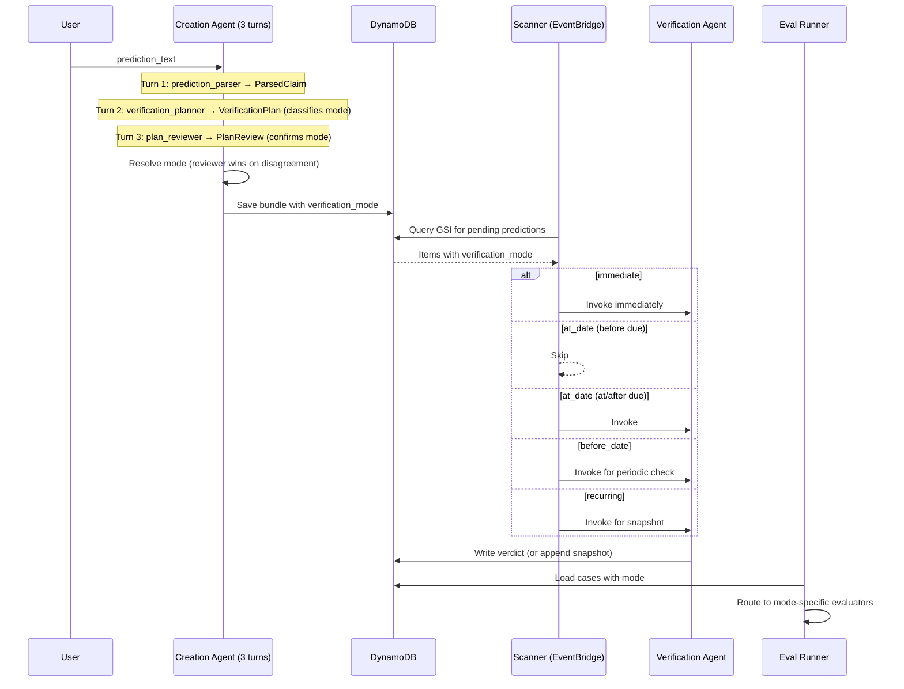

# Design Document: Verification Modes

## Overview

This design extends the CalledIt prediction verification platform to support four `verification_mode` types: `immediate` (existing), `at_date`, `before_date`, and `recurring`. The mode is classified during prediction creation (Turn 2: verification_planner), confirmed during review (Turn 3: plan_reviewer), persisted on the prediction bundle, and consumed by the Scanner and Verification Agent to apply mode-specific scheduling and verdict logic. New mode-aware evaluators are added to the eval framework. The existing `immediate` path is unchanged — all changes are additive.

### Mode Definitions

| Mode | Semantics | Example |
|------|-----------|---------|
| `immediate` | Verifiable right now, single check, answer is final | "Christmas 2026 falls on a Friday" |
| `at_date` | Only meaningful at a specific date; checking early gives wrong answer | "S&P 500 will close higher today than yesterday" |
| `before_date` | Can be confirmed early if event occurs; refuted only after deadline | "Python 3.14 will be released before December 2026" |
| `recurring` | Checked on schedule; each verdict is a snapshot, not final | "The US national debt exceeds $35 trillion" |

### Design Decisions Referenced

- **Decision 94**: Single Strands Agent, 3 sequential turns in one conversation context
- **Decision 98**: No fallbacks in dev, graceful fallback in production
- **Decision 106**: Minimal duplication over shared packages (verification agent has its own bundle_loader.py)
- **Decision 128/Update 32**: Always pin to numbered prompt versions, never DRAFT

### Change Summary

1. **Pydantic models** (`calleditv4/src/models.py`): Add `verification_mode` to `VerificationPlan` and `PlanReview`
2. **Bundle builder** (`calleditv4/src/bundle.py`): Accept and persist `verification_mode`
3. **Creation handler** (`calleditv4/src/main.py`): Resolve mode disagreement between planner and reviewer
4. **Prompts** (`infrastructure/prompt-management/template.yaml`): New numbered versions for verification_planner (v2), plan_reviewer (v3), verification_executor (v2)
5. **Verification agent** (`calleditv4-verification/src/main.py`): Include mode in user message via `_build_user_message()`
6. **Scanner** (`infrastructure/verification-scanner/scanner.py`): Mode-aware scheduling logic
7. **Bundle loader** (`calleditv4-verification/src/bundle_loader.py`): Snapshot append for recurring mode
8. **Evaluators** (`eval/evaluators/`): Three new evaluator modules + routing in eval runner
9. **Golden dataset** (`eval/golden_dataset.json`): Mode annotations + new test cases

## Architecture

The verification mode flows through the system as follows:



### Key Architectural Decisions

**Why the planner classifies mode (not the parser):** The planner (Turn 2) needs the mode to build mode-appropriate plan steps. The parser (Turn 1) only extracts the claim and resolves dates — it doesn't reason about verification timing semantics.

**Why the reviewer confirms mode:** The reviewer (Turn 3) sees the full plan and can catch misclassifications. On disagreement, the reviewer wins because it has more context (the complete plan + parsed claim). A warning is logged for observability.

**Why snapshots for recurring:** Recurring predictions don't have a "final" answer. Each check is a point-in-time snapshot. Overwriting would lose history. The `verification_snapshots` list preserves the full timeline.

## Components and Interfaces

### 1. Pydantic Models (`calleditv4/src/models.py`)

Add `verification_mode` field to both `VerificationPlan` and `PlanReview`:

```python
from typing import Literal

VERIFICATION_MODES = Literal["immediate", "at_date", "before_date", "recurring"]

class VerificationPlan(BaseModel):
    sources: List[str] = Field(...)
    criteria: List[str] = Field(...)
    steps: List[str] = Field(...)
    verification_mode: VERIFICATION_MODES = Field(
        default="immediate",
        description="Verification timing mode: immediate, at_date, before_date, or recurring"
    )
    recurring_interval: Optional[str] = Field(
        default=None,
        description="Minimum time between recurring checks: 'every_scan', 'daily', or 'weekly'. Only set when verification_mode is 'recurring'."
    )

class PlanReview(BaseModel):
    # ... existing fields ...
    verification_mode: VERIFICATION_MODES = Field(
        default="immediate",
        description="Reviewer's independent assessment of the correct verification mode"
    )
```

### 2. Bundle Builder (`calleditv4/src/bundle.py`)

Add `verification_mode` parameter to `build_bundle()`:

```python
def build_bundle(
    ...,
    verification_mode: str = "immediate",
) -> Dict[str, Any]:
    bundle = {
        ...,
        "verification_mode": verification_mode,
    }
    return bundle
```

Also add `verification_mode` to `format_ddb_update()` so clarification rounds persist the resolved mode.

### 3. Mode Resolution in Creation Handler (`calleditv4/src/main.py`)

After Turn 2 and Turn 3 complete, resolve the mode:

```python
def resolve_verification_mode(
    planner_mode: str, reviewer_mode: str, prediction_id: str
) -> str:
    """Resolve verification_mode between planner and reviewer.
    
    Reviewer wins on disagreement (has more context from full plan).
    """
    if planner_mode == reviewer_mode:
        return planner_mode
    logger.warning(
        f"Mode disagreement for {prediction_id}: "
        f"planner={planner_mode}, reviewer={reviewer_mode}. "
        f"Using reviewer's mode."
    )
    return reviewer_mode
```

The resolved mode is passed to `build_bundle()` and included in the `flow_complete` event.

### 4. Prompt Updates (`infrastructure/prompt-management/template.yaml`)

Three prompts get new numbered versions:

- **verification_planner v2**: Add mode classification instructions with definitions and examples for all four modes. Add `verification_mode` to the expected JSON output schema.
- **plan_reviewer v3**: Add instructions to independently assess `verification_mode` and flag disagreement. Add `verification_mode` to the expected JSON output schema.
- **verification_executor v2**: Add mode-specific verdict rules (at_date premature → inconclusive, before_date early confirm logic, recurring snapshot semantics).

After deploying, update `DEFAULT_PROMPT_VERSIONS` in `calleditv4/src/prompt_client.py`:
```python
DEFAULT_PROMPT_VERSIONS = {
    "prediction_parser": "2",
    "verification_planner": "2",  # was "1"
    "plan_reviewer": "3",         # was "2"
}
```

And add `verification_executor` to the verification agent's prompt client:
```python
DEFAULT_PROMPT_VERSIONS = {
    "verification_executor": "2",  # was "1"
}
```

### 5. Verification Agent User Message (`calleditv4-verification/src/main.py`)

Update `_build_user_message()` to include mode:

```python
def _build_user_message(bundle: dict) -> str:
    parsed_claim = bundle.get("parsed_claim", {})
    plan = bundle.get("verification_plan", {})
    verification_mode = bundle.get("verification_mode", "immediate")
    return (
        f"PREDICTION: {parsed_claim.get('statement', '')}\n"
        f"VERIFICATION DATE: {parsed_claim.get('verification_date', '')}\n"
        f"VERIFICATION MODE: {verification_mode}\n\n"
        f"VERIFICATION PLAN:\n"
        f"Sources: {json.dumps(plan.get('sources', []))}\n"
        f"Criteria: {json.dumps(plan.get('criteria', []))}\n"
        f"Steps: {json.dumps(plan.get('steps', []))}\n\n"
        f"Execute this verification plan now."
    )
```

### 6. Scanner Mode-Aware Scheduling (`infrastructure/verification-scanner/scanner.py`)

Replace the current "invoke everything" loop with mode-aware dispatch:

```python
RECURRING_INTERVAL_SECONDS = {
    "every_scan": 0,       # invoke every scan cycle (every 15 min)
    "daily": 86400,        # 24 hours
    "weekly": 604800,      # 7 days
}

def should_invoke(item: dict, now_iso: str) -> tuple[bool, str]:
    """Determine whether to invoke the verification agent for this item.
    
    Returns (should_invoke, reason).
    """
    mode = item.get("verification_mode", "immediate")
    verification_date = item.get("verification_date", "")
    
    if mode == "immediate":
        return True, "immediate mode"
    elif mode == "at_date":
        if now_iso >= verification_date:
            return True, "at_date: due"
        return False, "at_date: not yet due"
    elif mode == "before_date":
        return True, "before_date: periodic check"
    elif mode == "recurring":
        # Check recurring_interval — skip if last check is too recent
        interval = item.get("recurring_interval", "daily")
        min_seconds = RECURRING_INTERVAL_SECONDS.get(interval, 86400)
        snapshots = item.get("verification_snapshots", [])
        if snapshots and min_seconds > 0:
            last_checked = snapshots[-1].get("checked_at", "")
            if last_checked and _seconds_since(last_checked, now_iso) < min_seconds:
                return False, f"recurring: last check too recent ({interval})"
        return True, "recurring: snapshot check"
    else:
        logger.warning(f"Unknown verification_mode: {mode}, treating as immediate")
        return True, f"unknown mode {mode}, defaulting to immediate"
```

For `recurring` and `before_date` (inconclusive) results, the scanner must handle post-invocation status differently:

```python
def handle_verification_result(
    table, prediction_id: str, response: dict, mode: str, now_iso: str
) -> None:
    """Handle verification result based on mode."""
    if mode == "recurring":
        # Append snapshot, keep status=pending
        append_verification_snapshot(table, prediction_id, response, now_iso)
    elif mode == "before_date" and response.get("verdict") == "inconclusive":
        # Leave as pending for next scan cycle
        pass
    else:
        # Default: verification agent already updated status via bundle_loader
        pass
```

### 7. Snapshot Storage (`calleditv4-verification/src/bundle_loader.py`)

New function for recurring mode:

```python
DEFAULT_MAX_SNAPSHOTS = 30

def append_verification_snapshot(
    table, prediction_id: str, result, checked_at: str,
    max_snapshots: int = DEFAULT_MAX_SNAPSHOTS,
) -> bool:
    """Append a verification snapshot for recurring predictions.
    
    Prunes oldest snapshots if max_snapshots is exceeded.
    Does NOT change status from pending.
    """
    snapshot = {
        "verdict": result.verdict,
        "confidence": _convert_floats_to_decimal(result.confidence),
        "evidence": _convert_floats_to_decimal(
            [e.model_dump() for e in result.evidence]
        ),
        "reasoning": result.reasoning,
        "checked_at": checked_at,
    }
    try:
        # Append snapshot
        table.update_item(
            Key={"PK": f"PRED#{prediction_id}", "SK": "BUNDLE"},
            UpdateExpression=(
                "SET verification_snapshots = list_append("
                "if_not_exists(verification_snapshots, :empty), :snap)"
            ),
            ExpressionAttributeValues={
                ":snap": [snapshot],
                ":empty": [],
            },
        )
        # Prune if over limit — read current list, trim, write back
        resp = table.get_item(
            Key={"PK": f"PRED#{prediction_id}", "SK": "BUNDLE"},
            ProjectionExpression="verification_snapshots",
        )
        snapshots = resp.get("Item", {}).get("verification_snapshots", [])
        if len(snapshots) > max_snapshots:
            trimmed = snapshots[-max_snapshots:]
            table.update_item(
                Key={"PK": f"PRED#{prediction_id}", "SK": "BUNDLE"},
                UpdateExpression="SET verification_snapshots = :trimmed",
                ExpressionAttributeValues={":trimmed": trimmed},
            )
        return True
    except Exception as e:
        logger.error(f"Snapshot append failed for {prediction_id}: {e}")
        return False
```

### 8. New Evaluators (`eval/evaluators/`)

Three new evaluator modules following the existing pattern:

**`verification_at_date_verdict_accuracy.py`**: Scores `inconclusive` as correct (1.0) when simulated time is before `verification_date`. Otherwise falls through to standard verdict accuracy logic.

**`verification_before_date_verdict_appropriateness.py`**: Before deadline: `confirmed` and `inconclusive` both score 1.0, `refuted` scores 0.0. At/after deadline: standard verdict accuracy against ground truth.

**`verification_recurring_evidence_freshness.py`**: Checks that evidence timestamps/source dates are from the current check period, not stale from a previous check. LLM-judge evaluator (Tier 2).

### 9. Eval Runner Mode Routing (`eval/verification_eval.py`)

Update `build_evaluator_list()` to accept `verification_mode`:

```python
def build_evaluator_list(args, verification_mode: str = "immediate") -> dict:
    tier1 = { ... }  # existing 5 evaluators
    
    if verification_mode == "immediate":
        # Existing behavior unchanged
        ...
    elif verification_mode == "at_date":
        evaluators["verdict_accuracy"] = verification_at_date_verdict_accuracy
        ...
    elif verification_mode == "before_date":
        evaluators["verdict_appropriateness"] = verification_before_date_verdict_appropriateness
        ...
    elif verification_mode == "recurring":
        evaluators["evidence_freshness"] = verification_recurring_evidence_freshness
        ...
    return evaluators
```

Add `verification_mode` to each per-case result and compute per-mode aggregates in the report.

## Data Models

### Prediction Bundle (DynamoDB Item)

New/modified fields on the existing bundle schema:

```json
{
  "PK": "PRED#pred-abc123",
  "SK": "BUNDLE",
  "verification_mode": "recurring",
  "recurring_interval": "daily",
  "max_snapshots": 30,
  "verification_plan": {
    "sources": ["..."],
    "criteria": ["..."],
    "steps": ["..."],
    "verification_mode": "recurring",
    "recurring_interval": "daily"
  },
  "verification_snapshots": [
    {
      "verdict": "confirmed",
      "confidence": 0.9,
      "evidence": [],
      "reasoning": "Condition holds as of this check",
      "checked_at": "2026-06-15T12:00:00Z"
    }
  ]
}
```

- `verification_mode` (top-level): The resolved mode (reviewer wins on disagreement). Used by Scanner and Verification Agent.
- `verification_plan.verification_mode`: The planner's classification. Preserved for observability.
- `recurring_interval` (top-level): Minimum time between recurring checks. One of `"every_scan"` (every 15 min), `"daily"`, or `"weekly"`. Default: `"daily"`. Only meaningful for `recurring` mode. Set by the verification_planner based on how frequently the condition is likely to change.
- `max_snapshots` (top-level): Maximum number of snapshots to retain. Default: 30. Oldest snapshots are pruned when the limit is exceeded.
- `verification_snapshots`: List of timestamped snapshots. Only populated for `recurring` mode. Each snapshot contains the full verdict payload plus `checked_at`.

### VerificationMode Enum Values

| Value | Type | DDB Representation |
|-------|------|--------------------|
| `immediate` | String | `"immediate"` |
| `at_date` | String | `"at_date"` |
| `before_date` | String | `"before_date"` |
| `recurring` | String | `"recurring"` |

### Golden Dataset Schema Extension

Each `base_predictions` entry gains a `verification_mode` field:

```json
{
  "id": "base-001",
  "prediction_text": "...",
  "verification_readiness": "immediate",
  "verification_mode": "immediate",
  ...
}
```

The `metadata` section gains `expected_mode_counts`:

```json
{
  "metadata": {
    "expected_base_count": 54,
    "expected_fuzzy_count": 23,
    "expected_smoke_test_count": 12,
    "expected_mode_counts": {
      "immediate": 45,
      "at_date": 3,
      "before_date": 3,
      "recurring": 3
    }
  }
}
```

### Eval Report Schema Extension

Per-case results include `verification_mode`:

```json
{
  "id": "base-001",
  "verification_mode": "immediate",
  "scores": { ... }
}
```

Aggregates include per-mode breakdowns:

```json
{
  "aggregate_scores": {
    "schema_validity": 1.0,
    "by_mode": {
      "immediate": { "schema_validity": 1.0, "verdict_accuracy": 0.85 },
      "at_date": { "verdict_accuracy": 1.0 },
      "before_date": { "verdict_appropriateness": 0.67 },
      "recurring": { "evidence_freshness": 0.8 }
    }
  }
}
```

## Correctness Properties

*A property is a characteristic or behavior that should hold true across all valid executions of a system — essentially, a formal statement about what the system should do. Properties serve as the bridge between human-readable specifications and machine-verifiable correctness guarantees.*

### Property 1: Verification mode Pydantic validation

*For any* string value, constructing a `VerificationPlan` or `PlanReview` with that string as `verification_mode` should succeed if and only if the string is one of `"immediate"`, `"at_date"`, `"before_date"`, or `"recurring"`. Invalid strings must raise a `ValidationError`.

**Validates: Requirements 1.1, 1.4, 1.5**

### Property 2: Bundle builder preserves verification mode

*For any* valid verification mode string and any valid bundle inputs, calling `build_bundle()` with that mode should produce a bundle dict where `bundle["verification_mode"]` equals the input mode. When no mode is provided, the bundle should default to `"immediate"`.

**Validates: Requirements 1.2, 1.3**

### Property 3: Mode resolution — reviewer wins on disagreement

*For any* two verification mode values (planner_mode, reviewer_mode), `resolve_verification_mode(planner_mode, reviewer_mode)` should return `reviewer_mode` when they disagree, and the agreed value when they agree. The return value is always one of the four valid modes.

**Validates: Requirements 2a.2, 2a.3, 2a.4**

### Property 4: Verification agent user message includes mode

*For any* prediction bundle containing a `verification_mode` value, `_build_user_message(bundle)` should produce a string that contains the substring `"VERIFICATION MODE: {mode}"` where `{mode}` is the bundle's `verification_mode` value.

**Validates: Requirements 3.1**

### Property 5: Scanner scheduling correctness

*For any* prediction item with a valid `verification_mode` and any current timestamp:
- `immediate` → always invoke
- `at_date` with now < verification_date → skip; now >= verification_date → invoke
- `before_date` → always invoke
- `recurring` with no snapshots → invoke
- `recurring` with last snapshot older than `recurring_interval` → invoke
- `recurring` with last snapshot newer than `recurring_interval` → skip

**Validates: Requirements 4.1, 4.2, 4.3, 4.4, 4.7, 5.5**

### Property 6: Recurring snapshot append invariants

*For any* recurring prediction bundle and any `VerificationResult`, appending a snapshot should: (a) increase the `verification_snapshots` list length by exactly 1 (before pruning), (b) produce a snapshot containing all required fields (`verdict`, `confidence`, `evidence`, `reasoning`, `checked_at`), (c) leave the bundle `status` as `"pending"`, and (d) after pruning, the list length should not exceed `max_snapshots`.

**Validates: Requirements 5.1, 5.2, 5.3, 5.6, 5.7**

### Property 7: Golden dataset mode annotations

*For any* entry in the golden dataset's `base_predictions` array, the `verification_mode` field must exist and be one of the four valid values. Additionally, *for any* entry where `verification_readiness` equals `"immediate"`, `verification_mode` must also equal `"immediate"`.

**Validates: Requirements 6.1, 6.2**

### Property 8: Evaluator routing by mode

*For any* valid `verification_mode` value, `build_evaluator_list(mode)` should return a dict of evaluator modules. For `"immediate"`, the set must match the existing 7 evaluators exactly. For `"at_date"`, it must include `at_date_verdict_accuracy`. For `"before_date"`, it must include `before_date_verdict_appropriateness`. For `"recurring"`, it must include `recurring_evidence_freshness`.

**Validates: Requirements 7.1, 7.2, 8.1, 8.3**

### Property 9: at_date evaluator scoring

*For any* verification result and any time relationship to `verification_date`: when simulated time is before `verification_date`, the `at_date_verdict_accuracy` evaluator should score `"inconclusive"` as 1.0 and any other verdict as 0.0. When simulated time is at or after `verification_date`, it should score by exact match against the expected verdict (1.0 for match, 0.0 for mismatch).

**Validates: Requirements 7.3, 7.4**

### Property 10: before_date evaluator scoring

*For any* verification result and any time relationship to `verification_date`: when simulated time is before `verification_date`, the `before_date_verdict_appropriateness` evaluator should score `"confirmed"` and `"inconclusive"` as 1.0, and `"refuted"` as 0.0. When simulated time is at or after `verification_date`, it should score by exact match against the expected verdict.

**Validates: Requirements 7.5, 7.6**

### Property 11: Eval report includes mode metadata

*For any* eval report produced by the runner, each per-case result must include a `verification_mode` field, and the `aggregate_scores` section must include a `by_mode` object with score breakdowns for each mode present in the results.

**Validates: Requirements 8.4, 8.5**

## Error Handling

### Mode Resolution Errors

- **Unknown mode from LLM**: The Pydantic `Literal` constraint on `VerificationPlan.verification_mode` and `PlanReview.verification_mode` will raise `ValidationError` if the LLM returns an invalid mode string. The Strands structured output mechanism handles this by re-prompting. If it still fails, the creation flow raises an exception and yields an error event to the frontend.
- **Disagreement logging**: When planner and reviewer disagree on mode, a warning is logged with both values. This is informational, not an error — the reviewer's mode is used.

### Scanner Errors

- **Missing verification_mode on bundle**: The scanner defaults to `"immediate"` if `verification_mode` is absent (backward compatibility with pre-feature bundles). A warning is logged.
- **Unknown mode value**: Treated as `"immediate"` with a warning log. This handles data corruption or future mode values gracefully.
- **Snapshot append failure**: If `append_verification_snapshot` fails for a recurring prediction, the error is logged but the scanner continues processing other predictions. The prediction remains `pending` and will be retried on the next scan cycle.

### Verification Agent Errors

- **Mode not in bundle**: `_build_user_message()` defaults to `"immediate"` via `.get("verification_mode", "immediate")`. The agent proceeds with immediate-mode behavior.
- **Premature verification (at_date)**: The prompt instructs the agent to return `inconclusive` with reasoning. If the agent ignores this, the evaluator will catch it (score 0.0 for non-inconclusive verdicts before the date).

### Eval Errors

- **Missing verification_mode in golden dataset case**: The eval runner defaults to `"immediate"` (Requirement 8.2). Existing cases without the field continue to work.
- **New evaluator module import failure**: The eval runner catches `ImportError` and falls back to the immediate evaluator set with a warning.

## Testing Strategy

### Dual Testing Approach

This feature uses both unit tests and property-based tests:

- **Property-based tests** (Hypothesis): Verify universal properties across randomly generated inputs. Each property test runs a minimum of 100 iterations and references a specific design property.
- **Unit tests** (pytest): Verify specific examples, edge cases, integration points, and error conditions.

### Property-Based Testing Configuration

- **Library**: [Hypothesis](https://hypothesis.readthedocs.io/) (already in use — see `.hypothesis/` directory)
- **Minimum iterations**: 100 per property test (Hypothesis default is 100, configurable via `@settings(max_examples=100)`)
- **Tag format**: Each test includes a comment: `# Feature: verification-modes, Property N: {property_text}`

### Test Plan

**Property Tests** (one test per correctness property):

| Property | Test Location | What It Generates |
|----------|--------------|-------------------|
| P1: Pydantic validation | `calleditv4/tests/test_models.py` | Random strings, valid/invalid mode values |
| P2: Bundle builder | `calleditv4/tests/test_bundle.py` | Random valid modes + bundle inputs |
| P3: Mode resolution | `calleditv4/tests/test_main.py` | Random pairs of mode values |
| P4: User message includes mode | `calleditv4-verification/tests/test_main.py` | Random bundles with mode values |
| P5: Scanner scheduling | `infrastructure/verification-scanner/tests/test_scanner.py` | Random items × random timestamps |
| P6: Snapshot append | `calleditv4-verification/tests/test_bundle_loader.py` | Random VerificationResults × recurring bundles |
| P7: Golden dataset annotations | `eval/tests/test_golden_dataset.py` | Iterate all entries (exhaustive, not random) |
| P8: Evaluator routing | `eval/tests/test_verification_eval.py` | All four mode values |
| P9: at_date evaluator | `eval/tests/test_evaluators.py` | Random verdicts × random time relationships |
| P10: before_date evaluator | `eval/tests/test_evaluators.py` | Random verdicts × random time relationships |
| P11: Eval report metadata | `eval/tests/test_verification_eval.py` | Random multi-mode result sets |

**Unit Tests** (specific examples and edge cases):

- Mode resolution with identical modes (all 4 values)
- Mode resolution with all 12 disagreement pairs
- Scanner skip behavior for at_date with time 1 second before verification_date
- Scanner invoke behavior for at_date with time exactly at verification_date
- before_date confirmed → status transitions to verified
- before_date inconclusive before deadline → status stays pending
- Snapshot append to empty list vs. existing list
- Snapshot pruning when list exceeds max_snapshots (30 default)
- Scanner skips recurring prediction when last snapshot is within recurring_interval
- Scanner invokes recurring prediction when last snapshot is older than recurring_interval
- Scanner invokes recurring prediction with no snapshots (first check)
- recurring_interval values: every_scan (0s), daily (86400s), weekly (604800s)
- Golden dataset has ≥3 cases per non-immediate mode (Req 6.3-6.5)
- Golden dataset metadata has expected_mode_counts (Req 6.6)
- Eval runner defaults missing verification_mode to immediate (Req 8.2)
- Existing immediate evaluator set is unchanged (Req 7.8)
- `_build_user_message` with missing verification_mode key defaults gracefully
