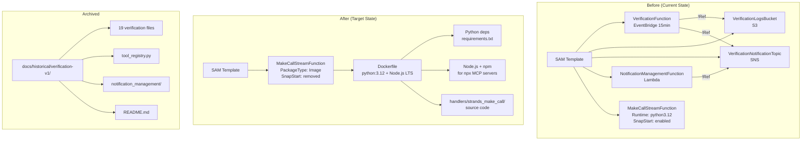

# Design Document: Verification Teardown & Docker Lambda

## Overview

This design covers pure infrastructure changes to the CalledIt prediction pipeline: removing the old verification system resources from the SAM template, archiving the old handler code, and switching MakeCallStreamFunction from a zip-based `python3.12` runtime to a Docker-based Lambda image containing both Python 3.12 and Node.js. No application logic changes — the prediction pipeline (Parser → Categorizer → VB → Review) must produce identical results after deployment.

The old verification system was a primitive attempt at automated prediction verification: an EventBridge rule triggered a Lambda every 15 minutes to scan DynamoDB for pending predictions. It used a DDB tool registry (`TOOL#{tool_id}` records) with only `web_search` registered. The system never worked well and is being replaced by MCP-based tool discovery (Spec A2). The Docker Lambda is needed because MCP servers are npm packages invoked via `npx`, which requires Node.js — not available in the standard Lambda Python runtime.

### Key Design Decisions

1. **Remove 4 SAM resources** — VerificationFunction, VerificationLogsBucket, VerificationNotificationTopic, NotificationManagementFunction (depends on removed SNS topic). All `!Ref`/`!GetAtt` chains to these resources are also removed.
2. **Archive, don't delete** — All old verification code goes to `docs/historical/verification-v1/` with a README explaining what it was and why it was replaced.
3. **Docker image = `public.ecr.aws/lambda/python:3.12` + Node.js LTS** — Install Node.js via `curl`+`tar` in the Dockerfile. This is the standard approach for multi-runtime Lambda containers.
4. **SAM `Metadata` for Docker builds** — SAM CLI builds the Docker image automatically during `sam build` when `PackageType: Image` + `Metadata.Dockerfile` are specified.
5. **SnapStart limitation** — AWS Lambda SnapStart for Python is supported for zip packages only. Container image Lambdas do not support SnapStart. The design removes the SnapStart configuration from MakeCallStreamFunction and documents this as a comment. Cold starts will be slower but functional.
6. **tool_registry.py removal** — The `prediction_graph.py` try/except block that imports from `tool_registry` will fail silently (already has fallback to empty manifest). The file is archived. Spec A2 will replace it with `mcp_manager.py`.

### SnapStart + Docker Research

AWS Lambda SnapStart for Python (GA since late 2024) works by caching the Lambda INIT phase. However, SnapStart is only supported for **zip-packaged** Lambda functions. Container image (`PackageType: Image`) Lambdas do **not** support SnapStart — the `SnapStart` property is ignored or causes a deployment error depending on the SAM CLI version.

**Impact**: The MakeCallStreamFunction currently benefits from SnapStart for caching the `prediction_graph` singleton (agent creation + graph compilation). Without SnapStart, every cold start will re-run INIT (~2-5s for agent creation). This is acceptable because:
- Provisioned concurrency can mitigate cold starts if needed (separate concern)
- The 300s timeout provides ample headroom
- MCP server subprocess startup (Spec A2) would invalidate the SnapStart snapshot anyway

**Decision**: Remove `SnapStart` and `AutoPublishAlias: live` from MakeCallStreamFunction when switching to Docker. The `:live` alias and alias-based permissions/integrations must be updated to use `$LATEST` or a new deployment strategy. However, since other functions (ConnectFunction, DisconnectFunction, etc.) still use SnapStart + aliases, only MakeCallStreamFunction changes.

### Integration URI Impact

The current `MakeCallStreamIntegration` uses `${MakeCallStreamFunction.Arn}:live` in its IntegrationUri. Removing `AutoPublishAlias: live` means the `:live` alias no longer exists. The integration must switch to the unqualified function ARN. The `MakeCallStreamFunctionAliasPermission` (which grants API Gateway permission to invoke `:live`) must also be removed, since the unqualified `MakeCallStreamFunctionPermission` already covers `$LATEST`.

## Architecture



### Data Flow (unchanged)

The prediction pipeline data flow is identical before and after:

1. WebSocket `makecall` message → API Gateway → MakeCallStreamFunction
2. Lambda handler → `prediction_graph` singleton → Parser → Categorizer → VB → Review
3. Results sent back via WebSocket `prediction_ready` and `review_ready` messages

The only change is the Lambda runtime environment (zip → Docker image). All handler code, agent prompts, and graph topology remain unchanged.

## Components and Interfaces

### Component 1: SAM Template Resource Removal

**File**: `backend/calledit-backend/template.yaml`

**Resources to remove** (4 resources + their sub-resources):

| Resource | Type | Why Remove |
|---|---|---|
| `VerificationFunction` | `AWS::Serverless::Function` | Old verification system, replaced by MCP (Spec A2) |
| `VerificationLogsBucket` | `AWS::S3::Bucket` | Only used by VerificationFunction |
| `VerificationNotificationTopic` | `AWS::SNS::Topic` | Only used by VerificationFunction and NotificationManagementFunction |
| `NotificationManagementFunction` | `AWS::Serverless::Function` | Depends on VerificationNotificationTopic via `!Ref` and `!GetAtt` |

**Outputs to remove** (3 entries):

| Output | References |
|---|---|
| `VerificationFunctionArn` | `!GetAtt VerificationFunction.Arn` |
| `VerificationLogsBucket` | `!Ref VerificationLogsBucket` |
| `VerificationNotificationTopic` | `!Ref VerificationNotificationTopic` |

**Reference chain analysis**:

The removed resources are referenced ONLY by each other and by the Outputs section. No other resource in the template references them:
- `VerificationFunction` references `VerificationLogsBucket` (via `!Ref`) and `VerificationNotificationTopic` (via `!Ref` and `!GetAtt`)
- `NotificationManagementFunction` references `VerificationNotificationTopic` (via `!Ref` and `!GetAtt`)
- No `DependsOn` chains from retained resources to removed resources

**Resources retained unchanged**: CallitAPI, LogCall, ListPredictions, AuthTokenFunction, CognitoUserPool, UserPoolClient, UserPoolDomain, WebSocketApi, all WebSocket routes/integrations, ConnectFunction, DisconnectFunction, EvalReasoningTable, and all associated permissions.

### Component 2: MakeCallStreamFunction Docker Switch

**File**: `backend/calledit-backend/template.yaml`

**Before** (zip-based):
```yaml
MakeCallStreamFunction:
  Type: AWS::Serverless::Function
  Properties:
    CodeUri: handlers/strands_make_call/
    Handler: strands_make_call_graph.lambda_handler
    Runtime: python3.12
    Timeout: 300
    MemorySize: 512
    AutoPublishAlias: live
    SnapStart:
      ApplyOn: PublishedVersions
    Environment:
      Variables:
        PROMPT_VERSION_PARSER: "1"
        PROMPT_VERSION_CATEGORIZER: "2"
        PROMPT_VERSION_VB: "2"
        PROMPT_VERSION_REVIEW: "3"
    Policies: [...]
```

**After** (Docker-based):
```yaml
MakeCallStreamFunction:
  Type: AWS::Serverless::Function
  Properties:
    PackageType: Image
    # SnapStart is not supported for container image Lambdas.
    # Cold starts will be slower (~2-5s for agent creation) but functional.
    # Provisioned concurrency can mitigate if needed (separate concern).
    Timeout: 300
    MemorySize: 512
    Environment:
      Variables:
        PROMPT_VERSION_PARSER: "1"
        PROMPT_VERSION_CATEGORIZER: "2"
        PROMPT_VERSION_VB: "2"
        PROMPT_VERSION_REVIEW: "3"
    Policies: [...]
  Metadata:
    DockerTag: python3.12-nodejs-v1
    DockerContext: .
    Dockerfile: Dockerfile
```

**Key changes**:
- Remove `CodeUri`, `Handler`, `Runtime` — replaced by `PackageType: Image`
- Remove `AutoPublishAlias: live` — no alias needed without SnapStart
- Remove `SnapStart` — not supported for container images
- Add `Metadata` section with `DockerTag`, `DockerContext`, `Dockerfile`
- `DockerContext: .` means the build context is `backend/calledit-backend/` (where SAM runs from)

**Integration URI change**:
```yaml
# Before: alias-based invocation
MakeCallStreamIntegration:
  DependsOn: MakeCallStreamFunctionAliaslive
  Properties:
    IntegrationUri: !Sub arn:aws:apigateway:${AWS::Region}:lambda:path/2015-03-31/functions/${MakeCallStreamFunction.Arn}:live/invocations

# After: unqualified function invocation
MakeCallStreamIntegration:
  Properties:
    IntegrationUri: !Sub arn:aws:apigateway:${AWS::Region}:lambda:path/2015-03-31/functions/${MakeCallStreamFunction.Arn}/invocations
```

**Permission changes**:
- Remove `MakeCallStreamFunctionAliasPermission` (no `:live` alias to invoke)
- Keep `MakeCallStreamFunctionPermission` (covers unqualified function)

### Component 3: Dockerfile

**File**: `backend/calledit-backend/Dockerfile`

```dockerfile
# Base image: AWS Lambda Python 3.12
FROM public.ecr.aws/lambda/python:3.12

# Install Node.js LTS (v20.x) for npx MCP server execution
# Using the official Node.js binary distribution
RUN curl -fsSL https://nodejs.org/dist/v20.18.1/node-v20.18.1-linux-x64.tar.xz \
    | tar -xJ -C /usr/local --strip-components=1 \
    && node --version && npm --version

# Install Python dependencies
COPY handlers/strands_make_call/requirements.txt ${LAMBDA_TASK_ROOT}/requirements.txt
RUN pip install --no-cache-dir -r ${LAMBDA_TASK_ROOT}/requirements.txt

# Copy handler source code
COPY handlers/strands_make_call/ ${LAMBDA_TASK_ROOT}/

# Set the Lambda handler
CMD ["strands_make_call_graph.lambda_handler"]
```

**Design rationale**:
- `public.ecr.aws/lambda/python:3.12` is the official AWS Lambda base image with the Lambda Runtime Interface Client (RIC) pre-installed
- Node.js is installed via pre-built binary tarball (not `apt-get` — the Lambda base image is Amazon Linux 2023, not Debian)
- `LAMBDA_TASK_ROOT` is `/var/task` in the Lambda base image
- `CMD` sets the handler entry point — same as the current `Handler: strands_make_call_graph.lambda_handler`
- The `DockerContext` in SAM Metadata is `.` (the `backend/calledit-backend/` directory), so `COPY handlers/strands_make_call/` works correctly

### Component 4: Code Archive

**Target directory**: `docs/historical/verification-v1/`

**Files to archive**:

| Source | Destination |
|---|---|
| `handlers/verification/` (19 files) | `docs/historical/verification-v1/` |
| `handlers/notification_management/` (2 files) | `docs/historical/verification-v1/notification_management/` |
| `handlers/strands_make_call/tool_registry.py` | `docs/historical/verification-v1/tool_registry.py` |
| (new) | `docs/historical/verification-v1/README.md` |

**Archive README content** (summary):
- What the old verification system did (EventBridge-triggered DDB scan + Strands agent verification)
- List of all archived files with brief descriptions
- Why it was replaced (never worked well, MCP-based tool discovery is superior)
- What replaced it (MCP Manager in Spec A2, MCP tool discovery)
- References to Decision 18 (3 verifiability categories), Decision 19 (DDB tool registry), Decision 20 (web search as first tool), Backlog item 7 (verification pipeline via MCP tools)

**Post-archive cleanup**:
- `handlers/verification/` directory removed from source tree
- `handlers/notification_management/` directory removed from source tree
- `handlers/strands_make_call/tool_registry.py` removed from source tree

### Component 5: prediction_graph.py Cleanup

The existing `prediction_graph.py` has a try/except block that imports from `tool_registry`:

```python
try:
    from tool_registry import read_active_tools, build_tool_manifest
    tools = read_active_tools()
    tool_manifest = build_tool_manifest(tools)
except Exception as e:
    logger.error(f"Failed to read tool registry, falling back to pure reasoning: {e}")
    tool_manifest = ""
```

After `tool_registry.py` is archived and removed, this import will fail and the except branch will execute, setting `tool_manifest = ""`. This is the correct behavior — the categorizer falls back to pure reasoning mode with an empty manifest.

**No code change needed** in `prediction_graph.py` for this spec. The existing fallback handles the missing module gracefully. Spec A2 will replace this block with `mcp_manager` imports.

## Data Models

### SAM Template Resource Inventory (After)

Resources retained in the template after removal:

| Resource | Type | Changed? |
|---|---|---|
| CallitAPI | AWS::Serverless::Api | No |
| LogCall | AWS::Serverless::Function | No |
| ListPredictions | AWS::Serverless::Function | No |
| AuthTokenFunction | AWS::Serverless::Function | No |
| CognitoUserPool | AWS::Cognito::UserPool | No |
| UserPoolClient | AWS::Cognito::UserPoolClient | No |
| UserPoolDomain | AWS::Cognito::UserPoolDomain | No |
| WebSocketApi | AWS::ApiGatewayV2::Api | No |
| ConnectRoute | AWS::ApiGatewayV2::Route | No |
| DisconnectRoute | AWS::ApiGatewayV2::Route | No |
| MakeCallStreamRoute | AWS::ApiGatewayV2::Route | No |
| ClarifyRoute | AWS::ApiGatewayV2::Route | No |
| ConnectIntegration | AWS::ApiGatewayV2::Integration | No |
| DisconnectIntegration | AWS::ApiGatewayV2::Integration | No |
| MakeCallStreamIntegration | AWS::ApiGatewayV2::Integration | Yes — remove `DependsOn`, update IntegrationUri |
| WebSocketDeployment | AWS::ApiGatewayV2::Deployment | No |
| WebSocketStage | AWS::ApiGatewayV2::Stage | No |
| ConnectFunction | AWS::Serverless::Function | No |
| DisconnectFunction | AWS::Serverless::Function | No |
| MakeCallStreamFunction | AWS::Serverless::Function | Yes — Docker switch |
| ConnectFunctionPermission | AWS::Lambda::Permission | No |
| DisconnectFunctionPermission | AWS::Lambda::Permission | No |
| ConnectFunctionAliasPermission | AWS::Lambda::Permission | No |
| DisconnectFunctionAliasPermission | AWS::Lambda::Permission | No |
| MakeCallStreamFunctionPermission | AWS::Lambda::Permission | No |
| MakeCallStreamFunctionAliasPermission | AWS::Lambda::Permission | Removed — no alias |
| EvalReasoningTable | AWS::DynamoDB::Table | No |

### Dockerfile Layer Structure

```
Layer 1: public.ecr.aws/lambda/python:3.12 (base)
Layer 2: Node.js v20.x LTS binary install (~30MB)
Layer 3: Python dependencies from requirements.txt (~50MB)
Layer 4: Handler source code (~50KB)
```

### Archive Directory Structure

```
docs/historical/verification-v1/
├── README.md
├── app.py
├── verification_agent.py
├── verify_predictions.py
├── ddb_scanner.py
├── status_updater.py
├── s3_logger.py
├── email_notifier.py
├── verification_result.py
├── web_search_tool.py
├── seed_web_search_tool.py
├── error_handling.py
├── cleanup_predictions.py
├── inspect_data.py
├── mock_strands.py
├── modernize_data.py
├── recategorize.py
├── test_scanner.py
├── test_verification_result.py
├── requirements.txt
├── tool_registry.py
└── notification_management/
    ├── app.py
    └── snapstart_hooks.py
```


## Correctness Properties

*A property is a characteristic or behavior that should hold true across all valid executions of a system — essentially, a formal statement about what the system should do. Properties serve as the bridge between human-readable specifications and machine-verifiable correctness guarantees.*

Most acceptance criteria in this spec are specific example checks (does resource X exist? does file Y exist at path Z?). These are best covered by unit tests. Two criteria generalize into properties:

### Property 1: SAM template reference consistency

*For any* `!Ref` or `!GetAtt` target string found anywhere in the SAM template (resource properties, outputs, sub-expressions), the referenced logical resource name must exist in the template's `Resources` section. No dangling references to removed resources.

**Validates: Requirements 1.6**

### Property 2: Pipeline code has no import dependencies on removed modules

*For any* Python source file in `handlers/strands_make_call/`, all import statements must resolve to modules that exist within the handler directory or are installable from `requirements.txt`. No imports reference `verification`, `notification_management`, or `tool_registry` as hard dependencies (the existing try/except for `tool_registry` is a soft dependency with fallback, which is acceptable).

**Validates: Requirements 5.4**

## Error Handling

### SAM Deployment Errors

| Failure Mode | Handling |
|---|---|
| Dangling `!Ref` to removed resource | `sam deploy` fails with clear error. Property 1 catches this pre-deployment via YAML parsing. |
| Docker build fails during `sam build` | SAM CLI reports Dockerfile errors. Fix Dockerfile and re-run. |
| SnapStart config on container image | SAM CLI may ignore or error. Design removes SnapStart proactively. |
| Missing Node.js binary URL | Dockerfile `curl` fails. Pin to a specific Node.js LTS version URL. |

### Runtime Errors

| Failure Mode | Handling |
|---|---|
| `tool_registry` import fails | Existing try/except in `prediction_graph.py` catches `ImportError`, falls back to empty manifest. No user impact. |
| Cold start slower without SnapStart | Functional but ~2-5s slower. Provisioned concurrency can mitigate (separate concern). |
| Docker image too large for Lambda | Lambda container image limit is 10GB. Our image is ~300MB. No risk. |

### Archive Errors

| Failure Mode | Handling |
|---|---|
| Target archive directory already exists | Files are overwritten. Idempotent operation. |
| Source files already deleted | Skip missing files, log warning. |

## Testing Strategy

### Dual Testing Approach

This spec is primarily infrastructure changes (YAML edits, file moves, Dockerfile creation). Testing focuses on:

- **Unit tests**: Verify specific resource removal, file existence, Dockerfile content, SAM configuration
- **Property tests**: Verify universal reference consistency across the entire SAM template

### Property-Based Testing Configuration

- **Library**: [Hypothesis](https://hypothesis.readthedocs.io/) (already in project dev dependencies)
- **Minimum iterations**: 100 per property test
- **Tag format**: `Feature: verification-teardown-docker, Property {number}: {property_text}`

| Property | Test Strategy | Approach |
|---|---|---|
| P1: SAM reference consistency | Parse template YAML, extract all `!Ref`/`!GetAtt` targets, verify each exists in Resources | Deterministic on the actual template file. Can be parameterized with Hypothesis by generating random resource removal sets and verifying consistency holds. |
| P2: No hard import dependencies | Scan all `.py` files in `handlers/strands_make_call/`, extract import statements, verify none hard-depend on removed modules | AST-based import extraction. Parameterize with Hypothesis by generating random module names to verify the scanner works correctly. |

### Unit Test Coverage

Key unit tests (specific examples and edge cases):

1. **Removed resources** — VerificationFunction, VerificationLogsBucket, VerificationNotificationTopic, NotificationManagementFunction not in template Resources
2. **Removed outputs** — VerificationFunctionArn, VerificationLogsBucket, VerificationNotificationTopic not in template Outputs
3. **Retained resources** — All 20+ non-verification resources still present
4. **MakeCallStreamFunction config** — Has `PackageType: Image`, no `Runtime`/`Handler`/`CodeUri`, no `SnapStart`, no `AutoPublishAlias`
5. **MakeCallStreamFunction retained config** — `Timeout: 300`, `MemorySize: 512`, all 4 `PROMPT_VERSION_*` env vars, all IAM policies
6. **Metadata section** — `DockerTag`, `DockerContext`, `Dockerfile` present
7. **Integration URI** — MakeCallStreamIntegration uses unqualified function ARN (no `:live` suffix)
8. **Alias permission removed** — MakeCallStreamFunctionAliasPermission not in template
9. **Dockerfile exists** — `backend/calledit-backend/Dockerfile` exists with expected content
10. **Dockerfile content** — Base image is `public.ecr.aws/lambda/python:3.12`, Node.js install present, CMD is correct
11. **Archive complete** — All 19 verification files + tool_registry.py + notification_management/ + README.md in archive
12. **Source cleaned** — `handlers/verification/` and `handlers/notification_management/` directories don't exist, `tool_registry.py` doesn't exist in strands_make_call
13. **Archive README** — References Decision 18, 19, 20 and Backlog item 7
14. **SnapStart comment** — Template contains comment explaining SnapStart limitation for container images

### Test File Location

Tests go in `tests/strands_make_call/` following the existing test structure. New test file: `test_verification_teardown_docker.py`.

### Integration Testing (Manual)

These require actual deployment and cannot be automated as unit tests:
- `sam build` succeeds with Docker image
- `sam deploy` succeeds without errors
- WebSocket `makecall` produces prediction results
- WebSocket `clarify` produces clarification results
- Cold start completes within 300s timeout
