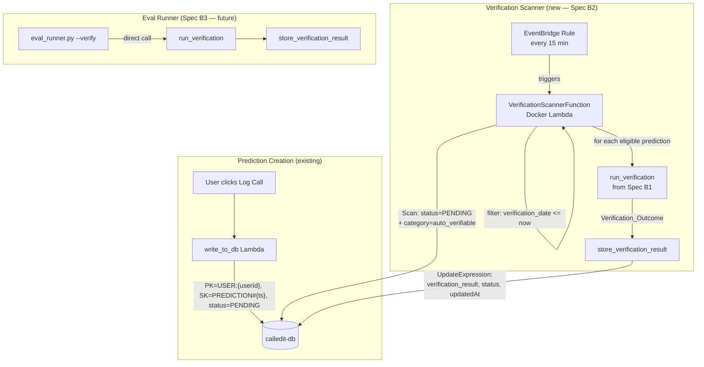

# Design Document — Spec B2: Verification Triggers & Storage

## Overview

This design describes two components that wire the Verification Executor agent (Spec B1) into production:

1. **`store_verification_result()`** — a shared utility function that writes a `Verification_Outcome` back to the original `Prediction_Record` in DynamoDB using an `UpdateExpression` (preserving all existing fields).

2. **Verification Scanner** — a Docker Lambda triggered by EventBridge every 15 minutes that scans `calledit-db` for `auto_verifiable` predictions with `status=PENDING` whose `verification_date` has passed, then calls `run_verification()` (from Spec B1) and `store_verification_result()` for each match.

The storage function lives in a shared module importable by both the scanner Lambda and the eval runner (Spec B3). The scanner Lambda shares the same Docker image as `MakeCallStreamFunction` (needs MCP tools, Strands, and Node.js for MCP server subprocesses).

Production verification is completely decoupled from prediction creation (Decision 81). The `write_to_db.py` handler logs predictions with `status: PENDING` — the scanner picks them up later when their verification date arrives.

## Architecture



Key architectural decisions:

1. **Scanner-only in production (Decision 81).** The `write_to_db.py` Lambda is a lightweight REST Lambda (python3.12, zip package) without MCP tools or Strands. It cannot run `run_verification()`. All production verification happens via the EventBridge scanner. The eval runner (Spec B3) calls `run_verification()` directly for local evaluation.

2. **Same Docker image as MakeCallStreamFunction.** The scanner needs MCP tools (brave_web_search, fetch, playwright) and Strands for `run_verification()`. The existing Dockerfile already installs Node.js + Python dependencies + copies the `handlers/strands_make_call/` directory. The scanner handler lives in the same directory with a SAM `CMD` override pointing to its handler.

3. **DynamoDB Scan with FilterExpression.** The table uses `PK=USER:{userId}` and `SK=PREDICTION#{timestamp}` with no GSI on `status` or `verifiable_category`. A full table scan with `FilterExpression` on `status` and `verifiable_category` is the simplest approach. At current scale (hundreds of predictions, not millions), this is fine. If performance becomes an issue, a GSI on `status` can be added later.

4. **Sequential processing.** Predictions are verified one at a time within a single scanner invocation. This avoids concurrent MCP server connections (the `mcp_manager` singleton manages a single set of subprocess connections). Each prediction gets up to 60 seconds before timeout.

5. **Shared storage utility.** `store_verification_result()` is a standalone function in its own module (`verification_store.py`) so both the scanner and the eval runner can import it without pulling in scanner-specific logic.

## Components and Interfaces

### Component 1: `verification_store.py` — DynamoDB Storage Utility

New module at `handlers/strands_make_call/verification_store.py`.

**Exports:**
- `store_verification_result(user_id: str, sort_key: str, outcome: dict) -> bool`

**Signature:**
```python
def store_verification_result(user_id: str, sort_key: str, outcome: dict) -> bool:
    """
    Write a Verification_Outcome back to the Prediction_Record in calledit-db.

    Uses UpdateExpression to modify only verification-related attributes,
    preserving all existing fields (prediction_statement, verification_method, etc.).

    Args:
        user_id: The user ID portion of the PK (without the "USER:" prefix — 
                 the function constructs PK=USER:{user_id}).
        sort_key: The full SK value (e.g., "PREDICTION#2026-03-22T14:30:00").
        outcome: A Verification_Outcome dict from run_verification().

    Returns:
        True if the update succeeded, False if it failed.
        Never raises — logs errors at ERROR level.
    """
```

**DynamoDB UpdateExpression:**
```python
table.update_item(
    Key={
        'PK': f'USER:{user_id}',
        'SK': sort_key,
    },
    UpdateExpression='SET verification_result = :vr, #s = :status, updatedAt = :ts',
    ExpressionAttributeNames={
        '#s': 'status',  # 'status' is a DynamoDB reserved word
    },
    ExpressionAttributeValues={
        ':vr': outcome,
        ':status': outcome.get('status', 'inconclusive'),
        ':ts': datetime.now(timezone.utc).isoformat(),
    },
)
```

Note: `status` is a DynamoDB reserved word, so it must be aliased via `ExpressionAttributeNames`.

**Error handling:** The entire function body is wrapped in `try/except Exception`. On failure, it logs the error at ERROR level and returns `False`. It never raises.

### Component 2: `verification_scanner.py` — Scanner Lambda Handler

New module at `handlers/strands_make_call/verification_scanner.py`.

**Exports:**
- `lambda_handler(event, context)` — the Lambda entry point

**Flow:**

1. **Scan DynamoDB** for predictions matching `status=PENDING` AND `verifiable_category=auto_verifiable` using a `FilterExpression`.
2. **Filter in code** for `verification_date <= now` (string comparison in `YYYY-MM-DD HH:MM:SS` format works correctly for chronological ordering).
3. **For each eligible prediction**, sequentially:
   a. Call `run_verification(prediction_record)` with a 60-second timeout (using `signal.alarm` or `threading.Timer`).
   b. If timeout → build an `inconclusive` outcome with timeout reasoning.
   c. Call `store_verification_result(user_id, sort_key, outcome)`.
   d. Track success/failure counts.
4. **Log summary**: total scanned, eligible, verified, failed.

**Timeout implementation:**
```python
import threading

def _run_with_timeout(func, args, timeout_seconds=60):
    """Run func(*args) with a timeout. Returns (result, timed_out)."""
    result = [None]
    exception = [None]

    def target():
        try:
            result[0] = func(*args)
        except Exception as e:
            exception[0] = e

    thread = threading.Thread(target=target)
    thread.start()
    thread.join(timeout=timeout_seconds)

    if thread.is_alive():
        return None, True  # timed_out
    if exception[0]:
        raise exception[0]
    return result[0], False
```

Note: `signal.alarm` doesn't work in Lambda (no SIGALRM in the Lambda runtime). `threading.Timer` with `thread.join(timeout)` is the standard Lambda-compatible approach.

**DynamoDB scan pagination:**
The scanner must handle paginated results. DynamoDB returns up to 1MB per scan call. The scanner loops on `LastEvaluatedKey`:

```python
items = []
scan_kwargs = {
    'FilterExpression': Attr('status').eq('PENDING') & Attr('verifiable_category').eq('auto_verifiable'),
}
while True:
    response = table.scan(**scan_kwargs)
    items.extend(response.get('Items', []))
    if 'LastEvaluatedKey' not in response:
        break
    scan_kwargs['ExclusiveStartKey'] = response['LastEvaluatedKey']
```

**Extracting user_id and sort_key from scan results:**
Each scanned item has `PK=USER:{userId}` and `SK=PREDICTION#{timestamp}`. The scanner extracts `user_id` by stripping the `USER:` prefix from `PK`:

```python
user_id = item['PK'].replace('USER:', '', 1)
sort_key = item['SK']
```

### Component 3: SAM Template Changes

New resources added to `backend/calledit-backend/template.yaml`:

**VerificationScannerFunction:**
```yaml
VerificationScannerFunction:
  Type: AWS::Serverless::Function
  Properties:
    PackageType: Image
    Timeout: 900  # 15 minutes max (matches EventBridge interval)
    MemorySize: 512
    Environment:
      Variables:
        PROMPT_VERSION_PARSER: "1"
        PROMPT_VERSION_CATEGORIZER: "2"
        PROMPT_VERSION_VB: "3"
        PROMPT_VERSION_REVIEW: "4"
        BRAVE_API_KEY: !Ref BraveApiKey
    Policies:
      - DynamoDBCrudPolicy:
          TableName: calledit-db
      - Statement:
          - Effect: Allow
            Action:
              - 'bedrock:InvokeModel'
              - 'bedrock:InvokeModelWithResponseStream'
              - 'bedrock:ListFoundationModels'
            Resource: '*'
      - Statement:
          - Effect: Allow
            Action:
              - 'bedrock-agent:GetPrompt'
            Resource: '*'
    Events:
      ScheduledScan:
        Type: Schedule
        Properties:
          Schedule: rate(15 minutes)
          Description: "Scan for predictions ready to verify"
          Enabled: true
  Metadata:
    DockerTag: python3.12-nodejs-v1
    DockerContext: .
    Dockerfile: Dockerfile
    DockerBuildArgs:
      CMD_OVERRIDE: verification_scanner.lambda_handler
```

The scanner uses the same Docker image as `MakeCallStreamFunction` but overrides the `CMD` to point to `verification_scanner.lambda_handler` instead of `strands_make_call_graph.lambda_handler`. The `ImageConfig` property in SAM handles this:

```yaml
    ImageConfig:
      Command:
        - verification_scanner.lambda_handler
```

**Permissions mirror MakeCallStreamFunction:** DynamoDB CRUD on `calledit-db`, Bedrock invoke (for the verification executor agent), and Bedrock Prompt Management (for MCP Manager's prompt client). The scanner does NOT need WebSocket `execute-api:ManageConnections` since it doesn't send WebSocket messages.

### Interface Summary

| Component | Input | Output |
|---|---|---|
| `store_verification_result()` | `user_id: str, sort_key: str, outcome: dict` | `bool` (True/False) |
| `verification_scanner.lambda_handler()` | EventBridge scheduled event | `dict` with statusCode and summary |
| `run_verification()` (Spec B1) | `prediction_record: dict` | `Verification_Outcome: dict` |

## Data Models

### Prediction_Record (existing — read by scanner)

The scanner reads these from `calledit-db`. Relevant fields for scanning and filtering:

```python
{
    "PK": "USER:{userId}",                    # Partition key
    "SK": "PREDICTION#{timestamp}",            # Sort key (ISO 8601)
    "status": "PENDING",                       # Set by write_to_db.py
    "verifiable_category": "auto_verifiable",  # Set by categorizer agent
    "verification_date": "2026-03-25 14:00:00",  # YYYY-MM-DD HH:MM:SS format
    "prediction_statement": "...",             # From parser agent
    "verification_method": {                   # From verification builder agent
        "source": ["brave_web_search", ...],
        "criteria": ["criterion1", ...],
        "steps": ["step1", ...]
    },
    # ... other fields preserved by UpdateExpression
}
```

### Prediction_Record (after verification — written by store)

After `store_verification_result()` runs, three fields are added/updated:

```python
{
    # ... all existing fields preserved ...
    "status": "confirmed",  # or "refuted" or "inconclusive" (was "PENDING")
    "updatedAt": "2026-03-25T14:15:30.123456+00:00",  # ISO 8601 UTC
    "verification_result": {
        "status": "confirmed",
        "confidence": 0.9,
        "evidence": [
            {"source": "brave_web_search", "content": "...", "relevance": "..."}
        ],
        "reasoning": "Evidence clearly confirms...",
        "verified_at": "2026-03-25T14:15:28.000000+00:00",
        "tools_used": ["brave_web_search", "fetch"]
    }
}
```

### Scanner Summary (logged at end of invocation)

```python
{
    "total_scanned": 42,       # Total PENDING + auto_verifiable items from DDB
    "eligible": 5,             # Items where verification_date <= now
    "verified": 4,             # Successfully processed (any outcome)
    "failed": 1,               # store_verification_result returned False
    "outcomes": {
        "confirmed": 2,
        "refuted": 1,
        "inconclusive": 1
    }
}
```


## Correctness Properties

*A property is a characteristic or behavior that should hold true across all valid executions of a system — essentially, a formal statement about what the system should do. Properties serve as the bridge between human-readable specifications and machine-verifiable correctness guarantees.*

### Property 1: store_verification_result never raises

*For any* `user_id` string, `sort_key` string, and `outcome` dict (including malformed, empty, or None values), `store_verification_result(user_id, sort_key, outcome)` shall never raise an exception — it always returns a boolean (`True` or `False`).

**Validates: Requirements 1.1, 1.5**

### Property 2: Store round-trip preserves existing fields and writes verification fields

*For any* existing Prediction_Record in `calledit-db` with arbitrary extra fields, and *for any* valid Verification_Outcome dict, after calling `store_verification_result(user_id, sort_key, outcome)`, reading the item back shall show: (a) `verification_result` equals the outcome dict, (b) `status` equals `outcome['status']`, (c) `updatedAt` is a valid ISO 8601 timestamp, and (d) all pre-existing fields on the record are unchanged.

**Validates: Requirements 1.2, 1.3, 1.4, 1.6**

### Property 3: Scanner processes exactly the eligible predictions

*For any* set of Prediction_Records in `calledit-db` with varying `status`, `verifiable_category`, and `verification_date` values, the scanner shall invoke `run_verification` for exactly those records where `status` equals `PENDING` AND `verifiable_category` equals `auto_verifiable` AND `verification_date` is less than or equal to the current UTC time — and for no others.

**Validates: Requirements 2.2, 2.3, 2.4**

## Error Handling

Error handling follows the project's established patterns (Decision 4: simple try/except).

### store_verification_result Errors

- **DynamoDB ClientError** (throttling, validation, access denied): caught by the outer try/except, logged at ERROR level, returns `False`. The caller (scanner or eval runner) decides whether to retry.
- **Missing/malformed outcome dict**: the function reads `outcome.get('status', 'inconclusive')` defensively. If `outcome` is not a dict, the `get()` call fails and the outer try/except catches it, returning `False`.
- **Network errors** (timeout, connection reset): same catch-all, returns `False`.

### Scanner Errors

- **DynamoDB scan failure**: if the initial scan raises (permissions, table not found, throttling), the scanner logs at ERROR level and returns immediately without processing any predictions. This prevents partial processing of a corrupted scan result.
- **Single prediction verification failure**: if `run_verification()` raises (it shouldn't — it has its own catch-all), the scanner catches the exception, logs it, and continues to the next prediction. One bad prediction doesn't block the rest.
- **Verification timeout (60s)**: if `run_verification()` exceeds 60 seconds, the scanner builds an `inconclusive` outcome with `"reasoning": "Verification timed out after 60 seconds"` and stores it via `store_verification_result()`. Processing continues with the next prediction.
- **store_verification_result returns False**: the scanner increments the `failed` counter and continues. The prediction remains `PENDING` and will be retried on the next scanner invocation (15 minutes later).
- **Lambda timeout (900s)**: if the scanner runs out of time mid-processing, remaining predictions are not processed. They remain `PENDING` and will be picked up on the next invocation. No data corruption — each prediction is processed atomically (verify then store).

### Idempotency

The scanner is naturally idempotent. If a prediction is successfully verified and its status changes from `PENDING` to `confirmed`/`refuted`/`inconclusive`, the next scan won't pick it up (the `FilterExpression` requires `status=PENDING`). If the scanner crashes between `run_verification()` and `store_verification_result()`, the prediction stays `PENDING` and gets retried — `run_verification()` is stateless and safe to call multiple times.

## Testing Strategy

### Dual Testing Approach

Both unit tests and property-based tests are required for comprehensive coverage.

**Unit tests** cover:
- `store_verification_result()` with a real DynamoDB item — verify the three fields are updated and existing fields preserved
- `store_verification_result()` with an invalid table/key — verify it returns `False` without raising
- Scanner handler with real DynamoDB items — seed items with various statuses/categories/dates, run the scanner, verify only eligible items were processed
- Scanner handler with empty table — verify it completes with zero processed
- Scanner summary logging — verify the log contains expected counts
- Timeout behavior — verify that a slow verification produces an `inconclusive` outcome

**Property-based tests** cover the three correctness properties using Hypothesis:
- Property 1: Generate random `user_id`, `sort_key`, and `outcome` dicts (including adversarial shapes) → verify `store_verification_result` never raises and returns a boolean
- Property 2: Seed a real DynamoDB item with random extra fields, call `store_verification_result` with a random valid outcome, read the item back → verify verification fields are correct and original fields are preserved
- Property 3: Seed DynamoDB with random prediction records (varying status, category, verification_date), run the scanner's eligibility filtering logic → verify exactly the correct subset is selected

### Property-Based Testing Configuration

- Library: **Hypothesis** (already in project dependencies)
- Minimum iterations: **100 per property**
- Each test tagged with: `# Feature: verification-triggers, Property N: <property text>`
- Per Decision 78 (no mocks), property tests for Properties 1 and 2 hit real DynamoDB. Property 3 tests the filtering logic as a pure function extracted from the scanner (the date comparison and field matching can be tested without DynamoDB).

### Test File Location

`backend/calledit-backend/tests/test_verification_triggers.py`

Tests import from `verification_store` and `verification_scanner`. For DynamoDB tests, they use the real `calledit-db` table with test-specific PK prefixes (e.g., `USER:TEST-{uuid}`) to avoid colliding with real data, and clean up after themselves.

### Hypothesis Strategies

```python
# Strategy for generating random Verification_Outcome dicts
verification_outcomes = st.fixed_dictionaries({
    "status": st.sampled_from(["confirmed", "refuted", "inconclusive"]),
    "confidence": st.floats(min_value=0.0, max_value=1.0),
    "evidence": st.lists(
        st.fixed_dictionaries({
            "source": st.text(min_size=1, max_size=50),
            "content": st.text(min_size=1, max_size=200),
            "relevance": st.text(min_size=1, max_size=100),
        }),
        max_size=3,
    ),
    "reasoning": st.text(min_size=1, max_size=200),
    "verified_at": st.just(datetime.now(timezone.utc).isoformat()),
    "tools_used": st.lists(st.text(min_size=1, max_size=30), max_size=3),
})

# Strategy for generating random prediction records with varying eligibility
prediction_records = st.fixed_dictionaries({
    "status": st.sampled_from(["PENDING", "confirmed", "refuted", "inconclusive"]),
    "verifiable_category": st.sampled_from(["auto_verifiable", "automatable", "human_only"]),
    "verification_date": st.datetimes(
        min_value=datetime(2026, 1, 1),
        max_value=datetime(2027, 1, 1),
    ).map(lambda dt: dt.strftime("%Y-%m-%d %H:%M:%S")),
    "prediction_statement": st.text(min_size=1, max_size=100),
})

# Strategy for adversarial outcome dicts (Property 1 — never raises)
adversarial_outcomes = st.one_of(
    st.dictionaries(
        keys=st.text(max_size=20),
        values=st.one_of(st.text(), st.integers(), st.none(), st.booleans()),
        max_size=10,
    ),
    st.just(None),
    st.just({}),
    st.just("not a dict"),
)
```
