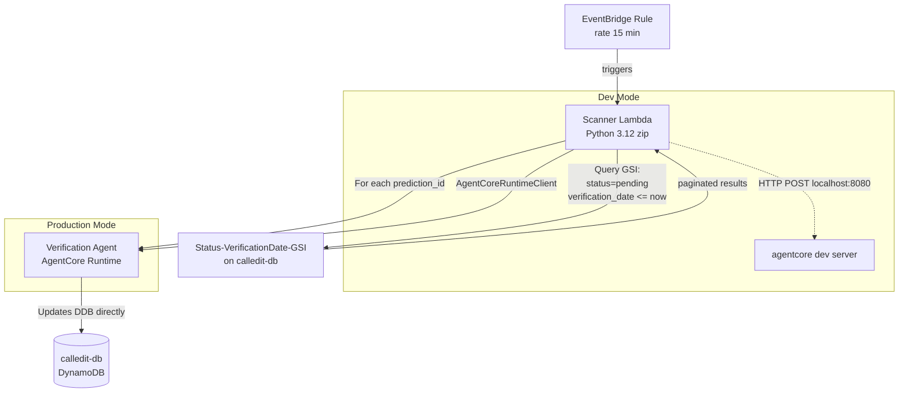

# Design Document — V4-5b: Verification Triggers

## Overview

This design covers the scheduling layer that finds due predictions in DynamoDB and invokes the V4-5a verification agent for each one. It delivers three components:

1. A DynamoDB Global Secondary Index (GSI) on `status` + `verification_date` for efficient queries
2. A lightweight scanner Lambda (standard Python 3.12, zip package) triggered by EventBridge every 15 minutes
3. A SAM/CloudFormation template defining both the GSI and the scanner Lambda

The scanner is a scheduler — it queries DDB, extracts prediction IDs, and invokes the verification agent via `AgentCoreRuntimeClient` (production) or HTTP POST (dev). It does NOT run verification logic itself.

### Key Prerequisite: verification_date Promotion

The `verification_date` field is currently nested inside `parsed_claim.verification_date` in the DDB bundle. DynamoDB GSIs can only index top-level attributes. The creation agent's `build_bundle()` and `format_ddb_item()` in `calleditv4/src/bundle.py` must be updated to also write `verification_date` as a top-level attribute when saving to DDB. This is a prerequisite change that V4-5b tasks must address before the GSI is useful.

### Design Decisions

- **Scanner location**: `infrastructure/verification-scanner/` — co-located with infrastructure, separate from both agent projects. The scanner is infrastructure (a scheduler), not an agent.
- **Template location**: `infrastructure/verification-scanner/template.yaml` — a standalone SAM template. The GSI is added to the `calledit-db` table here since the table itself was created outside CloudFormation (no `AWS::DynamoDB::Table` resource exists for it in the v3 SAM template).
- **GSI addition approach**: Since `calledit-db` is not managed by CloudFormation, the GSI must be added via AWS CLI or a custom CloudFormation resource. The design uses a direct `aws dynamodb update-table` CLI command documented in the template comments, plus a helper script.
- **Dual invocation mode**: The scanner supports `AgentCoreRuntimeClient` (production, via `VERIFICATION_AGENT_ID` env var) and HTTP POST (dev, via `VERIFICATION_AGENT_ENDPOINT` env var). This makes local testing easy with `agentcore dev`.
- **Sequential processing**: Predictions are processed one at a time to avoid overwhelming the verification agent. Each verification can take 30-400+ seconds.

## Architecture



### Data Flow

1. EventBridge fires every 15 minutes
2. Scanner Lambda queries GSI: `status = "pending"` AND `verification_date <= now()`
3. For each result, extract `prediction_id` (from projected attribute or parse `PK`)
4. Invoke verification agent with `{"prediction_id": "pred-xxx"}`
5. Parse response, record status (verified/inconclusive/error)
6. Log invocation summary at end of run

## Components and Interfaces

### 1. Scanner Lambda Handler (`scanner.py`)

The main Lambda handler. Entry point: `lambda_handler(event, context)`.

```python
def lambda_handler(event, context) -> dict:
    """EventBridge-triggered scanner. Returns invocation summary."""
```

Internal functions:

- `query_due_predictions(table, index_name: str, now_iso: str) -> list[dict]` — Queries the GSI with pagination. Returns list of items with `PK` and `prediction_id`.
- `extract_prediction_id(item: dict) -> str | None` — Extracts prediction_id from the projected attribute or parses it from `PK` (`PRED#pred-xxx` → `pred-xxx`).
- `invoke_verification_agent(prediction_id: str, client) -> dict` — Invokes the verification agent via AgentCoreRuntimeClient or HTTP POST. Returns parsed response dict.
- `build_invocation_client()` — Factory that returns either an AgentCoreRuntimeClient wrapper or an HTTP client based on env vars.

### 2. Invocation Client Abstraction

Two implementations behind a common interface:

```python
class AgentCoreInvoker:
    """Production: uses AgentCoreRuntimeClient."""
    def invoke(self, prediction_id: str) -> dict: ...

class HttpInvoker:
    """Dev: HTTP POST to localhost."""
    def invoke(self, prediction_id: str) -> dict: ...
```

Selection logic:
- If `VERIFICATION_AGENT_ENDPOINT` is set → `HttpInvoker` (dev mode)
- Else → `AgentCoreInvoker` using `VERIFICATION_AGENT_ID` env var

### 3. GSI Definition

Added to the existing `calledit-db` table via AWS CLI (since the table is not CloudFormation-managed):

| Attribute | Role | Type |
|-----------|------|------|
| `status` | Partition Key (GSI) | String |
| `verification_date` | Sort Key (GSI) | String (ISO 8601) |

Projected attributes: `prediction_id`, `PK`, `SK` (KEYS_ONLY + `prediction_id`).

The GSI is sparse — only items with both `status` and `verification_date` as top-level attributes are indexed. V3 items (which use `PK=USER:xxx`, `SK=PREDICTION#xxx`) won't have top-level `status`/`verification_date` in the right format, so they naturally won't appear in the index.

### 4. SAM Template (`infrastructure/verification-scanner/template.yaml`)

Defines:
- `VerificationScannerFunction` — Python 3.12 Lambda, zip package, 900s timeout
- `ScannerScheduleRule` — EventBridge rule, `rate(15 minutes)`
- IAM policies: DynamoDB Query on `calledit-db` + GSI, AgentCore Runtime invoke
- Environment variables: `DYNAMODB_TABLE_NAME`, `GSI_NAME`, `VERIFICATION_AGENT_ID`, `VERIFICATION_AGENT_ENDPOINT`

### 5. GSI Setup Script (`infrastructure/verification-scanner/setup_gsi.sh`)

A one-time script to add the GSI to the existing `calledit-db` table:

```bash
aws dynamodb update-table \
  --table-name calledit-db \
  --attribute-definitions \
    AttributeName=status,AttributeType=S \
    AttributeName=verification_date,AttributeType=S \
  --global-secondary-index-updates '[{
    "Create": {
      "IndexName": "status-verification_date-index",
      "KeySchema": [
        {"AttributeName": "status", "KeyType": "HASH"},
        {"AttributeName": "verification_date", "KeyType": "RANGE"}
      ],
      "Projection": {
        "ProjectionType": "INCLUDE",
        "NonKeyAttributes": ["prediction_id"]
      }
    }
  }]'
```

### 6. Prerequisite: verification_date Promotion

Changes to `calleditv4/src/bundle.py`:

- `build_bundle()` — Add `verification_date` as a top-level field extracted from `parsed_claim["verification_date"]`
- `format_ddb_update()` — Add `verification_date` to the SET expression so clarification rounds also update the top-level field

This ensures all new v4 predictions have `verification_date` as a top-level DDB attribute that the GSI can index.

## Data Models

### GSI Query Result Item

```python
{
    "PK": "PRED#pred-abc123",       # Table key (always projected)
    "SK": "BUNDLE",                  # Table key (always projected)
    "status": "pending",             # GSI partition key
    "verification_date": "2026-03-25T14:00:00Z",  # GSI sort key
    "prediction_id": "pred-abc123",  # Projected attribute
}
```

### Scanner Invocation Payload (to Verification Agent)

```python
{"prediction_id": "pred-abc123"}
```

### Verification Agent Response

```python
{
    "prediction_id": "pred-abc123",
    "verdict": "confirmed",      # confirmed | refuted | inconclusive
    "confidence": 0.95,
    "status": "verified"         # verified | inconclusive | error
}
```

### Scanner Lambda Response (Invocation Summary)

```python
{
    "statusCode": 200,
    "body": {
        "total_found": 5,
        "total_invoked": 5,
        "total_succeeded": 4,
        "total_failed": 1,
        "failures": [
            {"prediction_id": "pred-xyz789", "error": "Agent timeout"}
        ]
    }
}
```

### Environment Variables

| Variable | Required | Description |
|----------|----------|-------------|
| `DYNAMODB_TABLE_NAME` | Yes | DDB table name (default: `calledit-db`) |
| `GSI_NAME` | Yes | GSI name (default: `status-verification_date-index`) |
| `VERIFICATION_AGENT_ID` | Prod | AgentCore runtime ID for production invocation |
| `VERIFICATION_AGENT_ENDPOINT` | Dev | HTTP endpoint for dev mode (e.g., `http://localhost:8080`) |


## Correctness Properties

*A property is a characteristic or behavior that should hold true across all valid executions of a system — essentially, a formal statement about what the system should do. Properties serve as the bridge between human-readable specifications and machine-verifiable correctness guarantees.*

### Property 1: Prediction ID Extraction

*For any* DDB item with a `PK` in the format `PRED#<id>`, `extract_prediction_id` should return `<id>`. If the item also has a `prediction_id` attribute, the extracted value should match it. For any item where `PK` does not start with `PRED#` and has no `prediction_id` attribute, extraction should return `None`.

**Validates: Requirements 2.5**

### Property 2: GSI Query Filters Correctly

*For any* ISO 8601 timestamp `now`, the GSI query built by `query_due_predictions` should use `status = "pending"` as the partition key condition and `verification_date <= now` as the sort key condition, ensuring only pending predictions due on or before `now` are returned.

**Validates: Requirements 1.5, 2.2**

### Property 3: Pagination Collects All Results

*For any* sequence of paginated GSI query responses (each containing a subset of items and optionally a `LastEvaluatedKey`), `query_due_predictions` should return the concatenation of all items from all pages, with no items lost or duplicated.

**Validates: Requirements 2.3**

### Property 4: Invocation Payload Format

*For any* prediction ID string, the payload sent to the verification agent should be exactly `{"prediction_id": "<prediction_id>"}` with no additional fields.

**Validates: Requirements 3.1**

### Property 5: Response Parsing Extracts Status

*For any* valid JSON response from the verification agent containing a `status` field, the scanner should correctly parse and record that status value. For any response that is not valid JSON, the scanner should treat it as an error.

**Validates: Requirements 3.5**

### Property 6: Error Resilience

*For any* list of N predictions where K of them cause invocation failures (exceptions, timeouts, error responses), the scanner should still attempt invocation for all N predictions and the summary should report exactly (N - K) succeeded and K failed.

**Validates: Requirements 3.6**

### Property 7: Summary Count Consistency

*For any* scanner run that finds F predictions, invokes I of them, with S successes and E failures, the returned summary should satisfy: `total_found == F`, `total_invoked == I`, `total_succeeded == S`, `total_failed == E`, and `S + E == I` and `I <= F`.

**Validates: Requirements 4.1, 4.2**

## Error Handling

| Error Scenario | Behavior | Logging |
|---|---|---|
| GSI query fails (DDB error) | Exit immediately, return error summary | ERROR level with exception details |
| GSI query returns empty results | Return summary with all zeros, exit normally | INFO level "zero predictions due" |
| `extract_prediction_id` returns None | Skip item, increment failed count | WARNING level with raw item PK |
| Verification agent invocation timeout | Skip prediction, continue to next | ERROR level with prediction_id and timeout details |
| Verification agent returns error status | Record as failed, continue to next | WARNING level with prediction_id and error response |
| Verification agent connection refused | Skip prediction, continue to next | ERROR level with prediction_id and connection error |
| Verification agent returns invalid JSON | Record as failed, continue to next | ERROR level with prediction_id and raw response |
| Missing env vars (`VERIFICATION_AGENT_ID` and `VERIFICATION_AGENT_ENDPOINT` both unset) | Exit immediately with configuration error | ERROR level with missing variable names |

The scanner follows a "fail-forward" pattern for individual predictions — a single failure never stops the entire scan. Only infrastructure-level failures (GSI query failure, missing configuration) cause early exit.

## Testing Strategy

### Property-Based Testing

Library: **Hypothesis** (already in the project's dev dependencies)

Each correctness property maps to a single Hypothesis test with minimum 100 iterations. Tests are pure functions — no DDB, no network calls, no mocks (Decision 96 applies to integration tests; property tests exercise pure logic).

Test file: `infrastructure/verification-scanner/tests/test_scanner_properties.py`

| Property | Test Function | Generator Strategy |
|---|---|---|
| Property 1: Prediction ID Extraction | `test_prediction_id_extraction` | Random prediction IDs (uuid4 format), random PK strings |
| Property 2: GSI Query Filters Correctly | `test_gsi_query_construction` | Random ISO 8601 timestamps |
| Property 3: Pagination Collects All Results | `test_pagination_collects_all` | Random lists of items split into random page sizes |
| Property 4: Invocation Payload Format | `test_invocation_payload_format` | Random prediction ID strings |
| Property 5: Response Parsing Extracts Status | `test_response_parsing` | Random JSON dicts with/without status field |
| Property 6: Error Resilience | `test_error_resilience` | Random lists of predictions with random failure indices |
| Property 7: Summary Count Consistency | `test_summary_count_consistency` | Random counts of found/succeeded/failed |

Each test is tagged with a comment: `# Feature: verification-triggers, Property N: <property_text>`

### Unit Testing

Test file: `infrastructure/verification-scanner/tests/test_scanner_unit.py`

Specific examples and edge cases:
- `extract_prediction_id` with `PK="PRED#pred-abc123"` returns `"pred-abc123"`
- `extract_prediction_id` with missing PK returns `None`
- Client selection: `VERIFICATION_AGENT_ENDPOINT` set → `HttpInvoker`
- Client selection: only `VERIFICATION_AGENT_ID` set → `AgentCoreInvoker`
- Client selection: neither set → raises configuration error
- Empty GSI response → summary with all zeros
- Verification agent returns `{"status": "error"}` → counted as failure

### Integration Testing

Integration tests hit real DynamoDB (Decision 96: no mocks). They require the GSI to be created first.

Test file: `infrastructure/verification-scanner/tests/test_scanner_integration.py`

- Seed test predictions with various statuses and verification dates
- Query GSI, verify only pending+due predictions returned
- Verify sparse index behavior (items without top-level `status`/`verification_date` not indexed)
- Clean up test data after each test

### Test Configuration

```python
from hypothesis import settings

# All property tests use at least 100 examples
@settings(max_examples=100)
```

All Python test commands use the venv:
```bash
/home/wsluser/projects/calledit/venv/bin/python -m pytest infrastructure/verification-scanner/tests/ -v
```
