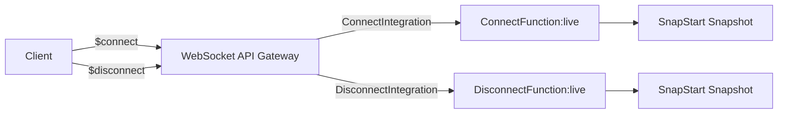

# Design Document: WebSocket SnapStart Completion

## Overview

This design covers enabling Lambda SnapStart on ConnectFunction and DisconnectFunction in the SAM template at `backend/calledit-backend/template.yaml`. The change replicates the existing alias integration pattern already proven on MakeCallStreamFunction.

Both functions are trivial (8 lines, import only `json`) with no perishable resources, so no runtime hooks or handler code changes are needed. The entire change is confined to the SAM template: adding SnapStart/AutoPublishAlias properties, updating integration URIs to alias ARNs, and adding alias-specific Lambda permissions.

The cold start improvement is minimal (~50-100ms), but this brings stack consistency — all Lambda functions in the template will use the same SnapStart + alias pattern.

## Architecture

No architectural changes. The existing WebSocket API Gateway → Lambda integration pattern remains identical. The only difference is that API Gateway will invoke the published version (via `:live` alias) instead of `$LATEST`.



**Before:** `APIGW → ConnectFunction ($LATEST)` / `APIGW → DisconnectFunction ($LATEST)`
**After:** `APIGW → ConnectFunction:live (SnapStart)` / `APIGW → DisconnectFunction:live (SnapStart)`

## Components and Interfaces

### SAM Template Changes (4 resource modifications + 2 new resources)

All changes are in `backend/calledit-backend/template.yaml`.

#### 1. ConnectFunction — Add SnapStart properties

```yaml
ConnectFunction:
  Type: AWS::Serverless::Function
  Properties:
    CodeUri: handlers/websocket/
    Handler: connect.lambda_handler
    Runtime: python3.12
    AutoPublishAlias: live          # NEW
    SnapStart:                       # NEW
      ApplyOn: PublishedVersions     # NEW
    Policies:
      - Statement:
          - Effect: Allow
            Action:
              - 'execute-api:ManageConnections'
            Resource: !Sub 'arn:aws:execute-api:${AWS::Region}:${AWS::AccountId}:${WebSocketApi}/*'
```

#### 2. DisconnectFunction — Add SnapStart properties

```yaml
DisconnectFunction:
  Type: AWS::Serverless::Function
  Properties:
    CodeUri: handlers/websocket/
    Handler: disconnect.lambda_handler
    Runtime: python3.12
    AutoPublishAlias: live          # NEW
    SnapStart:                       # NEW
      ApplyOn: PublishedVersions     # NEW
    Policies:
      - Statement:
          - Effect: Allow
            Action:
              - 'execute-api:ManageConnections'
            Resource: !Sub 'arn:aws:execute-api:${AWS::Region}:${AWS::AccountId}:${WebSocketApi}/*'
```

#### 3. ConnectIntegration — Update IntegrationUri to alias ARN

```yaml
ConnectIntegration:
  Type: AWS::ApiGatewayV2::Integration
  Properties:
    ApiId: !Ref WebSocketApi
    IntegrationType: AWS_PROXY
    IntegrationUri: !Sub arn:aws:apigateway:${AWS::Region}:lambda:path/2015-03-31/functions/${ConnectFunction.Arn}:live/invocations
```

Change: `${ConnectFunction.Arn}/invocations` → `${ConnectFunction.Arn}:live/invocations`

#### 4. DisconnectIntegration — Update IntegrationUri to alias ARN

```yaml
DisconnectIntegration:
  Type: AWS::ApiGatewayV2::Integration
  Properties:
    ApiId: !Ref WebSocketApi
    IntegrationType: AWS_PROXY
    IntegrationUri: !Sub arn:aws:apigateway:${AWS::Region}:lambda:path/2015-03-31/functions/${DisconnectFunction.Arn}:live/invocations
```

Change: `${DisconnectFunction.Arn}/invocations` → `${DisconnectFunction.Arn}:live/invocations`

#### 5. ConnectFunctionAliasPermission — NEW resource

```yaml
ConnectFunctionAliasPermission:
  Type: AWS::Lambda::Permission
  Properties:
    Action: lambda:InvokeFunction
    FunctionName: !Sub '${ConnectFunction}:live'
    Principal: apigateway.amazonaws.com
    SourceArn: !Sub 'arn:aws:execute-api:${AWS::Region}:${AWS::AccountId}:${WebSocketApi}/*/$connect'
```

Follows the same pattern as `MakeCallStreamFunctionAliasPermission`. Scoped to `$connect` route only.

#### 6. DisconnectFunctionAliasPermission — NEW resource

```yaml
DisconnectFunctionAliasPermission:
  Type: AWS::Lambda::Permission
  Properties:
    Action: lambda:InvokeFunction
    FunctionName: !Sub '${DisconnectFunction}:live'
    Principal: apigateway.amazonaws.com
    SourceArn: !Sub 'arn:aws:execute-api:${AWS::Region}:${AWS::AccountId}:${WebSocketApi}/*/$disconnect'
```

Scoped to `$disconnect` route only.

### No Handler Code Changes

ConnectFunction and DisconnectFunction import only `json` and hold no perishable resources (no boto3 clients, no singletons, no HTTP connections). No `@register_after_restore` hooks are needed.

## Data Models

No data model changes. ConnectFunction and DisconnectFunction do not interact with DynamoDB or any data store. They return a static JSON response (`{"message": "Connected"}` / `{"message": "Disconnected"}`).

## Correctness Properties

*A property is a characteristic or behavior that should hold true across all valid executions of a system — essentially, a formal statement about what the system should do. Properties serve as the bridge between human-readable specifications and machine-verifiable correctness guarantees.*

Most acceptance criteria for this feature are structural checks on the SAM template (specific examples) or deployment-time integration tests (not unit-testable). The testable criteria can be consolidated into properties over the set of target functions `{ConnectFunction, DisconnectFunction}`.

### Property 1: SnapStart configuration completeness

*For any* function in `{ConnectFunction, DisconnectFunction}`, the SAM template resource SHALL have both `AutoPublishAlias: live` and `SnapStart: { ApplyOn: PublishedVersions }` properties defined.

**Validates: Requirements 1.1, 1.2, 2.1, 2.2**

### Property 2: Integration URI uses alias ARN

*For any* integration in `{ConnectIntegration, DisconnectIntegration}`, the IntegrationUri SHALL contain the `:live/invocations` suffix (alias-qualified ARN) rather than an unqualified function ARN.

**Validates: Requirements 3.1, 3.2**

### Property 3: Alias permissions exist with correct route scoping

*For any* function in `{ConnectFunction, DisconnectFunction}`, there SHALL exist an alias-specific `AWS::Lambda::Permission` resource where: (a) FunctionName references the `:live` alias, (b) Principal is `apigateway.amazonaws.com`, and (c) SourceArn is scoped to the corresponding route (`$connect` or `$disconnect`).

**Validates: Requirements 4.1, 4.2, 4.3, 4.4**

### Property 4: Existing permissions preserved

*For any* function in `{ConnectFunction, DisconnectFunction}`, the original unqualified `AWS::Lambda::Permission` resource SHALL remain present and unmodified (FunctionName uses `!Ref` without alias suffix).

**Validates: Requirements 4.5**

### Property 5: Handler behavior unchanged

*For any* function in `{ConnectFunction, DisconnectFunction}`, invoking the handler with a mock WebSocket event SHALL return `statusCode: 200` and the expected JSON body (`{"message": "Connected"}` or `{"message": "Disconnected"}`).

**Validates: Requirements 1.3, 2.3**

### Property 6: IAM policies retained

*For any* function in `{ConnectFunction, DisconnectFunction}`, the SAM template resource SHALL include the `execute-api:ManageConnections` IAM policy unchanged from the pre-SnapStart configuration.

**Validates: Requirements 1.4, 2.4**

## Error Handling

### Deployment Failures

- CloudFormation automatically rolls back on stack update failure. If the SnapStart/alias changes cause a deployment error (e.g., invalid alias reference, permission conflict), the stack reverts to the previous working state.
- The `AutoPublishAlias` property creates a new Lambda version on each deploy. If version publishing fails, CloudFormation rolls back.

### Runtime Errors

- No new runtime error paths are introduced. The handlers are unchanged.
- If SnapStart snapshot restore fails for any reason, Lambda falls back to a normal cold start (standard init). This is transparent to the application.

### Rollback Procedure

If WebSocket connectivity breaks after deployment:
1. Revert `template.yaml` to the previous commit (remove SnapStart, AutoPublishAlias, revert IntegrationUri, remove alias permissions)
2. Run `sam build && sam deploy` — single operation restores pre-change state
3. No handler code changes needed for rollback

## Testing Strategy

### Unit Tests (pytest)

Verify handler behavior is unchanged:
- Invoke `connect.lambda_handler` with a mock event, assert 200 + correct body
- Invoke `disconnect.lambda_handler` with a mock event, assert 200 + correct body

### Template Validation Tests (pytest + PyYAML)

Parse `template.yaml` and verify structural correctness:
- ConnectFunction and DisconnectFunction have SnapStart + AutoPublishAlias
- ConnectIntegration and DisconnectIntegration use `:live` alias URIs
- ConnectFunctionAliasPermission and DisconnectFunctionAliasPermission exist with correct properties
- Existing unqualified permissions are preserved
- IAM policies are unchanged

These tests use PyYAML to parse the template and assert on the resource structure. They validate Properties 1-4 and 6 from the Correctness Properties section.

### Property-Based Testing (pytest + Hypothesis)

Property-based tests are limited for this feature since the domain is a fixed set of two functions (not a range of inputs). However, we can use Hypothesis to parameterize across the function set:

- **Library**: Hypothesis (already in project dev dependencies)
- **Minimum iterations**: 100 per property test
- **Tag format**: `Feature: websocket-snapstart, Property {N}: {description}`

Properties 1-4 and 6 are best tested as parameterized template validation tests (iterating over the two target functions). Property 5 (handler behavior) is a straightforward unit test.

### Deployment Validation (manual)

After `sam build && sam deploy`:
1. Connect to WebSocket endpoint using `wscat` or browser client
2. Verify `$connect` succeeds
3. Send a `makecall` action, verify streaming response
4. Disconnect, verify clean `$disconnect`
5. Check CloudWatch Logs for `restoreDurationMs` on Connect/Disconnect functions to confirm SnapStart is active
