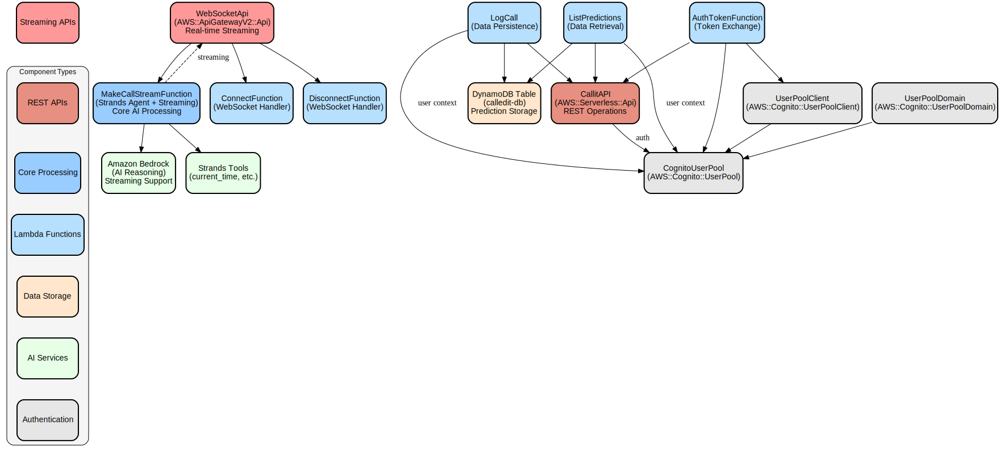

# CalledIt: A Serverless Prediction Verification Platform

> **⚠️ DEMONSTRATION PROJECT ONLY**  
> This is a demo/educational project showcasing serverless AI architecture patterns. **NOT intended for production use.** See [License](#license) and [Disclaimers](#disclaimers) for important usage restrictions.

CalledIt is a serverless web application that converts natural language predictions into structured, verifiable formats using AI agents. Built on AWS serverless architecture, it provides a robust platform for creating, managing, and validating predictions with **intelligent verifiability categorization**.

The application combines AWS Cognito for authentication, AWS Lambda for serverless compute, and DynamoDB for data persistence. The frontend is built with React and TypeScript, providing a responsive and intuitive user interface. The backend leverages **Strands agents** for AI orchestration, Amazon Bedrock for reasoning, and **real-time WebSocket streaming** for immediate user feedback during prediction processing.

## 🎯 Key Innovation: Verifiability Categorization

CalledIt automatically classifies every prediction into one of **5 verifiability categories**, enabling future automated verification:

- 🧠 **Agent Verifiable** - Pure reasoning/knowledge (e.g., "The sun will rise tomorrow")
- ⏰ **Current Tool Verifiable** - Time-based verification (e.g., "It's past 11 PM")
- 🔧 **Strands Tool Verifiable** - Mathematical/computational (e.g., "Calculate compound interest")
- 🌐 **API Tool Verifiable** - External data required (e.g., "Bitcoin will hit $100k")
- 👤 **Human Verifiable Only** - Subjective assessment (e.g., "I will feel happy")

Each prediction includes AI-generated reasoning for its categorization, creating a structured foundation for automated verification systems.

## Repository Structure
```
.
├── backend/                      # Backend serverless application
│   └── calledit-backend/
│       ├── handlers/            # Lambda function handlers (8 active)
│       │   ├── auth_token/      # Cognito token exchange
│       │   ├── strands_make_call/ # 3-agent graph with streaming
│       │   │   ├── strands_make_call_graph.py      # Main handler (ACTIVE)
│       │   │   ├── prediction_graph.py             # Graph orchestration
│       │   │   ├── parser_agent.py                 # Parser Agent
│       │   │   ├── categorizer_agent.py            # Categorizer Agent
│       │   │   ├── verification_builder_agent.py   # Verification Builder Agent
│       │   │   ├── graph_state.py                  # Graph state TypedDict
│       │   │   ├── utils.py                        # Shared utilities
│       │   │   └── review_agent.py                 # Future: Review Agent (Task 10)
│       │   ├── websocket/       # WebSocket connection handlers (connect/disconnect)
│       │   ├── list_predictions/# Retrieve user predictions
│       │   ├── write_to_db/     # DynamoDB write operations
│       │   ├── verification/    # Automated verification system (EventBridge)
│       │   │   ├── app.py                       # Main handler
│       │   │   ├── verification_agent.py        # Strands verification agent
│       │   │   ├── ddb_scanner.py               # DynamoDB scanner
│       │   │   ├── status_updater.py            # Updates verification status
│       │   │   ├── s3_logger.py                 # Logs to S3
│       │   │   └── email_notifier.py            # SNS notifications
│       │   └── notification_management/ # SNS email subscription management
│       ├── template.yaml        # SAM template for AWS resources
│       └── tests/               # Backend unit tests
├── frontend/                    # React TypeScript frontend
│   ├── src/
│   │   ├── components/         # React components with category display
│   │   ├── services/          # API, auth, and WebSocket services
│   │   ├── types/             # TypeScript interfaces (CallResponse)
│   │   ├── hooks/             # Custom React hooks (4 for VPSS)
│   │   └── utils/             # Utility functions
│   └── package.json           # Frontend dependencies
├── testing/                     # Comprehensive testing framework
│   ├── active/                 # Working tests (100% success rate)
│   ├── integration/            # End-to-end integration tests
│   ├── automation/             # Automated testing tools
│   ├── deprecated/             # Archived/non-functional tests
│   ├── demo_prompts.py         # 40 compelling test prompts (5 categories)
│   ├── demo_api_test.py        # WebSocket API testing with results capture
│   └── demo_results_writer.py  # DynamoDB writer for demo data
├── strands/                     # Strands agent development
│   ├── demos/                  # Agent development examples
│   └── my_agent/               # Custom agent implementation
├── docs/                       # Organized documentation structure
│   ├── current/                # Up-to-date documentation
│   │   ├── API.md              # REST and WebSocket API documentation
│   │   ├── APPLICATION_FLOW.md # Complete system flow documentation
│   │   ├── TRD.md              # Technical Requirements Document
│   │   ├── TESTING.md          # Testing strategy and coverage
│   │   ├── VERIFICATION_SYSTEM.md # Automated verification documentation
│   │   └── infra.svg           # Infrastructure diagram
│   ├── implementation-plans/   # Feature implementation plans
│   ├── historical/             # Archived documentation
│   └── archive/                # Deprecated documentation
└── CHANGELOG.md                # Version history and feature tracking
```

## Usage Instructions
### Prerequisites
- Node.js 16.x or later
- Python 3.12
- AWS CLI configured with appropriate credentials
- AWS SAM CLI installed
- Docker (for local development)
- **Strands agents library** (installed via pip)

### Installation

#### Backend Setup
```bash
# Set up virtual environment
python -m venv venv
source venv/bin/activate  # On Windows: venv\Scripts\activate

# Navigate to backend directory
cd backend/calledit-backend

# Install Python dependencies (including Strands)
pip install -r requirements.txt

# Create SAM config from example
cp samconfig.toml.example samconfig.toml
# Edit samconfig.toml with your stack name and region

# IMPORTANT: Update account-specific configurations in template.yaml
# 1. Update CloudFront URLs in Cognito callback URLs (lines ~290-295):
#    - Replace https://d2w6gdbi1zx8x5.cloudfront.net/ with your CloudFront domain
# 2. Update CORS ALLOWED_ORIGINS in Lambda functions (lines ~194, ~219):
#    - Replace https://d2w6gdbi1zx8x5.cloudfront.net with your CloudFront domain

# Deploy to AWS
sam build
sam deploy --guided
```

#### Frontend Setup
```bash
# Navigate to frontend directory
cd frontend

# Install dependencies
npm install

# Create .env file from example
cp .env.example .env

# Update .env with your AWS configuration:
# - Replace YOUR-API-ID with your API Gateway ID
# - Replace YOUR-WEBSOCKET-ID with your WebSocket API ID
# - Replace YOUR-REGION with your AWS region
# - Replace Cognito values with your User Pool details
# - Replace CloudFront domain with your distribution
```

#### Testing Setup
```bash
# Install testing dependencies
pip install -r testing/requirements.txt

# Validate deployment with automated tests
python testing/verifiability_category_tests.py wss://your-websocket-url/prod
```

### Quick Start
1. Start the frontend development server:
```bash
cd frontend
npm run dev
```

2. Open your browser to `http://localhost:5173`

3. Log in using your Cognito credentials

4. Create a prediction using streaming:
   - Click "Streaming Call" tab
   - Enter your prediction in the input field
   - Click "Make Call" and watch real-time AI processing
   - See the **verifiability category** with visual badge and reasoning
   - Review the generated verification method
   - Click "Log Call" to save your prediction with category

### More Detailed Examples

#### Making a Streaming Prediction with Verifiability Categorization
The application uses Strands agents for intelligent prediction processing with automatic categorization:

```typescript
// Example streaming prediction flow with 3-agent graph
1. User enters: "Bitcoin will hit $100k before 3pm today"
2. 3-agent graph processes:
   - Parser Agent: Extracts prediction, parses "3pm" to "15:00", handles timezone
   - Categorizer Agent: Analyzes verifiability, classifies as "api_tool_verifiable"
   - Verification Builder Agent: Generates verification method with sources/criteria/steps
3. Real-time streaming shows:
   - "Processing your prediction with 3-agent graph..."
   - "[Parser Agent] Extracting prediction..."
   - "[Categorizer Agent] Analyzing verifiability..."
   - "[Verification Builder] Creating verification method..."
4. Final structured output:
{
  "prediction_statement": "Bitcoin will reach $100,000 before 15:00:00 on 2025-01-27",
  "verification_date": "2025-01-27T15:00:00Z",
  "date_reasoning": "Converted 3pm to 15:00 24-hour format for precision",
  "verifiable_category": "api_tool_verifiable",
  "category_reasoning": "Verifying Bitcoin's price requires real-time financial data through external APIs",
  "verification_method": {
    "source": ["CoinGecko API", "CoinMarketCap"],
    "criteria": ["BTC/USD price exceeds $100,000 before 15:00 UTC"],
    "steps": ["Check BTC price at 15:00:00 on January 27, 2025"]
  }
}
```

#### UI Display with Category Badges
The frontend displays verifiability categories with visual indicators:

```
Call Details:
- Prediction: "Bitcoin will hit $100k before 3pm today"
- Verification Date: 1/27/2025, 3:00:00 PM
- Verifiability: 🌐 API Verifiable
- Category Reasoning: "Verifying Bitcoin's price requires real-time financial data..."
- Status: PENDING
```

### Troubleshooting

#### Common Issues

1. **WebSocket Connection Issues**
```bash
# Check WebSocket API deployment
aws apigatewayv2 get-apis

# Verify WebSocket URL in frontend .env
# VITE_WEBSOCKET_URL=wss://your-websocket-id.execute-api.region.amazonaws.com/prod
```

2. **Strands Agent Errors**
```bash
# Check agent function logs
sam logs -n MakeCallStreamFunction --stack-name calledit-backend

# Verify Strands dependencies in requirements.txt
# strands-agents>=1.7.0
# strands-agents-tools>=0.2.6

# Check graph execution
# The 3-agent graph should execute: Parser → Categorizer → Verification Builder
```

3. **Streaming Issues**
- Ensure WebSocket permissions are configured
- Check connection timeout settings (5 minutes default)
- Verify Bedrock streaming permissions:
```bash
# Required permissions:
# bedrock:InvokeModel
# bedrock:InvokeModelWithResponseStream
# execute-api:ManageConnections
```

4. **Authentication Issues**
```bash
# Verify Cognito configuration
aws cognito-idp describe-user-pool --user-pool-id YOUR_POOL_ID

# Check user status
aws cognito-idp admin-get-user --user-pool-id YOUR_POOL_ID --username USER_EMAIL
```

5. **Deployment Issues**
```bash
# Check CloudFormation stack status
aws cloudformation describe-stacks --stack-name calledit-backend

# View deployment events
aws cloudformation describe-stack-events --stack-name calledit-backend

# Validate SAM template
sam validate
```

6. **Verifiability Category Issues**
```bash
# Test category classification
python testing/verifiability_category_tests.py

# Check agent logs for category processing
sam logs -n MakeCallStreamFunction --stack-name calledit-backend

# Verify category validation logic
# Categories: agent_verifiable, current_tool_verifiable, strands_tool_verifiable, api_tool_verifiable, human_verifiable_only
```

7. **Handler Structure Issues**
```bash
# Verify correct handler count (should be 8)
ls -la backend/calledit-backend/handlers/

# Expected directories:
# - auth_token/
# - list_predictions/
# - notification_management/
# - strands_make_call/
# - verification/
# - websocket/
# - write_to_db/

# If you see old handlers (hello_world, make_call, prompt_bedrock, prompt_agent, shared):
# These were removed in January 2026 cleanup - see HANDLER_CLEANUP_COMPLETE.md
```

## Data Flow
The application follows a serverless event-driven architecture with real-time streaming capabilities.

```ascii
User -> Cognito Auth -> WebSocket API -> 3-Agent Graph -> Bedrock (Reasoning)
                    |                      |                |
                    |                      Parser Agent     |
                    |                      Categorizer      |
                    |                      Verification     |
                    |                      Builder          |
                    |                      |                |
                    |                      -> Tools -> Real-time Stream
                    |
                    -> REST API -> Lambda Functions -> DynamoDB
```

Key component interactions:
1. User authenticates through Cognito user pool
2. **WebSocket connection** established for real-time streaming
3. **3-agent graph** orchestrates: Parser → Categorizer → Verification Builder
4. **Streaming responses** sent back to frontend via WebSocket
5. Bedrock provides AI reasoning with **InvokeModelWithResponseStream**
6. Tools (current_time, parse_relative_date) provide context to agents
7. Final predictions stored in DynamoDB via REST API
8. Frontend receives real-time updates during processing

## Active Lambda Functions (8)

After handler cleanup (January 2026), the application uses 8 Lambda functions organized by purpose:

### REST API Functions (4)
1. **AuthTokenFunction** - `handlers/auth_token/`
   - Cognito OAuth token exchange
   - Converts authorization codes to JWT tokens
   - No provisioned concurrency

2. **LogCall** - `handlers/write_to_db/`
   - Saves predictions to DynamoDB
   - Handles CORS for frontend
   - **Provisioned Concurrency**: 1 instance (alias: live)

3. **ListPredictions** - `handlers/list_predictions/`
   - Retrieves user predictions from DynamoDB
   - Supports pagination and filtering
   - **Provisioned Concurrency**: 1 instance (alias: live)

4. **NotificationManagementFunction** - `handlers/notification_management/`
   - Manages SNS email subscriptions
   - Endpoints: /subscribe-notifications, /unsubscribe-notifications, /notification-status
   - No provisioned concurrency

### WebSocket Functions (3)
5. **ConnectFunction** - `handlers/websocket/connect.py`
   - Handles WebSocket $connect route
   - Manages connection lifecycle
   - No provisioned concurrency

6. **DisconnectFunction** - `handlers/websocket/disconnect.py`
   - Handles WebSocket $disconnect route
   - Cleanup on connection close
   - No provisioned concurrency

7. **MakeCallStreamFunction** - `handlers/strands_make_call/`
   - **PRIMARY FUNCTION**: Main prediction processing with 3-agent graph
   - **Architecture**: Parser → Categorizer → Verification Builder
   - Handles WebSocket route: makecall
   - Real-time streaming via WebSocket
   - Timeout: 300 seconds (5 minutes)
   - Memory: 512 MB
   - **Provisioned Concurrency**: 1 instance (alias: live)
   - **Components**:
     - `strands_make_call_graph.py` - Main handler (ACTIVE)
     - `prediction_graph.py` - Graph orchestration
     - `parser_agent.py` - Extracts predictions and parses dates
     - `categorizer_agent.py` - Classifies verifiability
     - `verification_builder_agent.py` - Generates verification methods
     - `graph_state.py` - Graph state TypedDict
     - `utils.py` - Shared utilities (timezone, JSON extraction)
     - `review_agent.py` - Future: Review Agent (Task 10)

### Scheduled Functions (1)
8. **VerificationFunction** - `handlers/verification/`
   - Automated verification system
   - Triggered by EventBridge every 15 minutes
   - Processes ALL pending predictions
   - Timeout: 300 seconds (5 minutes)
   - Memory: 512 MB
   - No provisioned concurrency (scheduled execution)
   - **Components**:
     - `app.py` - Main handler
     - `verification_agent.py` - Strands verification agent
     - `ddb_scanner.py` - DynamoDB scanner
     - `status_updater.py` - Updates verification status
     - `s3_logger.py` - Logs to S3
     - `email_notifier.py` - SNS notifications

### Provisioned Concurrency Architecture
Three critical functions use provisioned concurrency to eliminate cold starts:
- **LogCall** (alias: live) - 1 instance always warm
- **ListPredictions** (alias: live) - 1 instance always warm
- **MakeCallStreamFunction** (alias: live) - 1 instance always warm

This ensures zero cold start delays for the most frequently used functions.

## Infrastructure


The application uses the following AWS resources:

### API Gateways
- **CallitAPI** (AWS::Serverless::Api): REST API for CRUD operations
  - Handles authentication and data persistence
  - Implements CORS and Cognito authorization
- **WebSocketApi** (AWS::ApiGatewayV2::Api): Real-time streaming
  - Handles WebSocket connections for streaming responses
  - Routes: $connect, $disconnect, makecall, improve_section, improvement_answers

### AI & Orchestration
- **3-Agent Graph**: Parser → Categorizer → Verification Builder
  - **Parser Agent**: Extracts predictions and parses dates with reasoning
  - **Categorizer Agent**: Classifies verifiability into 5 categories
  - **Verification Builder Agent**: Generates detailed verification methods
- **Strands Framework**: Orchestrates multi-agent workflows
- **Amazon Bedrock**: AI reasoning with streaming support
- **Custom Tools**: current_time, parse_relative_date utilities

### Authentication
- **CognitoUserPool**: Manages user authentication
- **UserPoolClient**: Configures OAuth flows
- **UserPoolDomain**: Provides hosted UI for authentication

### Database & Storage
- **DynamoDB** table "calledit-db" for storing predictions and verification data
- **S3 Bucket** for verification logs with encryption and lifecycle policies

### Notifications
- **SNS Topic** for verification notifications ("crying" system)

### Key Features
- **🎯 Verifiability Categorization**: Automatic classification into 5 categories with AI reasoning
- **⚡ Real-time Streaming**: WebSocket-based streaming for immediate feedback
- **🤖 3-Agent Graph Architecture**: Parser → Categorizer → Verification Builder
- **🌍 Timezone Intelligence**: Automatic timezone handling and 12/24-hour conversion
- **📋 Structured Verification**: AI-generated verification methods with reasoning
- **🧪 Automated Testing**: 100% success rate testing suite for all categories
- **📊 Visual Category Display**: Beautiful UI badges with icons and explanations
- **💾 Complete Data Persistence**: Categories and reasoning stored in DynamoDB
- **📢 "Crying" System**: Celebrate successful predictions with notifications and social sharing
- **📧 Email Notifications**: Get notified when your predictions are verified as TRUE
- **⚡ Zero Cold Starts**: Provisioned concurrency on 3 critical functions eliminates delays
- **🔄 VPSS (Future)**: Human-in-the-loop prediction refinement (Task 10)
- **🤖 Automated Verification**: EventBridge-scheduled verification every 15 minutes
- **📝 Comprehensive Logging**: S3-based audit trail for all verifications

## Deployment

### Production Deployment

#### Prerequisites
- AWS CLI configured with deployment permissions
- Virtual environment activated
- All dependencies installed

#### Backend Deployment
```bash
# Activate virtual environment
source venv/bin/activate

# Navigate to backend
cd backend/calledit-backend

# Build and deploy
sam build
sam deploy --no-confirm-changeset

# Note the output URLs:
# - REST API URL for VITE_API_URL
# - WebSocket URL for VITE_WEBSOCKET_URL
```

#### Verify Deployment

After deployment, verify all 8 functions are active:

```bash
# List all Lambda functions in the stack
aws lambda list-functions --query "Functions[?starts_with(FunctionName, 'calledit-backend')].FunctionName"

# Expected output (8 functions):
# - calledit-backend-AuthTokenFunction-xxx
# - calledit-backend-LogCall-xxx
# - calledit-backend-ListPredictions-xxx
# - calledit-backend-NotificationManagementFunction-xxx
# - calledit-backend-ConnectFunction-xxx
# - calledit-backend-DisconnectFunction-xxx
# - calledit-backend-MakeCallStreamFunction-xxx
# - calledit-backend-verification

# Verify provisioned concurrency on critical functions
python backend/calledit-backend/tests/test_provisioned_concurrency.py

# Expected output:
# 🎯 Overall: 3/3 tests passed
# 🎉 All provisioned concurrency tests PASSED!
```

#### Frontend Deployment
```bash
# Navigate to frontend
cd frontend

# Update environment variables
# Edit .env with URLs from backend deployment
VITE_API_URL=https://your-api-gateway-url/Prod
VITE_WEBSOCKET_URL=wss://your-websocket-url/prod

# Build for production
npm run build

# Deploy dist/ folder to your hosting service
# (AWS S3 + CloudFront, Netlify, Vercel, etc.)
```

#### Deployment Validation
```bash
# Run automated tests to verify deployment
python testing/verifiability_category_tests.py wss://your-websocket-url/prod

# Expected: 100% test success rate across all 5 categories
```

## Testing

### Automated Verifiability Testing
The project includes a comprehensive automated testing suite that validates the 5-category verifiability system:

```bash
# Run the complete test suite
python testing/verifiability_category_tests.py

# Expected output:
# 🚀 Starting Verifiability Category Tests
# ✅ Agent Verifiable - Natural Law
# ✅ Current Tool Verifiable - Time Check  
# ✅ Strands Tool Verifiable - Math Calculation
# ✅ API Tool Verifiable - Market Data
# ✅ Human Verifiable Only - Subjective Feeling
# 📊 Success Rate: 100.0%
```

### Test Categories
- **Unit Tests**: Backend Lambda functions (`/backend/calledit-backend/tests/`)
- **Integration Tests**: API endpoints and WebSocket flows
- **End-to-End Tests**: Complete verifiability categorization validation
- **Performance Tests**: Real-time streaming and response times
- **Provisioned Concurrency Tests**: Verify zero cold starts on critical functions

#### Provisioned Concurrency Monitoring
```bash
# Test all functions have proper alias + provisioned concurrency setup
python backend/calledit-backend/tests/test_provisioned_concurrency.py

# Expected output:
# 🎯 Overall: 3/3 tests passed
# 🎉 All provisioned concurrency tests PASSED!
```

See [docs/TESTING.md](docs/TESTING.md) for comprehensive testing documentation.

## Documentation

### Core Documentation
- **[CHANGELOG.md](CHANGELOG.md)** - Version history and feature releases
- **[docs/current/APPLICATION_FLOW.md](docs/current/APPLICATION_FLOW.md)** - Complete system flow documentation
  - Authentication flow
  - Prediction creation flow (step-by-step)
  - VPSS workflow (Verifiable Prediction Structuring System)
  - Data persistence flow
  - Verification system flow
  - Component interactions with diagrams
  - 4 complete user journey examples
- **[docs/current/API.md](docs/current/API.md)** - REST and WebSocket API documentation
- **[docs/current/TRD.md](docs/current/TRD.md)** - Technical Requirements Document
- **[docs/current/TESTING.md](docs/current/TESTING.md)** - Testing strategy and coverage
- **[docs/current/VERIFICATION_SYSTEM.md](docs/current/VERIFICATION_SYSTEM.md)** - Automated verification documentation

### Implementation Documentation
- **[docs/guides/HANDLER_CLEANUP_COMPLETE.md](docs/guides/HANDLER_CLEANUP_COMPLETE.md)** - Handler cleanup details (January 2026)
- **[docs/guides/STRANDS_BEST_PRACTICES_REVIEW.md](docs/guides/STRANDS_BEST_PRACTICES_REVIEW.md)** - Strands refactoring recommendations
- **[docs/guides/LOCAL_DEBUG_SETUP.md](docs/guides/LOCAL_DEBUG_SETUP.md)** - SAM local debugging in WSL

### Historical Documentation
- **[docs/historical/](docs/historical/)** - Archived completion reports and historical plans

### Additional Resources
- **[docs/current/infra.svg](docs/current/infra.svg)** - Infrastructure architecture diagram
- **[testing/README.md](testing/README.md)** - Testing framework overview
- **[strands/demos/](strands/demos/)** - Strands agent development examples

### Environment Configuration

#### Backend Environment Variables
- Managed automatically by AWS SAM template
- Cognito User Pool and Client IDs auto-configured
- DynamoDB table name: `calledit-db`

#### Frontend Environment Variables
```bash
# .env file
VITE_API_URL=https://your-api-gateway-url/Prod
VITE_WEBSOCKET_URL=wss://your-websocket-url/prod
VITE_APIGATEWAY=https://your-api-gateway-url/Prod
```

### Monitoring & Maintenance

#### Health Checks
```bash
# Check API health
curl https://your-api-gateway-url/Prod/hello

# Check WebSocket connectivity
# Use browser dev tools or WebSocket testing tool
```

#### Log Monitoring
```bash
# View Lambda function logs
sam logs -n MakeCallStreamFunction --stack-name calledit-backend --tail

# View all function logs
aws logs describe-log-groups --log-group-name-prefix /aws/lambda/calledit-backend
```

#### Performance Monitoring
- **CloudWatch Metrics**: Lambda invocations, duration, errors
- **API Gateway Metrics**: Request count, latency, 4XX/5XX errors
- **DynamoDB Metrics**: Read/write capacity, throttling

### Rollback Procedures

#### Backend Rollback
```bash
# Rollback to previous version
aws cloudformation cancel-update-stack --stack-name calledit-backend

# Or deploy previous version
git checkout previous-commit
sam build && sam deploy --no-confirm-changeset
```

#### Frontend Rollback
```bash
# Rollback to previous build
git checkout previous-commit
npm run build
# Redeploy dist/ folder
```

## Project Status

### Current Version: v1.6.0 - 🏗️ 3-AGENT GRAPH ARCHITECTURE (2025-01-19)
- ✅ **3-Agent Graph Refactor**: Complete migration from monolith to multi-agent architecture
  - Parser Agent: Extracts predictions and parses dates with reasoning
  - Categorizer Agent: Classifies verifiability into 5 categories
  - Verification Builder Agent: Generates detailed verification methods
  - Graph orchestration using Strands plain Agent pattern
  - Automatic input propagation between agents
- ✅ **Code Cleanup**: Removed all legacy monolith code
  - Deleted: strands_make_call.py, strands_make_call_stream.py
  - Deleted: custom_node.py, error_handling.py
  - Clean codebase with only active 3-agent graph code
- ✅ **Testing Framework**: Fresh start with Strands best practices
  - 18 integration tests with real agent invocations
  - No mocks - tests validate actual agent behavior
  - 100% test success rate
- ✅ **Documentation**: Comprehensive updates
  - Updated README.md to reflect 3-agent architecture
  - Created STRANDS_GRAPH_FLOW.md with complete graph documentation
  - Cleanup logs and completion reports

### Previous: v1.5.1 - 🔧 PRODUCTION DEPLOYMENT & SECURITY HARDENING (2025-08-23)
- ✅ **Verifiability Categorization System**: Complete 5-category classification
- ✅ **Real-time Streaming**: WebSocket-based AI processing
- ✅ **Automated Testing**: 100% success rate test suite
- ✅ **Visual UI**: Category badges with reasoning display
- ✅ **Data Persistence**: Complete DynamoDB integration
- ✅ **Comprehensive Documentation**: API, TRD, APPLICATION_FLOW, and testing docs
- ✅ **Automated Verification System**: Strands agent processes ALL predictions every 15 minutes
- ✅ **Production Deployment**: EventBridge scheduling, S3 logging, SNS notifications
- ✅ **Frontend Integration**: Real-time verification status display with confidence scores
- ✅ **Tool Gap Analysis**: MCP tool suggestions for missing verification capabilities
- ✅ **"Crying" Notifications**: Email alerts for successful predictions with social sharing setup
- ✅ **Modern UI Design**: Complete responsive redesign with educational UX and streaming text effects
- ✅ **Lambda Provisioned Concurrency**: Eliminated cold starts on 3 key functions with alias-based architecture
- ✅ **Verifiable Prediction Structuring System (VPSS)**: FULLY OPERATIONAL
  - Transforms natural language into verification-ready JSON structures
  - WebSocket routing for improvement workflow (improve_section, improvement_answers)
  - Server-initiated review with client-facilitated LLM interactions
  - Human-in-the-loop design with floating status indicators
  - Date conflict resolution ("today" vs "tomorrow" assumptions)
  - Enterprise-grade state management with 4 custom React hooks
- ✅ **Production Infrastructure**: CloudFront deployment with security hardening
  - CloudFront distribution (d2w6gdbi1zx8x5.cloudfront.net) with 10s cache TTL
  - Comprehensive security fixes (KMS encryption, log injection prevention)
  - CORS resolution and mobile UI improvements
  - Environment variable configuration management

### Recent Updates (January 2026)
- ✅ **3-Agent Graph Architecture**: Complete refactor from monolith to multi-agent
  - Parser → Categorizer → Verification Builder workflow
  - Following Strands best practices with plain Agent pattern
  - Automatic input propagation between agents
  - See [STRANDS_GRAPH_FLOW.md](docs/current/STRANDS_GRAPH_FLOW.md) for details
- ✅ **Code Cleanup Round 1**: Removed custom nodes and error handling wrappers
  - Deleted: custom_node.py, error_handling.py
  - Simplified to plain Agent pattern per Strands documentation
- ✅ **Code Cleanup Round 2**: Removed legacy monolith agent code
  - Deleted: strands_make_call.py, strands_make_call_stream.py
  - Clean codebase with only active 3-agent graph
  - See [MONOLITH_CLEANUP_COMPLETE.md](.kiro/specs/strands-graph-refactor/MONOLITH_CLEANUP_COMPLETE.md)
- ✅ **Testing Framework Rebuild**: Fresh start with real agent invocations
  - 18 integration tests (no mocks)
  - Tests validate actual production behavior
  - 100% success rate
  - See [TESTING_FRAMEWORK_COMPLETE.md](backend/calledit-backend/tests/TESTING_FRAMEWORK_COMPLETE.md)
- ✅ **Handler Cleanup**: Removed 5 deprecated handlers (38% reduction)
  - Deleted: hello_world, make_call, prompt_bedrock, prompt_agent, shared
  - Active: 8 Lambda functions (see [HANDLER_CLEANUP_COMPLETE.md](docs/guides/HANDLER_CLEANUP_COMPLETE.md))
  - Reduced function count from 13 to 8
  - Faster deployments and cleaner codebase
- ✅ **Documentation Overhaul**: Created comprehensive [APPLICATION_FLOW.md](docs/current/APPLICATION_FLOW.md)
  - Complete system flow documentation with diagrams
  - Step-by-step user journeys
  - Component interaction details
- ✅ **Security Hardening**: Completed security audit before GitHub push
  - Verified no credentials in codebase
  - Confirmed .gitignore protection
  - Ready for public repository

### ✅ **PREVIOUS: Verifiable Prediction Structuring System (VPSS)**
**Note:** VPSS is a future enhancement (Task 10) not yet integrated into the 3-agent graph.

- 🔍 **Strands Review Agent**: Complete VPSS implementation (standalone)
  - Multiple field updates: prediction_statement improvements update verification_date and verification_method
  - Date conflict resolution: Handles "today" vs "tomorrow" assumption conflicts intelligently
  - JSON response processing: Proper parsing of complex improvement responses
- 🌐 **WebSocket Infrastructure**: Complete routing and state management
  - Full routing: `improve_section` and `improvement_answers` with proper permissions
  - Multiple field update handling: Backend processes complex JSON responses
  - Real-time status indicators: Floating UI elements with smart timing
- 🎨 **Enterprise UX**: Production-grade user experience
  - 4 custom React hooks: useReviewState, useErrorHandler, useWebSocketConnection, useImprovementHistory
  - Floating review indicator: Always-visible status during improvement processing
  - Smart state management: Proper status clearing and error handling
- 🧪 **Validation Complete**: End-to-end workflow tested and operational
  - Test case: "it will rain" → "NYC tomorrow" → multiple field updates working
  - All components tested: ReviewAgent (10/10), WebSocket routing (3/3), Frontend integration (15/15)
  - Production deployment: All fixes applied and validated

**Integration Status:** Review Agent exists but not yet integrated into 3-agent graph (see Task 10)

### ✅ **PREVIOUS: Automated Verification System**
- 🤖 **Strands Verification Agent**: AI-powered prediction verification with 5-category routing
- ⏰ **Automated Processing**: Every 15 minutes via EventBridge, processes ALL predictions
- 🎯 **Real-time Status Updates**: Frontend displays actual verification results
- 📊 **Tool Gap Detection**: Automatic MCP tool suggestions for missing capabilities
- 📧 **Smart Notifications**: SNS email alerts for verified TRUE predictions
- 🗂️ **Complete Audit Trail**: S3 logging with structured JSON for analysis

### Future Roadmap (Phase 3+)
- 🌐 **MCP Tool Integration**: Weather, sports, and financial API tools
- 📊 **Analytics Dashboard**: User statistics and accuracy tracking
- 📱 **Mobile Application**: React Native mobile app
- 📢 **Social Media Integration**: Auto-post successful predictions to Twitter, LinkedIn, Facebook
- 🏆 **Leaderboards**: Community prediction accuracy rankings
- 🎉 **Crying Dashboard**: Showcase your successful predictions with social proof

See [CHANGELOG.md](CHANGELOG.md) for detailed version history.

## Contributing

When contributing to CalledIt:
1. Follow the testing requirements in [docs/TESTING.md](docs/TESTING.md)
2. Ensure all verifiability category tests pass
3. Update documentation for new features
4. Maintain the 5-category classification system integrity

## Disclaimers

### ⚠️ **DEMONSTRATION PROJECT ONLY**

**This is a demo/educational project showcasing serverless AI architecture patterns. It is NOT intended for production use.**

### 🚫 **Not Production Ready**
- This software is provided for **demonstration and educational purposes only**
- **DO NOT deploy in production environments** without significant additional security review, testing, and hardening
- No warranties or guarantees are provided regarding security, scalability, or reliability
- Use entirely at your own risk

### 💰 **AWS Costs Warning**
- This project deploys AWS resources that **WILL incur costs**
- You are **solely responsible** for any AWS charges
- Monitor your AWS billing dashboard when running this demo
- Consider using AWS cost alerts and budgets

### 🔒 **Security Notice**
- While security best practices are attempted, this is a **demonstration project**
- May contain security vulnerabilities not suitable for production
- Conduct your own security assessment before any use
- See [SECURITY.md](SECURITY.md) for security considerations

### 📋 **Usage Restrictions**
This software may **NOT** be used for:
- Any illegal activities under applicable law
- Harassment, abuse, or harm to individuals or organizations  
- Fraud, deception, or misrepresentation
- Violation of privacy or data protection laws
- Any malicious or unethical purposes

### 🛡️ **Liability Disclaimer**
- **Use at your own risk** - no liability accepted for any damages or issues
- Authors disclaim all warranties and liability
- Users assume full responsibility for any consequences of use
- This software is provided "AS IS" without any guarantees

## License

This project is licensed under the MIT License with additional disclaimers - see the [LICENSE](LICENSE) file for details.

This project is part of an educational/research initiative focused on AI-powered prediction verification systems.