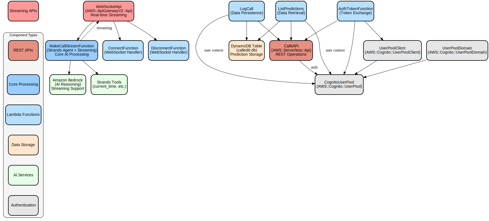

# CalledIt: A Serverless Prediction Verification Platform

CalledIt is a serverless web application that converts natural language predictions into structured, verifiable formats using AI agents. Built on AWS serverless architecture, it provides a robust platform for creating, managing, and validating predictions with **intelligent verifiability categorization**.

The application combines AWS Cognito for authentication, AWS Lambda for serverless compute, and DynamoDB for data persistence. The frontend is built with React and TypeScript, providing a responsive and intuitive user interface. The backend leverages **Strands agents** for AI orchestration, Amazon Bedrock for reasoning, and **real-time WebSocket streaming** for immediate user feedback during prediction processing.

## 🎯 Key Innovation: Verifiability Categorization

CalledIt automatically classifies every prediction into one of **5 verifiability categories**, enabling future automated verification:

- 🧠 **Agent Verifiable** - Pure reasoning/knowledge (e.g., "The sun will rise tomorrow")
- ⏰ **Current Tool Verifiable** - Time-based verification (e.g., "It's past 11 PM")
- 🔧 **Strands Tool Verifiable** - Mathematical/computational (e.g., "Calculate compound interest")
- 🌐 **API Tool Verifiable** - External data required (e.g., "Bitcoin will hit $100k")
- 👤 **Human Verifiable Only** - Subjective assessment (e.g., "I will feel happy")

Each prediction includes AI-generated reasoning for its categorization, creating a structured foundation for automated verification systems.

## Repository Structure
```
.
├── backend/                      # Backend serverless application
│   └── calledit-backend/
│       ├── handlers/            # Lambda function handlers
│       │   ├── auth_token/      # Cognito token management
│       │   ├── strands_make_call/ # Strands agent with streaming
│       │   ├── websocket/       # WebSocket connection handlers
│       │   ├── list_predictions/# Retrieve user predictions
│       │   └── write_to_db/     # DynamoDB write operations
│       ├── template.yaml        # SAM template for AWS resources
│       └── tests/               # Backend unit tests
├── frontend/                    # React TypeScript frontend
│   ├── src/
│   │   ├── components/         # React components with category display
│   │   ├── services/          # API, auth, and WebSocket services
│   │   ├── types/             # TypeScript interfaces (CallResponse)
│   │   └── utils/             # Utility functions
│   └── package.json           # Frontend dependencies
├── testing/                     # Comprehensive testing framework
│   ├── automation/             # Automated testing tools
│   ├── verifiability/         # Verifiability category tests
│   ├── verifiability_category_tests.py # Main test suite (100% success)
│   └── requirements.txt        # Testing dependencies
├── strands/                     # Strands agent development
│   ├── demos/                  # Agent development examples
│   └── my_agent/               # Custom agent implementation
├── docs/                       # Comprehensive documentation
│   ├── API.md                  # REST and WebSocket API documentation
│   ├── TRD.md                  # Technical Requirements Document
│   ├── TESTING.md              # Testing strategy and coverage
│   └── infra.svg               # Infrastructure diagram
└── CHANGELOG.md                # Version history and feature tracking
```

## Usage Instructions
### Prerequisites
- Node.js 16.x or later
- Python 3.12
- AWS CLI configured with appropriate credentials
- AWS SAM CLI installed
- Docker (for local development)
- **Strands agents library** (installed via pip)

### Installation

#### Backend Setup
```bash
# Set up virtual environment
python -m venv venv
source venv/bin/activate  # On Windows: venv\Scripts\activate

# Navigate to backend directory
cd backend/calledit-backend

# Install Python dependencies (including Strands)
pip install -r requirements.txt

# Deploy to AWS
sam build
sam deploy --guided
```

#### Frontend Setup
```bash
# Navigate to frontend directory
cd frontend

# Install dependencies
npm install

# Create .env file from example
cp .env.example .env

# Update environment variables with your AWS configuration
# Add both REST API and WebSocket URLs from the backend deployment
# VITE_API_URL=https://your-api-gateway-url
# VITE_WEBSOCKET_URL=wss://your-websocket-api-url
```

#### Testing Setup
```bash
# Install testing dependencies
pip install -r testing/requirements.txt

# Validate deployment with automated tests
python testing/verifiability_category_tests.py wss://your-websocket-url/prod
```

### Quick Start
1. Start the frontend development server:
```bash
cd frontend
npm run dev
```

2. Open your browser to `http://localhost:5173`

3. Log in using your Cognito credentials

4. Create a prediction using streaming:
   - Click "Streaming Call" tab
   - Enter your prediction in the input field
   - Click "Make Call" and watch real-time AI processing
   - See the **verifiability category** with visual badge and reasoning
   - Review the generated verification method
   - Click "Log Call" to save your prediction with category

### More Detailed Examples

#### Making a Streaming Prediction with Verifiability Categorization
The application uses Strands agents for intelligent prediction processing with automatic categorization:

```typescript
// Example streaming prediction flow
1. User enters: "Bitcoin will hit $100k before 3pm today"
2. Strands agent processes with tools:
   - current_time tool for date/time context
   - Reasoning model for verification method generation
   - Verifiability categorization analysis
3. Real-time streaming shows:
   - "Processing your prediction with AI agent..."
   - "[Using tool: current_time]"
   - Generated verification method with timezone handling
   - Category analysis and reasoning
4. Final structured output with verifiability categorization:
{
  "prediction_statement": "Bitcoin will reach $100,000 before 15:00:00 on 2025-01-27",
  "verification_date": "2025-01-27T15:00:00Z",
  "verifiable_category": "api_tool_verifiable",
  "category_reasoning": "Verifying Bitcoin's price requires real-time financial data through external APIs",
  "verification_method": {
    "source": ["CoinGecko API", "CoinMarketCap"],
    "criteria": ["BTC/USD price exceeds $100,000 before 15:00 UTC"],
    "steps": ["Check BTC price at 15:00:00 on January 27, 2025"]
  },
  "date_reasoning": "Converted 3pm to 15:00 24-hour format for precision"
}
```

#### UI Display with Category Badges
The frontend displays verifiability categories with visual indicators:

```
Call Details:
- Prediction: "Bitcoin will hit $100k before 3pm today"
- Verification Date: 1/27/2025, 3:00:00 PM
- Verifiability: 🌐 API Verifiable
- Category Reasoning: "Verifying Bitcoin's price requires real-time financial data..."
- Status: PENDING
```

### Troubleshooting

#### Common Issues

1. **WebSocket Connection Issues**
```bash
# Check WebSocket API deployment
aws apigatewayv2 get-apis

# Verify WebSocket URL in frontend .env
# VITE_WEBSOCKET_URL=wss://your-websocket-id.execute-api.region.amazonaws.com/prod
```

2. **Strands Agent Errors**
```bash
# Check agent function logs
sam logs -n MakeCallStreamFunction --stack-name calledit-backend

# Verify Strands dependencies in requirements.txt
# strands-agents>=0.1.0
# strands-agents-tools>=0.1.0
```

3. **Streaming Issues**
- Ensure WebSocket permissions are configured
- Check connection timeout settings (5 minutes default)
- Verify Bedrock streaming permissions:
```bash
# Required permissions:
# bedrock:InvokeModel
# bedrock:InvokeModelWithResponseStream
# execute-api:ManageConnections
```

4. **Authentication Issues**
```bash
# Verify Cognito configuration
aws cognito-idp describe-user-pool --user-pool-id YOUR_POOL_ID

# Check user status
aws cognito-idp admin-get-user --user-pool-id YOUR_POOL_ID --username USER_EMAIL
```

5. **Deployment Issues**
```bash
# Check CloudFormation stack status
aws cloudformation describe-stacks --stack-name calledit-backend

# View deployment events
aws cloudformation describe-stack-events --stack-name calledit-backend

# Validate SAM template
sam validate
```

6. **Verifiability Category Issues**
```bash
# Test category classification
python testing/verifiability_category_tests.py

# Check agent logs for category processing
sam logs -n MakeCallStreamFunction --stack-name calledit-backend

# Verify category validation logic
# Categories: agent_verifiable, current_tool_verifiable, strands_tool_verifiable, api_tool_verifiable, human_verifiable_only
```

## Data Flow
The application follows a serverless event-driven architecture with real-time streaming capabilities.

```ascii
User -> Cognito Auth -> WebSocket API -> Strands Agent -> Bedrock (Reasoning)
                    |                      |              |
                    |                      -> Tools -> Real-time Stream
                    |
                    -> REST API -> Lambda Functions -> DynamoDB
```

Key component interactions:
1. User authenticates through Cognito user pool
2. **WebSocket connection** established for real-time streaming
3. **Strands agent** orchestrates between reasoning model and tools
4. **Streaming responses** sent back to frontend via WebSocket
5. Bedrock provides AI reasoning with **InvokeModelWithResponseStream**
6. Tools (current_time, etc.) provide context to the agent
7. Final predictions stored in DynamoDB via REST API
8. Frontend receives real-time updates during processing

## Infrastructure


The application uses the following AWS resources:

### API Gateways
- **CallitAPI** (AWS::Serverless::Api): REST API for CRUD operations
  - Handles authentication and data persistence
  - Implements CORS and Cognito authorization
- **WebSocketApi** (AWS::ApiGatewayV2::Api): Real-time streaming
  - Handles WebSocket connections for streaming responses
  - Routes: $connect, $disconnect, makecall

### Lambda Functions
- **MakeCallStreamFunction**: Strands agent with streaming via WebSocket
- **ConnectFunction/DisconnectFunction**: WebSocket connection management
- **LogCall**: Writes predictions to DynamoDB
- **ListPredictions**: Retrieves user predictions
- **AuthTokenFunction**: Handles Cognito token exchange

### AI & Orchestration
- **Strands Agents**: Orchestrate between reasoning models and tools
- **Amazon Bedrock**: AI reasoning with streaming support
- **Custom Tools**: current_time, date parsing utilities

### Authentication
- **CognitoUserPool**: Manages user authentication
- **UserPoolClient**: Configures OAuth flows
- **UserPoolDomain**: Provides hosted UI for authentication

### Database
- **DynamoDB** table "calledit-db" for storing predictions and verification data

### Key Features
- **🎯 Verifiability Categorization**: Automatic classification into 5 categories with AI reasoning
- **⚡ Real-time Streaming**: WebSocket-based streaming for immediate feedback
- **🤖 Agent Orchestration**: Strands agents coordinate AI reasoning and tool usage
- **🌍 Timezone Intelligence**: Automatic timezone handling and 12/24-hour conversion
- **📋 Structured Verification**: AI-generated verification methods with reasoning
- **🧪 Automated Testing**: 100% success rate testing suite for all categories
- **📊 Visual Category Display**: Beautiful UI badges with icons and explanations
- **💾 Complete Data Persistence**: Categories and reasoning stored in DynamoDB
- **📢 "Crying" System**: Celebrate successful predictions with notifications and social sharing
- **📧 Email Notifications**: Get notified when your predictions are verified as TRUE

## Deployment

### Production Deployment

#### Prerequisites
- AWS CLI configured with deployment permissions
- Virtual environment activated
- All dependencies installed

#### Backend Deployment
```bash
# Activate virtual environment
source venv/bin/activate

# Navigate to backend
cd backend/calledit-backend

# Build and deploy
sam build
sam deploy --no-confirm-changeset

# Note the output URLs:
# - REST API URL for VITE_API_URL
# - WebSocket URL for VITE_WEBSOCKET_URL
```

#### Frontend Deployment
```bash
# Navigate to frontend
cd frontend

# Update environment variables
# Edit .env with URLs from backend deployment
VITE_API_URL=https://your-api-gateway-url/Prod
VITE_WEBSOCKET_URL=wss://your-websocket-url/prod

# Build for production
npm run build

# Deploy dist/ folder to your hosting service
# (AWS S3 + CloudFront, Netlify, Vercel, etc.)
```

#### Deployment Validation
```bash
# Run automated tests to verify deployment
python testing/verifiability_category_tests.py wss://your-websocket-url/prod

# Expected: 100% test success rate across all 5 categories
```

## Testing

### Automated Verifiability Testing
The project includes a comprehensive automated testing suite that validates the 5-category verifiability system:

```bash
# Run the complete test suite
python testing/verifiability_category_tests.py

# Expected output:
# 🚀 Starting Verifiability Category Tests
# ✅ Agent Verifiable - Natural Law
# ✅ Current Tool Verifiable - Time Check  
# ✅ Strands Tool Verifiable - Math Calculation
# ✅ API Tool Verifiable - Market Data
# ✅ Human Verifiable Only - Subjective Feeling
# 📊 Success Rate: 100.0%
```

### Test Categories
- **Unit Tests**: Backend Lambda functions (`/backend/calledit-backend/tests/`)
- **Integration Tests**: API endpoints and WebSocket flows
- **End-to-End Tests**: Complete verifiability categorization validation
- **Performance Tests**: Real-time streaming and response times

See [docs/TESTING.md](docs/TESTING.md) for comprehensive testing documentation.

## Documentation

### Core Documentation
- **[CHANGELOG.md](CHANGELOG.md)** - Version history and feature releases
- **[docs/API.md](docs/API.md)** - REST and WebSocket API documentation
- **[docs/TRD.md](docs/TRD.md)** - Technical Requirements Document
- **[docs/TESTING.md](docs/TESTING.md)** - Testing strategy and coverage

### Additional Resources
- **[docs/infra.svg](docs/infra.svg)** - Infrastructure architecture diagram
- **[testing/README.md](testing/README.md)** - Testing framework overview
- **[strands/demos/](strands/demos/)** - Strands agent development examples

### Environment Configuration

#### Backend Environment Variables
- Managed automatically by AWS SAM template
- Cognito User Pool and Client IDs auto-configured
- DynamoDB table name: `calledit-db`

#### Frontend Environment Variables
```bash
# .env file
VITE_API_URL=https://your-api-gateway-url/Prod
VITE_WEBSOCKET_URL=wss://your-websocket-url/prod
VITE_APIGATEWAY=https://your-api-gateway-url/Prod
```

### Monitoring & Maintenance

#### Health Checks
```bash
# Check API health
curl https://your-api-gateway-url/Prod/hello

# Check WebSocket connectivity
# Use browser dev tools or WebSocket testing tool
```

#### Log Monitoring
```bash
# View Lambda function logs
sam logs -n MakeCallStreamFunction --stack-name calledit-backend --tail

# View all function logs
aws logs describe-log-groups --log-group-name-prefix /aws/lambda/calledit-backend
```

#### Performance Monitoring
- **CloudWatch Metrics**: Lambda invocations, duration, errors
- **API Gateway Metrics**: Request count, latency, 4XX/5XX errors
- **DynamoDB Metrics**: Read/write capacity, throttling

### Rollback Procedures

#### Backend Rollback
```bash
# Rollback to previous version
aws cloudformation cancel-update-stack --stack-name calledit-backend

# Or deploy previous version
git checkout previous-commit
sam build && sam deploy --no-confirm-changeset
```

#### Frontend Rollback
```bash
# Rollback to previous build
git checkout previous-commit
npm run build
# Redeploy dist/ folder
```

## Project Status

### Current Version: v1.2.0 - Phase 2 Complete
- ✅ **Verifiability Categorization System**: Complete 5-category classification
- ✅ **Real-time Streaming**: WebSocket-based AI processing
- ✅ **Automated Testing**: 100% success rate test suite
- ✅ **Visual UI**: Category badges with reasoning display
- ✅ **Data Persistence**: Complete DynamoDB integration
- ✅ **Comprehensive Documentation**: API, TRD, and testing docs
- 🆕 **Automated Verification System**: Strands agent processes ALL predictions every 15 minutes
- 🆕 **Production Deployment**: EventBridge scheduling, S3 logging, SNS notifications
- 🆕 **Frontend Integration**: Real-time verification status display with confidence scores
- 🆕 **Tool Gap Analysis**: MCP tool suggestions for missing verification capabilities
- 🆕 **"Crying" Notifications**: Email alerts for successful predictions with social sharing setup

### ✅ **PHASE 2 COMPLETE: Automated Verification System**
- 🤖 **Strands Verification Agent**: AI-powered prediction verification with 5-category routing
- ⏰ **Automated Processing**: Every 15 minutes via EventBridge, processes ALL predictions
- 🎯 **Real-time Status Updates**: Frontend displays actual verification results (inconclusive, tool_gap, true, false)
- 📊 **Tool Gap Detection**: Automatic MCP tool suggestions for missing capabilities
- 📧 **Smart Notifications**: SNS email alerts for verified TRUE predictions
- 🗂️ **Complete Audit Trail**: S3 logging with structured JSON for analysis
- 💾 **Database Integration**: DynamoDB updates with verification status, confidence, and reasoning

### Future Roadmap (Phase 3+)
- 🌐 **MCP Tool Integration**: Weather, sports, and financial API tools
- 📊 **Analytics Dashboard**: User statistics and accuracy tracking
- 📱 **Mobile Application**: React Native mobile app
- 📢 **Social Media Integration**: Auto-post successful predictions to Twitter, LinkedIn, Facebook
- 🏆 **Leaderboards**: Community prediction accuracy rankings
- 🎉 **Crying Dashboard**: Showcase your successful predictions with social proof

See [CHANGELOG.md](CHANGELOG.md) for detailed version history.

## Contributing

When contributing to CalledIt:
1. Follow the testing requirements in [docs/TESTING.md](docs/TESTING.md)
2. Ensure all verifiability category tests pass
3. Update documentation for new features
4. Maintain the 5-category classification system integrity

## License

This project is part of an educational/research initiative focused on AI-powered prediction verification systems.