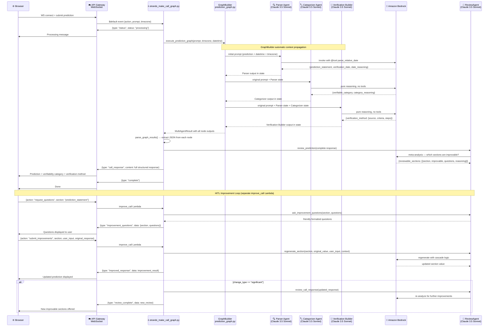
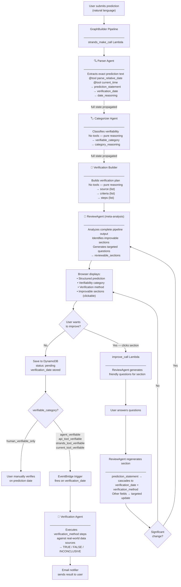
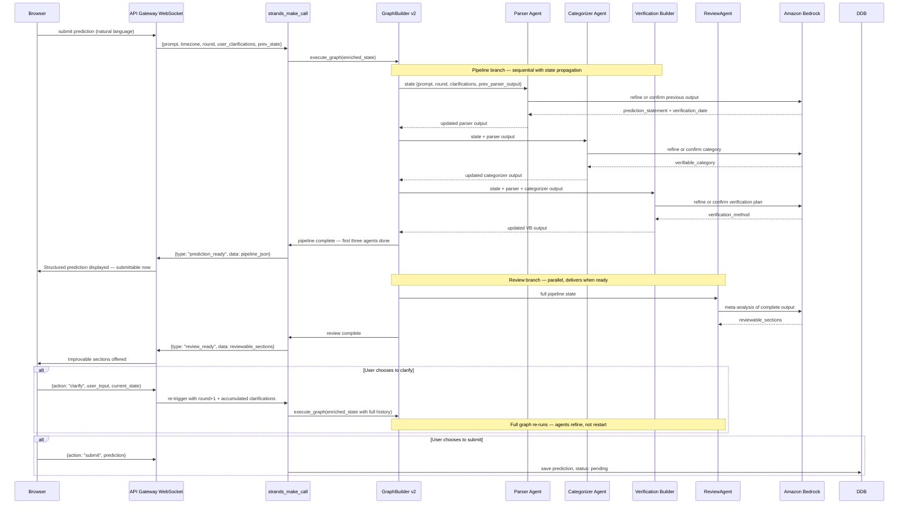
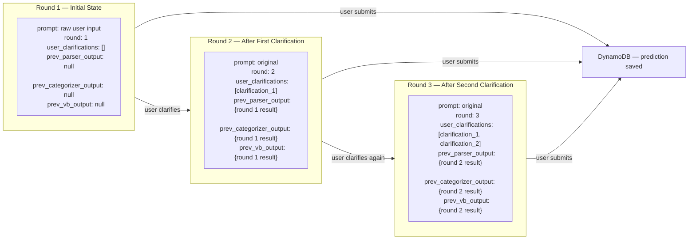

# CalledIt — Architecture Diagrams

GenAI portfolio reference · Strands GraphBuilder + HITL Improvement Loop + EventBridge Verification

---

## Diagram 1: Runtime Request Flow

What happens when a user submits a prediction — from browser through the GraphBuilder pipeline, ReviewAgent, and HITL improvement loop

> **Key insight:** The GraphBuilder handles context propagation automatically — each agent receives the original task plus all prior agents' outputs without manual state management. The ReviewAgent sits outside the graph as a fourth meta-analysis agent. The HITL loop runs in a separate Lambda (`improve_call.py`) triggered by distinct WebSocket actions.

---

## Diagram 2: Module Dependency Graph

How the files import each other across the two Lambda functions

```mermaid
graph TD
    subgraph MakeCall["λ strands_make_call — Prediction Pipeline Lambda"]
        SH["strands_make_call_graph.py
        ─────────────────────
        • lambda_handler() entry point
        • WebSocket event routing
        • Streaming callback handler
        • Calls execute_prediction_graph()
        • Calls ReviewAgent for meta-analysis"]

        PG["prediction_graph.py
        ─────────────────────
        • GraphBuilder setup
        • create_prediction_graph()
        • execute_prediction_graph()
        • parse_graph_results()
        • extract_json_from_text()
        • Singleton: prediction_graph"]

        GS["graph_state.py
        ─────────────────────
        • PredictionGraphState (TypedDict)
        • VerificationMethod (TypedDict)
        • ReviewableSection (TypedDict)
        • State schema for all agents"]

        subgraph Agents["Pipeline Agent Modules"]
            PA["parser_agent.py
            • create_parser_agent()
            • @tool parse_relative_date
            • @tool current_time (strands_tools)
            • PARSER_SYSTEM_PROMPT"]

            CA["categorizer_agent.py
            • create_categorizer_agent()
            • No tools (pure reasoning)
            • 5 verifiability categories
            • CATEGORIZER_SYSTEM_PROMPT"]

            VBA["verification_builder_agent.py
            • create_verification_builder_agent()
            • No tools (pure reasoning)
            • Builds source/criteria/steps
            • VERIFICATION_BUILDER_SYSTEM_PROMPT"]
        end

        RA["review_agent.py
        ─────────────────────
        • ReviewAgent class
        • review_prediction()
        • generate_improvement_questions()
        • regenerate_section()
        • Cascade logic for prediction_statement"]

        UT["utils.py
        • get_current_datetime_in_timezones()
        • convert_local_to_utc()"]
    end

    subgraph ImproveCall["λ improve_call — HITL Improvement Lambda"]
        IC["improve_call.py
        ─────────────────────
        • lambda_handler()
        • action: request_questions
        • action: submit_improvements
        • Conditional re-review trigger"]
    end

    subgraph Verification["λ verify_predictions — EventBridge Lambda"]
        VP["verify_predictions.py
        • PredictionVerificationRunner
        • Scans DDB for pending predictions
        • Runs verification batch"]

        VA["verification_agent.py
        • PredictionVerificationAgent
        • Executes verification_method steps
        • Returns TRUE/FALSE/INCONCLUSIVE"]

        DDB2["ddb_scanner.py
        • query_pending_predictions()"]

        EN["email_notifier.py
        • Notifies user of result"]
    end

    subgraph AWS["AWS Services"]
        BED["🤖 Amazon Bedrock
        (Claude 3.5 Sonnet)"]
        DDB["🗄️ DynamoDB"]
        EB["⏰ EventBridge
        (scheduled trigger)"]
    end

    SH -->|"calls"| PG
    SH -->|"calls"| RA
    SH -->|"calls"| UT
    PG -->|"imports"| PA
    PG -->|"imports"| CA
    PG -->|"imports"| VBA
    PG -->|"uses schema"| GS

    IC -->|"imports"| RA

    PA & CA & VBA & RA -->|"Strands Agent SDK"| BED
    VA -->|"Strands Agent SDK"| BED

    VP -->|"imports"| VA
    VP -->|"imports"| DDB2
    VP -->|"imports"| EN
    DDB2 -->|"boto3"| DDB
    SH -->|"boto3"| DDB

    EB -->|"triggers on prediction date"| VP
```

> **Key insight:** Two separate Lambdas handle two distinct workflows — the GraphBuilder pipeline (initial prediction processing) and the HITL improvement loop. A third EventBridge-triggered Lambda runs verification on the prediction date using the machine-executable instructions the Verification Builder produced. The graph is compiled once as a module-level singleton in `prediction_graph.py` and reused on warm invocations.

---

## Diagram 3: Full System Flow — Prediction Lifecycle

From user submission through improvement loop to eventual verification on prediction date

> **Notice:** The verifiability category set by the Categorizer Agent directly determines the end-of-lifecycle path — human verification vs. autonomous agent verification. This is the design decision that makes agent-verifiable predictions genuinely useful: the Verification Builder writes machine-executable instructions specifically so the verification agent can run them without human involvement. The HITL improvement loop exists precisely to give users the chance to make a prediction more specific before it gets locked in — improving the chance the verification agent can resolve it autonomously.

---

## Proposed v2 Architecture

Redesign replacing the current separate-Lambda HITL loop with a single unified graph, stateful round-trip refinement, and parallel branch delivery.

### Key design changes from v1

**1. ReviewAgent joins the graph as a parallel branch**
Rather than running outside the graph in a separate invocation, ReviewAgent becomes a fourth node in the graph, executing in parallel after the pipeline completes. The first three agents' JSON is returned to the client immediately via WebSocket as soon as they finish. ReviewAgent's meta-analysis arrives as a second push when ready. The human has a usable result from round one without waiting for review.

**2. Full graph re-trigger on clarification (replaces improve_call Lambda)**
When the user provides clarification, the entire graph re-runs with the accumulated state. The separate `improve_call` Lambda and its hardcoded cascade logic (`regenerate_section()`) are eliminated. Agents decide for themselves whether new information requires them to update their previous output.

**3. Stateful PredictionGraphState carries full round history**
The state schema gains three new fields:
- `round` — integer, increments with each re-trigger
- `user_clarifications` — list of strings, accumulates across all rounds so round 3 agents see what was clarified in rounds 1 and 2
- Previous agent outputs pre-populated in initial state for round 2+

Each agent's system prompt instructs: "You are refining a prediction. Your previous output is in the state. Review it in light of any new clarifications — confirm it if it stands, update it if the new information makes a more precise version possible. We are iterating toward greater specificity with each round."

**4. Human can submit at any time**
The first-round result is complete and submittable immediately. Clarification rounds are opportunity, not gate. The user can choose zero, one, or multiple refinement cycles before submitting.

**5. Social media blast remains deterministic at pipeline end**
Unchanged from v1 — once a prediction is verified correct, the blast is a deterministic post-pipeline step.

---

### v2 Diagram 1: Unified Graph with Parallel Branch

---

### v2 Diagram 2: State Schema Evolution Across Rounds

> **Key insight:** Each round the agents receive the full history of what was decided before and what the user has added. They are not re-doing prior work — they are standing on it. A prediction that starts vague becomes progressively more precise and verifiable with each cycle, and each agent only updates its section if the new information makes a better version possible.

---

### v2 Change Summary

| | v1 | v2 |
|---|---|---|
| ReviewAgent location | Outside graph, separate invocation | Inside graph, parallel branch |
| HITL mechanism | Separate `improve_call` Lambda | Full graph re-trigger |
| Cascade logic | Hardcoded in `regenerate_section()` | Agent judgment from accumulated state |
| State across rounds | Not preserved — regenerate from scratch | Full history in PredictionGraphState |
| Client delivery | Single response after all agents complete | Two pushes: pipeline first, review when ready |
| Clarification cycles | Bounded by `improve_call` design | Unlimited — each round enriches the state |
