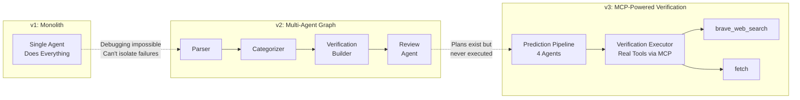
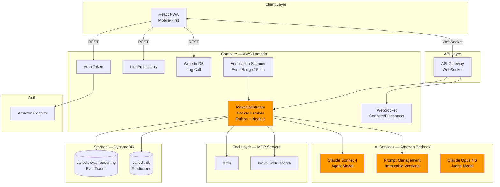
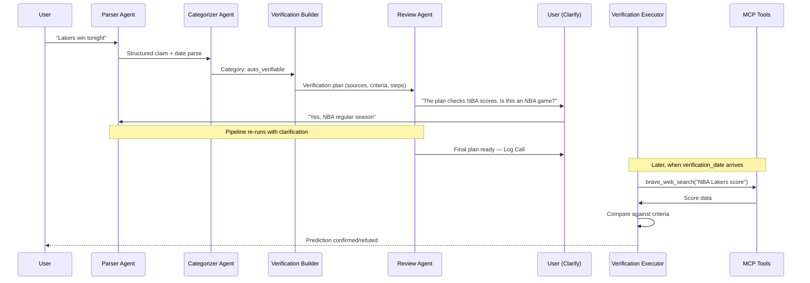
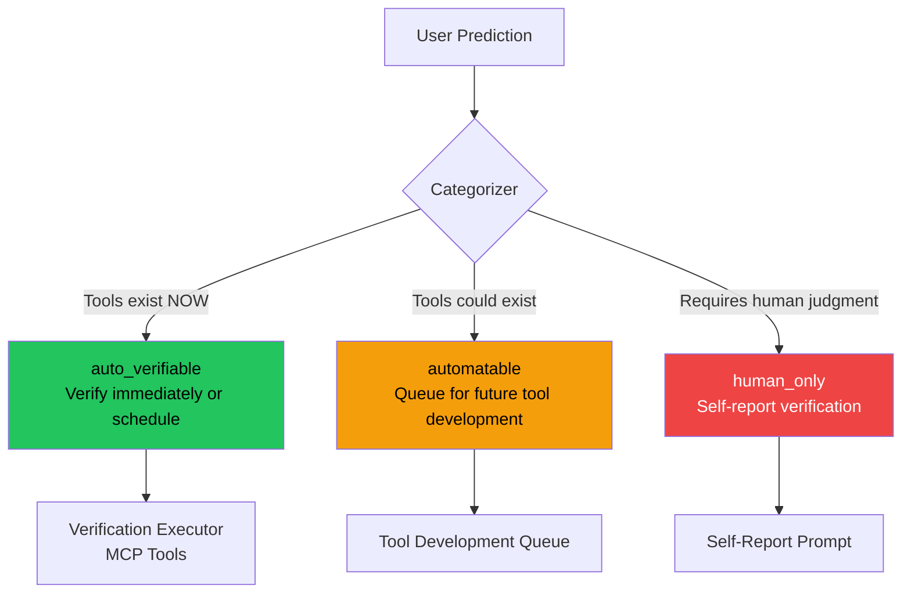
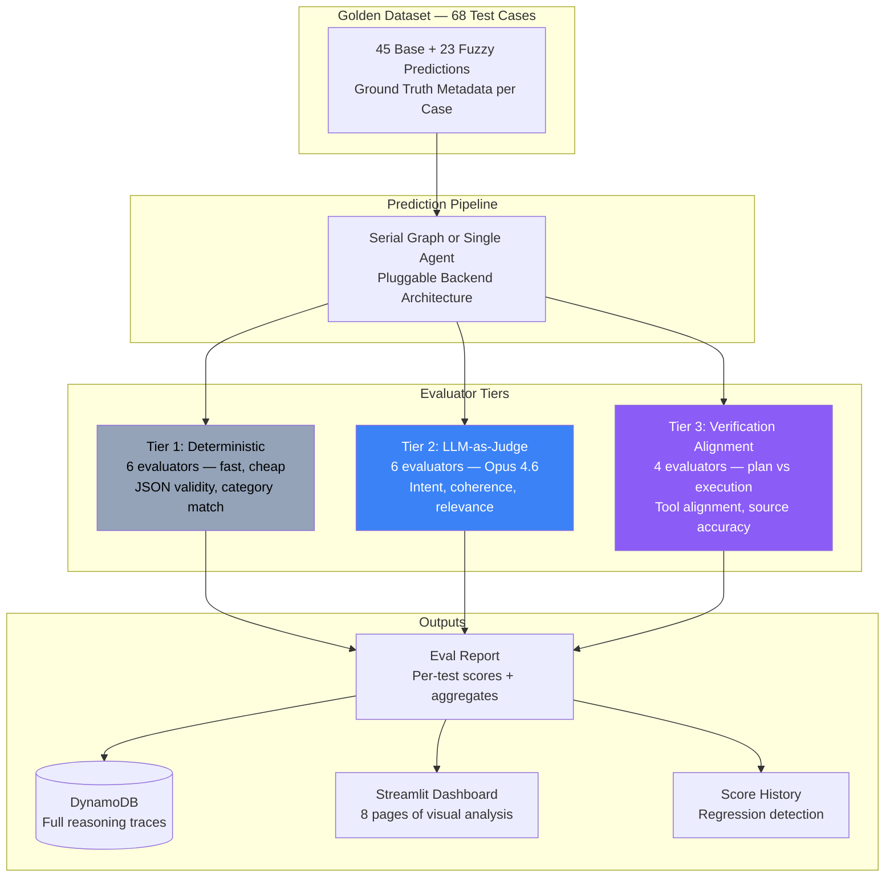
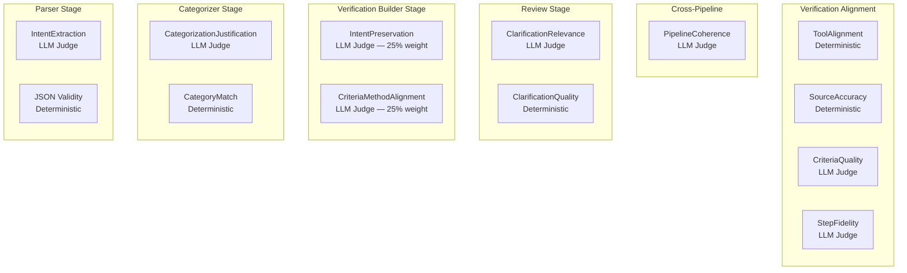
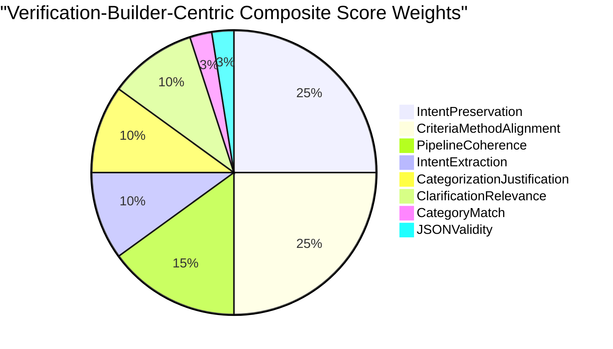
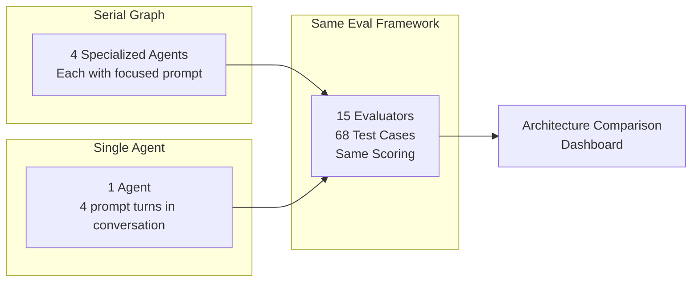
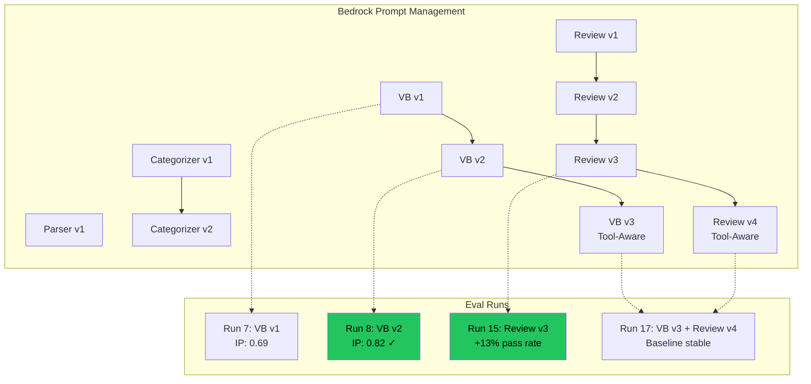
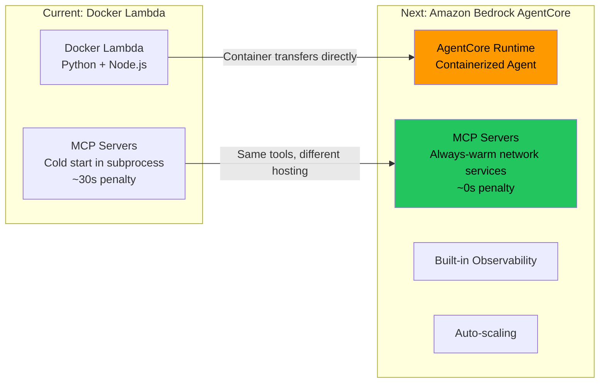

# CalledIt: An AWS AI Solutions Architecture Case Study

> From the perspective of a PE AI Solutions Architect advising a portfolio company on building production-grade agentic AI systems with measurable quality guarantees.

---

## The Business Problem

A portfolio company wants to build an AI-powered prediction verification platform. Users make natural language predictions ("Lakers win tonight", "Bitcoin hits $100k by Friday"), and the system must:

1. Understand the user's intent precisely
2. Determine if the prediction can be machine-verified
3. Build an actionable verification plan
4. Execute that plan using real data sources at the right time
5. Prove the system works through measurable evaluation

The PE firm needs confidence that this AI system delivers reliable, measurable value — not just impressive demos.

---

## Architecture Evolution: Three Phases of Maturity

### Why This Matters for PE

Each phase represents a common maturity curve PE portfolio companies go through:

- **v1 → v2**: Moving from prototype to debuggable system. The eval framework proved multi-agent didn't improve output quality — but it made the system observable and each component independently improvable.
- **v2 → v3**: Moving from planning to execution. The system now actually verifies predictions using real tools, not just writes plans about how it would.

---

## AWS Service Architecture

### Key Architecture Decisions for PE Context

| Decision | Rationale | PE Relevance |
|----------|-----------|--------------|
| Serverless (Lambda + DynamoDB) | Near-zero idle cost, pay-per-use | Portfolio companies need cost efficiency during validation phase |
| Docker Lambda for MCP | Enables real tool execution via Node.js subprocesses | Stepping stone to AgentCore — shows migration planning |
| Bedrock Prompt Management | Immutable prompt versions tied to eval runs | Audit trail — you can prove which prompts produced which results |
| Cognito Auth | Managed auth with mobile auto-refresh | Enterprise-ready auth without custom implementation |

---

## The Agent Pipeline: How Predictions Flow

### Three Verifiability Categories

---

## The Eval Framework: Proving AI Quality to Stakeholders

This is the most transferable artifact for PE portfolio companies. It answers the question every PE firm asks: **"How do you know this AI system actually works?"**

### Evaluator Coverage Map

### The Composite Score: What Actually Predicts Success

The weights reflect a key insight: **categorization accuracy is a routing hint, not the goal.** The real question is whether the Verification Builder produces a plan that actually works when executed. IntentPreservation and CriteriaMethodAlignment get the highest weight because they directly measure "can this plan be executed to verify the prediction?"

---

## Architecture Comparison: Data-Driven Decisions

### Results: Architectures Are Essentially Tied

| Metric | Serial Graph | Single Agent |
|--------|-------------|--------------|
| Pass Rate | 35% | 37% |
| Composite Score | 0.52 | 0.52 |
| Intent Preservation | 0.81 | 0.79 |
| Criteria-Method Alignment | 0.75 | 0.77 |
| auto_verifiable accuracy | 100% | 71% |
| Parser JSON validity | 96% | 94% |

The key finding: **the shared failure profile.** Both architectures fail on the same predictions for the same reasons. ClarificationRelevance (the Review Agent asking useful questions) is the bottleneck on both. The architecture doesn't matter as much as the prompts.

This is exactly the kind of data-driven insight PE firms need — it prevents portfolio companies from spending months on architecture rewrites when the real issue is prompt quality.

---

## Prompt Management: Audit Trail for AI Decisions

Every eval run records which prompt versions produced which scores. This creates an audit trail: you can prove that VB v2 improved IntentPreservation from 0.69 to 0.82, and that Review v3 produced the biggest single-prompt gain in the project (+13% pass rate).

---

## Migration Path: Lambda → AgentCore

The Docker Lambda architecture was deliberately chosen as a stepping stone. The container-based packaging transfers directly to AgentCore's deployment model, but with always-warm MCP servers instead of cold-starting subprocesses. The 30-second cold start on Lambda validates this migration as the right next step.

---

## What This Demonstrates for PE Portfolio Companies

### 1. Systematic AI Quality Measurement
Not "the demo looked good" but "here are 68 test cases, 15 evaluators, and 17 eval runs showing measurable improvement over time." This is how you de-risk AI investments.

### 2. Cost-Efficient Architecture Choices
Serverless-first (near-zero idle cost), with a clear migration path to managed services (AgentCore) as the system matures. Portfolio companies don't need to over-invest in infrastructure during validation.

### 3. Prompt Management as Version Control for AI
Immutable prompt versions tied to eval runs create an audit trail. When a PE firm asks "what changed and why did quality improve?", you can point to specific prompt versions and their measured impact.

### 4. Architecture Decisions Driven by Data, Not Opinions
The pluggable backend system proved that serial graph and single agent architectures are essentially tied — preventing a costly architecture rewrite. The eval framework is the decision-making tool.

### 5. Production Readiness Indicators
- Real tool execution (not mocked)
- EventBridge-triggered verification (decoupled from user interaction)
- DynamoDB reasoning traces (full observability)
- Cognito auth (enterprise-ready)
- All tests hit real services (Decision 78: no mocks)

---

## AWS Services Used (Complete List)

| Service | Purpose | Why This Service |
|---------|---------|-----------------|
| Amazon Bedrock | Foundation model inference (Sonnet 4, Opus 4.6) | Managed, multi-model, prompt management built-in |
| Bedrock Prompt Management | Immutable prompt versions | Audit trail, rollback capability, eval correlation |
| AWS Lambda | Compute (6 functions) | Serverless, pay-per-use, Docker support for MCP |
| Amazon DynamoDB | Predictions, eval reasoning, tool registry | Serverless, pay-per-request, TTL for eval data |
| Amazon API Gateway | WebSocket API | Real-time streaming to mobile client |
| Amazon Cognito | Authentication | Managed auth with mobile token refresh |
| Amazon EventBridge | Verification scheduler (15-min rule) | Serverless cron, decouples verification from prediction |
| AWS CloudFormation/SAM | Infrastructure as Code | Reproducible deployments, prompt stack separation |
| Strands Agents SDK | Agent framework | Open-source, Bedrock-native, graph + tools support |
| Strands Evals SDK | Evaluation framework | OutputEvaluator, TrajectoryEvaluator base classes |
| MCP (Model Context Protocol) | Tool execution | Standard protocol, portable across runtimes |

---

## 85 Architectural Decisions, Documented

Every decision in this project is numbered, sourced to a project update, and includes rationale. Examples relevant to PE advisory:

- **Decision 44**: Verification criteria is the primary eval target, not categorization — reframed the entire measurement strategy
- **Decision 50**: Isolated single-variable testing — change one thing per eval run, know exactly what helped
- **Decision 62**: Composite score weights need empirical grounding — don't optimize against judgment-call metrics
- **Decision 78**: No mocks — all tests hit real services, because mocks hide real bugs
- **Decision 81**: Scanner-only verification in production — simplicity over cleverness

This level of decision documentation is what PE firms should expect from portfolio companies building AI systems. It's the difference between "we built an AI thing" and "we made 85 deliberate architectural choices, each with documented rationale and measured impact."
