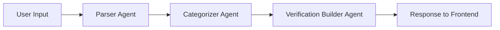

# Strands Graph Flow: 3-Agent Prediction Verification

This document provides a detailed walkthrough of how predictions flow through the 3-agent graph system, from user input to final response.

**Last Updated**: 2025-01-19  
**Production Status**: ✅ Deployed and working correctly

## Overview

The CalledIt prediction verification system uses a **Strands Graph** with **3 specialized agents** orchestrated through **plain Agent nodes** where the Graph automatically propagates outputs between agents.

### Architecture Pattern

- **Sequential workflow**: Parser → Categorizer → Verification Builder
- **Plain Agent nodes**: Agents added directly to the graph (correct Strands pattern)
- **Automatic output propagation**: Graph handles passing results between agents
- **JSON extraction after execution**: Parse results via `result.results[node_id].result`
- **No manual state management**: Graph's `_build_node_input()` handles everything

### Key Insight from Official Strands Documentation

**The Graph automatically propagates outputs between nodes!**

- Entry nodes receive the original task
- Dependent nodes receive: original task + results from all completed dependencies
- No custom state management needed
- Parse JSON after graph execution, not during

**Reference**: [Strands Graph Documentation](https://strandsagents.com/latest/documentation/docs/user-guide/concepts/multi-agent/graph/)

## High-Level Flow Diagram



**Note**: A 4th agent (Review Agent) is planned for future implementation.

---

## Detailed Flow Walkthrough

### Example Prediction

Let's trace a prediction through the entire system:

**User Input**: "it will snow tonight"  
**Timezone**: "America/New_York"  
**Current Time**: "2026-01-18 13:24:33 EST"

---

## Step 1: User Submits Prediction

**Frontend sends WebSocket message**:
```json
{
    "action": "makecall",
    "prompt": "it will snow tonight",
    "timezone": "America/New_York"
}
```

---

## Step 2: Lambda Handler Receives Request

**File**: `backend/calledit-backend/handlers/strands_make_call/strands_make_call_graph.py`

**Lambda extracts**:
- `connection_id` (for WebSocket streaming)
- `user_prompt`: "it will snow tonight"
- `user_timezone`: "America/New_York"
- `current_datetime_utc`: "2026-01-18 18:24:33 UTC"
- `current_datetime_local`: "2026-01-18 13:24:33 EST"

**Builds initial prompt with context**:
```python
initial_prompt = f"""PREDICTION: {user_prompt}
CURRENT DATE: {current_datetime_local}
TIMEZONE: {user_timezone}

Extract the prediction and parse the verification date."""
```

**Sends processing status**:
```json
{
    "type": "status",
    "status": "processing",
    "message": "Processing your prediction with 3-agent graph..."
}
```

---

## Step 3: Graph Execution Begins

**File**: `backend/calledit-backend/handlers/strands_make_call/prediction_graph.py`

```python
# Graph receives initial_prompt and starts at entry point: "parser"
result = prediction_graph(initial_prompt, callback_handler=callback_handler)
```

The graph executes nodes sequentially: `parser` → `categorizer` → `verification_builder`

**How the Graph Works**:
1. Parser receives the initial prompt
2. Categorizer receives: initial prompt + Parser's output
3. Verification Builder receives: initial prompt + Parser's output + Categorizer's output

**The Graph handles all of this automatically!**

---

## 🔵 Node 1: Parser Agent

**File**: `backend/calledit-backend/handlers/strands_make_call/parser_agent.py`  
**Pattern**: Plain Agent node (added directly to graph)

**Responsibility**: Extract exact prediction text and parse time references

### Agent Configuration

```python
parser_agent = Agent(
    model="anthropic.claude-3-5-sonnet-20241022-v2:0",
    tools=[parse_relative_date, current_time],
    system_prompt=PARSER_PROMPT
)
```

### Input Received

The Parser is the **entry node**, so it receives the initial prompt:

```
PREDICTION: it will snow tonight
CURRENT DATE: 2026-01-18 13:24:33 EST
TIMEZONE: America/New_York

Extract the prediction and parse the verification date.
```

### Agent Processing

1. **Analyzes** the prediction text
2. **Uses** `parse_relative_date` tool to parse "tonight"
3. **Converts** "tonight" → "22:00" (10 PM)
4. **Converts** to 24-hour format
5. **Returns** JSON response

### Agent Output

```json
{
    "prediction_statement": "it will snow tonight",
    "verification_date": "2026-01-18 22:00:00",
    "date_reasoning": "Parsed 'tonight' as 22:00 (10 PM) in user's timezone (America/New_York). The term 'tonight' refers to the evening hours of the current day, typically around 10 PM."
}
```

**This output is automatically passed to the next node by the Graph!**

---

## 🟢 Node 2: Categorizer Agent

**File**: `backend/calledit-backend/handlers/strands_make_call/categorizer_agent.py`  
**Pattern**: Plain Agent node (added directly to graph)

**Responsibility**: Classify prediction into one of 5 verifiability categories

### Agent Configuration

```python
categorizer_agent = Agent(
    model="anthropic.claude-3-5-sonnet-20241022-v2:0",
    system_prompt=CATEGORIZER_PROMPT
)
```

### Input Received

The Categorizer receives **both** the original prompt **and** the Parser's output:

```
PREDICTION: it will snow tonight
CURRENT DATE: 2026-01-18 13:24:33 EST
TIMEZONE: America/New_York

Extract the prediction and parse the verification date.

[Parser's JSON output from above]
```

**The Graph automatically combines these!**

### Agent Processing

1. **Analyzes** the prediction: "Weather prediction"
2. **Determines** it needs external API data
3. **Selects** category: `api_tool_verifiable`
4. **Provides** detailed reasoning
5. **Returns** JSON response

### Agent Output

```json
{
    "verifiable_category": "api_tool_verifiable",
    "category_reasoning": "This is a weather prediction ('it will snow tonight') that requires checking actual weather conditions. Weather verification needs access to weather data through external APIs or weather services. While it's a straightforward yes/no verification, it cannot be determined through pure reasoning, current time, or calculation tools. Only real-time or historical weather data from an external source can verify if it actually snowed on the specified date and location."
}
```

**This output is automatically passed to the next node by the Graph!**

---

## 🟡 Node 3: Verification Builder Agent

**File**: `backend/calledit-backend/handlers/strands_make_call/verification_builder_agent.py`  
**Pattern**: Plain Agent node (added directly to graph)

**Responsibility**: Construct detailed verification method (source, criteria, steps)

### Agent Configuration

```python
verification_builder_agent = Agent(
    model="anthropic.claude-3-5-sonnet-20241022-v2:0",
    system_prompt=VERIFICATION_BUILDER_PROMPT
)
```

### Input Received

The Verification Builder receives the original prompt **and** outputs from **both** previous agents:

```
PREDICTION: it will snow tonight
CURRENT DATE: 2026-01-18 13:24:33 EST
TIMEZONE: America/New_York

Extract the prediction and parse the verification date.

[Parser's JSON output]

[Categorizer's JSON output]
```

**The Graph automatically combines all of these!**

### Agent Processing

1. **Analyzes** the prediction and category
2. **Creates** verification plan for weather prediction
3. **Specifies** multiple reliable sources
4. **Defines** measurable criteria
5. **Outlines** detailed verification steps
6. **Returns** JSON response

### Agent Output

```json
{
    "verification_method": {
        "source": [
            "National Weather Service (weather.gov) historical data",
            "Weather API services (OpenWeatherMap, WeatherAPI)",
            "Local weather station records for the prediction location",
            "NOAA Climate Data Online"
        ],
        "criteria": [
            "Snowfall accumulation greater than 0 inches recorded",
            "Precipitation type classified as snow (not rain or mixed)",
            "Weather observation timestamp falls within 'tonight' timeframe (evening of 2026-01-18)",
            "Multiple independent sources confirm snowfall occurrence",
            "Location-specific data matches user's timezone area"
        ],
        "steps": [
            "Identify the specific location based on user's timezone (America/New_York region)",
            "Query weather APIs for historical data at verification time (2026-01-18 22:00:00 EST)",
            "Check National Weather Service archives for snowfall reports on 2026-01-18 evening",
            "Verify precipitation type was classified as snow in weather records",
            "Confirm snowfall accumulation amount (any measurable amount constitutes 'snow')",
            "Cross-reference at least 2-3 independent weather data sources",
            "Document the verification result with source citations"
        ]
    }
}
```

**This is the final output from the graph!**

---

## Step 4: Graph Execution Completes

**File**: `backend/calledit-backend/handlers/strands_make_call/prediction_graph.py`

The graph returns a `MultiAgentResult` with results from all nodes:

```python
result = prediction_graph(initial_prompt, callback_handler=callback_handler)

# result.results contains outputs from each node:
# result.results["parser"] = AgentResult with Parser's JSON
# result.results["categorizer"] = AgentResult with Categorizer's JSON
# result.results["verification_builder"] = AgentResult with Verification Builder's JSON
```

### Parsing Graph Results

We parse the JSON from each agent **after** graph execution:

```python
def parse_graph_results(result) -> Dict[str, Any]:
    """Extract and parse JSON from all agent outputs"""
    parsed_data = {}
    
    # Parse parser output
    if "parser" in result.results:
        parser_result = str(result.results["parser"].result)
        json_text = extract_json_from_text(parser_result)
        parser_data = json.loads(json_text)
        parsed_data["prediction_statement"] = parser_data.get("prediction_statement", "")
        parsed_data["verification_date"] = parser_data.get("verification_date", "")
        parsed_data["date_reasoning"] = parser_data.get("date_reasoning", "")
    
    # Parse categorizer output
    if "categorizer" in result.results:
        categorizer_result = str(result.results["categorizer"].result)
        json_text = extract_json_from_text(categorizer_result)
        categorizer_data = json.loads(json_text)
        parsed_data["verifiable_category"] = categorizer_data.get("verifiable_category", "")
        parsed_data["category_reasoning"] = categorizer_data.get("category_reasoning", "")
    
    # Parse verification builder output
    if "verification_builder" in result.results:
        verification_result = str(result.results["verification_builder"].result)
        json_text = extract_json_from_text(verification_result)
        verification_data = json.loads(json_text)
        parsed_data["verification_method"] = verification_data.get("verification_method", {})
    
    return parsed_data
```

### Final Parsed Data

```python
final_data = {
    # Parser outputs
    "prediction_statement": "it will snow tonight",
    "verification_date": "2026-01-18 22:00:00",
    "date_reasoning": "Parsed 'tonight' as 22:00 (10 PM)...",
    
    # Categorizer outputs
    "verifiable_category": "api_tool_verifiable",
    "category_reasoning": "This is a weather prediction...",
    
    # Verification Builder outputs
    "verification_method": {
        "source": ["National Weather Service...", ...],
        "criteria": ["Snowfall accumulation...", ...],
        "steps": ["Identify the specific location...", ...]
    }
}
```

---

## Step 5: Lambda Handler Formats Response

**File**: `backend/calledit-backend/handlers/strands_make_call/strands_make_call_graph.py`

Lambda converts the parsed data into the expected API response format:

```python
response_data = {
    "prediction_statement": "it will snow tonight",
    "verification_date": "2026-01-19T03:00:00Z",  # Converted to UTC
    "prediction_date": "2026-01-18T18:24:33Z",    # When prediction was made (UTC)
    "timezone": "UTC",                             # Always UTC for storage
    "user_timezone": "America/New_York",           # User's original timezone
    "local_prediction_date": "2026-01-18 13:24:33 EST",  # Local time representation
    "verifiable_category": "api_tool_verifiable",
    "category_reasoning": "This is a weather prediction...",
    "verification_method": {
        "source": ["National Weather Service...", ...],
        "criteria": ["Snowfall accumulation...", ...],
        "steps": ["Identify the specific location...", ...]
    },
    "initial_status": "pending",
    "date_reasoning": "Parsed 'tonight' as 22:00 (10 PM)..."
}
```

---

## Step 6: Response Sent to Frontend

**Via WebSocket**:

1. **Call Response**:
```json
{
    "type": "call_response",
    "content": "{...response_data as JSON string...}"
}
```

2. **Completion Status**:
```json
{
    "type": "complete",
    "status": "ready"
}
```

Frontend receives the response and displays it to the user.

---

## Key Concepts

### Plain Agent Pattern (Current Implementation)

**The correct Strands pattern for JSON workflows**:

```python
from strands import Agent
from strands.multiagent import GraphBuilder

# Create agents
parser_agent = Agent(model="...", system_prompt="...", tools=[...])
categorizer_agent = Agent(model="...", system_prompt="...")
verification_builder_agent = Agent(model="...", system_prompt="...")

# Build graph with plain agents
builder = GraphBuilder()
builder.add_node(parser_agent, "parser")
builder.add_node(categorizer_agent, "categorizer")
builder.add_node(verification_builder_agent, "verification_builder")
builder.add_edge("parser", "categorizer")
builder.add_edge("categorizer", "verification_builder")
builder.set_entry_point("parser")
graph = builder.build()

# Execute graph
result = graph("Initial prompt with context")

# Parse JSON results after execution
parser_output = str(result.results["parser"].result)
parser_data = json.loads(extract_json_from_text(parser_output))
```

**Why this pattern works**:
- Graph automatically propagates outputs between agents
- No manual state management needed
- Simpler and more maintainable
- Follows official Strands documentation

### JSON Extraction Helper

Since agents may wrap JSON in markdown code blocks, we use a helper function:

```python
def extract_json_from_text(text: str) -> str:
    """
    Extract JSON from text that might be wrapped in markdown or have extra text.
    
    Tries multiple strategies:
    1. Direct JSON parse (if text is already clean JSON)
    2. Extract from ```json ... ``` markdown blocks
    3. Extract from ``` ... ``` code blocks
    4. Find JSON object/array in text
    """
    import re
    
    text = text.strip()
    
    # Strategy 1: Direct parse
    if text.startswith('{') or text.startswith('['):
        return text
    
    # Strategy 2: Extract from ```json ... ```
    json_block_match = re.search(r'```json\s*\n(.*?)\n```', text, re.DOTALL)
    if json_block_match:
        return json_block_match.group(1).strip()
    
    # ... more strategies ...
    
    return text
```

This provides robust JSON extraction regardless of how the agent formats its response.

### Output Flow Visualization

Outputs flow through the graph automatically:

```
Initial Prompt
    ↓
    [Parser Agent]
    ↓
Parser's JSON Output
    ↓
    [Categorizer Agent receives: Initial Prompt + Parser Output]
    ↓
Categorizer's JSON Output
    ↓
    [Verification Builder receives: Initial Prompt + Parser Output + Categorizer Output]
    ↓
Verification Builder's JSON Output
    ↓
Parse all JSON after execution
```

**Key principle**: The Graph handles all output propagation automatically. We just parse the results at the end.

---

## Streaming and Callbacks

Throughout the graph execution, the **callback handler** streams events to the frontend via WebSocket:

### Event Types

1. **Text Generation**:
```json
{"type": "text", "content": "Analyzing prediction..."}
```

2. **Tool Usage**:
```json
{"type": "tool", "name": "parse_relative_date", "input": {...}}
```

3. **Status Updates**:
```json
{"type": "status", "status": "processing"}
```

4. **Lifecycle Events**:
- `init_event_loop`: Event loop initialized
- `start_event_loop`: Event loop cycle starting
- `complete`: Processing complete
- `force_stop`: Agent force-stopped

The callback handler is passed to the graph execution, allowing real-time streaming of all agent activities.

### Callback Handler Implementation

```python
def create_streaming_callback(connection_id, api_gateway_client):
    """Create comprehensive callback handler for graph streaming"""
    
    def callback_handler(**kwargs):
        try:
            # Text generation events
            if "data" in kwargs:
                api_gateway_client.post_to_connection(
                    ConnectionId=connection_id,
                    Data=json.dumps({"type": "text", "content": kwargs["data"]})
                )
            
            # Tool usage events
            elif "current_tool_use" in kwargs and kwargs["current_tool_use"].get("name"):
                api_gateway_client.post_to_connection(
                    ConnectionId=connection_id,
                    Data=json.dumps({
                        "type": "tool",
                        "name": kwargs["current_tool_use"]["name"],
                        "input": kwargs["current_tool_use"].get("input", {})
                    })
                )
            
            # Lifecycle events
            elif kwargs.get("complete"):
                api_gateway_client.post_to_connection(
                    ConnectionId=connection_id,
                    Data=json.dumps({"type": "status", "status": "complete"})
                )
                
        except Exception as e:
            # Graceful error handling - don't crash agent
            logger.error(f"Callback error: {str(e)}", exc_info=True)
            # Don't re-raise - callback errors shouldn't stop execution
    
    return callback_handler
```

---

## Error Handling

Error handling is simple and follows Strands best practices:

### JSON Parsing Errors

```python
try:
    json_text = extract_json_from_text(agent_output)
    data = json.loads(json_text)
except json.JSONDecodeError as e:
    logger.error(f"JSON parsing failed: {str(e)}")
    # Use fallback values
    data = {
        "prediction_statement": user_prompt,
        "verifiable_category": "human_verifiable_only",
        "verification_method": {
            "source": ["Manual verification"],
            "criteria": ["Human judgment required"],
            "steps": ["Manual review needed"]
        }
    }
```

### Graph Execution Errors

```python
try:
    result = prediction_graph(initial_prompt, callback_handler=callback_handler)
    parsed_data = parse_graph_results(result)
except Exception as e:
    logger.error(f"Graph execution failed: {str(e)}", exc_info=True)
    # Return error state with fallback values
    return {
        "error": f"Graph execution failed: {str(e)}",
        "prediction_statement": user_prompt,
        "verifiable_category": "human_verifiable_only",
        # ... other fallback values
    }
```

---

## File Reference

### Core Files

- **Graph Definition**: `backend/calledit-backend/handlers/strands_make_call/prediction_graph.py`
- **Lambda Handler**: `backend/calledit-backend/handlers/strands_make_call/strands_make_call_graph.py`

### Agent Files

- **Parser Agent**: `backend/calledit-backend/handlers/strands_make_call/parser_agent.py`
- **Categorizer Agent**: `backend/calledit-backend/handlers/strands_make_call/categorizer_agent.py`
- **Verification Builder Agent**: `backend/calledit-backend/handlers/strands_make_call/verification_builder_agent.py`

### Documentation

- **Design Document**: `.kiro/specs/strands-graph-refactor/design.md`
- **Best Practices**: `.kiro/steering/strands-best-practices.md`
- **Tasks**: `.kiro/specs/strands-graph-refactor/tasks.md`
- **Cleanup Log**: `.kiro/specs/strands-graph-refactor/CLEANUP_LOG.md`

---

## Summary

The 3-agent graph system provides a clean, maintainable architecture for prediction verification:

1. **Separation of concerns**: Each agent has one focused responsibility
2. **Automatic output propagation**: Graph handles passing results between agents
3. **Simple JSON parsing**: Extract and parse after graph execution
4. **Streaming**: Real-time feedback via WebSocket callbacks
5. **Error handling**: Graceful fallbacks with simple try/except blocks
6. **Testability**: Each agent can be tested in isolation

**The plain Agent pattern is the key to this architecture**, following official Strands documentation and trusting the framework to handle complexity.

---

## Educational Note

This implementation represents the **correct** Strands pattern discovered after consulting official documentation. Earlier attempts used custom nodes with manual state management, which added unnecessary complexity.

**Key lesson**: Always consult official framework documentation before implementing patterns. The simpler solution is often the correct solution.

**References**:
- [Strands Graph User Guide](https://strandsagents.com/latest/documentation/docs/user-guide/concepts/multi-agent/graph/)
- [Input Propagation](https://strandsagents.com/latest/documentation/docs/user-guide/concepts/multi-agent/graph/#input-propagation)
- [Custom Nodes (for deterministic logic only)](https://strandsagents.com/latest/documentation/docs/user-guide/concepts/multi-agent/graph/#custom-node-types)
