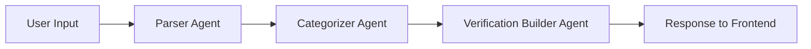

# Strands Graph Flow: 3-Agent Prediction Verification

This document provides a detailed walkthrough of how predictions flow through the 3-agent graph system, from user input to final response.

## Overview

The CalledIt prediction verification system uses a **Strands Graph** with **3 specialized agents** orchestrated through **custom nodes** that manage state transformation between agents.

### Architecture Pattern

- **Sequential workflow**: Parser → Categorizer → Verification Builder
- **Custom nodes**: Each agent wrapped in `StateManagingAgentNode` for state management
- **Structured data flow**: JSON parsing and prompt building at each step
- **State accumulation**: Each agent adds fields to shared state dict

## High-Level Flow Diagram



**Note**: A 4th agent (Review Agent) is planned but not yet implemented.

---

## Detailed Flow Walkthrough

### Example Prediction

Let's trace a prediction through the entire system:

**User Input**: "it will snow tonight"  
**Timezone**: "America/New_York"  
**Current Time**: "2026-01-18 13:24:33 EST"

---

## Step 1: User Submits Prediction

**Frontend sends WebSocket message**:
```json
{
    "action": "makecall",
    "prompt": "it will snow tonight",
    "timezone": "America/New_York"
}
```

---

## Step 2: Lambda Handler Receives Request

**File**: `backend/calledit-backend/handlers/strands_make_call/strands_make_call_graph.py`

**Lambda extracts**:
- `connection_id` (for WebSocket streaming)
- `user_prompt`: "it will snow tonight"
- `user_timezone`: "America/New_York"
- `current_datetime_utc`: "2026-01-18 18:24:33 UTC"
- `current_datetime_local`: "2026-01-18 13:24:33 EST"

**Creates initial state**:
```python
initial_state = {
    "user_prompt": "it will snow tonight",
    "user_timezone": "America/New_York",
    "current_datetime_utc": "2026-01-18 18:24:33 UTC",
    "current_datetime_local": "2026-01-18 13:24:33 EST"
}
```

**Sends processing status**:
```json
{
    "type": "status",
    "status": "processing",
    "message": "Processing your prediction with 3-agent graph..."
}
```

---

## Step 3: Graph Execution Begins

**File**: `backend/calledit-backend/handlers/strands_make_call/prediction_graph.py`

```python
# Graph receives initial_state and starts at entry point: "parser"
result = prediction_graph(initial_state, callback_handler=callback_handler)
```

The graph executes nodes sequentially: `parser` → `categorizer` → `verification_builder`

---

## 🔵 Node 1: Parser Agent

**File**: `backend/calledit-backend/handlers/strands_make_call/parser_agent.py`  
**Wrapper**: `StateManagingAgentNode` in `custom_node.py`

**Responsibility**: Extract exact prediction text and parse time references

### Flow Inside Custom Node

#### 1. Receive State
```python
state = {
    "user_prompt": "it will snow tonight",
    "user_timezone": "America/New_York",
    "current_datetime_utc": "2026-01-18 18:24:33 UTC",
    "current_datetime_local": "2026-01-18 13:24:33 EST"
}
```

#### 2. Build Prompt
**Function**: `build_parser_prompt(state)`

```
PREDICTION: it will snow tonight
CURRENT DATE: 2026-01-18 13:24:33 EST
TIMEZONE: America/New_York

Extract the prediction and parse the verification date.
```

#### 3. Invoke Parser Agent
- Agent uses `parse_relative_date` tool to parse "tonight"
- Tool converts "tonight" → "22:00" (10 PM)
- Agent converts to 24-hour format
- Agent returns JSON response

**Agent Response**:
```json
{
    "prediction_statement": "it will snow tonight",
    "verification_date": "2026-01-18 22:00:00",
    "date_reasoning": "Parsed 'tonight' as 22:00 (10 PM) in user's timezone"
}
```

#### 4. Parse Response
**Function**: `parse_parser_response(response, state)`

Extracts fields from JSON and validates structure.

#### 5. Update State
```python
updated_state = {
    # Original fields (preserved)
    "user_prompt": "it will snow tonight",
    "user_timezone": "America/New_York",
    "current_datetime_utc": "2026-01-18 18:24:33 UTC",
    "current_datetime_local": "2026-01-18 13:24:33 EST",
    
    # New fields (added by Parser)
    "prediction_statement": "it will snow tonight",
    "verification_date": "2026-01-18 22:00:00",
    "date_reasoning": "Parsed 'tonight' as 22:00 (10 PM) in user's timezone"
}
```

**State now has 7 fields** (4 original + 3 new)

#### 6. Return Result
```python
return MultiAgentResult(
    status=Status.COMPLETED,
    state=updated_state  # Passed to next node
)
```

---

## 🟢 Node 2: Categorizer Agent

**File**: `backend/calledit-backend/handlers/strands_make_call/categorizer_agent.py`  
**Wrapper**: `StateManagingAgentNode` in `custom_node.py`

**Responsibility**: Classify prediction into one of 5 verifiability categories

### Flow Inside Custom Node

#### 1. Receive State (from Parser)
```python
state = {
    "user_prompt": "it will snow tonight",
    "user_timezone": "America/New_York",
    "current_datetime_utc": "2026-01-18 18:24:33 UTC",
    "current_datetime_local": "2026-01-18 13:24:33 EST",
    "prediction_statement": "it will snow tonight",
    "verification_date": "2026-01-18 22:00:00",
    "date_reasoning": "Parsed 'tonight' as 22:00 (10 PM) in user's timezone"
}
```

#### 2. Build Prompt
**Function**: `build_categorizer_prompt(state)`

```
PREDICTION: it will snow tonight
VERIFICATION DATE: 2026-01-18 22:00:00

Categorize this prediction's verifiability.
```

#### 3. Invoke Categorizer Agent
- Agent analyzes: "Weather prediction needs external API"
- Agent selects category: `api_tool_verifiable`
- Agent provides reasoning
- Agent returns JSON response

**Agent Response**:
```json
{
    "verifiable_category": "api_tool_verifiable",
    "category_reasoning": "Weather predictions require real-time weather API data to verify. Cannot be determined through reasoning alone or simple tools."
}
```

#### 4. Parse Response
**Function**: `parse_categorizer_response(response, state)`

Validates category is in valid set:
- `agent_verifiable`
- `current_tool_verifiable`
- `strands_tool_verifiable`
- `api_tool_verifiable` ✓
- `human_verifiable_only`

#### 5. Update State
```python
updated_state = {
    # All previous fields (preserved)
    "user_prompt": "it will snow tonight",
    "user_timezone": "America/New_York",
    "current_datetime_utc": "2026-01-18 18:24:33 UTC",
    "current_datetime_local": "2026-01-18 13:24:33 EST",
    "prediction_statement": "it will snow tonight",
    "verification_date": "2026-01-18 22:00:00",
    "date_reasoning": "Parsed 'tonight' as 22:00 (10 PM) in user's timezone",
    
    # New fields (added by Categorizer)
    "verifiable_category": "api_tool_verifiable",
    "category_reasoning": "Weather predictions require real-time weather API data..."
}
```

**State now has 9 fields** (7 previous + 2 new)

#### 6. Return Result
```python
return MultiAgentResult(
    status=Status.COMPLETED,
    state=updated_state  # Passed to next node
)
```

---

## 🟡 Node 3: Verification Builder Agent

**File**: `backend/calledit-backend/handlers/strands_make_call/verification_builder_agent.py`  
**Wrapper**: `StateManagingAgentNode` in `custom_node.py`

**Responsibility**: Construct detailed verification method (source, criteria, steps)

### Flow Inside Custom Node

#### 1. Receive State (from Categorizer)
```python
state = {
    "user_prompt": "it will snow tonight",
    "user_timezone": "America/New_York",
    "current_datetime_utc": "2026-01-18 18:24:33 UTC",
    "current_datetime_local": "2026-01-18 13:24:33 EST",
    "prediction_statement": "it will snow tonight",
    "verification_date": "2026-01-18 22:00:00",
    "date_reasoning": "Parsed 'tonight' as 22:00 (10 PM) in user's timezone",
    "verifiable_category": "api_tool_verifiable",
    "category_reasoning": "Weather predictions require real-time weather API data..."
}
```

#### 2. Build Prompt
**Function**: `build_verification_builder_prompt(state)`

```
PREDICTION: it will snow tonight
CATEGORY: api_tool_verifiable
VERIFICATION DATE: 2026-01-18 22:00:00

Build a detailed verification method for this prediction.
```

#### 3. Invoke Verification Builder Agent
- Agent creates verification plan for weather prediction
- Agent specifies sources (APIs, databases)
- Agent defines measurable criteria
- Agent outlines verification steps
- Agent returns JSON response

**Agent Response**:
```json
{
    "verification_method": {
        "source": [
            "Weather API (OpenWeatherMap, Weather.gov)",
            "NOAA Weather Service",
            "Local weather station data"
        ],
        "criteria": [
            "Snow accumulation > 0 inches recorded",
            "Precipitation type classified as snow",
            "Observation time between 18:00-23:59 local time",
            "Multiple sources confirm snowfall"
        ],
        "steps": [
            "Query weather API at verification time (22:00 EST)",
            "Check precipitation type and accumulation amount",
            "Verify snow occurred during 'tonight' timeframe (evening hours)",
            "Cross-reference with NOAA and local weather station",
            "Confirm at least 2 sources report snowfall"
        ]
    }
}
```

#### 4. Parse Response
**Function**: `parse_verification_builder_response(response, state)`

Validates structure:
- `source` is a list ✓
- `criteria` is a list ✓
- `steps` is a list ✓

#### 5. Update State
```python
updated_state = {
    # All previous fields (preserved)
    "user_prompt": "it will snow tonight",
    "user_timezone": "America/New_York",
    "current_datetime_utc": "2026-01-18 18:24:33 UTC",
    "current_datetime_local": "2026-01-18 13:24:33 EST",
    "prediction_statement": "it will snow tonight",
    "verification_date": "2026-01-18 22:00:00",
    "date_reasoning": "Parsed 'tonight' as 22:00 (10 PM) in user's timezone",
    "verifiable_category": "api_tool_verifiable",
    "category_reasoning": "Weather predictions require real-time weather API data...",
    
    # New field (added by Verification Builder)
    "verification_method": {
        "source": ["Weather API...", "NOAA...", "Local weather station..."],
        "criteria": ["Snow accumulation > 0 inches...", ...],
        "steps": ["Query weather API...", ...]
    }
}
```

**State now has 10 fields** (9 previous + 1 new)

#### 6. Return Result
```python
return MultiAgentResult(
    status=Status.COMPLETED,
    state=updated_state  # This is the final state
)
```

---

## Step 4: Graph Execution Completes

**File**: `backend/calledit-backend/handlers/strands_make_call/prediction_graph.py`

The graph returns the final state with all accumulated data:

```python
final_state = {
    # Original inputs (4 fields)
    "user_prompt": "it will snow tonight",
    "user_timezone": "America/New_York",
    "current_datetime_utc": "2026-01-18 18:24:33 UTC",
    "current_datetime_local": "2026-01-18 13:24:33 EST",
    
    # Parser outputs (3 fields)
    "prediction_statement": "it will snow tonight",
    "verification_date": "2026-01-18 22:00:00",
    "date_reasoning": "Parsed 'tonight' as 22:00 (10 PM) in user's timezone",
    
    # Categorizer outputs (2 fields)
    "verifiable_category": "api_tool_verifiable",
    "category_reasoning": "Weather predictions require real-time weather API data...",
    
    # Verification Builder outputs (1 field)
    "verification_method": {
        "source": ["Weather API...", "NOAA...", "Local weather station..."],
        "criteria": ["Snow accumulation > 0 inches...", ...],
        "steps": ["Query weather API...", ...]
    }
}
```

**Total: 10 fields in final state**

---

## Step 5: Lambda Handler Formats Response

**File**: `backend/calledit-backend/handlers/strands_make_call/strands_make_call_graph.py`

Lambda converts the final state into the expected API response format:

```python
response_data = {
    "prediction_statement": "it will snow tonight",
    "verification_date": "2026-01-19T03:00:00Z",  # Converted to UTC
    "prediction_date": "2026-01-18T18:24:33Z",    # When prediction was made (UTC)
    "timezone": "UTC",                             # Always UTC for storage
    "user_timezone": "America/New_York",           # User's original timezone
    "local_prediction_date": "2026-01-18 13:24:33 EST",  # Local time representation
    "verifiable_category": "api_tool_verifiable",
    "category_reasoning": "Weather predictions require real-time weather API data...",
    "verification_method": {
        "source": ["Weather API...", "NOAA...", "Local weather station..."],
        "criteria": ["Snow accumulation > 0 inches...", ...],
        "steps": ["Query weather API...", ...]
    },
    "initial_status": "pending",
    "date_reasoning": "Parsed 'tonight' as 22:00 (10 PM) in user's timezone"
}
```

---

## Step 6: Response Sent to Frontend

**Via WebSocket**:

1. **Call Response**:
```json
{
    "type": "call_response",
    "content": "{...response_data as JSON string...}"
}
```

2. **Completion Status**:
```json
{
    "type": "complete",
    "status": "ready"
}
```

Frontend receives the response and displays it to the user.

---

## Key Concepts

### Custom Node Pattern (StateManagingAgentNode)

**File**: `backend/calledit-backend/handlers/strands_make_call/custom_node.py`

Each custom node acts as a wrapper that:

1. **Receives** state dict from previous node
2. **Builds** a prompt from that state (via prompt builder function)
3. **Invokes** its agent with the prompt
4. **Parses** the JSON response (via response parser function)
5. **Updates** the state with new fields
6. **Returns** the updated state to the next node

**Why custom nodes are necessary**:
- Our agents return **structured JSON** (not conversational text)
- We need to **parse** that JSON and **validate** it
- We need to **build prompts** from accumulated state
- Strands Graph requires nodes to be **Agent or MultiAgentBase objects** (not plain functions)

### State Flow Visualization

State flows like a snowball rolling downhill, accumulating data at each step:

```
Initial State (4 fields)
    ↓
    [Parser Node]
    ↓
State with Parser outputs (7 fields)
    ↓
    [Categorizer Node]
    ↓
State with Categorizer outputs (9 fields)
    ↓
    [Verification Builder Node]
    ↓
Final State (10 fields)
```

**Key principle**: Each agent only adds its specific outputs, preserving everything from previous agents.

### Prompt Building

Each node has a **prompt builder function** that constructs the agent's prompt from the current state:

```python
def build_parser_prompt(state: Dict) -> str:
    return f"""PREDICTION: {state.get('user_prompt', '')}
CURRENT DATE: {state.get('current_datetime_local', '')}
TIMEZONE: {state.get('user_timezone', 'UTC')}

Extract the prediction and parse the verification date."""
```

This allows each agent to receive exactly the information it needs from previous agents.

### Response Parsing

Each node has a **response parser function** that extracts data from the agent's JSON response:

```python
def parse_parser_response(response: str, state: Dict) -> Dict:
    try:
        result = json.loads(response)
        return {
            **state,  # Preserve all previous fields
            "prediction_statement": result.get("prediction_statement", ""),
            "verification_date": result.get("verification_date", ""),
            "date_reasoning": result.get("date_reasoning", "")
        }
    except json.JSONDecodeError:
        # Fallback with safe defaults
        return {**state, "prediction_statement": state.get('user_prompt', '')}
```

This handles JSON parsing errors gracefully with fallback values.

---

## Streaming and Callbacks

Throughout the graph execution, the **callback handler** streams events to the frontend via WebSocket:

### Event Types

1. **Text Generation**:
```json
{"type": "text", "content": "Analyzing prediction..."}
```

2. **Tool Usage**:
```json
{"type": "tool", "name": "parse_relative_date", "input": {...}}
```

3. **Status Updates**:
```json
{"type": "status", "status": "processing"}
```

The callback handler is passed to each agent invocation, allowing real-time streaming of the agent's thinking process.

---

## Error Handling

Each custom node includes error handling:

```python
try:
    # Invoke agent and parse response
    response = self.agent(prompt, callback_handler=callback_handler)
    updated_state = self.response_parser(str(response), state)
    return MultiAgentResult(status=Status.COMPLETED, state=updated_state)
    
except Exception as e:
    # Return error state with fallback values
    error_state = {**state, "error": f"{self.name} error: {str(e)}"}
    return MultiAgentResult(status=Status.FAILED, state=error_state)
```

This ensures the graph continues even if one agent fails, using fallback values.

---

## File Reference

### Core Files

- **Graph Definition**: `backend/calledit-backend/handlers/strands_make_call/prediction_graph.py`
- **Custom Node**: `backend/calledit-backend/handlers/strands_make_call/custom_node.py`
- **Lambda Handler**: `backend/calledit-backend/handlers/strands_make_call/strands_make_call_graph.py`

### Agent Files

- **Parser Agent**: `backend/calledit-backend/handlers/strands_make_call/parser_agent.py`
- **Categorizer Agent**: `backend/calledit-backend/handlers/strands_make_call/categorizer_agent.py`
- **Verification Builder Agent**: `backend/calledit-backend/handlers/strands_make_call/verification_builder_agent.py`

### Documentation

- **Design Document**: `.kiro/specs/strands-graph-refactor/design.md`
- **Best Practices**: `.kiro/steering/strands-best-practices.md`
- **Tasks**: `.kiro/specs/strands-graph-refactor/tasks.md`

---

## Summary

The 3-agent graph system provides a clean, maintainable architecture for prediction verification:

1. **Separation of concerns**: Each agent has one focused responsibility
2. **State management**: Custom nodes handle all JSON parsing and prompt building
3. **Streaming**: Real-time feedback via WebSocket callbacks
4. **Error handling**: Graceful fallbacks at each step
5. **Testability**: Each agent can be tested in isolation

The custom node pattern is the key innovation that makes this architecture work, bridging the gap between Strands' conversational agent model and our structured data flow requirements.
