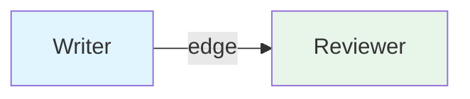
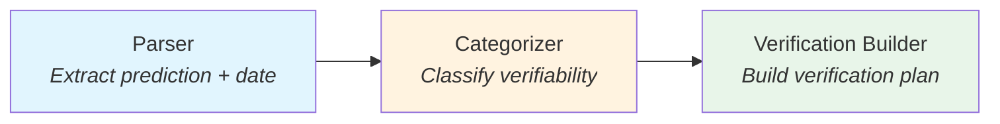
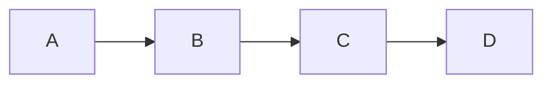
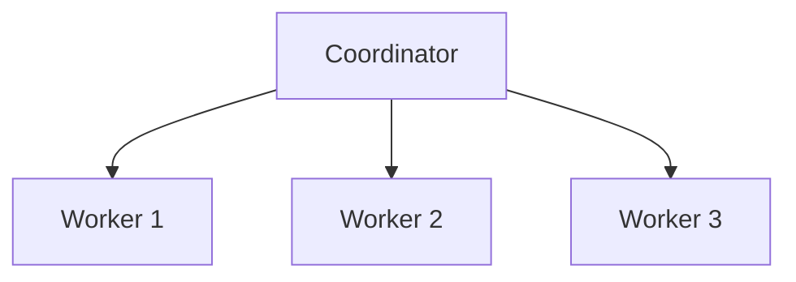
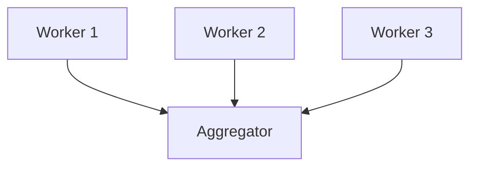
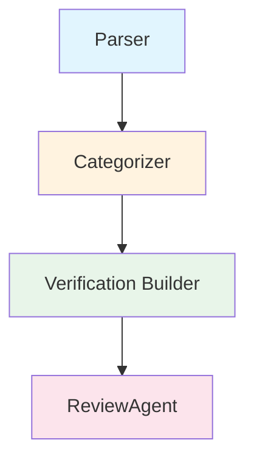
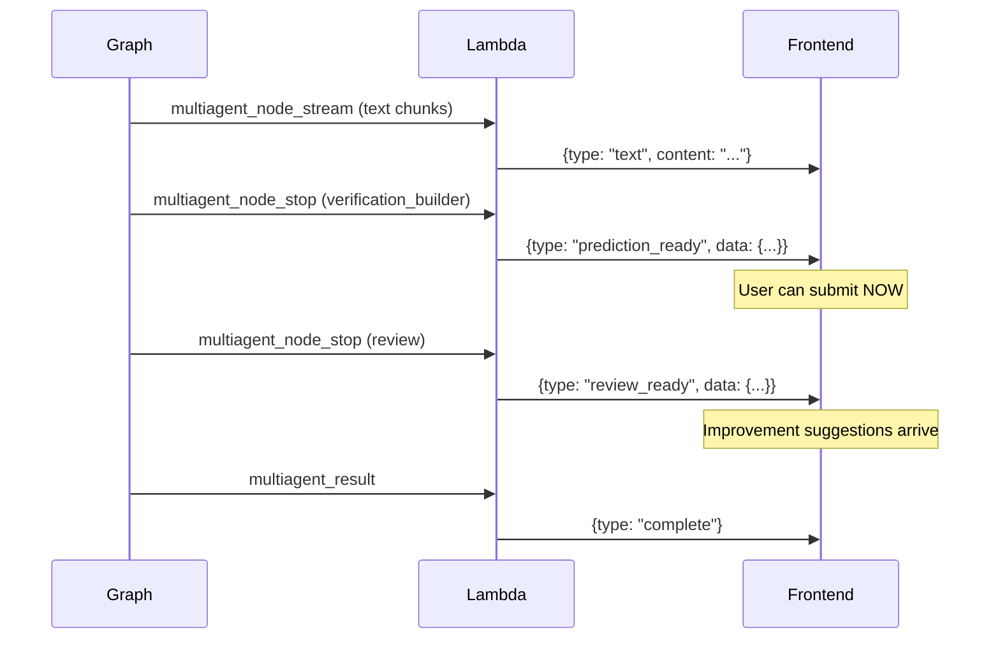
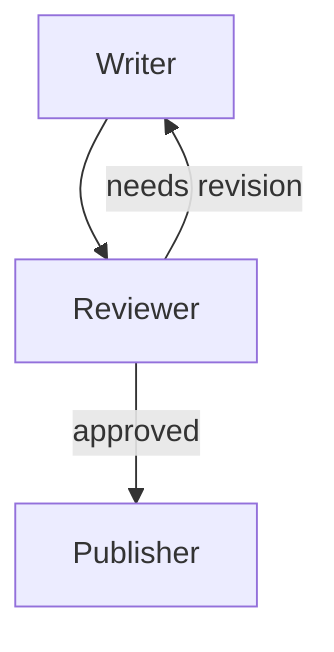
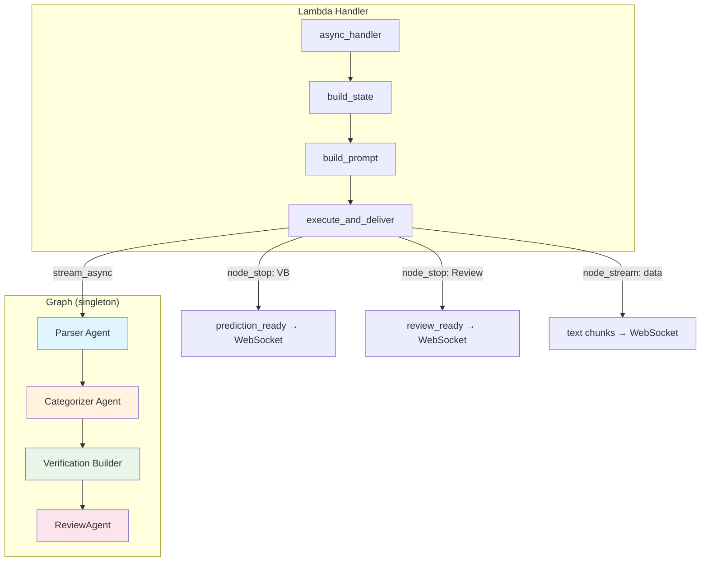
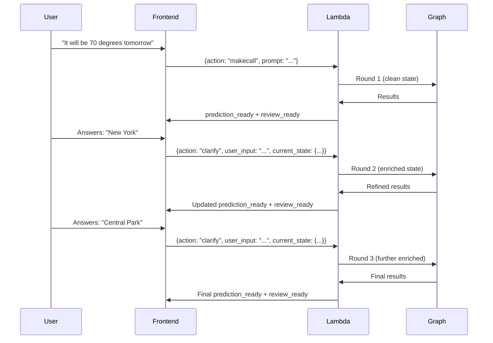

# Strands Graph: From Zero to Production

A layered guide to building multi-agent graphs with the Strands SDK, using CalledIt's prediction verification pipeline as the running example. Each level builds on the previous one — start wherever your experience level is.

---

## Level 1: What Is a Graph? (For Dummies)

### The Problem

You have a task that's too complex for one AI agent. Maybe you need to:
- Parse user input, then categorize it, then build a verification plan
- Research a topic, then fact-check it, then write a report
- Translate text, then review the translation, then format it

You could chain these as function calls, but then you're writing all the glue code: passing outputs between steps, handling errors, managing timeouts, threading context.

### The Solution: A Graph

A Strands Graph is a way to connect multiple AI agents so they execute in a defined order, with outputs automatically flowing from one to the next.

Think of it like an assembly line:

```
Raw Material → Station 1 → Station 2 → Station 3 → Finished Product
```

Each station (agent) does one job. The conveyor belt (graph) moves the work between stations automatically.

### Your First Graph

```python
from strands import Agent
from strands.multiagent import GraphBuilder

# Create two agents — each with a single job
writer = Agent(system_prompt="Write a short paragraph about the given topic.")
reviewer = Agent(system_prompt="Review the writing and suggest improvements.")

# Build the graph
builder = GraphBuilder()
builder.add_node(writer, "writer")       # Station 1
builder.add_node(reviewer, "reviewer")   # Station 2
builder.add_edge("writer", "reviewer")   # Conveyor belt
builder.set_entry_point("writer")        # Start here

graph = builder.build()

# Run it
result = graph("The history of coffee")
print(result)
```

That's it. The writer writes, the reviewer reviews. The graph handles passing the writer's output to the reviewer.

### Key Concepts at This Level

- **Node** = An agent (or any executor) in the graph
- **Edge** = A dependency — "run B after A"
- **Entry point** = Where execution starts
- **GraphResult** = The output after all nodes complete



---

## Level 2: How Data Flows (Input Propagation)

### The Magic: Automatic Context Propagation

The most important thing to understand about Strands Graph is how data flows between nodes. You don't manually pass outputs — the graph does it for you.

**Rule: Each node receives the original task PLUS all completed upstream nodes' outputs.**

```
Node receives:
  Original Task: [your initial prompt]

  Inputs from previous nodes:

  From writer:
    - Writer Agent: [the paragraph about coffee]

  From reviewer:
    - Reviewer Agent: [the review with suggestions]
```

This means:
- The entry node (writer) sees only the original task
- The reviewer sees the original task + the writer's output
- If you add a third node after reviewer, it sees the original task + writer output + reviewer output

### Why This Matters

You don't need to build prompts that say "here's what the previous agent said." The graph formats this automatically. Each agent can focus on its own job — the context arrives for free.

### CalledIt Example: 3-Agent Pipeline



What each agent sees:
- **Parser**: "PREDICTION: It will be 70 degrees tomorrow\nCURRENT DATE: 2026-03-09\nTIMEZONE: America/New_York"
- **Categorizer**: Original task + Parser's JSON `{"prediction_statement": "...", "verification_date": "..."}`
- **Verification Builder**: Original task + Parser's JSON + Categorizer's JSON `{"verifiable_category": "api_tool_verifiable", ...}`

No manual state threading. No prompt construction between agents. The graph handles it.

---

## Level 3: Graph Topologies (Beyond Sequential)

### Sequential Pipeline

The simplest topology — agents run one after another:



```python
builder.add_edge("A", "B")
builder.add_edge("B", "C")
builder.add_edge("C", "D")
```

### Parallel Fan-Out

One node triggers multiple independent nodes:



```python
builder.add_edge("coordinator", "worker1")
builder.add_edge("coordinator", "worker2")
builder.add_edge("coordinator", "worker3")
```

Workers 1, 2, and 3 run concurrently after the coordinator completes.

### Fan-In (Aggregation)

Multiple nodes feed into one:



**Important gotcha:** By default, the aggregator runs as soon as ANY ONE dependency completes — not all of them. If you need all three workers to finish first, you need conditional edges (covered in Level 5).

### Sequential Pipeline with Parallel Branch (CalledIt's Pattern)

This is what CalledIt uses — a sequential pipeline with a review branch that forks off at the end:



```python
builder.add_edge("parser", "categorizer")
builder.add_edge("categorizer", "verification_builder")
builder.add_edge("verification_builder", "review")
```

Why only one edge from VB to Review (not edges from all three)?

Because the pipeline is sequential. When VB completes, Parser and Categorizer have already completed by definition. ReviewAgent gets all three outputs via automatic context propagation — no need for direct edges from Parser and Categorizer.

**This is the "Sequential Pipeline with Parallel Branch" pattern.** The pipeline results are ready when VB finishes. The review is a bonus that arrives later.

---

## Level 4: Execution Modes

### Synchronous Execution

The simplest way — call the graph like a function:

```python
result = graph("Your task here")

# Access results from specific nodes
parser_output = str(result.results["parser"].result)
review_output = str(result.results["review"].result)
```

The call blocks until ALL nodes complete. You get a `GraphResult` with everything.

### Async Execution

Same thing, but non-blocking:

```python
import asyncio

async def run():
    result = await graph.invoke_async("Your task here")
    return result

result = asyncio.run(run())
```

### Streaming Execution (stream_async)

This is the powerful one. Instead of waiting for everything to finish, you get events as they happen:

```python
async for event in graph.stream_async("Your task here"):
    event_type = event.get("type", "")
    
    if event_type == "multiagent_node_start":
        print(f"🔄 {event['node_id']} starting...")
    
    elif event_type == "multiagent_node_stream":
        inner = event["event"]
        if "data" in inner:
            print(inner["data"], end="")  # Real-time text
    
    elif event_type == "multiagent_node_stop":
        print(f"✅ {event['node_id']} done!")
    
    elif event_type == "multiagent_result":
        print("🏁 Graph complete!")
```

### Stream Event Types

| Event | When It Fires | What It Contains |
|-------|--------------|-----------------|
| `multiagent_node_start` | Node begins executing | `node_id`, `node_type` |
| `multiagent_node_stream` | Agent generates text/uses tools | `node_id`, `event` (nested agent event) |
| `multiagent_node_stop` | Node finishes | `node_id`, `node_result` |
| `multiagent_handoff` | Control passes between nodes | `from_node_ids`, `to_node_ids` |
| `multiagent_result` | Entire graph finishes | `result` (GraphResult) |

### The `multiagent_node_stream` Event (Deep Dive)

This is the most important streaming event. It wraps individual agent events with node context:

```python
{
    "type": "multiagent_node_stream",
    "node_id": "parser",
    "event": {
        "data": "I'll analyze the prediction..."  # Text chunk
    }
}
```

The nested `event` dict contains the same events you'd get from a standalone agent:
- `{"data": "text chunk"}` — model generating text
- `{"current_tool_use": {"name": "parse_relative_date"}}` — tool being called
- `{"init_event_loop": true}` — agent lifecycle events
- `{"start_event_loop": true}` — new reasoning cycle

### CalledIt's Streaming Pattern

CalledIt uses `stream_async` for two-push WebSocket delivery:



The user sees their prediction as soon as the pipeline finishes — they don't wait for the ReviewAgent. This is only possible with `stream_async`.

---

## Level 5: Advanced Patterns

### Conditional Edges

By default, when multiple nodes have edges to a target, the target fires when ANY ONE dependency completes. To wait for ALL:

```python
from strands.multiagent.graph import GraphState
from strands.multiagent.base import Status

def all_complete(required_nodes):
    def check(state: GraphState) -> bool:
        return all(
            node_id in state.results 
            and state.results[node_id].status == Status.COMPLETED
            for node_id in required_nodes
        )
    return check

# Aggregator waits for ALL three workers
builder.add_edge("worker1", "aggregator", condition=all_complete(["worker1", "worker2", "worker3"]))
builder.add_edge("worker2", "aggregator", condition=all_complete(["worker1", "worker2", "worker3"]))
builder.add_edge("worker3", "aggregator", condition=all_complete(["worker1", "worker2", "worker3"]))
```

**CalledIt doesn't need this** because the pipeline is sequential — VB completing guarantees all upstream nodes are done. Conditional edges are for true parallel fan-in patterns.

### Shared State (invocation_state)

Pass data to all agents without putting it in the prompt:

```python
invocation_state = {
    "user_id": "user123",
    "round": 2,
    "previous_outputs": {...}
}

result = graph("Your task", invocation_state=invocation_state)
```

Agents access this via `ToolContext.invocation_state` in their tools. It's invisible to the LLM — only tools see it.

**CalledIt uses this** to pass round context (round number, previous outputs, clarifications) to tools without bloating the agent prompt.

### Cyclic Graphs (Feedback Loops)

Graphs can have cycles — useful for iterative refinement:



```python
def needs_revision(state):
    review = str(state.results.get("reviewer", {}).result)
    return "revision needed" in review.lower()

def is_approved(state):
    review = str(state.results.get("reviewer", {}).result)
    return "approved" in review.lower()

builder.add_edge("writer", "reviewer")
builder.add_edge("reviewer", "writer", condition=needs_revision)
builder.add_edge("reviewer", "publisher", condition=is_approved)

# Safety limits for cycles
builder.set_max_node_executions(10)
builder.set_execution_timeout(300)
builder.reset_on_revisit(True)
```

**CalledIt doesn't use cyclic graphs** — refinement happens via full graph re-trigger from the frontend (stateless backend pattern). Each clarification round is a fresh graph execution with enriched input, not a cycle within a single execution.

### The Singleton Pattern

For Lambda or server environments, compile the graph once and reuse it:

```python
# Module level — runs once at import time (cold start)
prediction_graph = create_prediction_graph()

# Handler level — reuses the compiled graph (warm start)
async def handler(event):
    async for event in prediction_graph.stream_async(prompt):
        # process events...
```

This saves agent creation and graph compilation time on warm Lambda invocations. The graph structure is static — dynamic data flows through the prompt and `invocation_state`.

---

## Level 6: Production Patterns (CalledIt Deep Dive)

### Architecture Overview



### Agent Factory Pattern

Each agent is created by a factory function with explicit configuration:

```python
def create_parser_agent() -> Agent:
    return Agent(
        model="us.anthropic.claude-sonnet-4-20250514-v1:0",
        tools=[current_time, parse_relative_date],
        system_prompt=PARSER_SYSTEM_PROMPT
    )
```

Why factories instead of inline creation:
- Testable — you can create agents in isolation
- Configurable — swap models or tools per environment
- Readable — the graph construction code stays clean

### Two-Push Delivery via stream_async

The core pattern — send results to the user as soon as they're ready:

```python
async for event_data in graph.stream_async(prompt, invocation_state=state):
    event_type = event_data.get("type", "")

    if event_type == "multiagent_node_stream":
        inner = event_data.get("event", {})
        if "data" in inner:
            # Forward text chunks to WebSocket in real-time
            send_ws(client, conn_id, "text", content=inner["data"])

    elif event_type == "multiagent_node_stop":
        node_id = event_data.get("node_id", "")
        
        if node_id == "verification_builder":
            # FIRST PUSH — pipeline done, user can submit
            data = parse_pipeline_results(accumulated)
            send_ws(client, conn_id, "prediction_ready", data)
        
        elif node_id == "review":
            # SECOND PUSH — review suggestions arrive
            data = parse_review_results(accumulated)
            send_ws(client, conn_id, "review_ready", data)

    elif event_type == "multiagent_result":
        send_ws(client, conn_id, "complete", status="ready")
```

### Stateless Multi-Round Refinement

CalledIt supports multiple clarification rounds without server-side sessions:



The backend is completely stateless. The frontend holds session state and sends it back with each clarify request. The Lambda builds an enriched prompt with previous outputs and clarifications, then runs the same graph again.

### Prompt Structure for Refinement

Round 1 prompt (same as a standalone agent call):
```
PREDICTION: It will be 70 degrees tomorrow
CURRENT DATE: 2026-03-09 12:00:00
TIMEZONE: America/New_York

Extract the prediction and parse the verification date.
```

Round 2+ prompt (enriched with history):
```
PREDICTION: It will be 70 degrees tomorrow
CURRENT DATE: 2026-03-09 12:05:00
TIMEZONE: America/New_York

Extract the prediction and parse the verification date.

PREVIOUS OUTPUT:
{"prediction_statement": "...", "verification_date": "...", ...}

USER CLARIFICATIONS:
- Q: What is your specific location? A: New York
```

The agents' system prompts have a static refinement block that activates when previous output is present. They decide whether to confirm or update their output based on the new information.

### Error Handling Strategy

| Failure | Impact | Handling |
|---------|--------|----------|
| Parser fails | No prediction | Graph fails, error sent to WebSocket |
| Categorizer fails | No category | Graph fails, error sent to WebSocket |
| VB fails | No verification plan | Graph fails, error sent to WebSocket |
| ReviewAgent fails | No improvement suggestions | Non-fatal — prediction still valid, empty review_ready sent |
| WebSocket disconnect | User doesn't see results | send_ws catches exception, graph continues |
| Graph timeout | Partial results | Error sent to WebSocket, Lambda returns 500 |

ReviewAgent failure is intentionally non-fatal. The prediction is complete after VB — review is a bonus.

---

## Level 7: Lessons Learned

### Things That Worked

1. **Single edge for sequential pipelines** — Don't use conditional edges when the pipeline is sequential. VB completing guarantees all upstream nodes are done.

2. **stream_async for mid-execution delivery** — The graph runs to completion synchronously. `stream_async` is the only way to send results before the graph finishes.

3. **Agent callbacks and graph streaming coexist** — Agents fire their `callback_handler` during graph execution. `stream_async` and callbacks are independent channels.

4. **Singleton graph pattern** — Compile once at module level, reuse across warm Lambda invocations. Saves 1-2 seconds per call.

5. **Frontend-as-session** — For user-facing refinement loops, the frontend holding state is simpler than server-side sessions. The backend stays stateless and horizontally scalable.

### Things That Bit Us

1. **SAM build cache** — SAM's incremental build cache can serve stale dependencies. If your Lambda crashes with `No module named`, nuke `.aws-sam/deps/` and `.aws-sam/build/` and rebuild.

2. **ReviewAgent section names** — The ReviewAgent returned dot-notation section names (`verification_method.source`) instead of top-level names (`verification_method`). The frontend needed `startsWith` matching instead of exact matching.

3. **Default edge behavior is "any one"** — When multiple nodes feed into one target, the target fires when ANY dependency completes. This is documented but easy to miss. For true fan-in, use conditional edges.

4. **Prompt hardening matters** — Without explicit "Return ONLY raw JSON" instructions, Claude wraps output in markdown code blocks. This breaks `json.loads()` and leads to defensive regex parsing. Fix the prompts, not the parser.

5. **Model selection affects JSON compliance** — Claude Sonnet 4 follows JSON output instructions more reliably than 3.5 Sonnet. The model upgrade was step 0 of the JSON parsing cleanup.

### When to Use a Graph vs. Other Patterns

| Pattern | Use When | Example |
|---------|----------|---------|
| **Single Agent** | One task, one perspective | Chatbot, Q&A |
| **Graph** | Deterministic workflow with clear dependencies | CalledIt's pipeline |
| **Swarm** | Dynamic routing, agents hand off based on content | Customer support triage |
| **Agents as Tools** | One agent needs to delegate subtasks | Research agent calling specialist agents |

Graphs are best when you know the execution order at build time. If the order depends on the content (e.g., "route to billing or technical support"), use a Swarm instead.

---

## Quick Reference

### Minimal Graph

```python
from strands import Agent
from strands.multiagent import GraphBuilder

a = Agent(system_prompt="Do step 1.")
b = Agent(system_prompt="Do step 2.")

builder = GraphBuilder()
builder.add_node(a, "step1")
builder.add_node(b, "step2")
builder.add_edge("step1", "step2")
builder.set_entry_point("step1")
graph = builder.build()

result = graph("Your task")
```

### Streaming

```python
async for event in graph.stream_async("Your task"):
    if event.get("type") == "multiagent_node_stream":
        inner = event["event"]
        if "data" in inner:
            print(inner["data"], end="")
```

### Shared State

```python
result = graph("Task", invocation_state={"key": "value"})
```

### Conditional Edges

```python
def should_proceed(state):
    return "success" in str(state.results.get("checker", {}).result).lower()

builder.add_edge("checker", "next_step", condition=should_proceed)
```

### Safety Limits

```python
builder.set_execution_timeout(300)      # 5 minute max
builder.set_max_node_executions(10)     # For cyclic graphs
builder.set_node_timeout(60)            # Per-node timeout
```

---

*Based on CalledIt v2 implementation (Specs 1-3) and official [Strands Graph documentation](https://strandsagents.com/latest/documentation/docs/user-guide/concepts/multi-agent/graph/).*
