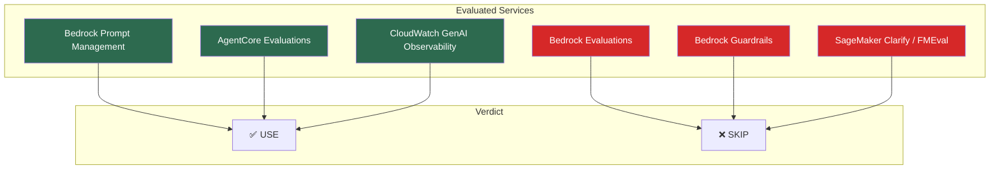
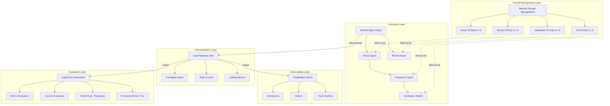
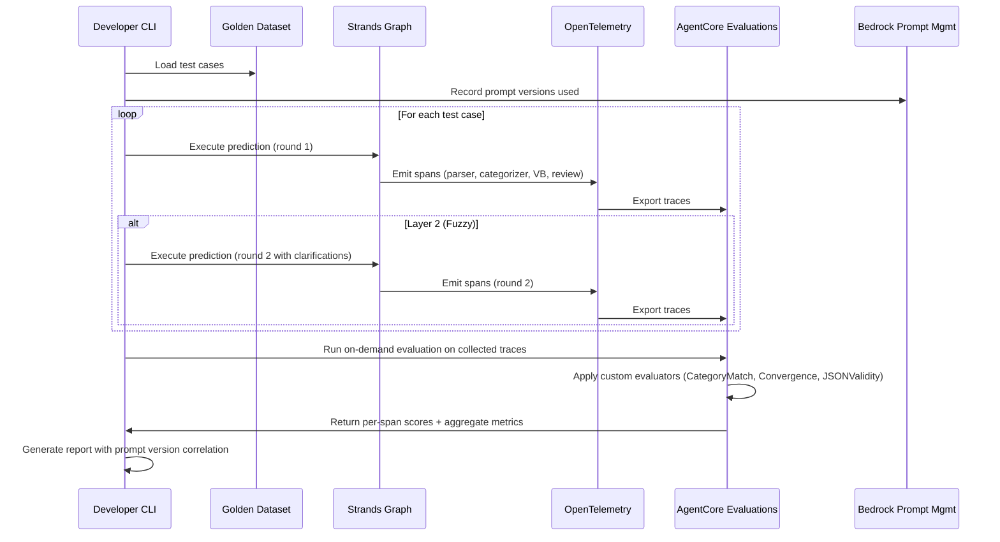
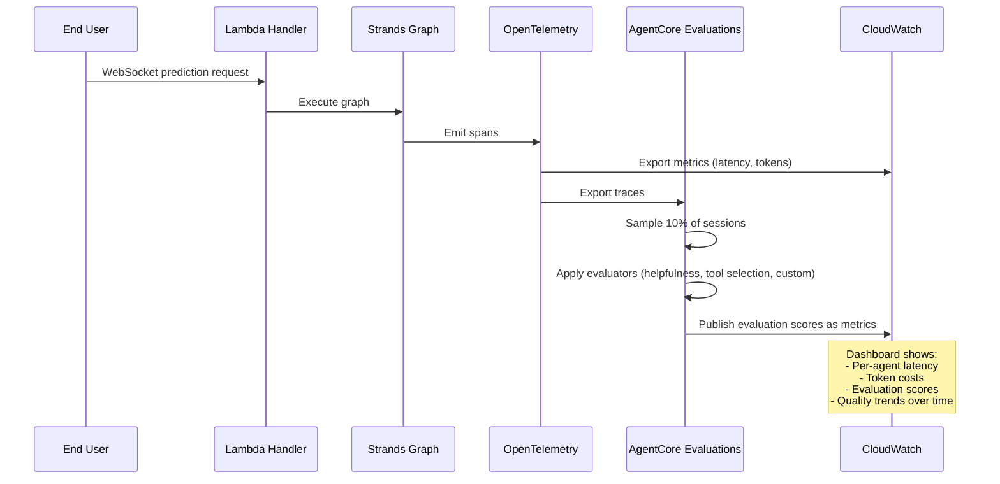
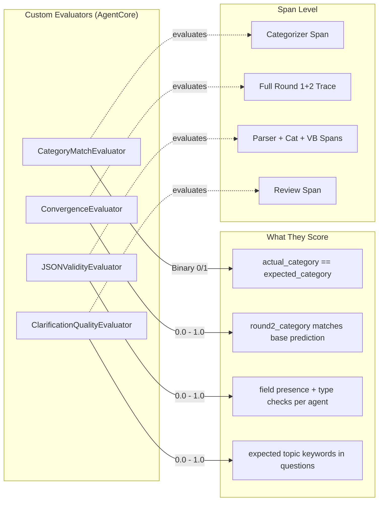

# Project Update 05 — Prompt Evaluation Strategy (Revised)

**Date:** March 9, 2026 (initial discussion); March 13, 2026 (revised strategy)
**Context:** Strategy for systematically improving agent prompts — evolved from custom framework to managed AWS services
**Audience:** Future self for project narrative; next agent for context pickup

### Referenced Kiro Specs
- `.kiro/specs/prompt-eval-framework/` — Spec 5: Prompt Evaluation Framework
  - `requirements.md` — COMPLETE (8 requirements) — NEEDS REWRITE for new architecture
  - `design.md` — NOT YET CREATED
  - `tasks.md` — NOT YET CREATED

### Prerequisite Reading
- `docs/project-updates/04-project-update-category-simplification.md` — Categories finalized (3-category system)

---

## The Original Problem

During testing, "Tomorrow will be a beautiful day" was correctly categorized as `human_verifiable_only` in round 1. After the user clarified "70+ degrees, sunny, New York," the categorizer should have upgraded the category — but it didn't. It clung to "beautiful is subjective" reasoning and ignored the clarification.

This revealed two issues:
1. The ReviewAgent over-assumed weather without confirming ("beautiful" could mean anything)
2. The categorizer under-utilized user clarifications

## The Deeper Problem (March 13 Analysis)

A thorough review of the existing requirements and agent code revealed gaps that go beyond "build a test harness":

1. **No prompt version control** — Prompts are hardcoded Python string constants (`PARSER_SYSTEM_PROMPT`, etc.). When you change a prompt, it's just a code commit. No way to correlate eval scores to specific prompt versions without git blame.

2. **No per-agent scoring isolation** — The original spec scores at the test-case level. If the parser returns bad dates, it cascades and tanks the categorizer's apparent accuracy. No way to isolate which agent caused a regression.

3. **No token/cost tracking** — Original spec counts "graph invocations" but each agent call has different token counts. No actual cost data.

4. **No per-agent latency** — Wall-clock per test case, but not per agent within the graph. Can't identify bottlenecks.

5. **Rigid clarification simulation** — Layer 2 uses static simulated answers. If the ReviewAgent asks unexpected questions, the static answer doesn't address them, and convergence fails for the wrong reason.

6. **No inter-agent contract testing** — Agents have implicit contracts (parser outputs JSON with specific fields, categorizer expects those fields). Nothing tests these contracts explicitly.

7. **No difficulty annotation** — No concept of "this test case is inherently hard." Can't distinguish "system is bad" from "test case is ambiguous."

8. **Tool manifest not parameterized** — Different tool registries produce different categorization results. The eval doesn't account for this.

## Philosophy Shift: Managed Services for Testing & Observability

The app itself remains low-cost serverless (Lambda + SAM + DynamoDB). That doesn't change. The philosophy shift applies specifically to the **testing, evaluation, and observability layers** — instead of building custom frameworks for those concerns, use managed AWS services with the least administrative overhead.

The app's runtime architecture stays cheap. The tooling around it gets serious.

A future option may be migrating the app runtime to Bedrock AgentCore, but we're not there yet — that's a separate decision for when AgentCore's runtime story matures beyond the current Lambda+Strands setup.

The goal: **Decisively prove with data how prompts affect the agent chain, and adjust prompts to maximize operational efficiency.**

---

## AWS Service Research (March 13, 2026)

### Services Evaluated



### Decision 16 (Revised): Bedrock Prompt Management — USE (Confidence: 8/10)

**What:** Managed service for creating, versioning, testing, and deploying prompts. Immutable version numbers, variant comparison, API-invokable via `InvokePrompt`.

**Why USE:**
- Native prompt versioning with immutable version numbers — solves the biggest gap
- Variables support — prompts already use dynamic content (prediction text, datetime, timezone)
- API-invokable — eval framework can call specific prompt versions programmatically
- No infrastructure to manage

**Tradeoffs:**
- Agents are Strands singletons with system prompts baked in at module level. Migration means fetching prompts from Bedrock at agent creation time instead of using `system_prompt=PARSER_SYSTEM_PROMPT`
- Adds a Bedrock API call at Lambda cold start (cacheable with SnapStart)
- Prompt Management is per-prompt, not per-graph — need to manage 4 prompts independently

**Mitigation — Test Graph Without SnapStart:**
Build a standalone test version of the prediction graph that runs locally without SnapStart, Lambda, or WebSocket delivery. This decouples eval development from the Lambda deployment lifecycle. The test graph uses the same agent factory functions and `build_prompt()` logic but skips `stream_async` two-push delivery and SnapStart hooks. This lets us iterate on OTEL instrumentation, prompt fetching, and evaluators without deploying to Lambda on every change.

**Mitigation — Feature Branch:**
This entire update (OTEL instrumentation, Prompt Management migration, AgentCore Evaluations) should be developed on a dedicated git branch (e.g., `feature/prompt-eval-framework`). The scope is large enough and touches enough core files (agent factories, prediction_graph.py, Lambda handler) that a bad integration could break production. The branch merges to main only after all phases pass eval and the existing prediction flow still works end-to-end.

**Migration path:**
```
Current:  PARSER_SYSTEM_PROMPT = """..."""  (Python constant)
Future:   prompt = bedrock_agent.get_prompt(promptIdentifier="parser-v1", promptVersion="3")
```

### Decision 17 (Revised): CloudWatch GenAI Observability — USE (Confidence: 8/10)

**What:** GA since October 2025. Out-of-the-box monitoring for AI workloads: latency, token usage, errors, end-to-end prompt tracing. Native Strands support via OpenTelemetry.

**Why USE:**
- Per-component latency (parser vs categorizer vs VB vs review separately)
- Token-level metrics per model invocation — actual cost data, not estimates
- End-to-end prompt tracing — see the full chain with each agent's contribution
- Dashboards and alarms — alert when token usage spikes or latency degrades
- Already in the CloudWatch ecosystem (Lambda logs)

**Tradeoffs:**
- Requires OpenTelemetry instrumentation in Lambda handler
- Need to verify OTEL collector compatibility with SnapStart lifecycle
- Observability only, not evaluation — tells you what happened, not whether it was correct

### Decision 23: AgentCore Evaluations — USE (Confidence: 5/10, High Differentiation)

**What:** Announced December 2025, preview. Purpose-built for evaluating agents. 13 built-in evaluators, custom evaluators, Strands integration via OTEL. Online evaluation (continuous production monitoring) and on-demand evaluation (targeted trace assessment).

**Why USE despite preview risk:**
- This is a learning app AND a portfolio piece. Being among the first to integrate AgentCore Evaluations with a real multi-agent Strands graph is significantly more impressive than a hand-rolled pytest harness
- Span-level analysis — evaluate individual agent nodes within a trace, not just final output. Directly solves per-agent scoring isolation
- Custom evaluators — build `category_match`, `convergence`, `json_validity` as AgentCore custom evaluators
- Online evaluation gives continuous production monitoring for free
- The methodology (golden dataset, convergence testing, per-agent scoring) stays ours — the execution platform becomes managed

**Risk mitigation:**
- If AgentCore Evaluations stalls or breaks, we still have OTEL traces, prompt versions, and CloudWatch data
- Can fall back to lightweight custom harness that reads the same traces
- The OTEL instrumentation work is valuable regardless — it feeds CloudWatch too

**What we'd build:**
- Custom evaluator: `CategoryMatchEvaluator` — deterministic binary score
- Custom evaluator: `ConvergenceEvaluator` — fuzzy-to-base prediction convergence
- Custom evaluator: `JSONValidityEvaluator` — structural scoring per agent
- Custom evaluator: `ClarificationQualityEvaluator` — topic keyword matching for ReviewAgent questions
- On-demand evaluation for development (run golden dataset, score traces)
- Online evaluation for production (sample 10% of live traffic, score continuously)

### Decision 24: Skip Bedrock Evaluations (Confidence: 6/10 — useful but redundant)

**What:** Managed evaluation service with LLM-as-a-judge and custom metrics. GA with BYOI support.

**Why SKIP:**
- Designed for single model input/output pairs, not multi-agent chains
- BYOI means we still run the graph ourselves — it only scores the output
- AgentCore Evaluations does everything this does plus span-level agent analysis
- Would be redundant with AgentCore custom evaluators

### Decision 25: Skip Bedrock Guardrails / Contextual Grounding (Confidence: 3/10)

**What:** Confidence scores for grounding and relevance. Designed for RAG and summarization.

**Why SKIP:**
- Our core problem is classification accuracy, not hallucination
- Agents return structured JSON, not prose — contextual grounding expects prose against source documents
- The categorizer's job is classification, not summarization. "Is `auto_verifiable` correct?" is not a grounding question

### Decision 26: Skip SageMaker Clarify / FMEval (Confidence: 4/10)

**What:** SageMaker's model evaluation suite. FMEval is the open-source library underneath.

**Why SKIP:**
- SageMaker is heavyweight — designed for ML teams with notebooks, training jobs, endpoints
- FMEval evaluates single model responses, not multi-agent chains
- Built-in metrics (toxicity, robustness) are irrelevant to our use case
- Overkill for ~25 test cases
- FMEval as a library is interesting but AgentCore Evaluations subsumes it

---

## Revised Architecture

### High-Level Architecture



### Evaluation Flow — Development (On-Demand)



### Evaluation Flow — Production (Online)



### Custom Evaluators Design



### Prompt Version Tracking Flow

```mermaid
graph LR
    subgraph "Before Eval Run"
        BPM[Bedrock Prompt Mgmt]
        BPM -->|"parser: v3<br/>categorizer: v5<br/>vb: v2<br/>review: v4"| MANIFEST[Prompt Version Manifest]
    end

    subgraph "During Eval Run"
        MANIFEST -->|recorded in| TRACE[OTEL Trace Attributes]
        TRACE -->|"span.attributes.prompt_version = 'parser:v3'"| SPANS[Per-Agent Spans]
    end

    subgraph "After Eval Run"
        SPANS -->|scored by| ACE[AgentCore Evaluations]
        ACE -->|"scores + prompt versions"| REPORT[Eval Report]
        REPORT -->|"parser:v3 scored 0.95<br/>categorizer:v5 scored 0.82"| HISTORY[Score History]
    end

    subgraph "Regression Detection"
        HISTORY -->|"categorizer:v5 < categorizer:v4"| ALERT[⚠️ Regression Detected]
    end
```



---

## Golden Dataset — Unchanged Methodology, New Execution

The layered test pyramid from the original strategy remains correct:

**Layer 1 — Base Predictions (fully specified):**
Predictions that need zero clarification. Ground truth for the system.

Example: "Tomorrow the high temperature in Central Park, New York will reach at least 70°F"
→ Expected: `auto_verifiable`, no clarification needed

**Layer 2 — Fuzzy Predictions (degraded versions of base):**
Same predictions with information removed. Tests the clarification loop.

Example: "Tomorrow will be a beautiful day"
→ Expected round 1: `human_only`
→ After clarification: should converge to base prediction's category

**New additions to golden dataset schema:**
- `difficulty` annotation (easy/medium/hard) for weighted scoring
- `tool_manifest_config` — which tools should be registered for this test case
- `expected_per_agent_outputs` — expected output per agent, not just final output

**Decision 15 still holds:** Clarification improves precision, not just verifiability. `human_only` predictions still benefit from clarification.

---

## Execution Order

### Phase 0: Setup
0. Create `feature/prompt-eval-framework` git branch — all work happens here, merges to main only after full validation
1. Build a standalone test graph (`test_prediction_graph.py`) that runs locally without SnapStart, Lambda, or WebSocket — same agent factories and `build_prompt()` logic, synchronous execution, no deployment needed

### Phase 1: Instrumentation Foundation
2. Add OpenTelemetry instrumentation to the Strands graph (test graph first, then Lambda handler)
3. Configure CloudWatch GenAI Observability to receive OTEL traces
4. Verify SnapStart compatibility with OTEL collector
5. Build dashboards for per-agent latency and token usage

### Phase 2: Prompt Management Migration
6. Create 4 managed prompts in Bedrock Prompt Management (parser, categorizer, VB, review)
7. Migrate agent factory functions to fetch prompts from Bedrock at init
8. Verify SnapStart caching of fetched prompts
9. Create initial prompt versions (v1 = current hardcoded prompts)

### Phase 3: AgentCore Evaluations Integration
10. Build custom evaluators (CategoryMatch, Convergence, JSONValidity, ClarificationQuality)
11. Create golden dataset with new schema (difficulty, tool_manifest_config, per-agent expected outputs)
12. Implement on-demand evaluation CLI for development
13. Configure online evaluation for production (10% sampling)

### Phase 4: Score Tracking & Regression Detection
14. Build prompt version correlation into eval reports
15. Implement score history with prompt version metadata
16. Set up CloudWatch alarms for evaluation score degradation

---

## Risk Assessment

| Risk | Likelihood | Impact | Mitigation |
|---|---|---|---|
| AgentCore Evaluations API changes (preview) | Medium | Medium | OTEL traces + CloudWatch as fallback; custom harness reads same traces |
| SnapStart + OTEL collector incompatibility | Low | High | Test early in Phase 1; fallback to per-invocation collector init |
| Bedrock Prompt Management cold start latency | Low | Medium | Cache prompts aggressively; SnapStart snapshot includes cached prompts |
| AgentCore Evaluations not available in us-west-2 | Low | High | Check regional availability before starting Phase 3 |
| Custom evaluator complexity exceeds preview limits | Medium | Low | Start with CategoryMatch (simplest), iterate |

---

## What the Next Agent Should Do

1. Read this update for full context on the revised strategy
2. Rewrite `.kiro/specs/prompt-eval-framework/requirements.md` to reflect the new 3-service architecture (Bedrock Prompt Management + CloudWatch GenAI Observability + AgentCore Evaluations)
3. The requirements should be phased (Phase 1-4 as described above)
4. The golden dataset must use the 3-category system (`auto_verifiable`, `automatable`, `human_only`)
5. Custom evaluators should be designed as AgentCore custom evaluators, not standalone pytest functions
6. The `Verifiability_Category` glossary entry needs the 3-category values

---

## Appendix: Services Evaluated — Full Analysis

### Bedrock Prompt Management (USE — Confidence 8/10)
- **Solves:** Prompt versioning, variant comparison, API-invokable prompts
- **Doesn't solve:** Evaluation, observability
- **Status:** GA, available in us-west-2
- **Cost model:** API calls for prompt management operations + model invocations

### CloudWatch GenAI Observability (USE — Confidence 8/10)
- **Solves:** Per-agent latency, token counts, end-to-end tracing, dashboards, alarms
- **Doesn't solve:** Quality scoring (is the output correct?)
- **Status:** GA since October 2025, native Strands support
- **Cost model:** Standard CloudWatch pricing for metrics, logs, traces

### AgentCore Evaluations (USE — Confidence 5/10, High Differentiation)
- **Solves:** Per-agent quality scoring, custom evaluators, online + on-demand evaluation, span-level analysis
- **Doesn't solve:** Prompt versioning, operational metrics (delegates to CloudWatch)
- **Status:** Preview (December 2025), Strands integration via OTEL
- **Cost model:** Unknown (preview), likely per-evaluation + judge model invocations
- **Differentiator:** Among the first real-world integrations with a multi-agent Strands graph

### Bedrock Evaluations (SKIP — Confidence 6/10)
- **Why skip:** Single model focus, redundant with AgentCore Evaluations, BYOI still requires running graph ourselves
- **Reconsider if:** AgentCore Evaluations doesn't GA or doesn't support custom metrics well enough

### Bedrock Guardrails / Contextual Grounding (SKIP — Confidence 3/10)
- **Why skip:** Designed for RAG/summarization, not structured JSON classification. Wrong problem shape.
- **Reconsider if:** We add a RAG component or need hallucination detection in prose outputs

### SageMaker Clarify / FMEval (SKIP — Confidence 4/10)
- **Why skip:** Heavyweight platform for ML teams, single-model focus, overkill for ~25 test cases
- **Reconsider if:** Scale grows to thousands of test cases or we need human evaluation workflows
